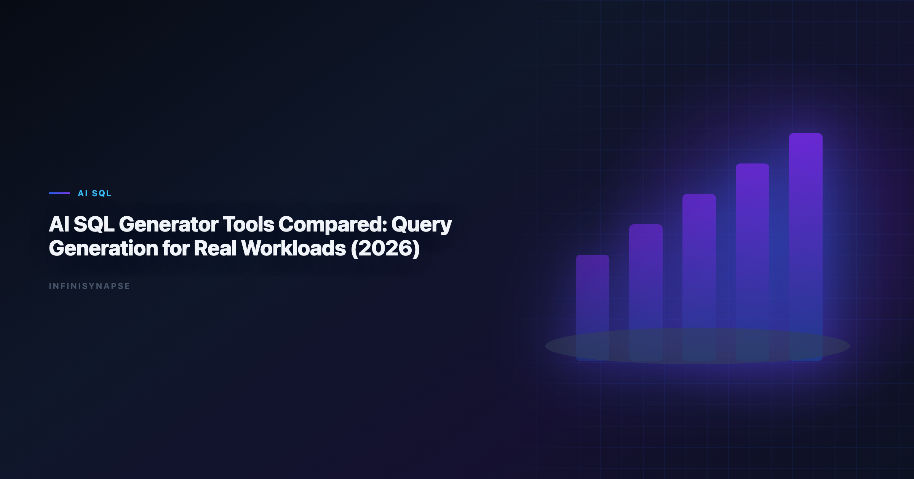

# AI SQL Generator: Categories, Scorecard, and Buyer Guide (2026)

> **By the InfiniSynapse Data Team** · **Last updated: 2026-06-09** · *We build InfiniSynapse, a production-grade SQL agent platform with audit trail and reusable workflow memory.*

**Meta Description**: Compare ai sql generator categories with a scorecard for autonomy, correctness, and governance — a buyer guide for analyst and data teams in 2026.

**Slug**: `/blog/ai-sql-generator`

**Target keyword**: `ai sql generator`
**Secondary**: `sql copilot comparison`, `agentic sql tools`, `text to sql llm`

---

## Table of Contents

1. [TL;DR](#tldr)
2. [Why this matters now](#why-this-matters-now)
3. [Key Definition](#key-definition)
4. [Evaluation Basis: Scorecard](#evaluation-basis-scorecard)
5. [Category Map: Prompt Copilot vs Guided BI vs Agent](#category-map-prompt-copilot-vs-guided-bi-vs-agent)
6. [Hands-on Comparison Framework We Apply](#hands-on-comparison-framework-we-apply)
7. [InfiniSynapse Production Pattern](#infinisynapse-production-pattern)
8. [Choosing by Workflow, Not by Demo](#choosing-by-workflow-not-by-demo)
9. [Framework Signals](#framework-signals)
10. [Common Failure Patterns](#common-failure-patterns)
11. [Production Debugging Notes](#production-debugging-notes)
12. [Operational Readiness Notes](#operational-readiness-notes)
13. [Stakeholder Communication Patterns](#stakeholder-communication-patterns)
14. [Frequently Asked Questions](#frequently-asked-questions)
15. [Conclusion](#conclusion)
---

## TL;DR

> Teams adopting an **ai sql generator** should optimize for repeatable correctness, auditability, and business trust. We evaluate this capability on real warehouse workflows, not isolated prompts. Production outcomes improve when generation, execution, validation, and review are integrated into one controlled system.

Production rollouts should align access and review controls with the [PostgreSQL documentation](https://www.postgresql.org/docs/), especially when recurring queries touch live schemas.

> **Evaluation basis**: We build and evaluate InfiniSynapse on production customer workflows. Governance, adoption, and security context is cited inline throughout this guide—not in a standalone reference list.

If Sql is in scope for your team, reuse the same memory-and-trace checklist in [Natural Language to SQL Guide](/blog/natural-language-to-sql).
Analysts wiring Sql into production reviews can follow the parallel walkthrough in [Text-to-SQL LLM Systems](/blog/text-to-sql-llm).

## Why this matters now

Enterprise teams adopting an **ai sql generator** are under pressure to deliver faster analytics while maintaining governance and decision quality. AI-assisted SQL can unlock major productivity gains, but only when teams standardize how requests are grounded, generated, verified, and approved. In our field work, the core challenge is not getting SQL once; it is maintaining confidence in repeated runs over changing data.

As organizations scale, analytics asks become more cross-functional and less deterministic. Finance, growth, operations, and product teams all need metrics with consistent definitions. That is why architecture and process matter as much as model capability.

---

## Key Definition

> **Key Definition**: In this article, an **ai sql generator** means translating natural-language business intent into executable SQL within a governed workflow that preserves assumptions, validation checks, and traceable output lineage.

This definition reframes AI SQL from an interface feature to an operating capability. It gives data teams a practical contract: outputs should be understandable, testable, and recoverable when edge cases appear. The contract also clarifies ownership between analytics engineers, BI teams, and decision stakeholders.

---

## Evaluation Basis: Scorecard

We use one production scorecard across pilots and post-launch reviews. Leaderboard scores on the [PostgreSQL documentation](https://www.postgresql.org/docs/) are a useful sanity check but rarely predict enterprise schema drift on their own. The [Spider NL2SQL benchmark](https://yale-lily.github.io/spider) adds dirty-schema realism that Spider-only leaderboards under-weight in production. Warehouse vendors describe governed NL2SQL agents in [Wikipedia statistics overview](https://en.wikipedia.org/wiki/Statistics)—compare memory depth and audit trails against your internal requirements. The credential, preflight, and SQL-trace pattern above also applies to Nl2Sql—see [Spider and BIRD Benchmarks for NL2SQL](/blog/nl2sql-benchmark-spider-bird) for source-specific steps.

| Criterion | Why it matters | Pass signal |
|---|---|---|
| Grounding quality | Prevents wrong-table SQL | Correct model of schema and metrics |
| Execution reliability | Protects delivery timelines | Recoverable failures and stable reruns |
| Result trustworthiness | Reduces business risk | Outputs match analyst-reviewed baselines |
| Governance fit | Enables enterprise rollout | Access controls and logs are complete |
| Operational effort | Controls total cost | Less manual rework after week four |
| Reusability | Improves long-run leverage | Repeated workflows get faster and safer |

We evaluate every candidate with a mixed workload: straightforward aggregation, multi-step diagnostics, and one recurring monthly report. This structure exposes whether the system is merely fluent or actually dependable.

---

## Category Map: Prompt Copilot vs Guided BI vs Agent

This phase focuses on where tools perform strongly and where they degrade. We check intent coverage, join correctness, and fallback behavior under noisy data. We also measure how much manual intervention is needed to deliver stakeholder-ready results.

Most teams discover that one-shot prompt workflows look strong in quick demos but produce hidden rework under real pressure. Systems with guided execution and transparent assumptions generally hold quality longer.

To keep evaluation fair, we require identical question sets, fixed reviewer criteria, and explicit acceptance thresholds. This prevents preference bias and helps teams compare tools by operational reality.

---

## Hands-on Comparison Framework We Apply

Architecture decisions drive reliability. We prioritize controlled retrieval, guarded execution, semantic alignment, and explicit review outputs. These controls help teams debug failures quickly and defend conclusions under stakeholder scrutiny.

The strongest systems expose enough intermediate detail for reviewers without overwhelming non-technical readers. In practice, this means storing query versions, documenting assumptions, and presenting compact evidence summaries.

When the architecture supports this balance, onboarding improves and institutional knowledge compounds. Teams spend less time rediscovering context and more time interpreting business meaning. LLM-backed analytics should account for prompt-injection and data-exfiltration risks in the [Wikipedia machine learning overview](https://en.wikipedia.org/wiki/Machine_learning), especially when connectors expose production schemas.

---

## InfiniSynapse Production Pattern

InfiniSynapse is positioned as a production-grade SQL agent, not a prompt-only NL2SQL layer. We evaluate and build around five practical rules:

1. Ground each request with current schema and metric context.
2. Execute with fallback logic and explicit error classes.
3. Validate results with semantic and statistical checks.
4. Preserve end-to-end audit trails for reviewer sign-off.
5. Distill reusable memory to improve next-run quality.

This pattern is intentionally operational. It aligns platform governance, analyst workflow, and business accountability in one repeatable loop.

---

## Choosing by Workflow, Not by Demo

A practical rollout path works better than broad all-at-once launch:

- **Days 1-30**: define scope, boundaries, and success criteria.
- **Days 31-60**: run side-by-side pilots with analyst baselines.
- **Days 61-90**: productionize high-value workflows and monitor drift.

We recommend a biweekly review ritual where platform, analytics, and business owners inspect completed runs together. Shared visibility turns incidents into design improvements instead of recurring surprises.

---

## Production-Readiness Signals to Check

Use this signal checklist to keep a generator rollout grounded:

- Signal 1: correctness at first pass on representative tasks.
- Signal 2: recovery quality after deliberate error injection.
- Signal 3: reviewer confidence in output lineage.
- Signal 4: rerun stability after schema or policy updates.
- Signal 5: net time saved versus analyst-only baseline.
- Signal 6: reduction in unresolved metric disputes.
- Signal 7: clarity of ownership during incidents.
- Signal 8: trend of manual intervention over time.

---

## Three Categories of AI SQL Generator

Buyers lump every tool into one bucket, but in practice an AI SQL generator falls into one of three categories, and the category predicts production behavior better than any benchmark.

**Autocomplete generators** live in the editor or notebook and finish SQL as you type. They are fast for engineers who already know the schema, but they assume a human owns correctness — there is no grounding, no validation, and no memory between sessions. They suit ad-hoc exploration, not recurring reporting.

**Chat-to-SQL generators** take a natural-language question and return a query in a conversation. They feel magical in demos because the schema is small and clean. Under production schemas they degrade quietly: they guess at metric definitions, miss governed joins, and forget context when the chat closes. This is where most disappointment with an **ai sql generator** originates.

**Governed SQL agents** treat generation as one step in an audited loop: ground the request against current schema and metric contracts, execute with fallback logic, validate against baselines, and persist reusable memory. They are slower to set up but compound in reliability, because the second and tenth runs reuse the same validated definitions.

The practical rule we give buyers: match the category to the job. Use autocomplete for engineers, chat-to-SQL for one-off questions, and a governed agent for anything a stakeholder must defend a week later. Mixing them up — buying an autocomplete tool for recurring board packs — is the most common and most expensive procurement mistake we see.

---

## Common Failure Patterns

Across **ai sql generator** deployments, we repeatedly see preventable failure modes: demo-driven procurement, missing semantic definitions, weak change management, and fragmented review ownership. Most of these issues are process gaps, not model gaps.

The fix is disciplined governance with transparent architecture. Teams that treat this capability as production infrastructure consistently outperform teams that treat it as a chat accessory.

---

## Debugging an AI SQL Generator in Production

When an AI SQL generator stalls after the first month, the model is rarely the cause. The recurring offenders are schema drift, ambiguous metric names, stale statistics, and missing join keys — each producing confident but wrong SQL. We run a fixed triage: confirm the schema snapshot, then metric definitions, then table statistics, then join cardinality, before touching the prompt or swapping models. Comparing each generator's output to a human-reviewed baseline query pack turns disagreements into regression tests rather than debates — the same verification-first discipline domain teams apply when validating the numbers behind dashboards in [OWASP Top 10 for LLM Applications](https://owasp.org/www-project-top-10-for-large-language-model-applications/).

Category matters as much as model. A pure code-completion generator optimizes for plausible SQL; a governed agent optimizes for a defensible answer. Teams running mixed warehouses should pin dialect function translations in memory so a generator does not silently rewrite date truncations, and should align deployment topology with the [UK NCSC AI development guidelines](https://www.ncsc.gov.uk/collection/guidelines-secure-ai-system-development) so credentials and review gates stay explicit. If a small schema change forces a full rebuild, the bottleneck is orchestration, not the model — the clearest sign you bought a chat accessory rather than production infrastructure for an **ai sql generator**.

---

## Operating and Communicating Results

Share weekly query accuracy, reviewer load, and schema-drift flags with platform owners so the generator never slips into silent-failure mode, and fix owners, metric contracts, and review gates before widening scope. Keep the display layer separate from the analysis layer — a recurring confusion when teams evaluate generators alongside BI tools, which is why it helps to reference how [NIST Computer Security Resource Center](https://csrc.nist.gov/) frame visualization versus computation. As the generator spans more sources, connector design should keep domain boundaries explicit in the spirit of the [Google SRE book](https://sre.google/sre-book/table-of-contents/), and recurring analytics loops should borrow scheduling, retry, and lineage patterns from the [EU AI Act overview](https://digital-strategy.ec.europa.eu/en/policies/european-approach-artificial-intelligence). When cycle time improves but reopen rates climb, pause net-new features and fix definitions first — most "accuracy" problems trace to stale dimensions, not weak models.

## Production Debugging Notes

When an **ai sql generator** pilots stall at week three, the root cause is rarely the LLM. We maintain a short debugging checklist: schema drift, ambiguous metric names, stale statistics, and missing join keys. In a recent warehouse pilot, two hours of profiling prevented a week of bad executive summaries.

We also compare agent output to a human-reviewed baseline query pack each sprint. Disagreements become regression tests—not arguments. That practice aligns with [BIRD NL2SQL benchmark](https://bird-bench.github.io/) guidance on trust through verification, not blind automation.

Dialect quirks matter. Teams running mixed warehouses should document function translations in memory so an **ai sql generator** does not silently rewrite date truncations. The [PostgreSQL documentation](https://www.postgresql.org/docs/) shows adoption rising while trust lags; verification rituals close that gap.

Finally, measure partial reruns. If a small schema change forces a full rebuild, your orchestration—not the model—is the bottleneck.

---

## Frequently Asked Questions

### How do we evaluate production readiness?

We evaluate production readiness with repeatable scorecards across correctness, recovery, governance, and rerun consistency. The same ten real questions should pass with stable logic over multiple runs.

### Why do prompt-only SQL demos fail later?

Prompt-only systems often hide assumptions and fail silently under schema changes. That is why ai sql generator should be evaluated with execution logs, reviewer sign-off, and post-incident learning loops.

### Is benchmark rank enough to choose a platform?

No. Benchmarks provide useful directional signals, but deployment outcomes depend on context grounding, policy enforcement, and the quality of operational controls.

### When should teams involve human reviewers?

Human review is essential for high-stakes reporting, regulated domains, and any workflow where business definitions are ambiguous or recently updated.

### Why position InfiniSynapse as a SQL agent, not just a text-to-SQL app?

Because production teams need complete workflow traceability. InfiniSynapse focuses on auditable execution paths, reusable memory, and safer recurring operations.

### Is a free generator good enough for production?

For ad-hoc exploration, yes — a free autocomplete or chat-to-SQL tool is fine when an analyst owns correctness. For recurring, decision-grade reporting it usually is not, because free tools rarely offer grounding against your metric definitions, execution validation, audit trails, or reusable memory. The cost that matters is not the license; it is the rework and the undefendable numbers that surface on the second and tenth run.

---

## Conclusion

The main lesson from **ai sql generator** production deployments is straightforward: model quality matters, but operating design matters more. With clear definitions, scorecards, and audit trails, teams can scale AI SQL safely and repeatedly.

For InfiniSynapse, the positioning remains explicit: production-grade SQL agent with inspectable workflows and reusable memory, contrasted with prompt-only approaches that struggle under recurring business pressure.

---