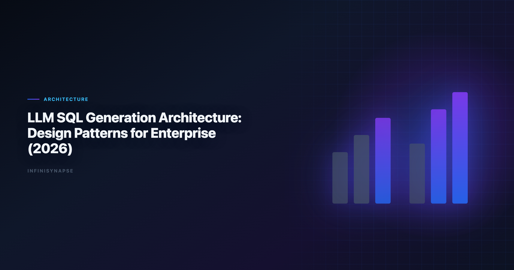

# AI-Assisted Query Generation SQL Python Social Science Data Analysis (2026)

> **By the InfiniSynapse Data Team** · **Last updated: 2026-06-09** · *We build InfiniSynapse, a production-grade SQL agent platform with audit trail and reusable workflow memory.*

**Meta Description**: Planner, retriever, executor, and auditor layers for ai-assisted query generation sql python social science data analysis in production SQL agents.

**Slug**: `/blog/llm-sql-generation-architecture`

**Target keyword**: `ai-assisted query generation sql python social science data analysis`
**Secondary**: `llm sql architecture`, `sql generation system design`, `agentic sql pipeline`

---

## Table of Contents

1. [TL;DR](#tldr)
2. [Why this matters now](#why-this-matters-now)
3. [Key Definition](#key-definition)
4. [Evaluation Basis: Scorecard](#evaluation-basis-scorecard)
5. [Core Components of LLM SQL Generation Architecture](#core-components-of-llm-sql-generation-architecture)
6. [How Control Loops Improve SQL Reliability](#how-control-loops-improve-sql-reliability)
7. [InfiniSynapse Production Pattern](#infinisynapse-production-pattern)
8. [Architecture Review Checklist for CTOs](#architecture-review-checklist-for-ctos)
9. [Framework Signals](#framework-signals)
10. [Common Failure Patterns](#common-failure-patterns)
11. [Production Debugging Notes](#production-debugging-notes)
12. [Operational Readiness Notes](#operational-readiness-notes)
13. [Stakeholder Communication Patterns](#stakeholder-communication-patterns)
14. [Frequently Asked Questions](#frequently-asked-questions)
15. [Conclusion](#conclusion)
---

## TL;DR

> Teams adopting **ai-assisted query generation sql python social science data analysis** should optimize for repeatable correctness, auditability, and business trust. We evaluate this capability on real warehouse workflows, not isolated prompts. Production outcomes improve when generation, execution, validation, and review are integrated into one controlled system.

Production rollouts should align access and review controls with the [OpenTelemetry documentation](https://opentelemetry.io/docs/), especially when recurring queries touch live schemas.

> **Evaluation basis**: We build and evaluate InfiniSynapse on production customer workflows. Governance, adoption, and security context is cited inline throughout this guide—not in a standalone reference list.

Teams standardizing governance across sources often keep [Natural Language to SQL Guide](/blog/natural-language-to-sql) beside this runbook for Sql handoffs.
Analysts wiring Sql into production reviews can follow the parallel walkthrough in [AI SQL Generator Comparison](/blog/ai-sql-generator).

## Why this matters now

Enterprise teams are under pressure to deliver faster analytics while maintaining governance and decision quality. AI-assisted SQL can unlock major productivity gains, but only when teams standardize how requests are grounded, generated, verified, and approved. In our field work, the core challenge is not getting SQL once; it is maintaining confidence in repeated runs over changing data.

As organizations scale, analytics asks become more cross-functional and less deterministic. Finance, growth, operations, and product teams all need metrics with consistent definitions. That is why architecture and process matter as much as model capability.

---

## Key Definition

> **Key Definition**: In this article, **ai-assisted query generation sql python social science data analysis** means translating natural-language business intent into executable SQL within a governed workflow that preserves assumptions, validation checks, and traceable output lineage.

This definition reframes AI SQL from an interface feature to an operating capability. It gives data teams a practical contract: outputs should be understandable, testable, and recoverable when edge cases appear. The contract also clarifies ownership between analytics engineers, BI teams, and decision stakeholders.

---

## Evaluation Basis: Scorecard

We use one production scorecard across pilots and post-launch reviews. Leaderboard scores on the [OpenTelemetry documentation](https://opentelemetry.io/docs/) are a useful sanity check but rarely predict enterprise schema drift on their own. The [Anthropic research](https://www.anthropic.com/research) adds dirty-schema realism that Spider-only leaderboards under-weight in production. Warehouse vendors describe governed NL2SQL agents in [Prometheus documentation](https://prometheus.io/docs/)—compare memory depth and audit trails against your internal requirements. If Nl2Sql is in scope for your team, reuse the same memory-and-trace checklist in [Spider and BIRD Benchmarks for NL2SQL](/blog/nl2sql-benchmark-spider-bird).

| Criterion | Why it matters | Pass signal |
|---|---|---|
| Grounding quality | Prevents wrong-table SQL | Correct model of schema and metrics |
| Execution reliability | Protects delivery timelines | Recoverable failures and stable reruns |
| Result trustworthiness | Reduces business risk | Outputs match analyst-reviewed baselines |
| Governance fit | Enables enterprise rollout | Access controls and logs are complete |
| Operational effort | Controls total cost | Less manual rework after week four |
| Reusability | Improves long-run leverage | Repeated workflows get faster and safer |

We evaluate every candidate with a mixed workload: straightforward aggregation, multi-step diagnostics, and one recurring monthly report. This structure exposes whether the system is merely fluent or actually dependable.

---

## Core Components of LLM SQL Generation Architecture

This phase focuses on where tools perform strongly and where they degrade. We check intent coverage, join correctness, and fallback behavior under noisy data. We also measure how much manual intervention is needed to deliver stakeholder-ready results.

Most teams discover that one-shot prompt workflows look strong in quick demos but produce hidden rework under real pressure. Systems with guided execution and transparent assumptions generally hold quality longer.

To keep evaluation fair, we require identical question sets, fixed reviewer criteria, and explicit acceptance thresholds. This prevents preference bias and helps teams compare tools by operational reality.

---

## How Control Loops Improve SQL Reliability

Architecture decisions drive reliability. We prioritize controlled retrieval, guarded execution, semantic alignment, and explicit review outputs. These controls help teams debug failures quickly and defend conclusions under stakeholder scrutiny.

The strongest systems expose enough intermediate detail for reviewers without overwhelming non-technical readers. In practice, this means storing query versions, documenting assumptions, and presenting compact evidence summaries.

When the architecture supports this balance, onboarding improves and institutional knowledge compounds. Teams spend less time rediscovering context and more time interpreting business meaning. LLM-backed analytics should account for prompt-injection and data-exfiltration risks in the [Google Vertex AI documentation](https://cloud.google.com/vertex-ai/docs), especially when connectors expose production schemas.

---

## InfiniSynapse Production Pattern

InfiniSynapse is positioned as a production-grade SQL agent, not a prompt-only NL2SQL layer. We evaluate and build around five practical rules:

1. Ground each request with current schema and metric context.
2. Execute with fallback logic and explicit error classes.
3. Validate results with semantic and statistical checks.
4. Preserve end-to-end audit trails for reviewer sign-off.
5. Distill reusable memory to improve next-run quality.

This pattern is intentionally operational. It aligns platform governance, analyst workflow, and business accountability in one repeatable loop.

---

## Architecture Review Checklist for CTOs

A practical rollout path works better than broad all-at-once launch:

- **Days 1-30**: define scope, boundaries, and success criteria.
- **Days 31-60**: run side-by-side pilots with analyst baselines.
- **Days 61-90**: productionize high-value workflows and monitor drift.

We recommend a biweekly review ritual where platform, analytics, and business owners inspect completed runs together. Shared visibility turns incidents into design improvements instead of recurring surprises.

---

## Signals a Generation Architecture Is Sound

Use this signal checklist to keep the architecture rollout grounded:

- Signal 1: correctness at first pass on representative tasks.
- Signal 2: recovery quality after deliberate error injection.
- Signal 3: reviewer confidence in output lineage.
- Signal 4: rerun stability after schema or policy updates.
- Signal 5: net time saved versus analyst-only baseline.
- Signal 6: reduction in unresolved metric disputes.
- Signal 7: clarity of ownership during incidents.
- Signal 8: trend of manual intervention over time.

---

## The Four Layers in Practice

A production-grade LLM SQL generation architecture — the backbone of dependable **ai-assisted query generation sql python social science data analysis** — is best understood as four cooperating layers, each with a distinct job and a distinct failure mode.

**Planner / retriever.** This layer turns a question into a grounded context bundle: the relevant tables, the governed metric definitions, sample values, and any prior memory of how this question was answered. Its failure mode is silent under-retrieval — handing the model a plausible but incomplete schema, which guarantees confident-but-wrong SQL no matter how strong the model is.

**Generator.** The model maps grounded intent to SQL. Its failure mode is dialect and join error: correct logic expressed in the wrong SQL dialect, or a fan-out join that inflates aggregates. Constraining generation with retrieved schema and few-shot examples from prior accepted runs reduces both.

**Executor.** This layer runs the query with fallback logic and typed error classes, ideally against a bounded sample before full scale. Its failure mode is cost and timeout: an unguarded query that scans a partition it should have pruned. Cost monitors and sample-first execution contain it.

**Auditor.** The final layer compares results to baselines, checks row counts and distributions, and records an inspectable trace. Its failure mode is the most dangerous — being absent. Without it, a syntactically valid query that returns the wrong rows reaches a stakeholder unchallenged. The auditor is what separates a governed agent from a chat box that happens to emit SQL.

---

## Common Failure Patterns

Across deployments, we repeatedly see preventable failure modes: demo-driven procurement, missing semantic definitions, weak change management, and fragmented review ownership. Most of these issues are process gaps, not model gaps.

The fix is disciplined governance with transparent architecture. Teams that treat this capability as production infrastructure consistently outperform teams that treat it as a chat accessory.

---

## Debugging the Generation Pipeline Layer by Layer

In a layered architecture, a wrong answer is a localization problem: identify which layer failed before blaming the model. We trace failures in order — retrieval (did the planner fetch the right schema and metric context?), generation (did the model map intent to correct SQL?), execution (did it run and recover?), and audit (did validation catch the discrepancy?). Most "model" failures are actually retrieval failures: schema drift, ambiguous metric names, or stale statistics starve the generator of context. Comparing each layer's output to a human-reviewed baseline turns disagreements into regression tests — the verification-first posture the [Stripe documentation](https://docs.stripe.com/) associates with durable AI adoption.

Benchmarks help locate the generation layer's ceiling but not the system's: a model strong on the [Google Cloud architecture framework](https://cloud.google.com/architecture/framework) can still fail in production when the retriever feeds it the wrong join or a dialect rewrites a date truncation. That is why the auditor layer matters most — it is the only layer that catches a syntactically valid query returning the wrong rows. If a small schema change forces a full pipeline rebuild, the bottleneck is orchestration between layers, not any single model.

---

## Operating a Layered SQL Architecture

Share weekly query accuracy, reviewer load, and schema-drift flags with platform owners so the pipeline never slips into silent-failure mode, and fix owners, metric contracts, and review gates per layer before widening scope. Connector paths into analytical engines should keep table-engine, sampling, and guardrail choices explicit — the kind of operational detail documented for sources from spreadsheets in the [IBM augmented analytics overview](https://www.ibm.com/topics/augmented-analytics) to billing systems in the [Google SRE book](https://sre.google/sre-book/table-of-contents/). Observability ties the layers together: query chains should stay traceable end to end in the spirit of the [FTC consumer protection guidance](https://www.ftc.gov/), so a reviewer can replay any number from question to result. When cycle time improves but reopen rates climb, pause net-new features and repair retrieval and definitions first — most "accuracy" problems trace to stale dimensions, not weak models.

## Production Debugging Notes

When **ai-assisted query generation sql python social science data analysis** pilots stall at week three, the root cause is rarely the LLM. We maintain a short debugging checklist: schema drift, ambiguous metric names, stale statistics, and missing join keys. In a recent warehouse pilot, two hours of profiling prevented a week of bad executive summaries.

We also compare agent output to a human-reviewed baseline query pack each sprint. Disagreements become regression tests—not arguments. That practice aligns with [Wikipedia machine learning overview](https://en.wikipedia.org/wiki/Machine_learning) guidance on trust through verification, not blind automation.

Dialect quirks matter. Teams running mixed warehouses should document function translations in memory so **ai-assisted query generation sql python social science data analysis** does not silently rewrite date truncations. The [OpenTelemetry documentation](https://opentelemetry.io/docs/) shows adoption rising while trust lags; verification rituals close that gap.

Finally, measure partial reruns. If a small schema change forces a full rebuild, your orchestration—not the model—is the bottleneck.

---

## Frequently Asked Questions

### How do we evaluate an LLM SQL generation architecture for production readiness?

We evaluate production readiness with repeatable scorecards across correctness, recovery, governance, and rerun consistency. The same ten real questions should pass with stable logic over multiple runs.

### Why do prompt-only SQL demos fail later?

Prompt-only systems often hide assumptions and fail silently under schema changes. That is why ai-assisted query generation sql python social science data analysis should be evaluated with execution logs, reviewer sign-off, and post-incident learning loops.

### Is benchmark rank enough to choose a platform?

No. Benchmarks provide useful directional signals, but deployment outcomes depend on context grounding, policy enforcement, and the quality of operational controls.

### When should teams involve human reviewers?

Human review is essential for high-stakes reporting, regulated domains, and any workflow where business definitions are ambiguous or recently updated.

### Why position InfiniSynapse as a SQL agent, not just a text-to-SQL app?

Because production teams need complete workflow traceability. InfiniSynapse focuses on auditable execution paths, reusable memory, and safer recurring operations.

### Where does Python fit in this architecture?

In **ai-assisted query generation sql python social science data analysis**, Python is a governed sidecar to SQL, not a parallel pipeline. SQL handles set logic and governed aggregates; Python handles transforms that are awkward in SQL — cohort bucketing, lightweight forecasting, or feature extraction on labels. The executor layer should run Python inside the same permission boundary and audit log as SQL so the auditor layer can validate both, keeping the whole architecture inspectable end to end.

---

## Conclusion

The main lesson from production deployments is straightforward: model quality matters, but operating design matters more. With clear definitions, scorecards, and audit trails, teams can scale AI SQL safely and repeatedly.

For InfiniSynapse, the positioning remains explicit: production-grade SQL agent with inspectable workflows and reusable memory, contrasted with prompt-only approaches that struggle under recurring business pressure.

---