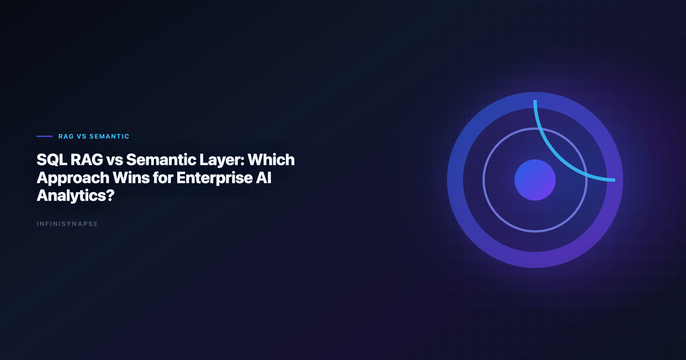

# Ai-Powered Semantic Layers for Enterprise Data Strategy: Strategy Guide

> **By the InfiniSynapse Data Team** · **Last updated: 2026-06-09** · *We build InfiniSynapse, a production-grade SQL agent platform with audit trail and reusable workflow memory.*

**Meta Description**: Strategy Guide. Practical guidance on ai-powered semantic layers for enterprise data strategy for data teams in 2026. Includes worked examples and a FAQ.

**Slug**: `/blog/sql-rag-vs-semantic-layer`

**Target keyword**: `ai-powered semantic layers for enterprise data strategy`
**Secondary**: `sql rag`, `semantic layer strategy`, `enterprise nl2sql`

---

## Table of Contents

1. [TL;DR](#tldr)
2. [Why this matters now](#why-this-matters-now)
3. [Key Definition](#key-definition)
4. [Evaluation Basis: Scorecard](#evaluation-basis-scorecard)
5. [RAG Strengths and Limits for SQL Workloads](#rag-strengths-and-limits-for-sql-workloads)
6. [Semantic Layer Strengths and Limits](#semantic-layer-strengths-and-limits)
7. [InfiniSynapse Production Pattern](#infinisynapse-production-pattern)
8. [Hybrid Pattern: RAG + Semantic Layer + Audit Trail](#hybrid-pattern-rag-semantic-layer-audit-trail)
9. [Framework Signals](#framework-signals)
10. [Common Failure Patterns](#common-failure-patterns)
11. [Production Debugging Notes](#production-debugging-notes)
12. [Operational Readiness Notes](#operational-readiness-notes)
13. [Stakeholder Communication Patterns](#stakeholder-communication-patterns)
14. [Frequently Asked Questions](#frequently-asked-questions)
15. [Conclusion](#conclusion)
---

## TL;DR

> Teams adopting **ai-powered semantic layers for enterprise data strategy** should optimize for repeatable correctness, auditability, and business trust. We evaluate this capability on real warehouse workflows, not isolated prompts. Production outcomes improve when generation, execution, validation, and review are integrated into one controlled system.

Production rollouts should align access and review controls with the [Wikipedia natural language processing overview](https://en.wikipedia.org/wiki/Natural_language_processing), especially when recurring queries touch live schemas.

> **Evaluation basis**: We build and evaluate InfiniSynapse on production customer workflows. Governance, adoption, and security context is cited inline throughout this guide—not in a standalone reference list.

## Why this matters now

Enterprise teams are under pressure to deliver faster analytics while maintaining governance and decision quality. AI-assisted SQL can unlock major productivity gains, but only when teams standardize how requests are grounded, generated, verified, and approved. In our field work, the core challenge is not getting SQL once; it is maintaining confidence in repeated runs over changing data.

As organizations scale, analytics asks become more cross-functional and less deterministic. Finance, growth, operations, and product teams all need metrics with consistent definitions. That is why architecture and process matter as much as model capability.

---

## Key Definition

> **Key Definition**: In this article, **ai-powered semantic layers for enterprise data strategy** means translating natural-language business intent into executable SQL within a governed workflow that preserves assumptions, validation checks, and traceable output lineage.

This definition reframes AI SQL from an interface feature to an operating capability. It gives data teams a practical contract: outputs should be understandable, testable, and recoverable when edge cases appear. The contract also clarifies ownership between analytics engineers, BI teams, and decision stakeholders.

---

## Evaluation Basis: Scorecard

We use one production scorecard across pilots and post-launch reviews. Leaderboard scores on the [Wikipedia natural language processing overview](https://en.wikipedia.org/wiki/Natural_language_processing) are a useful sanity check but rarely predict enterprise schema drift on their own. The [Apache Kafka documentation](https://kafka.apache.org/documentation/) adds dirty-schema realism that Spider-only leaderboards under-weight in production. Warehouse vendors describe governed NL2SQL agents in [FTC consumer protection guidance](https://www.ftc.gov/)—compare memory depth and audit trails against your internal requirements.

| Criterion | Why it matters | Pass signal |
|---|---|---|
| Grounding quality | Prevents wrong-table SQL | Correct model of schema and metrics |
| Execution reliability | Protects delivery timelines | Recoverable failures and stable reruns |
| Result trustworthiness | Reduces business risk | Outputs match analyst-reviewed baselines |
| Governance fit | Enables enterprise rollout | Access controls and logs are complete |
| Operational effort | Controls total cost | Less manual rework after week four |
| Reusability | Improves long-run leverage | Repeated workflows get faster and safer |

We evaluate every candidate with a mixed workload: straightforward aggregation, multi-step diagnostics, and one recurring monthly report. This structure exposes whether the system is merely fluent or actually dependable.

---

## RAG Strengths and Limits for SQL Workloads

This phase focuses on where tools perform strongly and where they degrade. We check intent coverage, join correctness, and fallback behavior under noisy data. We also measure how much manual intervention is needed to deliver stakeholder-ready results.

Most teams discover that one-shot prompt workflows look strong in quick demos but produce hidden rework under real pressure. Systems with guided execution and transparent assumptions generally hold quality longer.

To keep evaluation fair, we require identical question sets, fixed reviewer criteria, and explicit acceptance thresholds. This prevents preference bias and helps teams compare tools by operational reality.

---

## Semantic Layer Strengths and Limits

Architecture decisions drive reliability. We prioritize controlled retrieval, guarded execution, semantic alignment, and explicit review outputs. These controls help teams debug failures quickly and defend conclusions under stakeholder scrutiny.

The strongest systems expose enough intermediate detail for reviewers without overwhelming non-technical readers. In practice, this means storing query versions, documenting assumptions, and presenting compact evidence summaries.

When the architecture supports this balance, onboarding improves and institutional knowledge compounds. Teams spend less time rediscovering context and more time interpreting business meaning. LLM-backed analytics should account for prompt-injection and data-exfiltration risks in the [AWS Well-Architected Framework](https://docs.aws.amazon.com/wellarchitected/latest/framework/welcome.html), especially when connectors expose production schemas.

---

## InfiniSynapse Production Pattern

InfiniSynapse is positioned as a production-grade SQL agent, not a prompt-only NL2SQL layer. We evaluate and build around five practical rules:

1. Ground each request with current schema and metric context.
2. Execute with fallback logic and explicit error classes.
3. Validate results with semantic and statistical checks.
4. Preserve end-to-end audit trails for reviewer sign-off.
5. Distill reusable memory to improve next-run quality.

This pattern is intentionally operational. It aligns platform governance, analyst workflow, and business accountability in one repeatable loop.

---

## Hybrid Pattern: RAG + Semantic Layer + Audit Trail

A practical rollout path works better than broad all-at-once launch:

- **Days 1-30**: define scope, boundaries, and success criteria.
- **Days 31-60**: run side-by-side pilots with analyst baselines.
- **Days 61-90**: productionize high-value workflows and monitor drift.

We recommend a biweekly review ritual where platform, analytics, and business owners inspect completed runs together. Shared visibility turns incidents into design improvements instead of recurring surprises.

---

## RAG vs Semantic Layer: When to Use Which

Teams often frame this as a binary, but each grounding approach wins on different axes. The table below is the decision aid we use with data leaders.

| Dimension | SQL RAG | Semantic layer |
|---|---|---|
| Setup cost | Low — index schema, docs, prior queries | High — model metrics and relationships up front |
| Governance | Looser; depends on retrieval quality | Strong; definitions are versioned and owned |
| Coverage | Broad, including undocumented context | Only what has been formally modeled |
| Failure mode | Stale or wrong retrieval | Definition drift when not republished |
| Best for | Long-tail, exploratory, fast-changing schemas | Board metrics, regulated reporting, shared KPIs |

The practical answer in **ai-powered semantic layers for enterprise data strategy** is to layer them: formalize the metrics that must be defensible, and let retrieval handle the rest. Start with a semantic layer for the ten metrics executives argue about, then add RAG for the hundreds of ad-hoc questions no one will ever model by hand. This keeps governance where it matters without stalling delivery on everything else.

In one rollout we watched a team try RAG-only grounding for board metrics. It worked until quarter-end, when a finance analyst quietly redefined "active customer" and the embedded examples still reflected the old rule; three dashboards disagreed for a week before anyone noticed. After we promoted the contested metrics into a versioned semantic layer and kept RAG for everything else, the disagreements stopped — not because retrieval got worse, but because the metrics that mattered now had a single owned definition with a publish step. The lesson generalizes: use governance for the numbers people fight about, and retrieval for the numbers they merely explore.

## Signals Your Grounding Strategy Works

Use this signal checklist to keep the grounding rollout grounded:

- Signal 1: correctness at first pass on representative tasks.
- Signal 2: recovery quality after deliberate error injection.
- Signal 3: reviewer confidence in output lineage.
- Signal 4: rerun stability after schema or policy updates.
- Signal 5: net time saved versus analyst-only baseline.
- Signal 6: reduction in unresolved metric disputes.
- Signal 7: clarity of ownership during incidents.
- Signal 8: trend of manual intervention over time.

---

## Common Failure Patterns

Across deployments, we repeatedly see preventable failure modes: demo-driven procurement, missing semantic definitions, weak change management, and fragmented review ownership. Most of these issues are process gaps, not model gaps.

The fix is disciplined governance with transparent architecture. Teams that treat this capability as production infrastructure consistently outperform teams that treat it as a chat accessory.

Query cost monitors should alert when generated SQL creates sudden scan inflation after schema or partition changes; teams wiring this into production reviews can follow the parallel walkthrough in the [Natural Language to SQL Guide](/blog/natural-language-to-sql).

---

## Debugging RAG-vs-Semantic-Layer Failures

When a semantic-layer or RAG-grounded SQL workflow stalls, the root cause is rarely the model. With RAG grounding, failures usually trace to retrieval quality — stale embeddings, ambiguous metric names, or missing join keys hand the model a plausible but wrong context. With a formal semantic layer, failures trace to definition drift: a metric changes upstream but the layer is not republished. We compare output to a human-reviewed baseline each sprint so disagreements become regression tests, the verification-first discipline reflected in the [Snowflake documentation](https://docs.snowflake.com/en/). When SQL joins a multi-source stack, align connector scope and review gates using [Text-to-SQL LLM Systems](/blog/text-to-sql-llm).

Dialect quirks compound either approach: teams running mixed warehouses should pin function translations in memory so generation does not silently rewrite date truncations, and cross-check security posture against the [Kubernetes documentation](https://kubernetes.io/docs/) before widening access. The credential, preflight, and SQL-trace pattern carries over to dialect handling — see [Dialect-Aware SQL Generation](/blog/dialect-aware-sql-generation) for source-specific steps. If a small schema change forces a full rebuild, the bottleneck is whether your grounding is reproducible, not the model.

---

## Operating Semantic Layers and RAG Together

The mature pattern in **ai-powered semantic layers for enterprise data strategy** is not RAG *or* a semantic layer but both: the semantic layer holds governed, versioned definitions, while RAG supplies the long tail of context the layer does not formalize. Share weekly query accuracy, reviewer load, and definition-drift flags with platform owners so neither path slips into silent-failure mode, and align row-level security, service roles, and API exposure with the [Amazon Redshift documentation](https://docs.aws.amazon.com/redshift/). Keep query chains traceable end to end as the [NIST AI Risk Management Framework](https://www.nist.gov/itl/ai-risk-management-framework) guidance recommends, and cross-check autonomous query paths against patterns in the [Supabase documentation](https://supabase.com/docs) before enabling them. When cycle time improves but reopen rates climb, republish definitions first — most "accuracy" problems trace to stale dimensions, not weak models.

## Production Debugging Notes

When **ai-powered semantic layers for enterprise data strategy** pilots stall at week three, the root cause is rarely the LLM. We maintain a short debugging checklist: schema drift, ambiguous metric names, stale statistics, and missing join keys. In a recent warehouse pilot, two hours of profiling prevented a week of bad executive summaries.

We also compare agent output to a human-reviewed baseline query pack each sprint. Disagreements become regression tests—not arguments. That practice aligns with [NIST SP 800-53 security controls](https://csrc.nist.gov/pubs/sp/800/53/r5/final) guidance on trust through verification, not blind automation.

Dialect quirks matter. Teams running mixed warehouses should document function translations in memory so **ai-powered semantic layers for enterprise data strategy** does not silently rewrite date truncations. The [Wikipedia natural language processing overview](https://en.wikipedia.org/wiki/Natural_language_processing) shows adoption rising while trust lags; verification rituals close that gap.

Finally, measure partial reruns. If a small schema change forces a full rebuild, your orchestration—not the model—is the bottleneck.

---

## Frequently Asked Questions

### How do we evaluate a semantic layer or SQL RAG setup for production readiness?

We evaluate production readiness with repeatable scorecards across correctness, recovery, governance, and rerun consistency. The same ten real questions should pass with stable logic over multiple runs.

### Why do prompt-only SQL demos fail later?

Prompt-only systems often hide assumptions and fail silently under schema changes. That is why ai-powered semantic layers for enterprise data strategy should be evaluated with execution logs, reviewer sign-off, and post-incident learning loops.

### Is benchmark rank enough to choose a platform?

No. Benchmarks provide useful directional signals, but deployment outcomes depend on context grounding, policy enforcement, and the quality of operational controls.

### When should teams involve human reviewers?

Human review is essential for high-stakes reporting, regulated domains, and any workflow where business definitions are ambiguous or recently updated.

### Why position InfiniSynapse as a SQL agent, not just a text-to-SQL app?

Because production teams need complete workflow traceability. InfiniSynapse focuses on auditable execution paths, reusable memory, and safer recurring operations.

### Do I need a semantic layer if I already use SQL RAG?

For board-grade and regulated metrics, yes — RAG alone leaves definitions implicit in retrieved examples, which drift silently. A thin semantic layer over your ten-to-twenty most-contested metrics gives them a versioned, owned definition while RAG continues to cover the long tail of exploratory questions. The two are complementary, not competing.

---

## Conclusion

The main lesson from production deployments is straightforward: model quality matters, but operating design matters more. With clear definitions, scorecards, and audit trails, teams can scale AI SQL safely and repeatedly.

For InfiniSynapse, the positioning remains explicit: production-grade SQL agent with inspectable workflows and reusable memory, contrasted with prompt-only approaches that struggle under recurring business pressure.

---