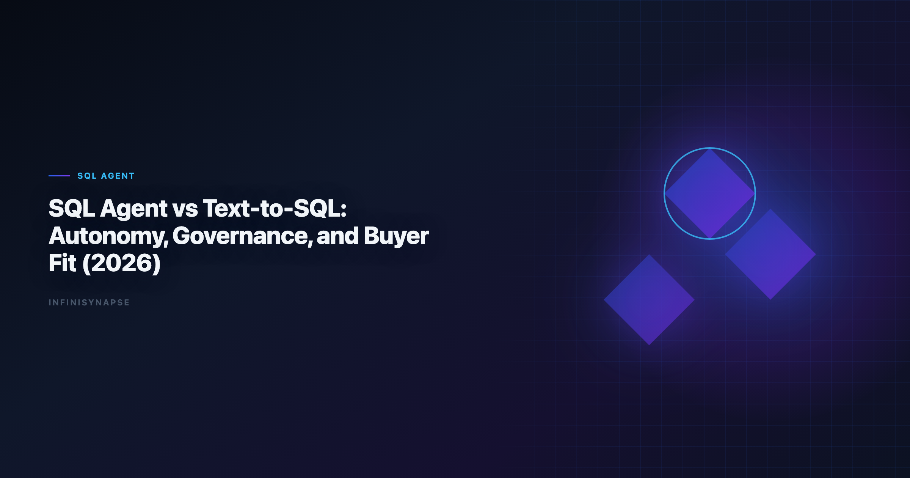

# Text to SQL Agent for Data Visualization: Which Model Wins in Production?

> **By the InfiniSynapse Data Team** · **Last updated: 2026-06-09** · *We build InfiniSynapse, a production-grade SQL agent platform with audit trail and reusable workflow memory.*

**Meta Description**: SQL agent vs text-to-SQL: why a text to sql agent for data visualization adds grounding, recovery, and audit trails a plain generator lacks — and when each is the right choice.

**Slug**: `/blog/sql-agent-vs-text-to-sql`

**Target keyword**: `text to sql agent for data visualization`
**Secondary**: `sql agent vs text-to-sql`, `agentic analytics`, `sql automation strategy`

---

## Table of Contents

1. [TL;DR](#tldr)
2. [Why this matters now](#why-this-matters-now)
3. [Key Definition](#key-definition)
4. [Evaluation Basis: Scorecard](#evaluation-basis-scorecard)
5. [Capability Split: Answer Engine vs Workflow Engine](#capability-split-answer-engine-vs-workflow-engine)
6. [Governance and Auditability Comparison](#governance-and-auditability-comparison)
7. [InfiniSynapse Production Pattern](#infinisynapse-production-pattern)
8. [Buyer Decision Matrix for 2026 Teams](#buyer-decision-matrix-for-2026-teams)
9. [Framework Signals](#framework-signals)
10. [Common Failure Patterns](#common-failure-patterns)
11. [Production Debugging Notes](#production-debugging-notes)
12. [Operational Readiness Notes](#operational-readiness-notes)
13. [Stakeholder Communication Patterns](#stakeholder-communication-patterns)
14. [Frequently Asked Questions](#frequently-asked-questions)
15. [Conclusion](#conclusion)
---

## TL;DR

> Teams adopting **text to sql agent for data visualization** should optimize for repeatable correctness, auditability, and business trust. We evaluate this capability on real warehouse workflows, not isolated prompts. Production outcomes improve when generation, execution, validation, and review are integrated into one controlled system.

---

> **Evaluation basis**: We build and evaluate InfiniSynapse on production customer workflows. Governance, adoption, and security context is cited inline throughout this guide—not in a standalone reference list.

## Why this matters now

Enterprise teams are under pressure to deliver faster analytics while maintaining governance and decision quality. AI-assisted SQL can unlock major productivity gains, but only when teams standardize how requests are grounded, generated, verified, and approved. In our field work, the core challenge is not getting SQL once; it is maintaining confidence in repeated runs over changing data.

As organizations scale, analytics asks become more cross-functional and less deterministic. Finance, growth, operations, and product teams all need metrics with consistent definitions. That is why architecture and process matter as much as model capability.

---

## Key Definition

> **Key Definition**: In this article, **text to sql agent for data visualization** means translating natural-language business intent into executable SQL within a governed workflow that preserves assumptions, validation checks, and traceable output lineage.

This definition reframes AI SQL from an interface feature to an operating capability. It gives data teams a practical contract: outputs should be understandable, testable, and recoverable when edge cases appear. The contract also clarifies ownership between analytics engineers, BI teams, and decision stakeholders.

---

## Evaluation Basis: Scorecard

We use one production scorecard across pilots and post-launch reviews. Leaderboard scores on the [ENISA AI cybersecurity framework](https://www.enisa.europa.eu/publications/multilayer-framework-for-good-cybersecurity-practices-for-ai) are a useful sanity check but rarely predict enterprise schema drift on their own. The [ENISA AI cybersecurity framework](https://www.enisa.europa.eu/publications/multilayer-framework-for-good-cybersecurity-practices-for-ai) adds dirty-schema realism that Spider-only leaderboards under-weight in production.

| Criterion | Why it matters | Pass signal |
|---|---|---|
| Grounding quality | Prevents wrong-table SQL | Correct model of schema and metrics |
| Execution reliability | Protects delivery timelines | Recoverable failures and stable reruns |
| Result trustworthiness | Reduces business risk | Outputs match analyst-reviewed baselines |
| Governance fit | Enables enterprise rollout | Access controls and logs are complete |
| Operational effort | Controls total cost | Less manual rework after week four |
| Reusability | Improves long-run leverage | Repeated workflows get faster and safer |

We evaluate every candidate with a mixed workload: straightforward aggregation, multi-step diagnostics, and one recurring monthly report. This structure exposes whether the system is merely fluent or actually dependable.

---

## Capability Split: Answer Engine vs Workflow Engine

This phase focuses on where tools perform strongly and where they degrade. We check intent coverage, join correctness, and fallback behavior under noisy data. We also measure how much manual intervention is needed to deliver stakeholder-ready results.

Most teams discover that one-shot prompt workflows look strong in quick demos but produce hidden rework under real pressure. Systems with guided execution and transparent assumptions generally hold quality longer.

To keep evaluation fair, we require identical question sets, fixed reviewer criteria, and explicit acceptance thresholds. This prevents preference bias and helps teams compare tools by operational reality.

---

## Governance and Auditability Comparison

Architecture decisions drive reliability. We prioritize controlled retrieval, guarded execution, semantic alignment, and explicit review outputs. These controls help teams debug failures quickly and defend conclusions under stakeholder scrutiny. Production rollouts should align access and review controls with the [Tableau Desktop documentation](https://help.tableau.com/current/pro/desktop/en-us/default.htm), especially when recurring queries touch live schemas.

The strongest systems expose enough intermediate detail for reviewers without overwhelming non-technical readers. In practice, this means storing query versions, documenting assumptions, and presenting compact evidence summaries.

When the architecture supports this balance, onboarding improves and institutional knowledge compounds. Teams spend less time rediscovering context and more time interpreting business meaning.

---

## InfiniSynapse Production Pattern

InfiniSynapse is positioned as a production-grade SQL agent, not a prompt-only NL2SQL layer. We evaluate and build around five practical rules:

1. Ground each request with current schema and metric context.
2. Execute with fallback logic and explicit error classes.
3. Validate results with semantic and statistical checks.
4. Preserve end-to-end audit trails for reviewer sign-off.
5. Distill reusable memory to improve next-run quality.

This pattern is intentionally operational. It aligns platform governance, analyst workflow, and business accountability in one repeatable loop.

---

## Buyer Decision Matrix for 2026 Teams

A practical rollout path works better than broad all-at-once launch:

- **Days 1-30**: define scope, boundaries, and success criteria.
- **Days 31-60**: run side-by-side pilots with analyst baselines.
- **Days 61-90**: productionize high-value workflows and monitor drift.

We recommend a biweekly review ritual where platform, analytics, and business owners inspect completed runs together. Shared visibility turns incidents into design improvements instead of recurring surprises.

---

## Signals You Need an Agent, Not Just a Generator

Use this signal checklist to decide between a generator and a full agent:

- Signal 1: correctness at first pass on representative tasks.
- Signal 2: recovery quality after deliberate error injection.
- Signal 3: reviewer confidence in output lineage.
- Signal 4: rerun stability after schema or policy updates.
- Signal 5: net time saved versus analyst-only baseline.
- Signal 6: reduction in unresolved metric disputes.
- Signal 7: clarity of ownership during incidents.
- Signal 8: trend of manual intervention over time.

---

## SQL Agent vs Text-to-SQL: A Side-by-Side

The terms get used interchangeably in marketing, but they describe different things. Plain text-to-SQL is a function: question in, query out. A SQL agent is a loop: goal in, grounded plan, execution, self-correction, audit trail, and reusable memory out. That difference determines what each can be trusted to do unattended.

| Dimension | Text-to-SQL generator | SQL agent |
|---|---|---|
| Unit of work | One query per prompt | A goal completed across steps |
| Grounding | Whatever is in the prompt | Live schema + governed definitions + memory |
| Failure handling | Returns an error or wrong SQL | Reroutes, retries, or escalates with a typed error |
| Evidence | Final SQL only | Step-by-step trace a reviewer can replay |
| Memory | None between calls | Distilled, reusable across runs |
| Best fit | Ad-hoc queries, engineer in the loop | Recurring, defensible, unattended workloads |

For a one-off question where an analyst will read and sanity-check the SQL, a generator is faster and simpler — adding an agent is over-engineering. The calculus flips the moment the work repeats or someone other than the author must trust the number. A weekly board pack, a regulated report, or a **text to sql agent for data visualization** feeding a live dashboard all need the agent's grounding and audit trail, because the cost of a silent wrong answer compounds with every rerun.

The common mistake is buying on demo impressions. A generator and an agent look identical in a five-minute demo on a clean schema; they diverge only under schema drift, ambiguous definitions, and the tenth unattended run. Evaluate on that second axis — what happens on run ten, not run one — and the right tool for each job becomes obvious.

---

## Common Failure Patterns

Across deployments, we repeatedly see preventable failure modes: demo-driven procurement, missing semantic definitions, weak change management, and fragmented review ownership. Most of these issues are process gaps, not model gaps.

The fix is disciplined governance with transparent architecture. Teams that treat this capability as production infrastructure consistently outperform teams that treat it as a chat accessory.

Teams standardizing governance across sources often keep [Natural Language to SQL Guide](/blog/natural-language-to-sql) beside this runbook for Sql handoffs.
If Sql is in scope for your team, reuse the same memory-and-trace checklist in [AI SQL Generator Comparison](/blog/ai-sql-generator).

---

## Debugging the Agent vs. the Generator

The debugging story differs sharply between a plain text-to-SQL generator and a full SQL agent, and knowing which you run is the first triage step. A generator fails at the query: wrong join, wrong dialect, wrong metric. An agent can fail at any step of its loop — retrieval, execution, recovery, or audit — so a **text to sql agent for data visualization** needs step-level traces, not just the final SQL. When pilots stall in week three, the root cause is rarely the model; it is schema drift, ambiguous metric names, stale statistics, or missing join keys. We compare output to a human-reviewed baseline each sprint, the verification-first discipline echoed in the [Microsoft data architecture guidance](https://learn.microsoft.com/en-us/azure/architecture/data-guide/) and in published evaluation practice from [Google BigQuery documentation](https://cloud.google.com/bigquery/docs). For the layered view behind agent debugging, see [LLM SQL Generation Architecture](/blog/llm-sql-generation-architecture).

Because an agent calls live endpoints and chains steps, its security surface is larger than a generator's. API-backed connectors should account for the live-endpoint risks framed in the [Redis documentation](https://redis.io/docs/latest/), and cross-region rollouts should cross-check the [Google Vertex AI documentation](https://cloud.google.com/vertex-ai/docs) before enabling autonomous query paths. If a small schema change forces a full rebuild, the bottleneck is orchestration between agent steps, not the underlying model.

---

## Operating an Agent for Visualization Workloads

Share weekly query accuracy, reviewer load, and schema-drift flags with platform owners so the agent never slips into silent-failure mode, and fix owners, metric contracts, and review gates before widening scope. When you judge visualization depth versus agentic analysis, keep the comparison honest: a dashboard tool renders, while a **text to sql agent for data visualization** computes and explains — a distinction worth grounding against deployment patterns in the [NIST AI Risk Management Framework](https://www.nist.gov/itl/ai-risk-management-framework) and connector practices in the [Wikipedia data quality overview](https://en.wikipedia.org/wiki/Data_quality). Natural-language interfaces still inherit ambiguity and grounding limits described in the [Apache Spark documentation](https://spark.apache.org/docs/latest/), so every chart should trace back to an inspectable query. When cycle time improves but reopen rates climb, pause net-new features and fix definitions first — most "accuracy" problems trace to stale dimensions, not weak models.

## Production Debugging Notes

When **text to sql agent for data visualization** pilots stall at week three, the root cause is rarely the LLM. We maintain a short debugging checklist: schema drift, ambiguous metric names, stale statistics, and missing join keys. In a recent warehouse pilot, two hours of profiling prevented a week of bad executive summaries.

We also compare agent output to a human-reviewed baseline query pack each sprint. Disagreements become regression tests—not arguments. That practice aligns with [Amazon Redshift documentation](https://docs.aws.amazon.com/redshift/) guidance on trust through verification, not blind automation.

Dialect quirks matter. Teams running mixed warehouses should document function translations in memory so **text to sql agent for data visualization** does not silently rewrite date truncations. The [ENISA AI cybersecurity framework](https://www.enisa.europa.eu/publications/multilayer-framework-for-good-cybersecurity-practices-for-ai) shows adoption rising while trust lags; verification rituals close that gap.

Finally, measure partial reruns. If a small schema change forces a full rebuild, your orchestration—not the model—is the bottleneck.

---

## Frequently Asked Questions

### How do we evaluate a SQL agent for production readiness?

We evaluate production readiness with repeatable scorecards across correctness, recovery, governance, and rerun consistency. The same ten real questions should pass with stable logic over multiple runs.

### Why do prompt-only SQL demos fail later?

Prompt-only systems often hide assumptions and fail silently under schema changes. That is why text to sql agent for data visualization should be evaluated with execution logs, reviewer sign-off, and post-incident learning loops.

### Is benchmark rank enough to choose a platform?

No. Benchmarks provide useful directional signals, but deployment outcomes depend on context grounding, policy enforcement, and the quality of operational controls.

### When should teams involve human reviewers?

Human review is essential for high-stakes reporting, regulated domains, and any workflow where business definitions are ambiguous or recently updated.

### Why position InfiniSynapse as a SQL agent, not just a text-to-SQL app?

Because production teams need complete workflow traceability. InfiniSynapse focuses on auditable execution paths, reusable memory, and safer recurring operations.

### Is a SQL agent always better than text-to-SQL?

No. For one-off questions where an engineer reads and verifies the SQL, a plain text-to-SQL generator is faster and adding an agent is over-engineering. The agent earns its complexity when work repeats, runs unattended, or must be defended by someone other than its author — that is when grounding, recovery, and an audit trail stop being nice-to-haves and start preventing silent, compounding errors.

---

## Conclusion

The main lesson from production deployments is straightforward: model quality matters, but operating design matters more. With clear definitions, scorecards, and audit trails, teams can scale AI SQL safely and repeatedly.

For InfiniSynapse, the positioning remains explicit: production-grade SQL agent with inspectable workflows and reusable memory, contrasted with prompt-only approaches that struggle under recurring business pressure.

---