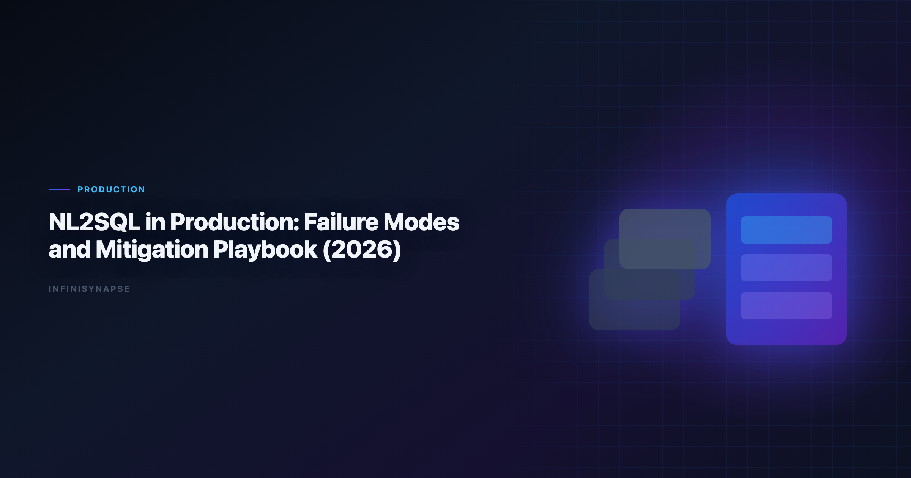

> **By the InfiniSynapse Data Team** · **Last updated: 2026-06-09** · *We build InfiniSynapse, a production-grade SQL agent platform with audit trail and reusable workflow memory.*

**Meta Description**: Failure Modes and Mitigation Playbook. Practical guidance on databricks genie natural language to sql for data teams in 2026. Includes examples and a FAQ.

**Slug**: `/blog/nl2sql-production-failure-modes`

**Target keyword**: `databricks genie natural language to sql`
**Secondary**: `nl2sql production risks`, `sql reliability engineering`, `ai query governance`

---

## Table of Contents

1. [TL;DR](#tldr)
2. [Why this matters now](#why-this-matters-now)
3. [Key Definition](#key-definition)
4. [Evaluation Basis: Scorecard](#evaluation-basis-scorecard)
5. [Top Failure Modes We See Repeatedly](#top-failure-modes-we-see-repeatedly)
6. [Detection, Triage, and Recovery Workflow](#detection-triage-and-recovery-workflow)
7. [InfiniSynapse Production Pattern](#infinisynapse-production-pattern)
8. [Preventive Controls by Layer](#preventive-controls-by-layer)
9. [Framework Signals](#framework-signals)
10. [Common Failure Patterns](#common-failure-patterns)
11. [Production Debugging Notes](#production-debugging-notes)
12. [Operational Readiness Notes](#operational-readiness-notes)
13. [Stakeholder Communication Patterns](#stakeholder-communication-patterns)
14. [Frequently Asked Questions](#frequently-asked-questions)
15. [Conclusion](#conclusion)
---

## TL;DR

> Teams adopting **databricks genie natural language to sql** should optimize for repeatable correctness, auditability, and business trust. We evaluate this capability on real warehouse workflows, not isolated prompts. Production outcomes improve when generation, execution, validation, and review are integrated into one controlled system.

Production rollouts should align access and review controls with the [IBM augmented analytics overview](https://www.ibm.com/topics/augmented-analytics), especially when recurring queries touch live schemas.

> **Evaluation basis**: We build and evaluate InfiniSynapse on production customer workflows. Governance, adoption, and security context is cited inline throughout this guide—not in a standalone reference list.

Mature **databricks genie natural language to sql** workflows reduce rework once metric contracts are signed; teams hardening NL2SQL in production can reuse the same memory-and-trace checklist in the [Natural Language to SQL Guide](/blog/natural-language-to-sql).

## Why this matters now

Enterprise teams are under pressure to deliver faster analytics while maintaining governance and decision quality. AI-assisted SQL can unlock major productivity gains, but only when teams standardize how requests are grounded, generated, verified, and approved. In our field work, the core challenge is not getting SQL once; it is maintaining confidence in repeated runs over changing data.

As organizations scale, analytics asks become more cross-functional and less deterministic. Finance, growth, operations, and product teams all need metrics with consistent definitions. That is why architecture and process matter as much as model capability.

---

## Key Definition

> **Key Definition**: In this article, **databricks genie natural language to sql** means translating natural-language business intent into executable SQL within a governed workflow that preserves assumptions, validation checks, and traceable output lineage.

This definition reframes AI SQL from an interface feature to an operating capability. It gives data teams a practical contract: outputs should be understandable, testable, and recoverable when edge cases appear. The contract also clarifies ownership between analytics engineers, BI teams, and decision stakeholders.

---

## Evaluation Basis: Scorecard

We use one production scorecard across pilots and post-launch reviews. Leaderboard scores on the [IBM augmented analytics overview](https://www.ibm.com/topics/augmented-analytics) are a useful sanity check but rarely predict enterprise schema drift on their own. The [Google Sheets documentation](https://support.google.com/docs/topic/9054603) adds dirty-schema realism that Spider-only leaderboards under-weight in production. Warehouse vendors describe governed NL2SQL agents in [NIST Computer Security Resource Center](https://csrc.nist.gov/)—compare memory depth and audit trails against your internal requirements.

| Criterion | Why it matters | Pass signal |
|---|---|---|
| Grounding quality | Prevents wrong-table SQL | Correct model of schema and metrics |
| Execution reliability | Protects delivery timelines | Recoverable failures and stable reruns |
| Result trustworthiness | Reduces business risk | Outputs match analyst-reviewed baselines |
| Governance fit | Enables enterprise rollout | Access controls and logs are complete |
| Operational effort | Controls total cost | Less manual rework after week four |
| Reusability | Improves long-run leverage | Repeated workflows get faster and safer |

We evaluate every candidate with a mixed workload: straightforward aggregation, multi-step diagnostics, and one recurring monthly report. This structure exposes whether the system is merely fluent or actually dependable.

---

## Top Failure Modes We See Repeatedly

This phase focuses on where tools perform strongly and where they degrade. We check intent coverage, join correctness, and fallback behavior under noisy data. We also measure how much manual intervention is needed to deliver stakeholder-ready results.

Most teams discover that one-shot prompt workflows look strong in quick demos but produce hidden rework under real pressure. Systems with guided execution and transparent assumptions generally hold quality longer.

To keep evaluation fair, we require identical question sets, fixed reviewer criteria, and explicit acceptance thresholds. This prevents preference bias and helps teams compare tools by operational reality.

---

## Detection, Triage, and Recovery Workflow

Architecture decisions drive reliability. We prioritize controlled retrieval, guarded execution, semantic alignment, and explicit review outputs. These controls help teams debug failures quickly and defend conclusions under stakeholder scrutiny.

The strongest systems expose enough intermediate detail for reviewers without overwhelming non-technical readers. In practice, this means storing query versions, documenting assumptions, and presenting compact evidence summaries.

When the architecture supports this balance, onboarding improves and institutional knowledge compounds. Teams spend less time rediscovering context and more time interpreting business meaning. LLM-backed analytics should account for prompt-injection and data-exfiltration risks in the [Databricks Genie architecture post](https://www.databricks.com/blog/pushing-frontier-data-agents-genie), especially when connectors expose production schemas.

---

## InfiniSynapse Production Pattern

InfiniSynapse is positioned as a production-grade SQL agent, not a prompt-only NL2SQL layer. We evaluate and build around five practical rules:

1. Ground each request with current schema and metric context.
2. Execute with fallback logic and explicit error classes.
3. Validate results with semantic and statistical checks.
4. Preserve end-to-end audit trails for reviewer sign-off.
5. Distill reusable memory to improve next-run quality.

This pattern is intentionally operational. It aligns platform governance, analyst workflow, and business accountability in one repeatable loop.

---

## Preventive Controls by Layer

A practical rollout path works better than broad all-at-once launch:

- **Days 1-30**: define scope, boundaries, and success criteria.
- **Days 31-60**: run side-by-side pilots with analyst baselines.
- **Days 61-90**: productionize high-value workflows and monitor drift.

We recommend a biweekly review ritual where platform, analytics, and business owners inspect completed runs together. Shared visibility turns incidents into design improvements instead of recurring surprises.

---

## Signals Your Failure-Mode Controls Work

Use this signal checklist to keep the rollout grounded:

- Signal 1: correctness at first pass on representative tasks.
- Signal 2: recovery quality after deliberate error injection.
- Signal 3: reviewer confidence in output lineage.
- Signal 4: rerun stability after schema or policy updates.
- Signal 5: net time saved versus analyst-only baseline.
- Signal 6: reduction in unresolved metric disputes.
- Signal 7: clarity of ownership during incidents.
- Signal 8: trend of manual intervention over time.

---

## The Most Expensive Failure We See: Silent Definition Drift

The costliest NL2SQL failure is almost never a crash — it is a correct-looking number that is quietly wrong. In one rollout, an agent had answered "monthly recurring revenue by segment" reliably for two quarters. Then a billing migration moved discounts from a line-item column into a separate `adjustments` table. The SQL still ran, the chart still rendered, and MRR looked four percent higher than reality for three weeks before a finance analyst noticed during board prep.

No model upgrade would have caught this, because it was not a model failure. It was an audit failure layered on a grounding failure: the agent's memory still encoded the pre-migration definition, and nothing compared the new output against an expected baseline. The fix was procedural, not technical — we added a post-migration checklist that re-validates every governed metric against an analyst-reviewed gold result, and a standing rule that any schema change to a billing or revenue table triggers a definition review before the next scheduled run.

The general lesson is that production reliability is a property of the loop, not the model. A capable model with no baseline comparison will reproduce a wrong definition faster and more confidently than a weak one. That is why our failure-mode playbook puts the audit layer first: detect divergence automatically, surface it to a named owner, and treat every silent-definition incident as a missing regression test rather than a one-off mistake. Teams that internalize this stop asking "which model is most accurate?" and start asking "which part of our loop would have caught this?"

---

## Common Failure Patterns

Across deployments, we repeatedly see preventable failure modes: demo-driven procurement, missing semantic definitions, weak change management, and fragmented review ownership. Most of these issues are process gaps, not model gaps.

The fix is disciplined governance with transparent architecture. Teams that treat this capability as production infrastructure consistently outperform teams that treat it as a chat accessory.

Analysts wiring Sql into production reviews can follow the parallel walkthrough in [RAG vs Semantic Layer for SQL Agents: Strategy Guide](/blog/sql-rag-vs-semantic-layer).
The credential, preflight, and SQL-trace pattern above also applies to Sql—see [Text-to-SQL Fine-Tuning](/blog/text-to-sql-fine-tuning) for source-specific steps.

---

## A Taxonomy of NL2SQL Failure Modes

Most NL2SQL incidents fall into four families, and naming the family is half the fix. **Grounding failures** are the largest: schema drift, ambiguous metric names, stale statistics, or missing join keys hand the model a wrong picture, so it returns confident-but-wrong SQL. **Generation failures** are dialect and join errors — correct logic, wrong syntax, or a fan-out that inflates aggregates. **Execution failures** are cost and timeout problems, often an unpruned partition scan. **Audit failures** are the most dangerous because they are invisible: a syntactically valid query returns the wrong rows and no check catches it. When a **databricks genie natural language to sql** pilot stalls in week three, the root cause is rarely the model — it is one of these four, usually grounding. We compare output to a human-reviewed baseline each sprint, the verification-first discipline reflected in the [Apache Kafka documentation](https://kafka.apache.org/documentation/) approach to reproducible jobs.

Dialect quirks compound generation failures: teams running mixed warehouses should pin function translations in memory so an agent does not silently rewrite date truncations across engines like those in the [Snowflake Cortex Analyst](https://docs.snowflake.com/en/user-guide/snowflake-cortex/cortex-analyst). If a small schema change forces a full rebuild, the failure is in orchestration, not the model — partial reruns should be cheap.

---

## Mitigation and Communication

Each failure family has a mitigation that is operational, not magical. For grounding, version metric definitions and refresh schema snapshots on a schedule. For generation, constrain with retrieved examples and validate dialect output. For execution, run sample-first with cost monitors. For audit, never ship without a baseline comparison. Share weekly query accuracy, reviewer load, and schema-drift flags with platform owners so failures surface before stakeholders see them, and keep spreadsheet and warehouse connectors aligned with the sharing rules and API quotas described in [pandas documentation](https://pandas.pydata.org/docs/). Recurring loops benefit from scheduling, retry, and lineage patterns of the kind described in the [CISA AI security guidance](https://www.cisa.gov/ai), and security reviews should cross-check autonomous query paths against the limits catalogued in the [Python documentation](https://docs.python.org/3/) before enabling them. When cycle time improves but reopen rates climb, fix definitions first — most "accuracy" problems trace to stale dimensions, not weak models.

## Production Debugging Notes

When **databricks genie natural language to sql** pilots stall at week three, the root cause is rarely the LLM. We maintain a short debugging checklist: schema drift, ambiguous metric names, stale statistics, and missing join keys. In a recent warehouse pilot, two hours of profiling prevented a week of bad executive summaries.

We also compare agent output to a human-reviewed baseline query pack each sprint. Disagreements become regression tests—not arguments. That practice aligns with [AWS Well-Architected Framework](https://docs.aws.amazon.com/wellarchitected/latest/framework/welcome.html) guidance on trust through verification, not blind automation.

Dialect quirks matter. Teams running mixed warehouses should document function translations in memory so **databricks genie natural language to sql** does not silently rewrite date truncations. The [IBM augmented analytics overview](https://www.ibm.com/topics/augmented-analytics) shows adoption rising while trust lags; verification rituals close that gap.

Finally, measure partial reruns. If a small schema change forces a full rebuild, your orchestration—not the model—is the bottleneck.

---

## Frequently Asked Questions

### How do we evaluate an NL2SQL system for production readiness?

We evaluate production readiness with repeatable scorecards across correctness, recovery, governance, and rerun consistency. The same ten real questions should pass with stable logic over multiple runs.

### Why do prompt-only SQL demos fail later?

Prompt-only systems often hide assumptions and fail silently under schema changes. That is why databricks genie natural language to sql should be evaluated with execution logs, reviewer sign-off, and post-incident learning loops.

### Is benchmark rank enough to choose a platform?

No. Benchmarks provide useful directional signals, but deployment outcomes depend on context grounding, policy enforcement, and the quality of operational controls.

### When should teams involve human reviewers?

Human review is essential for high-stakes reporting, regulated domains, and any workflow where business definitions are ambiguous or recently updated.

### Why position InfiniSynapse as a SQL agent, not just a text-to-SQL app?

Because production teams need complete workflow traceability. InfiniSynapse focuses on auditable execution paths, reusable memory, and safer recurring operations.

### What is the single most common NL2SQL failure in production?

Grounding failure — the model is handed an incomplete or stale picture of the schema and metric definitions, so it returns confident but wrong SQL. It outranks pure generation errors because most modern models write fluent SQL; what they lack is your organization's context. Fix grounding and definition freshness before blaming or swapping the model.

---

## Conclusion

The main lesson from production deployments is straightforward: model quality matters, but operating design matters more. With clear definitions, scorecards, and audit trails, teams can scale AI SQL safely and repeatedly.

For InfiniSynapse, the positioning remains explicit: production-grade SQL agent with inspectable workflows and reusable memory, contrasted with prompt-only approaches that struggle under recurring business pressure.

---