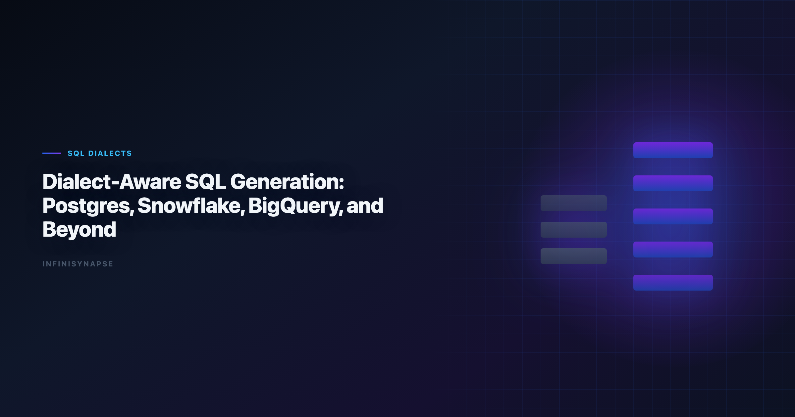

# AI-Assisted Query Generation SQL Python Social Science Data Analysis (2026)

> **By the InfiniSynapse Data Team** · **Last updated: 2026-06-09** · *We build InfiniSynapse, a production-grade SQL agent platform with audit trail and reusable workflow memory.*

**Meta Description**: Cross-warehouse SQL generation patterns for ai-assisted query generation sql python social science data analysis with dialect-aware validation. See the FAQ.

**Slug**: `/blog/dialect-aware-sql-generation`

**Target keyword**: `ai-assisted query generation sql python social science data analysis`
**Secondary**: `dialect aware sql`, `cross warehouse sql generation`, `sql compatibility engineering`

---

## Table of Contents

1. [TL;DR](#tldr)
2. [Why this matters now](#why-this-matters-now)
3. [Key Definition](#key-definition)
4. [Evaluation Basis: Scorecard](#evaluation-basis-scorecard)
5. [Where Dialect Drift Breaks AI SQL Outputs](#where-dialect-drift-breaks-ai-sql-outputs)
6. [Dialect Abstraction Patterns That Work](#dialect-abstraction-patterns-that-work)
7. [InfiniSynapse Production Pattern](#infinisynapse-production-pattern)
8. [Testing Matrix for Multi-Warehouse Teams](#testing-matrix-for-multi-warehouse-teams)
9. [Framework Signals](#framework-signals)
10. [Common Failure Patterns](#common-failure-patterns)
11. [Production Debugging Notes](#production-debugging-notes)
12. [Operational Readiness Notes](#operational-readiness-notes)
13. [Stakeholder Communication Patterns](#stakeholder-communication-patterns)
14. [Frequently Asked Questions](#frequently-asked-questions)
15. [Conclusion](#conclusion)
---

## TL;DR

> Teams adopting **ai-assisted query generation sql python social science data analysis** should optimize for repeatable correctness, auditability, and business trust. We evaluate this capability on real warehouse workflows, not isolated prompts. Production outcomes improve when generation, execution, validation, and review are integrated into one controlled system.

Production rollouts should align access and review controls with the [OWASP API Security Top 10](https://owasp.org/API-Security/), especially when recurring queries touch live schemas.

> **Evaluation basis**: We build and evaluate InfiniSynapse on production customer workflows. Governance, adoption, and security context is cited inline throughout this guide—not in a standalone reference list.

Mature **ai-assisted query generation sql python social science data analysis** workflows reduce rework once metric contracts are signed; the credential, preflight, and SQL-trace pattern above also applies to dialect-specific generation — see [Text-to-SQL Fine-Tuning](/blog/text-to-sql-fine-tuning) for source-specific steps.

## Why this matters now

Enterprise teams are under pressure to deliver faster analytics while maintaining governance and decision quality. AI-assisted SQL can unlock major productivity gains, but only when teams standardize how requests are grounded, generated, verified, and approved. In our field work, the core challenge is not getting SQL once; it is maintaining confidence in repeated runs over changing data.

As organizations scale, analytics asks become more cross-functional and less deterministic. Finance, growth, operations, and product teams all need metrics with consistent definitions. That is why architecture and process matter as much as model capability.

---

## Key Definition

> **Key Definition**: In this article, **ai-assisted query generation sql python social science data analysis** means translating natural-language business intent into executable SQL within a governed workflow that preserves assumptions, validation checks, and traceable output lineage.

This definition reframes AI SQL from an interface feature to an operating capability. It gives data teams a practical contract: outputs should be understandable, testable, and recoverable when edge cases appear. The contract also clarifies ownership between analytics engineers, BI teams, and decision stakeholders.

---

## Evaluation Basis: Scorecard

We use one production scorecard across pilots and post-launch reviews. Leaderboard scores on the [OWASP API Security Top 10](https://owasp.org/API-Security/) are a useful sanity check but rarely predict enterprise schema drift on their own. The [OWASP API Security Top 10](https://owasp.org/API-Security/) adds dirty-schema realism that Spider-only leaderboards under-weight in production. Warehouse vendors describe governed NL2SQL agents in [Anthropic research](https://www.anthropic.com/research)—compare memory depth and audit trails against your internal requirements.

| Criterion | Why it matters | Pass signal |
|---|---|---|
| Grounding quality | Prevents wrong-table SQL | Correct model of schema and metrics |
| Execution reliability | Protects delivery timelines | Recoverable failures and stable reruns |
| Result trustworthiness | Reduces business risk | Outputs match analyst-reviewed baselines |
| Governance fit | Enables enterprise rollout | Access controls and logs are complete |
| Operational effort | Controls total cost | Less manual rework after week four |
| Reusability | Improves long-run leverage | Repeated workflows get faster and safer |

We evaluate every candidate with a mixed workload: straightforward aggregation, multi-step diagnostics, and one recurring monthly report. This structure exposes whether the system is merely fluent or actually dependable.

---

## Where Dialect Drift Breaks AI SQL Outputs

This phase focuses on where tools perform strongly and where they degrade. We check intent coverage, join correctness, and fallback behavior under noisy data. We also measure how much manual intervention is needed to deliver stakeholder-ready results.

Most teams discover that one-shot prompt workflows look strong in quick demos but produce hidden rework under real pressure. Systems with guided execution and transparent assumptions generally hold quality longer.

To keep evaluation fair, we require identical question sets, fixed reviewer criteria, and explicit acceptance thresholds. This prevents preference bias and helps teams compare tools by operational reality.

---

## Dialect Abstraction Patterns That Work

Architecture decisions drive reliability. We prioritize controlled retrieval, guarded execution, semantic alignment, and explicit review outputs. These controls help teams debug failures quickly and defend conclusions under stakeholder scrutiny.

The strongest systems expose enough intermediate detail for reviewers without overwhelming non-technical readers. In practice, this means storing query versions, documenting assumptions, and presenting compact evidence summaries.

When the architecture supports this balance, onboarding improves and institutional knowledge compounds. Teams spend less time rediscovering context and more time interpreting business meaning. LLM-backed analytics should account for prompt-injection and data-exfiltration risks in the [NIST Computer Security Resource Center](https://csrc.nist.gov/), especially when connectors expose production schemas.

---

## InfiniSynapse Production Pattern

InfiniSynapse is positioned as a production-grade SQL agent, not a prompt-only NL2SQL layer. We evaluate and build around five practical rules: Analysts wiring Sql into production reviews can follow the parallel walkthrough in [RAG vs Semantic Layer for SQL Agents: Strategy Guide](/blog/sql-rag-vs-semantic-layer).

1. Ground each request with current schema and metric context.
2. Execute with fallback logic and explicit error classes.
3. Validate results with semantic and statistical checks.
4. Preserve end-to-end audit trails for reviewer sign-off.
5. Distill reusable memory to improve next-run quality.

This pattern is intentionally operational. It aligns platform governance, analyst workflow, and business accountability in one repeatable loop.

---

## Testing Matrix for Multi-Warehouse Teams

A practical rollout path works better than broad all-at-once launch:

- **Days 1-30**: define scope, boundaries, and success criteria.
- **Days 31-60**: run side-by-side pilots with analyst baselines.
- **Days 61-90**: productionize high-value workflows and monitor drift.

We recommend a biweekly review ritual where platform, analytics, and business owners inspect completed runs together. Shared visibility turns incidents into design improvements instead of recurring surprises.

---

## Signals Dialect Handling Is Solid

Use this signal checklist to keep a cross-dialect rollout grounded:

- Signal 1: correctness at first pass on representative tasks.
- Signal 2: recovery quality after deliberate error injection.
- Signal 3: reviewer confidence in output lineage.
- Signal 4: rerun stability after schema or policy updates.
- Signal 5: net time saved versus analyst-only baseline.
- Signal 6: reduction in unresolved metric disputes.
- Signal 7: clarity of ownership during incidents.
- Signal 8: trend of manual intervention over time.

---

## Common Dialect Traps and How Agents Should Handle Them

Dialect differences are not exotic edge cases; they appear in the most common analytics operations, and a reliable cross-dialect agent needs an explicit handling rule for each.

**Date truncation.** Postgres uses `date_trunc('month', ts)`; BigQuery uses `DATE_TRUNC(ts, MONTH)` — argument order and casing differ. An agent that memorized one will silently produce valid-but-wrong grouping in another, so the translation memory must store the per-engine form, not a single canonical one.

**String and array functions.** Concatenation, splitting, and JSON extraction diverge widely — `||` versus `CONCAT`, `STRING_AGG` versus `ARRAY_AGG` versus `GROUP_CONCAT`. These rarely error; they return subtly different shapes, exactly the failure that escapes a syntax check but fails an output comparison.

**Type casting and integer division.** Some engines integer-divide `5/2` to `2`; others return `2.5`. A revenue-per-user metric can be wrong by rounding alone, so the agent should normalize numeric casts explicitly rather than trust engine defaults.

**Identifier quoting and case sensitivity.** Snowflake upper-cases unquoted identifiers, Postgres lower-cases them, and others preserve case. An agent that ignores this throws "column not found" on otherwise correct logic.

The pattern across all four is the same: dialect handling cannot be left to the model's training distribution. It must be an explicit, validated layer — a translation memory plus per-engine output comparison — so that **ai-assisted query generation sql python social science data analysis** returns the same answer regardless of which warehouse executes it. Teams that treat dialects as a first-class concern ship cross-warehouse analytics confidently; teams that assume the model "knows SQL" discover the gaps one silent wrong number at a time.

---

## Common Failure Patterns

Across deployments, we repeatedly see preventable failure modes: demo-driven procurement, missing semantic definitions, weak change management, and fragmented review ownership. Most of these issues are process gaps, not model gaps.

The fix is disciplined governance with transparent architecture. Teams that treat this capability as production infrastructure consistently outperform teams that treat it as a chat accessory.

Query cost monitors should alert when generated SQL creates sudden scan inflation across dialects after schema or partition changes; teams standardizing this can reuse the memory-and-trace checklist in the [Natural Language to SQL Guide](/blog/natural-language-to-sql).

---

## Where Dialect-Aware Generation Breaks

Cross-warehouse SQL is where confident-looking generation quietly fails. The same logical query needs different syntax for date truncation, string functions, window frames, and type casts across Postgres, BigQuery, Snowflake, and ClickHouse — and a model that learned one dialect will silently emit it everywhere. When an **ai-assisted query generation sql python social science data analysis** pipeline stalls in week three, the cause is rarely fluency; it is schema drift, ambiguous metric names, or an unhandled dialect rewrite. We compare output to a human-reviewed baseline each sprint so disagreements become regression tests — the verification-first discipline reflected in reproducible-format standards like the [Wikipedia conceptual data model overview](https://en.wikipedia.org/wiki/Conceptual_data_model) — and we treat security posture as part of correctness by aligning controls with [Wikipedia business intelligence overview](https://en.wikipedia.org/wiki/Business_intelligence) before widening access.

The durable fix is a dialect-translation memory: a pinned map of function equivalents and engine quirks the agent consults before generation, validated per warehouse. Teams running mixed estates should encode connector-specific dataset boundaries and validation patterns the way the [Microsoft Excel support](https://support.microsoft.com/excel) describes for high-cardinality engines. If a small schema change forces a full rebuild across dialects, the bottleneck is orchestration, not the model.

---

## Operating Across Multiple Dialects

Share weekly query accuracy, reviewer load, and schema-drift flags with platform owners so a dialect rewrite never slips into silent-failure mode, and fix owners, metric contracts, and review gates per engine before widening scope. Apply consistent access controls — row-level security, service roles, and API exposure boundaries — with the reliability mindset of the [Databricks Genie architecture post](https://www.databricks.com/blog/pushing-frontier-data-agents-genie): error budgets and rollback paths for when a dialect change regresses. Keep query chains traceable end to end as you add document and relational stores, in the spirit of the [Snowflake documentation](https://docs.snowflake.com/en/), and borrow latency, error-budget, and alert-routing practices grounded in the data-quality fundamentals of the [EU AI Act overview](https://digital-strategy.ec.europa.eu/en/policies/european-approach-artificial-intelligence). When cycle time improves but cross-dialect reopen rates climb, fix the translation map and definitions first — most "accuracy" problems trace to stale dimensions or an unhandled dialect, not weak models.

## Production Debugging Notes

When **ai-assisted query generation sql python social science data analysis** pilots stall at week three, the root cause is rarely the LLM. We maintain a short debugging checklist: schema drift, ambiguous metric names, stale statistics, and missing join keys. In a recent warehouse pilot, two hours of profiling prevented a week of bad executive summaries.

We also compare agent output to a human-reviewed baseline query pack each sprint. Disagreements become regression tests—not arguments. That practice aligns with [ISO/IEC 27001](https://www.iso.org/isoiec-27001-information-security.html) guidance on trust through verification, not blind automation.

Dialect quirks matter. Teams running mixed warehouses should document function translations in memory so **ai-assisted query generation sql python social science data analysis** does not silently rewrite date truncations. The [OWASP API Security Top 10](https://owasp.org/API-Security/) shows adoption rising while trust lags; verification rituals close that gap.

Finally, measure partial reruns. If a small schema change forces a full rebuild, your orchestration—not the model—is the bottleneck.

---

## Frequently Asked Questions

### How do we evaluate dialect-aware SQL generation for production readiness?

We evaluate production readiness with repeatable scorecards across correctness, recovery, governance, and rerun consistency. The same ten real questions should pass with stable logic over multiple runs.

### Why do prompt-only SQL demos fail later?

Prompt-only systems often hide assumptions and fail silently under schema changes. That is why ai-assisted query generation sql python social science data analysis should be evaluated with execution logs, reviewer sign-off, and post-incident learning loops.

### Is benchmark rank enough to choose a platform?

No. Benchmarks provide useful directional signals, but deployment outcomes depend on context grounding, policy enforcement, and the quality of operational controls.

### When should teams involve human reviewers?

Human review is essential for high-stakes reporting, regulated domains, and any workflow where business definitions are ambiguous or recently updated.

### Why position InfiniSynapse as a SQL agent, not just a text-to-SQL app?

Because production teams need complete workflow traceability. InfiniSynapse focuses on auditable execution paths, reusable memory, and safer recurring operations.

---

## Conclusion

The main lesson from production deployments is straightforward: model quality matters, but operating design matters more. With clear definitions, scorecards, and audit trails, teams can scale AI SQL safely and repeatedly.

For InfiniSynapse, the positioning remains explicit: production-grade SQL agent with inspectable workflows and reusable memory, contrasted with prompt-only approaches that struggle under recurring business pressure.

---