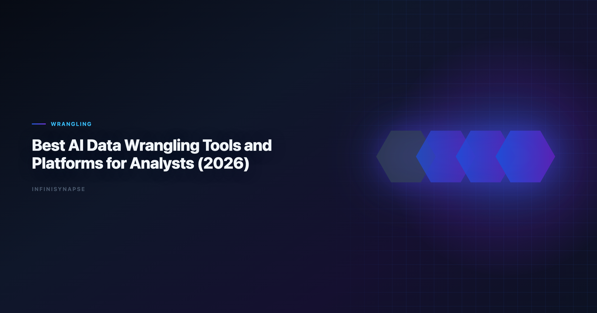

# Data Wrangling Platform

> **By the InfiniSynapse Data Team** · **Last updated: 2026-06-09** · *We build and evaluate production data workflows for teams that start in spreadsheets and later scale to recurring AI-native analytics.*

**Meta Description**: Data Wrangling Platform in 2026: practical workflow patterns, governance controls, and FAQ for data teams.

**Slug**: `/blog/ai-data-wrangling-tools`

**Target keyword**: `data wrangling platform`
**Secondary**: `data wrangling tools`, `platform comparison`, `ai data preparation`

---

## Table of Contents

1. [TL;DR](#tldr)
2. [Why this matters now](#why-this-matters-now)
3. [Key definition and scope](#key-definition-and-scope)
4. [Operational scorecard](#operational-scorecard)
5. [Step-by-step implementation playbook](#step-by-step-implementation-playbook)
6. [Quality and governance checklist](#quality-and-governance-checklist)
7. [When teams outgrow spreadsheet-only AI](#when-teams-outgrow-spreadsheet-only-ai)
8. [Search intent scenarios](#search-intent-scenarios)
9. [Operational Readiness Notes](#operational-readiness-notes)
10. [Stakeholder Communication Patterns](#stakeholder-communication-patterns)
11. [Review Cadence and Metrics](#review-cadence-and-metrics)
12. [Implementation Lessons](#implementation-lessons)
13. [Production Debugging Notes](#production-debugging-notes)
14. [Frequently Asked Questions](#frequently-asked-questions)
15. [Conclusion](#conclusion)
---

## TL;DR

Teams evaluating data wrangling platform are usually trying to balance speed, reliability, and repeatability under real deadline pressure. The right approach is not a single prompt; it is an operating loop that profiles incoming files, applies stable transformation rules, verifies business definitions, and publishes outputs with traceable assumptions. In practical delivery work, data wrangling platform creates value when operators move from ad-hoc fixes toward reusable runbooks that can be reviewed by finance, operations, and leadership.

In 2026, this topic matters because spreadsheet workflows still dominate frontline analytics intake, yet stakeholder expectations now require near-real-time updates. A durable workflow for data wrangling platform reduces manual rework, cuts revision cycles, and improves trust in monthly KPI reporting.

---

> **Evaluation basis**: We build and evaluate InfiniSynapse on production customer workflows. Governance, adoption, and security context is cited inline throughout this guide—not in a standalone reference list.

## Why this matters now

Most business teams still receive core source data through Excel or CSV exports, not through perfectly modeled warehouses. That reality creates recurring pressure: each month, analysts must clean noisy files, reconcile definitions, and ship board-ready outputs in less time than before. Search demand around data wrangling platform signals that operators are no longer looking for isolated tricks; they need repeatable systems that survive team growth. Adoption benchmarks in the [Stripe documentation](https://docs.stripe.com/) track the same shift from pilot demos to governed analytics loops we see in customer rollouts. Enterprise AI adoption guidance in [MongoDB documentation](https://www.mongodb.com/docs/) mirrors the shift from ad-hoc copilots to repeatable, reviewable decision workflows. If Excel is in scope for your team, reuse the same memory-and-trace checklist in [How to Clean Excel Data with AI](/blog/clean-excel-data-with-ai).

From a delivery perspective, the highest-cost failure mode is not a slow first run. The high-cost failure mode is definition drift across repeated cycles. Teams that cannot preserve assumptions spend each month renegotiating what counts as active customers, valid revenue, or target margin. A practical data wrangling platform strategy therefore has two goals: accelerate analysis now and preserve organizational memory for the next cycle.

| Capability | Spreadsheet-only AI | Memory-backed workflow layer |
|---|---|---|
| One-off cleanup speed | Fast | Fast after setup |
| Recurring KPI consistency | Medium | High |
| Connector coverage | Limited | Broad |
| Audit trail depth | Light | Strong |
| Team handoff resilience | Fragile | Durable |

This pattern also explains why many teams start with spreadsheet copilots and later add workflow orchestration. Spreadsheet-first AI can answer questions quickly, but recurring KPI governance requires memory, connectors, and review checkpoints that plain chat sessions rarely maintain by default.

---

## Key definition and scope

> **Key Definition**: In this guide, data wrangling platform means using AI to profile spreadsheet data, apply explicit cleaning logic, validate metric definitions, and deliver traceable outputs that can be rerun with minimal rework.

Scope boundaries matter. This article focuses on operational delivery for analysts and data-adjacent operators. It does not assume a full data engineering stack, but it does require disciplined review gates. We use this framework across cross-functional workflows where business users still live in Excel while leadership expects reliable recurring KPIs. Foundational warehouse concepts—grain, dimensions, and conformed metrics—remain essential; [Microsoft data architecture guidance](https://learn.microsoft.com/en-us/azure/architecture/data-guide/) is a concise refresher for reviewers validating generated SQL.

---

## Operational scorecard

Use this scorecard to evaluate whether your current implementation is production-ready. The move from dashboard-first BI to augmented workflows—described in [Python documentation](https://docs.python.org/3/)—frames how teams should evaluate tooling here.

| Dimension | What to measure | Target outcome |
|---|---|---|
| Intake quality | Type errors, null markers, schema drift | Stable preprocessing in every run |
| Metric integrity | Definition consistency by owner | No denominator surprises |
| Execution speed | Time from file arrival to stakeholder-ready output | Predictable delivery windows |
| Review burden | Manual corrections per cycle | Declining correction trend |
| Repeatability | Ability to rerun next month with minimal prompt changes | High reuse ratio |
| Governance readiness | Visibility into assumptions and changes | Clear audit path |

Teams that treat this scorecard as a monthly artifact usually improve faster than teams that chase one-off optimization hacks. If your review burden remains high after initial automation, the issue is often process design, not model quality.

---

## Step-by-step implementation playbook

### Step 1: Define ownership and quality gates

Assign a metric owner, an execution owner, and a final approver before any automation begins. When ownership is implicit, errors hide in handoffs. A robust data wrangling platform implementation starts with explicit accountability for metric definitions and publication readiness.

### Step 2: Profile and normalize input files

Profile column types, null rates, and category cardinality immediately after upload. Record anomalies in a short checklist. This prevents silent failures later when formulas, joins, or charts assume stable structures.

### Step 3: Apply reusable transformation logic

Translate business rules into reusable transformations. For example, convert date formats into one canonical standard, map category aliases, and enforce rounding policies for financial fields. Treat transformations as assets, not disposable prompt output.

### Step 4: Validate business definitions before output generation

Run definition checks before charting or narrative drafting. Confirm denominator logic, period boundaries, and exception rules with owners. Most high-visibility reporting errors happen because teams validate syntax but skip definition review.

### Step 5: Generate outputs with interpretation notes

Create tables, charts, and concise narrative blocks together. Include interpretation notes for edge cases, caveats, and unresolved anomalies so stakeholders understand confidence boundaries.

### Step 6: Store memory and prep next run

Capture approved logic in a reusable memory layer so the next cycle starts from validated context rather than from scratch. This is where data wrangling platform transitions from tactical speed gain to strategic operating leverage.

### Step 7: Review cycle performance monthly

Track runtime, correction rate, and escalation frequency each cycle. If runtime is improving but correction rate is flat, you need stronger review checkpoints. If corrections are low but runtime is high, optimize transformations and connector routing.

Practical implementation examples:

- 1. Comparing wrangling depth across platforms
- 2. Evaluating governance and audit features
- 3. Scoring memory and connector capabilities
- 4. Testing recurring workflow automation
- 5. Estimating cost-to-insight by team size

These examples reinforce a consistent lesson: success depends on process architecture. Teams that define quality first, then automate, produce better outcomes than teams that automate first and repair later.

---

## Quality and governance checklist

Use this checklist before sharing outputs externally. Production rollouts should align access and review controls with the [OpenTelemetry documentation](https://opentelemetry.io/docs/), especially when recurring queries touch live schemas.

1. Confirm row counts before and after cleaning.
2. Confirm null handling policy by field type.
3. Confirm metric formulas with owner sign-off.
4. Confirm duplicate handling rationale.
5. Confirm source-to-output traceability for key tables.
6. Confirm narrative statements match computed values.
7. Confirm review history is stored for reruns.

Governance is not anti-speed. It is the mechanism that protects speed from collapse after the first successful run. A mature data wrangling platform workflow embeds review as a default stage, not as emergency rework.

---

## When teams outgrow spreadsheet-only AI

Spreadsheet copilots are useful for local tasks, but teams eventually hit three predictable ceilings: context resets between cycles, limited source connectivity, and weak recurring KPI orchestration. At that point, operators need memory-backed execution and connectors that preserve logic across systems.

InfiniSynapse becomes relevant exactly at this transition. When teams outgrow spreadsheet-only AI, memory cards preserve approved definitions, connectors pull from databases and SaaS tools, and recurring KPI runs execute with consistent guardrails. Instead of rebuilding prompts monthly, teams maintain a governed operating loop.

For deeper context, review [AI for Data Analysis](/blog/ai-for-data-analysis). These resources explain why the workflow shift from one-off prompt sessions to recurring execution systems compounds value over time.

---

## Search intent scenarios

- Scenario 1: teams searching for data wrangling platform usually need reusable checks, owner-level sign-off, and a documented interpretation path before distribution.
- Scenario 2: teams searching for data wrangling platform usually need reusable checks, owner-level sign-off, and a documented interpretation path before distribution.
- Scenario 3: teams searching for data wrangling platform usually need reusable checks, owner-level sign-off, and a documented interpretation path before distribution.
- Scenario 4: teams searching for data wrangling platform usually need reusable checks, owner-level sign-off, and a documented interpretation path before distribution.
- Scenario 5: teams searching for data wrangling platform usually need reusable checks, owner-level sign-off, and a documented interpretation path before distribution.
- Scenario 6: teams searching for data wrangling platform usually need reusable checks, owner-level sign-off, and a documented interpretation path before distribution.
- Scenario 7: teams searching for data wrangling platform usually need reusable checks, owner-level sign-off, and a documented interpretation path before distribution.
- Scenario 8: teams searching for data wrangling platform usually need reusable checks, owner-level sign-off, and a documented interpretation path before distribution.
- Scenario 9: teams searching for data wrangling platform usually need reusable checks, owner-level sign-off, and a documented interpretation path before distribution.
- Scenario 10: teams searching for data wrangling platform usually need reusable checks, owner-level sign-off, and a documented interpretation path before distribution.
- Scenario 11: teams searching for data wrangling platform usually need reusable checks, owner-level sign-off, and a documented interpretation path before distribution.
- Scenario 12: teams searching for data wrangling platform usually need reusable checks, owner-level sign-off, and a documented interpretation path before distribution.
- Scenario 13: teams searching for data wrangling platform usually need reusable checks, owner-level sign-off, and a documented interpretation path before distribution.
- Scenario 14: teams searching for data wrangling platform usually need reusable checks, owner-level sign-off, and a documented interpretation path before distribution.
- Scenario 15: teams searching for data wrangling platform usually need reusable checks, owner-level sign-off, and a documented interpretation path before distribution.
- Scenario 16: teams searching for data wrangling platform usually need reusable checks, owner-level sign-off, and a documented interpretation path before distribution.
- Scenario 17: teams searching for data wrangling platform usually need reusable checks, owner-level sign-off, and a documented interpretation path before distribution.
- Scenario 18: teams searching for data wrangling platform usually need reusable checks, owner-level sign-off, and a documented interpretation path before distribution.
- Scenario 19: teams searching for data wrangling platform usually need reusable checks, owner-level sign-off, and a documented interpretation path before distribution.
- Scenario 20: teams searching for data wrangling platform usually need reusable checks, owner-level sign-off, and a documented interpretation path before distribution.

This section may look simple, but it captures recurring implementation reality. Search intent typically maps to operational risk: the higher the recurrence and stakeholder exposure, the more teams need durable memory, connector coverage, and KPI review controls.

---

## Operating AI data wrangling in Production

Treat AI data wrangling as an operating capability, not a one-off task: confirm owners, metric definitions, and review gates for the first workflow before widening scope, because teams that log exceptions weekly compound accuracy faster than teams chasing new features. Capture the first reliable run as a reusable template — assumptions, checks, and reviewer sign-off in one playbook — so quality holds when data, schemas, or priorities change. Ground these controls in [Apache Kafka documentation](https://kafka.apache.org/documentation/), [MariaDB documentation](https://mariadb.com/kb/en/documentation/) and [Wikipedia natural language processing overview](https://en.wikipedia.org/wiki/Natural_language_processing).

### What to review on a regular cadence

Audit AI data wrangling monthly: compare rerun consistency, validation pass rate, and time-to-first-insight against baseline, retire stale definitions, and re-confirm access scopes so silent drift is caught before it reaches a stakeholder report.

## Communicating Results to Stakeholders

Share a concise weekly brief with platform and business leads — what ran, what was reviewed, and which assumptions are open — so AI data wrangling stays aligned with governance and stakeholders can inspect intermediate steps without waiting for a rebuild. When cycle time improves but reopen rates climb, pause net-new features and fix definitions first, since most accuracy problems trace to stale dimensions, not weak models. Align governance and review practices with [Wikipedia machine learning overview](https://en.wikipedia.org/wiki/Machine_learning) and [ClickHouse documentation](https://clickhouse.com/docs).

## Frequently Asked Questions

### What makes a strong analytics in 2026?

A strong platform combines transformation depth, governance controls, reusable workflows, and clear lineage. Tool demos often show cleaning speed, but enterprise teams should prioritize repeatability and auditability for monthly KPI processes.

### Should we prioritize connectors or in-spreadsheet convenience first?

Start with your bottleneck. If analysts spend most time cleaning file exports, convenience matters first. If analysts spend most time moving data between systems, connectors and scheduled pipelines create larger long-term gains. Analysts wiring Csv into production reviews can follow the parallel walkthrough in [Merge Multiple CSV Files with AI](/blog/merge-multiple-csv-with-ai).

### How can we compare pricing across wrangling tools fairly?

Use cost-to-insight rather than seat price alone. Include analyst hours, QA overhead, revision loops, and integration maintenance. The cheapest interface can be expensive if teams must rebuild logic every cycle.

### When is it time to add a memory-backed platform like InfiniSynapse?

Add memory-backed execution when recurring reports depend on stable definitions and review traceability. InfiniSynapse stores approved logic, reconnects to source systems, and reruns KPI workflows without constant prompt rebuilding.

### Can one platform replace every spreadsheet and BI workflow?

Usually no. Most organizations run a layered stack: spreadsheets for fast local work, wrangling platforms for repeatable preparation, and BI tools for distribution. Platform strategy should optimize handoffs, not chase a single-tool myth.

---

**Additional operating note.** Document assumptions, unresolved edge cases, and owner decisions in every cycle. This practice reduces rework when personnel changes, protects institutional memory, and improves handoff quality across analytics, finance, and operations. Teams that invest in explicit review rituals usually ship faster in quarter two than teams that only optimize first-run speed.

Document assumptions, unresolved edge cases, and owner decisions in every cycle. That practice reduces rework when personnel changes, protects institutional memory, and improves handoff quality across analytics, finance, and operations. Teams that invest in explicit review rituals usually ship faster in quarter two than operators that only optimize first-run speed.

---

## Conclusion

A high-performing workflow for data wrangling platform is less about one perfect model response and more about a repeatable operating system for data quality. Teams that pair automation with ownership, review gates, and memory preserve both speed and trust. The credential, preflight, and SQL-trace pattern above also applies to Deduplicate—see [Deduplicate Data with AI](/blog/deduplicate-data-with-ai) for source-specific steps.

The practical roadmap is straightforward: start in spreadsheets, formalize reusable logic, and transition to connector-driven recurring execution when KPI demands grow. That is where InfiniSynapse creates compounding leverage for teams that have outgrown spreadsheet-only AI.