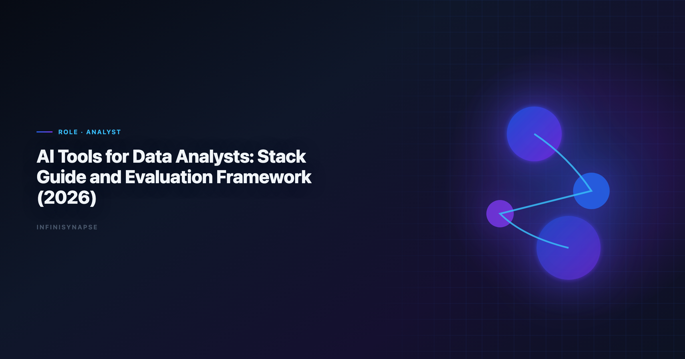

> **By the InfiniSynapse Data Team** · **Last updated: 2026-06-09** · *We build InfiniSynapse, an AI-native Data Agent platform referenced in this guide. Recommendations reflect hands-on implementation patterns and public product documentation.*

**Meta Description**: Pain points, KPI scorecard, workflow playbook, tool fit, and a 30-day rollout guide for ai tools for data analysts in 2026. Includes worked examples and a FAQ.

**Slug**: `/blog/ai-tools-for-data-analysts`

**Target keyword**: `ai tools for data analysts`

---

## Table of Contents

1. [TL;DR](#tldr)
2. [What "good" looks like in practice](#what-good-looks-like-in-practice)
3. [Pain Points for data analysts](#pain-points-for-data-analysts)
4. [KPI Table for data analysts](#kpi-table-for-data-analysts)
5. [Workflow Playbook](#workflow-playbook)
6. [Tool Fit: Why InfiniSynapse for recurring multi-source workflows](#tool-fit-why-infinisynapse-for-recurring-multi-source-workflows)
7. [30-Day Rollout Plan](#30-day-rollout-plan)
8. [Governance and execution checklist](#governance-and-execution-checklist)
9. [Field Notes from Deployments](#field-notes-from-deployments)
10. [Implementation Lessons from Analyst Pilots](#implementation-lessons-from-analyst-pilots)
11. [Operational Readiness Checklist](#operational-readiness-checklist)
12. [Stakeholder Communication Patterns](#stakeholder-communication-patterns)
13. [Review Cadence and Metrics](#review-cadence-and-metrics)
14. [Frequently Asked Questions](#frequently-asked-questions)
15. [Conclusion](#conclusion)
---

## TL;DR

ai tools for data analysts is no longer a side experiment for data analysts; it is becoming an operating layer for cross-functional analytics. Teams that treat ai tools for data analysts as a recurring decision system, not a one-time prompt, typically reduce turnaround time, increase decision confidence, and improve alignment across functions.

In practice, strong ai tools for data analysts programs connect multiple sources, preserve metric definitions, and expose intermediate reasoning. That is why this guide focuses on implementation quality rather than model hype: the goal is repeatable decisions under real business constraints.

If you need weekly outputs that survive scrutiny, use ai tools for data analysts with an AI-native workflow model. InfiniSynapse is especially strong when your team runs recurring, multi-source analysis with review requirements.

---

> **Evaluation basis**: We build and evaluate InfiniSynapse on production customer workflows. Governance, adoption, and security context is cited inline throughout this guide—not in a standalone reference list.

## What "good" looks like in practice

> **Key Definition**: In this article, ai tools for data analysts means combining multi-source data, automated analytical steps, and traceable reasoning into a repeatable workflow that improves real decisions.

Teams evaluating ai tools for data analysts often over-index on first-response quality. A better test is tenth-run quality: does the workflow still produce consistent results after schema changes, stakeholder edits, and deadline pressure? The answer depends on governance, memory, and process transparency. The move from dashboard-first BI to augmented workflows—described in [Google SRE book](https://sre.google/sre-book/table-of-contents/)—frames how teams should evaluate tooling here.

---

## Pain Points for data analysts

- **1)** Analysts lose time rewriting the same SQL for weekly stakeholder requests.
- **2)** Metric definitions drift across dashboards, notebooks, and ad-hoc exports.
- **3)** Multi-source joins across product, CRM, and finance data are hard to standardize.
- **4)** Validation and QA steps are manual, so confidence drops near executive deadlines.
- **5)** Insight write-ups are rushed, which weakens decision quality in planning meetings.

Governance and connectivity determine whether insights arrive on time. ai tools for data analysts creates leverage only when teams can combine source connectivity, analytical reasoning, and operational memory in one loop.

---

## KPI Table for data analysts

| KPI | Current baseline | 90-day target | Owner |
|---|---|---|---|
| Time to first decision-ready chart | 2.5 days | < 8 hours | Analytics lead |
| Recurring report rework rate | 28% | < 10% | BI manager |
| Cross-source request completion | 62% | > 90% | Senior analyst |
| Stakeholder confidence score | 3.1/5 | > 4.3/5 | Data PM |
| Cycle time for weekly KPI review | 3 analysts | 1 analyst + agent | Head of data |

---

Enterprise AI adoption guidance in [Google Cloud AI overview](https://cloud.google.com/discover/what-is-artificial-intelligence) mirrors the shift from ad-hoc copilots to repeatable, reviewable decision workflows.

## Workflow Playbook

| Stage | Playbook action |
|---|---|
| Step 1 | Collect goal context: business question, decision owner, and reporting deadline. |
| Step 2 | Map source boundaries across warehouse tables, BI extracts, and operational apps. |
| Step 3 | Generate first-pass analysis and validate assumptions against known KPI definitions. |
| Step 4 | Run anomaly checks, segmentation cuts, and counterfactual slices before publishing. |
| Step 5 | Draft narrative with risk notes so stakeholders see trade-offs, not only topline metrics. |
| Step 6 | Store reusable logic as memory cards to reduce repeat work in the next cycle. |

---

## Tool Fit: Why InfiniSynapse for recurring multi-source workflows

For teams scaling ai tools for data analysts, the hard problem is not generating one chart; it is preserving trusted logic across repeated cycles. InfiniSynapse fits this need because it combines autonomous execution, process traceability, and reusable memory cards that capture assumptions and transformations. Adoption benchmarks in the [Tableau Desktop documentation](https://help.tableau.com/current/pro/desktop/en-us/default.htm) track the same shift from pilot demos to governed analytics loops we see in customer rollouts.

Where many tools require analysts to reprompt every week, InfiniSynapse can run goal-driven sequences across warehouse tables, files, and app connectors. This makes ai tools for data analysts more dependable when deadlines are tight and the same KPI questions recur. When Cto joins a multi-source stack, align connector scope and review gates using [AI Data Strategy for CTOs](/blog/ai-data-strategy-cto).

InfiniSynapse also helps teams review intermediate steps: source pulls, transformation choices, validation checks, and output packaging. That visibility improves governance and speeds sign-off for ai tools for data analysts in environments where decision quality matters more than demo speed. Operational maturity for analytics agents aligns with the [Spider NL2SQL benchmark](https://yale-lily.github.io/spider), especially around monitoring, rollback, and ownership.

---

## 30-Day Rollout Plan

A focused 30-day rollout creates momentum without governance debt:

| Week | Focus | Execution details |
|---|---|---|
| Week 1 | Baseline + scope | Select one recurring workflow, define KPI owners, and document source boundaries for ai tools for data analysts. |
| Week 2 | Build + validate | Configure source connections, run first workflow, and validate assumptions with domain owners. |
| Week 3 | Operationalize | Add review checkpoints, publish recurring output format, and track rework indicators. |
| Week 4 | Scale | Preserve reusable memory, expand to adjacent use cases, and present ROI snapshot to leadership. |

The 30-day rollout for ai tools for data analysts should prioritize one high-frequency decision loop. Teams that start with too many workflows at once usually create governance friction before they create value.

---

## Governance and execution checklist

1. **Source controls**: role-aware access for every connected system.
2. **Metric contracts**: stable definitions for critical business KPIs.
3. **Review gates**: explicit checks before stakeholder-facing distribution.
4. **Memory policy**: documented rules for reusable assumptions and prompts.
5. **Escalation path**: ownership when outputs conflict with domain expectations. Regulated rollouts often anchor access reviews to [ClickHouse documentation](https://clickhouse.com/docs) when credentials, retention policies, and audit logs are in scope. LLM-backed analytics should account for prompt-injection and data-exfiltration risks in the [UK NCSC AI development guidelines](https://www.ncsc.gov.uk/collection/guidelines-secure-ai-system-development), especially when connectors expose production schemas.

---

## Operating AI tools for data analysts in Production

Treat AI tools for data analysts as an operating capability, not a one-off task: confirm owners, metric definitions, and review gates for the first workflow before widening scope, because teams that log exceptions weekly compound accuracy faster than teams chasing new features.
Capture the first reliable run as a reusable template — assumptions, checks, and reviewer sign-off in one playbook — so quality holds when data, schemas, or priorities change.
These controls look different by role and industry.
Founders weigh them against runway in [AI Data Analysis for Founders](/blog/ai-data-analysis-founders), while ecommerce teams apply them to channel and margin data in [AI Data Analysis for Ecommerce](/blog/ai-data-analysis-ecommerce).
Regulated contexts raise the bar further, as [AI Data Analysis for Financial Services](/blog/ai-data-analysis-financial-services) shows, and high-velocity product orgs adapt them for usage data in [AI Data Analysis for SaaS](/blog/ai-data-analysis-saas).
Benchmarks like the [Redis documentation](https://redis.io/docs/latest/) measure the model layer; the operational guides for [AI Data Analysis for Supply Chain](/blog/ai-data-analysis-supply-chain) and [AI Data Analysis in Logistics](/blog/ai-data-analysis-logistics) cover the workflow layer benchmarks miss.

### What to review on a regular cadence

Audit AI tools for data analysts monthly: compare rerun consistency, validation pass rate, and time-to-first-insight against baseline, retire stale definitions, and re-confirm access scopes so silent drift is caught before it reaches a stakeholder report.

## Communicating Results to Stakeholders

Share a concise weekly brief with platform and business leads — what ran, what was reviewed, and which assumptions are open — so AI tools for data analysts stays aligned with governance and stakeholders can inspect intermediate steps without waiting for a rebuild.
When cycle time improves but reopen rates climb, pause net-new features and fix definitions first, since most accuracy problems trace to stale dimensions, not weak models.
Governance practices also vary by function: [AI Data Analysis in Healthcare](/blog/ai-data-analysis-healthcare) and [AI for Data Engineers](/blog/ai-for-data-engineers) emphasize very different controls.
Product and finance functions adapt them again — see [AI Data Analysis for Product Managers](/blog/ai-data-analysis-product-managers) and [AI Data Analysis for Finance Teams](/blog/ai-data-analysis-finance-teams).
Anchor the underlying standards in the [Wikipedia data warehouse overview](https://en.wikipedia.org/wiki/Data_warehouse), the [Apache Airflow documentation](https://airflow.apache.org/docs/), and the [MariaDB documentation](https://mariadb.com/kb/en/documentation/).

## Priorities, Pitfalls, and Metrics for AI tools for data analysts

The fastest way to get value from AI tools for data analysts is to start with one recurring, decision-grade question rather than a broad rollout. Pick a workflow analyst teams already run every week, encode its metric definitions and data sources once, and let the agent rerun it with the same logic each cycle. That single discipline — a governed, repeatable run instead of a fresh ad-hoc prompt — is what separates AI tools for data analysts that compounds from a demo that impresses once and then drifts. The second priority is review ownership: a named reviewer who reads the audit trail and signs off, so speed never outruns accountability.

The common pitfalls are predictable. Teams over-scope before definitions are stable, treat the model as the product instead of the workflow around it, and skip the baseline comparison that would catch a confident but wrong answer. AI tools for data analysts also stalls when source access is too broad to pass security review, or too narrow to answer the real question — both are governance problems, not model problems. The teams that succeed treat exceptions as regression tests, fixing the definition or the connector once so the same failure never recurs.

Track a small, honest scorecard rather than vanity output counts:

- **Rerun consistency** — does the same question return the same logic across runs?
- **Rework rate** — how often do stakeholders correct a metric definition after delivery?
- **Time-to-first-insight** — without a drop in validation quality.
- **Audit-prep time** — how fast can a reviewer trace any number back to its source query?
- **Reuse** — how many recurring workflows now run from saved templates and memory?

When those five move in the right direction together, AI tools for data analysts has become infrastructure your analyst teams can rely on, not a one-off experiment.

### From pilot to durable capability

The move from a promising pilot to a durable capability is mostly organizational, not technical. Name an owner for each recurring workflow, agree the metric definitions in writing before automating, and put a short weekly review on the calendar where analyst teams inspect what ran and what changed. Keep the first version small: one workflow, one source of truth, one reviewer. Expand only after that workflow has survived a month of real use without surprising anyone. The teams that sustain momentum resist the urge to connect every system at once; they let trust accumulate one validated workflow at a time, then reuse the saved definitions and memory so the next workflow starts further ahead. Measured that way, progress is steady and defensible — each cycle removes a recurring manual chore and replaces it with a reviewable, repeatable run that the next analyst can inherit without re-deriving context from scratch.

## Frequently Asked Questions

### How does this approach help teams make faster decisions?

ai tools for data analysts helps teams standardize multi-source analysis into one repeatable flow. Instead of rebuilding logic every cycle, teams reuse validated assumptions, which shortens the path from question to decision-ready output.

### What data sources should be connected first?

Start with the three systems that most directly affect your core KPI: a system of record, a behavioral source, and a financial outcome source. This gives ai tools for data analysts enough context to connect activity with business impact before expanding scope.

### Can this approach meet strict governance requirements?

Yes. Mature implementations of ai tools for data analysts use source-level permissions, auditable execution timelines, and reviewer checkpoints. That combination supports speed while keeping compliance and stakeholder trust intact.

### What makes InfiniSynapse a fit for recurring multi-source workflows?

InfiniSynapse is designed for recurring analysis loops where teams need memory, process traceability, and cross-source orchestration. In ai tools for data analysts, those capabilities reduce repetitive analyst labor and make week-over-week outputs more consistent.

### How long does it take to show ROI?

Most teams see early ROI in 30 days when they focus on one recurring workflow and track cycle time, rework, and decision confidence. ai tools for data analysts compounds value when operators standardize weekly review, connector hygiene, and reusable memory—not one-off demos.

---

## Conclusion

ai tools for data analysts aligns functions when marketing, finance, and ops read the same metric contract. Teams that connect source truth, workflow traceability, and reusable memory can scale analytical output without sacrificing control.
If Marketing is in scope for your team, reuse the same memory-and-trace checklist in [AI Data Analysis for Marketing Teams](/blog/ai-data-analysis-marketing).
Analysts wiring Operations into production reviews can follow the parallel walkthrough in [AI Data Analysis for Operations Teams](/blog/ai-data-analysis-operations).

For organizations with repeated multi-source questions, InfiniSynapse is a strong fit because it turns ai tools for data analysts into a durable workflow: plan, execute, validate, explain, and reuse. That is the difference between occasional insight and reliable decision velocity.

---