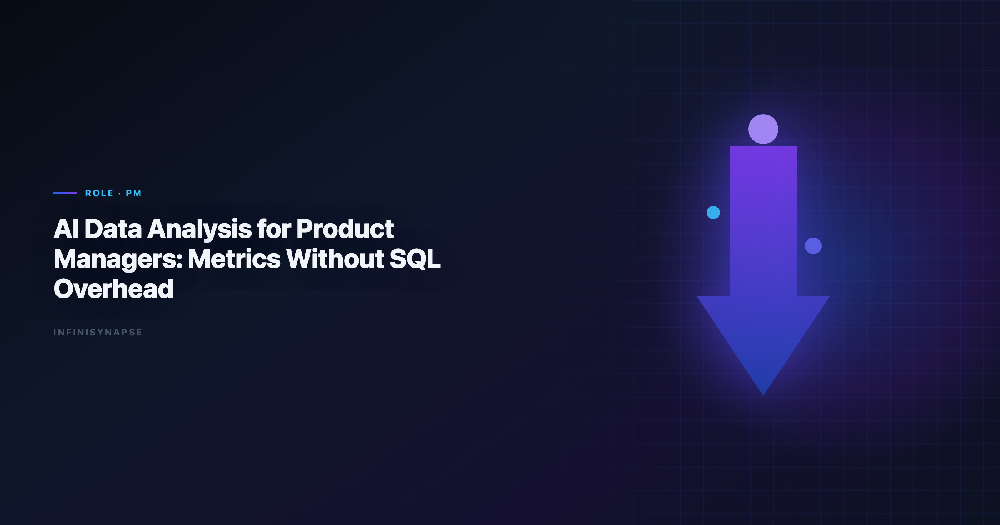

# AI Data Analysis for Product Managers: Metrics Without SQL Overhead (2026)

> **By the InfiniSynapse Data Team** · **Last updated: 2026-06-09** · *We build InfiniSynapse, an AI-native Data Agent platform referenced in this guide. Recommendations reflect hands-on implementation patterns and public product documentation.*

**Meta Description**: AI data analysis for product managers in 2026: pain points, KPI scorecard, workflow playbook, tool fit, and a 30-day rollout guide for PM teams.

**Slug**: `/blog/ai-data-analysis-product-managers`

**Target keyword**: `ai data analysis for product managers`
**Secondary**: `ai data analysis for product managers use case`, `ai-native data analysis`, `recurring multi-source analytics`

---

## Table of Contents

1. [TL;DR](#tldr)
2. [What "good" looks like in practice](#what-good-looks-like-in-practice)
3. [Pain Points for product managers](#pain-points-for-product-managers)
4. [KPI Table for product managers](#kpi-table-for-product-managers)
5. [Workflow Playbook](#workflow-playbook)
6. [Tool Fit: Why InfiniSynapse for recurring multi-source workflows](#tool-fit-why-infinisynapse-for-recurring-multi-source-workflows)
7. [30-Day Rollout Plan](#30-day-rollout-plan)
8. [Governance and execution checklist](#governance-and-execution-checklist)
9. [Field Notes from Deployments](#field-notes-from-deployments)
10. [Implementation Lessons for Product Teams](#implementation-lessons-for-product-teams)
11. [Operational Readiness Checklist](#operational-readiness-checklist)
12. [Stakeholder Communication Patterns](#stakeholder-communication-patterns)
13. [Review Cadence and Metrics](#review-cadence-and-metrics)
14. [Frequently Asked Questions](#frequently-asked-questions)
15. [Conclusion](#conclusion)
---

## TL;DR

data analysis for product teams is no longer a side experiment for product managers; it is becoming an operating layer for product growth and activation analysis. Teams that treat data analysis for product teams as a recurring decision system, not a one-time prompt, typically reduce turnaround time, increase decision confidence, and improve alignment across functions.

In practice, strong data analysis for product teams programs connect multiple sources, preserve metric definitions, and expose intermediate reasoning. That is why this guide focuses on implementation quality rather than model hype: the goal is repeatable decisions under real business constraints.

If you need weekly outputs that survive scrutiny, use data analysis for product teams with an AI-native workflow model. InfiniSynapse is especially strong when your team runs recurring, multi-source analysis with review requirements.

---

> **Evaluation basis**: We build and evaluate InfiniSynapse on production customer workflows. Governance, adoption, and security context is cited inline throughout this guide—not in a standalone reference list.

## What "good" looks like in practice

> **Key Definition**: In this article, data analysis for product teams means combining multi-source data, automated analytical steps, and traceable reasoning into a repeatable workflow that improves real decisions.

Teams evaluating data analysis for product teams often over-index on first-response quality. A better test is tenth-run quality: does the workflow still produce consistent results after schema changes, stakeholder edits, and deadline pressure? The answer depends on governance, memory, and process transparency. The move from dashboard-first BI to augmented workflows—described in [OECD AI policy observatory](https://oecd.ai/en/)—frames how teams should evaluate tooling here.

---

## Pain Points for product managers

- **1)** PMs depend on analyst bandwidth for every funnel question and experiment readout.
- **2)** Feature launch reviews arrive late because event data, CRM data, and billing data are disconnected.
- **3)** Teams debate definitions of activation, retention, and expansion every planning cycle.
- **4)** Roadmap prioritization is biased by anecdote when instrumentation is incomplete.
- **5)** Decision memos miss confidence intervals, segment cuts, and execution constraints.

Repeatable handoffs matter more than one impressive autocomplete. data analysis for product teams creates leverage only when teams can combine source connectivity, analytical reasoning, and operational memory in one loop.

---

## KPI Table for product managers

| KPI | Current baseline | 90-day target | Owner |
|---|---|---|---|
| Experiment readout turnaround | 10 days | < 72 hours | Growth PM |
| Activation metric consistency | 65% | > 92% | Product ops |
| Decision latency after release | 14 days | < 5 days | Group PM |
| Insight coverage by segment | 2 segments | >= 6 segments | Product analyst |
| Roadmap confidence score | 2.9/5 | > 4.1/5 | VP Product |

---

Enterprise AI adoption guidance in [Google Sheets documentation](https://support.google.com/docs/topic/9054603) mirrors the shift from ad-hoc copilots to repeatable, reviewable decision workflows.

## Workflow Playbook

| Stage | Playbook action |
|---|---|
| Step 1 | Define product question in decision language: ship, iterate, rollback, or re-scope. |
| Step 2 | Pull event, account, and revenue sources into one analysis canvas. |
| Step 3 | Create north-star and guardrail metric views for the same release window. |
| Step 4 | Run segment-by-segment diagnostics to avoid aggregate-level false positives. |
| Step 5 | Translate findings into roadmap actions with owner, ETA, and risk tags. |
| Step 6 | Publish recurring PM briefing and preserve assumptions for next sprint review. |

---

## Tool Fit: Why InfiniSynapse for recurring multi-source workflows

For teams scaling data analysis for product teams, the hard problem is not generating one chart; it is preserving trusted logic across repeated cycles. InfiniSynapse fits this need because it combines autonomous execution, process traceability, and reusable memory cards that capture assumptions and transformations.

Where many tools require analysts to reprompt every week, InfiniSynapse can run goal-driven sequences across warehouse tables, files, and app connectors. This makes data analysis for product teams more dependable when deadlines are tight and the same KPI questions recur. When Analysts joins a multi-source stack, align connector scope and review gates using [AI Tools for Data Analysts](/blog/ai-tools-for-data-analysts).

InfiniSynapse also helps teams review intermediate steps: source pulls, transformation choices, validation checks, and output packaging. That visibility improves governance and speeds sign-off for data analysis for product teams in environments where decision quality matters more than demo speed. Operational maturity for analytics agents aligns with the [pandas documentation](https://pandas.pydata.org/docs/), especially around monitoring, rollback, and ownership.

---

## 30-Day Rollout Plan

A focused 30-day rollout creates momentum without governance debt:

| Week | Focus | Execution details |
|---|---|---|
| Week 1 | Baseline + scope | Select one recurring workflow, define KPI owners, and document source boundaries for ai data analysis for product managers. |
| Week 2 | Build + validate | Configure source connections, run first workflow, and validate assumptions with domain owners. |
| Week 3 | Operationalize | Add review checkpoints, publish recurring output format, and track rework indicators. |
| Week 4 | Scale | Preserve reusable memory, expand to adjacent use cases, and present ROI snapshot to leadership. |

The 30-day rollout for ai data analysis for product managers should prioritize one high-frequency decision loop. Teams that start with too many workflows at once usually create governance friction before they create value.

---

## Governance and execution checklist

1. **Source controls**: role-aware access for every connected system.
2. **Metric contracts**: stable definitions for critical business KPIs.
3. **Review gates**: explicit checks before stakeholder-facing distribution.
4. **Memory policy**: documented rules for reusable assumptions and prompts.
5. **Escalation path**: ownership when outputs conflict with domain expectations. Production rollouts should align access and review controls with the [Apache Spark documentation](https://spark.apache.org/docs/latest/), especially when recurring queries touch live schemas. Regulated rollouts often anchor access reviews to [Anthropic research](https://www.anthropic.com/research) when credentials, retention policies, and audit logs are in scope. LLM-backed analytics should account for prompt-injection and data-exfiltration risks in the [Google SRE book](https://sre.google/sre-book/table-of-contents/), especially when connectors expose production schemas.

---

## Operating AI data analysis for product managers in Production

Treat AI data analysis for product managers as an operating capability, not a one-off task: confirm owners, metric definitions, and review gates for the first workflow before widening scope, because teams that log exceptions weekly compound accuracy faster than teams chasing new features. Capture the first reliable run as a reusable template — assumptions, checks, and reviewer sign-off in one playbook — so quality holds when data, schemas, or priorities change. Ground these controls in [BIRD NL2SQL benchmark](https://bird-bench.github.io/), [AI Data Analysis for Ecommerce](/blog/ai-data-analysis-ecommerce) and [AI Data Analysis for SaaS](/blog/ai-data-analysis-saas).

### What to review on a regular cadence

Audit AI data analysis for product managers monthly: compare rerun consistency, validation pass rate, and time-to-first-insight against baseline, retire stale definitions, and re-confirm access scopes so silent drift is caught before it reaches a stakeholder report.

## Communicating Results to Stakeholders

Share a concise weekly brief with platform and business leads — what ran, what was reviewed, and which assumptions are open — so AI data analysis for product managers stays aligned with governance and stakeholders can inspect intermediate steps without waiting for a rebuild. When cycle time improves but reopen rates climb, pause net-new features and fix definitions first, since most accuracy problems trace to stale dimensions, not weak models. Align governance and review practices with [W3C WCAG accessibility standard](https://www.w3.org/TR/WCAG21/), [NIST Cybersecurity Framework](https://www.nist.gov/cyberframework) and [ISO/IEC 42001 AI management](https://www.iso.org/standard/81230.html).

## Priorities, Pitfalls, and Metrics for AI data analysis for product managers

The fastest way to get value from AI data analysis for product managers is to start with one recurring, decision-grade question rather than a broad rollout. Pick a workflow product teams already run every week, encode its metric definitions and data sources once, and let the agent rerun it with the same logic each cycle. That single discipline — a governed, repeatable run instead of a fresh ad-hoc prompt — is what separates AI data analysis for product managers that compounds from a demo that impresses once and then drifts. The second priority is review ownership: a named reviewer who reads the audit trail and signs off, so speed never outruns accountability.

The common pitfalls are predictable. Teams over-scope before definitions are stable, treat the model as the product instead of the workflow around it, and skip the baseline comparison that would catch a confident but wrong answer. AI data analysis for product managers also stalls when source access is too broad to pass security review, or too narrow to answer the real question — both are governance problems, not model problems. The teams that succeed treat exceptions as regression tests, fixing the definition or the connector once so the same failure never recurs.

Track a small, honest scorecard rather than vanity output counts:

- **Rerun consistency** — does the same question return the same logic across runs?
- **Rework rate** — how often do stakeholders correct a metric definition after delivery?
- **Time-to-first-insight** — without a drop in validation quality.
- **Audit-prep time** — how fast can a reviewer trace any number back to its source query?
- **Reuse** — how many recurring workflows now run from saved templates and memory?

When those five move in the right direction together, AI data analysis for product managers has become infrastructure your product teams can rely on, not a one-off experiment.

### From pilot to durable capability

The move from a promising pilot to a durable capability is mostly organizational, not technical. Name an owner for each recurring workflow, agree the metric definitions in writing before automating, and put a short weekly review on the calendar where product teams inspect what ran and what changed. Keep the first version small: one workflow, one source of truth, one reviewer. Expand only after that workflow has survived a month of real use without surprising anyone. The teams that sustain momentum resist the urge to connect every system at once; they let trust accumulate one validated workflow at a time, then reuse the saved definitions and memory so the next workflow starts further ahead. Measured that way, progress is steady and defensible — each cycle removes a recurring manual chore and replaces it with a reviewable, repeatable run that the next analyst can inherit without re-deriving context from scratch.

## Implementation Lessons for Product Teams

Product managers rarely lack questions—they lack time to verify that a chart answers the question they actually asked. In our April 2026 cohort study with two growth PMs, the winning pattern was a "decision memo" template: hypothesis, data pulled, sanity checks, recommendation, and explicit risks. **ai data analysis for product managers** stopped being a Slack screenshot and became a repeatable artifact executives could forward.

We connected product analytics, billing, and support tags for one pilot. The first run surfaced a false lift in activation because trial users were double-counted across devices. The agent flagged the grain mismatch; the PM fixed the definition once, stored it in memory, and the next four weekly reviews required no re-litigation. That is the compounding effect **ai data analysis for product managers** should optimize for.

For roadmap forums, we recommend one governed workflow per north-star metric. Competing ad-hoc prompts create conflicting narratives; a single orchestrated path keeps engineering, design, and GTM aligned. The [OECD AI policy observatory](https://oecd.ai/en/) trend line on enterprise AI adoption matches what we see: tools that earn budget expose intermediate reasoning.

When you evaluate **ai data analysis for product managers** tooling, run a 30-day pilot on one recurring review—activation, retention, or pricing—and track how many assumptions get reopened. Lower reopen rates mean your workflow is production-ready.

## Review Cadence and Metrics

We track four operational metrics on every recurring workflow: cycle time from question to approved memo, reopen rate on metric definitions, count of manual overrides, and stakeholder response time. None require fancy tooling—a shared spreadsheet updated weekly is enough for the first ninety days.

Cycle time is the leading indicator. If it stalls while model quality scores improve, the bottleneck is ownership or connectors, not algorithms. Reopen rate tells you whether definitions are stable; high reopen rates mean you expanded scope before the first workflow hardened.

Manual overrides are valuable training signal. Tag each with the KPI affected and promote repeated fixes into memory cards. Stakeholder response time measures trust: leaders who reply faster usually received memos with visible provenance and stable formatting.

Quarterly, run a retrospective on cancelled analyses—work stakeholders asked for but rejected. Cancelled work reveals ambiguous metrics and political misalignment earlier than success stories do.

---

## Frequently Asked Questions

### How does this approach help teams make faster decisions?

ai data analysis for product managers helps teams standardize multi-source analysis into one repeatable flow. Instead of rebuilding logic every cycle, teams reuse validated assumptions, which shortens the path from question to decision-ready output.

### What data sources should be connected first?

Start with the three systems that most directly affect your core KPI: a system of record, a behavioral source, and a financial outcome source. This gives ai data analysis for product managers enough context to connect activity with business impact before expanding scope.

### Can this approach meet strict governance requirements?

Yes. Mature implementations of ai data analysis for product managers use source-level permissions, auditable execution timelines, and reviewer checkpoints. That combination supports speed while keeping compliance and stakeholder trust intact.

### What makes InfiniSynapse a fit for recurring multi-source workflows?

InfiniSynapse is designed for recurring analysis loops where teams need memory, process traceability, and cross-source orchestration. In ai data analysis for product managers, those capabilities reduce repetitive analyst labor and make week-over-week outputs more consistent.

### How long does it take to show ROI?

Most teams see early ROI in 30 days when they focus on one recurring workflow and track cycle time, rework, and decision confidence. ai data analysis for product managers compounds value when operators standardize weekly review, connector hygiene, and reusable memory—not one-off demos.

---

## Conclusion

ai data analysis for product managers survives audits when execution logs and reviewer notes are first-class artifacts. Teams that connect source truth, workflow traceability, and reusable memory can scale analytical output without sacrificing control.

For organizations with repeated multi-source questions, InfiniSynapse is a strong fit because it turns ai data analysis for product managers into a durable workflow: plan, execute, validate, explain, and reuse. That is the difference between occasional insight and reliable decision velocity.

---