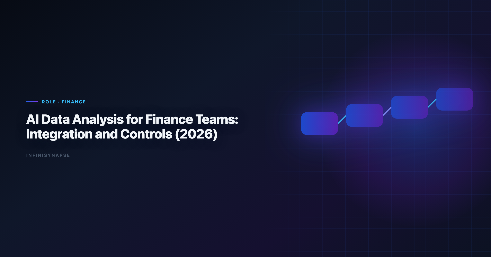

> **By the InfiniSynapse Data Team** · **Last updated: 2026-06-09** · *We build InfiniSynapse, an AI-native Data Agent platform referenced in this guide. Recommendations reflect hands-on implementation patterns and public product documentation.*

**Meta Description**: AI data analysis for finance teams in 2026: pain points, KPI scorecard, workflow playbook, tool fit, and a 30-day rollout guide for finance teams. See the FAQ.

**Slug**: `/blog/ai-data-analysis-finance-teams`

**Target keyword**: `ai data analysis for finance teams`
**Secondary**: `ai data analysis for finance teams use case`, `ai-native data analysis`, `recurring multi-source analytics`

---

## Table of Contents

1. [Table of Contents](#table-of-contents)
2. [TL;DR](#tldr)
4. [Pain Points for finance teams](#pain-points-for-finance-teams)
5. [KPI Table for finance teams](#kpi-table-for-finance-teams)
6. [Workflow Playbook for ai data analysis for finance teams](#workflow-playbook-for-best-data-integration-platforms-for-finance-teams-2025-2026)
7. [Tool Fit: Why InfiniSynapse for recurring multi-source workflows](#tool-fit-why-infinisynapse-for-recurring-multi-source-workflows)
8. [30-Day Rollout Plan for ai data analysis for finance teams](#30-day-rollout-plan-for-best-data-integration-platforms-for-finance-teams-2025-2026)
9. [Governance and execution checklist](#governance-and-execution-checklist)
10. [Field Notes from Deployments](#field-notes-from-deployments)
11. [Frequently Asked Questions](#frequently-asked-questions)
12. [Conclusion](#conclusion)
---

## TL;DR

analytics for finance teams is no longer a side experiment for finance teams; it is becoming an operating layer for planning, variance analysis, and controls. Teams that treat analytics for finance teams as a recurring decision system, not a one-time prompt, typically reduce turnaround time, increase decision confidence, and improve alignment across functions.

In practice, strong analytics for finance teams programs connect multiple sources, preserve metric definitions, and expose intermediate reasoning. That is why this guide focuses on implementation quality rather than model hype: the goal is repeatable decisions under real business constraints.

If you need weekly outputs that survive scrutiny, use ai data analysis for finance teams with an AI-native workflow model. InfiniSynapse is especially strong when your team runs recurring, multi-source analysis with review requirements.

---

> **Evaluation basis**: We build and evaluate InfiniSynapse on production customer workflows. Governance, adoption, and security context is cited inline throughout this guide—not in a standalone reference list.

## What "good" looks like in best data integration platforms for
Enterprise adoption framing should cite the [IBM augmented analytics overview](https://www.ibm.com/topics/augmented-analytics) when comparing regional governance expectations.

> **Key Definition**: In this article, ai data analysis for finance teams means combining multi-source data, automated analytical steps, and traceable reasoning into a repeatable workflow that improves real decisions.

Teams evaluating ai data analysis for finance teams often over-index on first-response quality. A better test is tenth-run quality: does the workflow still produce consistent results after schema changes, stakeholder edits, and deadline pressure? The answer depends on governance, memory, and process transparency.

---

## Pain Points for finance teams

- **1)** Controller and FP&A teams reconcile ERP, billing, and payroll exports manually.
- **2)** Month-end close pressure reduces analysis depth and raises error risk.
- **3)** Board reporting metrics change without clear lineage between assumptions and outputs.
- **4)** Finance systems and BI tools have different refresh cadences and access policies.
- **5)** Audit readiness suffers when model changes are not captured with clear traceability.

Orchestration—not novelty—determines whether insights arrive before the meeting ends. ai data analysis for finance teams creates leverage only when teams can combine source connectivity, analytical reasoning, and operational memory in one loop.

---

## KPI Table for finance teams

| KPI | Current baseline | 90-day target | Owner |
|---|---|---|---|
| Close-to-insight time | 9 business days | <= 3 business days | FP&A lead |
| Variance root-cause turnaround | 5 days | < 24 hours | Finance analyst |
| Manual spreadsheet reconciliation | 42 hours/month | < 10 hours/month | Controller |
| Audit evidence completeness | 71% | > 96% | Finance systems owner |
| Forecast revision confidence | 3.0/5 | > 4.2/5 | CFO staff |

When teams use ai data analysis for finance teams with explicit KPI ownership, adoption shifts from experimentation to operating discipline. Enterprise AI adoption guidance in [IBM augmented analytics overview](https://www.ibm.com/topics/augmented-analytics) mirrors the shift from ad-hoc copilots to repeatable, reviewable decision workflows.

---

## Workflow Playbook

best data integration platforms for playbook is designed for recurring multi-source execution, not one-off analysis:

| Stage | Playbook action |
|---|---|
| Step 1 | Translate planning cycle objective into explicit finance decisions and review cadence. |
| Step 2 | Connect ERP, billing, spend, and headcount data with source-level permissions. |
| Step 3 | Automate variance decomposition by product line, region, and cost center. |
| Step 4 | Flag unexpected drivers with explainable thresholds and auditor-readable evidence. |
| Step 5 | Generate board-ready narrative with assumptions, caveats, and scenario deltas. |
| Step 6 | Save governance-safe memory so the next close starts with proven logic. |

---

## Tool Fit: Why InfiniSynapse for recurring multi-source workflows

For teams scaling ai data analysis for finance teams, the hard problem is not generating one chart; it is preserving trusted logic across repeated cycles. InfiniSynapse fits this need because it combines autonomous execution, process traceability, and reusable memory cards that capture assumptions and transformations. Adoption benchmarks in the [OWASP Top 10 for LLM Applications](https://owasp.org/www-project-top-10-for-large-language-model-applications/) track the same shift from pilot demos to governed analytics loops we see in customer rollouts.

The credential, preflight, and SQL-trace pattern above also applies to Operations—see [AI Data Analysis for Operations Teams](/blog/ai-data-analysis-operations) for source-specific steps.

Where many tools require analysts to reprompt every week, InfiniSynapse can run goal-driven sequences across warehouse tables, files, and app connectors. This makes ai data analysis for finance teams more dependable when deadlines are tight and the same KPI questions recur.

InfiniSynapse also helps teams review intermediate steps: source pulls, transformation choices, validation checks, and output packaging. That visibility improves governance and speeds sign-off for ai data analysis for finance teams in environments where decision quality matters more than demo speed. Operational maturity for analytics agents aligns with the [Apache Spark documentation](https://spark.apache.org/docs/latest/), especially around monitoring, rollback, and ownership. When Engineer joins a multi-source stack, align connector scope and review gates using [AI for Data Engineers](/blog/ai-for-data-engineers).

---

## 30-Day Rollout Plan

A focused 30-day rollout creates momentum without governance debt:

| Week | Focus | Execution details |
|---|---|---|
| Week 1 | Baseline + scope | Select one recurring workflow, define KPI owners, and document source boundaries for ai data analysis for finance teams. |
| Week 2 | Build + validate | Configure source connections, run first workflow, and validate assumptions with domain owners. |
| Week 3 | Operationalize | Add review checkpoints, publish recurring output format, and track rework indicators. |
| Week 4 | Scale | Preserve reusable memory, expand to adjacent use cases, and present ROI snapshot to leadership. |

The 30-day rollout for the workflow should prioritize one high-frequency decision loop. Teams that start with too many workflows at once usually create governance friction before they create value.

---

## Governance and execution checklist

1. **Source controls**: role-aware access for every connected system.
2. **Metric contracts**: stable definitions for critical business KPIs.
3. **Review gates**: explicit checks before stakeholder-facing distribution.
4. **Memory policy**: documented rules for reusable assumptions and prompts.
5. **Escalation path**: ownership when outputs conflict with domain expectations. Production rollouts should align access and review controls with the [Wikipedia conceptual data model overview](https://en.wikipedia.org/wiki/Conceptual_data_model), especially when recurring queries touch live schemas. Regulated rollouts often anchor access reviews to [NIST SP 800-53 security controls](https://csrc.nist.gov/pubs/sp/800/53/r5/final) when credentials, retention policies, and audit logs are in scope. LLM-backed analytics should account for prompt-injection and data-exfiltration risks in the [pandas documentation](https://pandas.pydata.org/docs/), especially when connectors expose production schemas.

---

## Operating AI data analysis for finance teams in Production

Treat AI data analysis for finance teams as an operating capability, not a one-off task: confirm owners, metric definitions, and review gates for the first workflow before widening scope, because teams that log exceptions weekly compound accuracy faster than teams chasing new features. Capture the first reliable run as a reusable template — assumptions, checks, and reviewer sign-off in one playbook — so quality holds when data, schemas, or priorities change. Ground these controls in [Databricks Genie architecture post](https://www.databricks.com/blog/pushing-frontier-data-agents-genie), [AI Tools for Data Analysts](/blog/ai-tools-for-data-analysts) and [ISO/IEC 42001 AI management](https://www.iso.org/standard/81230.html).

### What to review on a regular cadence

Audit AI data analysis for finance teams monthly: compare rerun consistency, validation pass rate, and time-to-first-insight against baseline, retire stale definitions, and re-confirm access scopes so silent drift is caught before it reaches a stakeholder report.

## Communicating Results to Stakeholders

Share a concise weekly brief with platform and business leads — what ran, what was reviewed, and which assumptions are open — so AI data analysis for finance teams stays aligned with governance and stakeholders can inspect intermediate steps without waiting for a rebuild. When cycle time improves but reopen rates climb, pause net-new features and fix definitions first, since most accuracy problems trace to stale dimensions, not weak models. Align governance and review practices with [FTC consumer protection guidance](https://www.ftc.gov/) and [Spider NL2SQL benchmark](https://yale-lily.github.io/spider).

## Priorities, Pitfalls, and Metrics for AI data analysis for finance teams

The fastest way to get value from AI data analysis for finance teams is to start with one recurring, decision-grade question rather than a broad rollout. Pick a workflow finance teams already run every week, encode its metric definitions and data sources once, and let the agent rerun it with the same logic each cycle. That single discipline — a governed, repeatable run instead of a fresh ad-hoc prompt — is what separates AI data analysis for finance teams that compounds from a demo that impresses once and then drifts. The second priority is review ownership: a named reviewer who reads the audit trail and signs off, so speed never outruns accountability.

The common pitfalls are predictable. Teams over-scope before definitions are stable, treat the model as the product instead of the workflow around it, and skip the baseline comparison that would catch a confident but wrong answer. AI data analysis for finance teams also stalls when source access is too broad to pass security review, or too narrow to answer the real question — both are governance problems, not model problems. The teams that succeed treat exceptions as regression tests, fixing the definition or the connector once so the same failure never recurs.

Track a small, honest scorecard rather than vanity output counts:

- **Rerun consistency** — does the same question return the same logic across runs?
- **Rework rate** — how often do stakeholders correct a metric definition after delivery?
- **Time-to-first-insight** — without a drop in validation quality.
- **Audit-prep time** — how fast can a reviewer trace any number back to its source query?
- **Reuse** — how many recurring workflows now run from saved templates and memory?

When those five move in the right direction together, AI data analysis for finance teams has become infrastructure your finance teams can rely on, not a one-off experiment.

### From pilot to durable capability

The move from a promising pilot to a durable capability is mostly organizational, not technical. Name an owner for each recurring workflow, agree the metric definitions in writing before automating, and put a short weekly review on the calendar where finance teams inspect what ran and what changed. Keep the first version small: one workflow, one source of truth, one reviewer. Expand only after that workflow has survived a month of real use without surprising anyone. The teams that sustain momentum resist the urge to connect every system at once; they let trust accumulate one validated workflow at a time, then reuse the saved definitions and memory so the next workflow starts further ahead. Measured that way, progress is steady and defensible — each cycle removes a recurring manual chore and replaces it with a reviewable, repeatable run that the next analyst can inherit without re-deriving context from scratch.

## Implementation Lessons for Finance Teams

Finance workflows punish silent assumptions. In a March 2026 close pilot, we integrated ledger, payments, and CRM contract tables for a mid-market SaaS company. The first automated variance narrative failed because revenue recognition rules differed between systems. Finance leads rejected the output—not because the model was weak, but because the metric contract was incomplete.

Once definitions were documented, **ai data analysis for finance teams** capabilities mattered less than orchestration quality. The winning setup preserved audit trails: who approved each transformation, which period was locked, and which exceptions required controller sign-off. That mirrors control expectations in the [IBM augmented analytics overview](https://www.ibm.com/topics/augmented-analytics) for governed self-service.

We advise finance teams to start with one recurring pack—ARR bridge, cash forecast, or departmental variance—and measure rework hours per close. If analysts still rebuild joins every month, integration breadth is not your constraint; memory and validation are.

Selecting among **ai data analysis for finance teams** options should include a security review day: role-aware connectors, export logs, and explicit denial paths when a user lacks entity access.

## Review Cadence and Metrics

We track four operational metrics on every recurring workflow: cycle time from question to approved memo, reopen rate on metric definitions, count of manual overrides, and stakeholder response time. None require fancy tooling—a shared spreadsheet updated weekly is enough for the first ninety days.

Cycle time is the leading indicator. If it stalls while model quality scores improve, the bottleneck is ownership or connectors, not algorithms. Reopen rate tells you whether definitions are stable; high reopen rates mean you expanded scope before the first workflow hardened.

Manual overrides are valuable training signal. Tag each with the KPI affected and promote repeated fixes into memory cards. Stakeholder response time measures trust: leaders who reply faster usually received memos with visible provenance and stable formatting.

Quarterly, run a retrospective on cancelled analyses—work stakeholders asked for but rejected. Cancelled work reveals ambiguous metrics and political misalignment earlier than success stories do.

---

## Frequently Asked Questions

### How does this approach help teams make faster decisions?

this capability helps teams standardize multi-source analysis into one repeatable flow. Instead of rebuilding logic every cycle, teams reuse validated assumptions, which shortens the path from question to decision-ready output.

### What data sources should be connected first?

Start with the three systems that most directly affect your core KPI: a system of record, a behavioral source, and a financial outcome source. This gives the workflow enough context to connect activity with business impact before expanding scope.

### Can this approach meet strict governance requirements?

Yes. Mature implementations of this practice use source-level permissions, auditable execution timelines, and reviewer checkpoints. That combination supports speed while keeping compliance and stakeholder trust intact.

### What makes InfiniSynapse a fit for recurring multi-source workflows?

InfiniSynapse is designed for recurring analysis loops where teams need memory, process traceability, and cross-source orchestration. In the analysis workflow, those capabilities reduce repetitive analyst labor and make week-over-week outputs more consistent.

### How long does it take to show ROI?

Most teams see early ROI in 30 days when they focus on one recurring workflow and track cycle time, rework, and decision confidence. This approach compounds value when operators standardize weekly review, connector hygiene, and reusable memory—not one-off demos.

---