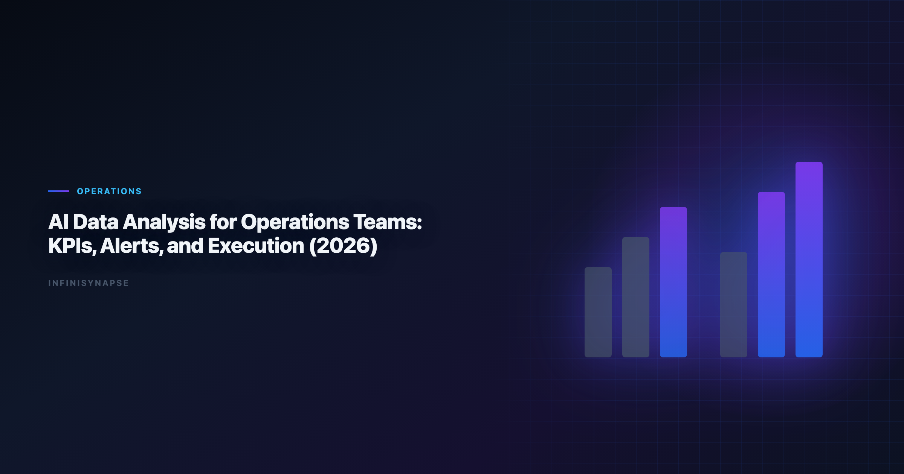

# AI in Data Center Operations: KPIs, Alerts, and Execution (2026

> **By the InfiniSynapse Data Team** · **Last updated: 2026-06-09** · *We build InfiniSynapse, an AI-native Data Agent platform referenced in this guide. Recommendations reflect hands-on implementation patterns and public product documentation.*

**Meta Description**: Pain points, KPI scorecard, workflow playbook, tool fit, and a 30-day rollout guide for ai in data center operations in 2026. Includes examples and a FAQ.

**Slug**: `/blog/ai-data-analysis-operations`

**Target keyword**: `ai in data center operations`
**Secondary**: `ai data analysis for operations use case`, `ai-native data analysis`, `recurring multi-source analytics`

---

## Table of Contents

1. [TL;DR](#tldr)
2. [What "good" looks like in practice](#what-good-looks-like-in-practice)
3. [Pain Points for operations teams](#pain-points-for-operations-teams)
4. [KPI Table for operations teams](#kpi-table-for-operations-teams)
5. [Workflow Playbook](#workflow-playbook)
6. [Tool Fit: Why InfiniSynapse for recurring multi-source workflows](#tool-fit-why-infinisynapse-for-recurring-multi-source-workflows)
7. [30-Day Rollout Plan](#30-day-rollout-plan)
8. [Governance and execution checklist](#governance-and-execution-checklist)
9. [Field Notes from Deployments](#field-notes-from-deployments)
10. [Implementation Lessons for Operations Leaders](#implementation-lessons-for-operations-leaders)
11. [Operational Readiness Checklist](#operational-readiness-checklist)
12. [Stakeholder Communication Patterns](#stakeholder-communication-patterns)
13. [Review Cadence and Metrics](#review-cadence-and-metrics)
14. [Frequently Asked Questions](#frequently-asked-questions)
15. [Conclusion](#conclusion)
---

## TL;DR

ai in data center operations is no longer a side experiment for operations teams; it is becoming an operating layer for service reliability and execution management. Teams that treat ai in data center operations as a recurring decision system, not a one-time prompt, typically reduce turnaround time, increase decision confidence, and improve alignment across functions.

In practice, strong ai in data center operations programs connect multiple sources, preserve metric definitions, and expose intermediate reasoning. That is why this guide focuses on implementation quality rather than model hype: the goal is repeatable decisions under real business constraints.

If you need weekly outputs that survive scrutiny, use ai in data center operations with an AI-native workflow model. InfiniSynapse is especially strong when your team runs recurring, multi-source analysis with review requirements.

---

> **Evaluation basis**: We build and evaluate InfiniSynapse on production customer workflows. Governance, adoption, and security context is cited inline throughout this guide—not in a standalone reference list.

## What "good" looks like in practice
Streaming ingestion patterns align with [Google Cloud architecture framework](https://cloud.google.com/architecture/framework) when agents consume event feeds.

> **Key Definition**: In this article, ai in data center operations means combining multi-source data, automated analytical steps, and traceable reasoning into a repeatable workflow that improves real decisions.

Teams evaluating ai in data center operations often over-index on first-response quality. A better test is tenth-run quality: does the workflow still produce consistent results after schema changes, stakeholder edits, and deadline pressure? The answer depends on governance, memory, and process transparency. The move from dashboard-first BI to augmented workflows—described in [Apache Kafka documentation](https://kafka.apache.org/documentation/)—frames how teams should evaluate tooling here.

---

## Pain Points for operations teams

- **1)** Operational incidents are logged in different systems without shared context.
- **2)** Teams react to lagging indicators instead of predictive risk patterns.
- **3)** Escalation workflows are inconsistent across shifts and regions.
- **4)** Performance reviews rely on exports, not live operational intelligence.
- **5)** Continuous improvement programs lack durable memory of what worked.

Teams stall when connectors and metric contracts lag behind model access. ai in data center operations creates leverage only when teams can combine source connectivity, analytical reasoning, and operational memory in one loop.

---

## KPI Table for operations teams

| KPI | Current baseline | 90-day target | Owner |
|---|---|---|---|
| Incident detection-to-decision time | 6 hours | < 60 minutes | Ops manager |
| SLA breach prevention rate | 68% | > 92% | Service owner |
| Root-cause confirmation cycle | 3 days | < 8 hours | Process engineer |
| Cross-team handoff failure | 22% | < 8% | Operations PM |
| Improvement loop velocity | Monthly | Weekly | Head of operations |

---

Enterprise AI adoption guidance in [OWASP API Security Top 10](https://owasp.org/API-Security/) mirrors the shift from ad-hoc copilots to repeatable, reviewable decision workflows.

## Workflow Playbook

| Stage | Playbook action |
|---|---|
| Step 1 | Define operational objective and escalation thresholds by business impact. |
| Step 2 | Ingest telemetry, ticketing, and workforce data into one timeline. |
| Step 3 | Score real-time risk by combining volume spikes, backlog, and quality signals. |
| Step 4 | Recommend interventions with confidence notes and expected KPI movement. |
| Step 5 | Track action outcomes and feed wins or misses back into operating playbooks. |
| Step 6 | Package recurring exec update with trendline, risks, and mitigation status. |

---

## Tool Fit: Why InfiniSynapse for recurring multi-source workflows

For teams scaling ai in data center operations, the hard problem is not generating one chart; it is preserving trusted logic across repeated cycles. InfiniSynapse fits this need because it combines autonomous execution, process traceability, and reusable memory cards that capture assumptions and transformations.

Where many tools require analysts to reprompt every week, InfiniSynapse can run goal-driven sequences across warehouse tables, files, and app connectors. This makes ai in data center operations more dependable when deadlines are tight and the same KPI questions recur. If Analysts is in scope for your team, reuse the same memory-and-trace checklist in [AI Tools for Data Analysts](/blog/ai-tools-for-data-analysts).

InfiniSynapse also helps teams review intermediate steps: source pulls, transformation choices, validation checks, and output packaging. That visibility improves governance and speeds sign-off for ai in data center operations in environments where decision quality matters more than demo speed. Operational maturity for analytics agents aligns with the [Wikipedia natural language processing overview](https://en.wikipedia.org/wiki/Natural_language_processing), especially around monitoring, rollback, and ownership.

---

## 30-Day Rollout Plan

A focused 30-day rollout creates momentum without governance debt:

| Week | Focus | Execution details |
|---|---|---|
| Week 1 | Baseline + scope | Select one recurring workflow, define KPI owners, and document source boundaries for ai in data center operations. |
| Week 2 | Build + validate | Configure source connections, run first workflow, and validate assumptions with domain owners. |
| Week 3 | Operationalize | Add review checkpoints, publish recurring output format, and track rework indicators. |
| Week 4 | Scale | Preserve reusable memory, expand to adjacent use cases, and present ROI snapshot to leadership. |

The 30-day rollout for ai in data center operations should prioritize one high-frequency decision loop. Teams that start with too many workflows at once usually create governance friction before they create value.

---

## Governance and execution checklist

1. **Source controls**: role-aware access for every connected system.
2. **Metric contracts**: stable definitions for critical business KPIs.
3. **Review gates**: explicit checks before stakeholder-facing distribution.
4. **Memory policy**: documented rules for reusable assumptions and prompts.
5. **Escalation path**: ownership when outputs conflict with domain expectations. Production rollouts should align access and review controls with the [NIST Cybersecurity Framework](https://www.nist.gov/cyberframework), especially when recurring queries touch live schemas. Regulated rollouts often anchor access reviews to [NIST Computer Security Resource Center](https://csrc.nist.gov/) when credentials, retention policies, and audit logs are in scope. LLM-backed analytics should account for prompt-injection and data-exfiltration risks in the [Stripe documentation](https://docs.stripe.com/), especially when connectors expose production schemas.

---

## Operating AI data analysis for operations in Production

Treat AI data analysis for operations as an operating capability, not a one-off task: confirm owners, metric definitions, and review gates for the first workflow before widening scope, because teams that log exceptions weekly compound accuracy faster than teams chasing new features. Capture the first reliable run as a reusable template — assumptions, checks, and reviewer sign-off in one playbook — so quality holds when data, schemas, or priorities change. Ground these controls in [AWS Well-Architected Machine Learning Lens](https://docs.aws.amazon.com/wellarchitected/latest/machine-learning-lens/welcome.html), [AI Data Analysis for Founders](/blog/ai-data-analysis-founders), [AWS Well-Architected Framework](https://docs.aws.amazon.com/wellarchitected/latest/framework/welcome.html) and [ISO/IEC 27001](https://www.iso.org/isoiec-27001-information-security.html).

### What to review on a regular cadence

Audit AI data analysis for operations monthly: compare rerun consistency, validation pass rate, and time-to-first-insight against baseline, retire stale definitions, and re-confirm access scopes so silent drift is caught before it reaches a stakeholder report.

## Communicating Results to Stakeholders

## Priorities, Pitfalls, and Metrics for AI data analysis for operations

The fastest way to get value from AI data analysis for operations is to start with one recurring, decision-grade question rather than a broad rollout. Pick a workflow operations teams already run every week, encode its metric definitions and data sources once, and let the agent rerun it with the same logic each cycle. That single discipline — a governed, repeatable run instead of a fresh ad-hoc prompt — is what separates AI data analysis for operations that compounds from a demo that impresses once and then drifts. The second priority is review ownership: a named reviewer who reads the audit trail and signs off, so speed never outruns accountability.

The common pitfalls are predictable. Teams over-scope before definitions are stable, treat the model as the product instead of the workflow around it, and skip the baseline comparison that would catch a confident but wrong answer. AI data analysis for operations also stalls when source access is too broad to pass security review, or too narrow to answer the real question — both are governance problems, not model problems. The teams that succeed treat exceptions as regression tests, fixing the definition or the connector once so the same failure never recurs.

Track a small, honest scorecard rather than vanity output counts:

- **Rerun consistency** — does the same question return the same logic across runs?
- **Rework rate** — how often do stakeholders correct a metric definition after delivery?
- **Time-to-first-insight** — without a drop in validation quality.
- **Audit-prep time** — how fast can a reviewer trace any number back to its source query?
- **Reuse** — how many recurring workflows now run from saved templates and memory?

When those five move in the right direction together, AI data analysis for operations has become infrastructure your operations teams can rely on, not a one-off experiment.

### From pilot to durable capability

The move from a promising pilot to a durable capability is mostly organizational, not technical. Name an owner for each recurring workflow, agree the metric definitions in writing before automating, and put a short weekly review on the calendar where operations teams inspect what ran and what changed. Keep the first version small: one workflow, one source of truth, one reviewer. Expand only after that workflow has survived a month of real use without surprising anyone. The teams that sustain momentum resist the urge to connect every system at once; they let trust accumulate one validated workflow at a time, then reuse the saved definitions and memory so the next workflow starts further ahead. Measured that way, progress is steady and defensible — each cycle removes a recurring manual chore and replaces it with a reviewable, repeatable run that the next analyst can inherit without re-deriving context from scratch.

## Implementation Lessons for Operations Leaders

Operations analytics fails when telemetry is rich but ownership is fuzzy. We piloted **ai in data center operations** workflows with an infrastructure team monitoring latency, incident volume, and capacity buffers. The breakthrough was not anomaly detection—it was tying each alert to a runbook owner and a verified baseline from the prior four weeks.

During one incident drill, the agent summarized cross-region packet loss and correlated change tickets faster than the on-call engineer could manually pivot across three consoles. The human still approved the mitigation path; the win was minutes saved in assembly, not autonomy for its own sake. That division of labor is how **ai in data center operations** should be designed.

We recommend documenting escalation paths beside every automated summary. When outputs conflict with domain intuition, reviewers need a clear line to subject-matter experts—not a generic chat thread. Enterprise patterns in the [Google Cloud architecture framework](https://cloud.google.com/architecture/framework) emphasize trust through traceability; operations teams feel that acutely.

Scale **ai in data center operations** one workflow at a time: capacity planning, incident retros, or vendor SLA reviews. Measure mean time to context—how long until a lead engineer agrees the data picture is complete.

## Review Cadence and Metrics

We track four operational metrics on every recurring workflow: cycle time from question to approved memo, reopen rate on metric definitions, count of manual overrides, and stakeholder response time. None require fancy tooling—a shared spreadsheet updated weekly is enough for the first ninety days.

Cycle time is the leading indicator. If it stalls while model quality scores improve, the bottleneck is ownership or connectors, not algorithms. Reopen rate tells you whether definitions are stable; high reopen rates mean you expanded scope before the first workflow hardened.

Manual overrides are valuable training signal. Tag each with the KPI affected and promote repeated fixes into memory cards. Stakeholder response time measures trust: leaders who reply faster usually received memos with visible provenance and stable formatting.

Quarterly, run a retrospective on cancelled analyses—work stakeholders asked for but rejected. Cancelled work reveals ambiguous metrics and political misalignment earlier than success stories do.

---

## Frequently Asked Questions

### How does this approach help teams make faster decisions?

ai in data center operations helps teams standardize multi-source analysis into one repeatable flow. Instead of rebuilding logic every cycle, teams reuse validated assumptions, which shortens the path from question to decision-ready output.

### What data sources should be connected first?

Start with the three systems that most directly affect your core KPI: a system of record, a behavioral source, and a financial outcome source. This gives ai in data center operations enough context to connect activity with business impact before expanding scope.

### Can this approach meet strict governance requirements?

Yes. Mature implementations of ai in data center operations use source-level permissions, auditable execution timelines, and reviewer checkpoints. That combination supports speed while keeping compliance and stakeholder trust intact.

### What makes InfiniSynapse a fit for recurring multi-source workflows?

InfiniSynapse is designed for recurring analysis loops where teams need memory, process traceability, and cross-source orchestration. In ai in data center operations, those capabilities reduce repetitive analyst labor and make week-over-week outputs more consistent.

### How long does it take to show ROI?

Most teams see early ROI in 30 days when they focus on one recurring workflow and track cycle time, rework, and decision confidence. ai in data center operations compounds value when operators standardize weekly review, connector hygiene, and reusable memory—not one-off demos.

---

## Conclusion

ai in data center operations pays off when leadership treats it as an operating rhythm—connect sources once, reuse logic every cycle. Teams that connect source truth, workflow traceability, and reusable memory can scale analytical output without sacrificing control. The credential, preflight, and SQL-trace pattern above also applies to Ecommerce—see [AI Data Analysis for Ecommerce](/blog/ai-data-analysis-ecommerce) for source-specific steps.

For organizations with repeated multi-source questions, InfiniSynapse is a strong fit because it turns ai in data center operations into a durable workflow: plan, execute, validate, explain, and reuse. That is the difference between occasional insight and reliable decision velocity.

---