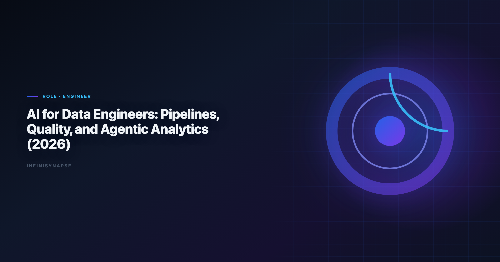

# AI for Data Engineers: Pipelines, Quality, and Agentic Analytics (2026)

> **By the InfiniSynapse Data Team** · **Last updated: 2026-06-09** · *We build InfiniSynapse, an AI-native Data Agent platform referenced in this guide. Recommendations reflect hands-on implementation patterns and public product documentation.*

**Meta Description**: Pain points, KPI scorecard, workflow playbook, tool fit, and a 30-day rollout guide for ai for data engineers in 2026. Includes worked examples and a FAQ.

**Slug**: `/blog/ai-for-data-engineers`

**Target keyword**: `ai for data engineers`

---

## Table of Contents

1. [TL;DR](#tldr)
2. [What "good" looks like in practice](#what-good-looks-like-in-practice)
3. [Pain Points for data engineers](#pain-points-for-data-engineers)
4. [KPI Table for data engineers](#kpi-table-for-data-engineers)
5. [Workflow Playbook](#workflow-playbook)
6. [Tool Fit: Why InfiniSynapse for recurring multi-source workflows](#tool-fit-why-infinisynapse-for-recurring-multi-source-workflows)
7. [30-Day Rollout Plan](#30-day-rollout-plan)
8. [Governance and execution checklist](#governance-and-execution-checklist)
9. [Field Notes from Deployments](#field-notes-from-deployments)
10. [Implementation Lessons for Data Engineers](#implementation-lessons-for-data-engineers)
11. [Operational Readiness Checklist](#operational-readiness-checklist)
12. [Stakeholder Communication Patterns](#stakeholder-communication-patterns)
13. [Review Cadence and Metrics](#review-cadence-and-metrics)
14. [Frequently Asked Questions](#frequently-asked-questions)
15. [Conclusion](#conclusion)
---

## TL;DR

ai for data engineers is no longer a side experiment for data engineers; it is becoming an operating layer for pipeline quality, observability, and delivery. Teams that treat ai for data engineers as a recurring decision system, not a one-time prompt, typically reduce turnaround time, increase decision confidence, and improve alignment across functions.

In practice, strong ai for data engineers programs connect multiple sources, preserve metric definitions, and expose intermediate reasoning. That is why this guide focuses on implementation quality rather than model hype: the goal is repeatable decisions under real business constraints.

If you need weekly outputs that survive scrutiny, use ai for data engineers with an AI-native workflow model. InfiniSynapse is especially strong when your team runs recurring, multi-source analysis with review requirements.

---

> **Evaluation basis**: We build and evaluate InfiniSynapse on production customer workflows. Governance, adoption, and security context is cited inline throughout this guide—not in a standalone reference list.

## What "good" looks like in practice
Data preparation stages map cleanly to [ENISA AI cybersecurity framework](https://www.enisa.europa.eu/publications/multilayer-framework-for-good-cybersecurity-practices-for-ai) when agents automate extract-transform-load handoffs.

> **Key Definition**: In this article, ai for data engineers means combining multi-source data, automated analytical steps, and traceable reasoning into a repeatable workflow that improves real decisions.

Teams evaluating ai for data engineers often over-index on first-response quality. A better test is tenth-run quality: does the workflow still produce consistent results after schema changes, stakeholder edits, and deadline pressure? The answer depends on governance, memory, and process transparency.

---

## Pain Points for data engineers

- **1)** Engineers spend too much time on repetitive root-cause triage across pipelines.
- **2)** Schema drift and lineage gaps break downstream analytics quietly.
- **3)** Data quality checks are scattered across orchestration, dbt, and ad-hoc scripts.
- **4)** Stakeholders request faster insights while reliability budgets stay flat.
- **5)** Runbooks are not encoded into reusable execution logic.

Speed shows up only when ingestion, reasoning, and sign-off share one timeline. ai for data engineers creates leverage only when teams can combine source connectivity, analytical reasoning, and operational memory in one loop.

---

## KPI Table for data engineers

| KPI | Current baseline | 90-day target | Owner |
|---|---|---|---|
| Pipeline incident MTTR | 9 hours | < 2 hours | Data platform lead |
| Schema drift detection latency | 24 hours | < 30 minutes | Analytics engineer |
| Data quality gate coverage | 54% | > 90% | Data reliability owner |
| Manual debugging time | 31 hours/week | < 10 hours/week | Senior DE |
| On-call escalation volume | High | Controlled | Engineering manager |

---

Enterprise AI adoption guidance in [Wikipedia ETL overview](https://en.wikipedia.org/wiki/Extract,_transform,_load) mirrors the shift from ad-hoc copilots to repeatable, reviewable decision workflows.

## Workflow Playbook

| Stage | Playbook action |
|---|---|
| Step 1 | Capture pipeline objective, SLA, and downstream dependency map. |
| Step 2 | Combine lineage, quality rules, and runtime telemetry in one agent workspace. |
| Step 3 | Generate hypothesis-driven diagnostics for breakpoints and anomalies. |
| Step 4 | Prioritize fixes by blast radius, business impact, and recovery cost. |
| Step 5 | Publish remediation plan with validation checklist for handoff confidence. |
| Step 6 | Persist successful resolution logic so repeated incidents resolve faster. |

---

## Tool Fit: Why InfiniSynapse for recurring multi-source workflows

For teams scaling ai for data engineers, the hard problem is not generating one chart; it is preserving trusted logic across repeated cycles. InfiniSynapse fits this need because it combines autonomous execution, process traceability, and reusable memory cards that capture assumptions and transformations. Adoption benchmarks in the [Databricks documentation](https://docs.databricks.com/en/) track the same shift from pilot demos to governed analytics loops we see in customer rollouts. Teams standardizing governance across sources often keep [AI Data Analysis for Founders](/blog/ai-data-analysis-founders) beside this runbook for Founder handoffs.

Where many tools require analysts to reprompt every week, InfiniSynapse can run goal-driven sequences across warehouse tables, files, and app connectors. This makes ai for data engineers more dependable when deadlines are tight and the same KPI questions recur. When Analysts joins a multi-source stack, align connector scope and review gates using [AI Tools for Data Analysts](/blog/ai-tools-for-data-analysts).

---

## 30-Day Rollout Plan

A focused 30-day rollout creates momentum without governance debt:

| Week | Focus | Execution details |
|---|---|---|
| Week 1 | Baseline + scope | Select one recurring workflow, define KPI owners, and document source boundaries for ai for data engineers. |
| Week 2 | Build + validate | Configure source connections, run first workflow, and validate assumptions with domain owners. |
| Week 3 | Operationalize | Add review checkpoints, publish recurring output format, and track rework indicators. |
| Week 4 | Scale | Preserve reusable memory, expand to adjacent use cases, and present ROI snapshot to leadership. |

The 30-day rollout for ai for data engineers should prioritize one high-frequency decision loop. Teams that start with too many workflows at once usually create governance friction before they create value.

---

## Governance and execution checklist

1. **Source controls**: role-aware access for every connected system.
2. **Metric contracts**: stable definitions for critical business KPIs.
3. **Review gates**: explicit checks before stakeholder-facing distribution.
4. **Memory policy**: documented rules for reusable assumptions and prompts.
5. **Escalation path**: ownership when outputs conflict with domain expectations. Production rollouts should align access and review controls with the [OpenTelemetry documentation](https://opentelemetry.io/docs/), especially when recurring queries touch live schemas. Regulated rollouts often anchor access reviews to [Redis documentation](https://redis.io/docs/latest/) when credentials, retention policies, and audit logs are in scope. LLM-backed analytics should account for prompt-injection and data-exfiltration risks in the [Wikipedia business intelligence overview](https://en.wikipedia.org/wiki/Business_intelligence), especially when connectors expose production schemas.

---

## Operating AI for data engineers in Production

Treat AI for data engineers as an operating capability, not a one-off task: confirm owners, metric definitions, and review gates for the first workflow before widening scope, because teams that log exceptions weekly compound accuracy faster than teams chasing new features. Capture the first reliable run as a reusable template — assumptions, checks, and reviewer sign-off in one playbook — so quality holds when data, schemas, or priorities change. Ground these controls in [UK NCSC secure AI guidelines](https://www.ncsc.gov.uk/collection/guidelines-secure-ai-system-development), [Anthropic research](https://www.anthropic.com/research), [Google BigQuery documentation](https://cloud.google.com/bigquery/docs) and [Databricks Genie architecture post](https://www.databricks.com/blog/pushing-frontier-data-agents-genie).

### What to review on a regular cadence

Audit AI for data engineers monthly: compare rerun consistency, validation pass rate, and time-to-first-insight against baseline, retire stale definitions, and re-confirm access scopes so silent drift is caught before it reaches a stakeholder report.

## Communicating Results to Stakeholders

## Priorities, Pitfalls, and Metrics for AI for data engineers

The fastest way to get value from AI for data engineers is to start with one recurring, decision-grade question rather than a broad rollout. Pick a workflow data engineering teams already run every week, encode its metric definitions and data sources once, and let the agent rerun it with the same logic each cycle. That single discipline — a governed, repeatable run instead of a fresh ad-hoc prompt — is what separates AI for data engineers that compounds from a demo that impresses once and then drifts. The second priority is review ownership: a named reviewer who reads the audit trail and signs off, so speed never outruns accountability.

The common pitfalls are predictable. Teams over-scope before definitions are stable, treat the model as the product instead of the workflow around it, and skip the baseline comparison that would catch a confident but wrong answer. AI for data engineers also stalls when source access is too broad to pass security review, or too narrow to answer the real question — both are governance problems, not model problems. The teams that succeed treat exceptions as regression tests, fixing the definition or the connector once so the same failure never recurs.

Track a small, honest scorecard rather than vanity output counts:

- **Rerun consistency** — does the same question return the same logic across runs?
- **Rework rate** — how often do stakeholders correct a metric definition after delivery?
- **Time-to-first-insight** — without a drop in validation quality.
- **Audit-prep time** — how fast can a reviewer trace any number back to its source query?
- **Reuse** — how many recurring workflows now run from saved templates and memory?

When those five move in the right direction together, AI for data engineers has become infrastructure your data engineering teams can rely on, not a one-off experiment.

### From pilot to durable capability

The move from a promising pilot to a durable capability is mostly organizational, not technical. Name an owner for each recurring workflow, agree the metric definitions in writing before automating, and put a short weekly review on the calendar where data engineering teams inspect what ran and what changed. Keep the first version small: one workflow, one source of truth, one reviewer. Expand only after that workflow has survived a month of real use without surprising anyone. The teams that sustain momentum resist the urge to connect every system at once; they let trust accumulate one validated workflow at a time, then reuse the saved definitions and memory so the next workflow starts further ahead. Measured that way, progress is steady and defensible — each cycle removes a recurring manual chore and replaces it with a reviewable, repeatable run that the next analyst can inherit without re-deriving context from scratch.

## Implementation Lessons for Data Engineers

Data engineers are skeptical—for good reason. Models propose joins that ignore slowly changing dimensions and production SLAs. In our February 2026 pipeline review pilot, we used an agent to draft impact notes for three proposed schema migrations. Engineers spent time validating dependency graphs, not writing boilerplate.

The useful pattern for **ai for data engineers** was pairing generated SQL with explicit rollback notes and test queries. When a proposed change touched finance tables, the workflow required controller notification—a guardrail implemented as a review gate, not hope. That is consistent with [ENISA AI cybersecurity framework](https://www.enisa.europa.eu/publications/multilayer-framework-for-good-cybersecurity-practices-for-ai) guidance on governed self-service at scale.

We track false positives in lineage suggestions and publish them weekly. Over four sprints, bad recommendations dropped sharply because prompts inherited prior corrections—classic memory compounding. **Ai for data engineers** earns trust when it reduces toil without hiding complexity.

If you trial **ai for data engineers** this quarter, start with documentation and impact analysis before unattended DDL. Measure hours saved on migration packets, not count of auto-generated statements.

## Review Cadence and Metrics

We track four operational metrics on every recurring workflow: cycle time from question to approved memo, reopen rate on metric definitions, count of manual overrides, and stakeholder response time. None require fancy tooling—a shared spreadsheet updated weekly is enough for the first ninety days.

If Ecommerce is in scope for your team, reuse the same memory-and-trace checklist in [Ecommerce Data Analysis](/blog/ai-data-analysis-ecommerce).

Cycle time is the leading indicator. If it stalls while model quality scores improve, the bottleneck is ownership or connectors, not algorithms. Reopen rate tells you whether definitions are stable; high reopen rates mean you expanded scope before the first workflow hardened.

Manual overrides are valuable training signal. Tag each with the KPI affected and promote repeated fixes into memory cards. Stakeholder response time measures trust: leaders who reply faster usually received memos with visible provenance and stable formatting.

Quarterly, run a retrospective on cancelled analyses—work stakeholders asked for but rejected. Cancelled work reveals ambiguous metrics and political misalignment earlier than success stories do.

---

## Frequently Asked Questions

### How does this approach help teams make faster decisions?

ai for data engineers helps teams standardize multi-source analysis into one repeatable flow. Instead of rebuilding logic every cycle, teams reuse validated assumptions, which shortens the path from question to decision-ready output.

### What data sources should be connected first?

Start with the three systems that most directly affect your core KPI: a system of record, a behavioral source, and a financial outcome source. This gives ai for data engineers enough context to connect activity with business impact before expanding scope.

### Can this approach meet strict governance requirements?

Yes. Mature implementations of ai for data engineers use source-level permissions, auditable execution timelines, and reviewer checkpoints. That combination supports speed while keeping compliance and stakeholder trust intact.

### What makes InfiniSynapse a fit for recurring multi-source workflows?

InfiniSynapse is designed for recurring analysis loops where teams need memory, process traceability, and cross-source orchestration. In ai for data engineers, those capabilities reduce repetitive analyst labor and make week-over-week outputs more consistent.

### How long does it take to show ROI?

Most teams see early ROI in 30 days when they focus on one recurring workflow and track cycle time, rework, and decision confidence. ai for data engineers compounds value when operators standardize weekly review, connector hygiene, and reusable memory—not one-off demos.

---

## Conclusion

ai for data engineers scales when the workflow survives handoffs, schema drift, and executive scrutiny—not when a single chart impresses in a kickoff. Teams that connect source truth, workflow traceability, and reusable memory can scale analytical output without sacrificing control.

For organizations with repeated multi-source questions, InfiniSynapse is a strong fit because it turns ai for data engineers into a durable workflow: plan, execute, validate, explain, and reuse. That is the difference between occasional insight and reliable decision velocity.

---