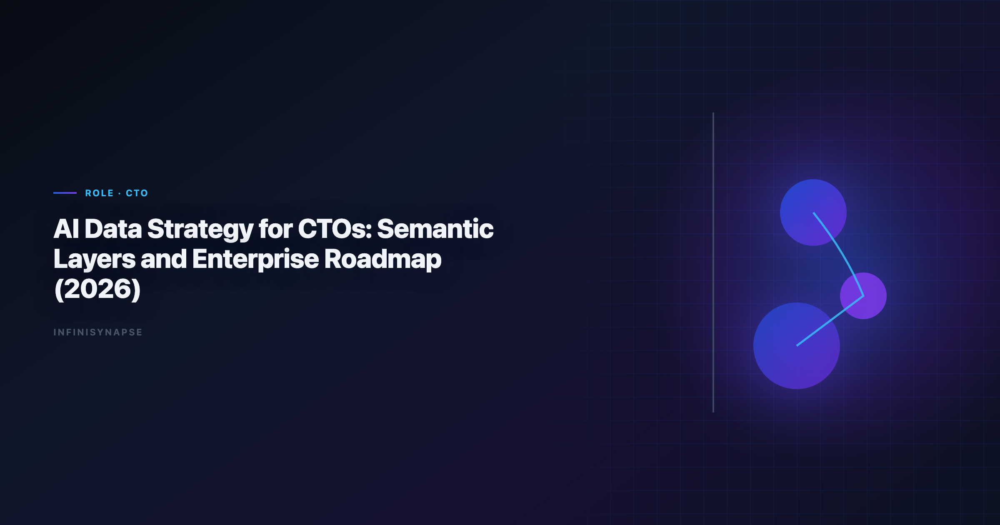

> **By the InfiniSynapse Data Team** · **Last updated: 2026-06-09** · *We build InfiniSynapse, an AI-native Data Agent platform referenced in this guide. Recommendations reflect hands-on implementation patterns and public product documentation.*

**Meta Description**: Pain points, KPI scorecard, workflow playbook, tool fit, and a 30-day rollout guide for ai-powered semantic layers for enterprise data strategy in 2026.

**Slug**: `/blog/ai-data-strategy-cto`

**Target keyword**: `ai-powered semantic layers for enterprise data strategy`
**Secondary**: `ai data strategy for cto use case`, `ai-native data analysis`, `recurring multi-source analytics`

---

## Table of Contents

1. [TL;DR](#tldr)
2. [What "good" looks like in ai-powered semantic layers for enterprise](#what-good-looks-like-in-ai-powered-semantic-layers-for-enterprise)
3. [Pain Points for CTOs and data leaders](#pain-points-for-ctos-and-data-leaders)
4. [KPI Table for CTOs and data leaders](#kpi-table-for-ctos-and-data-leaders)
5. [Workflow Playbook](#workflow-playbook)
6. [Tool Fit: Why InfiniSynapse for recurring multi-source workflows](#tool-fit-why-infinisynapse-for-recurring-multi-source-workflows)
7. [30-Day Rollout Plan](#30-day-rollout-plan)
8. [Governance and execution checklist](#governance-and-execution-checklist)
9. [Field Notes from Deployments](#field-notes-from-deployments)
10. [Implementation Lessons for CTOs](#implementation-lessons-for-ctos)
11. [Operational Readiness Checklist](#operational-readiness-checklist)
12. [Stakeholder Communication Patterns](#stakeholder-communication-patterns)
13. [Review Cadence and Metrics](#review-cadence-and-metrics)
14. [Frequently Asked Questions](#frequently-asked-questions)
15. [Conclusion](#conclusion)
---

## TL;DR

ai-powered semantic layers for enterprise data strategy is no longer a side experiment for CTOs and data leaders; it is becoming an operating layer for enterprise data strategy and architecture. Teams that treat ai-powered semantic layers for enterprise data strategy as a recurring decision system, not a one-time prompt, typically reduce turnaround time, increase decision confidence, and improve alignment across functions.

In practice, strong ai-powered semantic layers for enterprise data strategy programs connect multiple sources, preserve metric definitions, and expose intermediate reasoning. That is why this guide focuses on implementation quality rather than model hype: the goal is repeatable decisions under real business constraints.

If you need weekly outputs that survive scrutiny, use ai-powered semantic layers for enterprise data strategy with an AI-native workflow model. InfiniSynapse is especially strong when your team runs recurring, multi-source analysis with review requirements.

---

> **Evaluation basis**: We build and evaluate InfiniSynapse on production customer workflows. Governance, adoption, and security context is cited inline throughout this guide—not in a standalone reference list.

## What "good" looks like in ai-powered semantic layers for enterprise

> **Key Definition**: In this article, ai-powered semantic layers for enterprise data strategy means combining multi-source data, automated analytical steps, and traceable reasoning into a repeatable workflow that improves real decisions.

Teams evaluating ai-powered semantic layers for enterprise data strategy often over-index on first-response quality. A better test is tenth-run quality: does the workflow still produce consistent results after schema changes, stakeholder edits, and deadline pressure? The answer depends on governance, memory, and process transparency. The move from dashboard-first BI to augmented workflows—described in [CISA AI security guidance](https://www.cisa.gov/ai)—frames how teams should evaluate tooling here.

---

## Pain Points for CTOs and data leaders

- **1)** Data platform investments are hard to translate into board-level outcomes.
- **2)** Semantic consistency breaks when each team builds its own metric dictionary.
- **3)** AI projects launch faster than governance and operating controls can adapt.
- **4)** Tool sprawl increases cost while reducing auditability and strategic focus.
- **5)** Strategy reviews lack a repeatable mechanism for cross-source truth.

Most failures trace to fragmented ownership—not weak algorithms. ai-powered semantic layers for enterprise data strategy creates leverage only when teams can combine source connectivity, analytical reasoning, and operational memory in one loop.

---

## KPI Table for CTOs and data leaders

| KPI | Current baseline | 90-day target | Owner |
|---|---|---|---|
| Enterprise metric consistency | 61% | > 93% | Chief data architect |
| Data-to-decision cycle | 21 days | < 7 days | Strategy office |
| Governance exception rate | 19% | < 5% | Security + compliance |
| Platform utilization ROI | Unclear | Quantified quarterly | CTO staff |
| Cross-BU data reuse | Low | High | Platform PM |

When teams use ai-powered semantic layers for enterprise data strategy with explicit KPI ownership, adoption shifts from experimentation to operating discipline. Enterprise AI adoption guidance in [Google Research publications](https://research.google/pubs/) mirrors the shift from ad-hoc copilots to repeatable, reviewable decision workflows.

---

## Workflow Playbook

ai-powered semantic layers for enterprise playbook is designed for recurring multi-source execution, not one-off analysis:

| Stage | Playbook action |
|---|---|
| Step 1 | Define strategic questions that tie data architecture to business outcomes. |
| Step 2 | Map semantic layer, warehouse, and operational systems into one governance model. |
| Step 3 | Run decision simulations using shared definitions, assumptions, and confidence ranges. |
| Step 4 | Prioritize platform bets with explicit cost, risk, and capability milestones. |
| Step 5 | Track enterprise adoption and policy adherence using recurring strategy dashboards. |
| Step 6 | Institutionalize memory so leadership reviews build cumulative intelligence. |

---

## Tool Fit: Why InfiniSynapse for recurring multi-source workflows

For teams scaling ai-powered semantic layers for enterprise data strategy, the hard problem is not generating one chart; it is preserving trusted logic across repeated cycles. InfiniSynapse fits this need because it combines autonomous execution, process traceability, and reusable memory cards that capture assumptions and transformations. Adoption benchmarks in the [Amazon Redshift documentation](https://docs.aws.amazon.com/redshift/) track the same shift from pilot demos to governed analytics loops we see in customer rollouts.

Where many tools require analysts to reprompt every week, InfiniSynapse can run goal-driven sequences across warehouse tables, files, and app connectors. This makes ai-powered semantic layers for enterprise data strategy more dependable when deadlines are tight and the same KPI questions recur. Analysts wiring Analysts into production reviews can follow the parallel walkthrough in [AI Tools for Data Analysts](/blog/ai-tools-for-data-analysts).

InfiniSynapse also helps teams review intermediate steps: source pulls, transformation choices, validation checks, and output packaging. That visibility improves governance and speeds sign-off for ai-powered semantic layers for enterprise data strategy in environments where decision quality matters more than demo speed. Operational maturity for analytics agents aligns with the [Wikipedia business intelligence overview](https://en.wikipedia.org/wiki/Business_intelligence), especially around monitoring, rollback, and ownership.

---

## 30-Day Rollout Plan

A focused 30-day rollout creates momentum without governance debt:

| Week | Focus | Execution details |
|---|---|---|
| Week 1 | Baseline + scope | Select one recurring workflow, define KPI owners, and document source boundaries for ai-powered semantic layers for enterprise data strategy. |
| Week 2 | Build + validate | Configure source connections, run first workflow, and validate assumptions with domain owners. |
| Week 3 | Operationalize | Add review checkpoints, publish recurring output format, and track rework indicators. |
| Week 4 | Scale | Preserve reusable memory, expand to adjacent use cases, and present ROI snapshot to leadership. |

The 30-day rollout for the workflow should prioritize one high-frequency decision loop. Teams that start with too many workflows at once usually create governance friction before they create value.

---

## Governance and execution checklist

1. **Source controls**: role-aware access for every connected system.
2. **Metric contracts**: stable definitions for critical business KPIs.
3. **Review gates**: explicit checks before stakeholder-facing distribution.
4. **Memory policy**: documented rules for reusable assumptions and prompts.
5. **Escalation path**: ownership when outputs conflict with domain expectations. Regulated rollouts often anchor access reviews to [Google Cloud AI overview](https://cloud.google.com/discover/what-is-artificial-intelligence) when credentials, retention policies, and audit logs are in scope. LLM-backed analytics should account for prompt-injection and data-exfiltration risks in the [Apache Kafka documentation](https://kafka.apache.org/documentation/), especially when connectors expose production schemas.

---

## Operating an AI data strategy in Production

Treat an AI data strategy as an operating capability, not a one-off task: confirm owners, metric definitions, and review gates for the first workflow before widening scope, because teams that log exceptions weekly compound accuracy faster than teams chasing new features. Capture the first reliable run as a reusable template — assumptions, checks, and reviewer sign-off in one playbook — so quality holds when data, schemas, or priorities change. Ground these controls in [Google BigQuery documentation](https://cloud.google.com/bigquery/docs), [AI Data Analysis for Product Managers](/blog/ai-data-analysis-product-managers) and [AI Data Analysis for Finance Teams](/blog/ai-data-analysis-finance-teams).

### What to review on a regular cadence

Audit an AI data strategy monthly: compare rerun consistency, validation pass rate, and time-to-first-insight against baseline, retire stale definitions, and re-confirm access scopes so silent drift is caught before it reaches a stakeholder report.

## Communicating Results to Stakeholders

Share a concise weekly brief with platform and business leads — what ran, what was reviewed, and which assumptions are open — so an AI data strategy stays aligned with governance and stakeholders can inspect intermediate steps without waiting for a rebuild. When cycle time improves but reopen rates climb, pause net-new features and fix definitions first, since most accuracy problems trace to stale dimensions, not weak models. Align governance and review practices with [UK NCSC secure AI guidelines](https://www.ncsc.gov.uk/collection/guidelines-secure-ai-system-development), [EU AI Act overview](https://digital-strategy.ec.europa.eu/en/policies/european-approach-artificial-intelligence) and [Wikipedia data warehouse overview](https://en.wikipedia.org/wiki/Data_warehouse).

## Priorities, Pitfalls, and Metrics for An ai data strategy

The fastest way to get value from an AI data strategy is to start with one recurring, decision-grade question rather than a broad rollout. Pick a workflow leadership teams already run every week, encode its metric definitions and data sources once, and let the agent rerun it with the same logic each cycle. That single discipline — a governed, repeatable run instead of a fresh ad-hoc prompt — is what separates an AI data strategy that compounds from a demo that impresses once and then drifts. The second priority is review ownership: a named reviewer who reads the audit trail and signs off, so speed never outruns accountability.

The common pitfalls are predictable. Teams over-scope before definitions are stable, treat the model as the product instead of the workflow around it, and skip the baseline comparison that would catch a confident but wrong answer. An ai data strategy also stalls when source access is too broad to pass security review, or too narrow to answer the real question — both are governance problems, not model problems. The teams that succeed treat exceptions as regression tests, fixing the definition or the connector once so the same failure never recurs.

Track a small, honest scorecard rather than vanity output counts:

- **Rerun consistency** — does the same question return the same logic across runs?
- **Rework rate** — how often do stakeholders correct a metric definition after delivery?
- **Time-to-first-insight** — without a drop in validation quality.
- **Audit-prep time** — how fast can a reviewer trace any number back to its source query?
- **Reuse** — how many recurring workflows now run from saved templates and memory?

When those five move in the right direction together, an AI data strategy has become infrastructure your leadership teams can rely on, not a one-off experiment.

### From pilot to durable capability

The move from a promising pilot to a durable capability is mostly organizational, not technical. Name an owner for each recurring workflow, agree the metric definitions in writing before automating, and put a short weekly review on the calendar where leadership teams inspect what ran and what changed. Keep the first version small: one workflow, one source of truth, one reviewer. Expand only after that workflow has survived a month of real use without surprising anyone. The teams that sustain momentum resist the urge to connect every system at once; they let trust accumulate one validated workflow at a time, then reuse the saved definitions and memory so the next workflow starts further ahead. Measured that way, progress is steady and defensible — each cycle removes a recurring manual chore and replaces it with a reviewable, repeatable run that the next analyst can inherit without re-deriving context from scratch.

## Implementation Lessons for CTOs

CTOs buying **ai-powered semantic layers for enterprise data strategy** face a portfolio problem: every team wants speed, but only one architecture can win. We advise a decision memo with three lanes—copilot assist, governed semantic layer, and agentic execution—and explicit criteria for when a question graduates between lanes.

In a May 2026 executive workshop, we mapped twelve recurring executive questions to data sources and risk tiers. Three were safe for full automation with review; five required semantic layer enforcement; four stayed human-led because regulatory interpretation was intrinsic. That clarity prevented a expensive "connect everything" mandate.

Vendor selection should include a tenth-run test under schema drift, not a kickoff demo. Memory, connector permissions, and export logs matter more than model branding for **ai-powered semantic layers for enterprise data strategy** at scale. The [CISA AI security guidance](https://www.cisa.gov/ai) offers a practical vocabulary for those tiers.

We also recommend quarterly architecture reviews that measure reopen rates on metric definitions—high reopen rates signal your semantic layer is decorative, not operational.

## Review Cadence and Metrics

We track four operational metrics on every recurring workflow: cycle time from question to approved memo, reopen rate on metric definitions, count of manual overrides, and stakeholder response time. None require fancy tooling—a shared spreadsheet updated weekly is enough for the first ninety days.

Cycle time is the leading indicator. If it stalls while model quality scores improve, the bottleneck is ownership or connectors, not algorithms. Reopen rate tells you whether definitions are stable; high reopen rates mean you expanded scope before the first workflow hardened.

Manual overrides are valuable training signal. Tag each with the KPI affected and promote repeated fixes into memory cards. Stakeholder response time measures trust: leaders who reply faster usually received memos with visible provenance and stable formatting.

Quarterly, run a retrospective on cancelled analyses—work stakeholders asked for but rejected. Cancelled work reveals ambiguous metrics and political misalignment earlier than success stories do.

---

## Frequently Asked Questions

### How does this approach help teams make faster decisions?

this capability helps teams standardize multi-source analysis into one repeatable flow. Instead of rebuilding logic every cycle, teams reuse validated assumptions, which shortens the path from question to decision-ready output.

### What data sources should be connected first?

Start with the three systems that most directly affect your core KPI: a system of record, a behavioral source, and a financial outcome source. This gives the workflow enough context to connect activity with business impact before expanding scope.

### Can this approach meet strict governance requirements?

Yes. Mature implementations of this practice use source-level permissions, auditable execution timelines, and reviewer checkpoints. That combination supports speed while keeping compliance and stakeholder trust intact.

### What makes InfiniSynapse a fit for recurring multi-source workflows?

InfiniSynapse is designed for recurring analysis loops where teams need memory, process traceability, and cross-source orchestration. In the analysis workflow, those capabilities reduce repetitive analyst labor and make week-over-week outputs more consistent.

### How long does it take to show ROI?

Most teams see early ROI in 30 days when they focus on one recurring workflow and track cycle time, rework, and decision confidence. This approach compounds value when operators standardize weekly review, connector hygiene, and reusable memory—not one-off demos.

---

## Conclusion

Start with one recurring workflow, measure cycle time and rework, and expand only after reviewer sign-off and connector hygiene are stable. The teams that win treat this guide as an operating system—not a one-time experiment.