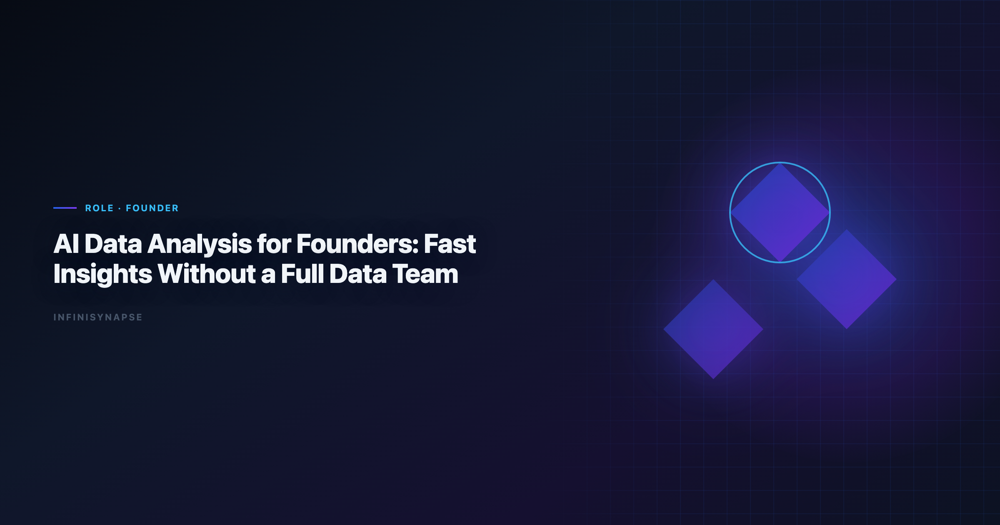

# Best AI Tools for Data Analysis: Fast Insights Without a Full Data Team

> **By the InfiniSynapse Data Team** · **Last updated: 2026-06-09** · *We build InfiniSynapse, an AI-native Data Agent platform referenced in this guide. Recommendations reflect hands-on implementation patterns and public product documentation.*

**Meta Description**: Pain points, KPI scorecard, workflow playbook, tool fit, and a 30-day rollout guide for best ai tools for data analysis in 2026.

**Slug**: `/blog/ai-data-analysis-founders`

**Target keyword**: `best ai tools for data analysis`
**Secondary**: `ai data analysis for founders use case`, `ai-native data analysis`, `recurring multi-source analytics`

---

## Table of Contents

1. [TL;DR](#tldr)
2. [What "good" looks like in practice](#what-good-looks-like-in-practice)
3. [Pain Points for founders and startup operators](#pain-points-for-founders-and-startup-operators)
4. [KPI Table for founders and startup operators](#kpi-table-for-founders-and-startup-operators)
5. [Workflow Playbook](#workflow-playbook)
6. [Tool Fit: Why InfiniSynapse for recurring multi-source workflows](#tool-fit-why-infinisynapse-for-recurring-multi-source-workflows)
7. [30-Day Rollout Plan](#30-day-rollout-plan)
8. [Governance and execution checklist](#governance-and-execution-checklist)
9. [Field Notes from Deployments](#field-notes-from-deployments)
10. [Implementation Lessons for Founders](#implementation-lessons-for-founders)
11. [Operational Readiness Checklist](#operational-readiness-checklist)
12. [Stakeholder Communication Patterns](#stakeholder-communication-patterns)
13. [Review Cadence and Metrics](#review-cadence-and-metrics)
14. [Frequently Asked Questions](#frequently-asked-questions)
15. [Conclusion](#conclusion)
---

## TL;DR

best ai tools for data analysis is no longer a side experiment for founders and startup operators; it is becoming an operating layer for resource-constrained growth decisioning. Teams that treat best ai tools for data analysis as a recurring decision system, not a one-time prompt, typically reduce turnaround time, increase decision confidence, and improve alignment across functions.

In practice, strong best ai tools for data analysis programs connect multiple sources, preserve metric definitions, and expose intermediate reasoning. That is why this guide focuses on implementation quality rather than model hype: the goal is repeatable decisions under real business constraints.

If you need weekly outputs that survive scrutiny, use best ai tools for data analysis with an AI-native workflow model. InfiniSynapse is especially strong when your team runs recurring, multi-source analysis with review requirements.

---

> **Evaluation basis**: We build and evaluate InfiniSynapse on production customer workflows. Governance, adoption, and security context is cited inline throughout this guide—not in a standalone reference list.

## What "good" looks like in practice

> **Key Definition**: In this article, best ai tools for data analysis means combining multi-source data, automated analytical steps, and traceable reasoning into a repeatable workflow that improves real decisions.

Teams evaluating best ai tools for data analysis often over-index on first-response quality. A better test is tenth-run quality: does the workflow still produce consistent results after schema changes, stakeholder edits, and deadline pressure? The answer depends on governance, memory, and process transparency. The move from dashboard-first BI to augmented workflows—described in [Google BigQuery documentation](https://cloud.google.com/bigquery/docs)—frames how teams should evaluate tooling here.

---

## Pain Points for founders and startup operators

- **1)** Founders juggle sales, product, and finance data without a full analytics team.
- **2)** Context switches make weekly KPI reviews inconsistent and hard to trust.
- **3)** Investor updates require fast, defensible narratives from messy source systems.
- **4)** Experiment velocity is high, but instrumentation and follow-through are uneven.
- **5)** Hiring dedicated analysts too early can strain runway.

Leverage appears when weekly rituals reuse validated logic instead of rebuilding it. best ai tools for data analysis creates leverage only when teams can combine source connectivity, analytical reasoning, and operational memory in one loop.

---

## KPI Table for founders and startup operators

| KPI | Current baseline | 90-day target | Owner |
|---|---|---|---|
| Weekly metric prep time | 10 hours | < 2 hours | Founder office |
| Board update confidence | 2.8/5 | > 4.2/5 | CEO |
| Growth experiment decision lag | 9 days | < 48 hours | COO |
| Cross-function reporting consistency | Low | High | Chief of staff |
| Analytics cost per decision | High | Lowered 40% | Finance lead |

---

Enterprise AI adoption guidance in [Google Research publications](https://research.google/pubs/) mirrors the shift from ad-hoc copilots to repeatable, reviewable decision workflows.

## Workflow Playbook

| Stage | Playbook action |
|---|---|
| Step 1 | Start with one strategic question linked to runway, growth, or retention. |
| Step 2 | Connect lightweight sources: CRM, billing, product events, and support. |
| Step 3 | Generate one-page decision packet with KPI trend, risk, and next action. |
| Step 4 | Validate assumptions with fast sanity checks before communicating externally. |
| Step 5 | Share outputs in weekly operating cadence and collect decision outcomes. |
| Step 6 | Turn repeated analyses into reusable templates to scale without extra headcount. |

---

## Tool Fit: Why InfiniSynapse for recurring multi-source workflows

For teams scaling best ai tools for data analysis, the hard problem is not generating one chart; it is preserving trusted logic across repeated cycles. InfiniSynapse fits this need because it combines autonomous execution, process traceability, and reusable memory cards that capture assumptions and transformations.

Where many tools require analysts to reprompt every week, InfiniSynapse can run goal-driven sequences across warehouse tables, files, and app connectors. This makes best ai tools for data analysis more dependable when deadlines are tight and the same KPI questions recur. Analysts wiring Analysts into production reviews can follow the parallel walkthrough in [AI Tools for Data Analysts](/blog/ai-tools-for-data-analysts).

InfiniSynapse also helps teams review intermediate steps: source pulls, transformation choices, validation checks, and output packaging. That visibility improves governance and speeds sign-off for best ai tools for data analysis in environments where decision quality matters more than demo speed. Operational maturity for analytics agents aligns with the [Databricks Genie architecture post](https://www.databricks.com/blog/pushing-frontier-data-agents-genie), especially around monitoring, rollback, and ownership.

---

## 30-Day Rollout Plan

A focused 30-day rollout creates momentum without governance debt:

| Week | Focus | Execution details |
|---|---|---|
| Week 1 | Baseline + scope | Select one recurring workflow, define KPI owners, and document source boundaries for best ai tools for data analysis. |
| Week 2 | Build + validate | Configure source connections, run first workflow, and validate assumptions with domain owners. |
| Week 3 | Operationalize | Add review checkpoints, publish recurring output format, and track rework indicators. |
| Week 4 | Scale | Preserve reusable memory, expand to adjacent use cases, and present ROI snapshot to leadership. |

The 30-day rollout for the workflow should prioritize one high-frequency decision loop. Teams that start with too many workflows at once usually create governance friction before they create value.

---

## Governance and execution checklist

1. **Source controls**: role-aware access for every connected system.
2. **Metric contracts**: stable definitions for critical business KPIs.
3. **Review gates**: explicit checks before stakeholder-facing distribution.
4. **Memory policy**: documented rules for reusable assumptions and prompts.
5. **Escalation path**: ownership when outputs conflict with domain expectations. Production rollouts should align access and review controls with the [ISO/IEC 27001](https://www.iso.org/isoiec-27001-information-security.html), especially when recurring queries touch live schemas. Regulated rollouts often anchor access reviews to [FTC consumer protection guidance](https://www.ftc.gov/) when credentials, retention policies, and audit logs are in scope. LLM-backed analytics should account for prompt-injection and data-exfiltration risks in the [Redis documentation](https://redis.io/docs/latest/), especially when connectors expose production schemas.

---

## Operating AI data analysis for founders in Production

Treat AI data analysis for founders as an operating capability, not a one-off task: confirm owners, metric definitions, and review gates for the first workflow before widening scope, because teams that log exceptions weekly compound accuracy faster than teams chasing new features. Capture the first reliable run as a reusable template — assumptions, checks, and reviewer sign-off in one playbook — so quality holds when data, schemas, or priorities change. Ground these controls in [Wikipedia data warehouse overview](https://en.wikipedia.org/wiki/Data_warehouse), [AI Data Analysis for Operations Teams](/blog/ai-data-analysis-operations) and [AI Data Analysis for Marketing Teams](/blog/ai-data-analysis-marketing).

### What to review on a regular cadence

Audit AI data analysis for founders monthly: compare rerun consistency, validation pass rate, and time-to-first-insight against baseline, retire stale definitions, and re-confirm access scopes so silent drift is caught before it reaches a stakeholder report.

## Communicating Results to Stakeholders

Share a concise weekly brief with platform and business leads — what ran, what was reviewed, and which assumptions are open — so AI data analysis for founders stays aligned with governance and stakeholders can inspect intermediate steps without waiting for a rebuild. When cycle time improves but reopen rates climb, pause net-new features and fix definitions first, since most accuracy problems trace to stale dimensions, not weak models. Align governance and review practices with [Wikipedia natural language processing overview](https://en.wikipedia.org/wiki/Natural_language_processing), [Wikipedia data quality overview](https://en.wikipedia.org/wiki/Data_quality) and [W3C WCAG accessibility standard](https://www.w3.org/TR/WCAG21/).

## Priorities, Pitfalls, and Metrics for AI data analysis for founders

The fastest way to get value from AI data analysis for founders is to start with one recurring, decision-grade question rather than a broad rollout. Pick a workflow founders already run every week, encode its metric definitions and data sources once, and let the agent rerun it with the same logic each cycle. That single discipline — a governed, repeatable run instead of a fresh ad-hoc prompt — is what separates AI data analysis for founders that compounds from a demo that impresses once and then drifts. The second priority is review ownership: a named reviewer who reads the audit trail and signs off, so speed never outruns accountability.

The common pitfalls are predictable. Teams over-scope before definitions are stable, treat the model as the product instead of the workflow around it, and skip the baseline comparison that would catch a confident but wrong answer. AI data analysis for founders also stalls when source access is too broad to pass security review, or too narrow to answer the real question — both are governance problems, not model problems. The teams that succeed treat exceptions as regression tests, fixing the definition or the connector once so the same failure never recurs.

Track a small, honest scorecard rather than vanity output counts:

- **Rerun consistency** — does the same question return the same logic across runs?
- **Rework rate** — how often do stakeholders correct a metric definition after delivery?
- **Time-to-first-insight** — without a drop in validation quality.
- **Audit-prep time** — how fast can a reviewer trace any number back to its source query?
- **Reuse** — how many recurring workflows now run from saved templates and memory?

When those five move in the right direction together, AI data analysis for founders has become infrastructure your founders can rely on, not a one-off experiment.

### From pilot to durable capability

The move from a promising pilot to a durable capability is mostly organizational, not technical. Name an owner for each recurring workflow, agree the metric definitions in writing before automating, and put a short weekly review on the calendar where founders inspect what ran and what changed. Keep the first version small: one workflow, one source of truth, one reviewer. Expand only after that workflow has survived a month of real use without surprising anyone. The teams that sustain momentum resist the urge to connect every system at once; they let trust accumulate one validated workflow at a time, then reuse the saved definitions and memory so the next workflow starts further ahead. Measured that way, progress is steady and defensible — each cycle removes a recurring manual chore and replaces it with a reviewable, repeatable run that the next analyst can inherit without re-deriving context from scratch.

## Implementation Lessons for Founders

Founders need answers before boards ask sharper questions. In early-stage pilots we ran in 2026, the winning **best ai tools for data analysis** pattern was brutally narrow: one metric tree, three data sources, daily refresh, and a single-page memo format investors already recognize.

A seed-stage CEO used this loop to reconcile product usage with Stripe cohorts before a Series A diligence call. The first agent draft misclassified trials; the founder corrected the rule once, and subsequent updates stayed consistent through two schema changes. That repeatability is what **best ai tools for data analysis** must provide when headcount is thin.

We caution against tool sprawl—copilot for exploration, agent for recurring KPIs, spreadsheet for ad-hoc is enough for most pre-Series B teams. Founders should measure hours saved on the weekly operating review, not feature checklists. Adoption context in the [Google BigQuery documentation](https://cloud.google.com/bigquery/docs) shows smaller teams adopt faster when governance is lightweight but explicit.

When evaluating **best ai tools for data analysis**, ask vendors how memory survives founder handoffs to the first data hire—that transition is where most startups lose institutional knowledge.

## Review Cadence and Metrics

We track four operational metrics on every recurring workflow: cycle time from question to approved memo, reopen rate on metric definitions, count of manual overrides, and stakeholder response time. None require fancy tooling—a shared spreadsheet updated weekly is enough for the first ninety days.

Cycle time is the leading indicator. If it stalls while model quality scores improve, the bottleneck is ownership or connectors, not algorithms. Reopen rate tells you whether definitions are stable; high reopen rates mean you expanded scope before the first workflow hardened.

Manual overrides are valuable training signal. Tag each with the KPI affected and promote repeated fixes into memory cards. Stakeholder response time measures trust: leaders who reply faster usually received memos with visible provenance and stable formatting.

Quarterly, run a retrospective on cancelled analyses—work stakeholders asked for but rejected. Cancelled work reveals ambiguous metrics and political misalignment earlier than success stories do.

---

## Frequently Asked Questions

### How does this approach help teams make faster decisions?

the workflow helps teams standardize multi-source analysis into one repeatable flow. Instead of rebuilding logic every cycle, teams reuse validated assumptions, which shortens the path from question to decision-ready output.

### What data sources should be connected first?

Start with the three systems that most directly affect your core KPI: a system of record, a behavioral source, and a financial outcome source. This gives this practice enough context to connect activity with business impact before expanding scope.

### Can this approach meet strict governance requirements?

Yes. Mature implementations of the analysis workflow use source-level permissions, auditable execution timelines, and reviewer checkpoints. That combination supports speed while keeping compliance and stakeholder trust intact.

### What makes InfiniSynapse a fit for recurring multi-source workflows?

InfiniSynapse is designed for recurring analysis loops where teams need memory, process traceability, and cross-source orchestration. In this approach, those capabilities reduce repetitive analyst labor and make week-over-week outputs more consistent.

### How long does it take to show ROI?

Most teams see early ROI in 30 days when they focus on one recurring workflow and track cycle time, rework, and decision confidence. SQL-based analysis compounds value when operators standardize weekly review, connector hygiene, and reusable memory—not one-off demos.

---

## Conclusion

the process wins budget when outputs are auditable and repeatable, not when a model produces a clever first answer. Teams that connect source truth, workflow traceability, and reusable memory can scale analytical output without sacrificing control.

For organizations with repeated multi-source questions, InfiniSynapse is a strong fit because it turns this capability into a durable workflow: plan, execute, validate, explain, and reuse. That is the difference between occasional insight and reliable decision velocity.

---