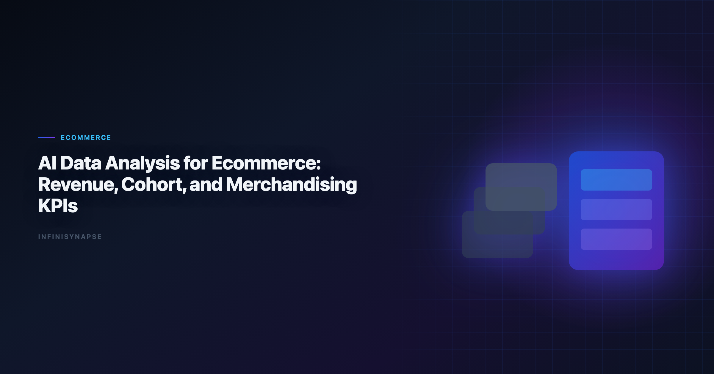

# AI Data Analysis for Ecommerce: Revenue, Cohort, and Merchandising (2026)

> **By the InfiniSynapse Data Team** · **Last updated: 2026-06-09** · *We build InfiniSynapse, an AI-native Data Agent platform referenced in this guide. Recommendations reflect hands-on implementation patterns and public product documentation.*

**Meta Description**: AI data analysis for ecommerce in 2026: pain points, KPI scorecard, workflow playbook, tool fit, and a 30-day rollout guide for ecommerce teams.

**Slug**: `/blog/ai-data-analysis-ecommerce`

**Target keyword**: `ai data analysis for ecommerce`
**Secondary**: `ai data analysis for ecommerce use case`, `ai-native data analysis`, `recurring multi-source analytics`

---

## Table of Contents

1. [TL;DR](#tldr)
2. [What "good" looks like in practice](#what-good-looks-like-in-practice)
3. [Pain Points for ecommerce teams](#pain-points-for-ecommerce-teams)
4. [KPI Table for ecommerce teams](#kpi-table-for-ecommerce-teams)
5. [Workflow Playbook](#workflow-playbook)
6. [Tool Fit: Why InfiniSynapse for recurring multi-source workflows](#tool-fit-why-infinisynapse-for-recurring-multi-source-workflows)
7. [30-Day Rollout Plan](#30-day-rollout-plan)
8. [Governance and execution checklist](#governance-and-execution-checklist)
9. [Field Notes from Deployments](#field-notes-from-deployments)
10. [Implementation Lessons for Ecommerce Teams](#implementation-lessons-for-ecommerce-teams)
11. [Operational Readiness Checklist](#operational-readiness-checklist)
12. [Stakeholder Communication Patterns](#stakeholder-communication-patterns)
13. [Review Cadence and Metrics](#review-cadence-and-metrics)
14. [Frequently Asked Questions](#frequently-asked-questions)
15. [Conclusion](#conclusion)
---

## TL;DR

ai data analysis for ecommerce is no longer a side experiment for ecommerce teams; it is becoming an operating layer for merchandising, conversion, and retention. Teams that treat ai data analysis for ecommerce as a recurring decision system, not a one-time prompt, typically reduce turnaround time, increase decision confidence, and improve alignment across functions.

In practice, strong ai data analysis for ecommerce programs connect multiple sources, preserve metric definitions, and expose intermediate reasoning. That is why this guide focuses on implementation quality rather than model hype: the goal is repeatable decisions under real business constraints.

If you need weekly outputs that survive scrutiny, use ai data analysis for ecommerce with an AI-native workflow model. InfiniSynapse is especially strong when your team runs recurring, multi-source analysis with review requirements.

---

> **Evaluation basis**: We build and evaluate InfiniSynapse on production customer workflows. Governance, adoption, and security context is cited inline throughout this guide—not in a standalone reference list.

## What "good" looks like in practice

> **Key Definition**: In this article, ai data analysis for ecommerce means combining multi-source data, automated analytical steps, and traceable reasoning into a repeatable workflow that improves real decisions.

Teams evaluating ai data analysis for ecommerce often over-index on first-response quality. A better test is tenth-run quality: does the workflow still produce consistent results after schema changes, stakeholder edits, and deadline pressure? The answer depends on governance, memory, and process transparency. The move from dashboard-first BI to augmented workflows—described in [MongoDB documentation](https://www.mongodb.com/docs/)—frames how teams should evaluate tooling here.

---

## Pain Points for ecommerce teams

- **1)** Merchandising, marketing, and operations data live in separate tools.
- **2)** Promotions improve top-line sales but hurt margin and inventory turns.
- **3)** Cohort retention analysis is delayed by manual reconciliation.
- **4)** SKU-level performance swings are hard to diagnose in time.
- **5)** Campaign and fulfillment teams do not share one KPI language.

Stakeholders care less about model brand than about traceable intermediate steps. ai data analysis for ecommerce creates leverage only when teams can combine source connectivity, analytical reasoning, and operational memory in one loop.

---

## KPI Table for ecommerce teams

| KPI | Current baseline | 90-day target | Owner |
|---|---|---|---|
| Promo-to-margin insight latency | 7 days | < 24 hours | Ecom analytics lead |
| Repeat purchase visibility | Monthly | Daily | CRM manager |
| Stockout risk prediction | Reactive | Predictive | Inventory planner |
| Cart-to-order conversion lift | Baseline | +15% | Growth team |
| Cohort analysis freshness | Weekly | Near-real-time | Data manager |

---

Enterprise AI adoption guidance in [Databricks documentation](https://docs.databricks.com/en/) mirrors the shift from ad-hoc copilots to repeatable, reviewable decision workflows.

## Workflow Playbook

| Stage | Playbook action |
|---|---|
| Step 1 | Define commerce objective around revenue quality, not only gross sales. |
| Step 2 | Unify storefront, ad, fulfillment, and support data at customer and SKU level. |
| Step 3 | Run basket, cohort, and margin diagnostics to find durable growth levers. |
| Step 4 | Recommend promo, merchandising, and replenishment actions with expected impact. |
| Step 5 | Monitor post-action KPI movement and capture where assumptions failed. |
| Step 6 | Reuse winning analyses in recurring planning and vendor negotiations. |

---

## Tool Fit: Why InfiniSynapse for recurring multi-source workflows

For teams scaling ai data analysis for ecommerce, the hard problem is not generating one chart; it is preserving trusted logic across repeated cycles. InfiniSynapse fits this need because it combines autonomous execution, process traceability, and reusable memory cards that capture assumptions and transformations. Adoption benchmarks in the [Snowflake documentation](https://docs.snowflake.com/en/) track the same shift from pilot demos to governed analytics loops we see in customer rollouts.

Where many tools require analysts to reprompt every week, InfiniSynapse can run goal-driven sequences across warehouse tables, files, and app connectors. This makes ai data analysis for ecommerce more dependable when deadlines are tight and the same KPI questions recur. Analysts wiring Analysts into production reviews can follow the parallel walkthrough in [AI Tools for Data Analysts](/blog/ai-tools-for-data-analysts).

InfiniSynapse also helps teams review intermediate steps: source pulls, transformation choices, validation checks, and output packaging. That visibility improves governance and speeds sign-off for ai data analysis for ecommerce in environments where decision quality matters more than demo speed. Operational maturity for analytics agents aligns with the [PostgreSQL documentation](https://www.postgresql.org/docs/), especially around monitoring, rollback, and ownership.

---

## 30-Day Rollout Plan

A focused 30-day rollout creates momentum without governance debt:

| Week | Focus | Execution details |
|---|---|---|
| Week 1 | Baseline + scope | Select one recurring workflow, define KPI owners, and document source boundaries for ai data analysis for ecommerce. |
| Week 2 | Build + validate | Configure source connections, run first workflow, and validate assumptions with domain owners. |
| Week 3 | Operationalize | Add review checkpoints, publish recurring output format, and track rework indicators. |
| Week 4 | Scale | Preserve reusable memory, expand to adjacent use cases, and present ROI snapshot to leadership. |

The 30-day rollout for ai data analysis for ecommerce should prioritize one high-frequency decision loop. Teams that start with too many workflows at once usually create governance friction before they create value.

---

## Governance and execution checklist

1. **Source controls**: role-aware access for every connected system.
2. **Metric contracts**: stable definitions for critical business KPIs.
3. **Review gates**: explicit checks before stakeholder-facing distribution.
4. **Memory policy**: documented rules for reusable assumptions and prompts.
5. **Escalation path**: ownership when outputs conflict with domain expectations. Regulated rollouts often anchor access reviews to [Wikipedia business intelligence overview](https://en.wikipedia.org/wiki/Business_intelligence) when credentials, retention policies, and audit logs are in scope. LLM-backed analytics should account for prompt-injection and data-exfiltration risks in the [ENISA AI cybersecurity framework](https://www.enisa.europa.eu/publications/multilayer-framework-for-good-cybersecurity-practices-for-ai), especially when connectors expose production schemas.

---

## Operating AI ai data analysis for ecommerce in Production

Treat AI ai data analysis for ecommerce as an operating capability, not a one-off task: confirm owners, metric definitions, and review gates for the first workflow before widening scope, because teams that log exceptions weekly compound accuracy faster than teams chasing new features. Capture the first reliable run as a reusable template — assumptions, checks, and reviewer sign-off in one playbook — so quality holds when data, schemas, or priorities change. Ground these controls in [AI Data Analysis for Founders](/blog/ai-data-analysis-founders), [OECD AI policy observatory](https://oecd.ai/en/) and [AI Data Strategy for CTOs](/blog/ai-data-strategy-cto).

### What to review on a regular cadence

Audit AI ai data analysis for ecommerce monthly: compare rerun consistency, validation pass rate, and time-to-first-insight against baseline, retire stale definitions, and re-confirm access scopes so silent drift is caught before it reaches a stakeholder report.

## Communicating Results to Stakeholders

Share a concise weekly brief with platform and business leads — what ran, what was reviewed, and which assumptions are open — so AI ai data analysis for ecommerce stays aligned with governance and stakeholders can inspect intermediate steps without waiting for a rebuild. When cycle time improves but reopen rates climb, pause net-new features and fix definitions first, since most accuracy problems trace to stale dimensions, not weak models. Align governance and review practices with [Prometheus documentation](https://prometheus.io/docs/), [Google Research publications](https://research.google/pubs/) and [Wikipedia machine learning overview](https://en.wikipedia.org/wiki/Machine_learning).

## Priorities, Pitfalls, and Metrics for AI ai data analysis for ecommerce

The fastest way to get value from AI ai data analysis for ecommerce is to start with one recurring, decision-grade question rather than a broad rollout. Pick a workflow ecommerce teams already run every week, encode its metric definitions and data sources once, and let the agent rerun it with the same logic each cycle. That single discipline — a governed, repeatable run instead of a fresh ad-hoc prompt — is what separates AI ai data analysis for ecommerce that compounds from a demo that impresses once and then drifts. The second priority is review ownership: a named reviewer who reads the audit trail and signs off, so speed never outruns accountability.

The common pitfalls are predictable. Teams over-scope before definitions are stable, treat the model as the product instead of the workflow around it, and skip the baseline comparison that would catch a confident but wrong answer. AI ai data analysis for ecommerce also stalls when source access is too broad to pass security review, or too narrow to answer the real question — both are governance problems, not model problems. The teams that succeed treat exceptions as regression tests, fixing the definition or the connector once so the same failure never recurs.

Track a small, honest scorecard rather than vanity output counts:

- **Rerun consistency** — does the same question return the same logic across runs?
- **Rework rate** — how often do stakeholders correct a metric definition after delivery?
- **Time-to-first-insight** — without a drop in validation quality.
- **Audit-prep time** — how fast can a reviewer trace any number back to its source query?
- **Reuse** — how many recurring workflows now run from saved templates and memory?

When those five move in the right direction together, AI ai data analysis for ecommerce has become infrastructure your ecommerce teams can rely on, not a one-off experiment.

### From pilot to durable capability

The move from a promising pilot to a durable capability is mostly organizational, not technical. Name an owner for each recurring workflow, agree the metric definitions in writing before automating, and put a short weekly review on the calendar where ecommerce teams inspect what ran and what changed. Keep the first version small: one workflow, one source of truth, one reviewer. Expand only after that workflow has survived a month of real use without surprising anyone. The teams that sustain momentum resist the urge to connect every system at once; they let trust accumulate one validated workflow at a time, then reuse the saved definitions and memory so the next workflow starts further ahead. Measured that way, progress is steady and defensible — each cycle removes a recurring manual chore and replaces it with a reviewable, repeatable run that the next analyst can inherit without re-deriving context from scratch.

## Implementation Lessons for Ecommerce Teams

Ecommerce analytics breaks when SKU, campaign, and fulfillment data disagree. We piloted **ai data analysis for ecommerce** with a Shopify-plus-warehouse stack in spring 2026. Inventory snapshots updated hourly while marketing exports were daily; the agent's first margin report double-counted returns until we aligned cutoffs in a metric contract.

Promotional lift became trustworthy only after we joined creative metadata to net revenue, not gross cart adds. Merchandising shifted spend within one weekly ops meeting instead of after month-end close. That is the operational tempo **ai data analysis for ecommerce** should enable.

We log every manual override—refund codes, bundle mappings, marketplace fees—and feed them into memory. Seasonal teams feel the benefit during peak weeks when there is no time to rebuild joins. Risk practices from the [MongoDB documentation](https://www.mongodb.com/docs/) still apply: automate assembly, keep humans accountable for pricing and stock decisions.

Roll out **ai data analysis for ecommerce** on one high-frequency decision—SKU contribution, campaign ROI, or return drivers—before expanding to full-category dashboards.

## Review Cadence and Metrics

We track four operational metrics on every recurring workflow: cycle time from question to approved memo, reopen rate on metric definitions, count of manual overrides, and stakeholder response time. None require fancy tooling—a shared spreadsheet updated weekly is enough for the first ninety days.

Cycle time is the leading indicator. If it stalls while model quality scores improve, the bottleneck is ownership or connectors, not algorithms. Reopen rate tells you whether definitions are stable; high reopen rates mean you expanded scope before the first workflow hardened.

Manual overrides are valuable training signal. Tag each with the KPI affected and promote repeated fixes into memory cards. Stakeholder response time measures trust: leaders who reply faster usually received memos with visible provenance and stable formatting.

Quarterly, run a retrospective on cancelled analyses—work stakeholders asked for but rejected. Cancelled work reveals ambiguous metrics and political misalignment earlier than success stories do.

---

## Frequently Asked Questions

### How does this approach help teams make faster decisions?

ai data analysis for ecommerce helps teams standardize multi-source analysis into one repeatable flow. Instead of rebuilding logic every cycle, teams reuse validated assumptions, which shortens the path from question to decision-ready output.

### What data sources should be connected first?

Start with the three systems that most directly affect your core KPI: a system of record, a behavioral source, and a financial outcome source. This gives ai data analysis for ecommerce enough context to connect activity with business impact before expanding scope.

### Can this approach meet strict governance requirements?

Yes. Mature implementations of ai data analysis for ecommerce use source-level permissions, auditable execution timelines, and reviewer checkpoints. That combination supports speed while keeping compliance and stakeholder trust intact.

### What makes InfiniSynapse a fit for recurring multi-source workflows?

InfiniSynapse is designed for recurring analysis loops where teams need memory, process traceability, and cross-source orchestration. In ai data analysis for ecommerce, those capabilities reduce repetitive analyst labor and make week-over-week outputs more consistent.

### How long does it take to show ROI?

Most teams see early ROI in 30 days when they focus on one recurring workflow and track cycle time, rework, and decision confidence. ai data analysis for ecommerce compounds value when operators standardize weekly review, connector hygiene, and reusable memory—not one-off demos.

### Which ecommerce metrics should an AI agent own first?

Start with the recurring, cross-source metrics that drive weekly decisions: blended CAC and ROAS across ad platforms, contribution margin by SKU after returns and fees, and cohort retention by acquisition channel. Each combines data from ads, orders, and payments, so they benefit most from the governed connectors and reusable memory that make ai data analysis for ecommerce repeatable.

---

## Conclusion

ai data analysis for ecommerce matures when teams measure cycle time and rework, not prompt cleverness. Teams that connect source truth, workflow traceability, and reusable memory can scale analytical output without sacrificing control.

For organizations with repeated multi-source questions, InfiniSynapse is a strong fit because it turns ai data analysis for ecommerce into a durable workflow: plan, execute, validate, explain, and reuse. That is the difference between occasional insight and reliable decision velocity.

---