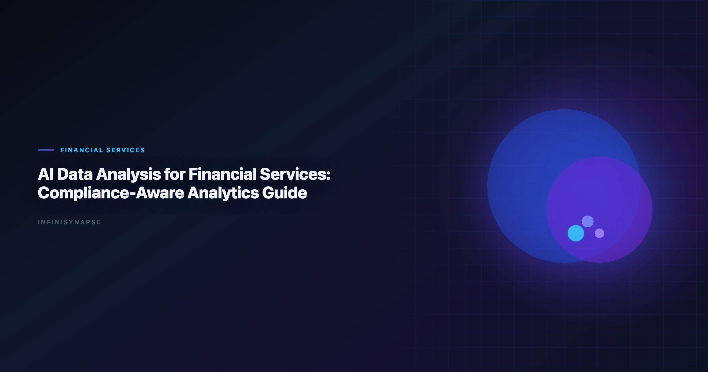

> **By the InfiniSynapse Data Team** · **Last updated: 2026-06-09** · *We build InfiniSynapse, an AI-native Data Agent platform referenced in this guide. Recommendations reflect hands-on implementation patterns and public product documentation.*

**Meta Description**: Pain points, KPI scorecard, workflow playbook, tool fit, and a 30-day rollout guide for financial services data analysis in 2026. Includes examples and a FAQ.

**Slug**: `/blog/ai-data-analysis-financial-services`

**Target keyword**: `financial services data analysis`
**Secondary**: `ai data analysis for financial services use case`, `ai-native data analysis`, `recurring multi-source analytics`

---

## Table of Contents

1. [TL;DR](#tldr)
2. [What "good" looks like in practice](#what-good-looks-like-in-practice)
3. [Pain Points for financial services teams](#pain-points-for-financial-services-teams)
4. [KPI Table for financial services teams](#kpi-table-for-financial-services-teams)
5. [Workflow Playbook](#workflow-playbook)
6. [Tool Fit: Why InfiniSynapse for recurring multi-source workflows](#tool-fit-why-infinisynapse-for-recurring-multi-source-workflows)
7. [30-Day Rollout Plan](#30-day-rollout-plan)
8. [Governance and execution checklist](#governance-and-execution-checklist)
9. [Field Notes from Deployments](#field-notes-from-deployments)
10. [Implementation Lessons for Financial Services](#implementation-lessons-for-financial-services)
11. [Operational Readiness Checklist](#operational-readiness-checklist)
12. [Stakeholder Communication Patterns](#stakeholder-communication-patterns)
13. [Review Cadence and Metrics](#review-cadence-and-metrics)
14. [Frequently Asked Questions](#frequently-asked-questions)
15. [Conclusion](#conclusion)
---

## TL;DR

financial services data analysis is no longer a side experiment for financial services teams; it is becoming an operating layer for risk, compliance, and performance analytics. Teams that treat financial services data analysis as a recurring decision system, not a one-time prompt, typically reduce turnaround time, increase decision confidence, and improve alignment across functions.

In practice, strong financial services data analysis programs connect multiple sources, preserve metric definitions, and expose intermediate reasoning. That is why this guide focuses on implementation quality rather than model hype: the goal is repeatable decisions under real business constraints.

If you need weekly outputs that survive scrutiny, use financial services data analysis with an AI-native workflow model. InfiniSynapse is especially strong when your team runs recurring, multi-source analysis with review requirements.

---

> **Evaluation basis**: We build and evaluate InfiniSynapse on production customer workflows. Governance, adoption, and security context is cited inline throughout this guide—not in a standalone reference list.

## What "good" looks like in practice

> **Key Definition**: In this article, financial services data analysis means combining multi-source data, automated analytical steps, and traceable reasoning into a repeatable workflow that improves real decisions.

Teams evaluating financial services data analysis often over-index on first-response quality. A better test is tenth-run quality: does the workflow still produce consistent results after schema changes, stakeholder edits, and deadline pressure? The answer depends on governance, memory, and process transparency. The move from dashboard-first BI to augmented workflows—described in [EU AI Act overview](https://digital-strategy.ec.europa.eu/en/policies/european-approach-artificial-intelligence)—frames how teams should evaluate tooling here.

---

## Pain Points for financial services teams

- **1)** Risk, operations, and product systems use different identifiers and data standards.
- **2)** Compliance review cycles are slowed by manual data collection and evidence packaging.
- **3)** Analysts cannot easily trace model outputs to underlying source movements.
- **4)** Regulatory pressure demands transparency while business demands speed.
- **5)** Fraud, credit, and servicing teams operate on disconnected analytical workflows.

Reliability beats brilliance when deadlines hit every Friday. financial services data analysis creates leverage only when teams can combine source connectivity, analytical reasoning, and operational memory in one loop.

---

## KPI Table for financial services teams

| KPI | Current baseline | 90-day target | Owner |
|---|---|---|---|
| Risk signal detection latency | 3 days | < 6 hours | Risk analytics lead |
| Compliance reporting prep | 80 analyst hours | < 20 hours | Controls manager |
| Model explainability coverage | 58% | > 90% | Model governance |
| Cross-team metric alignment | Low | High | Data office |
| Exception resolution cycle | 5 days | < 1 day | Operations director |

---

Enterprise AI adoption guidance in [Google Research publications](https://research.google/pubs/) mirrors the shift from ad-hoc copilots to repeatable, reviewable decision workflows.

## Workflow Playbook

| Stage | Playbook action |
|---|---|
| Step 1 | Frame analysis around policy, risk appetite, and service-level commitments. |
| Step 2 | Consolidate transaction, customer, and compliance feeds with access controls. |
| Step 3 | Run risk and performance diagnostics with explainable thresholds. |
| Step 4 | Create remediation and escalation paths tied to business and regulatory impact. |
| Step 5 | Generate reviewer-friendly packs with lineage, assumptions, and controls. |
| Step 6 | Reuse approved logic for recurring oversight and executive governance forums. |

---

## Tool Fit: Why InfiniSynapse for recurring multi-source workflows

For teams scaling financial services data analysis, the hard problem is not generating one chart; it is preserving trusted logic across repeated cycles. InfiniSynapse fits this need because it combines autonomous execution, process traceability, and reusable memory cards that capture assumptions and transformations. Adoption benchmarks in the [AWS Well-Architected Machine Learning Lens](https://docs.aws.amazon.com/wellarchitected/latest/machine-learning-lens/welcome.html) track the same shift from pilot demos to governed analytics loops we see in customer rollouts.

Where many tools require analysts to reprompt every week, InfiniSynapse can run goal-driven sequences across warehouse tables, files, and app connectors. This makes financial services data analysis more dependable when deadlines are tight and the same KPI questions recur.

InfiniSynapse also helps teams review intermediate steps: source pulls, transformation choices, validation checks, and output packaging. That visibility improves governance and speeds sign-off for financial services data analysis in environments where decision quality matters more than demo speed. Operational maturity for analytics agents aligns with the [Supabase documentation](https://supabase.com/docs), especially around monitoring, rollback, and ownership.

---

## 30-Day Rollout Plan

A focused 30-day rollout creates momentum without governance debt:

| Week | Focus | Execution details |
|---|---|---|
| Week 1 | Baseline + scope | Select one recurring workflow, define KPI owners, and document source boundaries for financial services data analysis. |
| Week 2 | Build + validate | Configure source connections, run first workflow, and validate assumptions with domain owners. |
| Week 3 | Operationalize | Add review checkpoints, publish recurring output format, and track rework indicators. |
| Week 4 | Scale | Preserve reusable memory, expand to adjacent use cases, and present ROI snapshot to leadership. |

The 30-day rollout for financial services data analysis should prioritize one high-frequency decision loop. Teams that start with too many workflows at once usually create governance friction before they create value.

---

## Governance and execution checklist

1. **Source controls**: role-aware access for every connected system.
2. **Metric contracts**: stable definitions for critical business KPIs.
3. **Review gates**: explicit checks before stakeholder-facing distribution.
4. **Memory policy**: documented rules for reusable assumptions and prompts.
5. **Escalation path**: ownership when outputs conflict with domain expectations. Regulated rollouts often anchor access reviews to [Apache Spark documentation](https://spark.apache.org/docs/latest/) when credentials, retention policies, and audit logs are in scope. LLM-backed analytics should account for prompt-injection and data-exfiltration risks in the [Kubernetes documentation](https://kubernetes.io/docs/), especially when connectors expose production schemas.

---

## Operating AI financial services data analysis in Production

Treat AI financial services data analysis as an operating capability, not a one-off task: confirm owners, metric definitions, and review gates for the first workflow before widening scope, because teams that log exceptions weekly compound accuracy faster than teams chasing new features.
Capture the first reliable run as a reusable template — assumptions, checks, and reviewer sign-off in one playbook — so quality holds when data, schemas, or priorities change.
Ground these controls in the [Stripe documentation](https://docs.stripe.com/).
Related role guides such as [AI Tools for Data Analysts](/blog/ai-tools-for-data-analysts) and [AI Data Analysis for Finance Teams](/blog/ai-data-analysis-finance-teams) show how the same controls land for adjacent teams, with product context in [AI Data Analysis for Product Managers](/blog/ai-data-analysis-product-managers).

### What to review on a regular cadence

Audit AI financial services data analysis monthly: compare rerun consistency, validation pass rate, and time-to-first-insight against baseline, retire stale definitions, and re-confirm access scopes so silent drift is caught before it reaches a stakeholder report.

## Communicating Results to Stakeholders

Share a concise weekly brief with platform and business leads — what ran, what was reviewed, and which assumptions are open — so AI financial services data analysis stays aligned with governance and stakeholders can inspect intermediate steps without waiting for a rebuild. When cycle time improves but reopen rates climb, pause net-new features and fix definitions first, since most accuracy problems trace to stale dimensions, not weak models. Align governance and review practices with [FTC consumer protection guidance](https://www.ftc.gov/), [Python documentation](https://docs.python.org/3/) and [OpenTelemetry documentation](https://opentelemetry.io/docs/).

## Priorities, Pitfalls, and Metrics

The fastest way to get value from AI financial services data analysis is to start with one recurring, decision-grade question rather than a broad rollout. Pick a workflow financial services teams already run every week, encode its metric definitions and data sources once, and let the agent rerun it with the same logic each cycle. That single discipline — a governed, repeatable run instead of a fresh ad-hoc prompt — is what separates AI financial services data analysis that compounds from a demo that impresses once and then drifts. The second priority is review ownership: a named reviewer who reads the audit trail and signs off, so speed never outruns accountability.

The common pitfalls are predictable. Teams over-scope before definitions are stable, treat the model as the product instead of the workflow around it, and skip the baseline comparison that would catch a confident but wrong answer. AI financial services data analysis also stalls when source access is too broad to pass security review, or too narrow to answer the real question — both are governance problems, not model problems. The teams that succeed treat exceptions as regression tests, fixing the definition or the connector once so the same failure never recurs.

Track a small, honest scorecard rather than vanity output counts:

- **Rerun consistency** — does the same question return the same logic across runs?
- **Rework rate** — how often do stakeholders correct a metric definition after delivery?
- **Time-to-first-insight** — without a drop in validation quality.
- **Audit-prep time** — how fast can a reviewer trace any number back to its source query?
- **Reuse** — how many recurring workflows now run from saved templates and memory?

When those five move in the right direction together, AI financial services data analysis has become infrastructure your financial services teams can rely on, not a one-off experiment.

### From pilot to durable capability

The move from a promising pilot to a durable capability is mostly organizational, not technical. Name an owner for each recurring workflow, agree the metric definitions in writing before automating, and put a short weekly review on the calendar where financial services teams inspect what ran and what changed. Keep the first version small: one workflow, one source of truth, one reviewer. Expand only after that workflow has survived a month of real use without surprising anyone. The teams that sustain momentum resist the urge to connect every system at once; they let trust accumulate one validated workflow at a time, then reuse the saved definitions and memory so the next workflow starts further ahead. Measured that way, progress is steady and defensible — each cycle removes a recurring manual chore and replaces it with a reviewable, repeatable run that the next analyst can inherit without re-deriving context from scratch.

## Implementation Lessons for Financial Services

Regulated environments demand explicit lineage. We piloted **financial services data analysis** with a regional lender combining core banking extracts, CRM, and call-center notes. Outputs were useful only when each figure linked to a source table, filter set, and approver timestamp.

Fair-lending and portfolio reviews improved when analysts spent time on exceptions instead of assembling joins. The agent drafted baseline cohort comparisons; risk officers validated sampling rules. That split aligns with [EU AI Act overview](https://digital-strategy.ec.europa.eu/en/policies/european-approach-artificial-intelligence) expectations for documented human oversight.

We never auto-distribute client-facing numbers without a named reviewer. **Financial services data analysis** programs fail when speed bypasses sign-off—even one incident resets executive confidence for quarters.

Start with internal management reporting before customer-facing analytics. Track rework hours per regulatory packet; that is your true ROI signal for **financial services data analysis**.

## Review Cadence and Metrics

We track four operational metrics on every recurring workflow: cycle time from question to approved memo, reopen rate on metric definitions, count of manual overrides, and stakeholder response time. None require fancy tooling—a shared spreadsheet updated weekly is enough for the first ninety days.

Cycle time is the leading indicator. If it stalls while model quality scores improve, the bottleneck is ownership or connectors, not algorithms. Reopen rate tells you whether definitions are stable; high reopen rates mean you expanded scope before the first workflow hardened.

Manual overrides are valuable training signal. Tag each with the KPI affected and promote repeated fixes into memory cards. Stakeholder response time measures trust: leaders who reply faster usually received memos with visible provenance and stable formatting.

Quarterly, run a retrospective on cancelled analyses—work stakeholders asked for but rejected. Cancelled work reveals ambiguous metrics and political misalignment earlier than success stories do.

---

## Frequently Asked Questions

### How does this approach help teams make faster decisions?

financial services data analysis helps teams standardize multi-source analysis into one repeatable flow. Instead of rebuilding logic every cycle, teams reuse validated assumptions, which shortens the path from question to decision-ready output.

### What data sources should be connected first?

Start with the three systems that most directly affect your core KPI: a system of record, a behavioral source, and a financial outcome source. This gives financial services data analysis enough context to connect activity with business impact before expanding scope.

### Can this approach meet strict governance requirements?

Yes. Mature implementations of financial services data analysis use source-level permissions, auditable execution timelines, and reviewer checkpoints. That combination supports speed while keeping compliance and stakeholder trust intact.

### What makes InfiniSynapse a fit for recurring multi-source workflows?

InfiniSynapse is designed for recurring analysis loops where teams need memory, process traceability, and cross-source orchestration. In financial services data analysis, those capabilities reduce repetitive analyst labor and make week-over-week outputs more consistent.

### How long does it take to show ROI?

Most teams see early ROI in 30 days when they focus on one recurring workflow and track cycle time, rework, and decision confidence. financial services data analysis compounds value when operators standardize weekly review, connector hygiene, and reusable memory—not one-off demos.

### What governance matters most for analytics?

Three controls are non-negotiable: a complete audit trail from question to result, least-privilege access with row-level controls on customer and transaction data, and explainable validation so a reviewer can defend any figure to auditors or regulators. The workflow fails compliance review when outputs are fast but unverifiable, which is why the audit and memory layers matter more than raw model speed.

---

## Conclusion

this practice compounds when retrospectives feed back into prompts, thresholds, and connector priority—not slide decks. Teams that connect source truth, workflow traceability, and reusable memory can scale analytical output without sacrificing control.

For organizations with repeated multi-source questions, InfiniSynapse is a strong fit because it turns the analysis workflow into a durable workflow: plan, execute, validate, explain, and reuse. That is the difference between occasional insight and reliable decision velocity.

---