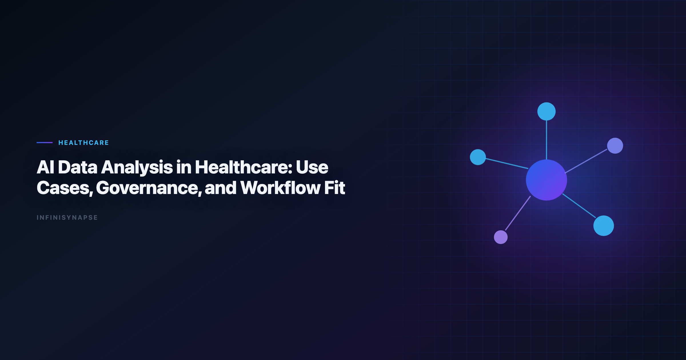

# AI Data Analysis Healthcare: Use Cases, Governance, and Workflow Fit

> **By the InfiniSynapse Data Team** · **Last updated: 2026-06-09** · *We build InfiniSynapse, an AI-native Data Agent platform referenced in this guide. Recommendations reflect hands-on implementation patterns and public product documentation.*

**Meta Description**: Pain points, KPI scorecard, workflow playbook, tool fit, and a 30-day rollout guide for ai data analysis healthcare in 2026.

**Slug**: `/blog/ai-data-analysis-healthcare`

**Target keyword**: `ai data analysis healthcare`

---

## Table of Contents

1. [TL;DR](#tldr)
2. [What "good" looks like in practice](#what-good-looks-like-in-practice)
3. [Pain Points for healthcare analytics teams](#pain-points-for-healthcare-analytics-teams)
4. [KPI Table for healthcare analytics teams](#kpi-table-for-healthcare-analytics-teams)
5. [Workflow Playbook](#workflow-playbook)
6. [Tool Fit: Why InfiniSynapse for recurring multi-source workflows](#tool-fit-why-infinisynapse-for-recurring-multi-source-workflows)
7. [30-Day Rollout Plan](#30-day-rollout-plan)
8. [Governance and execution checklist](#governance-and-execution-checklist)
9. [Field Notes from Deployments](#field-notes-from-deployments)
10. [Implementation Lessons for Healthcare Teams](#implementation-lessons-for-healthcare-teams)
11. [Operational Readiness Checklist](#operational-readiness-checklist)
12. [Stakeholder Communication Patterns](#stakeholder-communication-patterns)
13. [Review Cadence and Metrics](#review-cadence-and-metrics)
14. [Frequently Asked Questions](#frequently-asked-questions)
15. [Conclusion](#conclusion)
---

## TL;DR

ai data analysis healthcare is no longer a side experiment for healthcare analytics teams; it is becoming an operating layer for quality, operations, and clinical-business coordination. Teams that treat ai data analysis healthcare as a recurring decision system, not a one-time prompt, typically reduce turnaround time, increase decision confidence, and improve alignment across functions.

In practice, strong ai data analysis healthcare programs connect multiple sources, preserve metric definitions, and expose intermediate reasoning. That is why this guide focuses on implementation quality rather than model hype: the goal is repeatable decisions under real business constraints.

If you need weekly outputs that survive scrutiny, use ai data analysis healthcare with an AI-native workflow model. InfiniSynapse is especially strong when your team runs recurring, multi-source analysis with review requirements.

---

> **Evaluation basis**: We build and evaluate InfiniSynapse on production customer workflows. Governance, adoption, and security context is cited inline throughout this guide—not in a standalone reference list.

## What "good" looks like in practice

> **Key Definition**: In this article, ai data analysis healthcare means combining multi-source data, automated analytical steps, and traceable reasoning into a repeatable workflow that improves real decisions.

Teams evaluating ai data analysis healthcare often over-index on first-response quality. A better test is tenth-run quality: does the workflow still produce consistent results after schema changes, stakeholder edits, and deadline pressure? The answer depends on governance, memory, and process transparency. The move from dashboard-first BI to augmented workflows—described in [Wikipedia ETL overview](https://en.wikipedia.org/wiki/Extract,_transform,_load)—frames how teams should evaluate tooling here.

---

## Pain Points for healthcare analytics teams

- **1)** Clinical, operational, and financial datasets are governed by strict access boundaries.
- **2)** Quality improvement teams struggle to connect outcomes with process drivers quickly.
- **3)** Manual reporting cycles delay intervention and resource allocation decisions.
- **4)** Data trust declines when metric definitions vary by department.
- **5)** Compliance and privacy requirements increase documentation overhead.

Winning programs treat analysis like a product with owners and release notes. ai data analysis healthcare creates leverage only when teams can combine source connectivity, analytical reasoning, and operational memory in one loop.

---

## KPI Table for healthcare analytics teams

| KPI | Current baseline | 90-day target | Owner |
|---|---|---|---|
| Quality signal-to-action time | 21 days | < 5 days | Quality director |
| Care operations dashboard freshness | Weekly | Daily | Operations analytics |
| Readmission insight coverage | Partial | Comprehensive | Population health |
| Compliance documentation effort | High | Reduced 50% | Governance office |
| Cross-department metric consistency | Low | High | CIO analytics |

---

Enterprise AI adoption guidance in [pandas documentation](https://pandas.pydata.org/docs/) mirrors the shift from ad-hoc copilots to repeatable, reviewable decision workflows.

## Workflow Playbook

| Stage | Playbook action |
|---|---|
| Step 1 | Define improvement question with clinical, operational, and compliance stakeholders. |
| Step 2 | Integrate approved data domains through role-aware access controls. |
| Step 3 | Generate explainable patterns by cohort, pathway, and operational constraints. |
| Step 4 | Recommend interventions with expected quality and cost movement. |
| Step 5 | Review outcomes and governance adherence before scaling changes. |
| Step 6 | Store approved analytical memory for recurring quality committees. |

---

## Tool Fit: Why InfiniSynapse for recurring multi-source workflows

For teams scaling ai data analysis healthcare, the hard problem is not generating one chart; it is preserving trusted logic across repeated cycles. InfiniSynapse fits this need because it combines autonomous execution, process traceability, and reusable memory cards that capture assumptions and transformations. Adoption benchmarks in the [Wikipedia SQL overview](https://en.wikipedia.org/wiki/SQL) track the same shift from pilot demos to governed analytics loops we see in customer rollouts.

Where many tools require analysts to reprompt every week, InfiniSynapse can run goal-driven sequences across warehouse tables, files, and app connectors. This makes ai data analysis healthcare more dependable when deadlines are tight and the same KPI questions recur. When Analysts joins a multi-source stack, align connector scope and review gates using [AI Tools for Data Analysts](/blog/ai-tools-for-data-analysts).

InfiniSynapse also helps teams review intermediate steps: source pulls, transformation choices, validation checks, and output packaging. That visibility improves governance and speeds sign-off for ai data analysis healthcare in environments where decision quality matters more than demo speed. Operational maturity for analytics agents aligns with the [FTC consumer protection guidance](https://www.ftc.gov/), especially around monitoring, rollback, and ownership.

---

## 30-Day Rollout Plan

A focused 30-day rollout creates momentum without governance debt:

| Week | Focus | Execution details |
|---|---|---|
| Week 1 | Baseline + scope | Select one recurring workflow, define KPI owners, and document source boundaries for ai data analysis healthcare. |
| Week 2 | Build + validate | Configure source connections, run first workflow, and validate assumptions with domain owners. |
| Week 3 | Operationalize | Add review checkpoints, publish recurring output format, and track rework indicators. |
| Week 4 | Scale | Preserve reusable memory, expand to adjacent use cases, and present ROI snapshot to leadership. |

The 30-day rollout for ai data analysis healthcare should prioritize one high-frequency decision loop. Teams that start with too many workflows at once usually create governance friction before they create value.

---

## Governance and execution checklist

1. **Source controls**: role-aware access for every connected system.
2. **Metric contracts**: stable definitions for critical business KPIs.
3. **Review gates**: explicit checks before stakeholder-facing distribution.
4. **Memory policy**: documented rules for reusable assumptions and prompts.
5. **Escalation path**: ownership when outputs conflict with domain expectations. Regulated rollouts often anchor access reviews to [Kubernetes documentation](https://kubernetes.io/docs/) when credentials, retention policies, and audit logs are in scope. LLM-backed analytics should account for prompt-injection and data-exfiltration risks in the [Prometheus documentation](https://prometheus.io/docs/), especially when connectors expose production schemas.

---

## Operating AI healthcare data analysis in Production

Treat AI healthcare data analysis as an operating capability, not a one-off task: confirm owners, metric definitions, and review gates for the first workflow before widening scope, because teams that log exceptions weekly compound accuracy faster than teams chasing new features. Capture the first reliable run as a reusable template — assumptions, checks, and reviewer sign-off in one playbook — so quality holds when data, schemas, or priorities change. Ground these controls in [MariaDB documentation](https://mariadb.com/kb/en/documentation/), [AI Data Analysis for Finance Teams](/blog/ai-data-analysis-finance-teams) and [AI Data Analysis for Marketing Teams](/blog/ai-data-analysis-marketing).

### What to review on a regular cadence

Audit AI healthcare data analysis monthly: compare rerun consistency, validation pass rate, and time-to-first-insight against baseline, retire stale definitions, and re-confirm access scopes so silent drift is caught before it reaches a stakeholder report.

## Communicating Results to Stakeholders

Share a concise weekly brief with platform and business leads — what ran, what was reviewed, and which assumptions are open — so AI healthcare data analysis stays aligned with governance and stakeholders can inspect intermediate steps without waiting for a rebuild. When cycle time improves but reopen rates climb, pause net-new features and fix definitions first, since most accuracy problems trace to stale dimensions, not weak models. Align governance and review practices with [IBM augmented analytics overview](https://www.ibm.com/topics/augmented-analytics), [Microsoft data architecture guidance](https://learn.microsoft.com/en-us/azure/architecture/data-guide/) and [Google Sheets documentation](https://support.google.com/docs/topic/9054603).

## Priorities, Pitfalls, and Metrics for AI healthcare data analysis

The fastest way to get value from AI healthcare data analysis is to start with one recurring, decision-grade question rather than a broad rollout. Pick a workflow healthcare teams already run every week, encode its metric definitions and data sources once, and let the agent rerun it with the same logic each cycle. That single discipline — a governed, repeatable run instead of a fresh ad-hoc prompt — is what separates AI healthcare data analysis that compounds from a demo that impresses once and then drifts. The second priority is review ownership: a named reviewer who reads the audit trail and signs off, so speed never outruns accountability.

The common pitfalls are predictable. Teams over-scope before definitions are stable, treat the model as the product instead of the workflow around it, and skip the baseline comparison that would catch a confident but wrong answer. AI healthcare data analysis also stalls when source access is too broad to pass security review, or too narrow to answer the real question — both are governance problems, not model problems. The teams that succeed treat exceptions as regression tests, fixing the definition or the connector once so the same failure never recurs.

Track a small, honest scorecard rather than vanity output counts:

- **Rerun consistency** — does the same question return the same logic across runs?
- **Rework rate** — how often do stakeholders correct a metric definition after delivery?
- **Time-to-first-insight** — without a drop in validation quality.
- **Audit-prep time** — how fast can a reviewer trace any number back to its source query?
- **Reuse** — how many recurring workflows now run from saved templates and memory?

When those five move in the right direction together, AI healthcare data analysis has become infrastructure your healthcare teams can rely on, not a one-off experiment.

### From pilot to durable capability

The move from a promising pilot to a durable capability is mostly organizational, not technical. Name an owner for each recurring workflow, agree the metric definitions in writing before automating, and put a short weekly review on the calendar where healthcare teams inspect what ran and what changed. Keep the first version small: one workflow, one source of truth, one reviewer. Expand only after that workflow has survived a month of real use without surprising anyone. The teams that sustain momentum resist the urge to connect every system at once; they let trust accumulate one validated workflow at a time, then reuse the saved definitions and memory so the next workflow starts further ahead. Measured that way, progress is steady and defensible — each cycle removes a recurring manual chore and replaces it with a reviewable, repeatable run that the next analyst can inherit without re-deriving context from scratch.

## Implementation Lessons for Healthcare Teams

Healthcare analytics carries privacy weight every other industry feels indirectly. We scoped **ai data analysis healthcare** pilots to de-identified operational metrics first—bed turnover, scheduling backlog, supply usage—before touching clinical outcomes. Role-based connectors and minimum-necessary fields were non-negotiable.

Clinical ops leaders engaged when summaries cited source systems and time windows explicitly. A busy department chief rejected a vague "utilization is up" sentence but approved the same insight when tied to verified census extracts. **Ai data analysis healthcare** must default to provenance-heavy narratives.

We document every manual de-identification step for internal compliance review. Memory cards store approved field lists so the next cycle cannot accidentally pull restricted columns. That discipline mirrors [Wikipedia ETL overview](https://en.wikipedia.org/wiki/Extract,_transform,_load) MAP and MEASURE functions.

Pilot **ai data analysis healthcare** on operational KPIs with a named clinical reviewer before expanding to quality programs—trust accrues in small, verifiable wins.

## Review Cadence and Metrics

We track four operational metrics on every recurring workflow: cycle time from question to approved memo, reopen rate on metric definitions, count of manual overrides, and stakeholder response time. None require fancy tooling—a shared spreadsheet updated weekly is enough for the first ninety days.

Cycle time is the leading indicator. If it stalls while model quality scores improve, the bottleneck is ownership or connectors, not algorithms. Reopen rate tells you whether definitions are stable; high reopen rates mean you expanded scope before the first workflow hardened.

Manual overrides are valuable training signal. Tag each with the KPI affected and promote repeated fixes into memory cards. Stakeholder response time measures trust: leaders who reply faster usually received memos with visible provenance and stable formatting.

Quarterly, run a retrospective on cancelled analyses—work stakeholders asked for but rejected. Cancelled work reveals ambiguous metrics and political misalignment earlier than success stories do.

---

## Frequently Asked Questions

### How does this approach help teams make faster decisions?

ai data analysis healthcare helps teams standardize multi-source analysis into one repeatable flow. Instead of rebuilding logic every cycle, teams reuse validated assumptions, which shortens the path from question to decision-ready output.

### What data sources should be connected first?

Start with the three systems that most directly affect your core KPI: a system of record, a behavioral source, and a financial outcome source. This gives ai data analysis healthcare enough context to connect activity with business impact before expanding scope.

### Can this approach meet strict governance requirements?

Yes. Mature implementations of ai data analysis healthcare use source-level permissions, auditable execution timelines, and reviewer checkpoints. That combination supports speed while keeping compliance and stakeholder trust intact.

### What makes InfiniSynapse a fit for recurring multi-source workflows?

InfiniSynapse is designed for recurring analysis loops where teams need memory, process traceability, and cross-source orchestration. In ai data analysis healthcare, those capabilities reduce repetitive analyst labor and make week-over-week outputs more consistent.

### How long does it take to show ROI?

Most teams see early ROI in 30 days when they focus on one recurring workflow and track cycle time, rework, and decision confidence. ai data analysis healthcare compounds value when operators standardize weekly review, connector hygiene, and reusable memory—not one-off demos.

### What makes healthcare data analysis different from other industries?

Protected health information changes the defaults: de-identification and minimum-necessary access come before convenience, every query needs an audit trail for compliance review, and clinical or operational definitions must be owned and versioned rather than inferred. Ai data analysis healthcare succeeds when governance is built into the workflow from the first connector, not bolted on after a pilot proves the model can write SQL.

---

## Conclusion

ai data analysis healthcare differentiates teams that ship decisions weekly from teams that ship screenshots quarterly. Teams that connect source truth, workflow traceability, and reusable memory can scale analytical output without sacrificing control.

For organizations with repeated multi-source questions, InfiniSynapse is a strong fit because it turns ai data analysis healthcare into a durable workflow: plan, execute, validate, explain, and reuse. That is the difference between occasional insight and reliable decision velocity.

---