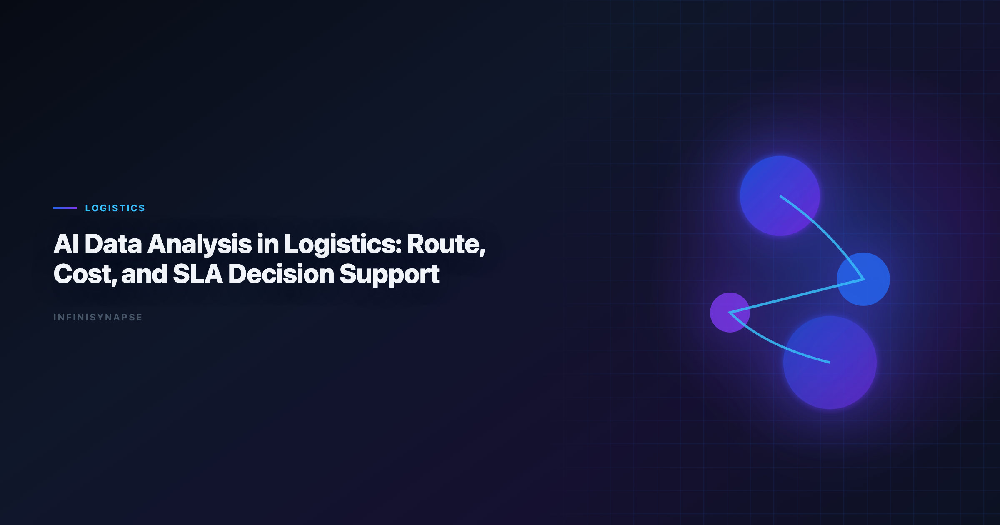

# AI Data Analysis in Logistics: Route, Cost, and SLA Decision Support

> **By the InfiniSynapse Data Team** · **Last updated: 2026-06-09** · *We build InfiniSynapse, an AI-native Data Agent platform referenced in this guide. Recommendations reflect hands-on implementation patterns and public product documentation.*

**Meta Description**: Pain points, KPI scorecard, workflow playbook, tool fit, and a 30-day rollout guide for data analysis in logistics in 2026.

**Slug**: `/blog/ai-data-analysis-logistics`

**Target keyword**: `data analysis in logistics`
**Secondary**: `ai data analysis logistics use case`, `ai-native data analysis`, `recurring multi-source analytics`

---

## Table of Contents

1. [TL;DR](#tldr)
2. [What "good" looks like in practice](#what-good-looks-like-in-practice)
3. [Pain Points for logistics teams](#pain-points-for-logistics-teams)
4. [KPI Table for logistics teams](#kpi-table-for-logistics-teams)
5. [Workflow Playbook](#workflow-playbook)
6. [Tool Fit: Why InfiniSynapse for recurring multi-source workflows](#tool-fit-why-infinisynapse-for-recurring-multi-source-workflows)
7. [30-Day Rollout Plan](#30-day-rollout-plan)
8. [Governance and execution checklist](#governance-and-execution-checklist)
9. [Field Notes from Deployments](#field-notes-from-deployments)
10. [Implementation Lessons for Logistics Teams](#implementation-lessons-for-logistics-teams)
11. [Operational Readiness Checklist](#operational-readiness-checklist)
12. [Stakeholder Communication Patterns](#stakeholder-communication-patterns)
13. [Review Cadence and Metrics](#review-cadence-and-metrics)
14. [Frequently Asked Questions](#frequently-asked-questions)
15. [Conclusion](#conclusion)
---

## TL;DR

data analysis in logistics is no longer a side experiment for logistics teams; it is becoming an operating layer for routing, cost control, and SLA performance. Teams that treat data analysis in logistics as a recurring decision system, not a one-time prompt, typically reduce turnaround time, increase decision confidence, and improve alignment across functions.

In practice, strong data analysis in logistics programs connect multiple sources, preserve metric definitions, and expose intermediate reasoning. That is why this guide focuses on implementation quality rather than model hype: the goal is repeatable decisions under real business constraints.

If you need weekly outputs that survive scrutiny, use data analysis in logistics with an AI-native workflow model. InfiniSynapse is especially strong when your team runs recurring, multi-source analysis with review requirements.

---

> **Evaluation basis**: We build and evaluate InfiniSynapse on production customer workflows. Governance, adoption, and security context is cited inline throughout this guide—not in a standalone reference list.

## What "good" looks like in practice

> **Key Definition**: In this article, data analysis in logistics means combining multi-source data, automated analytical steps, and traceable reasoning into a repeatable workflow that improves real decisions.

Teams evaluating data analysis in logistics often over-index on first-response quality. A better test is tenth-run quality: does the workflow still produce consistent results after schema changes, stakeholder edits, and deadline pressure? The answer depends on governance, memory, and process transparency.

---

## Pain Points for logistics teams

- **1)** Shipment, fleet, and warehouse data are split across disconnected systems.
- **2)** Teams react to late deliveries after customer impact is already visible.
- **3)** Cost optimization and SLA reliability are treated as separate initiatives.
- **4)** Exception management depends on manual detective work.
- **5)** Regional planning teams duplicate analysis without shared learning loops.

Integration discipline separates pilots from production. data analysis in logistics creates leverage only when teams can combine source connectivity, analytical reasoning, and operational memory in one loop.

---

## KPI Table for logistics teams

| KPI | Current baseline | 90-day target | Owner |
|---|---|---|---|
| On-time delivery prediction window | Same-day | >= 48 hours | Network planning |
| Route cost per shipment visibility | Weekly | Daily | Transport manager |
| SLA breach prevention | 64% | > 90% | Operations control tower |
| Exception triage cycle | 6 hours | < 60 minutes | Dispatch lead |
| Cross-region playbook reuse | Low | High | Logistics PMO |

---

Enterprise AI adoption guidance in [Google Sheets documentation](https://support.google.com/docs/topic/9054603) mirrors the shift from ad-hoc copilots to repeatable, reviewable decision workflows.

## Workflow Playbook

data analysis in logistics playbook is designed for recurring multi-source execution, not one-off analysis: The credential, preflight, and SQL-trace pattern above also applies to Healthcare—see [AI Data Analysis in Healthcare](/blog/ai-data-analysis-healthcare) for source-specific steps.

| Stage | Playbook action |
|---|---|
| Step 1 | Set objective by lane reliability, cost corridor, and customer promise. |
| Step 2 | Unify order, fleet, warehouse, and partner-carrier data streams. |
| Step 3 | Detect route risk early and simulate alternate allocation options. |
| Step 4 | Recommend dispatch and planning actions with expected SLA and cost impact. |
| Step 5 | Capture intervention results to improve next-day planning quality. |
| Step 6 | Automate recurring control-tower reporting with transparent assumptions. |

---

## Tool Fit: Why InfiniSynapse for recurring multi-source workflows

For teams scaling data analysis in logistics, the hard problem is not generating one chart; it is preserving trusted logic across repeated cycles. InfiniSynapse fits this need because it combines autonomous execution, process traceability, and reusable memory cards that capture assumptions and transformations. Adoption benchmarks in the [NIST AI Risk Management Framework](https://www.nist.gov/itl/ai-risk-management-framework) track the same shift from pilot demos to governed analytics loops we see in customer rollouts.

Where many tools require analysts to reprompt every week, InfiniSynapse can run goal-driven sequences across warehouse tables, files, and app connectors. This makes data analysis in logistics more dependable when deadlines are tight and the same KPI questions recur. If Analysts is in scope for your team, reuse the same memory-and-trace checklist in [AI Tools for Data Analysts](/blog/ai-tools-for-data-analysts).

InfiniSynapse also helps teams review intermediate steps: source pulls, transformation choices, validation checks, and output packaging. That visibility improves governance and speeds sign-off for data analysis in logistics in environments where decision quality matters more than demo speed. Operational maturity for analytics agents aligns with the [Databricks Genie architecture post](https://www.databricks.com/blog/pushing-frontier-data-agents-genie), especially around monitoring, rollback, and ownership.

---

## 30-Day Rollout Plan

A focused 30-day rollout creates momentum without governance debt:

| Week | Focus | Execution details |
|---|---|---|
| Week 1 | Baseline + scope | Select one recurring workflow, define KPI owners, and document source boundaries for data analysis in logistics. |
| Week 2 | Build + validate | Configure source connections, run first workflow, and validate assumptions with domain owners. |
| Week 3 | Operationalize | Add review checkpoints, publish recurring output format, and track rework indicators. |
| Week 4 | Scale | Preserve reusable memory, expand to adjacent use cases, and present ROI snapshot to leadership. |

The 30-day rollout for data analysis in logistics should prioritize one high-frequency decision loop. Teams that start with too many workflows at once usually create governance friction before they create value.

---

## Governance and execution checklist

1. **Source controls**: role-aware access for every connected system.
2. **Metric contracts**: stable definitions for critical business KPIs.
3. **Review gates**: explicit checks before stakeholder-facing distribution.
4. **Memory policy**: documented rules for reusable assumptions and prompts.
5. **Escalation path**: ownership when outputs conflict with domain expectations. Production rollouts should align access and review controls with the [BIRD NL2SQL benchmark](https://bird-bench.github.io/), especially when recurring queries touch live schemas. Regulated rollouts often anchor access reviews to [Google Cloud AI overview](https://cloud.google.com/discover/what-is-artificial-intelligence) when credentials, retention policies, and audit logs are in scope. LLM-backed analytics should account for prompt-injection and data-exfiltration risks in the [Snowflake documentation](https://docs.snowflake.com/en/), especially when connectors expose production schemas.

---

## Operating AI logistics data analysis in Production

Treat AI logistics data analysis as an operating capability, not a one-off task: confirm owners, metric definitions, and review gates for the first workflow before widening scope, because teams that log exceptions weekly compound accuracy faster than teams chasing new features. Capture the first reliable run as a reusable template — assumptions, checks, and reviewer sign-off in one playbook — so quality holds when data, schemas, or priorities change. Ground these controls in [Amazon Redshift documentation](https://docs.aws.amazon.com/redshift/), [AI Data Analysis for Supply Chain](/blog/ai-data-analysis-supply-chain) and [NIST Computer Security Resource Center](https://csrc.nist.gov/).

### What to review on a regular cadence

Audit AI logistics data analysis monthly: compare rerun consistency, validation pass rate, and time-to-first-insight against baseline, retire stale definitions, and re-confirm access scopes so silent drift is caught before it reaches a stakeholder report.

## Communicating Results to Stakeholders

Share a concise weekly brief with platform and business leads — what ran, what was reviewed, and which assumptions are open — so AI logistics data analysis stays aligned with governance and stakeholders can inspect intermediate steps without waiting for a rebuild. When cycle time improves but reopen rates climb, pause net-new features and fix definitions first, since most accuracy problems trace to stale dimensions, not weak models. Align governance and review practices with [RFC 4180 CSV format](https://www.rfc-editor.org/rfc/rfc4180) and [Apache Spark documentation](https://spark.apache.org/docs/latest/).

## Priorities, Pitfalls, and Metrics for AI logistics data analysis

The fastest way to get value from AI logistics data analysis is to start with one recurring, decision-grade question rather than a broad rollout. Pick a workflow logistics teams already run every week, encode its metric definitions and data sources once, and let the agent rerun it with the same logic each cycle. That single discipline — a governed, repeatable run instead of a fresh ad-hoc prompt — is what separates AI logistics data analysis that compounds from a demo that impresses once and then drifts. The second priority is review ownership: a named reviewer who reads the audit trail and signs off, so speed never outruns accountability.

The common pitfalls are predictable. Teams over-scope before definitions are stable, treat the model as the product instead of the workflow around it, and skip the baseline comparison that would catch a confident but wrong answer. AI logistics data analysis also stalls when source access is too broad to pass security review, or too narrow to answer the real question — both are governance problems, not model problems. The teams that succeed treat exceptions as regression tests, fixing the definition or the connector once so the same failure never recurs.

Track a small, honest scorecard rather than vanity output counts:

- **Rerun consistency** — does the same question return the same logic across runs?
- **Rework rate** — how often do stakeholders correct a metric definition after delivery?
- **Time-to-first-insight** — without a drop in validation quality.
- **Audit-prep time** — how fast can a reviewer trace any number back to its source query?
- **Reuse** — how many recurring workflows now run from saved templates and memory?

When those five move in the right direction together, AI logistics data analysis has become infrastructure your logistics teams can rely on, not a one-off experiment.

### From pilot to durable capability

The move from a promising pilot to a durable capability is mostly organizational, not technical. Name an owner for each recurring workflow, agree the metric definitions in writing before automating, and put a short weekly review on the calendar where logistics teams inspect what ran and what changed. Keep the first version small: one workflow, one source of truth, one reviewer. Expand only after that workflow has survived a month of real use without surprising anyone. The teams that sustain momentum resist the urge to connect every system at once; they let trust accumulate one validated workflow at a time, then reuse the saved definitions and memory so the next workflow starts further ahead. Measured that way, progress is steady and defensible — each cycle removes a recurring manual chore and replaces it with a reviewable, repeatable run that the next analyst can inherit without re-deriving context from scratch.

## Implementation Lessons for Logistics Teams

Logistics leaders live in exceptions—weather, customs, capacity crunches. We built a **data analysis in logistics** pilot around dock-to-dock latency for one region, joining TMS, WMS, and carrier status APIs. The first win was assembling context in minutes, not hunting portals.

Drivers and planners adopted the workflow when recommendations separated facts from suggestions. The agent listed delayed loads and probable causes; humans chose reroutes. That boundary keeps **data analysis in logistics** credible on the warehouse floor.

We log override reasons—bad geocodes, manual appointment changes—and feed them back into prompts. Peak season survivability depends on that feedback loop. [Google Sheets documentation](https://support.google.com/docs/topic/9054603) emphasizes governed self-service; logistics needs governance without bureaucracy.

Roll out **data analysis in logistics** on one lane or hub before network-wide automation. Measure mean time to situational awareness, not count of alerts generated.

## Review Cadence and Metrics

We track four operational metrics on every recurring workflow: cycle time from question to approved memo, reopen rate on metric definitions, count of manual overrides, and stakeholder response time. None require fancy tooling—a shared spreadsheet updated weekly is enough for the first ninety days.

Cycle time is the leading indicator. If it stalls while model quality scores improve, the bottleneck is ownership or connectors, not algorithms. Reopen rate tells you whether definitions are stable; high reopen rates mean you expanded scope before the first workflow hardened.

Manual overrides are valuable training signal. Tag each with the KPI affected and promote repeated fixes into memory cards. Stakeholder response time measures trust: leaders who reply faster usually received memos with visible provenance and stable formatting.

Quarterly, run a retrospective on cancelled analyses—work stakeholders asked for but rejected. Cancelled work reveals ambiguous metrics and political misalignment earlier than success stories do.

---

## Frequently Asked Questions

### How does this approach help teams make faster decisions?

data analysis in logistics helps teams standardize multi-source analysis into one repeatable flow. Instead of rebuilding logic every cycle, teams reuse validated assumptions, which shortens the path from question to decision-ready output.

### What data sources should be connected first?

Start with the three systems that most directly affect your core KPI: a system of record, a behavioral source, and a financial outcome source. This gives data analysis in logistics enough context to connect activity with business impact before expanding scope.

### Can this approach meet strict governance requirements?

Yes. Mature implementations of data analysis in logistics use source-level permissions, auditable execution timelines, and reviewer checkpoints. That combination supports speed while keeping compliance and stakeholder trust intact.

### What makes InfiniSynapse a fit for recurring multi-source workflows?

InfiniSynapse is designed for recurring analysis loops where teams need memory, process traceability, and cross-source orchestration. In data analysis in logistics, those capabilities reduce repetitive analyst labor and make week-over-week outputs more consistent.

### How long does it take to show ROI?

Most teams see early ROI in 30 days when they focus on one recurring workflow and track cycle time, rework, and decision confidence. data analysis in logistics compounds value when operators standardize weekly review, connector hygiene, and reusable memory—not one-off demos.

### Which logistics metrics should an AI agent own first?

Start with the recurring operational metrics that drive weekly decisions: on-time delivery rate by lane, cost per shipment after accessorials, carrier performance versus SLA, and inventory turns by location. These combine TMS, WMS, and finance data, so data analysis in logistics benefits most from governed connectors and reusable memory that keep definitions consistent as networks and carriers change.

---

## Conclusion

data analysis in logistics reduces fire drills when the same KPI questions route through one validated path. Teams that connect source truth, workflow traceability, and reusable memory can scale analytical output without sacrificing control.

For organizations with repeated multi-source questions, InfiniSynapse is a strong fit because it turns data analysis in logistics into a durable workflow: plan, execute, validate, explain, and reuse. That is the difference between occasional insight and reliable decision velocity.

---