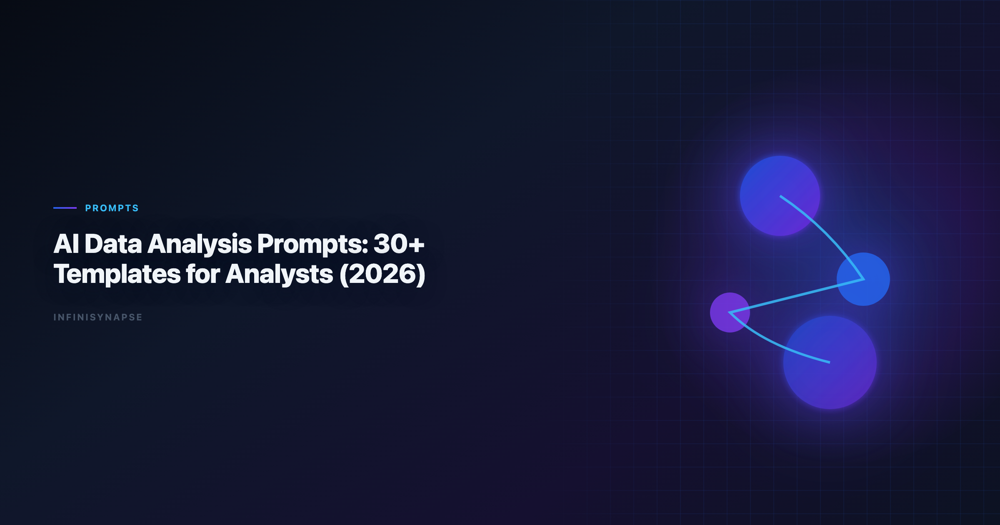

If Prompt is in scope for your team, reuse the same memory-and-trace checklist in [Data Analysis Prompt Template](/blog/data-analysis-prompt-template).

> **Byline:** InfiniSynapse Data Team  
> **Last updated:** 2026-06-09  
> *We build InfiniSynapse, an AI-native analytics platform. This guide is based on hands-on work maintaining recurring reporting, debugging failed analyses, and training analysts to reuse high-trust prompt assets.*

Last updated: 2026-06-09

**Meta Description**: 30+ reusable ai data analysis prompts organized by analysis task, with governance notes and a 30-day rollout for analyst teams in 2026. Includes a quick FAQ.

**Slug**: `/blog/ai-data-analysis-prompts`

**Target keyword**: `ai data analysis prompts`
**Secondary**: `data analysis prompt templates`, `analyst prompt library`, `ai analytics workflow`

---

## Table of Contents

1. [TL;DR](#tldr)
2. [Key Definition](#key-definition)
3. [When Prompt Libraries Actually Work](#when-prompt-libraries-actually-work)
4. [Design Rules Before You Write Prompts](#design-rules-before-you-write-prompts)
5. [36 Prompt Templates by Use Case](#36-prompt-templates-by-use-case)
6. [How to Operationalize the Library in 30 Days](#how-to-operationalize-the-library-in-30-days)
7. [Real Rollout Example](#real-rollout-example)
8. [Production Debugging Notes](#production-debugging-notes)
9. [How to Use This Reference in Production](#how-to-use-this-reference-in-production)
10. [Review Cadence and Maintenance](#review-cadence-and-maintenance)
11. [Operational Readiness Notes](#operational-readiness-notes)
12. [Stakeholder Communication Patterns](#stakeholder-communication-patterns)
13. [Review Cadence and Metrics](#review-cadence-and-metrics)
14. [Frequently Asked Questions](#frequently-asked-questions)
15. [Conclusion](#conclusion)
---

## TL;DR

This guide gives you 36 production-ready patterns for `ai data analysis prompts`, grouped by high-frequency analyst workflows: business framing, SQL generation, KPI monitoring, anomaly diagnostics, forecasting, and executive communication. Each prompt can be copied directly, adapted with variables, and linked to reusable checks.

Use this guide with [What Is a Data Agent?](/blog/what-is-a-data-agent) so your `ai data analysis prompts` become governed assets instead of ad-hoc chat snippets.

> **Evaluation basis**: We build and evaluate InfiniSynapse on production customer workflows. Governance, adoption, and security context is cited inline throughout this guide—not in a standalone reference list.

## Key Definition
Regulated rollouts often anchor access reviews to [AWS Well-Architected Framework](https://docs.aws.amazon.com/wellarchitected/latest/framework/welcome.html) when credentials, retention policies, and audit logs are in scope.

Access control design should reference [NIST SP 800-53 security controls](https://csrc.nist.gov/pubs/sp/800/53/r5/final) when scoping production analytics agents.

> **Key Definition:** `ai data analysis prompts` are structured instructions that define decision objective, data boundaries, metric logic, validation checks, and output format so an AI assistant can produce repeatable analysis instead of one-off narrative.

## When Prompt Libraries Actually Work What It Looks Like | Practical Fix |
Excel automation should reference [Microsoft Excel support](https://support.microsoft.com/excel) for table semantics, pivots, and formula auditability.

Lakehouse integrations should use [Wikipedia statistics overview](https://en.wikipedia.org/wiki/Statistics) for Unity Catalog, SQL warehouses, and agent grounding patterns.

|---|---|---|
| Prompt-only thinking | Team saves text snippets but ignores metric contracts | Pair every prompt with a metric definition card |
| No source boundaries | AI pulls stale or unapproved data | Add allowed sources and freshness windows in prompt header |
| No reviewer workflow | Answers ship without challenge or rerun checks | Require analyst + stakeholder sign-off for high-impact reports |
| No drift detection | Prompt quality decays after schema changes | Add monthly rerun benchmark and correction log |

## Design Rules Before You Write Prompts
Cloud analytics estates should align with the [Tableau Desktop documentation](https://help.tableau.com/current/pro/desktop/en-us/default.htm) for reliability, security, and operational excellence.

Metric definitions should stay grounded in [OWASP API Security Top 10](https://owasp.org/API-Security/) before agents encode KPIs.

Enterprise AI adoption guidance in [PostgreSQL documentation](https://www.postgresql.org/docs/) mirrors the shift from ad-hoc copilots to repeatable, reviewable decision workflows.

1. **Decision owner**: who acts on the output.
2. **Question class**: diagnosis, forecast, monitoring, or recommendation.
3. **Metric contract**: exact formulas and exclusions.
4. **Data boundaries**: approved tables, connectors, and freshness limits.
5. **Validation requirements**: null checks, outlier flags, and reconciliation.
6. **Output contract**: table structure, narrative length, confidence statement.

## 36 Prompt Templates by Use Case

### A) Business Framing Templates (1-6)

1. **Decision framing**  
Prompt: "Act as a senior analyst. Clarify the decision in one sentence, list the decision owner, define success metric, and request missing context before analysis begins."  
Use when: stakeholder request is broad or ambiguous. The move from dashboard-first BI to augmented workflows—described in [Databricks documentation](https://docs.databricks.com/en/)—frames how teams should evaluate tooling here. Adoption benchmarks in the [Google Cloud AI overview](https://cloud.google.com/discover/what-is-artificial-intelligence) track the same shift from pilot demos to governed analytics loops we see in customer rollouts.

2. **Scope boundary setup**  
Prompt: "Define what is in scope and out of scope for this request. Include geographies, product lines, time window, and data assets allowed for computation."  
Use when: teams debate scope after output is generated.

3. **Hypothesis draft**  
Prompt: "Generate three testable hypotheses for the question, rank by business impact, and map required data fields to each hypothesis."  
Use when: early exploratory analysis.

4. **Decision risk pre-check**  
Prompt: "List top five risks if we act on this result. For each risk, propose a validation step and fallback decision."  
Use when: high-stakes planning.

5. **Constraint translation**  
Prompt: "Translate leadership constraints into measurable parameters: budget, latency, service level, compliance, and staffing."  
Use when: requests include policy constraints.

6. **Stakeholder alignment brief**  
Prompt: "Draft a one-page analysis brief with objective, constraints, source list, metric definitions, timeline, and review checkpoints."  
Use when: kickoff for recurring reporting.

### B) SQL and Data Retrieval Templates (7-12)

7. **Schema discovery**  
Prompt: "Inspect available schema and identify candidate tables for this KPI. Return join keys, grain, and likely duplication risks."  
Use when: new domain onboarding.

8. **Query draft with assumptions**  
Prompt: "Write SQL to compute the metric. Comment all assumptions, filters, and default values inline."  
Use when: fast prototyping with review.

9. **Join explosion guardrail**  
Prompt: "Before running SQL, identify joins that may multiply rows. Propose dedup strategy and expected row count checks."  
Use when: many-to-many joins.

10. **Null and missingness audit**  
Prompt: "Quantify null rates per critical field and explain how null handling affects final metric confidence."  
Use when: data quality uncertainty.

11. **Reconciliation query pair**  
Prompt: "Produce two independent SQL approaches for the same KPI and compare results; flag variance greater than 2%."  
Use when: trust-building for executive metrics.

12. **Performance-aware SQL rewrite**  
Prompt: "Optimize this query for warehouse cost and runtime while preserving metric equivalence. Explain each optimization in plain English."  
Use when: production hardening.

### C) KPI Monitoring Templates (13-18)

13. **Daily KPI snapshot**  
Prompt: "Generate today's KPI table vs trailing 7-day and 28-day baselines. Highlight statistically meaningful deviations only."  
Use when: daily operations meeting.

14. **Segment breakdown**  
Prompt: "Break KPI by region, channel, and customer tier. Rank segments by contribution to total variance."  
Use when: decomposition after KPI shift.

15. **Threshold alert interpretation**  
Prompt: "Given threshold alerts, classify each as likely signal, likely noise, or requires manual review. Explain why."  
Use when: noisy monitoring systems.

16. **Leading indicator scan**  
Prompt: "Find upstream indicators that changed before the headline KPI moved. Show lag assumptions and confidence level."  
Use when: early warning analysis.

17. **Metric definition drift check**  
Prompt: "Compare current KPI logic to historical logic and report any formula drift, filter changes, or source substitutions."  
Use when: dashboard migration.

18. **Weekly KPI narrative**  
Prompt: "Write a concise weekly KPI narrative with what changed, why it changed, and what action should be tested next week."  
Use when: stakeholder updates.

### D) Diagnostic and Root Cause Templates (19-24)

19. **Anomaly decomposition**  
Prompt: "Decompose anomaly into volume, mix, pricing, and conversion effects; quantify each effect and residual."  
Use when: sudden P&L shifts.

20. **Cohort comparison**  
Prompt: "Compare new vs existing cohorts on retention and monetization. Control for acquisition channel and seasonality."  
Use when: growth investigations.

21. **Funnel leak isolation**  
Prompt: "Identify stage-level funnel drops, estimate impact in absolute counts, and prioritize top two repair opportunities."  
Use when: product conversion issues.

22. **Experiment interference check**  
Prompt: "Assess whether concurrent experiments or campaigns confound the observed effect. Provide a confidence downgrade if needed."  
Use when: overlapping tests.

23. **Counterfactual baseline**  
Prompt: "Construct a baseline from matched periods and peer segments. Estimate expected value without intervention."  
Use when: causal storytelling.

24. **Root cause evidence matrix**  
Prompt: "Build a table listing hypotheses, supporting evidence, contradicting evidence, and decision readiness status."  
Use when: synthesis for leadership.

### E) Forecast and Planning Templates (25-30)

25. **Short-horizon demand forecast**  
Prompt: "Forecast next four weeks with confidence interval, key drivers, and assumptions sensitivity."  
Use when: weekly capacity planning.

26. **Scenario planning trio**  
Prompt: "Model conservative, expected, and aggressive scenarios. State trigger conditions for switching between scenarios."  
Use when: quarterly planning.

27. **Driver elasticity estimate**  
Prompt: "Estimate effect size of major levers on target KPI. Include assumptions and confidence caveats."  
Use when: investment allocation.

28. **Capacity risk warning**  
Prompt: "Project load vs capacity by week and flag dates where service thresholds are likely to break."  
Use when: operations coordination.

29. **Budget sensitivity review**  
Prompt: "Show how forecast output changes under +/-10% budget and +/-15% conversion assumptions."  
Use when: CFO review prep.

30. **Plan vs actual bridge**  
Prompt: "Build variance bridge from plan to actual, attributing deltas to volume, mix, price, and execution factors."  
Use when: monthly business review.

### F) Communication and Handoff Templates (31-36)

31. **Executive summary generator**  
Prompt: "Convert detailed findings into a five-bullet executive summary: decision, evidence, risk, recommendation, next checkpoint."  
Use when: leadership brief.

32. **Analyst handoff note**  
Prompt: "Write a handoff note for another analyst including open questions, assumptions, and unresolved data quality issues."  
Use when: shift handover.

33. **Confidence statement writer**  
Prompt: "Generate confidence statement with confidence level, major uncertainty sources, and evidence quality rating."  
Use when: high-visibility reports.

34. **Action register builder**  
Prompt: "Translate findings into an action register with owner, deadline, success metric, and dependency risk."  
Use when: cross-functional planning.

35. **Slide-ready table formatter**  
Prompt: "Format output into board-friendly table with readable labels, units, and one-line interpretation per row."  
Use when: presentation prep.

36. **Postmortem capture**  
Prompt: "After decision outcome, capture which assumptions held, which failed, and how prompt should change for next cycle."  
Use when: continuous improvement.

### Quick Selection Table

| If your question is... | Start with template IDs | Add this check |
|---|---|---|
| "What changed this week?" | 13, 14, 18 | 17 for definition drift |
| "Why did KPI drop?" | 19, 21, 24 | 22 for experiment interference |
| "Can we trust this SQL?" | 8, 9, 11 | 10 for null handling |
| "What should we do next month?" | 25, 26, 30 | 29 for budget sensitivity |

## How to Operationalize the Library in 30 Days

| Week | Deliverable | Owner | Success metric |
|---|---|---|---|
| Week 1 | Draft top 12 prompts for recurring workflows | Analytics lead | 80% of recurring requests mapped |
| Week 2 | Add metric contracts + source boundaries | Data governance owner | 100% prompts reference approved sources |
| Week 3 | Run rerun tests and error logging | Senior analyst | <15% correction loop rate |
| Week 4 | Roll out shared library + review board | Data team manager | 70% prompt reuse in monthly cycle |

## Real Rollout Example

A B2B operations team we supported used `ai data analysis prompts` to rebuild its weekly executive review flow. Before rollout, two analysts spent half a day preparing one deck and still faced metric-definition disputes in every review. They introduced three prompt families first: KPI snapshot, segment decomposition, and root-cause matrix.

In week one, the team mapped every recurring chart to one reusable prompt and one metric contract. In week two, they added reconciliation checks and confidence statements to every output. By week three, the same `ai data analysis prompts` were executed by two different analysts with near-identical outputs, which reduced handoff friction. By week four, leadership trusted the process enough to shift meeting time from data argument to action planning.

The lesson is simple: `ai data analysis prompts` deliver value only when paired with governance and ownership. Teams that publish prompt text without process controls usually get faster drafts but not better decisions.

---

## Operating AI data analysis prompts in Production

Treat AI data analysis prompts as an operating capability, not a one-off task: confirm owners, metric definitions, and review gates for the first workflow before widening scope, because teams that log exceptions weekly compound accuracy faster than teams chasing new features. Capture the first reliable run as a reusable template — assumptions, checks, and reviewer sign-off in one playbook — so quality holds when data, schemas, or priorities change. Ground these controls in [ISO/IEC 27001](https://www.iso.org/isoiec-27001-information-security.html), [What Is a Data Agent](/blog/data-agent-faq) and [AWS Well-Architected Framework](https://docs.aws.amazon.com/wellarchitected/latest/framework/welcome.html).

### What to review on a regular cadence

Audit AI data analysis prompts monthly: compare rerun consistency, validation pass rate, and time-to-first-insight against baseline, retire stale definitions, and re-confirm access scopes so silent drift is caught before it reaches a stakeholder report.

## Communicating Results to Stakeholders

## Frequently Asked Questions

### How many analysis prompts should a team launch with?

Start with 12-15 prompts tied to your most frequent decisions. Expand only after you can measure reuse, correction loops, and cycle-time impact.

### What makes analysis prompts trustworthy?

Trust comes from explicit metric definitions, source boundaries, independent reconciliation, and confidence statements. Prompt style alone is never enough.

### Should we assign an owner for each prompt family?

Yes. Each prompt family needs a named owner responsible for revisions after schema changes, policy updates, and postmortem findings.

### How do I connect prompts to data agent workflows?

Map each prompt to a named data source, KPI, reviewer, and handoff. This makes orchestration auditable and reusable.

---

## Conclusion

`ai data analysis prompts` become valuable when they are treated as governed analytics assets, not inspirational snippets. A strong library of **ai data analysis prompts** reduces analyst rework, improves decision speed, and preserves trust under schema drift and changing business priorities. Start small, instrument outcomes, and continuously improve prompt quality with postmortem evidence.

Teams standardizing governance across sources often keep [AI Analytics Glossary](/blog/ai-analytics-glossary) beside this runbook for Glossary handoffs.