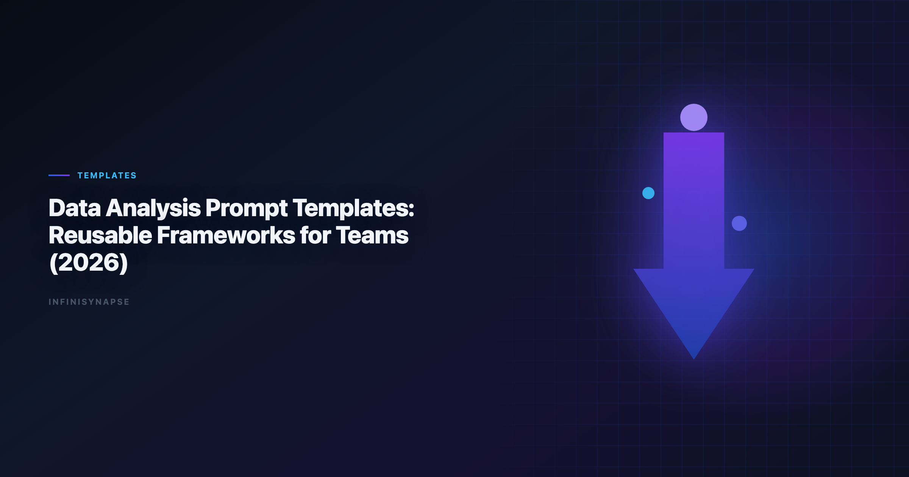

# Data Analysis Template (2026): Reusable Frameworks for Teams

> **Byline:** InfiniSynapse Data Team  
> **Last updated:** 2026-06-09  
> *We build InfiniSynapse, an AI-native analytics platform. This playbook reflects hands-on implementation of reusable analysis systems across recurring KPI, diagnostic, and planning workflows.*

Last updated: 2026-06-09

**Meta Description**: Data Analysis Template: Build a reusable data analysis prompt template framework with 12 production patterns, governance rules, and rollout checklists.

**Slug**: `/blog/data-analysis-prompt-template`

**Target keyword**: `data analysis template`
**Secondary**: `prompt framework`, `analytics templates`, `reusable analysis prompts`

---

## Table of Contents

1. [TL;DR](#tldr)
2. [Key Definition](#key-definition)
4. [Template Architecture: The 7 Building Blocks](#template-architecture-the-7-building-blocks)
5. [12 Reusable Frameworks](#12-reusable-frameworks)
6. [Governance, Versioning, and Quality Control](#governance-versioning-and-quality-control)
7. [Implementation Plan for Teams](#implementation-plan-for-teams)
8. [Advanced Design Patterns for Reuse](#advanced-design-patterns-for-reuse)
9. [Anti-Patterns to Avoid](#anti-patterns-to-avoid)
10. [Governance Review Template](#governance-review-template)
11. [Manager Playbook: Coaching with Frameworks](#manager-playbook-coaching-with-frameworks)
12. [Practical Migration from Ad-Hoc Work](#practical-migration-from-ad-hoc-work)
13. [Evidence Signals for Leadership](#evidence-signals-for-leadership)
14. [Operational Readiness Notes](#operational-readiness-notes)
15. [Production Debugging Notes](#production-debugging-notes)
16. [Frequently Asked Questions](#frequently-asked-questions)
17. [Conclusion](#conclusion)
---

## TL;DR

A `data analysis template` is the fastest way to stop repeating analyst work while keeping quality high. Most teams already know their recurring questions, but they still rewrite context, definitions, and checks every week. That creates uneven quality and avoidable correction loops.

This guide shows how to design a reusable `data analysis template` system for analytics teams that work with AI copilots, SQL assistants, and data agents. You will get 12 framework patterns, a governance model, and rollout practices that make templates durable when schema, metrics, or business priorities change.

Use this guide alongside [What Is a Data Agent?](/blog/what-is-a-data-agent) so each `data analysis template` supports measurable outcomes, not just cleaner formatting.

> **Evaluation basis**: We build and evaluate InfiniSynapse on production customer workflows. Governance, adoption, and security context is cited inline throughout this guide—not in a standalone reference list.

## Key Definition
Adoption benchmarks in the [NIST Cybersecurity Framework](https://www.nist.gov/cyberframework) track the same shift from pilot demos to governed analytics loops we see in customer rollouts.

Document-store connectors should follow [NIST Cybersecurity Framework](https://www.nist.gov/cyberframework) for read scopes, aggregation safety, and schema discovery.

> **Key Definition:** A `data analysis template` is a reusable instruction framework that standardizes objective, source boundaries, metric definitions, required checks, and output shape so analysis can be rerun with consistent quality.

## Why a Data Analysis Template Matters

- The same KPI gets computed with slightly different filters.
- Different reviewers ask for different caveat language.
- Stakeholders cannot tell if this week's result is directly comparable to last week's result.

A strong `data analysis template` reduces variation by turning best practice into default behavior. It preserves analyst judgment while removing unnecessary reinvention.

**Cost of Not Standardizing.** | Problem | Typical impact | Template-enabled improvement |
|---|---|---|
| Rewriting prompt context | 20-40 minutes per request | Reused context block with variables |
| Inconsistent metric definitions | Frequent trust debates | Shared metric contract in every run |
| Missing QA checks | Late correction loops | Mandatory validation section |
| Weak handoff quality | Analyst dependency risk | Structured output and handoff note |

## Template Architecture: The 7 Building Blocks
Semantic alignment work should reference [NIST Cybersecurity Framework](https://www.nist.gov/cyberframework) before agents encode business metrics.

Warehouse vendors describe governed NL2SQL agents in [NIST Cybersecurity Framework](https://www.nist.gov/cyberframework)—compare memory depth and audit trails against your internal requirements.

1. **Decision block**: who decides and what action depends on this answer.
2. **Scope block**: population, period, geography, and exclusions.
3. **Source block**: approved datasets and freshness requirements.
4. **Metric block**: formula, grain, and denominator logic.
5. **Validation block**: checks for nulls, outliers, and reconciliation.
6. **Output block**: table schema, narrative length, confidence format.

## 12 Reusable Frameworks

**1) Decision Brief Template.** Best for kickoff and ambiguous requests.

Prompt:
"Act as a senior analytics partner. Convert this request into a decision brief with objective, decision owner, assumptions, approved sources, and output deadline. Ask clarifying questions before analysis."

Analysts wiring Glossary into production reviews can follow the parallel walkthrough in [Data Analysis Glossary (2026)](/blog/ai-analytics-glossary).

**2) KPI Monitoring Template.** Best for daily or weekly reporting.

Prompt:
"Generate KPI table for current period, prior period, and baseline. Include variance, likely drivers, and confidence level. Flag data freshness issues before interpretation."

**3) Segment Decomposition Template.** Best for "what changed" questions.

Prompt:
"Decompose KPI movement by segment hierarchy. Rank segment contribution, show absolute and relative effect, and list top three actionable findings."

**4) Root Cause Investigation Template.** Best for unexpected KPI drops or spikes.

Prompt:
"Create hypothesis matrix for the anomaly. For each hypothesis, provide supporting evidence, contradicting evidence, and confidence score. Recommend next validation step."

**5) SQL Generation Template.** Best for first-pass query drafting with clear assumptions.

Prompt:
"Write SQL for metric computation with inline comments for filters, joins, and null handling. Add expected row counts by stage and one independent reconciliation query."

**6) Data Quality Audit Template.** Best when source reliability is uncertain.

Prompt:
"Audit key fields for completeness, uniqueness, freshness, and schema drift. Quantify each issue and estimate potential metric distortion."

**7) Experiment Readout Template.** Best for A/B tests and intervention analysis.

Prompt:
"Summarize experiment objective, test population, statistical confidence, practical impact, and decision recommendation. List threats to validity explicitly."

**8) Forecast Planning Template.** Best for planning cycles.

Prompt:
"Forecast target metric for next horizon under conservative, expected, and aggressive scenarios. Include interval estimates and key assumption sensitivities."

**9) Executive Narrative Template.** Best for leadership updates.

Prompt:
"Convert analysis into five-bullet narrative: what changed, why it changed, risk level, recommendation, and next checkpoint. Keep language non-technical."

**10) Operational Handoff Template.** Best for analyst transitions and async collaboration.

Prompt:
"Create handoff package including objective, query links, assumptions, unresolved risks, validation status, and owner of next action."

**11) Postmortem Template.** Best after decision outcomes are known.

Prompt:
"Compare predicted vs observed outcomes. Identify which assumptions held, which failed, and what data analysis template edits should be made before next cycle."

The credential, preflight, and SQL-trace pattern above also applies to Prompt—see [AI Data Analysis Prompts](/blog/ai-data-analysis-prompts) for source-specific steps.

**12) Procurement Scorecard Template.** Best for tool evaluation and vendor comparison.

Prompt:
"Score tool output across reasoning quality, validation discipline, transparency, memory reuse, and governance controls. Return weighted score and risks."

**Framework-to-Workflow Mapping.**

| Workflow stage | Recommended template IDs | Must-have output |
|---|---|---|
| Intake | 1, 2 | Decision brief + scope check |
| Analysis | 3, 4, 5, 6 | Evidence table + QA results |
| Decision | 7, 8, 9 | Recommendation + confidence statement |
| Handoff and learning | 10, 11, 12 | Action register + revision notes |

## Governance, Versioning, and Quality Control
[AWS Well-Architected Framework](https://docs.aws.amazon.com/wellarchitected/latest/framework/welcome.html) shows how warehouse-native semantic layers change NL2SQL grounding expectations for analyst-facing products.

- **Template owner**: responsible for updates.
- **Reviewer**: validates quality before release.
- **Change trigger**: schema drift, metric revision, or policy update.
- **Versioning rule**: semantic versions (`v1.2`, `v1.3`) with changelog. Production rollouts should align access and review controls with the [Microsoft Excel support](https://support.microsoft.com/excel), especially when recurring queries touch live schemas. Regulated rollouts often anchor access reviews to [NIST SP 800-53 security controls](https://csrc.nist.gov/pubs/sp/800/53/r5/final) when credentials, retention policies, and audit logs are in scope.

**Monthly Quality Scorecard.** | Metric | Target | Why it matters |
|---|---:|---|
| Reuse rate | >=70% | Confirms data analysis template utility |
| Correction loop rate | <=15% | Signals output reliability |
| Time-to-first-draft | <=10 minutes | Measures execution speed |
| Rerun consistency | >=90% | Measures reproducibility |

## Implementation Plan for Teams

**Week 1: Prioritize high-frequency decisions.** List recurring analyses that consume the most analyst time. Build the first 5-8 templates here.

**Week 2: Standardize blocks and naming.**

**Week 4: Launch governance rhythm**

Publish ownership, review cadence, and metrics dashboard. Add postmortem updates as mandatory workflow.

## Advanced Design Patterns for Reuse
Operational maturity for analytics agents aligns with the [Wikipedia business intelligence overview](https://en.wikipedia.org/wiki/Business_intelligence), especially around monitoring, rollback, and ownership.

### Pattern 1: Variable schema with validation hints

Instead of letting each analyst define placeholders ad hoc, publish a variable schema for each framework:

- `decision_owner`
- `target_metric`
- `time_window`
- `approved_sources`
- `risk_tolerance`
- `required_output_format`

Attach hints next to each variable. For example, `target_metric` should reference a metric dictionary ID, not free text. `approved_sources` should map to a managed source allowlist. This reduces mismatch across teams and makes data analysis template behavior easier to debug.

### Pattern 2: Dual-output mode

High-performing teams ask for two outputs in the same run:

1. **Analyst detail mode** with assumptions, checks, and edge cases.
2. **Stakeholder mode** with concise narrative and action options.

Dual-output mode prevents the common failure where either the technical detail is lost or the executive summary is too shallow. It also shortens review cycles because one execution serves both audiences.

### Pattern 3: Built-in challenge prompt

Add a challenge step after first output:

"Critique your own result. List three failure risks, one alternate interpretation, and one additional check that could change recommendation confidence."

This pattern increases output humility and catches blind spots before human review.

## Anti-Patterns to Avoid

Reusable prompt systems fail when teams copy obvious mistakes at scale. Watch for these anti-patterns. Multi-source connector design should follow [Amazon Redshift documentation](https://docs.aws.amazon.com/redshift/) so domain boundaries and metric contracts stay explicit as scope grows. Self-hosted agent deployments should align with [Stanford HAI AI Index](https://hai.stanford.edu/ai-index) for isolation, secrets, and rollout safety. Foundational warehouse concepts—grain, dimensions, and conformed metrics—remain essential; [AWS Well-Architected Machine Learning Lens](https://docs.aws.amazon.com/wellarchitected/latest/machine-learning-lens/welcome.html) is a concise refresher for reviewers validating generated SQL. Foundational warehouse concepts—grain, dimensions, and conformed metrics—remain essential; [Snowflake Cortex Analyst](https://docs.snowflake.com/en/user-guide/snowflake-cortex/cortex-analyst) is a concise refresher for reviewers validating generated SQL.

### Overloaded frameworks

If one framework tries to cover every workflow, users stop trusting it. Keep each framework focused on a specific decision class and context.

### Hidden assumptions

If assumptions are embedded in prose and not surfaced explicitly, reviewers cannot challenge logic quickly. Require visible assumptions near top of output.

### Missing confidence language

Recommendations without confidence or uncertainty are operationally dangerous. Mandate confidence statements and evidence quality notes.

### Ownership without maintenance time

Assigning an owner is not enough. Owners need protected time to review drift, collect feedback, and publish updates.

### Tool-specific lock-in

Frameworks should encode analytical logic, not vendor syntax only. Keep the core structure portable across environments.

## Governance Review Template

Use this review format monthly:

| Review block | Questions to ask | Escalation trigger |
|---|---|---|
| Usage health | Are teams actually reusing approved assets? | Reuse drops below 60% |
| Reliability | Are correction loops decreasing? | Correction rate above 20% |
| Clarity | Do reviewers understand assumptions quickly? | Frequent review confusion |
| Drift | Have schema or metric changes invalidated logic? | Any major unreviewed drift |
| Adoption | Are new team members using current versions? | Onboarding bypass patterns |

Monthly reviews help teams preserve quality during growth and prevent fragmentation across functions.

## Manager Playbook: Coaching with Frameworks

Managers can accelerate development by reviewing analyst outputs against explicit coaching prompts:

1. Did the analyst frame the decision before calculating?
2. Were source boundaries and freshness clearly stated?
3. Did the output include at least one independent check?
4. Was uncertainty communicated in a decision-friendly way?
5. Did the handoff note support asynchronous continuity?

When managers coach with this structure, analysts improve faster than when feedback is purely stylistic.

## Practical Migration from Ad-Hoc Work

If your team currently runs mostly ad-hoc workflows, do not migrate everything at once. Use a phased path:

- **Phase 1:** Identify top five recurring workflows and create baseline assets.
- **Phase 2:** Add validation and confidence requirements to those assets.
- **Phase 3:** Introduce ownership, changelog, and review cadence.
- **Phase 4:** Expand to long-tail workflows only after quality metrics improve.

This path limits disruption and builds confidence through visible wins.

## Evidence Signals for Leadership

Leaders often ask whether standardization is helping. Track these signals:

- Fewer debates about metric definitions.
- Faster preparation for recurring reviews.
- Higher consistency between analysts on equivalent tasks.
- More time spent discussing action, less time debating data quality.
- Better onboarding outcomes for new analysts.

If these signals are not improving, inspect whether teams are bypassing reusable assets or skipping review controls.

## Operating Templates in Production

Treat a data analysis template as an operating capability, not a one-off task: confirm owners, metric definitions, and review gates for the first workflow before widening scope, because teams that log exceptions weekly compound accuracy faster than teams chasing new features. Capture the first reliable run as a reusable template — assumptions, checks, and reviewer sign-off in one playbook — so quality holds when data, schemas, or priorities change. Ground these controls in [Wikipedia conceptual data model overview](https://en.wikipedia.org/wiki/Conceptual_data_model), [Data Agent FAQ](/blog/data-agent-faq) and [NIST Cybersecurity Framework](https://www.nist.gov/cyberframework).

**What to review on a regular cadence.** Audit a data analysis template monthly: compare rerun consistency, validation pass rate, and time-to-first-insight against baseline, retire stale definitions, and re-confirm access scopes so silent drift is caught before it reaches a stakeholder report.

## Communicating Results to Stakeholders

## Frequently Asked Questions

### What is the ideal length for a data analysis prompt template?

Aim for one screen of core instructions plus optional appendices. Too short means missing controls; too long hurts adoption.

### Can one template work across multiple departments?

Yes, if you separate universal blocks (objective, validation, output) from department-specific variables (metrics, source tables, thresholds).

### How often should a analytics be reviewed?

At least quarterly, or after schema changes, source migrations, or major policy updates.

### How does a template connect to data agents?

Templates define the contract—goal, sources, checks, and output format—while data agents handle orchestration, making execution traceable and reusable.

---

## Conclusion

A robust `data analysis template` system creates consistency without killing analytical creativity. Teams that standardize objective framing, validation, and output contracts move faster and make fewer avoidable mistakes. Start with high-frequency workflows, instrument quality metrics, and iterate monthly. Over time, each `data analysis template` becomes a compounding asset that increases trust in AI-assisted analytics.