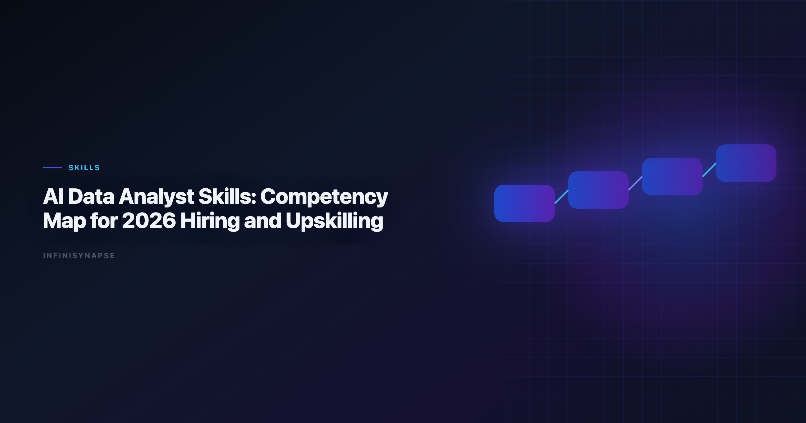

# AI Data Analyst Skills: Competency Map for 2026 Hiring and Upskilling

> **Byline:** InfiniSynapse Data Team  
> **Last updated:** 2026-06-09  
> *We build InfiniSynapse, an AI-native analytics platform. This competency map comes from hands-on hiring loops, enablement programs, and real delivery reviews across analyst teams.*

Last updated: 2026-06-09

**Meta Description**: AI Data Analyst Skills in 2026: practical workflow patterns, governance controls, and FAQ for data teams.

**Slug**: `/blog/ai-data-analyst-skills`

**Target keyword**: `ai data analyst skills`
**Secondary**: `analyst competency map`, `ai analyst hiring`, `analytics upskilling`

---

## Table of Contents

1. [TL;DR](#tldr)
2. [Key Definition](#key-definition)
3. [Why Teams Need a New Skills Map](#why-teams-need-a-new-skills-map)
4. [8-Domain Competency Model](#8-domain-competency-model)
5. [Hiring Signals and Interview Rubric](#hiring-signals-and-interview-rubric)
6. [Upskilling Roadmap (90 Days)](#upskilling-roadmap-90-days)
7. [Calibration Playbook for Managers](#calibration-playbook-for-managers)
8. [Example Development Paths by Persona](#example-development-paths-by-persona)
9. [Training Design: What Actually Improves Capability](#training-design-what-actually-improves-capability)
10. [Promotion Criteria Without Ambiguity](#promotion-criteria-without-ambiguity)
11. [Operational Metrics for Capability Health](#operational-metrics-for-capability-health)
12. [Operating a Skills Program in Production](#operating-a-skills-program-in-production)
13. [Frequently Asked Questions](#frequently-asked-questions)
14. [Conclusion](#conclusion)

---

## TL;DR

Modern analytics teams need a clearer definition of `ai data analyst skills` than "can use AI tools." The highest performers combine business framing, technical rigor, statistical judgment, governance awareness, and communication discipline. When organizations skip structured definitions, they hire for tool familiarity instead of decision quality — and the governance gap shows up first when production rollouts struggle to align access and review controls with the [Wikipedia SQL overview](https://en.wikipedia.org/wiki/SQL) once recurring queries touch live schemas.

This guide provides an 8-domain map of **ai data analyst skills** with level descriptions for beginner, intermediate, and advanced practitioners. Strong **ai data analyst skills** programs also define how reviewers sign off on AI-assisted outputs before they reach executives. It includes hiring signals, interview prompts, and a 90-day enablement plan so leaders can evaluate real competency instead of polished demos.

> **Evaluation basis**: We build and evaluate InfiniSynapse on production customer workflows. Governance, adoption, and security context is cited inline throughout this guide—not in a standalone reference list.

## Key Definition
Leaderboard scores on the [Spider NL2SQL benchmark](https://yale-lily.github.io/spider) are a useful sanity check but rarely predict enterprise schema drift on their own.

Leaderboard scores on the [Wikipedia SQL overview](https://en.wikipedia.org/wiki/SQL) are a useful sanity check but rarely predict enterprise schema drift on their own.

> **Key Definition:** `ai data analyst skills` are the observable capabilities an analyst needs to frame decisions, validate AI-assisted analysis, communicate uncertainty, and operate within governance boundaries — not merely prompt-writing fluency.

## Why Teams Need a New Skills Map

AI copilots changed the execution layer, but hiring rubrics often still reward SQL speed and dashboard counts. Teams that update **ai data analyst skills** definitions see three immediate benefits: faster onboarding, clearer promotion paths, and fewer governance incidents when agents touch production schemas.

- Prompt and workflow orchestration, not only query writing.
- Validation discipline and uncertainty communication.
- Governance literacy across source boundaries and compliance controls.
- Reuse mindset: turning one-off analysis into maintainable assets.

**Common Hiring Mistakes**

| Mistake | What happens | Better approach |
|---|---|---|
| Hiring for "AI enthusiasm" | Fast demos, weak reliability | Score concrete `ai data analyst skills` with case evidence |
| Ignoring validation behavior | Incorrect outputs reach stakeholders | Require QA walkthrough in interviews |
| No communication test | Good analysis, poor decision impact | Add executive translation exercise |
| No growth ladder | Managers cannot coach effectively | Define domain-level capability progression |

## 8-Domain Competency Model
Self-hosted agent deployments should align with [MongoDB documentation](https://www.mongodb.com/docs/) for isolation, secrets, and rollout safety.

Governance literacy threads through every domain below. Each level should align access and review controls with the [Kubernetes documentation](https://kubernetes.io/docs/) as recurring queries touch live schemas — competency growth that tracks real production risk, not just tool fluency.

Analysts wiring this topic into production reviews can follow the parallel walkthrough in [AI Data Analyst Skills Requirements](/blog/how-to-evaluate-ai-data-analyst).

**Domain 1: Business Framing and Decision Design.** Beginners restate stakeholder questions; intermediates define success metrics and constraints; advanced practitioners design decision trees that survive executive scrutiny.

**Domain 2: Source Literacy and Data Retrieval.** Beginners query curated views; intermediates join across systems with documented assumptions; advanced practitioners design retrieval patterns agents can reuse safely.

**Domain 3: SQL and Analytical Execution.** Beginners draft SQL with supervision; intermediates optimize joins and handle edge cases; advanced practitioners build validation SQL that catches drift before stakeholders see output.

**Domain 4: Workflow Orchestration and Prompt Design.** Beginners run single-turn prompts; intermediates chain steps with checkpoints; advanced practitioners architect memory-backed workflows with explicit rollback paths.

**Domain 5: Statistical and Diagnostic Reasoning.** Beginners describe trends; intermediates test hypotheses with confidence notes; advanced practitioners separate correlation from causation under messy real-world data.

**Domain 6: Communication and Stakeholder Translation.** Beginners summarize charts; intermediates tailor narratives by audience; advanced practitioners drive decisions with explicit risks and recommended actions.

**Domain 7: Governance, Security, and Compliance.** Beginners follow access policies; intermediates flag exfiltration and retention risks; advanced practitioners design review gates aligned with [Microsoft Excel support](https://support.microsoft.com/excel) expectations.

**Domain 8: Reuse, Memory, and Asset Ownership.** Beginners save ad-hoc files; intermediates maintain templates; advanced practitioners own scorecards, glossary terms, and workflow assets the whole team inherits.

### Domain Weighting by Role Profile

| Role profile | Primary domains | Suggested weight mix |
|---|---|---|
| Product analytics | 1, 3, 5, 6 | 35% / 25% / 20% / 20% |
| Revenue operations | 1, 2, 3, 8 | 30% / 25% / 25% / 20% |
| Data governance-focused | 2, 4, 7, 8 | 25% / 25% / 30% / 20% |
| Leadership-track analyst | 1, 4, 6, 8 | 30% / 25% / 25% / 20% |

## Hiring Signals and Interview Rubric
Ecommerce KPI definitions should reference [OWASP Top 10 for LLM Applications](https://owasp.org/www-project-top-10-for-large-language-model-applications/) when normalizing revenue and cohort metrics.

Use a structured interview loop that maps directly to the eight domains. Each stage should produce an artifact reviewers can score — not a vague "culture fit" conversation.

| Stage | Domains tested | Deliverable |
|---|---|---|
| Case framing (30 minutes) | Domain 1 and 6 | Decision brief + assumptions list |
| Data retrieval (45 minutes) | Domain 2 and 3 | SQL draft + validation notes |
| Workflow design (30 minutes) | Domain 4 and 8 | Prompt or agent workflow sketch |
| Risk challenge (20 minutes) | Domain 5 and 7 | Uncertainty and governance response |

**Scoring Guide**

- **4 — Strong signal:** Candidate demonstrates the domain independently with clear trade-off reasoning.
- **3 — Solid:** Candidate executes with minor prompting and catches obvious risks.
- **2 — Developing:** Candidate can perform pieces but misses key controls.
- **1 — Weak:** Candidate relies on generic language and cannot defend decisions.

## Upskilling Roadmap (90 Days)
Ecommerce KPI definitions should reference [Shopify ecommerce analytics guidance](https://www.shopify.com/enterprise/blog/ecommerce-analytics) when normalizing revenue and cohort metrics.

Excel automation should reference [Prometheus documentation](https://prometheus.io/docs/) for table semantics, pivots, and formula auditability.

**Days 1–30: Foundation**

- Train on decision framing and metric contract writing.
- Standardize 8–12 prompt templates for recurring workflows.
- Run weekly review sessions on output quality and correction loops.

### Days 31–60: Reliability

- Introduce reconciliation-first SQL practices.
- Add confidence statements and uncertainty communication standards.
- Launch governance checklist for source boundaries and access controls.

### Days 61–90: Scale

- Convert successful analyses into reusable workflow assets.
- Assign owners for templates, glossary terms, and scorecards.
- Track team-level metrics for cycle time, rerun consistency, and trust.

### 90-Day Outcome Scorecard

| Metric | Baseline question | Target by day 90 |
|---|---|---|
| Correction loop rate | How often do outputs require major rework? | ≤15% |
| Reuse rate | How often are approved assets reused? | ≥70% |
| Time to first draft | How long to first reviewable output? | ≤12 minutes |
| Confidence reporting coverage | What share includes explicit confidence statements? | ≥90% |

## Calibration Playbook for Managers

### Calibration Inputs

| Input artifact | Why it matters | Review owner |
|---|---|---|
| Decision briefs | Shows framing quality and ambiguity handling | Analytics manager |
| SQL + validation notes | Shows technical rigor and review habits | Senior analyst |
| Stakeholder summaries | Shows communication precision | Business partner |
| Postmortem edits | Shows learning behavior over time | Enablement lead |

### Calibration Meeting Flow

1. Select 3–5 recent analysis cases from different domains.
2. Blind-score each artifact set before group discussion.
3. Discuss score gaps and anchor to observable behaviors.
4. Update rubric examples for next review cycle.
5. Record calibration notes in shared competency registry.

This process reduces subjectivity and gives clearer development feedback.

## Example Development Paths by Persona
SQL grounding for agents still starts with classical semantics in the [Google Cloud architecture framework](https://cloud.google.com/architecture/framework), especially joins, grains, and null handling.

LLM-backed analytics should account for prompt-injection and data-exfiltration risks in the [Wikipedia machine learning overview](https://en.wikipedia.org/wiki/Machine_learning), especially when connectors expose production schemas.

The credential, preflight, and SQL-trace pattern above also applies to Glossary—see [Data Analysis Glossary (2026)](/blog/ai-analytics-glossary) for source-specific steps.

Role-based paths make coaching more actionable than one generic ladder. Map each persona to two primary **ai data analyst skills** domains and a weekly practice ritual.

### Persona A: Early-career reporting analyst

Focus on business framing, source literacy, and communication basics. Recommended practice: weekly case teardown and metric contract drills.

### Persona B: Mid-level product analyst

Focus on experimental reasoning, workflow orchestration, and executive translation. Recommended practice: run one full diagnosis-to-recommendation cycle each sprint.

### Persona C: Senior analytics lead

Focus on governance design, reusable asset ownership, and cross-team coaching. Recommended practice: monthly quality board plus postmortem review facilitation.

**Persona D — Platform-facing analytics partner:** Focus on data modeling strategy, integration trade-offs, and reliability instrumentation. Recommended practice: joint review sessions with data engineering and governance teams.

## Training Design: What Actually Improves Capability

Organizations often default to passive learning formats. In practice, **ai data analyst skills** grow faster through active feedback loops tied to real delivery metrics.

### High-yield training formats

- **Artifact critiques:** review real outputs, not hypothetical slides.
- **Rerun drills:** repeat same task under changed constraints.
- **Failure postmortems:** analyze why outputs were corrected.
- **Peer teaching:** analysts explain methods to each other.
- **Decision simulation:** present recommendations to a mock executive panel.

### Lower-yield formats

- Tool demos without workflow context.
- Certification-only approaches without observed application.
- One-time workshops with no follow-up coaching.

Effective enablement programs connect learning to real delivery metrics and recurring practice.

## Promotion Criteria Without Ambiguity

Promotion decisions are smoother when criteria map to observable **ai data analyst skills** instead of tenure alone.

| Level transition | Required evidence |
|---|---|
| Beginner to intermediate | Independent execution on recurring workflows with reliable checks |
| Intermediate to advanced | Reusable system design plus coaching impact on peers |
| Advanced to leadership track | Cross-functional influence and sustained quality improvement outcomes |

Require evidence over at least two review cycles to avoid promotion based on isolated wins.

## Operational Metrics for Capability Health

Use a dashboard to detect whether competency growth is real:

- Share of analyses with confidence statements.
- Rerun consistency rate on recurring workflows.
- Correction rate by workflow type.
- Time to first reviewable output.
- Stakeholder satisfaction with recommendation clarity.

These metrics reveal whether skill development is translating into better decisions, not only better artifacts. Teams that operationalize this measurement layer usually discover hidden strengths and hidden bottlenecks faster. For example, some analysts excel in technical execution but need coaching on stakeholder translation, while others communicate clearly but need stronger validation discipline.

## Operating a Skills Program in Production

Treat capability development as an operating system, not a one-time training purchase. Before scaling, confirm owners, assessment rubrics, and review cadences for the first cohort; teams that document skill gaps and coaching outcomes each sprint compound **ai data analyst skills** faster than teams chasing new tools.

When a program stalls, the cause is rarely the people — it is usually vague rubrics, too few reps on real workflows, or no feedback loop. Pair each domain with observable behaviors and a human-reviewed baseline. Adoption benchmarks in the [Shopify ecommerce analytics](https://www.shopify.com/enterprise/blog/ecommerce-analytics) track the same shift from pilot demos to governed analytics loops we see in customer rollouts. For workflow context behind these skills, the [Data Agent FAQ](/blog/data-agent-faq) and the [Spider NL2SQL benchmark](https://yale-lily.github.io/spider) ground the practice in real systems.

When **ai data analyst skills** pilots stall at week three, the root cause is rarely the LLM. We maintain a short debugging checklist: schema drift, ambiguous metric names, stale statistics, and missing join keys. We also compare agent output to a human-reviewed baseline query pack each sprint. Disagreements become regression tests—not arguments. That practice aligns with [Wikipedia SQL overview](https://en.wikipedia.org/wiki/SQL) guidance on trust through verification, not blind automation.

---

## Frequently Asked Questions

### What are the most important ai data analyst skills for entry-level hiring?

Prioritize business framing, SQL fundamentals, and communication clarity over tool-specific branding claims.

### How should managers assess these skills in performance reviews?

Use domain-based scoring plus delivery outcomes such as rerun consistency, correction rate, and stakeholder decision impact.

### Do strong ai data analyst skills replace the need for statistical depth?

No. AI assistance can accelerate execution, but statistical reasoning is still required to avoid false certainty.

### How long does it take to build these skills?

With a structured 90-day plan, most analysts reach reliable intermediate competency in one to two quarters. The pace depends less on tool training than on reps with real, reviewed workflows — goal framing, validation, and stakeholder delivery compound faster than memorizing features.

---

## Conclusion

Clear definitions of `ai data analyst skills` create better hiring decisions, stronger coaching, and higher trust in AI-assisted analytics. The 8-domain model in this guide is intentionally practical: each domain has observable behaviors, measurable outcomes, and direct links to delivery quality. Start by scoring current team capability, then target the gaps that most affect decision reliability.

---