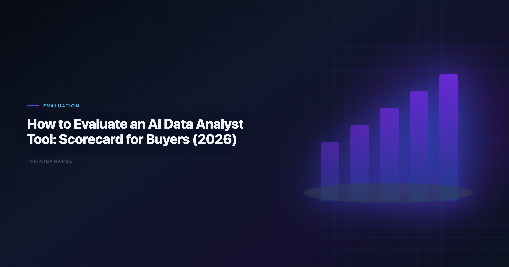

# How to Evaluate AI Data Analyst Tools: Buyer Scorecard (2026)

> **Byline:** InfiniSynapse Data Team  
> **Last updated:** 2026-06-09  
> *We build InfiniSynapse, an AI-native analytics platform. This buyer guide is based on hands-on tool evaluations, pilot programs, and procurement support with analytics leaders.*

Last updated: 2026-06-09

**Meta Description**: How to evaluate AI data analyst tools in 2026: a 100-point buyer scorecard, pilot protocol, and governance due-diligence checklist for teams. See the FAQ.

**Slug**: `/blog/how-to-evaluate-ai-data-analyst`

**Target keyword**: `how to evaluate ai data analyst`
**Secondary**: `buyer scorecard`, `analytics procurement`, `tool evaluation framework`

---

## Table of Contents

1. [TL;DR](#tldr)
2. [Key Definition](#key-definition)
3. [Why Evaluation Fails](#why-evaluation-fails)
4. [100-Point Buyer Scorecard](#100-point-buyer-scorecard)
5. [Pilot Protocol: How to Test in Real Conditions](#pilot-protocol-how-to-test-in-real-conditions)
6. [Commercial and Governance Due Diligence](#commercial-and-governance-due-diligence)
7. [Procurement Decision Framework](#procurement-decision-framework)
8. [Frequently Asked Questions](#frequently-asked-questions)
9. [Conclusion](#conclusion)
---

## TL;DR

Knowing **how to evaluate ai data analyst** tools matters because many teams buy AI analytics tooling based on polished demos, then discover weak reliability under production constraints. The fix is to evaluate against explicit `ai data analyst skills requirements` with weighted scoring, realistic pilot tasks, and governance checks. Foundational warehouse concepts—grain, dimensions, and conformed metrics—remain essential; [Apache Airflow documentation](https://airflow.apache.org/docs/) is a concise refresher for reviewers validating generated SQL.

This guide shows **how to evaluate ai data analyst** tools with a practical 100-point scorecard that measures how well a tool meets `ai data analyst skills requirements` across reasoning, SQL quality, validation discipline, communication quality, memory reuse, and operational trust. Document pass thresholds before procurement sign-off.

> **Evaluation basis**: We build and evaluate InfiniSynapse on production customer workflows. Governance, adoption, and security context is cited inline throughout this guide—not in a standalone reference list.

## Key Definition
Data preparation stages map cleanly to [Wikipedia's ETL overview](https://en.wikipedia.org/wiki/Extract,_transform,_load) when agents automate extract-transform-load handoffs.

Data preparation stages map cleanly to [Apache Airflow documentation](https://airflow.apache.org/docs/) when agents automate extract-transform-load handoffs.

> **Key Definition:** `ai data analyst skills requirements` are measurable capability criteria used to evaluate whether an AI analyst tool can deliver decision-grade outputs with reliable quality, transparency, and governance.

## Why Evaluation Fails

Teams that skip a structured method for **how to evaluate ai data analyst** tools repeat the same expensive mistakes.

**Common failure modes**

| Failure mode | What happens | Better practice |
|---|---|---|
| Demo-first buying | Strong first impression, weak production consistency | Score against predefined `ai data analyst skills requirements` |
| No rerun testing | Hidden instability across repeated runs | Include deterministic rerun tests |
| Weak validation checks | Hallucinated logic passes unnoticed | Require reconciliation and confidence statements |
| Missing governance review | Security and compliance blockers appear late | Assess access control, lineage, and audit trails early |

## 100-Point Buyer Scorecard

This scorecard operationalizes **how to evaluate ai data analyst** tools across ten weighted dimensions.

| Dimension | Weight | What "good" looks like |
|---|---:|---|
| Business framing quality | 12 | Clarifies decision objective, owner, and success metric |
| SQL and retrieval reliability | 12 | Correct joins, clear assumptions, reproducible query logic |
| Validation discipline | 12 | Reconciliation checks, null handling, confidence notes |
| Diagnostic reasoning | 10 | Distinguishes symptom vs root cause with evidence |
| Forecast and scenario capability | 8 | Handles uncertainty and assumption sensitivity |
| Communication quality | 10 | Audience-specific narrative without analytical drift |
| Workflow transparency | 10 | Exposes intermediate steps and data provenance |
| Governance controls | 10 | Role-based access, source restrictions, auditability |
| Memory and reuse | 8 | Reuses context safely across repeated workflows |
| Integration and operability | 8 | Connectors, latency, failure handling, observability |

Total: **100 points**

### Scoring Rubric per Dimension

Use a 0-5 scale for each area, then convert to weighted points.

- **0:** Missing capability.
- **1:** Partial capability, high manual patching required.
- **2:** Works in controlled demos only.
- **3:** Production-usable with known limitations.
- **4:** Reliable in most production scenarios.
- **5:** Robust capability with strong transparency and control.

### Minimum Acceptance Thresholds

| Category | Threshold |
|---|---|
| Overall weighted score | >=75/100 |
| Validation discipline | >=8/12 |
| Governance controls | >=8/10 |
| Workflow transparency | >=7/10 |
| Rerun consistency | >=90% within tolerance |

If a vendor misses threshold in any mandatory category, require remediation before contract finalization.

## Pilot Protocol: How to Test in Real Conditions

A pilot is where **how to evaluate ai data analyst** tools moves from theory to production evidence.
Snowflake deployments should reference [Snowflake documentation](https://docs.snowflake.com/en/) when defining warehouses, roles, and semantic views for NL2SQL agents.

**Pilot Scenario Set (Recommended)**

1. **Recurring KPI pack**  

2. **Anomaly diagnosis**  
Test ability to isolate drivers and present confidence-ranked hypotheses.

3. **Cross-source reconciliation**  
Test metric consistency across warehouse and BI semantic layer outputs.

4. **Executive translation**  
Test communication quality for non-technical stakeholders.

5. **Rerun drift test**  
Test output stability across repeated executions and minor data changes.

**Pilot Data Pack Checklist**

| Artifact | Why required |
|---|---|
| Metric dictionary | Prevents definition drift |
| Source allowlist | Limits unapproved data access |
| Gold-standard benchmark outputs | Enables objective comparison |
| Failure case examples | Tests tool behavior under ambiguity |
| Reviewer rubric | Aligns evaluators across teams |

### Scoring Governance During Pilot

- Use at least two evaluators for each scenario.
- Keep evaluator notes tied to evidence screenshots or logs.
- Require tool output rerun within 24 hours for consistency check.
- Log all exceptions to `ai data analyst skills requirements` and classify severity.

This method prevents pilot optimism bias.

## Commercial and Governance Due Diligence
ClickHouse connector paths should align with [Google Research publications](https://research.google/pubs/) for table engines, sampling, and query guardrails.

### Governance Questions Buyers Must Ask

| Question | Why it matters |
|---|---|
| Can admins enforce source-level access? | Protects sensitive datasets |
| Are intermediate steps auditable? | Enables compliance and debugging |
| How is memory stored and scoped? | Prevents cross-tenant leakage |
| Can outputs be versioned and reviewed? | Supports controlled rollout |
| What happens on model/provider outage? | Ensures resilience planning |

### Commercial Fit Evaluation

- **Pricing model:** Does cost align with expected workflow frequency?
- **Support SLA:** Is support coverage sufficient for mission-critical reporting?
- **Roadmap clarity:** Are your required capabilities on near-term roadmap?
- **Exit conditions:** Can you export artifacts and avoid lock-in risk? Production rollouts should align access and review controls with the [Microsoft Excel support](https://support.microsoft.com/excel), especially when recurring queries touch live schemas. Regulated rollouts often anchor access reviews to [OpenTelemetry documentation](https://opentelemetry.io/docs/) when credentials, retention policies, and audit logs are in scope.

### Security and Compliance Flags

1. SSO/SAML integration.
2. Role-based access controls.
3. Encryption in transit and at rest.
4. Audit logging with retention policy.
5. Data residency options where required.

## Procurement Decision Framework

The last step in **how to evaluate ai data analyst** tools is converting scores into a defensible buy, pilot, or pass decision.

BI modernization debates should reference the [Azure architecture center](https://learn.microsoft.com/en-us/azure/architecture/) when separating display layers from analysis execution.

Use this four-step sequence:

1. **Quantitative fit** — score the 100-point rubric on real pilot data.
2. **Qualitative fit** — validate analyst adoption and stakeholder trust.
3. **Risk-adjusted fit** — model security, compliance, and rollback cost.
4. **Adoption feasibility** — confirm training, ownership, and change-management bandwidth.

### Decision Matrix

| Outcome | Criteria | Recommended action |
|---|---|---|
| Buy now | Score >=80 and no critical red flags | Move to controlled rollout |
| Buy with conditions | Score 75-79 or one medium risk | Add remediation clause and checkpoint |
| Extend pilot | Unclear results or unstable reruns | Expand scenarios and re-evaluate |
| Do not buy | Score <75 or critical governance gap | Reassess market and requirements |

## Red-Team Testing for High-Stakes Workflows
ClickHouse connector paths should align with [ClickHouse documentation](https://clickhouse.com/docs) for table engines, sampling, and query guardrails.

Standard pilots can miss hidden reliability issues. Add red-team tests designed to break assumptions and expose weak controls. Adoption benchmarks in the [NIST AI Risk Management Framework](https://www.nist.gov/itl/ai-risk-management-framework) track the same shift from pilot demos to governed analytics loops we see in customer rollouts. When glossary terms join a multi-source stack, align connector scope and review gates using the [AI Analytics Glossary](/blog/ai-analytics-glossary).

**Recommended Red-Team Scenarios**

| Scenario | What it stresses | Pass criteria |
|---|---|---|
| Ambiguous metric wording | Clarification behavior | Tool asks for missing definition before calculation |
| Conflicting data sources | Source governance | Tool identifies conflict and requests source priority |
| Incomplete input data | Robustness under missingness | Output includes clear uncertainty downgrade |
| Pressure for fast answer | Safety under urgency | Validation checks still executed or explicitly waived |
| Policy-constrained request | Compliance behavior | Tool enforces policy limits and logs exception path |

**Adversarial Prompt Suite**

Maintain a fixed adversarial suite that is rerun each quarter:

1. Prompt with intentionally vague metric names.
2. Prompt requesting prohibited source usage.
3. Prompt mixing calendar and fiscal period logic.
4. Prompt requesting recommendation without evidence.
5. Prompt with contradictory objectives from two stakeholders. Enterprise AI adoption guidance in [AWS Well-Architected Machine Learning Lens](https://docs.aws.amazon.com/wellarchitected/latest/machine-learning-lens/welcome.html) mirrors the shift from ad-hoc copilots to repeatable, reviewable decision workflows.

If performance regresses, pause expansion and remediate before further rollout.

## Implementation Cost Model

Procurement teams often underestimate implementation workload. Add a simple cost model during evaluation.

| Cost component | Typical range | Notes |
|---|---:|---|
| Pilot setup effort | 2-4 weeks | Includes data pack, evaluator calibration, and scoring setup |
| Integration setup | 1-6 weeks | Depends on connector complexity and access controls |
| Enablement and training | 2-8 weeks | Analyst onboarding plus reviewer training |
| Governance setup | 1-4 weeks | Policy mapping, audit logging, review workflow |
| Ongoing operations | 0.2-1.0 FTE | Monitoring, template maintenance, quality reviews |

A credible business case should include both subscription spend and internal operating effort.

### Cost-to-Value Decision Questions

- Is expected cycle-time reduction material for core workflows?
- Are quality improvements likely to reduce expensive rework?
- Can existing team ownership absorb operational burden?
- Does governance overhead scale reasonably with adoption?

If answers are unclear, extend pilot scope before signing a multi-year commitment.

## Change Management Plan

Even tools that pass technical scoring can fail adoption without change management.

**Adoption sequence**

1. Identify one team with high recurrence workflows.
2. Launch with explicit quality scoreboard and office hours.
3. Publish examples of successful and failed use cases.
4. Introduce peer champions for coaching and troubleshooting.
5. Expand only after reliability metrics stabilize.

**Communication plan**

Explain to stakeholders that the tool is judged against explicit capability and trust metrics. This reframes adoption from "new AI tool launch" to "workflow quality improvement program." Teams standardizing governance across sources often keep [AI Data Analysis Prompts](/blog/ai-data-analysis-prompts) beside this runbook for Prompt handoffs.

### Governance board charter

Create a monthly review board with representatives from analytics, data platform, security, and business operations. Agenda:

- Review score trends against required thresholds.
- Inspect incidents and escalation outcomes.
- Approve or reject expansion requests.
- Track remediation on failed dimensions.

This operating mechanism keeps evaluations aligned with business risk tolerance.

## Contracting Clauses Worth Negotiating

- **Performance review checkpoints** at 90 and 180 days.
- **Transparency obligations** for model/provider changes.
- **Data handling commitments** tied to policy requirements.
- **Exit and portability rights** for artifacts and logs.
- **Support response commitments** for critical incidents.

Contract language should reinforce evaluation logic, not bypass it.

## Post-Deployment Validation Loop

After procurement, continue testing whether the platform still meets expectations.

| Monthly check | Why important |
|---|---|
| Rerun consistency sample | Detects silent performance drift |
| Failed-output incident review | Finds recurring reliability gaps |
| Stakeholder satisfaction pulse | Measures decision usability |
| Governance exception tracking | Prevents policy slippage |
| Template reuse analysis | Confirms process maturity |

Treat this loop as a continuation of procurement discipline, not a separate activity.

**Executive reporting template.** Use a concise monthly summary for leadership:

1. Current weighted score by dimension.
2. Trend versus prior month.
3. Top two risk areas and mitigations.
4. Adoption progress by workflow category.
5. Recommendation: expand, hold, or remediate.

By reporting this way, leaders can monitor whether original buying assumptions remain true over time.

## Practical Warning Signs to Escalate

Escalate immediately if any of these signals appear:

- Growing gap between demo quality and production quality.
- Increase in unresolved low-confidence outputs.
- Repeated governance exceptions without closure.
- Rising correction loops despite expanded usage.
- Analyst avoidance due to low trust in outputs.

These are early indicators that contractual and operational alignment is weakening.

When these warning signs appear, run a focused recovery sprint: isolate affected workflows, rerun benchmark scenarios, and verify whether failures are model-related, data-related, or process-related. Recovery decisions should be evidence-led and time-bounded, with ownership assigned for remediation and revalidation.

Multi-source connector design should follow [Wikipedia ETL overview](https://en.wikipedia.org/wiki/Extract,_transform,_load) so domain boundaries and metric contracts stay explicit as scope grows.

Warehouse vendors describe governed NL2SQL agents in [ClickHouse documentation](https://clickhouse.com/docs)—compare memory depth and audit trails against your internal requirements.

The credential, preflight, and SQL-trace pattern above also applies to Agent—see [What Is a Data Agent](/blog/data-agent-faq) for source-specific steps.

## Production Debugging Notes

When **ai data analyst skills requirements** pilots stall at week three, the root cause is rarely the LLM. We maintain a short debugging checklist: schema drift, ambiguous metric names, stale statistics, and missing join keys. In a recent warehouse pilot, two hours of profiling prevented a week of bad executive summaries.

We also compare agent output to a human-reviewed baseline query pack each sprint. Disagreements become regression tests—not arguments. That practice aligns with [Snowflake documentation](https://docs.snowflake.com/en/) guidance on trust through verification, not blind automation.

Dialect quirks matter. Teams running mixed warehouses should document function translations in memory so **ai data analyst skills requirements** does not silently rewrite date truncations. The [Apache Airflow documentation](https://airflow.apache.org/docs/) shows adoption rising while trust lags; verification rituals close that gap.

Finally, measure partial reruns. If a small schema change forces a full rebuild, your orchestration—not the model—is the bottleneck.

---

## Frequently Asked Questions

### What are the most critical analytics for buyers?

Validation rigor, governance controls, rerun consistency, and communication quality are usually the highest-impact criteria — translate each into explicit ai data analyst skills requirements before you score vendors.

### How many pilot scenarios are needed for a proper evaluation?

At least four scenarios covering KPI reporting, diagnostics, reconciliation, and executive communication.

### Should evaluation criteria differ by industry?

Yes. Core requirements stay similar, but governance and compliance expectations vary by regulated context.

### How often should evaluation criteria be updated?

Review quarterly or after major connector, schema, or policy changes, and revisit your ai data analyst skills requirements whenever the role's scope or governance obligations shift.

---

## Conclusion

Procurement quality depends on whether buyers operationalize `ai data analyst skills requirements` before vendor selection. A disciplined scorecard, realistic pilot, and risk-aware decision framework can prevent costly misalignment. Define your requirements clearly, test them under realistic conditions, and only scale when evidence supports trust.