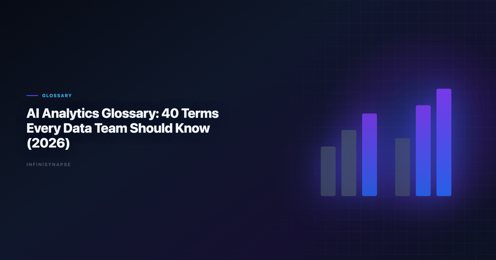

> **Byline:** InfiniSynapse Data Team  
> **Last updated:** 2026-06-09  
> *We build InfiniSynapse, an AI-native analytics platform. This data analysis glossary is maintained from hands-on implementation work with analyst teams, platform owners, and procurement stakeholders.*

Last updated: 2026-06-09

**Meta Description**: Data Analysis Glossary in 2026: practical workflow patterns, governance controls, and FAQ for data teams. Includes worked examples, criteria, and steps.

**Slug**: `/blog/ai-analytics-glossary`

**Target keyword**: `data analysis glossary`
**Secondary**: `ai analytics terms`, `analytics vocabulary`, `data agent definitions`

---

## Table of Contents

1. [TL;DR](#tldr)
2. [Key Definition](#key-definition)
3. [How to Use This Glossary](#how-to-use-this-glossary)
4. [44 Core Terms](#44-core-terms)
5. [Practical Adoption Checklist](#practical-adoption-checklist)
6. [How Teams Apply This Glossary in Daily Work](#how-teams-apply-this-glossary-in-daily-work)
7. [Governance Model for Maintaining a Shared Vocabulary](#governance-model-for-maintaining-a-shared-vocabulary)
8. [Measurement: Is the Glossary Working?](#measurement-is-the-glossary-working)
9. [Team Enablement Activities](#team-enablement-activities)
10. [Production Debugging Notes](#production-debugging-notes)
11. [How to Use This Reference in Production](#how-to-use-this-reference-in-production)
12. [Review Cadence and Maintenance](#review-cadence-and-maintenance)
13. [Operational Readiness Notes](#operational-readiness-notes)
14. [Frequently Asked Questions](#frequently-asked-questions)
15. [Conclusion](#conclusion)
---

## TL;DR

Most analytics teams struggle with AI adoption because they use the same words differently. A shared `data analysis glossary` solves this by giving teams stable definitions for workflows, metrics, governance controls, and quality expectations. Foundational warehouse concepts—grain, dimensions, and conformed metrics—remain essential; [Supabase documentation](https://supabase.com/docs) is a concise refresher for reviewers validating generated SQL.

This `data analysis glossary` includes 44 practical terms used in AI-native analytics, grouped by domain so teams can align faster. It is designed for analysts, engineering partners, and decision makers who need consistent language before scaling new tooling. Teams that maintain this **data analysis glossary** quarterly report fewer metric-definition disputes in cross-functional reviews. Read this `data analysis glossary` with [What Is a Data Agent?](/blog/what-is-a-data-agent) to tie terminology to execution.

> **Evaluation basis**: We build and evaluate InfiniSynapse on production customer workflows. Governance, adoption, and security context is cited inline throughout this guide—not in a standalone reference list.

## Key Definition
Public-sector buyers should review [Google BigQuery documentation](https://cloud.google.com/bigquery/docs) when procuring analytics agents.

> **Key Definition:** A `data analysis glossary` is a curated set of shared terms that standardizes how teams define data workflows, quality checks, risk controls, and decision outputs.

Production rollouts should align access and review controls with the [NIST SP 800-53 security controls](https://csrc.nist.gov/pubs/sp/800/53/r5/final), especially when recurring queries touch live schemas.

## How to Use This Glossary

Use this **data analysis glossary** as a living reference, not a one-time PDF. Each term should link to an owner, a review date, and the workflows where the definition actually applies.

1. Add critical terms to onboarding for analysts and managers.
2. Link each term to an owner and a review date.
3. Review term definitions quarterly when workflows change.
4. Use definitions as conflict-resolution baseline during reviews.

**Category Map.**

| Category | Term IDs | Typical users |
|---|---|---|
| Workflow and architecture | 1-8 | Analytics leads, platform teams |
| Data quality and measurement | 9-16 | Analysts, analytics engineers |
| Reasoning and experimentation | 17-24 | Product analysts, data scientists |
| Governance and risk | 25-32 | Governance, security, procurement |
| Operations and reuse | 33-44 | Team leads, enablement owners |

## 44 Core Terms
Multi-source connector design should follow [Spider NL2SQL benchmark](https://yale-lily.github.io/spider) so domain boundaries and metric contracts stay explicit as scope grows.

**Workflow and Architecture Terms.** 1. **AI-native data analysis**  
Definition: Analysis workflows where AI is embedded into framing, retrieval, validation, and communication loops. Why it matters: Defines a workflow model, not just a tool feature.

2. **Data agent**  
Definition: A system that executes multi-step analytics tasks with memory, checks, and auditable intermediate states. Why it matters: Clarifies difference between chat interaction and workflow execution.

3. **Agentic analytics**  
Definition: Analytics operating style where autonomous or semi-autonomous agents handle repeatable analysis steps. Why it matters: Helps teams discuss automation scope realistically.

4. **Task graph**  
Definition: Ordered representation of workflow steps, dependencies, and validation checkpoints for a given analysis job. Why it matters: Improves traceability and failure diagnosis.

5. **Workflow orchestration**  
Definition: Coordinating tools, prompts, data sources, and checks into one repeatable execution path. Why it matters: Core requirement for scalable AI-assisted analytics.

6. **Semantic layer**  
Definition: Central definition layer for metrics and business entities across tools. Why it matters: Prevents conflicting KPI interpretations.

7. **Metric contract**  
Definition: Versioned specification of formula, grain, exclusions, and acceptable data sources for a metric. Why it matters: Reduces metric drift and trust erosion.

8. **Analysis handoff package**  
Definition: Structured transfer artifact with assumptions, code links, unresolved risks, and next actions. Why it matters: Supports continuity across people and shifts. **Data Quality and Measurement Terms**

9. **Data freshness window**  
Definition: Maximum acceptable age of data used for analysis. Why it matters: Guards against stale insight errors.

10. **Schema drift**  
Definition: Unexpected structural change in source data that may break assumptions or pipelines. Why it matters: Common silent failure mode in automated workflows.

11. **Null handling policy**  
Definition: Rules for imputing, excluding, or flagging missing values by context. Why it matters: Missing-value choices can materially alter conclusions.

12. **Join explosion**  
Definition: Row multiplication caused by improper join keys or grain mismatch. Why it matters: Distorts aggregates and trend interpretation.

13. **Reconciliation check**  
Definition: Independent recomputation of the same metric through alternate logic or source paths. Why it matters: Strong confidence signal in quality reviews.

14. **Benchmark dataset**  
Definition: Trusted reference dataset used to compare or validate generated outputs. Why it matters: Enables objective quality scoring.

15. **Tolerance band**  
Definition: Allowed variance range between reruns or between systems before escalation. Why it matters: Converts "close enough" into policy.

16. **Confidence statement**  
Definition: Explicit declaration of certainty level, uncertainty drivers, and evidence quality. Why it matters: Improves decision risk awareness.

### Reasoning and Experimentation Terms

17. **Hypothesis matrix**  
Definition: Structured list of hypotheses with supporting and contradicting evidence. Why it matters: Keeps diagnosis evidence-led rather than narrative-led.

18. **Counterfactual baseline**  
Definition: Estimated outcome for the same context if an intervention had not occurred. Why it matters: Essential for causal interpretation.

19. **Variance decomposition**  
Definition: Breaking total change into attributable components such as volume, mix, and price. Why it matters: Prioritizes actionable levers.

20. **Sensitivity analysis**  
Definition: Testing how output changes when key assumptions are varied. Why it matters: Reveals fragility in recommendations.

21. **Leading indicator**  
Definition: Metric that moves before a target business outcome changes. Why it matters: Supports proactive decisions.

22. **Lagging indicator**  
Definition: Metric that confirms an outcome after it has occurred. Why it matters: Useful for validation, not early warning.

23. **Practical significance**  
Definition: Real-world impact magnitude independent of statistical significance. Why it matters: Prevents overreacting to tiny but statistically significant effects.

24. **Threats to validity**  
Definition: Known factors that can weaken confidence in analytical conclusions. Why it matters: Forces disciplined caveat communication.

### Governance and Risk Terms

25. **Source allowlist**  
Definition: Approved set of data sources that workflows are permitted to query. Why it matters: Limits unauthorized or low-trust data usage.

26. **Role-based access control (RBAC)**  
Definition: Permission model that restricts data and actions by user role. Why it matters: Baseline control for enterprise analytics.

27. **Data perimeter**  
Definition: Policy boundary defining where data can flow and be processed. Why it matters: Central to compliance and security architecture.

28. **Audit trail**  
Definition: Immutable record of prompts, transformations, outputs, and approvals. Why it matters: Required for investigation and compliance review.

29. **Policy-as-code**  
Definition: Governance rules encoded as executable checks in workflow systems. Why it matters: Increases consistency and reduces manual enforcement burden.

30. **Escalation threshold**  
Definition: Predefined limit that triggers manual review or workflow stop. Why it matters: Prevents low-confidence outputs from reaching decisions.

31. **Data residency requirement**  
Definition: Legal or contractual requirement for where data is stored and processed. Why it matters: A key procurement and architecture constraint.

32. **Model risk tier**  
Definition: Classification of workflow risk based on business impact and failure tolerance. Why it matters: Determines review rigor and control depth.

### Operations and Reuse Terms

33. **Prompt template library**  
Definition: Managed collection of reusable prompt patterns with ownership and versioning. Why it matters: Reduces repeated drafting work.

34. **Template owner**  
Definition: Person accountable for updates, review cycles, and quality metrics of a template. Why it matters: Avoids orphaned assets.

35. **Versioned playbook**  
Definition: Change-tracked workflow guidance linked to template versions and outcomes. Why it matters: Supports reproducibility and onboarding.

36. **Rerun consistency**  
Definition: Degree to which repeated executions produce equivalent outputs within policy tolerance. Why it matters: Core trust metric for AI-assisted systems.

37. **Correction loop rate**  
Definition: Percentage of outputs requiring major rework after review. Why it matters: Operational quality signal.

38. **Reuse rate**  
Definition: Share of analyses using approved reusable assets rather than ad-hoc workflows. Why it matters: Indicates process maturity.

39. **Time to first draft**  
Definition: Elapsed time from request intake to first reviewable output. Why it matters: Measures speed improvements from automation.

40. **Postmortem learning loop**  
Definition: Process for comparing expected vs observed outcomes and updating workflows. Why it matters: Drives compounding improvement.

41. **Knowledge card**  
Definition: Compact artifact storing domain assumptions, validated logic, and caveat patterns for reuse. Why it matters: Captures hard-won analyst context.

42. **Decision log**  
Definition: Record of recommendation, rationale, confidence, and business outcome. Why it matters: Enables accountability and retrospective analysis.

43. **Operational readiness score**  

44. **Adoption debt**  
Definition: Hidden cost created when teams deploy tools without process, ownership, or shared definitions. Why it matters: Explains why short-term speed often becomes long-term friction.

## Practical Adoption Checklist
The [NIST AI Risk Management Framework](https://www.nist.gov/itl/ai-risk-management-framework) adds dirty-schema realism that Spider-only leaderboards under-weight in production.

|---|---|---|
| Publish glossary in internal docs and analytics repo | Analytics lead | Once + updates |
| Link term IDs in templates and scorecards | Enablement owner | Ongoing |
| Review top 20 high-risk terms for drift | Governance lead | Quarterly |
| Add glossary quiz to onboarding | Team manager | Each cohort |
| Track confusion incidents by term | Operations lead | Monthly |

## How Teams Apply This Glossary in Daily Work

### Weekly analytics review

In weekly review meetings, teams can open the `data analysis glossary` and quickly align on terms like "confidence statement," "tolerance band," and "reconciliation check." This reduces debate caused by hidden definition differences. The move from dashboard-first BI to augmented workflows—described in [Microsoft data architecture guidance](https://learn.microsoft.com/en-us/azure/architecture/data-guide/)—frames how teams should evaluate tooling here. Adoption benchmarks in the [BIRD NL2SQL benchmark](https://bird-bench.github.io/) track the same shift from pilot demos to governed analytics loops we see in customer rollouts. [Anthropic research](https://www.anthropic.com/research) shows how warehouse-native semantic layers change NL2SQL grounding expectations for analyst-facing products. Operational maturity for analytics agents aligns with the [ISO/IEC 42001 AI management](https://www.iso.org/standard/81230.html), especially around monitoring, rollback, and ownership.

The credential, preflight, and SQL-trace pattern above also applies to Agent—see [What Is a Data Agent](/blog/data-agent-faq) for source-specific steps.

### Incident triage

During incident triage, a `data analysis glossary` gives teams a shared language for escalation. Instead of saying "the result looks wrong," teams can specify whether they observed schema drift, a join explosion, or a confidence downgrade breach.

### Procurement and vendor evaluation

Procurement teams use the `data analysis glossary` to write precise capability requirements. This prevents ambiguous RFP language and improves scorecard consistency.

### Onboarding new analysts

### Cross-functional planning

## Governance Model for Maintaining a Shared Vocabulary

### Ownership structure

| Role | Responsibility |
|---|---|
| Glossary owner | Approves definition changes and resolves conflicts |
| Domain contributors | Propose updates for specific workflow categories |
| Review board | Validates governance and policy implications |
| Enablement lead | Integrates glossary updates into training assets |

### Change request format

1. Current definition and proposed revision. 2. Reason for change (policy shift, workflow evolution, recurring confusion). 3. Example of impact on templates or scorecards. 4. Approval owner and effective date. Regulated rollouts often anchor access reviews to [AWS Well-Architected Machine Learning Lens](https://docs.aws.amazon.com/wellarchitected/latest/machine-learning-lens/welcome.html) when credentials, retention policies, and audit logs are in scope.

### Versioning rules

- Minor version for clarifications. - Major version for meaning changes affecting workflow behavior. - Deprecated tags for terms being retired. Version discipline prevents silent semantic drift.

## Measurement: Is the Glossary Working? | Indicator | Healthy signal |
|---|---|
| Definition-related review disputes | Declining trend |
| Onboarding time to independent output | Shorter over time |
| Glossary references in templates | Increasing adoption |
| Procurement clarification loops | Fewer iterations |
| Governance incident root cause tied to term confusion | Near zero |

## Team Enablement Activities

- Monthly 30-minute vocabulary calibration session. - Term-of-the-month deep dive tied to recent project outcomes. - Peer review checklist that references data analysis glossary IDs. - Quarterly cleanup of low-usage or duplicate definitions. These activities keep language quality connected to delivery quality.

---

## Operating and Maintaining the Glossary

## Frequently Asked Questions

### Why does a analytics matter if we already have style guides?

Style guides shape writing quality, while a analytics aligns analytical logic, governance decisions, and operational controls. When this topic joins a multi-source stack, align connector scope and review gates using [How to Evaluate an AI Data Analyst Tool](/blog/how-to-evaluate-ai-data-analyst).

### How many terms should it include at launch?

Start with 25-40 high-impact terms, then expand as your workflows and governance complexity grow.

### Who should own a analytics?

Usually an analytics lead with input from platform, governance, and business stakeholders to keep definitions practical.

### How often should it be reviewed?

Revisit it quarterly and after any major schema, metric, or policy change, so definitions never drift from how the data is actually modeled and governed. Teams standardizing governance across sources often keep [AI Data Analysis Prompts](/blog/ai-data-analysis-prompts) beside this runbook for Prompt handoffs.

---

## Conclusion

A maintained `data analysis glossary` is a practical trust layer for AI-native analytics. It reduces ambiguity, speeds onboarding, and improves cross-functional decisions because teams discuss evidence using the same definitions. Treat this **data analysis glossary** as operating infrastructure, not documentation hygiene, and review the shared **data analysis glossary** each quarter when schemas or KPI contracts change.