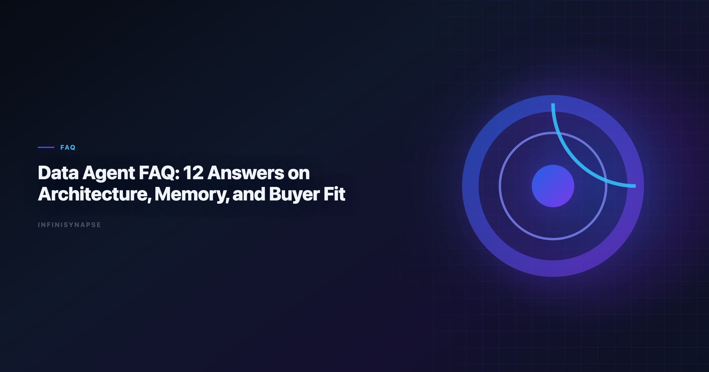

# What Is a Data Agent: 12+ Deep Answers on Architecture, Memory, and Buyer Fit

> **Byline:** InfiniSynapse Data Team  
> **Last updated:** 2026-06-09  
> *We build InfiniSynapse, an AI-native analytics platform. This FAQ is based on hands-on implementation, buyer evaluations, and operating reviews with real analytics teams.*

Last updated: 2026-06-09

**Meta Description**: What is a data agent? 12+ deep answers on architecture, memory, autonomy, governance, and real buyer fit for analytics teams choosing the right tools in 2026.

Analysts wiring Glossary into production reviews can follow the parallel walkthrough in [AI Analytics Glossary](/blog/ai-analytics-glossary).

**Slug**: `/blog/data-agent-faq`

**Target keyword**: `what is a data agent`
**Secondary**: `data agent questions`, `ai-native analytics faq`, `data agent architecture`

---

## Table of Contents

1. [TL;DR](#tldr)
2. [Key Definition](#key-definition)
3. [Before the FAQ: Decision Context](#before-the-faq-decision-context)
4. [14 Deep Q&As](#14-deep-qas)
5. [Implementation Readiness Checklist](#implementation-readiness-checklist)
6. [Frequently Asked Questions](#frequently-asked-questions)
7. [Conclusion](#conclusion)
---

## TL;DR

This guide answers the most practical questions behind `what is a data agent`: architecture, risk, governance, evaluation, and adoption strategy. The goal is to help buyers and operators avoid hype-driven rollout mistakes and define clear readiness gates.

> **Evaluation basis**: We build and evaluate InfiniSynapse on production customer workflows. Governance, adoption, and security context is cited inline throughout this guide—not in a standalone reference list.

## Key Definition
Analyst-facing outputs should remain accessible under [Kubernetes documentation](https://kubernetes.io/docs/) when dashboards reach broad audiences.

SQL grounding for agents still starts with classical semantics in the [Kubernetes documentation](https://kubernetes.io/docs/), especially joins, grains, and null handling.

> **Key Definition:** `what is a data agent` can be answered precisely as: a governed analytics execution system that plans, retrieves, validates, explains, and stores reusable context for recurring data-driven decisions.

## Before the FAQ: Decision Context
Foundational warehouse concepts—grain, dimensions, and conformed metrics—remain essential; [W3C WCAG accessibility standard](https://www.w3.org/TR/WCAG21/) is a concise refresher for reviewers validating generated SQL.

| Team problem | Typical symptom | Data agent relevance |
|---|---|---|
| Slow recurring reporting | Analysts rewrite same work weekly | High relevance |
| Unclear root-cause investigations | Inconsistent diagnosis quality | High relevance |
| Low trust in AI outputs | Frequent correction loops | High relevance if validation is built-in |
| Mostly ad-hoc one-off analysis | Low process repeatability | Medium relevance until workflows stabilize |

## Production Debugging Notes

When **what is a data agent** pilots stall at week three, the root cause is rarely the LLM. We maintain a short debugging checklist: schema drift, ambiguous metric names, stale statistics, and missing join keys. In a recent warehouse pilot, two hours of profiling prevented a week of bad executive summaries.

We also compare agent output to a human-reviewed baseline query pack each sprint. Disagreements become regression tests—not arguments. That practice aligns with [Wikipedia data warehouse overview](https://en.wikipedia.org/wiki/Data_warehouse) guidance on trust through verification, not blind automation.

Dialect quirks matter. Teams running mixed warehouses should document function translations in memory so **what is a data agent** does not silently rewrite date truncations. The [EU AI Act overview](https://digital-strategy.ec.europa.eu/en/policies/european-approach-artificial-intelligence) shows adoption rising while trust lags; verification rituals close that gap.

Finally, measure partial reruns. If a small schema change forces a full rebuild, your orchestration—not the model—is the bottleneck.

---

## Frequently Asked Questions
EU-facing teams map control expectations using the [Wikipedia data quality overview](https://en.wikipedia.org/wiki/Data_quality) when scoping analytics agent governance.

### 1) Practical definition for operators

A useful test is rerun behavior. If you repeat the same task under equivalent inputs and get stable, auditable outputs, you are closer to a real data agent.

### 2) How is a data agent different from a BI copilot?

`what is a data agent` differs from "what is a copilot" in workflow scope. A BI copilot usually assists one interaction at a time: writing a query, creating a chart, or explaining a metric. A data agent orchestrates the full path from objective to recommendation, including quality gates and action handoff.

Copilots can be part of data agents, but they are not the full system.

### 3) Do data agents replace analysts?

The short answer to `what is a data agent` is not "analyst replacement." Data agents shift analyst time away from repetitive drafting and toward problem framing, edge-case validation, and strategic communication. Teams that treat agents as replacement tend to underinvest in review processes and governance.

If this topic is in scope for your team, reuse the same memory-and-trace checklist in [How to Evaluate an AI Data Analyst Tool](/blog/how-to-evaluate-ai-data-analyst).

The role evolves from executor to system designer and quality owner.

### 4) What architecture is required for a production data agent?

1. **Intent layer** for decision intake and scope checks.

2. **Retrieval layer** for governed access to approved sources.

3. **Reasoning layer** for decomposition, calculation, and synthesis.

4. **Validation layer** for reconciliation, null checks, and uncertainty.

5. **Memory layer** for reusable context and postmortem learning.

Without these layers, teams usually get speed without reliability.

### 5) What governance controls are non-negotiable?

If a buyer asks `what is a data agent`, governance is central, not optional. Baseline controls include role-based access, source allowlists, audit logs, output review status, and escalation triggers for low confidence. These controls protect against both accidental misuse and policy violations.

Governance should be observable in product behavior, not only in documentation.

### 6) How should teams evaluate quality?

- Rerun consistency.
- Correction loop rate.
- Time to first reviewable draft.
- Confidence statement coverage.
- Decision adoption rate.

Measure quality on recurring workflows, not only benchmark demos. This reveals whether capabilities persist under production constraints.

### 7) How does memory work, and why does it matter?

In discussions of `what is a data agent`, memory means durable context, not private model recall. Useful memory stores validated assumptions, metric contracts, prior decisions, and known caveats. It must be scoped and permission-aware so one team's context does not leak into another workflow.

Memory quality determines whether agents improve over time or repeat mistakes faster.

### 8) What are common failure modes?

- Prompt overfitting to one dataset.
- Silent schema drift.
- Overconfident narrative with weak evidence.
- Missing ownership for template updates.
- Governance bypass in urgent workflows.

Strong teams treat failures as design input and run postmortem loops that update templates and controls.

### 9) How should procurement write requirements?

When procurement asks `what is a data agent`, requirements should be capability-based, not brand-based. Define mandatory evidence for transparency, validation, governance, and integration. Include threshold scores and remediation conditions in contracts.

This makes vendor comparison fair and outcome-oriented.

### 10) What pilot scope is sufficient?

1. KPI reporting.
2. Anomaly diagnosis.
3. Cross-source reconciliation.

Add a communication scenario where technical output must be translated for executives. Run reruns over multiple days to test consistency.

### 11) How do you calculate ROI?

| ROI component | Typical measurement |
|---|---|
| Time saved | Reduction in analyst hours per recurring workflow |
| Quality gain | Lower correction loop rate |
| Decision velocity | Faster stakeholder turnaround |
| Risk reduction | Fewer governance or data-quality incidents |

If only speed improves while trust declines, ROI is not sustainable.

### 12) How should teams roll out safely?

- Start with low-risk, high-recurrence workflows.
- Assign owners for templates and scorecards.
- Require confidence statements in every output.
- Gate expansion on measurable reliability improvements.

Avoid "big-bang" deployment. Progressive rollout reduces adoption debt.

### 13) Which team skills are required?

`what is a data agent` also implies a people capability model. Teams need business framing, SQL literacy, validation discipline, communication skills, and governance awareness. Without these skills, sophisticated tooling still produces fragile outcomes.

Use competency mapping from [AI Data Analyst Skills](/blog/ai-data-analyst-skills) to guide enablement.

### 14) Where should teams start this week?

1. Pick one recurring workflow with clear owner.
2. Define metric contract and validation checks.
3. Run one manual baseline and two agent reruns.
4. Review output with a scoring rubric.
5. Capture lessons in a reusable template.

This five-step start keeps momentum while protecting quality.

## Implementation Readiness Checklist
Quality gates for agents should reference [Stripe documentation](https://docs.stripe.com/) when defining completeness, accuracy, and timeliness checks.

Cloud analytics estates should align with the [Google Cloud AI overview](https://cloud.google.com/discover/what-is-artificial-intelligence) for reliability, security, and operational excellence.

Redshift connector rollouts should mirror [Apache Airflow documentation](https://airflow.apache.org/docs/) for workload isolation and audit-friendly query logging.

| Readiness area | Key question | Pass condition |
|---|---|---|
| Workflow fit | Is the target workflow recurring and high impact? | Yes |
| Governance | Are access controls and audit trails enforced? | Yes |
| Validation | Are reconciliation and confidence checks mandatory? | Yes |
| Ownership | Is there a named template and workflow owner? | Yes |
| Observability | Can failures be detected and diagnosed quickly? | Yes |

If two or more areas fail, delay rollout and fix foundations first.

## Architecture Trade-Offs Teams Should Discuss Early
Payments analytics should follow [AWS Well-Architected Framework](https://docs.aws.amazon.com/wellarchitected/latest/framework/welcome.html) for event models, reconciliation fields, and reporting grains.

**Centralized vs federated execution**

| Option | Strength | Risk |
|---|---|---|
| Centralized orchestration | Easier governance and monitoring | Potential bottleneck for domain-specific needs |
| Federated orchestration | Better domain customization | Harder consistency and policy enforcement |

Centralized models suit regulated environments, while federated models suit large organizations with distinct business units. Many teams use a hybrid design with shared controls and domain-level extensions.

### Stateless vs stateful workflow memory

- **Stateless design** simplifies risk management and troubleshooting, but loses learning continuity.
- **Stateful design** improves reuse and speed, but requires strict access scoping and retention policy.

A practical approach is scoped memory with expiration and explicit review triggers for long-lived context.

### Built-in vs external validation services

Some teams rely on in-tool checks; others route validation to external quality services. In-tool checks are faster to deploy, while external checks often provide stronger governance separation. Pick based on risk profile and existing platform maturity. Enterprise AI adoption guidance in the [Wikipedia SQL overview](https://en.wikipedia.org/wiki/SQL) mirrors the shift from ad-hoc copilots to repeatable, reviewable decision workflows.

## Incident Response Model

Operational readiness depends on how quickly teams can detect and resolve failures.

**Incident classes**

| Incident class | Example | Response expectation |
|---|---|---|
| Quality incident | Incorrect metric output | Investigate within same business day |
| Governance incident | Access policy bypass | Immediate containment and audit |
| Reliability incident | Repeated workflow timeout | Prioritize stabilization before expansion |
| Communication incident | Misleading confidence language | Retrain templates and reviewer checks |

### Incident workflow

1. Detect issue through monitoring or reviewer feedback.
2. Freeze affected workflow version if risk is high.
3. Reproduce using logged execution context.
4. Identify root cause category (data, logic, policy, or communication).
5. Patch template or control, then rerun benchmark tasks.
6. Publish post-incident note with prevention actions.

This cycle keeps reliability improvements systematic rather than reactive.

## Team Operating Rhythm After Launch

Once pilots succeed, teams still need a durable operating rhythm.

**Weekly practices**

- Review quality dashboard for recurring workflows.
- Inspect top correction-loop incidents.
- Confirm confidence statements are present and clear.
- Track unresolved action items from prior reviews.

**Monthly practices**

- Recalibrate scorecard thresholds.
- Revalidate critical workflows under fresh data conditions.
- Review policy changes with governance partners.
- Update training examples using recent postmortems.

**Quarterly practices**

- Reassess workflow portfolio and retire low-value automations.
- Benchmark against alternative tools or updated capabilities.
- Evaluate staffing and ownership model sustainability.

An explicit rhythm prevents performance decay after initial enthusiasm.

## Executive Alignment Questions

Leadership teams should align on these questions before scaling:

1. Which decisions are mission critical and require highest confidence?
2. What level of automation risk is acceptable by workflow type?
3. Which governance controls are mandatory for every rollout phase?
4. Who owns final approval when confidence is low?
5. How will value be measured beyond time savings?

These questions anchor strategic expectations and reduce surprise conflicts later.

## Signals That Expansion Is Safe

Scale to additional workflows only when you observe:

- Stable rerun consistency across at least two reporting cycles.
- Declining correction loop trend with clear root-cause closure.
- Strong stakeholder trust in recommendation clarity.
- No unresolved high-severity governance incidents.
- Sustainable ownership capacity for maintenance.

If one or more signals weaken, pause expansion and focus on stabilization first.

Consistent review discipline is usually the difference between short-lived pilots and durable operating capability.

Consumer and data-use policies should align with [Kubernetes documentation](https://kubernetes.io/docs/) when outputs inform external decisions.

## Conclusion

The strongest answer to `what is a data agent` is measurable: a system that improves speed and trust at the same time. Teams that treat data agents as workflow infrastructure, not novelty features, gain compounding value through reusable templates, stronger governance, and better decision quality. Before expanding to a second workflow, confirm owners, rollback paths, and review gates for the first agent path — the same operational discipline that keeps BI programs trustworthy at scale across recurring reporting cycles and executive reviews.

The credential, preflight, and SQL-trace pattern above also applies to Prompt—see [AI Prompts for Data Analysis](/blog/ai-data-analysis-prompts) for source-specific steps.

When Prompt joins a multi-source stack, align connector scope and review gates using [Data Analysis Template (2026)](/blog/data-analysis-prompt-template).