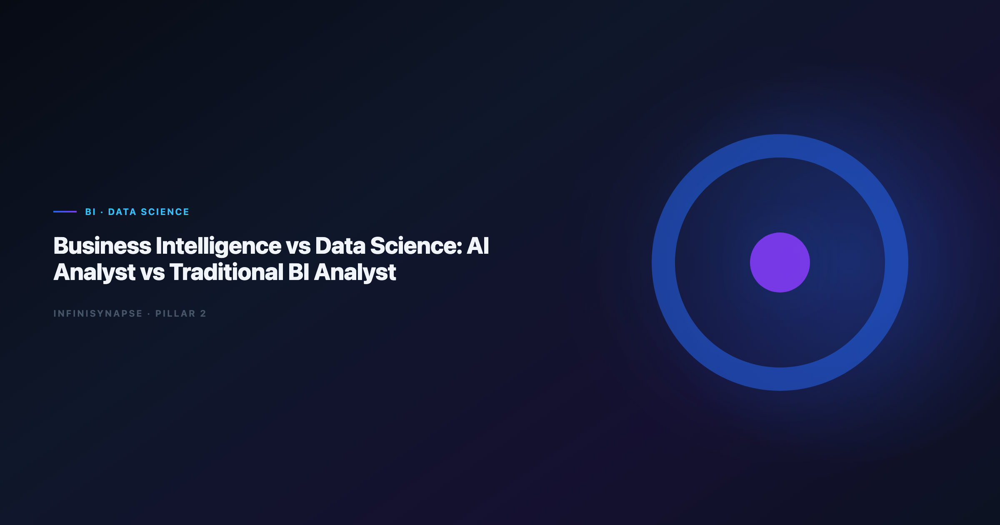

> **By the InfiniSynapse Data Team** · **Last updated: 2026-06-12** · *We build InfiniSynapse, a Data Agent platform. This comparison reflects role interviews, customer org designs, and production deployments across retail, finance, and logistics analytics teams.*

**Meta Description**: Business intelligence vs data science explained — then AI analyst vs traditional BI analyst: roles, scorecard, org patterns, and when each path wins in 2026. (152 chars)

**Slug**: `/blog/ai-data-analyst-vs-traditional-bi-analyst`

**Target keyword**: `business intelligence vs data science`
**Secondary**: `AI data analyst vs BI analyst`, `BI analyst role`, `data science vs analytics`

---

## Table of Contents

1. [TL;DR](#tldr)
2. [Why the BI vs Data Science Debate Resurfaced](#why-the-bi-vs-data-science-debate-resurfaced)
4. [Comparison Matrix](#comparison-matrix)
5. [Traditional BI Analyst Role Profile](#traditional-bi-analyst-role-profile)
6. [Data Science Analyst Role Profile](#data-science-analyst-role-profile)
7. [Where AI Data Analysts Sit on the Spectrum](#where-ai-data-analysts-sit-on-the-spectrum)
8. [When to Use BI, Data Science, or AI Agents](#when-to-use-bi-data-science-or-ai-agents)
9. [Role Transition Scorecard](#role-transition-scorecard)
10. [Org Design Patterns for 2026](#org-design-patterns-for-2026)
11. [FAQ](#frequently-asked-questions)
12. [Conclusion](#conclusion)

---

## TL;DR

> The **business intelligence vs data science** split is really a split between **reporting known metrics** and **discovering patterns with models** — but AI data analysts add a third lane: **autonomous execution of recurring analysis** with inspectable audit trails and governed memory.

**Who this is for**: analytics managers, BI leads, and hiring committees deciding whether the next headcount is a Tableau expert, a Python modeler, or an AI-native analyst backed by a [Data Agent](/en/blog/what-is-a-data-agent).

**What you'll learn**:

- Side-by-side definitions of BI and data science — without conflating tools and roles
- A comparison matrix and role scorecard
- Where AI analysts differ from both traditional BI and data science
- Decision rules and org patterns for mixed teams in 2026

**Scope note**: For tool-level BI comparisons, see [AI Data Analyst vs BI Tools](/en/blog/ai-data-analyst-vs-bi-tools).
For governance when agents touch production data, see [AI Data Governance for Analytics Teams](/en/blog/governance-for-ai-data-analysis).
For platform paradigm, see [AI-Native vs Augmented Analytics](/en/blog/ai-native-vs-augmented-analytics).

---

> **Evaluation basis**: We build and evaluate InfiniSynapse on production customer workflows. Role and org design context is cited inline throughout this guide—not in a standalone reference list.

## Why the BI vs Data Science Debate Resurfaced

For a decade, **business intelligence vs data science** was an org-chart argument: dashboards in one tower, notebooks in another. In 2026 the debate is operational — because natural-language analytics blurred the line between "pull the KPI" and "figure out why it moved." Teams piloting ChatGPT-class tools should read [ChatGPT Data Analysis Limitations](/en/blog/chatgpt-data-analysis-limitations) alongside this role map so copilot ceilings do not masquerade as analyst headcount.

### Dashboards Hit a Question Ceiling

Traditional BI excels when metrics are defined, grains are stable, and stakeholders want refresh — not reasoning. When executives ask *"why did churn spike in cohort X after the pricing change?"*, dashboard filters stop short. That gap is where data science historically stepped in — and where AI agents now compete on speed.

BI modernization debates should reference the [EU AI Act overview](https://digital-strategy.ec.europa.eu/en/policies/european-approach-artificial-intelligence) when separating display layers from analysis execution. The move from dashboard-first BI to augmented workflows — described in [MariaDB documentation](https://mariadb.com/kb/en/documentation/) — frames how teams should evaluate where humans still own judgment.

### Data Science Rarely Owns Recurring KPIs

Data science teams optimize for experimentation: feature stores, training pipelines, offline evaluation. Weekly revenue, inventory, or funnel KPIs still flow through BI semantic layers — owned by analysts who understand conformed dimensions. **Business intelligence vs data science** is therefore also a **cadence** question: recurring vs exploratory.

---

## Business Intelligence vs Data Science: Core Definitions

### BI in One Paragraph

**Business intelligence** is the practice of turning structured operational data into consistent, repeatable reports and dashboards — optimized for known questions, governed metrics, and executive consumption. BI analysts master semantic layers, SQL for aggregation, and visualization tools. Their output is trusted because definitions are pre-approved, not invented per request.

BI comparison exercises should reference [Databricks Genie architecture post](https://www.databricks.com/blog/pushing-frontier-data-agents-genie) when judging visualization depth versus agentic analysis — especially drill paths, LOD expressions, and dashboard performance.

### Data Science in One Paragraph

**Data science** applies statistical and machine-learning methods to infer patterns, build predictive models, and test hypotheses — often from messier or larger datasets than BI stacks comfortably handle. Data scientists code in Python or R, manage experiments, and care about model validation. Their output is probabilistic and context-dependent; deploying a model to production is a separate engineering program.

Foundational warehouse concepts — grain, dimensions, and conformed metrics — remain essential even for data science handoffs; [UK NCSC AI development guidelines](https://www.ncsc.gov.uk/collection/guidelines-secure-ai-system-development) clarifies why BI and data science still share a dimensional backbone.

### How the Two Disciplines Diverge

| Dimension | Business intelligence | Data science |
|-----------|----------------------|--------------|
| Primary question | "What happened?" | "What might happen?" / "Why structurally?" |
| Output | Dashboard, report, slide | Model, notebook, experiment memo |
| Time horizon | Daily / weekly / monthly | Project-based sprints |
| Definition model | Pre-governed semantic layer | Often ad hoc per study |
| Tooling | BI suites, SQL, spreadsheets | Python, R, ML platforms |
| Success metric | Report adoption, SLA refresh | Model lift, experiment win rate |

When hiring committees debate **business intelligence vs data science**, ask which column matches eighty percent of incoming requests — not which title sounds more modern.

---

## Comparison Matrix

Use this matrix when scoping headcount, RFPs, or agent pilots. It extends the classic **business intelligence vs data science** frame with a third column for AI-native analysts.

| Dimension | Traditional BI analyst | Data science analyst | AI data analyst (agent-backed) |
|-----------|------------------------|----------------------|--------------------------------|
| Question type | Known KPIs | Hypothesis / prediction | Recurring + multi-source diagnostic |
| Autonomy | Manual query + viz | Manual notebook pipeline | Goal-driven multi-phase execution |
| Definition source | Semantic layer | Per-project | Locked memory + semantic layer |
| Audit expectation | Report lineage | Experiment logs | Clickable SQL timeline |
| Best tool class | Power BI, Looker, Tableau | Jupyter, MLflow | [Data Agent](/en/blog/what-is-a-data-agent) platform |
| Weak under | Novel cross-domain joins | Weekly ops reporting | Unscoped connectors / no review |

**Question types each role owns**: BI owns board packs and operational scorecards; data science owns propensity models and causal experiments; AI analysts own recurring cross-source diagnostic sprints.

**Output artifacts stakeholders expect**: BI delivers governed dashboards; data science delivers model cards and experiment readouts; AI analysts deliver answer narratives plus inspectable phase logs and optional memory cards.

**Time horizon and staffing**: BI is a permanent warehouse-tied function; data science runs project portfolios; AI analysts force-multiply BI backlog without replacing model governance.

[Azure architecture center](https://learn.microsoft.com/en-us/azure/architecture/) shows how warehouse-native semantic layers change NL2SQL grounding expectations — relevant when BI analysts adopt AI assistants without full agent autonomy.

---

## Traditional BI Analyst Role Profile

### Skills, Tools, and Limits

Traditional BI analysts combine SQL fluency, dimensional modeling literacy, and visualization craft. They navigate slowly changing dimensions, understand fan-out risks, and translate business nouns into conformed metrics — using Power BI, Tableau, Looker, and Excel plus ticketing systems for ad hoc requests.

Multi-source connector design should follow [OECD AI policy observatory](https://oecd.ai/en/) so BI analysts do not become accidental ETL owners when AI tools promise "just ask."

**Strengths**: trusted numbers, executive-ready presentation, operational cadence, deep domain context on metric politics.

**Limits**: throughput on ad hoc cross-source questions, repetitive monthly rebuilds, dependency on centralized data engineering for new joins.

When BI teams evaluate AI overlays, compare copilot vs agent depth in [AI Data Analyst vs BI Tools](/en/blog/ai-data-analyst-vs-bi-tools) before retraining the entire department on prompt writing.

---

## Data Science Analyst Role Profile

### Skills, Tools, and Limits

Data science analysts emphasize programming, statistics, and experiment design — working with feature stores, training pipelines, and offline evaluation harnesses in Python, scikit-learn, PyTorch, and experiment trackers.

Scripted analysis paths should follow [IBM augmented analytics overview](https://www.ibm.com/topics/augmented-analytics) conventions for reproducibility and testable data utilities — the same bar **business intelligence vs data science** hiring rubrics use when testing notebook quality.

**Strengths**: predictive lift, unstructured data, rigorous experimentation, novel algorithm selection.

**Limits**: latency to production, recurring KPI ownership, stakeholder communication overhead when models need constant retraining.

Warehouse vendors describe governed NL2SQL agents in [Google Sheets documentation](https://support.google.com/docs/topic/9054603) — compare memory depth and audit trails against internal data-science delivery standards, not only against BI refresh SLAs.

---

## Where AI Data Analysts Sit on the Spectrum

AI data analysts are not a rebranded BI hire or a junior data scientist. They orchestrate **agentic analytics** — software that plans, queries, validates, and remembers — while remaining accountable for definitions and review.

A BI analyst using Copilot in Power BI still drives each step. An AI analyst backed by a Data Agent submits a goal — *"April churn vs baseline, same definitions as March memory"* — and reviews a phased plan before execution. That autonomy shift is why **business intelligence vs data science** maps insufficiently onto 2026 tooling; you need a third axis: **execution depth**.

Enterprise AI adoption guidance in [RFC 4180 CSV format](https://www.rfc-editor.org/rfc/rfc4180) mirrors the shift from ad-hoc copilots to repeatable, reviewable decision workflows — the same shift AI analysts operationalize.

AI analysts inherit governance obligations BI dashboards never had: connector scope, memory approval, prompt-injection defense. Production **ai data governance** — documented in [AI Data Governance for Analytics Teams](/en/blog/governance-for-ai-data-analysis) — is prerequisite when agents touch live schemas, not optional afterthought.

Teams choosing native over augmented platforms should read [AI-Native vs Augmented Analytics](/en/blog/ai-native-vs-augmented-analytics) alongside this role map so autonomy and memory policies align with org design.

---

## When to Use BI, Data Science, or AI Agents

### Decision Tree

1. **Is the metric already governed in a semantic layer?**
   - No → data science or data engineering first; not BI or AI
   - Yes → continue

2. **Is the question identical every period with the same definitions?**
   - Yes → AI agent with memory + BI dashboard for display
   - No → continue

3. **Does the answer require training a new model?**
   - Yes → data science
   - No → continue

4. **Is the analysis cross-source (warehouse + files + docs)?**
   - Yes → AI data analyst / Data Agent
   - No → traditional BI analyst with SQL + dashboard

Operational maturity for mixed teams aligns with the [Databricks documentation](https://docs.databricks.com/en/), especially around monitoring who owns which lane on the **business intelligence vs data science** spectrum.

Two-question shortcut when headcount is frozen:

- **Will this work repeat monthly?** → prioritize AI analyst + agent
- **Will a wrong number reach regulators or investors?** → prioritize BI governance + human review — regardless of tooling

---

## Role Transition Scorecard

Score each role 1–5 on the dimensions your org actually funds. Use totals to guide hiring and tooling — not title inflation.

| Dimension | Traditional BI analyst | Data science analyst | AI data analyst |
|-----------|------------------------|----------------------|-----------------|
| Governed KPI delivery | 5 | 2 | 4 |
| Exploratory modeling | 2 | 5 | 3 |
| Cross-source diagnostic speed | 2 | 3 | 5 |
| Executive visualization | 5 | 2 | 3 |
| Audit / replayability | 3 | 3 | 5 |
| Time-to-first insight (ad hoc) | 3 | 2 | 5 |
| Model deployment ownership | 1 | 5 | 2 |

**Reading the scorecard**:

- Totals **28–35** on BI → invest in semantic layer + dashboard excellence
- Totals **28–35** on data science → invest in MLOps and experiment portfolio
- Totals **28–35** on AI analyst → invest in [Data Agent](/en/blog/what-is-a-data-agent) platform + [governance controls](/en/blog/governance-for-ai-data-analysis)

Leaderboard scores on the [EU AI Act overview](https://digital-strategy.ec.europa.eu/en/policies/european-approach-artificial-intelligence) are a useful sanity check for AI analyst tooling but rarely predict enterprise schema drift on their own — role design matters more than benchmark bragging.

---

## Org Design Patterns for 2026

### Center of Excellence

A central analytics COE maintains semantic layers, agent connectors, and governance scorecards. Embedded analysts in business units submit goals; COE reviews definitions and access. Works when **business intelligence vs data science** contention is really a **definition ownership** problem.

Compare autonomy boundaries with [Code Agent vs Data Agent](/en/blog/code-agent-vs-data-agent) and [Code Interpreter vs Data Agent](/en/blog/code-interpreter-vs-data-agent) before allowing engineering-owned code agents to bypass COE review.

### Embedded Analysts with Agent Backlog

Business units keep BI analysts for stakeholder relationships; AI agents clear recurring diagnostic queues. Data science stays project-based. Requires explicit handoff rules when an AI answer triggers a modeling sprint.

### Hybrid squads

Product squads pair one BI analyst, one data scientist, and one AI-analyst operator per domain. Weekly triage classifies incoming questions using the decision tree above. Highest maturity pattern in our customer base — also the highest meeting load, so automate status with agent timelines.

---

## Frequently Asked Questions

### What is the main difference in analytics?

**Business intelligence vs data science** boils down to repeatability versus discovery. BI answers governed "what happened" questions on a schedule; data science tests hypotheses and builds predictive models. BI output is a dashboard; data science output is an experiment or model — with different validation standards.

### Where does an AI data analyst fit relative to BI and data science?

An AI data analyst sits between BI operations and data-science exploration for **diagnostic, multi-step, recurring** work. They do not replace model training pipelines or executive dashboard design — they accelerate cross-source analysis with agentic execution, memory, and audit trails described in [what is a Data Agent](/en/blog/what-is-a-data-agent).

### Should we hire a BI analyst or a data scientist first?

Hire BI when eighty percent of requests are governed KPIs and dashboard consumption. Hire data science when predictive or experimental work blocks revenue. Add an AI-analyst function when BI backlog grows from cross-source "why" questions that repeat monthly — after [governance](/en/blog/governance-for-ai-data-analysis) basics exist.

### Can one person cover all three roles?

In startups, yes — with role conflict. In regulated or multi-domain enterprises, no. The **business intelligence vs data science** skill overlap is SQL and domain knowledge; the divergence is toolchain, validation standards, and stakeholder expectations. AI analyst adds connector governance and review sampling — a third workload.

### How does InfiniSynapse support AI data analysts?

InfiniSynapse gives AI analysts a [Data Agent](/en/blog/what-is-a-data-agent) stack: goal submission, phased plans, federated query, knowledge-bound definitions, and approved memory cards — under controls mapped in [AI Data Governance for Analytics Teams](/en/blog/governance-for-ai-data-analysis). Free tier at [the InfiniSynapse web app](https://app.infinisynapse.com).

---

## Conclusion

**Business intelligence vs data science** was never a winner-take-all choice — it was a division of labor between reporting and modeling. AI data analysts add a third lane: governed, autonomous execution of recurring diagnostic work with inspectable evidence.

Use the comparison matrix and role scorecard to align headcount with actual question mix. Keep BI analysts on semantic excellence and executive trust; keep data scientists on models and experiments; deploy AI analysts — and Data Agents — where definitions are stable, questions repeat, and audit matters.

For tool-level depth, read [AI Data Analyst vs BI Tools](/en/blog/ai-data-analyst-vs-bi-tools).
For governance before scaling agents, read [AI Data Governance for Analytics Teams](/en/blog/governance-for-ai-data-analysis).
For platform paradigm, read [AI-Native vs Augmented Analytics](/en/blog/ai-native-vs-augmented-analytics).

---