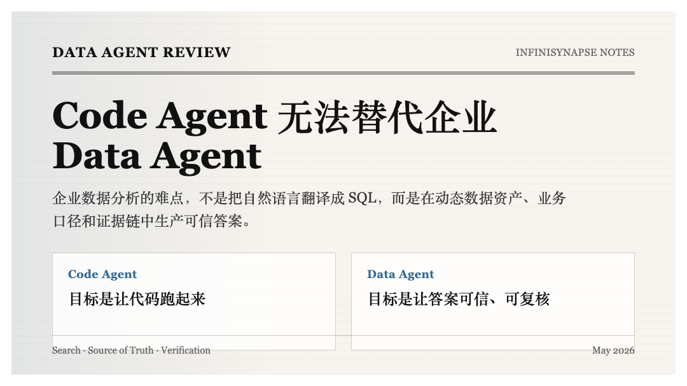

# Why Code Agents Cannot Solve Enterprise Data Analysis

> **By the InfiniSynapse Data Team** · **Last updated: 2026-05-19** · *We build InfiniSynapse, the AI-native Data Agent referenced in this article. The contrast below comes from our own customer rollouts in finance, customs, and SOE analytics environments — not from a vendor whitepaper.*


*Figure: Code Agents care whether the code runs. Data Agents care whether the answer can be trusted.*

**Meta Description**: Code Agents can write SQL and analyze Excel, but they break on three enterprise challenges — asset discovery, source of truth, and the missing oracle. Why Data Agents are a separate system. (192 chars)

**Slug**: `/blog/why-code-agents-cannot-solve-enterprise-data-analysis`

**Target keyword**: `code agent vs data agent`
**Secondary**: `enterprise data analysis ai`, `data agent`, `databricks genie alternative`

---

## Table of Contents

1. [TL;DR](#tldr)
2. [What Is a Data Agent? (25-word definition)](#what-is-a-data-agent)
3. [Databricks Genie: the industry signal](#databricks-genie-the-industry-signal)
4. [Challenge 1 — Million-scale assets break traditional search](#challenge-1-million-scale-data-assets-break-traditional-search)
5. [Challenge 2 — Source of truth is dynamic, not declared](#challenge-2-source-of-truth-is-dynamic-not-declared)
6. [Challenge 3 — The missing oracle](#challenge-3-the-missing-oracle)
7. [Why the three challenges break the Code Agent paradigm](#why-the-three-challenges-break-the-code-agent-paradigm)
8. ["Code Agent + a database connection" — the comforting illusion](#code-agent--a-database-connection--the-comforting-illusion)
9. [InfiniSQL: agentic tool-calls instead of bigger scripts](#infinisql-agentic-tool-calls-instead-of-bigger-scripts)
10. [InfiniRAG: business knowledge as infrastructure](#infinirag-business-knowledge-as-infrastructure-not-context)
11. [Auditable workflow: the only way trust scales without oracles](#auditable-workflow-the-only-way-trust-scales-without-oracles)
12. [The right division of labor between Code Agents and Data Agents](#the-right-division-of-labor-between-code-agents-and-data-agents)
13. [FAQ](#frequently-asked-questions)
14. [Conclusion](#conclusion)
15. [References](#references)

---

## TL;DR

> **Code Agents** (Claude Code, Codex, Cursor) optimize for one objective function: *make the code run*. **Data Agents** optimize for a different one: *produce a trustworthy answer inside a messy, dynamic, semantically dense enterprise data environment*. Once those two objective functions enter a real enterprise — thousands of tables, conflicting metric definitions, no unit test for "is this number correct?" — they diverge completely. This article walks through the three concrete challenges that Databricks called out for Genie, why each one breaks the Code Agent paradigm, and what an enterprise-grade Data Agent stack actually requires (InfiniAgent + InfiniSQL + InfiniRAG, with auditable workflow at its core).

**Who this is for**: heads of data, analytics platform leads, CTOs, and engineers comparing "use Code Agent + DB connector" vs "deploy a dedicated Data Agent" for enterprise analytics.

**What you'll learn**:

- The five-line objective-function difference between Code Agents and Data Agents
- Three challenges that quietly break Code Agents in enterprise data work — and why they fail silently rather than loudly
- The architectural primitives a Data Agent needs (agentic loop, federated SQL, RAG bound to data sources, auditable trace)
- A practical decision matrix for where each agent type belongs

**Scope note**: This article focuses on enterprise analytics workflows — multi-source, multi-stakeholder, audit-bound. One-off CSV exploration on a laptop is a separate buying decision; Code Agents do that well.

---

## What Is a Data Agent?

> **Key Definition**: A **Data Agent** is an autonomous software system that takes a business question as a goal, locates the relevant data assets across an enterprise's structured and unstructured estate, resolves which sources to trust, executes verifiable queries, leaves an inspectable audit trail, and explicitly flags conclusions it cannot defend. The defining contrast with a **Code Agent** is the objective function: a Code Agent ships running code; a Data Agent ships defensible answers.

This single sentence is the spine of every architectural decision below — when in doubt, return to it.

---

## Databricks Genie: the Industry Signal

On May 8, 2026, Databricks published [*Pushing the Frontier for Data Agents with Genie*](https://www.databricks.com/blog/pushing-frontier-data-agents-genie). The piece is not another Text2SQL demo. It explains why enterprise Data Agents are a *separate problem* from coding agents.

Genie is not aimed at a single CSV or one isolated database. It works across the Lakehouse:

- tables
- dashboards
- notebooks
- files
- Apps
- Google Drive
- SharePoint
- business definitions
- metadata and historical analysis assets

The headline result: on Databricks' internal real-world data analysis benchmark, after adding **specialized knowledge search, parallel thinking, and Multi-LLM design**, Genie improved from **32% accuracy with a leading coding agent to over 90%**.

That is Databricks' internal benchmark — treat it as a *directional* signal, not a universal metric. But the direction is unambiguous:

> Enterprise data analysis cannot be solved by asking a model to write a few more lines of SQL. Search, semantics, reasoning, execution, verification, and cost control all have to be part of the system design.

Databricks names three challenges that distinguish Data Agents from coding agents. We believe those three challenges explain — completely — why Code Agents cannot ship enterprise data analysis.

---

## Challenge 1: Million-Scale Data Assets Break Traditional Search

A Code Agent on a codebase still has organizing structure to lean on:

- file paths
- function names
- type definitions
- import graphs
- tests
- Git history
- README and comments

It can navigate via search, jump-to-definition, dependency analysis, and test feedback. The world is finite and labeled.

Enterprise data is not labeled. A mid-to-large enterprise typically owns:

- thousands of business tables
- multiple warehouses, lakehouses, and real-time stores
- legacy dashboards
- notebooks
- data dictionaries
- internal docs in Lark / Notion / Google Docs / SharePoint
- ad-hoc Excel reports
- APIs
- metric definitions maintained by business teams themselves
- analysis scripts left behind years ago

These assets are not only *large in number* — they are **inconsistent in structure, naming, and quality**.

A user asks:

> "Why do the peak dates of our two revenue dashboards disagree?"

The truly relevant information could be scattered across:

- an order fact table
- a finance "recognized revenue" table
- a dashboard filter configuration
- a pricing PDF
- a transformation buried in a notebook
- a historical Slack or Lark thread
- a metric definition that was rewritten last month

Keyword search collapses. The user asked about *revenue*, but the table might be `rev_recognition_fact`, the dashboard shows `ARR`, the doc says "确认收入", and the finance team calls it "净收入".

A Code Agent running plain file-system or schema search will find assets that *look* relevant — not assets that should be *trusted*.

> **Quotable**: The first capability of an enterprise Data Agent is not writing SQL. It is locating the right assets and judging the relationships between them.

This is the first reason Code Agents stall in the enterprise.

---

## Challenge 2: Source of Truth Is Dynamic, Not Declared

Finding assets is the easy half. The hard half: **which asset is the source of truth?**

In real companies you will routinely see:

- two tables both named "orders" — one the raw operational table, one the warehouse-cleaned version
- two dashboards both showing "revenue" — one by order time, one by recognition time
- a doc that captures the old definition, while the business team quietly updated the rule last month
- a notebook that contains the real transformation logic, never synced into the data dictionary
- a column named `status` with different meanings per business line
- an Excel file the CFO hand-edited that should *not* feed any official analysis

Code Agents fail in this terrain because their default behavior is **"keep writing code from the context I already have."** They are not optimized to **judge enterprise knowledge authority**.

If a Code Agent sees a field called `gmv`, it tends to use it. If it sees a dashboard called "Revenue Board," it tends to assume the definition is correct. If it sees a doc that explains a metric, it tends to cite it.

But in enterprise data analysis, the most dangerous failure is not a code error. It is:

> **"The code didn't fail. The number came out. And the number is wrong, because the definition was wrong."**

That class of error is the hardest to detect because it looks exactly like a correct answer.

A real Data Agent must reason over **dynamic business knowledge**:

- which metric definition is the latest version
- which dashboard has been certified
- which notebook hides the true transformation logic
- which historical analyses are now stale
- which docs are only background material
- when knowledge should override schema
- which conclusions must be marked "uncertain"

A Data Agent does not just *query* data. It judges the *authority* of data and knowledge.

This is exactly why InfiniRAG is not optional inside InfiniSynapse — it is the layer that turns business knowledge into a first-class runtime input.

---

## Challenge 3: The Missing Oracle

Code Agents enjoy a luxury Data Agents do not: a deterministic verification loop.

After writing code, a Code Agent can run:

- unit tests
- integration tests
- lint
- type check
- build
- e2e

If tests fail, fix. If tests pass, you can at least claim conformance to a spec.

Data Agents have no such oracle.

A user asks:

> "Why did East China revenue drop last quarter?"

There is no unit test that says "the answer is X." The question itself carries hidden assumptions:

- Is "last quarter" the natural quarter or the financial quarter?
- Is "East China" defined by customer location, store location, or sales org?
- Is "revenue" booked orders, paid orders, recognized revenue, or net of refunds?
- Is "drop" year-over-year, quarter-over-quarter, or vs budget?
- Is the data fully ingested yet?
- Do FX, pricing changes, refund cycles, or business restructures apply?

Worse, some questions are *intrinsically unanswerable* — a key source is missing, two systems can't be reconciled, or a historical break exists. A good Data Agent must be able to say:

> "Current data is insufficient to support that conclusion."

Code Agents are trained by reflex to do the opposite — keep writing more code, ship *some* result.

So the third challenge: Data Agents have no oracle. Reliability cannot come from "the model is smart." It has to come from **system design**:

- search has to find the right assets
- knowledge has to judge source of truth
- execution has to leave a trace
- intermediate results have to be reviewable
- reports have to separate database facts from business interpretation
- uncertainty has to be expressed explicitly

This is no longer a Code Agent's territory. It is a different class of system.

---

## Why the Three Challenges Break the Code Agent Paradigm

Bringing it back to the framing question:

> Why can't Code Agents solve enterprise data analysis?

Because the world they operate in is fundamentally not the same.

| Dimension | Code Agent | Data Agent |
|---|---|---|
| **Environment** | Codebase, file system, test harness | Dynamic enterprise data estate |
| **Primary objects** | Source text and engineering dependencies | Tables, fields, metrics, docs, dashboards, historical analyses |
| **Success criterion** | Code runs, tests pass | Answer is trustworthy, definition is correct, process is reviewable |
| **Feedback signal** | Compiler error, test failure, build break | Business validation, evidence chain, definition consistency, uncertainty disclosure |
| **Dominant failure mode** | Won't compile, tests fail, behavior wrong | Wrong table, wrong metric, right number / wrong interpretation |

A Code Agent can iterate on "make it run" until it runs.

A Data Agent cannot iterate on "make it true" by simply changing more SQL or Python.

Most enterprise analytics errors are not syntax or runtime errors. They are **semantic errors**.

Semantic errors do not throw exceptions. They quietly produce a professional-looking, wrong report.

---

## "Code Agent + a Database Connection" — the Comforting Illusion

Why is this misconception so common? Because Code Agents *do* handle a real subset of data tasks well:

- one-off EDA on a small CSV
- cleaning and aggregating a single Excel
- generating ad-hoc charts
- producing a one-page HTML dashboard
- writing simple SQL
- running basic queries against a single DB

These scenarios share four properties: **small data, single context, limited blast radius, cheap to verify**. They can be packaged as programming problems.

Real enterprise analysis is a chained line of questions:

1. Look at overall revenue trend
2. Notice one region is down
3. Drill by industry
4. Identify an anomalous customer cohort
5. Compare with prior year
6. Check pricing policy changes
7. Correlate with sales campaigns
8. Strip holidays and FX effects
9. Recompute net revenue
10. Form conclusion with risk disclosures

A Code Agent's default is to keep growing one script. Step 3 adds a DataFrame. Step 5 adds a merge. Step 7 adds another DB connection. Step 9 changes a filter. Step 10 staples it together.

The code grows. The variables multiply. Intermediate logic gets overwritten. The agent's attention drifts from the *business question* to *engineering plumbing*:

- is the package installed
- is the API call correct
- does the DB driver connect
- type conversions
- memory limits
- temp file paths
- chart library compatibility

The code may eventually run. But the enterprise didn't want *running code*. It wanted *defensible analysis*.

The enterprise's real questions go unanswered:

- why did we pick that table first
- why did we change the filter on round two
- when did we notice the definitions disagreed
- which intermediate result supports the final claim
- if we re-run this next week, can we reproduce the same path

So yes: "Code Agent can analyze Excel" is true. **"Code Agent therefore solves enterprise data analysis" is false.**

---

## InfiniSQL: Agentic Tool-Calls Instead of Bigger Scripts

InfiniSynapse's first answer to that gap is **InfiniSQL**.

InfiniSQL is not a fancier SQL dialect. It is a *working language* for agentic analysis. Consider:

```sql
select region, sum(amount) as revenue
from orders
group by region
as region_revenue;

select *
from region_revenue
where revenue < 0
as abnormal_region_revenue;
```

This is not "one script." It is **two tool calls**.

The first tool call produces `region_revenue` — raw orders abstracted into "revenue by region." The second tool call consumes `region_revenue` and produces `abnormal_region_revenue` — anomalous regions.

The critical property: **every tool-call output is named, materialized, and consumable by the next tool call.** Across a session, an InfiniSQL workspace gradually accumulates a chain of named intermediate tables:

- `region_revenue`
- `abnormal_region_revenue`
- `east_customer_detail`
- `refund_adjusted_revenue`
- `campaign_revenue_bridge`
- `final_business_readout`

Together those tables form a **virtual warehouse for the question at hand** — not a static schema the data team prebuilt, but a workspace that *grows* during analysis. The further the agent travels, the less it has to revisit raw detail tables. It reasons over progressively higher-level, business-named intermediates.

This is the opposite of the Code Agent failure mode. In a Python script, the more you ask, the *more complex* the code becomes. In an InfiniSQL session, the more you ask, the *richer* the virtual warehouse becomes — and the *easier* the next question is.

That is the meaning of an agent-friendly language: the agent spends attention on "what should I analyze next," not on "what was my DataFrame variable called, will this line overwrite the previous step, is this package's API version compatible."

### Heterogeneous Sources as Native Joins

Enterprise data is never in one place. A "simple" question may touch:

- MySQL orders
- PostgreSQL customers
- Excel campaign list
- ClickHouse event logs
- OSS or Hive historical detail
- API live status

A Code Agent's instinct is to pull everything into memory and merge. That works in a demo. In an enterprise, it fails on:

- local memory limits
- data egress and compliance pressure
- no compute pushdown
- temp-file proliferation as a new leak surface
- unauditable cross-source joins

InfiniSQL lets heterogeneous sources coexist as tables in one session:

```sql
connect jdbc where url="mysql://..." as mysql_biz;
connect jdbc where url="postgresql://..." as pg_ops;

load jdbc.`mysql_biz.orders` as orders;
load jdbc.`pg_ops.customers` as customers;
load excel.`/data/campaign.xlsx` as campaign;

select o.order_id, o.amount, c.level, campaign.channel
from orders o
left join customers c on o.customer_id = c.id
left join campaign on o.campaign_id = campaign.id
as order_customer_campaign;
```

The agent does not become a data engineer. It does not handle drivers, pagination, caching, memory, temp files, or cross-source merge logic. It expresses business relationships; the engine handles execution.

That distinction matters because a Data Agent's job is not to *show off complex code* — it is to *steadily move the analysis forward*.

---

## InfiniRAG: Business Knowledge as Infrastructure, Not Context

Most teams treat RAG as "retrieve a few document chunks, stuff them in the prompt." For enterprise data analysis, that's nowhere near enough.

Enterprise business knowledge is not decorative context. It is **part of the analysis itself**.

The database tells the agent *what happened*. The knowledge base tells the agent *what it means*.

A field called `metric_key` will faithfully report:

- how many `PAGEVIEW` events fired
- how many `DOWNLOAD` events fired
- how many `download:tool:windows:x64:agent_excel` events fired

But it cannot reliably tell you:

- whether `DOWNLOAD` means "intent to install" or "confirmed install"
- whether `agent_excel` belongs to Office Automation or File Processing
- whether the metric is OK to publish externally
- which keys belong to the same demand cluster
- which funnel definition the business currently endorses

That knowledge lives in:

- data dictionaries
- product docs
- past analyses
- business rules
- user preferences
- team experience
- prior conversations where a human corrected the agent

InfiniRAG turns those into **callable analytical capabilities at runtime**, not stuffed prompt context. A serious Data Agent should be able to ask the knowledge base *before* writing SQL:

- how is this metric defined
- which definition is current
- what are the business no-go zones for this field
- how did we analyze similar questions before
- what chart and report shape does the user prefer
- which conclusions must be marked with uncertainty

Then it uses SQL to verify the computable facts.

This is the **structured + unstructured binding** that the enterprise actually needs. Structured data computes facts. Unstructured knowledge supplies business interpretation, definition boundaries, history, and preference constraints.

Decoupled, the agent just queries data. Bound, the agent starts behaving like an analyst.

---

## Auditable Workflow: the Only Way Trust Scales Without Oracles

Databricks' third challenge — no deterministic oracle — forces Data Agents to build trust through a different mechanism: **a workflow you can audit**.

Enterprises are not unwilling to adopt AI. They are unwilling to adopt **AI without an evidence chain**.

A production-grade enterprise Data Agent should leave at least the following trail behind every task:

- which data sources were used
- which tables were queried
- which intermediate tables were materialized
- the SQL of every step
- which conclusions came from database facts
- which interpretations came from the knowledge base
- which definitions were adopted
- which assets were judged source of truth
- where data was insufficient
- which conclusions need human confirmation
- which charts, files, and query results back the final report

This is why InfiniSynapse exposes Task View, SQL trace, named tables, charts, files, and reports as first-class artifacts. The point is not visual richness. The point is **the enterprise can replay and review the agent**.

A Code Agent typically hands you a final script.

A Data Agent must hand you a chain of evidence.

---

## The Right Division of Labor Between Code Agents and Data Agents

Nothing above says Code Agents are unimportant. They are extremely important. They have already changed software development.

Code Agents are strong at:

- writing code
- refactoring
- debugging
- generating pages
- fixing tests
- understanding engineering context

Data Agents are strong at:

- locating data
- judging metric definitions
- fusing structured and unstructured knowledge
- cross-source analysis
- leaving a reviewable trace
- producing trustworthy reports
- saying "this cannot be answered" when it is true

These are complementary classes of system. InfiniSynapse ships **Command Tools** — single-binary CLIs that drop into `PATH` and let Cursor / Claude Code / Codex / WinClaw call Data Agent capabilities directly from a Code Agent context. (Worth being precise: Command Tools are not a `pip install` Python package, and not a persistent MCP server the user has to run.)

A workable split:

| Scenario | Better fit |
|---|---|
| Write code, refactor, fix bugs, generate pages | **Code Agent** |
| Small CSV, one-off EDA, throwaway charts | Code Agent is fine |
| Multi-turn questions, business definitions, cross-source analysis, durable reports | **Data Agent** |
| Enterprise databases, permissions, audit, private deployment | **Data Agent** |
| Structured data + unstructured business knowledge, together | **Data Agent** |
| Serious decisions, regulated reports, financial risk, business performance reviews | **Data Agent** |

Once general-purpose agents mature, specialization is what comes next. Code Agents specialize in software engineering. Data Agents specialize in enterprise data analysis.

---

## Frequently Asked Questions

**Q1. Can a Code Agent like Claude Code or Cursor handle a one-off Excel analysis?**
Yes — and it does that very well. The split shows up when the workflow turns into multi-turn analysis over multiple sources with audit and definition requirements. There, "keep editing one Python script" becomes the bottleneck, and a Data Agent's named intermediate tables, RAG binding, and audit trace become the deliverable.

**Q2. Isn't a "Data Agent" just a Code Agent that knows SQL?**
No. The objective function is different. A Code Agent ships *running code*; a Data Agent ships *defensible answers*. That changes what the agent must do at every layer — search must find authoritative assets (not just "relevant" ones), execution must materialize named intermediates, knowledge must judge source of truth, and the run must leave an audit trail.

**Q3. What does Databricks' Genie 32% → 90%+ result actually prove?**
It is Databricks' internal benchmark, not a universal industry metric. Treat it as a directional signal: adding specialized knowledge search, parallel thinking, and Multi-LLM design to an enterprise data agent yields step-function gains that single-turn coding-agent prompts cannot reach. The architectural lesson is more important than the specific number.

**Q4. Where does RAG fit in this picture?**
"Stuff retrieved chunks into the prompt" is not enough. InfiniRAG binds business knowledge — metric definitions, historical analyses, user preferences, rules — to specific data sources, so the agent consults knowledge *before* writing SQL and *separates* database facts from business interpretation in the final report.

**Q5. How is InfiniSynapse different from Databricks Genie?**
Databricks Genie is excellent inside the Databricks Lakehouse. InfiniSynapse is purpose-built for the heterogeneous enterprise — MySQL, PostgreSQL, ClickHouse, MongoDB, Snowflake, SQL Server, Doris, Excel, files, APIs — and treats every data source as an object that carries schema, sample, permission, associated RAG, and execution strategy together. It also ships a Command Tool surface so Code Agents (Cursor, Claude Code, Codex, WinClaw) can call Data Agent capabilities from their own workflows.

**Q6. When should I *not* use a Data Agent?**
For ad-hoc CSV work on a single laptop, throwaway charts, prototype scripts, or any task where the audit cost exceeds the analytical value. Code Agents handle those better and faster.

---

## Conclusion

The hardest part of a Code Agent is: *change the code until it works inside a well-defined engineering system.*

The hardest part of a Data Agent is: *first find what to trust in a messy, dynamic, semantically dense enterprise data system — then compute a defensible answer.*

That is why a Data Agent is not a subset of a Code Agent. It is not "a Code Agent that writes SQL." It needs its own infrastructure:

- **InfiniAgent** — plan, probe, execute, verify, repair, in small steps
- **InfiniSQL** — an agent-friendly analytical language whose tool-call outputs accumulate into a question-shaped virtual warehouse
- **InfiniRAG** — bind business knowledge, metric definitions, user preferences, and historical analysis to data sources and execution chains

Together they stop being "a chat window that queries a database" and start being an enterprise-grade Data Agent.

The Code Agent era proved one thing: when AI gets the right working surface, it can change software development. The Data Agent era will prove the same thing in a different domain — when AI gets a language built for data analysis, a knowledge system bound to the data, and an auditable execution chain, it can change enterprise data analysis.

If you want to test that thesis on your own data, the most direct path is the [InfiniSynapse cloud workspace](https://app.infinisynapse.cn) — drop in a database connection or an Excel file, ask a real business question, and inspect the Task View trace before you decide.

---

## Related Reading

This article makes the case for why Code Agents fail; the sister batch below frames the same shift from the buyer's side — what the AI-native category looks like, which tools live in it, and what a worked example looks like in practice.

**Sister batch — AI-Native Data Analysis series:**

- [AI-Native Data Analysis: What It Means in 2026 (vs AI-Enabled)](/blog/ai-native-data-analysis) — the **buyer-side primer**: 5 pillars (autonomy, transparency, distillation, multi-entry parity, self-correction) and a 3-question test you can run on any tool you're evaluating. Read this for the category vocabulary that anchors the rest of this article's argument.
- [Best AI Tools for Data Analysis in 2026: SQL + Techniques](/blog/best-ai-tools-for-data-analysis) — applies the AI-enabled vs AI-native split to 7 named tools (ChatGPT ADA, Claude, Gemini, Hex, Julius AI, InfiniSynapse, Microsoft Copilot in Excel), with Q1 2026 hands-on testing notes.
- [How to Clean Excel Data with AI in 2026: 5 Patterns + a 5-Minute Worked Example](/blog/ai-excel-data-cleaning) — the most common entry-level case where Code Agent vs Data Agent matters: the messy Excel file. Patterns 4–5 show what autonomy + memory look like on a real customer task.
- [Natural Language to SQL in 2026: What's Real, What's Theatre, and the Architecture That Works](/blog/natural-language-to-sql) — the technical sub-domain where this article's "Code Agent vs Data Agent" thesis is most visible: 5 generations of NL2SQL tools, 3 failure modes, and why "ChatGPT + a database connector" (a Code Agent shape) breaks where InfiniSQL (a Data Agent shape) doesn't.

**Direct companions in this batch (Data Agent series):**

- [Data Agent 是驶向新文明的第一艘飞船](/zh/blog/data-agent-new-civilization) (中文) — InfiniSynapse 创始人对下一阶段 AI 的判断.
- [Connect Supabase to an AI Data Analyst — Plus 9 More Sources](/blog/connect-supabase-to-ai-data-agent) — product entry: how the architecture argued for here ships against real Postgres.
- [构建 Data Agent 的完整 Harness：InfiniSynapse 企业级实践](/zh/blog/data-agent-harness-roadshow-recap) (中文) — full architectural deck behind InfiniSynapse, long-form.

---

## References

- Databricks Blog, [Pushing the Frontier for Data Agents with Genie](https://www.databricks.com/blog/pushing-frontier-data-agents-genie), 2026-05-08.
- Stanford HAI, [2026 AI Index Report — Chapter 9: Public Opinion](https://hai.stanford.edu/ai-index/2026-ai-index-report/public-opinion).
- InfiniSynapse Docs, [InfiniSQL — Agent-friendly analytical language](https://infinisynapse.cn/docs/infinisql).
- InfiniSynapse Docs, [InfiniRAG — Knowledge bound to data sources](https://infinisynapse.cn/docs/infinirag).
