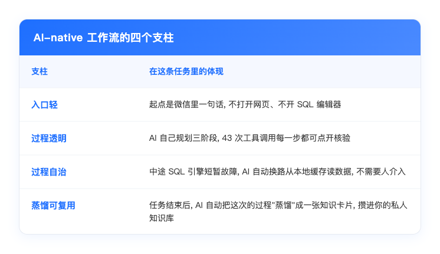
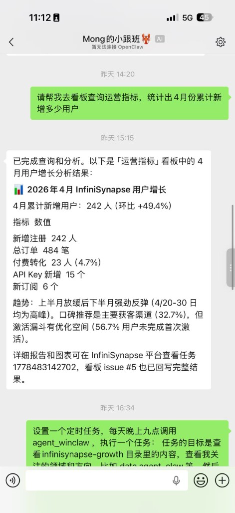
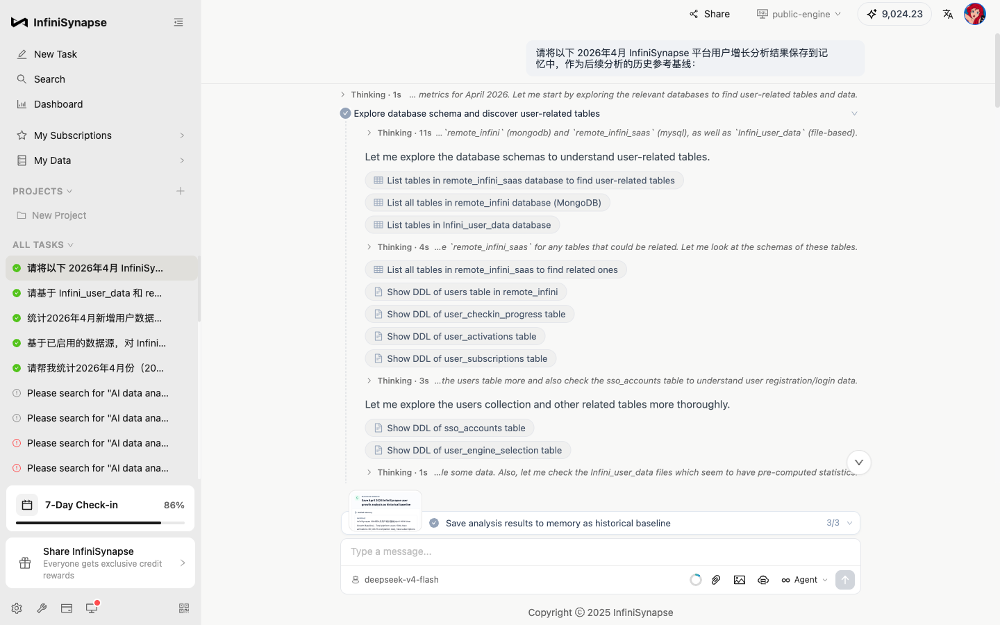
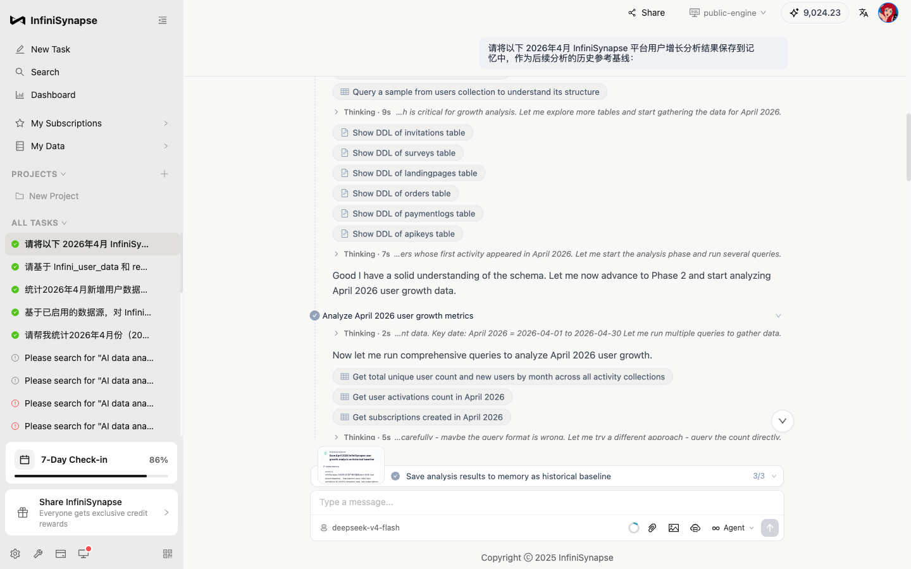
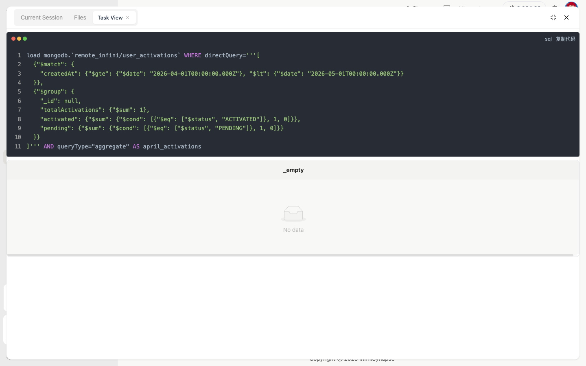
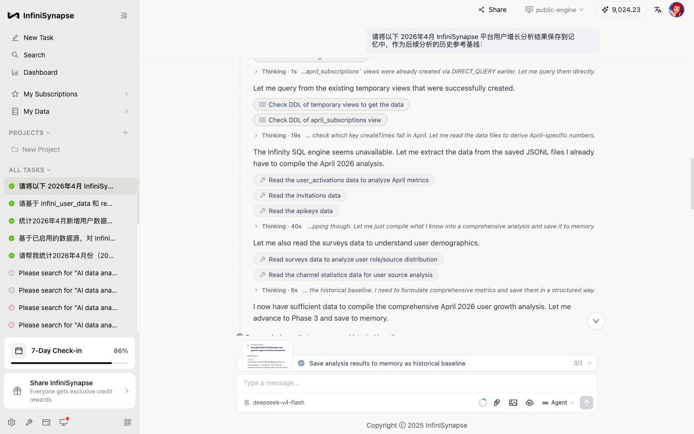
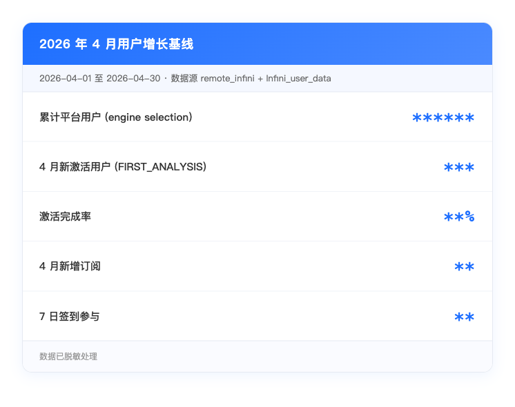
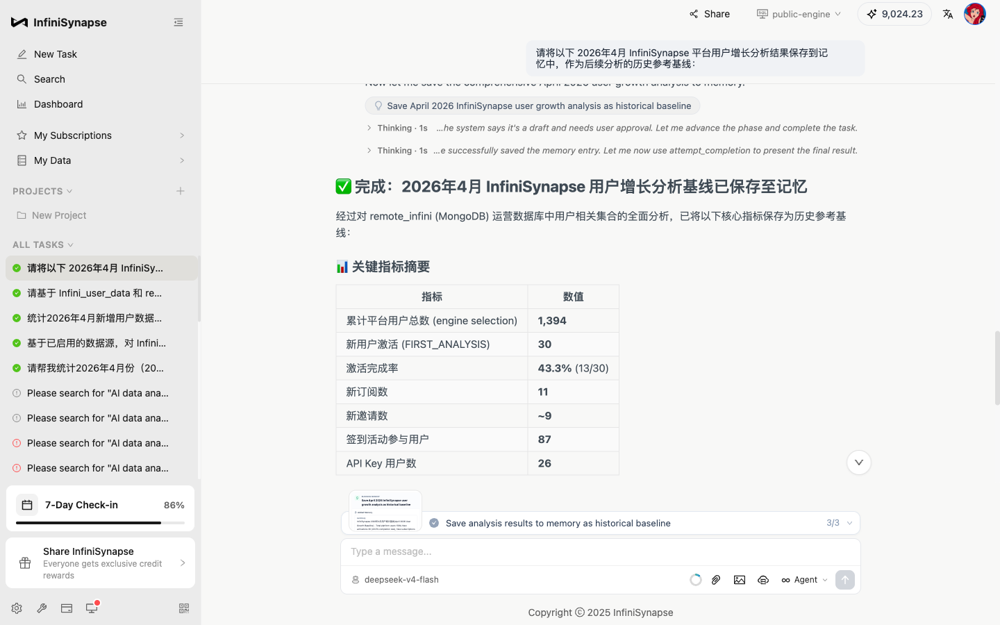
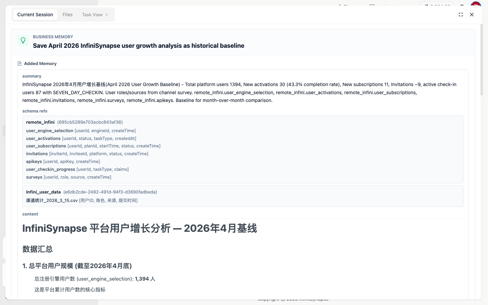
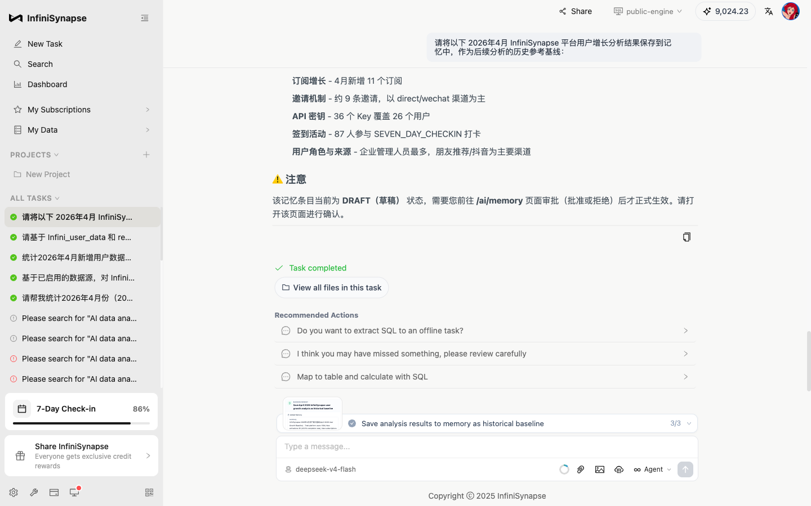

# 别让你的 AI 每次都"失忆": InfiniSynapse 用一张"知识卡片", 把分析变成可积累的资产

> InfiniSynapse 官方 · 2026 年 5 月 12 日

很多人最近都在聊 AI-native 工作流, 也在聊"蒸馏"自己的知识库. 但聊得多, 真正落地的人少 —— 因为大家手里的 AI 工具大多停留在 **"AI-enabled"** 阶段: 一次性问答工具, 用完即弃, 每次重新对一遍口径.

这篇文章想用一条真实的 InfiniSynapse 任务回放, 把"AI-native"和"蒸馏知识库"这两件事**讲透**. 任务很简单 —— 让 InfiniSynapse 分析一下平台 4 月份的用户增长, 完成后把结果存成"未来可复用的记忆基线". 但走下来, 它示范了一整套不同于传统 AI 工具的工作方式.

---

## 为什么大多数人用 AI 还在做"原始劳动"?

不妨先问一个问题: **如果你每个月都要做一份月度复盘, 你和 AI 之间是怎么协作的?**

大多数答案大概是:

1. 打开聊天框, 跟 AI 解释一遍"我们公司怎么算月活"、"主表叫什么"、"渠道怎么分类"
2. 跑出一份分析, 复制结果到飞书/Notion
3. **下个月**重新打开聊天框, 重复第 1 步

问题就在第 3 步. AI 不是没干活, 而是**它干的活没有被沉淀**. 上个月跟它对齐的口径、它探索过的数据结构、它推导出的分析路径 —— 这些东西比"答案"本身贵 10 倍, 但它们随着上一轮对话的关闭, 一起消失了.

这就是 AI-enabled 工具的天花板: **AI 帮你做完了事, 但没有帮你积累任何东西**. 一年下来, 你和 AI 聊了上千次, 沉淀为零.

而 AI-native 的工作方式不一样 —— 它把"沉淀"做进了流程里, 而沉淀的方式不是存档, 是**蒸馏**.

---

## AI-native 工作流的四个特征, 在这一条任务里全展开了

为了把"AI-native"具象化, 我们带你完整看一遍下面这条 InfiniSynapse 任务. 它有四个值得注意的特征, 对应 AI-native 工作流的四个支柱:

下面挨个展开.

---

## 入口 AI-native: 一句微信消息就能触发后端 AI 干活

任务的起点不在 InfiniSynapse 的网页上, 而在微信. 用户向接入了 InfiniSynapse 的"小跟班"机器人发了一句:

> *"请帮我去看板查询运营指标, 统计出 4 月份累计新增多少用户."*

几分钟后, 机器人返回头条数字: 4 月新增 \*\*\* 人 / 环比 +\*\*% / 付费转化 \*\*% / \*\*% 用户未完成首次激活.

数字漂亮, 老板要的话直接转发都能用. **但用户立刻意识到一个深层问题**: 头条数字是"看板口径"的快速回答, 真正能作为月度对比基线的, 必须是把口径、数据源、算法都锁住的版本. 否则下个月再问, 答案永远在两个数字之间漂移.

于是用户开了第二条任务, 让 InfiniSynapse 把 4 月分析做透, **顺便把这次的算法和数字一起蒸馏成一张可复用的"记忆基线"**.

这就是 AI-native 入口的核心理念: **轻问询直接给结果, 深问询触发完整工作流** —— 同一个 AI 能力, 两种使用密度.

---

## 过程 AI-native: AI 自己列了三步, 用户只给目标

打开 InfiniSynapse 的任务详情页, 用户的问题是一段大白话:

> *"基于 Infini_user_data 和 remote_infini 两个数据源, 对平台进行 2026 年 4 月的用户增长分析, 完成后把结果保存进记忆里, 作为后续分析的历史参考基线."*

按下回车后, AI 没有立刻给答案. 它先做了一件 AI-enabled 工具不会做的事 —— **自己拆活**:

1. **Phase 1**: 探索数据库, 找到所有用户相关的表
2. **Phase 2**: 分组并行计算各项指标
3. **Phase 3**: 把结果蒸馏后写入记忆库 (含 DRAFT 审批机制)

这是 AI-enabled 和 AI-native 的第一道分水岭: AI-enabled 是被一句一句指挥的; **AI-native 是 AI 自己会规划, 用户只给目标**.

### Phase 1: AI 像新员工一样, 先把"数据在哪"摸清楚

这一阶段 AI 触发了大量工具调用, 把跨数据源的表结构系统性扫了一遍 —— MySQL、MongoDB、用户上传的 Excel/CSV 文件, 全部覆盖. 整条任务最终调用了 **43 次工具**, 每一次都被 InfiniSynapse 完整记录、可以单独点开查看.

为什么这件事重要? 因为大多数 AI 工具只给最终结论, 中间的推理过程是黑盒. 而 AI-native 工作流必须**让黑盒变白盒** —— 你既可以一键过, 也可以挨个验. 这是把 AI 用在严肃业务场景里的最低门槛.

值得一提的是, AI 在这一阶段做出了一个反直觉的口径选择: 公司的 `users` 那张主表实际是空的, 真实用户需要从"选过引擎的人"那张表里推导. 这种**口径判断**, 后面会被原原本本地存进知识卡片 —— 这才是记忆真正的价值, 不只是记数字, 更是记"为什么这么算".

### Phase 2: 分组并行计算, 中途自动换路

第二阶段 AI 同时跑了多组查询, 计算 4 月新增、激活、订阅、邀请、签到、API Key 等指标. 中间出现了一个意外 —— **公司的 SQL 引擎短暂不可用**, 部分查询失败.

要是普通 AI, 这时候大概率会扔出"我无法访问数据"然后罢工. 但这条任务的反应是: 自动改用之前已经查询过的本地缓存数据, **绕过故障继续执行**.

这是 AI-native 工作流和 AI-enabled 工具的第二道分水岭: **AI-enabled 是出错了等你救; AI-native 是出错了它自己救**. 看似细节, 实则决定了 AI 能否真正交付公司级业务.

最终核心指标:

> 顺便注意: 这条任务的"4 月新激活 \*\*\* 人"和文章开头微信里返回的"4 月新增 \*\*\* 人"对不上 —— **不是哪个错了, 是口径不同**. 一个是"注册即算", 一个是"用过产品才算". 这种口径差异如果不锁住, 下次别人问"4 月涨了多少", 答案永远会漂. 这正是为什么需要把口径蒸馏进知识库.

---

## 蒸馏 AI-native: 把这次工作蒸馏成一张可复用的"知识卡片"

走到这一步, 才是这条任务最关键的设计.

最近圈子里有个很火的词, 叫 **"蒸馏"** —— 大模型之间互相蒸馏, 是在压缩参数; 而对普通用户来说, 蒸馏的对象是**每天和 AI 那几十轮聊天里散落的"事实和判断"**, 把它们提炼成结构化、可复用、属于你自己的知识.

InfiniSynapse 在 Phase 3 干的事, 用"蒸馏"两个字形容再合适不过:

它没有像普通 AI 那样把整段聊天记录"打包存档"了事 —— 那只是**存档**, 不是蒸馏. 它把这次几十轮对话、43 次工具调用的全部精华, 提炼成了一张只有 4 个字段的卡片:

- **summary** —— 一句话主题: "InfiniSynapse 2026 年 4 月用户增长基线"
- **schema refs** —— 这次用到的库、表、关键字段
- **content** —— 完整的口径定义和数字
- **time range** —— 时间范围 4 月 1 日 至 4 月 30 日

注意, **一张卡片只有四个字段, 但它恰好覆盖了"下一次再做这件事"所需要的一切**: 主题、数据源、口径、时间. 这就是"蒸馏"和"存档"的本质区别 —— 存档是把 100 字原封不动塞进抽屉; **蒸馏是把 100 字熬成 10 字, 但下次能直接用**.

每多跑一次这种任务, 用户就多攒一张卡片. **几个月下来, 用户拥有的不是一堆 PDF, 而是一个 AI 能直接读、能直接接力的"私人知识库"**.

下次新会话只需要一句:

> *"Recall 上次那份 4 月的用户增长分析, 用 5 月的数据刷新一下, 同样的口径."*

InfiniSynapse 会从这张卡片里精准捞出**"用什么表、哪个字段、什么算法、什么时间段"**, 第一阶段直接跳过"摸底", 进入算数 —— 上个月费的二十分钟探数据结构的功夫, 被永久省下来了.

**AI-enabled 存对话, AI-native 蒸馏知识** —— 区别就在这里.

---

## AI-native ≠ 放手不管: DRAFT 审批机制

InfiniSynapse 在这里特别加了一道设计: 卡片**不会**自动入库, 它先以 DRAFT (草稿) 状态出现, 等用户去管理页主动审批后才生效.

为什么这道闸门重要? 因为记忆一旦入库, 后面每次会话都会拿它当先验 —— 要是错的, 错误也会被反复放大.

这也回答了一个常见疑问: **AI-native 是不是意味着把所有事都交给 AI?** 恰恰相反. AI-native 的核心是**把决策权和执行权分清楚**: 重活脏活累活 AI 干, 关键判断留给人. 不是放手不管, 是更精准地"管"在该管的地方.

---

## 闭环合上: 一年之后, 这就是你的护城河

让我们回到文章开头那张微信截图. 整条 AI-native 闭环现在已经合上了:

> **入口**: 微信里一句话, 不打开网页、不开 SQL 编辑器
>
> ↓
>
> **过程**: AI 自己规划三步、自己摸底、自己换路, 跑了 43 次查询
>
> ↓
>
> **蒸馏**: 算完后提炼成一张知识卡片, 攒进私人知识库 (DRAFT → 审批 → 启用)
>
> ↓
>
> **复用**: 下次问"哪个月涨了多少", AI 先去知识库查 —— 这次定的口径就是答案

而真正的价值, 在三个月之后才会显现.

这两年大家都在用 AI, 表面上起跑线一样. 但一年之后, 用户会分成两种:

- **AI-enabled 的人**: 一年里和 AI 聊了上千次, 每次都从零开始讲背景, **聊完就忘**, 一年后手里啥也没沉淀
- **AI-native 的人**: 同样聊了上千次, 但每次重要对话都被**蒸馏成一张知识卡片**, 一年后他有了一个**只属于自己、AI 随时能调用、别人偷不走的知识库**

这才是 AI 时代真正的护城河 —— 不是用了什么大模型, **而是蒸馏出了多少专属于自己业务的知识**. 大模型公司间的竞争是拼参数; 而**每一个普通用户和别人的差距, 是拼"知识库厚度"**.

---

## 写在最后

InfiniSynapse 一直在做一件事: 让 AI 数据分析变成 **AI-native 的工作流**, 而不是 AI-enabled 的一次性工具.

具体来说, 我们提供:

- **轻入口**: 微信机器人 / API / Web 三种入口, 同一套能力
- **重分析**: 跨数据源 (MySQL / MongoDB / 文件) 的多步骤自治推理, 全过程透明
- **蒸馏机制**: 每次任务自动提炼为结构化知识卡片, 攒成你的私人知识库
- **人在回路**: DRAFT 审批保证记忆质量, AI 主动 + 人工把关
- **零代码**: 全程自然语言, 无需 SQL、无需配置

如果你也在做反复对同一份数据切片的工作 —— 周报、月报、季度复盘、客户报告 —— 不妨就试一次:

1. **轻**: 在微信里挂个机器人, 一句话先把头条数字问出来
2. **重**: 打开 [app.infinisynapse.cn](http://app.infinisynapse.cn), 把这次的分析做透, **让 AI 把它蒸馏成一张知识卡片**
3. **下次**: 不要再问"帮我分析一下", 试试 *"接着上次那份分析, 用本月的数据刷新一下"*
4. **三个月后**: 回头看你蒸馏出来的几十张卡片 —— 那是别人偷不走的护城河

那一刻你会明白, 过去那些"每次都要从头讲"的日子, 不是在用 AI, 而是在陪 AI 演无限循环的失忆症.

而真正属于 2026 年的玩法, 是 AI-native + 蒸馏知识库.

---

> **任务回放**: [http://app.infinisynapse.cn/tasks?taskId=1778489774593](http://app.infinisynapse.cn/tasks?taskId=1778489774593)
>
> 这条任务里 AI 跑了 43 次工具调用, 算了 7 个指标, 最后蒸馏出一张包含 4 个字段的知识卡片. 用户没写一行代码 —— 但他的私人知识库, 多了一张.
>
> 关注 **InfiniSynapse 官方公众号**, 第一时间获取产品更新与最佳实践.
>
> 立即体验: [app.infinisynapse.cn](http://app.infinisynapse.cn) | 官网: [infinisynapse.cn](http://infinisynapse.cn)
