# AI 让信息变得过剩，信任反而变得稀缺——这次 InfiniSynapse 接住了一个真实的医疗谣言

> InfiniSynapse 官方 · 2026 年 5 月 15 日

先看一张图。这是斯坦福 HAI（人工智能以人为本研究所）刚发布的《2026 AI Index Report》第 9 章 *Public Opinion* 里的一张：

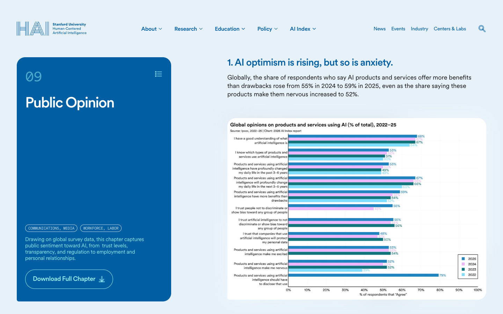

这一章的小标题翻译过来是 ***"AI 乐观情绪在涨，但焦虑也在涨"***。中间那条横向柱状图里有一行数据：

> *Products and services using AI **make me nervous** —— **52%**（2025 年）*

也就是说，**全球大概一半的人，对 AI 给出的服务是紧张的**——这不是讨厌、不是排斥，而是"我用归用，但每次心里都打个鼓"。

[Pew Research 同期那份调查](https://pewresearch.org/internet/2025/04/03/how-the-us-public-and-ai-experts-view-artificial-intelligence) 把"AI 专家 vs 普通公众"对 AI 在不同领域影响的乐观程度，做成了一张更直白的对比图：

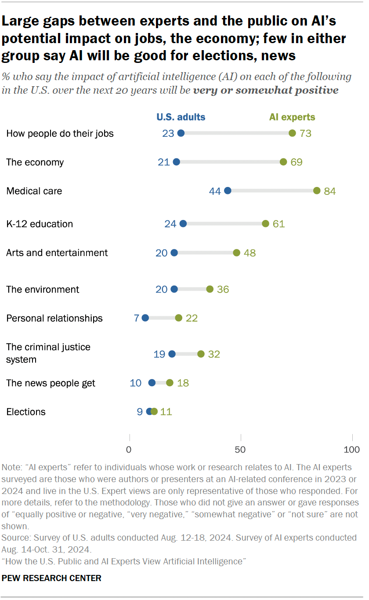

横向看一遍这张图，几乎每一行都是一条几十个百分点的鸿沟：

- **职场（"How people do their jobs"）**：AI 专家中 **73%** 认为是积极影响，普通公众只有 **23%**——差 50 个百分点
- **经济**：专家 69% 乐观，公众 21%——差 48 个百分点
- **医疗**：专家 84%，公众 44%——差 40 个百分点
- 哪怕在专家自己也没那么乐观的领域（新闻、选举），公众的乐观度也几乎贴近 0

这条鸿沟有意思的地方在于——**它说明问题并不在 AI 不够聪明**。AI 已经够聪明了，聪明到能写报告、写代码、看医学影像、辅助法律研究。但聪明到一定程度之后，会出现一个新问题：**普通人开始没办法判断它说的话是真是假**。

---

## 这种焦虑的根本，是"答案越流畅，越无法验证"

最近这两年，每个用过几次 AI 的人，心里大概都闪过一个相同的瞬间：

- 它给的答案听起来非常专业、非常自信
- 但这条结论到底**出自哪里**？是它训练数据里有的真实文献，还是它当场编了一个看似合理的说法？
- 我能不能**点回原文**自己核对？

这件事最妙的旁证来自 **OpenAI 自己的 CEO**。Sam Altman 在 2025 年 6 月 18 日 [OpenAI 官方播客第 1 期](https://www.youtube.com/watch?v=DB9mjd-65gw)（OpenAI Podcast Ep. 1，主持人 Andrew Mayne）里，对全球用户说了一段挺反常识的话：

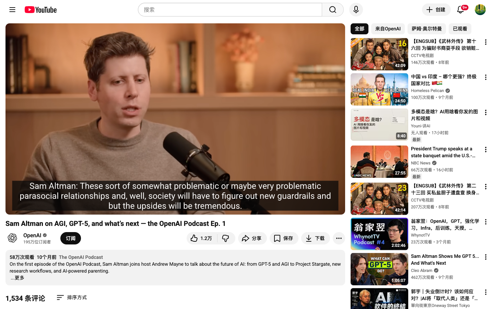

整集播客里他反复在强调同一件事，最直接的一句是：

> *"People have a very high degree of trust in ChatGPT, which is interesting because AI hallucinates. **It should be the tech that you don't trust that much**."*
>
> （中文：人们对 ChatGPT 的信任度高得令人意外。这其实挺奇怪的——因为 AI 是会胡编的，**它本该是你不那么应该相信的那种技术**。）
>
> — Sam Altman, OpenAI CEO（OpenAI Podcast Ep. 1，2025 年 6 月）

造 AI 的人亲口告诉用户"别太信 AI"——这句话听起来像是悖论，但它指出了一个很真实的问题：**LLM 的语气流畅度和事实准确度，是两件不同的事**。表达越自信，事实越未必。

所以行业的下一个问题，已经不是"AI 能不能答得更聪明"——它早就够聪明了；而是 **"AI 能不能让我自己去验证它给的答案"**。

那既然有这么个真问题，我们就拿一个具体场景跑一下试试看：用一个真实的医疗谣言去测 InfiniSynapse 处理"信任问题"的能力。下面用 9 张截图记录全过程。

---

## 起点：一个看起来很专业的医疗营销

设想一下：你膝盖痛了大半年，刷到一个朋友圈广告——*"FDA 批准的干细胞注射，一针告别膝关节痛"*。听起来挺正经，"FDA 批准"这四个字像金字招牌。

但稍微多想一秒，几个问题就来了：

- "FDA 批准"，**到底批准了什么**？是产品本身？是临床试验？还是只是某个口头说法？
- 朋友圈、小红书上一片好评，**这些发声的人，动机是什么**？
- 如果 AI 告诉我一个结论，我**能不能一条一条点回原文核对**？

这三个问题恰好覆盖了 Sam Altman 那句话里的核心痛点——AI 给的答案对不对、出自哪里、能不能查。我们把它们打成中文 prompt 扔进 InfiniSynapse：

> *"我看到一家诊所打广告说'FDA 批准的干细胞注射'治疗膝关节骨关节炎，这真的可信吗？请优先用权威医学来源（FDA、NIH、PubMed、CFDA/NMPA、医学指南）查证，并对比一下'诊所/厂商宣传'、'患者论坛/小红书评价'、'权威医学指南'这三类信息源的动机差异，所有结论都要给出原文链接可以追溯。"*

提交前，把右下角的两个开关打开：

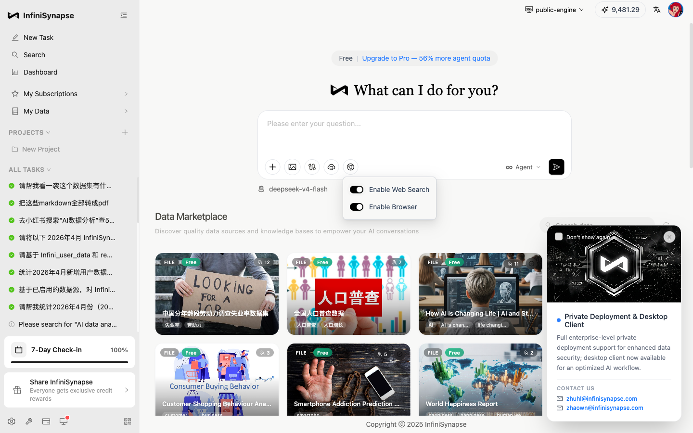

- **Enable Web Search**：去搜索引擎拉信源、按权威度和相关性排序
- **Enable Browser**：让 AI 真的"打开"具体页面、逐字读原文，不只是看搜索摘要

这两件事看起来朴素，但它们决定了 AI 是在"凭记忆答题"还是在"现场查资料"。回车。

---

## 第一件事：AI 自己规划了"权威源优先"的检索路径

提交之后，InfiniSynapse 没有立刻搜。它先把这件事拆成了 6 个阶段：

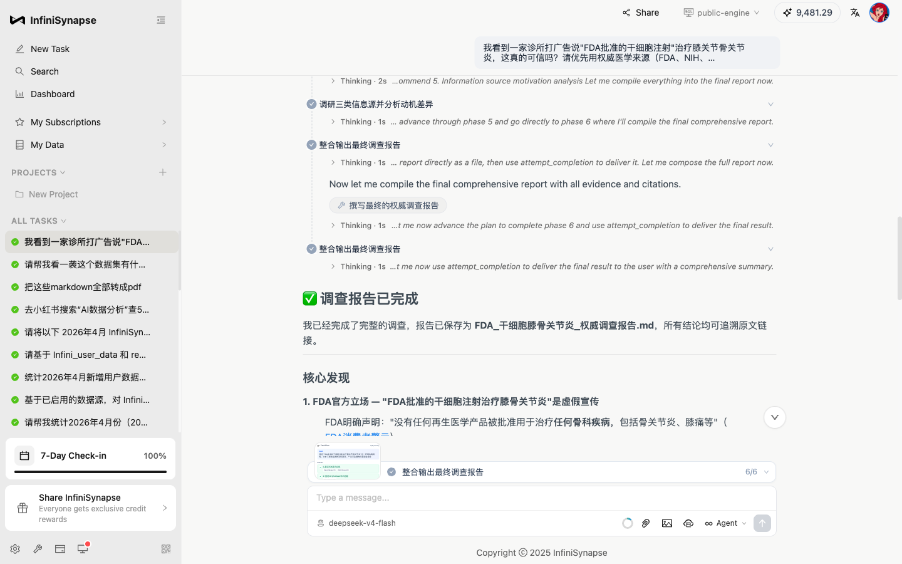

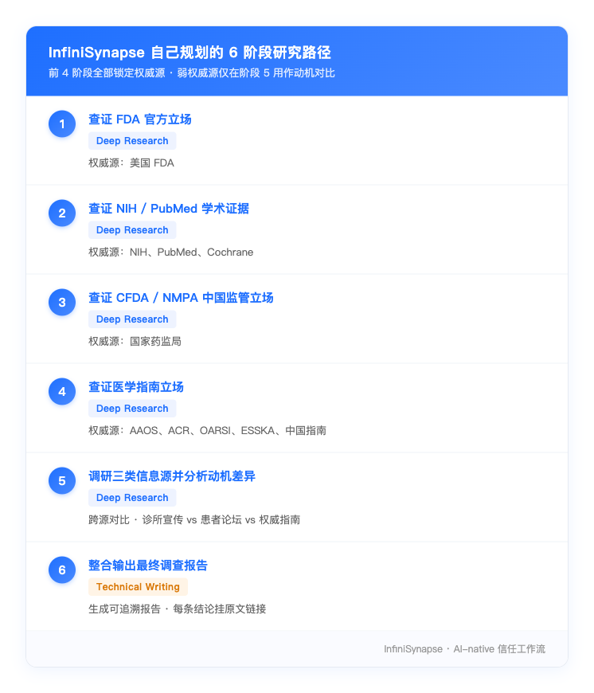

我们 prompt 里只丢了几个关键词——"FDA / NIH / PubMed / CFDA / 指南"，AI 自己把这些词理解成了一个**层层递进的权威性顺序**：先听监管机构怎么说，再看一手学术证据，再回到中国监管语境，最后才看临床指南怎么写。

注意一个值得说的细节：**"诊所宣传"和"患者论坛"被它放到了第 5 阶段——只用来做"动机对比"**。换句话说，AI 没有让弱权威源参与"事实判断"，只让它们参与"差异分析"。这个权重分配挺关键的，决定了最终结论会不会被营销话术污染。

进入 Phase 1 后，它一口气并行触发了 9 个工具调用，全部命中 FDA + AAOS：

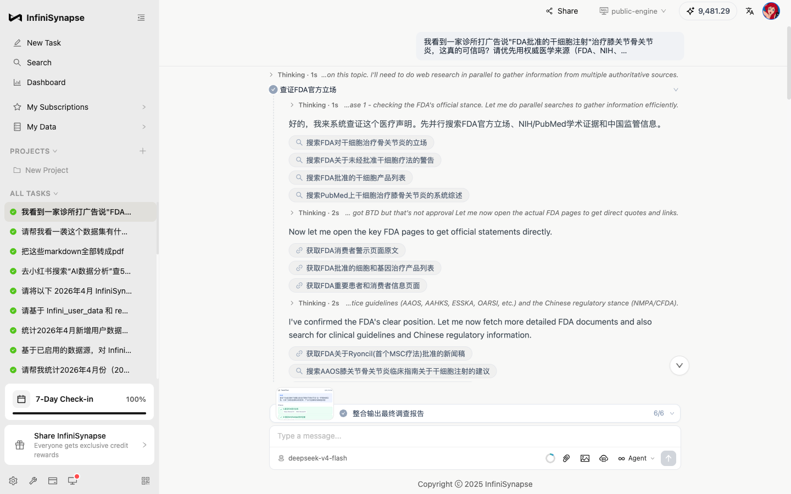

---

## 第二件事：检索结果按权威度排序，不是按热度

InfiniSynapse 走的不是"搜索引擎第一条就是答案"那一套。它会把每次搜索的结果都拉出 20–60 条原始记录，再按**学术权威性 + 来源类型**重新排序。

点开任意一个工具行右侧的"任务查看"面板，就能看见 AI 实际抓到的源是什么样：

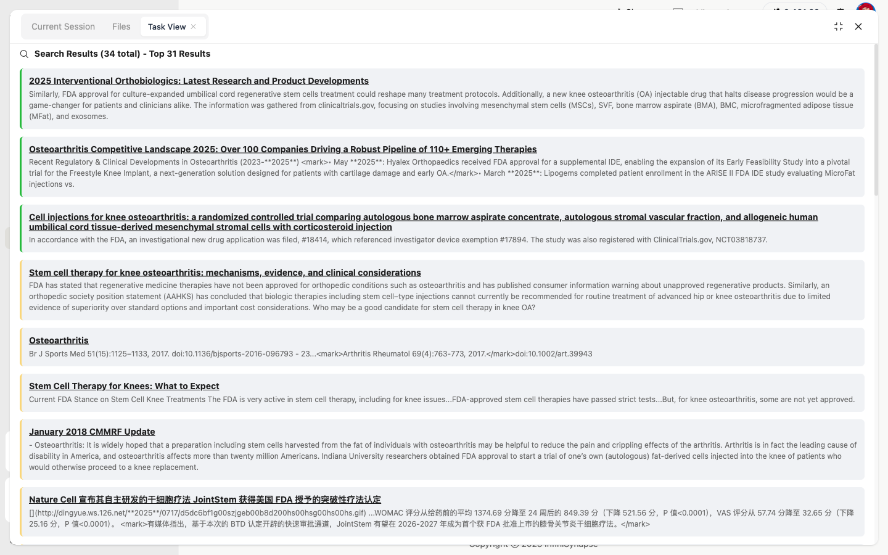

排在前面的几条都是有据可查的：

- 第 3 条：*Cell injections for knee osteoarthritis: a randomized controlled trial...* 附 **NCT03818737** 临床试验注册号
- 第 4 条：*Stem cell therapy for knee osteoarthritis: mechanisms, evidence...* 引用 AAHKS 立场声明 + FDA 消费者警示
- 第 5 条：*Br J Sports Med 2017* 加 DOI: 10.1136/bjsports-2016-096793

切换到 PubMed 学术检索时，它顺手拼了一条专业研究员级别的高级查询语法——这种写法普通搜索引擎用不上，但医学综述里是基本功：

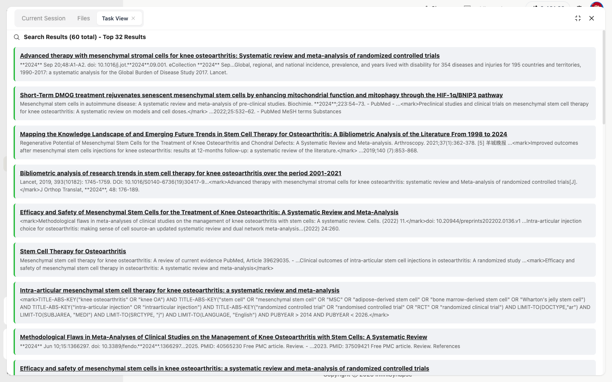

```
TITLE-ABS-KEY("knee osteoarthritis" OR "knee OA")
AND TITLE-ABS-KEY("stem cell" OR "mesenchymal stem cell" OR "MSC" ...)
AND TITLE-ABS-KEY("intra-articular injection")
AND TITLE-ABS-KEY("randomised controlled trial" OR "RCT" ...)
AND LIMIT-TO(DOCTYPE,"ar")
AND LIMIT-TO(SUBJAREA,"MEDI")
AND PUBYEAR > 2014 AND PUBYEAR < 2026
```

这一行用人话翻译就是：**"我只要 2014 年之后的英文医学期刊里，专门做'膝骨关节炎 × 干细胞 × 关节内注射 × RCT'四交叉的同行评议文章。"**

写过文献综述的人看到这行应该会觉得熟悉——这是研究员才会写的检索语句，不是日常搜索习惯。InfiniSynapse 在做这件事时没有让我们提示，它自己判断了"这是医学问题、需要这种级别的检索"。

---

## 第三件事：跨源对比，把"立场差异"摆出来

权威源拉完之后，InfiniSynapse 又多做了一步：把同一个问题下，不同信源各自的立场摆在一起对比。

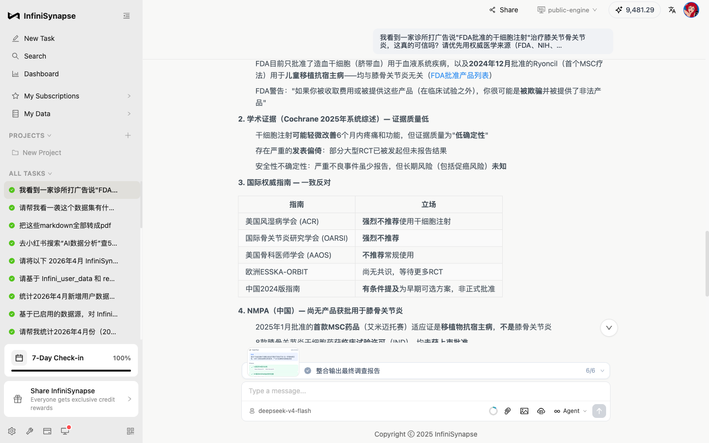

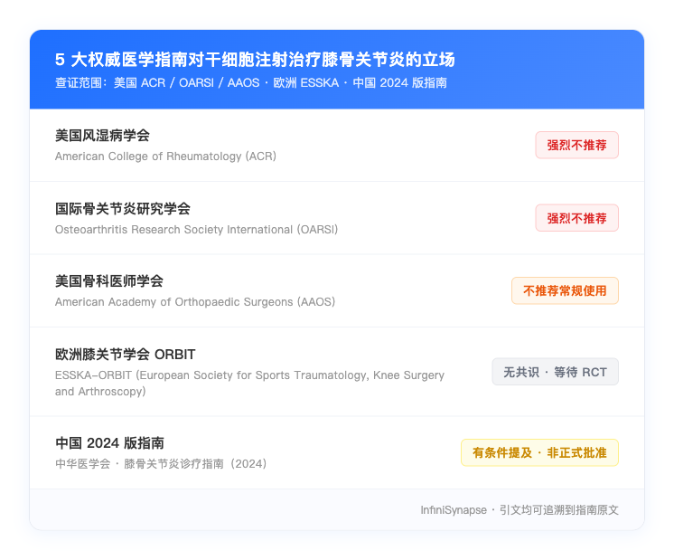

到 Phase 5，它把"诊所宣传 / 患者论坛 / 权威指南"三类信源做了一个红黄绿可信度评级，并且写明每一类的**典型动机偏差**：

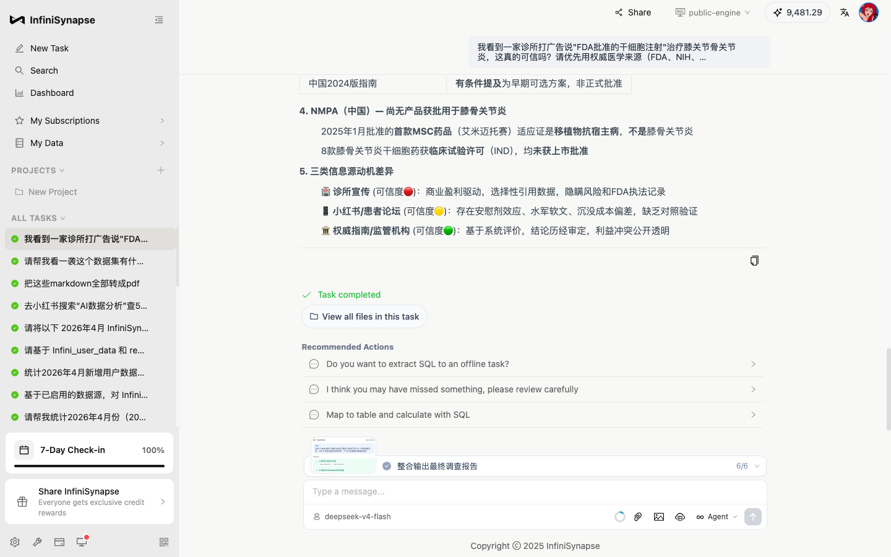

> 🏥 **诊所宣传**（可信度 🔴）：商业盈利驱动，选择性引用数据，隐瞒风险和 FDA 执法记录
>
> 📱 **小红书 / 患者论坛**（可信度 🟡）：存在安慰剂效应、水军软文、沉没成本偏差，缺乏对照验证
>
> 🏛️ **权威指南 / 监管机构**（可信度 🟢）：基于系统评价，结论历经审定，利益冲突公开透明

这个评级不是 InfiniSynapse 内置的模板。它是 AI 跑完前 5 个阶段、把诊所原话、患者评价、监管文件三组材料都过了一遍之后**自己归纳**出来的。

它顺手还指出了一个常见的话术混淆：

> *"FDA Breakthrough Therapy Designation（突破性疗法认定）≠ FDA approval（FDA 批准）。某些诊所在宣传中把'获 BTD 认定'描述成'获 FDA 批准'。"*

这一点对普通人挺有用——它解释了为什么有些诊所敢公开说"FDA 批准"：**确实有这么一个 BTD 通知书存在，但这和"产品获批上市"是两件不同的事**。一个普通消费者可能看不出来这个差异，AI 把这件事讲清楚了。

---

## 第四件事：每个结论都给原文链接

这一步是这次任务里我们觉得最有意思的一帧。InfiniSynapse 给出"FDA 没有批准过任何干细胞产品用于骨关节炎"这个结论时，没有让你"相信我"——它把原文出处直接挂在了结论旁边：


> **1. FDA 官方立场** — "FDA 批准的干细胞注射治疗膝骨关节炎"是虚假宣传
>
> - FDA 明确声明："没有任何再生医学产品被批准用于治疗任何骨科疾病，包括骨关节炎、膝痛等"（[FDA 消费者警示](https://www.fda.gov/...)）
> - FDA 目前只批准了造血干细胞（脐带血）用于血液系统疾病，以及 2024 年 12 月批准的 Ryoncil（首个 MSC 疗法）用于儿童移植抗宿主病——均与膝骨关节炎无关（[FDA 批准产品列表](https://www.fda.gov/...)）
> - FDA 警告："如果你被收取费用或被提供这些产品（在临床试验之外），你很可能是被欺骗并被提供了非法产品"

每一个引用都给原始链接、文献编号、监管机构发文记录。

这其实就是"可追溯"三个字最具体的样子：你拿这份报告去找你的骨科医生讨论时，每一行都可以摊在医生面前，告诉他"这一句出自 FDA 官网、那一句出自 ACR 指南、这一段出自 Cochrane 2025 系统综述"。结论本身可以被反驳，但每一个事实都可以被独立验证。

---

## 把这条信任链串起来看

把这次任务从头看到尾，InfiniSynapse 在三件事上做出了和"普通 AI 工具"不一样的选择：

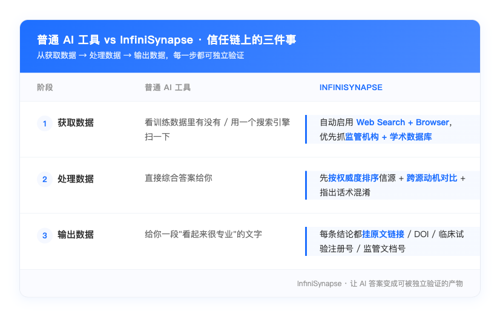

回到 Sam Altman 那句"It should be the tech that you don't trust that much"——

如果接受他这个判断（我们觉得他说得对），那么解法只有两条：要么让 AI 不再胡编（这是模型架构层面的事，时间会很长），要么**让 AI 把每一句话的来源摆出来，让用户自己去验证**（这是产品层面就能做的事）。

InfiniSynapse 选的是第二条。在医疗、法律、金融、政策解读这些容错率比较低的场景里，"AI 给的答案对不对"这个问题，远没有"AI 给的答案我能不能查"这件事来得重要。一个能让你点回原文核对的 AI，才有机会进到严肃的工作流里。

---

## 写在最后

我们做 InfiniSynapse 这两年，反复在想一个问题：当所有 AI 都能流利地给出答案时，什么是 AI 时代真正的产品差异化？

这次任务的答案我们觉得挺清楚的——

> **不是答得多快，不是答得多漂亮，而是答得"可被信任"。**

可被信任意味着：

- **数据来源透明**：哪条结论来自 FDA、哪条来自 PubMed、哪条来自小红书，一目了然
- **处理过程可见**：每一步搜索、每一篇被读过的文档、每一次跨源对比，全部留底
- **结论可追溯**：每一个事实都给到原始链接，让你可以自己去验证

一个"答得快但是黑盒"的 AI，适合写文案、画 PPT 这类容错率高的事；一个"答得稳、全程留痕"的 AI，才适合用在涉及健康、钱、法律、政策的严肃决定里。

我们选的是后者。

---

### 这周也可以试一次

如果你身边有人最近被某个"听起来很专业但你不敢轻信"的说法困扰——保健品宣传、新药承诺、政策解读、理财方案——可以打开 [app.infinisynapse.cn](https://app.infinisynapse.cn) 试一下这套流程：

1. 在输入框右下角打开 **Enable Web Search** 和 **Enable Browser**
2. 在问题里直接说明你想优先看哪几类权威源（监管机构 / 学术期刊 / 行业指南）
3. 加一句"**所有结论都要给原文链接可以追溯**"
4. 回车——然后等几分钟

你拿到的不会只是一个答案，而是一份你可以拿去任何专家面前、能让他逐条核对的调查报告。

> 顺便说一句：InfiniSynapse 目前**注册即可免费试用**，无需付费就能跑完上面这套完整流程。我们最近还在做一个"**七日打卡 · Data Agent**"活动——每天做一道题，连打 7 天可领 1500w 算力 token + 月度会员：


---

> **数据与引用来源**：
> - [Stanford HAI 《2026 AI Index Report》第 9 章 Public Opinion](https://hai.stanford.edu/ai-index/2026-ai-index-report/public-opinion)
> - [Pew Research 2025 · How the US Public and AI Experts View AI](https://pewresearch.org/internet/2025/04/03/how-the-us-public-and-ai-experts-view-artificial-intelligence)
> - [Sam Altman on AI hallucination · OpenAI 官方播客 2025 年 6 月](https://hindustantimes.com/technology/chatgpt-pioneer-sam-altman-warns-against-blind-trust-in-ai-it-hallucinates-101751354483495.html)
>
> **本次任务回放**：本文中 9 张截图来自 InfiniSynapse 真实任务执行过程，AI 用时约 3 分 30 秒，调用了 30+ 次 Web Search / Browser 工具，覆盖 FDA、NIH/PubMed、CFDA、AAOS、ACR、OARSI、ESSKA、中国 2024 版指南等 8+ 类权威源
>
> 关注 **InfiniSynapse 官方公众号**，第一时间获取产品更新与最佳实践。
>
> 立即体验：[app.infinisynapse.cn](https://app.infinisynapse.cn) ｜ 官网：[infinisynapse.cn](https://infinisynapse.cn)
