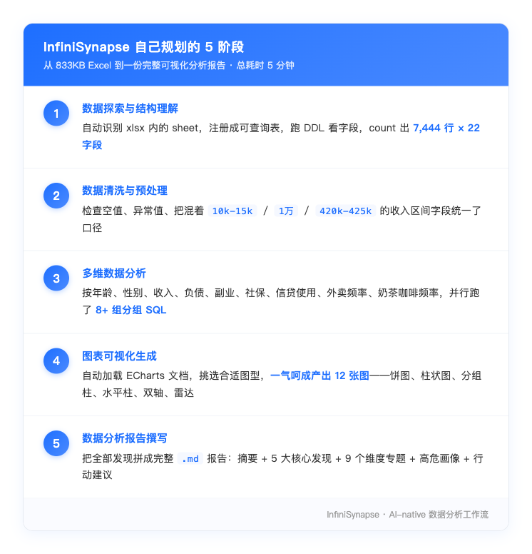
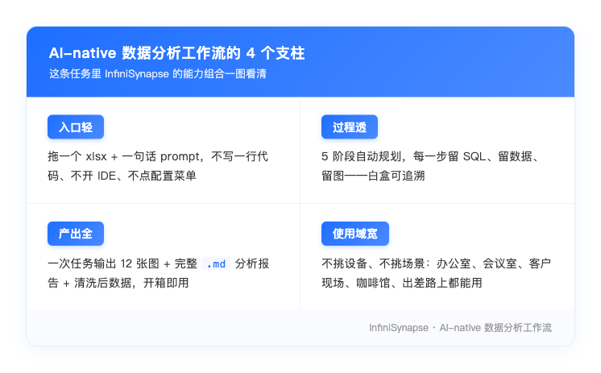

# 当数据分析师不在电脑前：InfiniSynapse 用一句话替你到场，把"该做的活"做完

> InfiniSynapse 官方 · 2026 年 5 月 14 日

每个数据从业者都收到过那种微信——领导随手丢一个 Excel 过来，配一句轻飘飘的"清洗一下，里面该算的算出来"。轻描淡写的十几个字，背后是一整个下午的活：字段类型一个个对、空值一格格补、口径一条条统一、图表一张张画、报告一段段写。

最让人崩溃的是，这种消息从不会挑你方便的时候来。它永远精准地砸在你**正在外面开会、笔记本没带、电脑在十公里外的办公室**那一刻。

这一类场景，是我们设计 InfiniSynapse 时反复在想的：**数据分析的瓶颈，从来不是"有没有 AI 工具"，而是"分析师本人在不在电脑前"。**这篇文章会用一条真实的用户任务回放，把这件事讲透——AI-native 的工作流，不只是"AI 帮你做事"，更是"AI 替你到场"。

---

## 场景：下午 14:13，一个 833KB 的 Excel 落在了一个不在公司的人手机上

任务的起点不在 InfiniSynapse 网页上，而在客户公司的会议室里。一位用户正在听对方汇报，手机震了一下——领导发来一句：

> *"把这个表格清洗了，里面该算的算出来"*
>
> 📎 月光族比例数据集.xlsx · 833.1 KB

按传统工作模式，这条消息有三种处理路径：

1. **请假回公司**——客户会议不能中断，否定
2. **手机里硬撑**——Excel 在手机上打不开，否定
3. **回一句"会议结束马上搞"**——心思一下午没法在会议上，加班到天黑才能交，体面但无效

用户最终走了**第四条路**：用龙虾远程连进办公室那台 Mac，把 xlsx 在云端浏览器里直接拖进 InfiniSynapse 对话框，打字一句：

> *"帮清洗数据，并且统一数据口径，月光族比例都计算出来，再给我一份可视化数据分析报告"*

回车。手机重新扣到桌上，继续听会。**全程操作不超过一分钟。**

---

## 当 AI 真的"代替你到场"，它的工作量是这样的

[这条任务的完整回放](https://app.infinisynapse.cn/tasks?taskId=bff6f71f-cc41-440c-9853-b786f543c6c0&share=1) 现在还能打开。点进去你会看到，从 **14:14** 用户那句话回车，到 **14:19** 一份完整的可视化报告生成完毕，**InfiniSynapse 自己规划并执行了 5 个阶段，总耗时 5 分钟**。

这是 AI-enabled 工具和 AI-native 工作流的根本区别：**AI-enabled 是被一句一句指挥着干活的；AI-native 是用户只给目标，AI 自己拆活、自己跑、自己交付**。

更重要的是——**AI 干完每一步都留痕**。点任意一个步骤行，右侧会弹出当时跑的 SQL、产出的数据表、生成的图表本身：

这一点对严肃的数据工作至关重要。因为如果领导某天问"你这 41% 是怎么算的"，传统 AI 工具的答案大概率是"我也忘了，我们再跑一次"。InfiniSynapse 的答案是"那是从 7,444 条样本里筛选 `储蓄率(%) = 0` 的人占比，SQL 在这里、数据在这里、计算时间在这里"。**AI 干完留底，等于用户拥有了完整的可追溯证据链**。

---

## AI 不只算数，AI 还在帮用户"想清楚"

报告里 12 张图我们就不一一展开了，挑几个 InfiniSynapse 自己挖出来的洞察：

- **41.71%** 样本零储蓄，73.57% 的人储蓄率不到 15%
- 月光族最重灾区是 **35–44 岁**，比例 **79.29%**——上有老下有小那个年纪
- 同年龄段里，**男性月光率全段位高于女性**
- 月薪 **10k–15k** 那档，月光族比例最高，**91.39%**
- 房租占收入 **>50%** 的人里，**99.26%** 是月光族
- 月点外卖 **30+ 次** 的人里，**98.92%** 是月光族

而最让用户后背发凉的，是 InfiniSynapse 自己排出来的**影响强度排序**：

> *房租负担 > 消费习惯 > 信贷使用 > 收入水平*

以及它给出的最终结论句：

> *"月光不是因为收入低，是因为房租 + 消费习惯 + 信贷三件事咬合起来，把储蓄空间挤没了。"*

注意——**这一句不是"算出来的"，是"想明白的"**。从 833KB 原始 xlsx 进去，到一句**带因果判断的总结**出来，中间是 AI 走完了"探数 → 清洗 → 分组 → 对比 → 归因"的整条数据分析师工作流。这一步以前是分析师作为人的最后一道护城河，现在 AI-native 工作流也踏过来了。

---

## "替你到场"是 AI 时代真正的远程办公

14:25 会议中场休息，用户瞄了一眼手机，看到那条 14:19 完成的 ✅；会议恢复后，他趁主讲翻 PPT 的空档，用龙虾把 InfiniSynapse 生成的 `.md` 报告 + 12 张图 + 清洗后的 xlsx 一键打包，在那台办公室 Mac 的微信里发回给领导。

**从领导 14:13 那条微信落下，到 14:35 用户把成品甩回去，前后总共 22 分钟。其中用户本人的工作量是：1 句 prompt + 1 次拖文件 + 1 次打包发送——大概率没用到 90 秒。**

会议散场已是傍晚 5 点，领导回了八个字：

> *"快、干净，下次开会用这个。"*

而他不知道：

- 用户**根本不在公司**
- 也**根本没碰过那个 xlsx**
- 甚至**没看清那 22 个字段叫啥**

这条任务里 InfiniSynapse 真正解决的，不是"算月光族比例"——那只是表面诉求。它解决的是 AI 时代远程办公的一个本质命题：

> **物理上，分析师不在电脑前；逻辑上，分析师从未离开。**

---

## InfiniSynapse 想做的，是把"数据分析"还给"任何时候、任何地方"

回到产品视角，这条任务示范的能力组合，恰好覆盖了 AI-native 数据分析工作流的四个支柱：

这意味着对一类用户来说，工作模式可以重写了：

- **运营 / 产品经理**：临时被甩数据时，不再"等我回办公室再搞"，而是"我现在就能交"
- **管理者**：周报、月报、季度复盘不再压在分析师团队的排期里，自己一句话就能跑出口径一致的版本
- **顾问 / 自由职业者**：在客户面前一边开会一边后台算数，会议结束直接给出分析结论
- **数据团队 leader**：把"重复劳动"交给 InfiniSynapse，团队回归真正需要人脑的工作

---

## 写在最后：让最专业的数据分析能力，跟着你而不是跟着电脑

我们做 InfiniSynapse 这两年，听过最多的一句反馈是：**"我以为 AI 工具是帮我做事，没想到它能直接把事做完"**。

这句话听上去只差几个字，背后却是产品哲学的根本差异。AI-enabled 的工具是一个**外挂**——在你的现有流程里塞一个加速器，但流程的每一步还得你亲自走。AI-native 的工作流是一个**代理人**——你交付目标，它交付结果，整条链条它自己跑通。

而对一个分析师来说，**最大的解放不是"省一半时间"，而是"省一次到场"**。物理位置不再是工作的前提，办公时长不再是产出的衡量。一份过去要花一下午加上半个晚上的报告，现在 5 分钟做完——而且不需要你坐在电脑前。

---

### 龙虾远程 + InfiniSynapse：让"专业分析能力"装进你的口袋

这条任务里有一个细节，值得单独拎出来说：用户全程**没有用自己的设备做任何分析**。他用的是**龙虾远程**——把办公室那台 Mac 完整搬到手机屏幕上，登录态、浏览器、IDE、所有环境一秒不少；然后在那台远程 Mac 上打开 InfiniSynapse，把数据交给 AI。

这是一个值得在意的产品组合：

- **龙虾远程**解决的是**"屏幕在哪"**——你的工作环境从此跟着你走，不再被办公室的物理墙壁锁住
- **InfiniSynapse**解决的是**"分析师在哪"**——一个可以替你思考、规划、执行、出图、写报告的专业分析师，永远在线、永远待命、永远不用打车回公司

两件事合起来，结果是一个全新的工作姿态：**你的笔记本可以不在身边，办公室可以远在十公里外，会议可以正在进行——但你随时可以调起一支由 AI 组成的数据分析团队，在云端替你完成任何级别的数据处理任务。**

InfiniSynapse 原生支持龙虾／anydesk／TeamViewer／向日葵等主流远程方案；只要远端那台机器能打开浏览器，能联通 `app.infinisynapse.cn`，**完整的数据分析能力就在你掌心**。

---

### 我们在做的事，可以用一句话概括

> **让"专业的数据分析"不再是一个需要你坐在桌前才能完成的工作，而是一项你随时随地、用一句话就能调用的服务。**

这意味着：

- 客户会议中途，你能现场把对方的 CSV 跑成洞察
- 出差路上的高铁、咖啡馆、机场、酒店，每一个场景都是合格的"分析现场"
- 你的"分析能力上限"，不再被你今天有没有带电脑、有没有进办公室、有没有空闲三小时所限制
- 团队里只要有一个人会用 InfiniSynapse，整个组织就能在任何时间窗口、任何物理位置交付高质量的数据产物

这是 AI 时代真正的远程办公——**不是远程"打开电脑"，而是远程"调用专业能力"**。

---

### 这周就试一次

如果你也常被数据需求"突袭"，不妨这周就走一次完整的链路：

1. 在手机上打开龙虾，或者直接在浏览器登录 [app.infinisynapse.cn](https://app.infinisynapse.cn)
2. 把那份让你头疼的 Excel／CSV 直接拖进对话框
3. 用一句大白话告诉它"清洗一下，该算的算出来，给我一份可视化报告"
4. 回车——然后去开会、去吃饭、去做你真正想做的事

五分钟以后回来看，你会明白这篇文章在讲什么。

那一刻，你拥有的不只是一份报告，**而是一种新的工作自由**：你的能力从此跟着你走，不再跟着那台电脑走。

---

> **任务完整回放**：[https://app.infinisynapse.cn/tasks?taskId=bff6f71f-cc41-440c-9853-b786f543c6c0&share=1](https://app.infinisynapse.cn/tasks?taskId=bff6f71f-cc41-440c-9853-b786f543c6c0&share=1)
>
> 这条任务里 InfiniSynapse 处理了 7,444 行 × 22 字段的原始数据，自动跑了 5 个阶段、产出 12 张图表与一份完整数据分析报告——AI 用时 5 分钟（14:14 → 14:19），全流程 22 分钟（14:13 → 14:35）；用户全程在外开会，通过龙虾远程操控办公室电脑触发 InfiniSynapse，本人投入约 90 秒。
>
> 关注 **InfiniSynapse 官方公众号**，第一时间获取产品更新与最佳实践。
>
> 立即体验：[app.infinisynapse.cn](https://app.infinisynapse.cn) ｜ 官网：[infinisynapse.cn](https://infinisynapse.cn)
