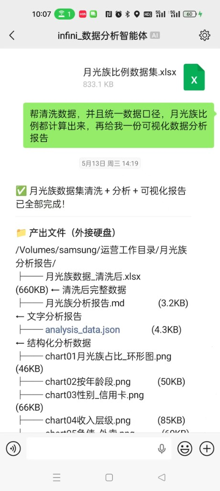
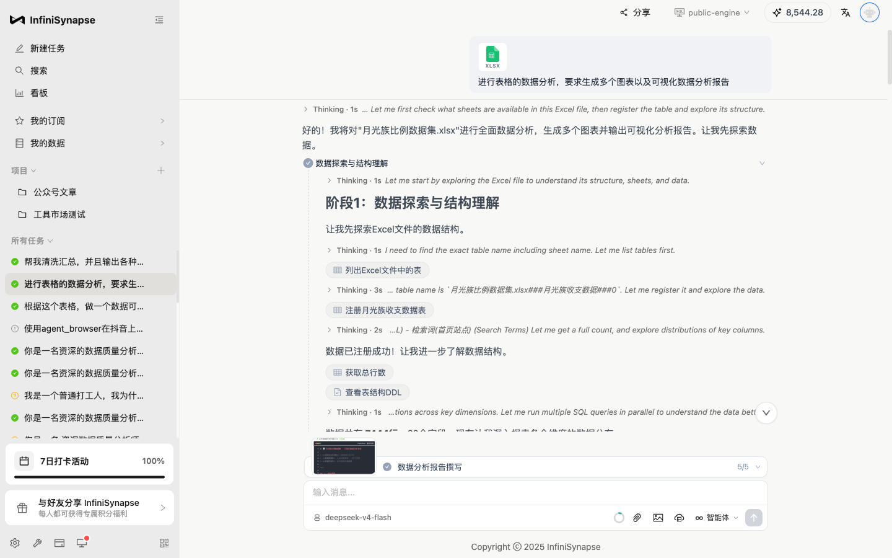
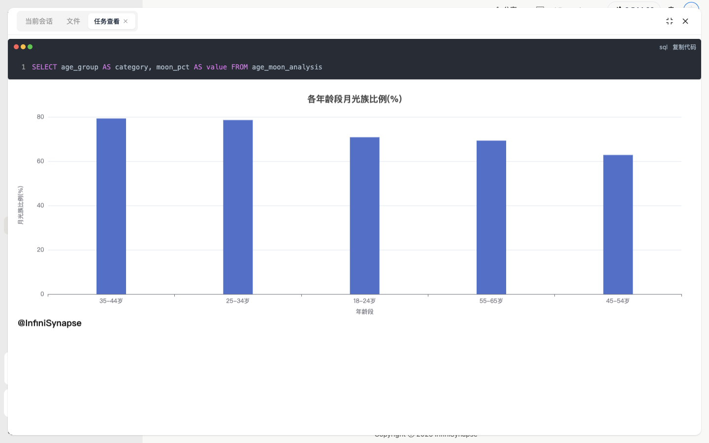
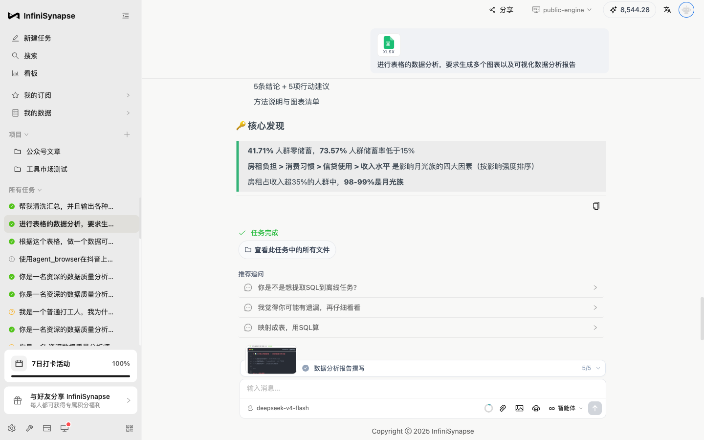

# 领导在我开会时甩来一个 833KB 的 Excel——3 分钟后我"好的👌"了三个字，把整份分析报告甩了回去

## 14:13，下午的会议刚进行了不到二十分钟

那是个普通到不能再普通的周三下午。

我坐在客户公司的会议室里，投影仪上是对方运营总监的 PPT 第 7 页，空气里飘着速溶咖啡和打印机墨粉混在一起的那种味道。我手机扣在会议桌上，屏幕朝下——这是我跟自己定的规矩，开会不看手机。

但它震了一下。又震了一下。

我下意识翻过来瞟一眼锁屏——是领导。

> **"把这个表格清洗了，里面该算的算出来"**
>
> *📎 月光族比例数据集.xlsx · 833.1 KB · 未下载*

短短一句话，但凡干过数据这一行的人，看到这十几个字心率会立刻 +20。**"清洗"** 听起来温柔，实际是要把字段类型一个个对、空值一格格补、口径一条条统一；**"该算的算出来"** 更狠，翻译过来就是"你看着办，反正得有结论"。这种活，顺利的话两三个小时，不顺利的话能从下午磨到深夜。

而我此刻——

- 笔记本没带
- 电脑在公司办公室，离我足足十公里
- 会议至少还要再开一个半小时
- 客户的运营总监正讲到第 8 页，我刚点头说了句"嗯，您接着"

按往常的剧本，我会回一句"收到，会议结束马上搞"，然后整个下午都心不在焉。会议一散就飞奔回办公室，趴电脑前一边喝速溶咖啡一边写 Python，中间被领导追问两次进度，加班到晚上八九点才把东西交出去，整个人从里到外被那个 833KB 的 Excel 吊着打。

但这次，我做了点别的事。

我把手机端在桌子下面，用一只手在键盘上飞速敲了三个字：

> **"好的👌"**

然后切到龙虾。

---

## 龙虾连过去，办公室那台 Mac 就在我手心里

很多人以为远程办公是"用手机跑 Excel"——不是的。我用的龙虾，**是把办公室那台 Mac 的屏幕原原本本搬到我手机上**，我所有的浏览器登录态、所有的 IDE、所有该有的环境一秒不少。

我看着会议主讲，同时手指在桌下完成了三件事：

1. 在那台 Mac 的微信里点开领导发来的 xlsx，让它老老实实下载到本地
2. 浏览器开 `app.infinisynapse.cn`
3. 把 xlsx 直接拖进对话框，然后打字：

> *"帮清洗数据，并且统一数据口径，月光族比例都计算出来，再给我一份可视化数据分析报告"*

回车。然后我把手机重新扣在桌上，抬起头，假装我刚才一直在认真听。

整个过程，连一分钟都不到。

---

## 14:19，会议中场，我看到了一份完整的报告

会议进行到 14:25 左右，主讲叫休息五分钟。我端着杯子去接水，顺手翻开手机。

屏幕上明晃晃显示着任务完成时间——**14:19**。我盯着那条 ✅ 看了三秒，整个人很恍惚。**从我 14:14 把 xlsx 拖进对话框那一刻算起，整套活——清洗、分组、跑 SQL、画 12 张图、写完整报告——它只用了 5 分钟**。按我对自己那套手工脚本的了解，光是"打开 xlsx 跑出第一张图"就至少要 40 分钟。

我点开任务详情，[完整回放在这里](https://app.infinisynapse.cn/tasks?taskId=bff6f71f-cc41-440c-9853-b786f543c6c0&share=1)：

不是那种"把数据塞进去，它丢一张折线图回来糊弄你"的玩法。它**像一个真正的分析师那样，自己把这件事拆成了五段**，一段一段做，段段交差：

| 阶段 | 它干了啥 | 我盯着它干的时候是什么感觉 |
|---|---|---|
| **1. 数据探索** | 自动认出 Excel 里的 sheet，注册成可查询表，跑 DDL 看字段，count 出 **7,444 行 × 22 字段** | "嗯还行，这步谁都会" |
| **2. 数据清洗** | 检查空值、异常值、把混着 `10k-15k` / `1万` / `420k-425k` 的收入区间统一了 | "诶这步它居然主动做了，我都没提醒它要洗" |
| **3. 多维分析** | 按年龄／性别／收入／负债／副业／社保／信贷／外卖／奶茶咖啡，一口气并行跑了 8+ 个分组 SQL | "等等，这是它自己想出来要看这些维度的？" |
| **4. 图表生成** | 自己加载 ECharts 文档，选合适图型，**一气呵成 12 张图**——饼图、柱状图、分组柱、水平柱、双轴、雷达，都有 | "我自己画都没这么齐全" |
| **5. 撰写报告** | 把上面所有发现拼成一份完整 `.md` 报告：摘要 + 5 大核心发现 + 9 个维度专题 + 高危画像 + 行动建议 | "它在帮我攒 KPI" |

而且每一步都**留痕**。点任意一个步骤行，右边会弹出当时跑的那条 SQL 和它产出的数据表／图本身，长这样：

这个能力对我来说是救命的。因为我太熟悉那种场景了：领导某天突然问"你这 41% 是怎么算的"，你打开两个月前的 Jupyter notebook，看着那一大坨自己当时随手写的 SQL 一脸蒙——这种 **"AI 干完留底"** 的能力，等于我以后再也不用解释"这数到底咋来的"了，因为它给我留了视频回放。

---

## 它从那 833KB 里挖出了什么

我翻到报告正文那部分，滑动屏幕，一边看一边小声"我去"：

- **41.71%** 的样本零储蓄，73.57% 的人储蓄率不到 15%
- 月光族最重灾区是 **35–44 岁**，比例 **79.29%**——上有老下有小那个年纪
- 同年龄段里，**男性月光率全段位高于女性**（这个我真没预判到）
- 月薪 **10k–15k** 那档，月光族比例最高，**91.39%**——典型的"看着体面，月底吃土"
- 房租占收入 **>50%** 的人里，**99.26%** 是月光
- 月点外卖 **30+ 次** 的人，**98.92%** 是月光
- AI 还自己排了一个**影响强度顺序**：房租负担 > 消费习惯 > 信贷使用 > 收入水平

它给的最终结论是这么写的：

> *"月光不是因为收入低，是因为房租 + 消费习惯 + 信贷三件事咬合起来，把储蓄空间挤没了。"*

我读完这句话又愣了一下。因为这话不只是"算出来的"，它是 **"想明白的"**。833KB 的原始 xlsx 进去，出来的是一句**有判断的总结句**——这一步以前是我作为人的最后一道护城河，现在 AI 也踏过来了。

---

## 14:35，我把成果发了回去

会议恢复，我趁主讲翻 PPT 那个空档，用龙虾把 InfiniSynapse 生成的 `.md` 报告 + 12 张图 + 清洗后的 xlsx 打包，在那台办公室 Mac 的微信里，一键发给了领导。

**从领导发来那条 14:13 的微信，到我把成品甩回去，前后总共 22 分钟。而我本人投入的工作量，是：一句话 prompt + 一次拖文件 + 一次打包发送。** 大概率连 90 秒都没用到。

会议散场已经下午 5 点，我刚走出客户公司大门，领导回了句：

> *"快，干净，图表还挺好看。下次开会就用这个。"*

我一边看一边笑。因为他不知道——

- 我那时候**根本不在公司**
- 也**根本没碰过那个 xlsx**
- 我甚至**没看清那 22 个字段叫啥**

---

## 三句话，给在会议室里收到 xlsx 的你

1. **远程办公的瓶颈早就不是"屏幕能不能连上"了**——屏幕这事龙虾五年前就解决了。真正的瓶颈是"连上以后干活快不快"。
2. **AI 给你的不是"快一倍"**——是把一件三小时起跳的活，压成三分钟；而且不挑你在哪儿、坐没坐在电脑前。
3. **下次老板临时丢一个 Excel 给你，而你正巧不在桌前**——你回那句"好的👌"的时候，可以理直气壮。因为三分钟以后，报告真的就在他邮箱里了。

那天散会出来，我在客户公司楼下点了杯咖啡，一边走一边想：以前我们说 AI 帮我们"做事"，那是上一代说法；这一代，AI 是**替我们到场**。

我人不在办公室，但 InfiniSynapse 在；我没碰过那个 xlsx，但报告已经在路上。**会议室里那条让我手心冒汗的微信，最后变成了一次几乎没出手的胜利。**

---

> **任务完整回放**：[InfiniSynapse 任务分享链接](https://app.infinisynapse.cn/tasks?taskId=bff6f71f-cc41-440c-9853-b786f543c6c0&share=1)
> 数据集：月光族比例数据集（7,444 样本 × 22 字段）
> AI 用时：5 分钟（14:14 → 14:19）· 全流程：22 分钟（14:13 → 14:35）· 我本人投入：1 句 prompt + 1 次发送
