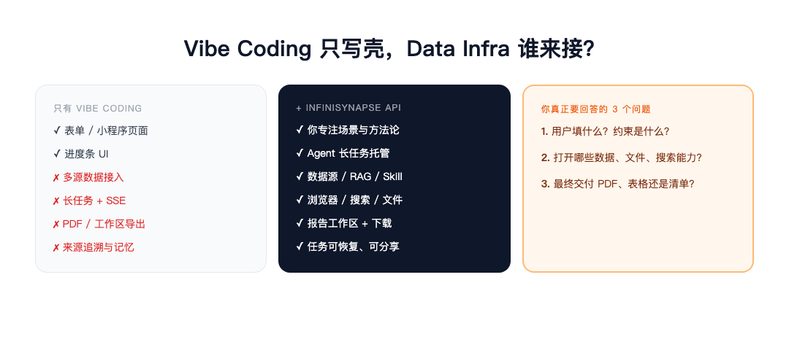
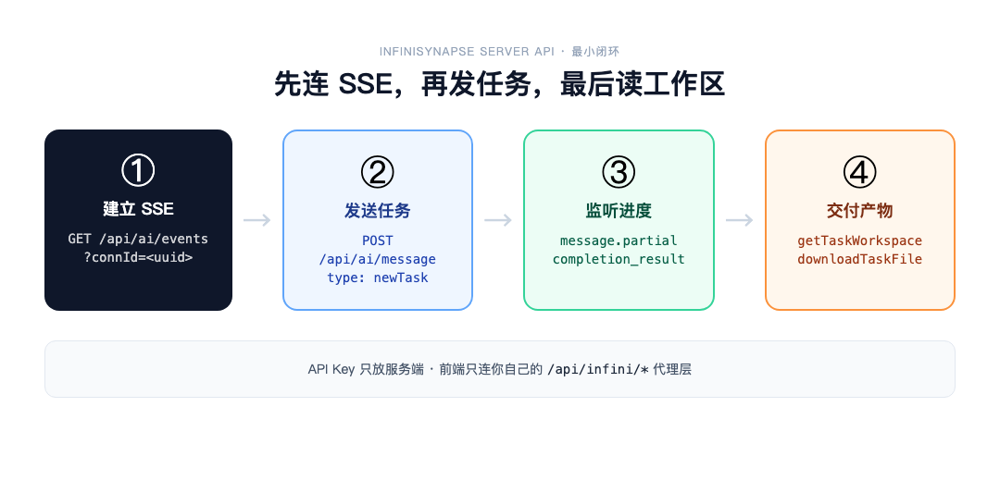

# 凌晨两点，页面写完了——然后卡在「谁来查数据」

> InfiniSynapse 官方 · 2026 年 6 月 · 给 Vibe Coder 的 API 入门

**小陈**是个产品出身的 Builder。Cursor 里一句话，表单页、进度条、结果展示卡片，三小时全出来了。

他要做的是「租房通勤分析助手」：用户填预算、公司地址、可接受通勤时间，系统给出候选片区、地铁线路和租售比对比——**不是聊天框里一段文字，是一份能转给室友讨论的 PDF**。

凌晨两点，他盯着 localhost:3000 上漂漂亮亮的 UI，突然意识到：**壳有了，后面那条看不见的长链路，一条都没接。**

文件怎么解析？公开房源和地铁数据从哪来？Agent 跑五六分钟，前端怎么知道进度？最后 PDF 存在哪、怎么下载？用户刷新页面，任务会不会丢？

他在 GitHub 上搜了一圈「agent backend」，看到的要么是 Demo 级 wrapper，要么得自己搭一整套任务队列、沙箱、存储。**他真正想做的，只是把自己的行业判断变成一个小应用。**

如果你也处在这种「页面已 vibe 出来，Data Infra 还没着落」的状态——这篇文章是写给你的。

---

## 个人决策，本质上都是数据分析

提到「数据分析」，很多人第一反应是企业：销售看 GMV，运营看留存，数据团队写 SQL， BI 做看板。但换个角度看——

**填志愿、买东西、选工作、租房子、看体检报告——普通人每天做的关键选择，和企业里的 GMV 分析、留存分析，底层是同一件事：**

获取信息 → 结构化 → 计算比较 → 交付可复核的结果。

差别在于：企业的数据在数据库里，个人的数据散落在网页、 PDF 、平台评论、聊天记录和自己的约束条件里。普通人不是缺信息，**缺的是一个愿意搜索、计算、验证、并把结果交付出来的分析师**。

AI 搜索给摘要，通用聊天给观点。但用户要的不是「几个品牌不错」，而是：

- 500–900 元降噪耳机，**券后价**各平台差多少？
- 差评集中在佩戴还是售后？
- 你常开会 → 麦克风权重应高于低频；
- 最后选哪一个、备选哪一个、**哪个不要买**——加购物车可以，**不替你付款**。

这不是问答，是**决策交付**。Vibe Coding 最擅长的是把「决策交付」包装成好用的界面；难的是后面那串企业级 Data Agent 能力——文件、数据源、长任务、工作区、导出、记忆。

> [!important] 别重写 Agent 平台
> 用 Vibe Coding 做**场景壳**，用 InfiniSynapse **承接 Data Infra**。你专心行业方法论，长链路交给 API。



*图 1：左边是你一晚上能 vibe 出来的；中间是 InfiniSynapse 已经下沉好的能力*

---

## 样板已经在了：同一套 Data Infra，不同的壳

`infinisynapse.cn` 上几个小应用，表面毫无关系，底层完全一致：

| 应用 | 用户看到的 | 背后同一套能力 |
| --- | --- | --- |
| 高考报考选校 AI 助手 | 省份、分数、冲稳保 PDF | 表单输入 + 数据源 + 长任务 + 报告导出 |
| 省钱比价助手 | Chrome 登录态比价、加购不付款 | 浏览器插件 + Agent + 用户确认边界 |
| 报告快写 | 上传资料、可编辑正文、来源追溯 | 工作区产物 + PDF/Word + Skill 上下文 |

它们回答的三个问题，也是你做第一个 API 应用时要写清楚的：

1. **用户填什么？** 约束、偏好、不可接受项。
2. **打开哪些能力？** 数据库、 RAG 、网页搜索、浏览器、文件上传。
3. **交付什么形态？** PDF 、表格、清单、评分卡，还是可分享页面。

剩下的——SSE 长连接、沙箱上传、任务恢复、扣费校验、工作区下载——**不必每个应用重写一遍**。

---

## 一条真实故事线：从表单到 PDF，API 怎么接

回到小陈的租房助手。他不需要造 Agent 平台，只需要在后端加一层**薄代理**，持有 API Key，转发 InfiniSynapse 请求。



*图 2：时序别搞反——先 SSE，再 newTask，同一个 connId 贯穿全程*

### 第一步：拿 API Key（只放服务端）

1. 登录 [app.infinisynapse.cn/tasks](https://app.infinisynapse.cn/tasks)
2. 左下角「设置」→ **API Key Management** → **Create API Key**
3. Key 写进后端环境变量 `INFINI_API_KEY`，**不要**出现在前端或公开仓库

国内用 `.cn` 域名，海外用 `.com`；完整参考见 [InfiniSynapse Server API Reference](https://infinisynapse.cn/zh/docs/InfiniSynapse%20Server%20API%20Reference)。

### 第二步：建立 SSE，再发任务

长任务采用 **SSE 订阅 + 消息投递** 异步模式。顺序很重要：

```bash
# 1. 先订阅事件流（客户端生成 connId）
curl -N "https://app.infinisynapse.cn/api/ai/events?connId=550e8400-e29b-41d4-a716-446655440000" \
  -H "Authorization: Bearer <你的 API Key>" \
  -H "Accept: text/event-stream"

# 2. 再创建任务（同一个 connId）
curl -X POST "https://app.infinisynapse.cn/api/ai/message" \
  -H "Authorization: Bearer <你的 API Key>" \
  -H "Content-Type: application/json" \
  -d '{
    "type": "newTask",
    "connId": "550e8400-e29b-41d4-a716-446655440000",
    "text": "用户预算 6000 元/月，公司在国贸，可接受通勤 45 分钟。请结合公开地铁与租售信息，给出 3 个候选片区及风险说明，生成 PDF 报告。",
    "chatSettings": { "mode": "act" }
  }'
```

从 SSE 的 `message.partial` / `message.add` 读进度；收到 `completion_result` 后，任务才算跑完。

### 第三步：读工作区，下载 PDF

```bash
# 列出任务产物
curl "https://app.infinisynapse.cn/api/ai_task/getTaskWorkspace/<taskId>" \
  -H "Authorization: Bearer <你的 API Key>"

# 下载报告文件
curl "https://app.infinisynapse.cn/api/tools/storage/downloadTaskFile/<taskId>?path=report.pdf" \
  -H "Authorization: Bearer <你的 API Key>" \
  -o report.pdf
```

你的前端只请求自己的 `/api/infini/*`；**InfiniSynapse 的域名和 Key 永远在后端**。

### 给 Codex / Cursor 的最小骨架

把下面这段丢给 AI，让它补成你的后端代理——比从零写 Agent 快一个数量级：

```javascript
const connId = crypto.randomUUID();

// 你的后端：先建立 SSE 转发，再 newTask
const taskRes = await fetch("https://app.infinisynapse.cn/api/ai/message", {
  method: "POST",
  headers: {
    Authorization: `Bearer ${process.env.INFINI_API_KEY}`,
    "Content-Type": "application/json",
  },
  body: JSON.stringify({
    type: "newTask",
    connId,
    text: "根据用户表单生成租房通勤分析报告，输出 PDF",
    chatSettings: { mode: "act" },
  }),
});

// completion_result 后
const workspace = await fetch(
  `https://app.infinisynapse.cn/api/ai_task/getTaskWorkspace/${taskId}`,
  { headers: { Authorization: `Bearer ${process.env.INFINI_API_KEY}` } }
);
```

> [!tip] 第一次试用，先跑通「无私有数据」短报告
> 等 SSE、工作区、下载都通了，再接 MySQL、 RAG 、文件上传和 Chrome 插件。失败路径也要设计：`newTask` 失败直接报错；SSE 断开用 `taskId` 拉 `getUiMessageById` 恢复。

---

## 两条路：HTTP API 还是 Command Tools？

:::dialogue[和小陈的对话]
小陈: 我主要用 Cursor vibe 前端，后端还没想好。
InfiniSynapse: 走 **Server API**——Web、小程序、企业内部系统都适用，上面就是这条路。
小陈: 我人已经在 Claude Code / WinClaw 里，想直接让 Agent 查数写报告呢？
InfiniSynapse: 走 **Command Tools**——`agent_infini task new "..."` 一条命令发起任务，`task download` 拉产物。入口见 [InfiniSynapse Tools](https://www.infinisynapse.cn/tools)。
:::

无论哪条路，**/tasks 控制台**都是你的开发者后台：API 发起的任务会出现在左侧 **ALL TASKS**，方便看消息记录、执行过程和工作区文件。

需要更稳定配额时，可在右上角计算资源菜单创建 **Exclusive Compute Resource**，从公共 `public-engine` 切到独占环境。

---

## 资源、Skill、上传：任务创建前要准备好的

API 文档第 10 节「典型调用流程」里有一条容易忽略的前置步骤：

**在 `newTask` 之前**，如果 Agent 需要数据库或知识库，先完成订阅并启用：

```bash
# 列出并启用数据源
curl "https://app.infinisynapse.cn/api/ai_database/list?source=all" \
  -H "Authorization: Bearer <你的 API Key>"

curl -X POST "https://app.infinisynapse.cn/api/ai_database/enabled" \
  -H "Authorization: Bearer <你的 API Key>" \
  -H "Content-Type: application/json" \
  -d '{"ids": [1], "enabled": 1}'
```

报告类应用还可把含 `SKILL.md` 的方法论作为**单次任务上下文**上传，或走 `/api/ai_skill/upload` 安装为用户级 Skill——Agent 会通过 `use_skill` 加载。

购物/网页研究类应用，先用 `GET /api/ai_browser/session` 确认 Chrome 插件是否在线。

这些能力单拎出来每一个都是小项目；**InfiniSynapse 把它们下沉成 Data Infra**，你只在 prompt 和业务流程里声明「用什么、交付什么」。

---

## 克制，才是个人场景里最大的信任

把 Data Infra 开放给 Vibe Coder，不意味着 Agent 可以替用户做高风险决定。

现有应用的边界已经写死在产品里：

- 购物：**加购物车，不付款**
- 高考：**给分析与核验项，不提交志愿**
- 报告：**强调来源追溯，人类可修订**

泛数据分析应用卖的不是「 AI 说了算」，而是**少踩坑、少花冤枉钱、把家庭争论变成可讨论的依据**。API 集成时，把「必须用户确认」的步骤写进 `autoApprovalSettings` 和业务逻辑——这是产品信任的一部分，不是技术细节。

---

## 今晚就可以开始的四步

1. **选一个足够小的场景**——招聘候选人简报、保险方案对比、政策速读都行；别做「万能分析助手」。
2. **把行业方法写成任务流**——必填字段、可用数据源、交付格式、必须带来源的结论。
3. **登录控制台创建 API Key**，让 Cursor 读 [Server API Reference](https://infinisynapse.cn/zh/docs/InfiniSynapse%20Server%20API%20Reference)，生成「前端薄壳 + 后端代理」。
4. **跑通最小闭环**：表单提交 → SSE 进度 → 工作区 PDF → 用户下载。

小陈后来没再纠结要不要自建 Agent 平台。他把通勤权重、片区风险 checklist 写进 prompt 和 Skill，后端 fifty 行代理代码接上 InfiniSynapse——**周末 demo 能点，周一就能给真实用户试**。

> [!callout]
> Vibe Coding 把「我有一个想法」变成「我做出了一个界面」；InfiniSynapse API 把界面后面那条企业级分析链路，变成一行 Bearer Token 就能调用的基础设施。

---

## 参考链接

- [InfiniSynapse Server API Reference](https://infinisynapse.cn/zh/docs/InfiniSynapse%20Server%20API%20Reference) — 完整 HTTP 接口说明
- [app.infinisynapse.cn · API Key 管理](https://app.infinisynapse.cn/ai/apikey)
- [把数据分析从企业迁移到个人](https://mp.weixin.qq.com/s/9dLpt51YkabBNgm9-vnmrw) — 泛数据分析应用的产品思路
- [InfiniSynapse Tools](https://www.infinisynapse.cn/tools) — Command Tools / CLI 入口
- [高考报考选校 AI 助手](https://www.infinisynapse.cn/apps/gaokao-school-advisor?mode=guest) — API 样板应用之一

---

**你最近在 vibe 什么场景？** 评论区聊聊——如果我们觉得足够典型，下一篇可以把它写成「从零 API 集成」的完整 walkthrough。
