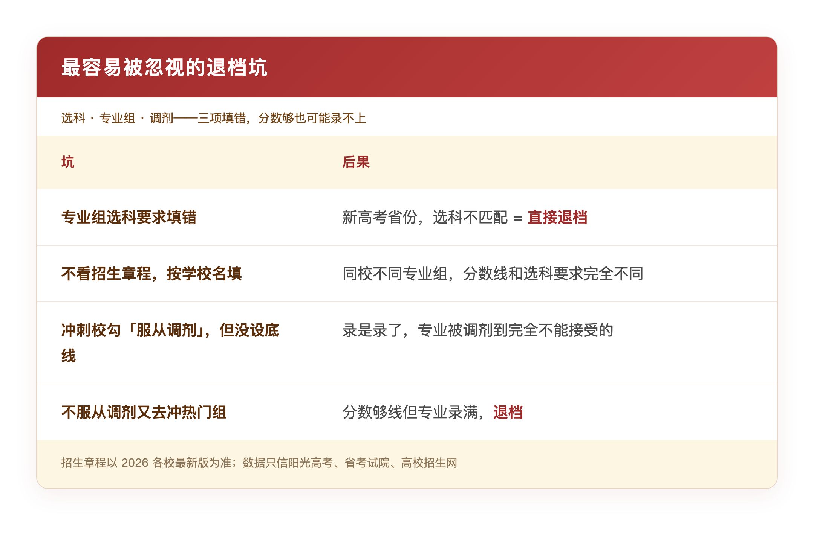
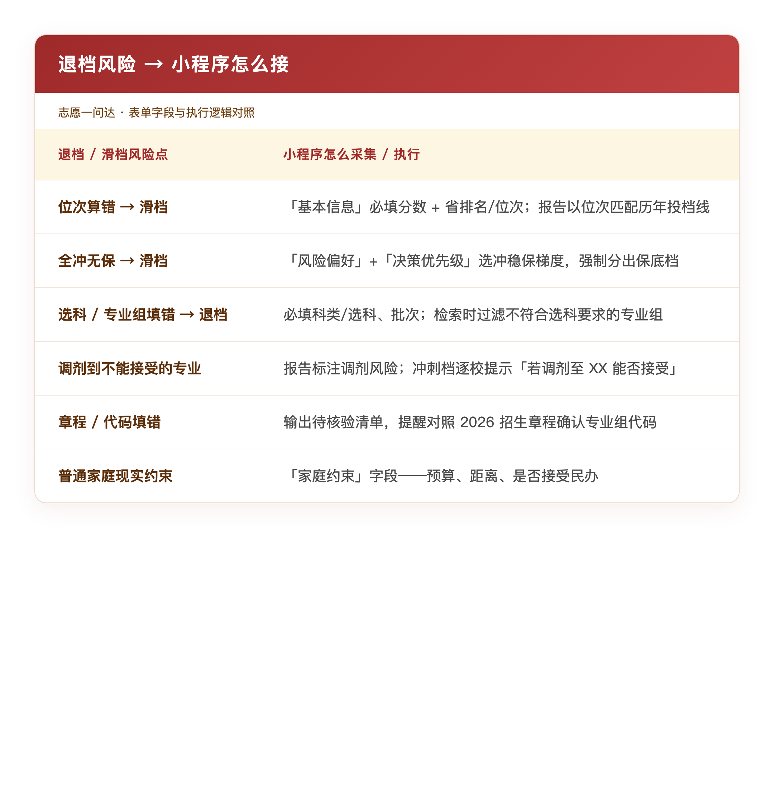
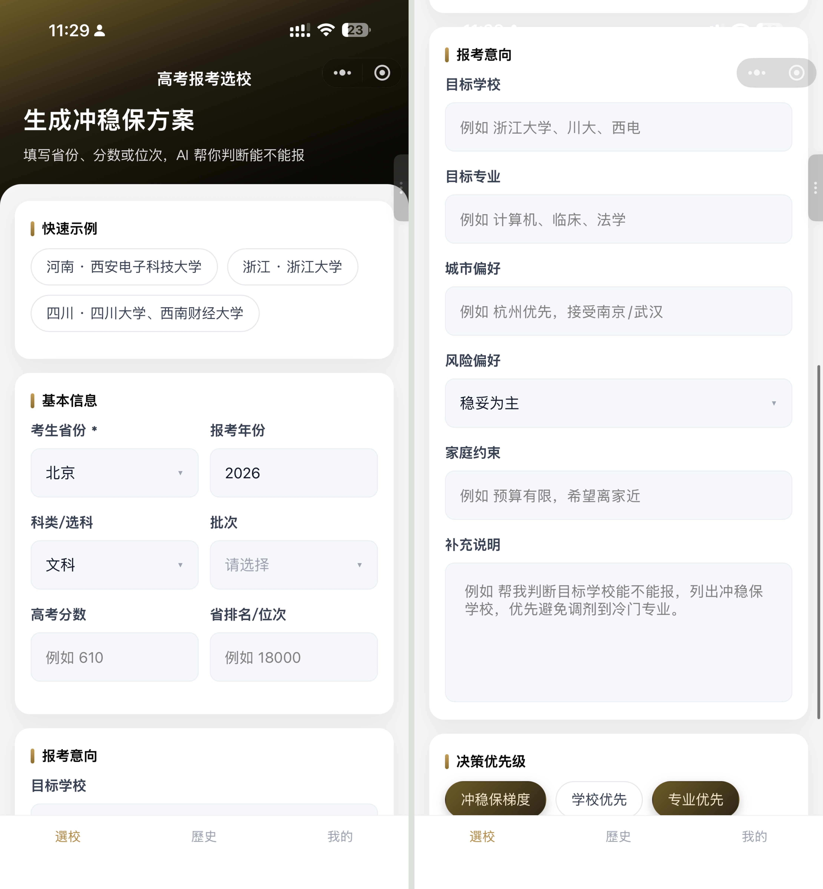
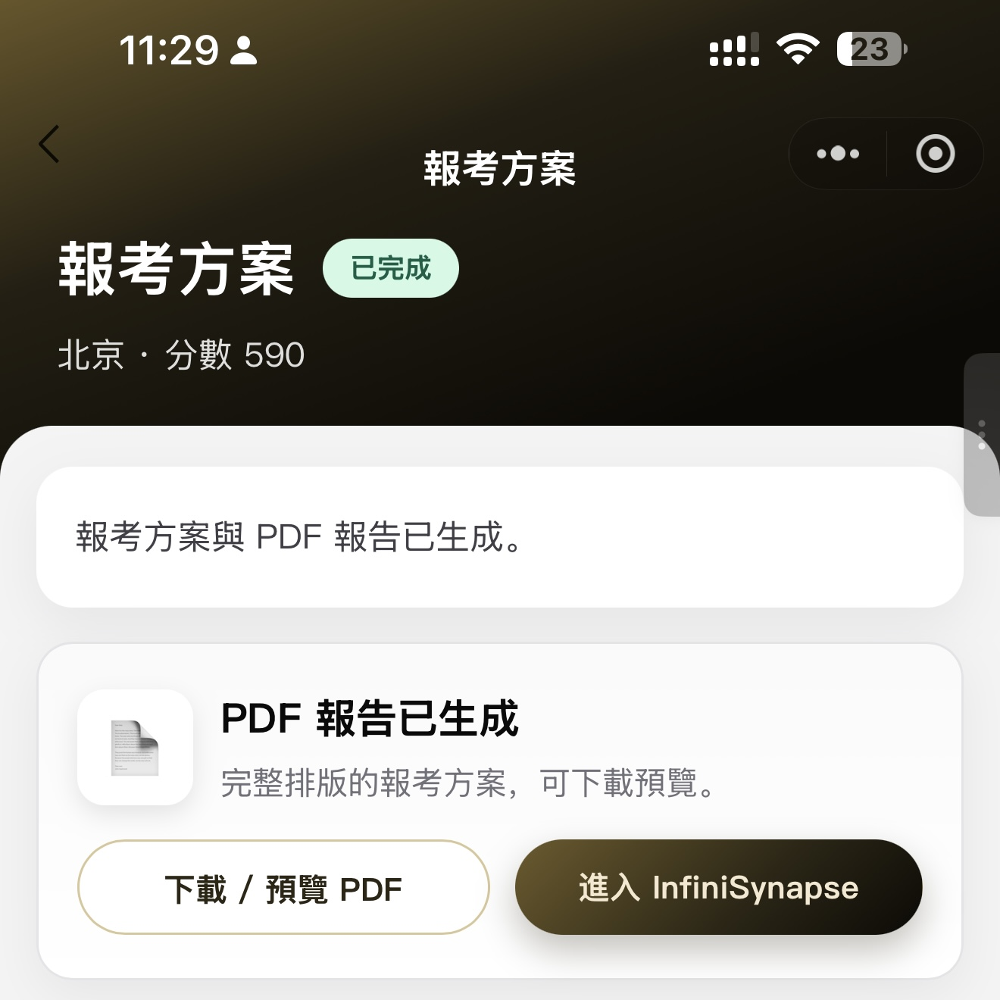
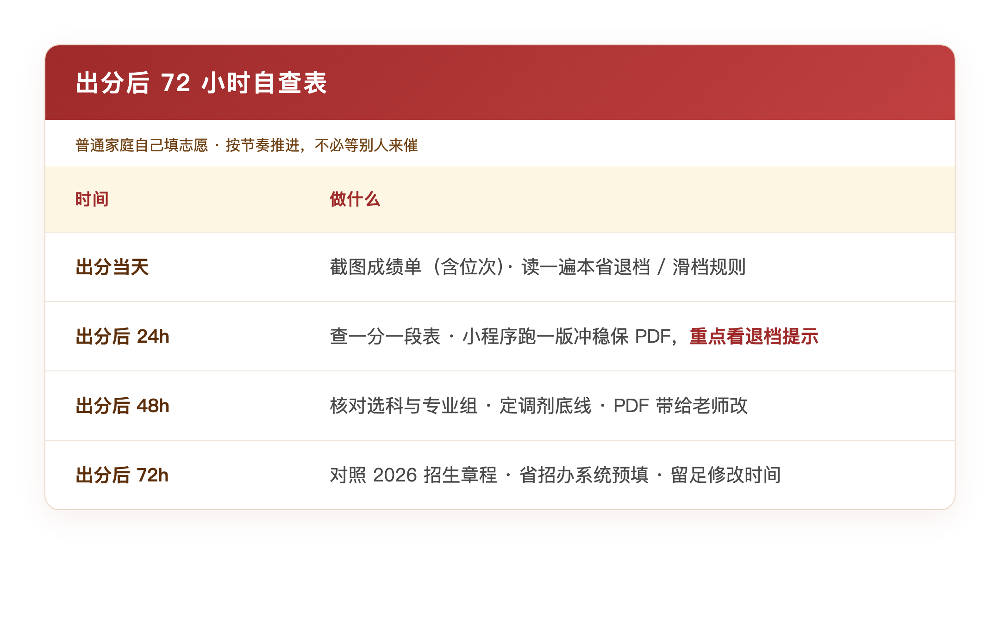
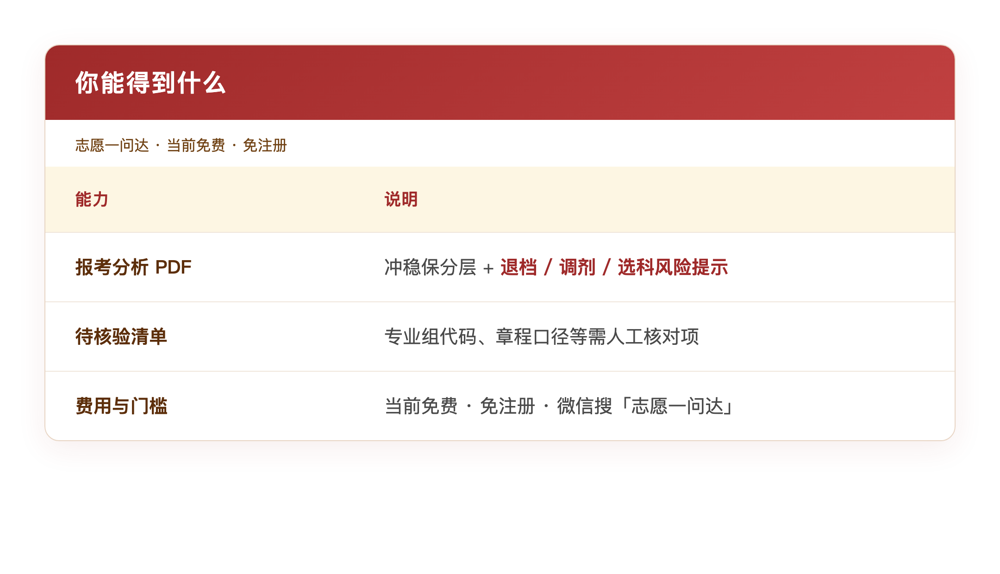
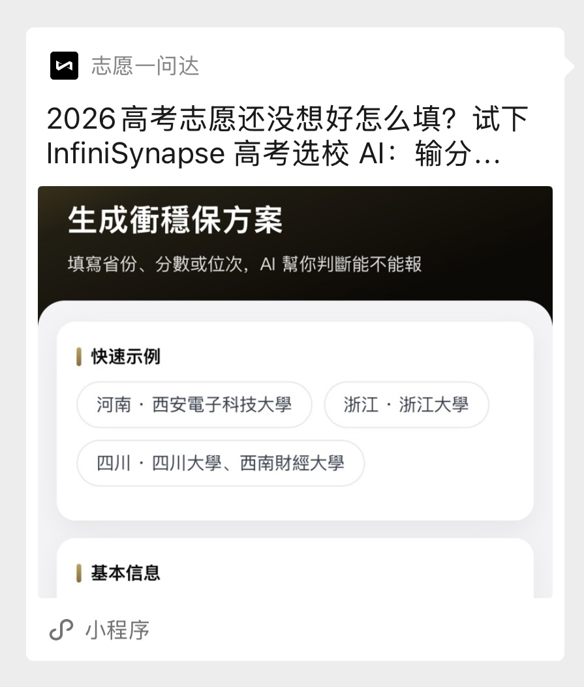
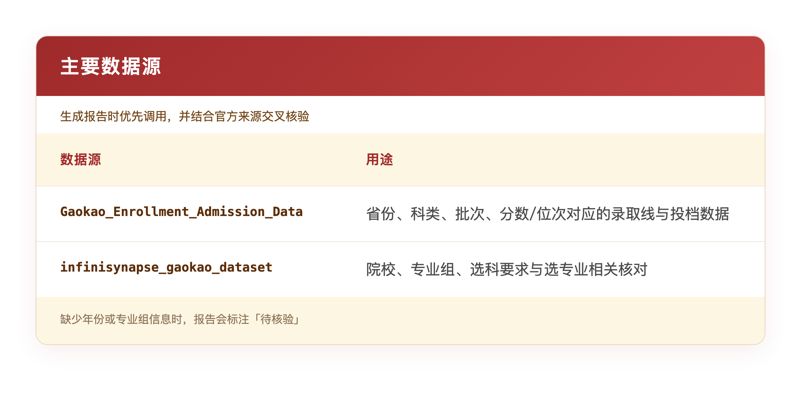

# 普通家庭大学生如何自己填志愿？出分后 72 小时，先把这 6 件事算清楚

> InfiniSynapse 官方 · 2026 年 6 月 · 出分季

**6 月 25 日前后**，各省陆续出分。手机还亮着——家族群里有人甩过来一条 5500 块的「报志愿服务」，说**帮忙填志愿、保证你上大学**；底下立刻有人接话：**不会填啊，很麻烦的——滑档、被退档，就录不上了。**

你打了句 🥺，「啥时候报志愿也要钱了」，想想又删了。心里真正盘旋的是另一句：**我自己填，会不会填错？填错了，是不是就没学上了？**

下面这张截图，是我们一位同事家里群聊的截屏——**已脱敏**，对话没动过。出分季，类似的话我大概每天都能看见一回。

*图 1：「滑档被退档就录不上」——普通家庭志愿季最重的焦虑，往往就这一句*

---

## 你真正怕的，多半不是分低

是「填错一次，就没学上」。

网上爱聊「冲 985 还是稳 211」。可普通人家最先炸毛的，往往是另一个词：**退档**。

**滑档**，说的是位次够不着你填的所有学校，这一批一个都没录上；**退档**更磨人——学校收了你的档，却因为选科不对、单科不够、不服从调剂之类的原因，把你退回来，这一批的机会可能就废了。

十二年熬出来的分，最后栽在填志愿那几十分钟、勾错一个选项上——这种事我听过太多次。

机构也最懂这种怕。「5500，保证上大学。」你买的，或许不是那所学校、那个专业，而是「别录不上」四个字带来的踏实感。

---

## 出分后 72 小时：自己填，先把「什么情况下会退档」弄明白

张雪峰有句话挺扎心：**普通家庭的孩子，没有关系、没有背景，填志愿先别琢磨面子，别填错、别退档、别滑档才是正经事。** 他团队在志愿季翻来覆去讲的，说到底就一条——**会退档的坑先标出来，再谈冲稳保。**

*图 2：没有背景托底，填错一次志愿的代价，往往比少考几十分更大*

### 位次不对，后面全白搭

出分那天，先把成绩单截图存好——总分、单科、**全省位次**，纸质版也备一份。填志愿的时候，别老盯着「比一本线高多少分」，**位次**才是跟历年投档线说话的语言。再翻本省**一分一段表**，把自己的区间钉死。

> [!important] 位次 > 裸分
> 位次搞错，冲稳保跟着全歪——滑档里，我见过的第一大原因就是这个。

### 冲稳保不是名气排行榜，是在分「退档概率」

张雪峰老说：**别带着情绪填志愿。** 出分后 48 小时，能冷静就尽量冷静。按位次划出冲刺、稳妥、保底三档，保底一定要留——**12 个格子全填冲刺，那是在赌。** 每一档都问自己一句：录是录了，调剂到某个专业，我接不接受？不接受，就从冲刺名单里划掉。也别拖到最后一天，手抖填错，退档风险会高很多。

### 选科、专业组、调剂——这三样最容易埋雷

*退档最常见的四类填法错误——选科、章程、调剂，任意一项踩坑都可能录不上*

### 查分别在诈骗上栽跟头

走**省考试院官网或官方公众号**就行；「内部通道」「付费提分」一律当骗子处理。分数跟估分差得离谱，在官方时效内去申请**成绩复核**——只核合分，不重阅。

---

## 「怕退档」怎么变成能填进表格的信息？

上面这些，听多了像常识。可真对着指南和位次表坐下来，缺的是一份**能把风险标出来的草案**。

我们做的微信小程序「**志愿一问达**」（InfiniSynapse 高考报考选校 AI 助手），表单和执行逻辑就是围着这些坑转的：

*每一种滑档 / 退档风险，都对应小程序里的采集字段或报告输出*

它不是聊天模型随口编一份学校名单——该问你的先问齐，再去对接录取数据，**哪里可能退档，尽量标出来。**

---

## 打开小程序，把自家情况一次填完

family group 里跟 5500 吵值不值，吵不出结果。不如先打开「志愿一问达」，**把情况写清楚**。

*图 3：省份、科类、分数、位次、目标专业、家庭约束——填的是后面算退档风险的输入*

下面这组字段，跟下方报告截图对得上，你可以照着填：

- **考生省份**：北京 · **科类**：文科 · **分数**：590 · **位次**：18,247  
- **目标专业**：计算机、电子信息、法学 · **风险偏好**：稳妥为主  
- **家庭约束**：预算有限，**不接受高学费民办** · **决策优先级**：冲稳保梯度  

**「家庭约束」那一栏，终于有个地方能写读不起——不用装阔气冲名校，再怕调剂到天坑。**

---

## 等报告的几分钟，别干刷手机

提交之后，后台开始跑方案。那几分钟空档，我建议你做一件小事：上省考试院官网，把**平行志愿投档规则**和**退档情形说明**读一遍。

怕什么搞明白了，「5500 保证上大学」就没那么容易唬住你。多数报告 **4–10 分钟**能出来，完成后在「历史」里找得到。

---

## PDF 下来之后，看每一档的「退档 / 调剂」提示

*图 4：北京 · 分数 590——方案已完成，可下载 PDF*

*图 5：冲稳保分层，附选科匹配、调剂风险与待核验事项*

一份还算有用的草案，起码得帮你回答这几件事：

**冲刺档**——哪所能冲，调剂风险有多高；不能接受的专业，宁可不冲。**稳妥档**——位次真正够得着的学校，历年投档位次摆在那儿。**保底档**——位次明显低于你的排名，「录不上」的底在这儿。**待核验事项**——专业组代码之类，得对着 2026 招生章程自己核。

> [!tip] 给普通家庭的一句实话
> 工具吐出来的是**草案**，不是「保证上大学」。我自己会走的流程：**小程序跑 PDF → 打印带给老师改 → 对着招生章程逐条核退档风险点 → 自己在省招办系统里提交**。  
> 5500 买不来不退档，但 0 元可以先算一版「哪里可能退档」。

---

## 出分后 72 小时，可以按这个节奏走

*按节奏推进，不必等别人来催*

---

## 先算一版「退档风险在哪」

family group 里见过「5500 保证上大学」，或者半夜搜过「滑档了怎么办」——

*图 6：转给 family group 里同样怕退档的人*

**👉 微信打开小程序：志愿一问达**

（小程序路径：`#小程序://一问达/obvTridfkgkweAm`）

---

## 写在最后

查分几家欢喜几家愁，太正常了。

可对普通家庭来说，志愿季最沉的那块焦虑，常常就是家族群里那句：**「不会填。滑档、被退档，就录不上。」**

张雪峰老强调的位次、冲稳保、选科、章程、调剂底线——真轮到自己动手填那 12 个志愿格子，手会抖。这时候需要的，可能不只是一句「别慌」，而是一份能把「哪里可能退档」标出来的草案。

**填志愿终究是你自己的事。** 5500 可以不买，退档的坑，出分后 72 小时里自己先看一遍，值。

出报告后，评论区聊聊：你最怕滑档还是退档？PDF 里哪条风险提示帮了你——我们也想看看，下一版还能帮到谁。

---

## 主要数据源

生成报告时，助手会优先调用以下订阅数据集，并结合官方来源交叉核验：

缺少年份、学校级分数线或专业组信息时，报告会标注**「待核验」**，并建议对照以下来源：

- **教育部、阳光高考**（moe.gov.cn、gaokao.chsi.com.cn）——政策、院校库、专业目录  
- **省级教育考试院**——一分一段表、批次线、投档规则  
- **高校本科招生网**——分省分专业计划、历年录取分、2026 招生章程  
- **就业质量报告、本科教学质量报告**——专业去向与培养质量参考  

> **免责声明**：本工具输出仅供参考，不构成正式报考建议。最终志愿以各省教育考试院填报系统为准，请对照最新招生章程核验。
