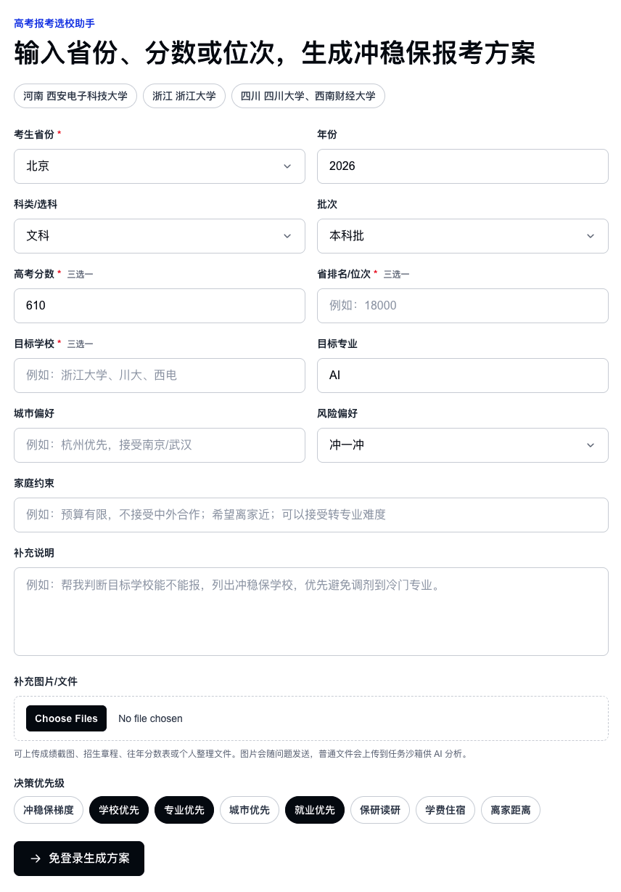
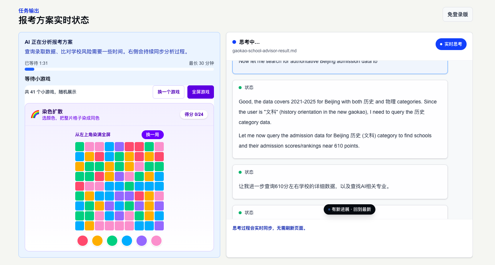
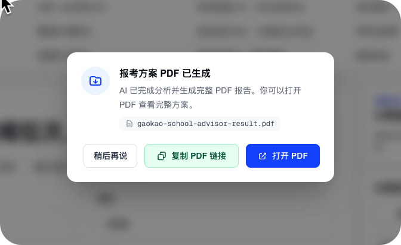
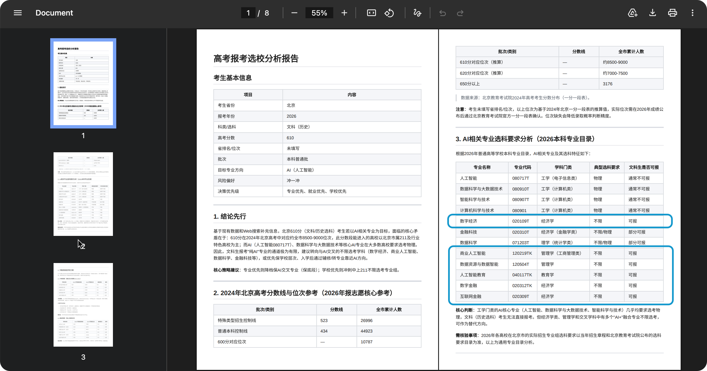
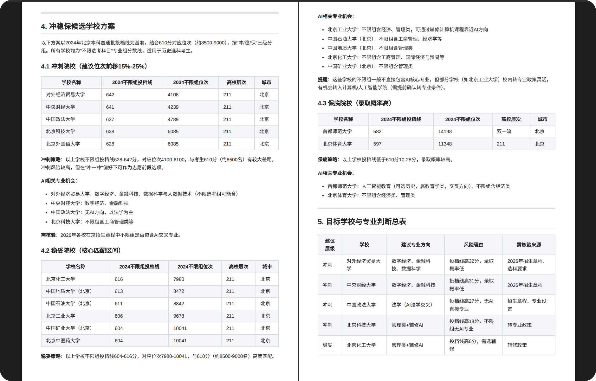
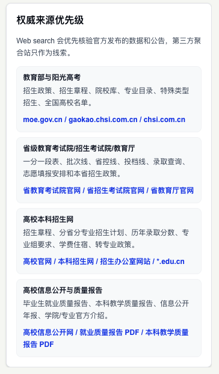
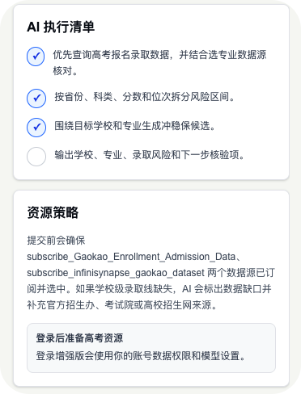
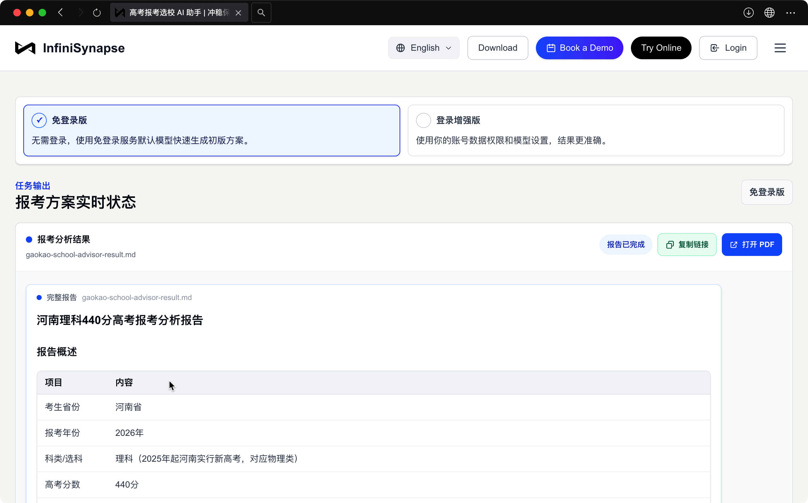

# 「文科生想学 AI」如何择校？ AI 只用 4 分钟出了一份专业冲稳保报告

> InfiniSynapse 官方 · 2026 年 6 月

昨天我们公司实习生跟我聊起她妹妹 **W**：北京文科，**高考刚考完**，成绩还没正式出来，对照答案估下来 **大概 610**。W 已经睡不着了，只跟姐姐说了一句：「我就想进 AI 行业，别给我填中文系。」

要是放在前几年，这种情况怎么办？我跟实习生回忆了一下：**无非三条老路**。一是去新华书店搬回一摞比砖头还厚的《报考指南》，一页页翻分数线、抄位次，眼睛看花也拼不出一张冲稳保表；二是几千块钱报个志愿填报机构，对方拿一套不知更新到哪年的 Excel 给你「一对一规划」，你也分不清哪条是数据、哪条是话术；三是干脆全家上阵——爸妈打电话问七大姑八大姨，谁家孩子去年考了多少、报了哪，凭一堆道听途说的「经验」去赌一个十八岁孩子的四年。**说到底，过去普通家庭面对志愿，要么靠人肉查数据查到崩溃，要么花钱买一个自己也没法核验的方案。**

而 W 这届更难：她们整届都在扛 **AI 焦虑**，**分还没出，选校选专业的慌先来了**；辅导老师在年级群喊「先查清选科和录取数据」，家长群里却吵成一片：「冲不冲？」「报不报？」老办法那点信息差，**根本接不住「文科生到底能不能沾 AI」这种新问题**。

听罢，我跟实习生说：要不先用公司的 **高考报考选校 AI 助手** 跑一版——我们把 InfiniSynapse 的录取数据能力封进了这个工具，**免费、免注册，估分也能先填**，几分钟就能下 PDF 预演版。比起翻书、花钱、问亲戚，至少它**敢把数据来源摊给你看**。

实习生把链接转给W。

---

## 第一步：填表，比想象中「正常」

界面很克制，没有满屏广告，也没有先让你扫码关注。

*图 1：省份、科类、估分/分数、目标专业一次填完；底部是「免登录生成方案」*

W 把信息一项项填进去：

- **考生省份**：北京  
- **科类**：文科  
- **高考分数（估分）**：约 610  
- **目标专业**：AI  
- **风险偏好**：冲一冲  

她愣了一下，发我说：「分还没定，它居然真让我填『AI』，不是让我从下拉框里选『汉语言文学』。」

——很多志愿咨询默认文科生「别乱想」，先把人按进传统赛道，**AI 焦虑就被一句「务实一点」盖过去了**。这个表单至少承认：**你的焦虑是个真问题，值得被算进去。**

我点下面那个黑按钮——「→ 免登录生成方案」。没有手机号，没有验证码，没有「关注公众号解锁完整版」，即可让 AI 开始分析。

---

## 第二步：一边打游戏，一边看 AI 真在查——全程只等了 4 分钟

提交之后，页面分成左右两栏——**左边消遣，右边干活，同步进行，不用干等。**

*图 2：左侧玩「染色扩散」；右侧实时滚动 AI 检索与推理过程*

**左边**是 **等待小游戏**（随机 41 款）。**右边**同时不是假转圈，而是一行行 **真实分析过程** 在往上滚——你玩游戏的时候，也能看见 AI 在干什么：

- 识别考生为 **文科（历史类）** 方向  
- 调取 **北京 2021–2025 年** 权威录取数据  
- 以 **估分 610** 为基准检索院校与专业组  
- 下一步：**查找 AI 相关专业与选科限制**  

W 说，最缓解焦虑的不是游戏本身，而是 **「我玩着，它也在认真查」**——两边屏幕一起动，等待从「不知道在干嘛」变成了「看得见进度」。

界面顶部写着预计最长 30 分钟，但 W 这份报告 **实际 4 分钟** 就出完了。往年等志愿咨询回消息，够刷完三个「文科末日」帖子；这一次，游戏刚开两局，右边日志已经跑到「生成冲稳保候选」了。

实习生也把 W 学校老师在年级群里发通知转发给我：「成绩出来前先估分预演，别干等出分再慌。用官方数据跑一版，别信截图。」

这正是 AI 焦虑的另一半：**怕错过 AI 红利，又怕被 AI 忽悠**——连老师都在找「能复核」的工具，何况学生。

我点头。这背后不是聊天模型随口编院校名单，而是 InfiniSynapse 订阅的专业数据集（如 `Gaokao_Enrollment_Admission_Data` 等）在做交叉核对；缺了某校某年分数线，报告里会 **老实标「待核验」**，不会让你以为「数据齐全」。**敢承认不知道，比装成全知更能让人安心一点**。

---

## 第三步：报告出来——把 AI 焦虑，从「恐慌」翻译成「路径」

W 等报告时最怕的，其实不是估分准不准，而是这两种念头在打架：

1. **不报 AI 相关专业，会不会四年后被行业甩下车？**  
2. **硬报计算机，会不会志愿填错、调剂进天坑，连「上车票」都没有？**

4 分钟后，弹窗跳出来：

*图 3：分析完成，可一键打开 PDF*

*图 4：报告开篇直接回答「文科估分 610 + 目标 AI」是否可行*

报告没有敷衍她说「加油你能行」，而是 **结论先行**：

- **核心工科 AI**（人工智能、计算机科学与技术等）多数要求 **物理**，文科 **通常不可报**  
- 但 **「AI+」交叉方向** 仍有路：数字经济、商业人工智能、数字金融、人工智能教育等，**选科要求为「不限」或兼容历史类**  
- 决策优先级建议：**专业 > 就业 > 学校**，与她的目标一致  

换句话说：不是「别做 AI 梦了」，也不是「全民转码」，而是 **「别硬撞工科门槛，改走数据智能、商业 AI 这类入口」**。

报告里有一句特别戳人——大意是：**核心工科 AI 路径对当前选科通常不适用，但「AI+」交叉方向仍可规划。** 它没有贩卖「不学 AI 就完了」的恐慌，也没有画「随便报个名就能进大厂」的饼，而是把焦虑拆成可执行的志愿动作。

> [!important] 给同样焦虑的家庭
> AI 焦虑最怕的不是「估分差几分」，是**在恐慌里乱填志愿**——要么盲目跟风报工科，要么彻底放弃、随便选一个「听说稳定」的专业。估分阶段先把「能不能报、报哪条赛道、冲稳保怎么排」算清楚，焦虑才会从弥漫的雾，变成看得见的几条路；正式出分后再校准一版即可。

下面几张表，才是 **班主任、升学顾问和认真做功课的考生** 最想看的硬货。

*图 5：冲刺 / 稳妥 / 保底院校分层，并标注各校 AI 相关机会*

**冲刺档** 提到对外经贸的数字经济、金融科技，央财的数字经济，政法、北外等校的交叉方向；**稳妥档** 梳理北工大、地大、石油、矿大等 211 的 **「不限选科」管理类 + AI 辅修/转专业」** 路径；**保底档** 也没糊弄，写了首师大「人工智能教育」等可落地选项。

每一档都带 **2024 参考分数线、位次、风险说明**，不是「学校名气排行榜」。

---

## 专业数据从哪来？——敢写来源，才敢让你核验

志愿填报最怕两种工具：一种瞎编，一种装懂。

这个助手在检索时有一套 **权威来源优先级**：

*图 6：教育部 / 阳光高考 / 省考试院 / 高校招生网优先；第三方聚合站仅作线索*

简单说：

1. **教育部、阳光高考**（`moe.gov.cn`、`gaokao.chsi.com.cn`）——政策、专业目录、院校库  
2. **省级教育考试院**——一分一段表、批次线、投档规则  
3. **高校本科招生网**——分省分专业计划、历年录取分、选科要求  
4. **就业质量报告、教学质量报告**——判断「这个专业毕业后到底去哪」  

Web 搜索会 **优先核验官方发布**，聚合站只当线索。报告末尾的「需核验事项」会提醒你：哪些口径要以 **2026 招生章程** 为准、哪些专业组今年可能调整。

*图 7：后台任务拆解——查录取数据、拆风险区间、生成冲稳保、输出核验项*

这和 InfiniSynapse 一贯的做法一致：**过程可追踪，结论可复核**。你在控制台看数据分析能点开 `.compact-tool-row` 看 SQL；在这里，看到的是 **「它查了哪些源、卡在哪一步、缺什么数据」**。

---

## W 后来怎么说的？

她没再跟我争「我就要报计算机」——但也没全懂，整个人还是懵的。

她把 PDF 转发给学校里专门做报考辅导的老师————

**报考辅导老师** 回：「方向合理。名字别自己猜，带上这份 PDF 来办公室，我们按章程逐条过。」

——这大概才是 AI 时代志愿填报该有的样子：**懵懵懂懂的高三生，工具帮她把路摊开，报考辅导老师帮她把名字翻译成章程**；焦虑不用消失，但不必再主导她的每一个勾选。

---

## 免费、免注册，现在就能试

**2026 高考刚考完**，查分还要等几天，志愿焦虑却已经找上门。如果你家也有这种对话——

- 「分还没出，我现在估 600 出头，学校和专业该怎么看？」  
- 「AI 这么猛，文科/理科是不是已经输了？」  
- 「不报 AI 相关专业，会不会毕业即失业？」  
- 「跟风报计算机，会不会分数浪费在调剂上？」  
- 「文科能不能沾 AI？沾的话沾哪条赛道？」  
- 「这分数冲 211 会不会被调剂到天坑专业？」  
- 「冲稳保怎么排，才不被焦虑带着乱跑？」  

可以试试 **InfiniSynapse 高考报考选校 AI 助手**：

| 你能得到什么 | 说明 |
|---|---|
| **报考分析 PDF** | 输入省份、估分/位次、目标院校或专业，一键生成预演报告；出分后可再跑正式版 |
| **冲稳保梯度** | 冲刺 / 稳妥 / 保底分层，附风险说明 |
| **退档与调剂提示** | 先判断「能不能冲」，再谈「冲哪所」 |
| **数据缺口标注** | 缺年份、缺专业组会标明，方便你对照省考试院和招生章程 |
| **费用与门槛** | **当前免费 · 免注册 · 无需安装插件** |

*图 8：默认「免登录版」——不注册也能出初版方案；登录增强版可接更多数据源*

---

W 考完那晚看完估分版报告，给我发消息：「分还没出，但我第一次觉得填志愿不是玄学。**AI 焦虑还在，但我不用干等到查分那天再慌了。**」

我想，**猎奇的不是小游戏本身，而是——在全民谈 AI 的夏天，一个文科生「非要进 AI 行业」的焦虑，终于有人用录取数据、选科规则、冲稳保表认真接住了，而不是用一句「别想了」打发掉。**

2026 这届考生，可能是最被 AI 焦虑包围的一届：**卷刚放下，志愿慌就先来了**——还没进大学，就先被问「你会用 ChatGPT 吗」「你选的专业会被取代吗」。志愿填报不该再加重这种恐慌，而该把恐慌**翻译成可选的路径**——哪些门开着，哪些门今年对你关着，关着的门旁边还有没有侧门。

如果你也在 **班级群、家长群** 里见过「为志愿吵到凌晨」或「被 AI 焦虑裹挟」——别光看 W 的故事。**把你自己的省份、估分/位次和目标填进去，花几分钟出一份属于你的报考预演 PDF**，看看冲稳保怎么排、哪些专业今年对你开着门；正式出分后再更新一版。免费、免注册，左侧能打发等待，右侧能盯着 AI 真在查什么。

**👉 现在就试：[高考报考选校 AI 助手（免登录版）](https://www.infinisynapse.cn/apps/gaokao-school-advisor?mode=guest)** — 用估分先跑一版，几分钟下载预演报告

出报告后欢迎在评论区说说：你的估分、最想报的方向，以及 PDF 里哪一条最意外——我们也想看看，下一批示例还能帮到谁。

---

## 主要数据源

生成报告时，助手会优先调用以下订阅数据集，并结合官方来源交叉核验：

| 数据源 | 用途 |
|---|---|
| **Gaokao_Enrollment_Admission_Data** | 省份、科类、批次、分数/位次对应的录取线与投档数据 |
| **infinisynapse_gaokao_dataset** | 院校、专业组、选科要求与选专业相关核对 |

缺少年份、学校级分数线或专业组信息时，报告会标注 **「待核验」**，并建议对照以下来源：

- **教育部、阳光高考**（moe.gov.cn、gaokao.chsi.com.cn）——政策、院校库、专业目录  
- **省级教育考试院**——一分一段表、批次线、投档规则  
- **高校本科招生网**——分省分专业计划、历年录取分、2026 招生章程  
- **就业质量报告、本科教学质量报告**——专业去向与培养质量参考  
