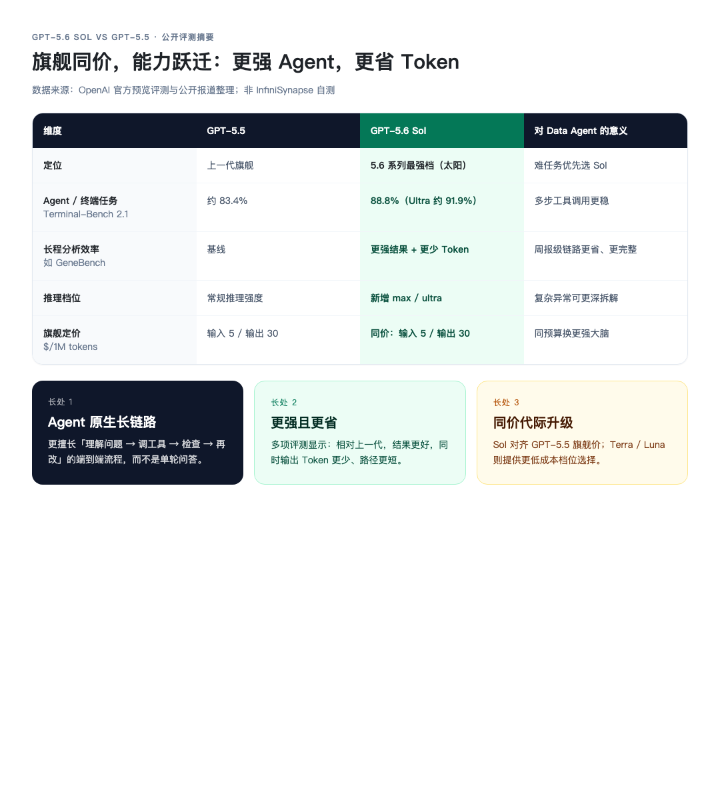
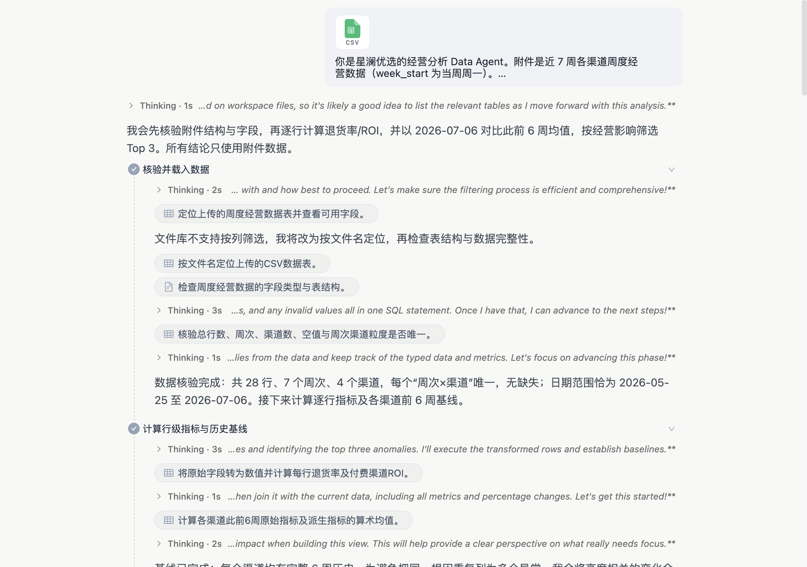
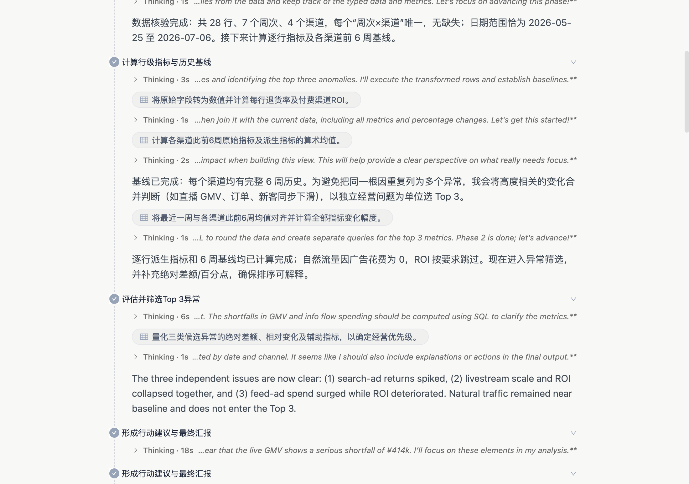
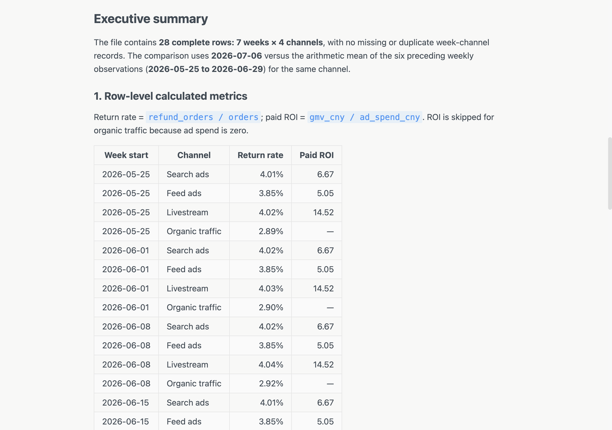
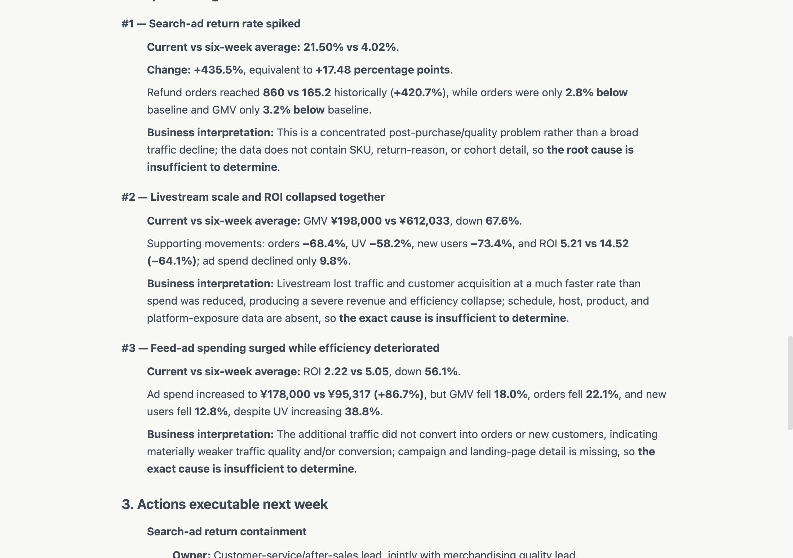
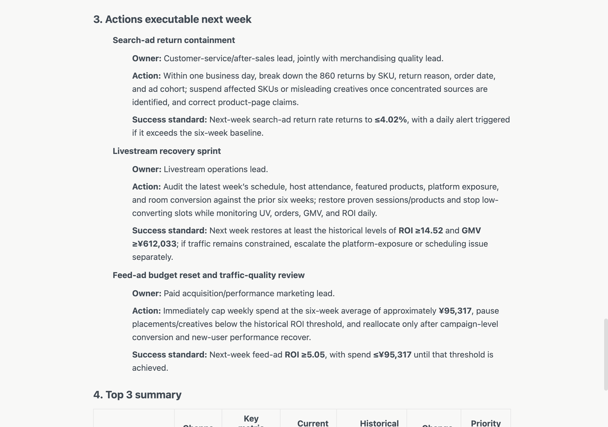
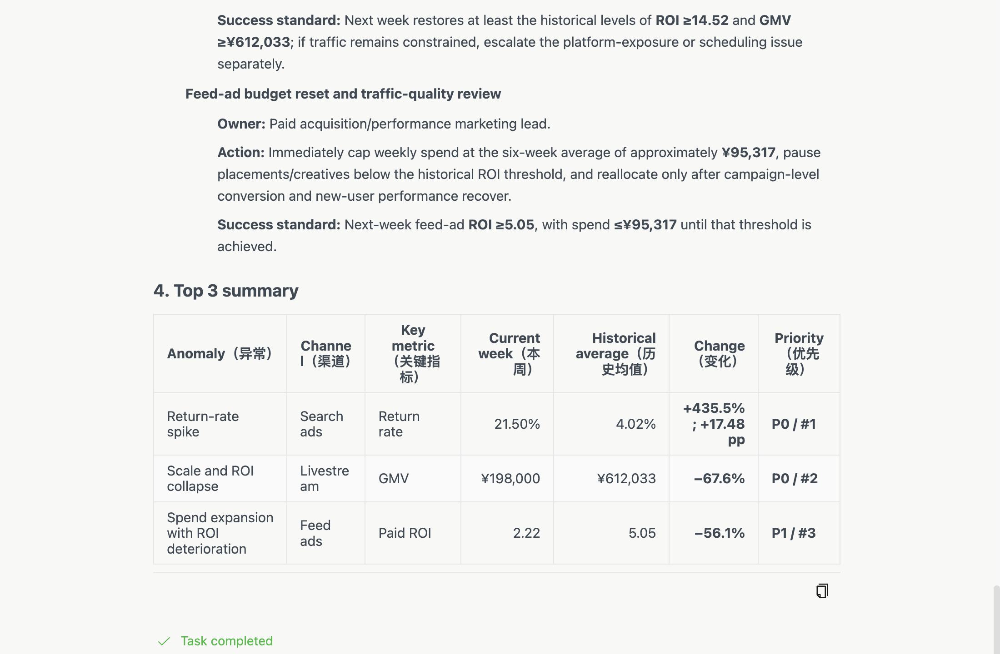

# GPT 5.6 Sol 上线：我们让 Data Agent 盯了一周经营异常

> InfiniSynapse 官方 · 2026 年 7 月 · 产品更新

GPT 5.6 Sol 发布了。

多数人会先拿它聊天、写文案、解一道题。我们做了一件更贴 InfiniSynapse 定位的事：**把它接进 Data Agent，丢进去一张经营周报表，只问一句业务问题。**

不是多一个聊天模型。是分析链路换了更强的推理引擎。

下面所有任务截图，均来自同一条真实任务界面（可公开复现）。[1]

---

## 先说清楚：GPT 5.6 Sol 比旧模型强在哪

OpenAI 把 GPT‑5.6 拆成三档：**Sol（旗舰）/ Terra（均衡）/ Luna（轻量）**。Sol 是太阳档——面向最难的长链路任务。[2]

对照公开评测与报道，相对上一代旗舰 **GPT‑5.5**，Sol 的长处可以收成三句：

1. **更强的 Agent 能力**：不是单轮答得漂亮，而是「理解问题 → 调工具 → 检查结果 → 出错再改」整条链路更稳。Terminal‑Bench 2.1 上，Sol 约 **88.8%**（Ultra 约 **91.9%**），高于 GPT‑5.5 约 **83.4%** 的参考成绩。[2][3]  
2. **更强，同时更省**：多项长程评测（如 GeneBench）显示，相对 GPT‑5.5 **结果更好、Token 更少**——推理路径更短，试错更少。[2]  
3. **同价换代**：Sol 旗舰定价与 GPT‑5.5 对齐（约输入 $5 / 输出 $30 每百万 Token），能力却上了一个代际；需要控成本时，同系列还有更便宜的 Terra / Luna。[2][4]

另外，Sol 新增更高强度推理档位（含 **max**，以及可并行拆任务的 **ultra**），专门给「拆不开、一步做不完」的难任务留余量。[2][4]

*图 1：Sol vs GPT‑5.5 公开评测摘要（官方与媒体报道整理）*

> [!important] 对 Data Agent 意味着什么
> 经营异常诊断正是典型的长链路 Agent 活：核验数据、算指标、建基线、合并同源异常、排优先级、写可执行动作。Sol 的优势，正好打在这条链路上。

业界讨论里也常提到：Sol 在 **Agent / 终端 / 浏览与电脑操作** 类任务上推进明显；个别仓库级编程或超难数学题上，竞品仍可能占优——所以我们不把它神化成「全能第一」，而是强调：**在 Data Agent 这种多步分析交付场景里，它是更合适的大脑。**[3][4]

---

## 为什么这件事值得写

通用大模型擅长「说清楚」；经营现场要的是「算清楚，再敢给建议」。

一张渠道周报里，退货率、ROI、GMV、花费、UV、新客缠在一起。人眼扫一遍，容易被「哪个数字最大」带跑；真正该问的是：

- 本周相对历史基线，**哪三个异常最值得经营层盯**？
- 每个异常对应谁负责、下周做什么、**成功标准是什么**？

这正是 Data Agent 的工作：读表 → 派生指标 → 对比基线 → 合并同源异常 → 输出可执行动作。

> [!callout]
> InfiniSynapse × GPT 5.6 Sol：不是多一个对话框，是经营分析链路换了更强的大脑。

---

## 演示怎么跑：一张表 + 一句话

我们准备了一份虚构 DTC「星澜优选」的样例数据：近 **7 周 × 4 渠道**（搜索广告、信息流、直播、自然流量），字段包括 GMV、订单、退货订单、广告花费、UV、新客。

在 InfiniSynapse 任务里：上传 CSV → 选择 **GPT 5.6 Sol** → 粘贴经营问题 Prompt。

任务界面一开始就会给出执行计划，并进入数据核验：

*图 2：任务界面截图——附件 CSV + 经营分析 Prompt + 核验载入*

Prompt 的核心要求：

- 计算退货率、付费渠道 ROI  
- 用最近一周对比此前 6 周均值  
- 给出 Top 3 异常（含数字对比与业务解释）  
- 给出下周 3 条可执行动作（负责人角色 + 动作 + 成功标准）  
- **所有数字必须从附件计算，禁止编造**

---

## 它怎么算：基线、合并、再排序

任务不会直接甩结论。界面里可以看到它先算行级指标与 6 周基线，再把高度相关的变化合并成独立经营问题，最后才筛 Top 3：

*图 3：任务界面截图——计算退货率 / ROI、建立 6 周基线、筛选 Top 3*

交付前还会先给出 Executive summary，并列出逐行派生指标，方便复核：

*图 4：任务界面截图——数据范围说明、公式与行级指标表*

---

## 它揪出的 Top 3 异常

跑完之后，Sol 把问题收敛成三个独立经营异常：

*图 5：任务界面截图——搜索退货飙升、直播 GMV 断崖、信息流 ROI 恶化*

简要对照：

- **P0 · 搜索广告退货率**：本周 **21.50%**，历史均值 **4.02%**，变化 **+435.5%**（+17.48pp）。订单与 GMV 接近基线，更像售后 / 质量问题，而不是流量塌方。  
- **P0 · 直播 GMV 断崖**：本周约 **19.8 万**，历史均值约 **61.2 万**，变化 **−67.6%**；订单、UV、新客同步下滑，花费只小幅下降。  
- **P1 · 信息流加投但 ROI 变差**：ROI 从 **5.05** 降到 **2.22**（−56.1%），花费却 **+86.7%**；UV 上升，转化与新客走弱。

自然流量本周基本贴近基线，没有进入 Top 3——说明模型不是「凡是波动都报警」，而是在做经营优先级判断。

---

## 更关键的是：给出手标准

找异常只是一半。经营团队真正要的是：**下周谁做什么，做到什么算成功。**

*图 6：任务界面截图——三条动作均含 Owner / Action / Success standard*

任务给出的动作方向包括：

1. **搜索退货止血**：售后与商品质量联合，按 SKU / 退因拆解退货单；成功标准：退货率回到历史均值附近（≤4.02%）。  
2. **直播恢复冲刺**：复盘排期、主播、货盘与曝光；成功标准：GMV、ROI 回到历史水位。  
3. **信息流预算回撤**：周花费先压回历史均值附近，ROI 恢复后再加预算。

最后用一张汇总表收束，并标记 Task completed：

*图 7：任务界面截图——Top 3 summary 与 Task completed*

> [!tip] Data Agent 的交付标准
> 好的分析交付不是「又写了一段洞察」，而是：**异常可复核 + 动作可执行 + 成功标准可验收**。

---

## 这对你意味着什么

把公开评测里的「长处」，映射回这次经营任务，你会看到同一套能力：

| Sol 的公开长处 | 这次任务里对应的表现 |
| --- | --- |
| 更强 Agent 长链路 | 核验 → 基线 → 合并同源异常 → Top 3 → 动作，一步没断 |
| 更强且更省 | 结论可复核，不堆无关波动；自然流量被正确排除 |
| 同价换代 | InfiniSynapse 里直接选 Sol，Data Infra 链路不用重搭 |

如果你在用 InfiniSynapse：

- 控制台任务里可选 **GPT 5.6 Sol** 作为推理引擎  
- 同一条 Data Agent 链路（文件、计算、长任务、可分享结果）不变，变的是「大脑」  
- 适合经营复盘、异常诊断、周报解读这类「要数字、要结论、要动作」的场景  

如果你想自己复现本次演示：打开分享任务看完整过程 [1]，或使用同目录样例 CSV + Prompt 自行跑一遍。

**说明**：文中经营数据为演示样例，非真实商家经营数据；任务配图均为该任务界面真实截图。评测数字来自公开资料，非 InfiniSynapse 内部基准。

---

## 写在最后

模型发布日最容易做的内容，是「我们也接入了」。

更难、也更值得做的，是证明：**接入之后，它能在真实工作流里多干成一件事。**

公开评测说 Sol 更强 Agent、更省 Token、同价换代；我们用一张经营周报验证的是——**它真的能把异常算清楚，并把动作写到可验收。**

小事做透，才是 Data Agent 该有的发布姿势。

---

**参考链接**

[1] 演示任务分享页：`https://app.infinisynapse.com/tasks?taskId=84e23c27-bb9a-4bcf-883f-88fee21de315&share=1`  
[2] OpenAI：《Previewing GPT-5.6 Sol: a next-generation model》：`https://openai.com/index/previewing-gpt-5-6-sol/`  
[3] 新浪财经整理报道（含 Agents' Last Exam、Terminal-Bench 等对比）：`https://finance.sina.com.cn/roll/2026-07-10/doc-inihhkum8391902.shtml`  
[4] 钛媒体：《GPT-5.6：最强的模型，最窄的门》：`https://www.tmtpost.com/8043420.html`  
[5] DataLearnerAI 模型页（评测与参数汇总）：`https://www.datalearner.com/ai-models/pretrained-models/gpt-5-6-sol`
