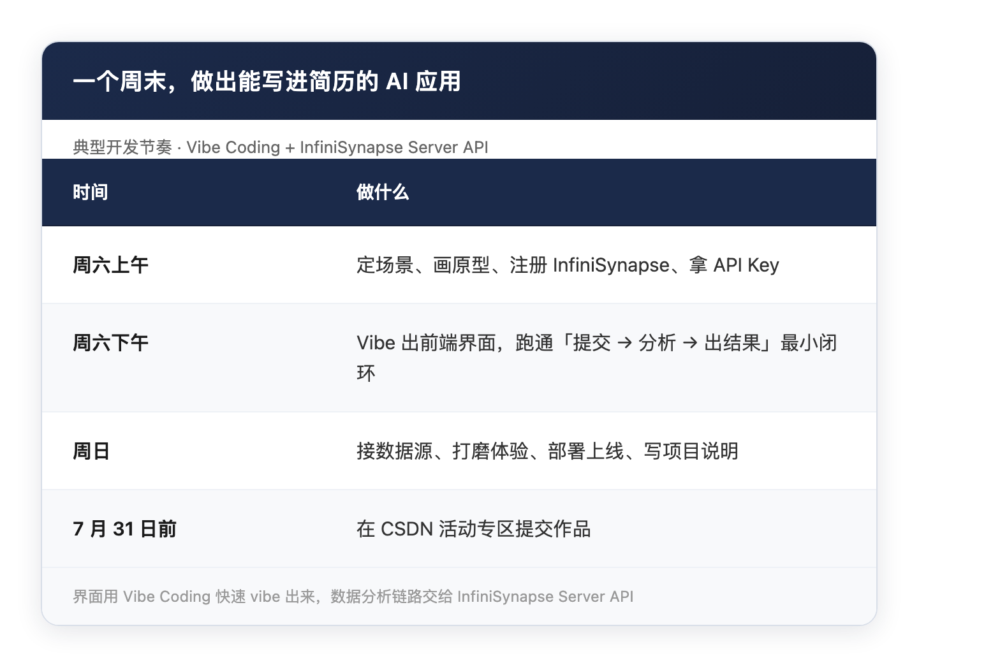
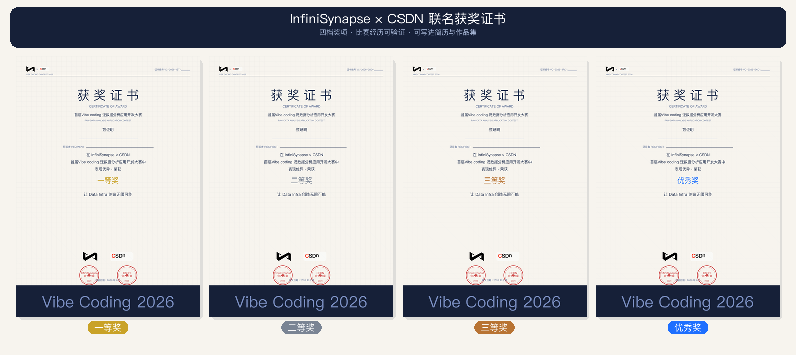

# 一个周末，做出一个能写进简历的 AI 数据应用

> InfiniSynapse 官方 · 2026 年 7 月 · 联合 CSDN 发起

**7 月，暑假开始了。**

这个暑假，InfiniSynapse 联合 CSDN 做了一件对学生很友好的事：**用一个周末，把 idea 做成能写进简历的 AI 数据应用——还能拿联名证书和现金奖。**

---

## 为什么「一个周末」是 realistic 的？

过去做一个「能写进简历」的项目，意味着：

- 自己搭后端、接数据库、写任务队列
- 调试 Agent 长任务的前端进度
- 部署、域名、存储、报告导出……

**光 infra 就要耗掉大半个暑假。**

这次比赛换了个思路：**界面用 Vibe Coding 快速 vibe 出来，数据分析链路交给 InfiniSynapse Server API。**

典型节奏可以是：

*图：典型开发节奏 — 周六 vibe 界面 + 接 API，周日部署上线*

不需要从 0 搭 infra。**你要做的，是把一个真实场景变成别人能点开、能用的应用。**

---

## 对学生来说，这是怎样的「组合拳」？

**InfiniSynapse × CSDN 首届 Vibe Coding 泛数据分析应用开发大赛**，主题：「**让 Data Infra 创造无限可能**」。

面向高校师生开放，**不设门槛**——一个人就能参赛，也欢迎室友、社团搭子组队。

### 1. 简历项目：上线应用 > 课设 Demo

参赛要求很明确：**必须是部署上线的应用**（Web / 小程序 / App 均可），不接受纯脚本或未部署的代码仓库。

这意味着你交出去的不是 localhost 截图，而是：

- 公网可访问的 URL
- 完整的技术方案说明（API 集成、架构、数据源）
- 真实的使用截图

**面试时甩一个链接，比甩 GitHub 仓库有说服力得多。**

### 2. 联名证书：比赛经历可验证

完成报名、开发并提交作品的同学，可获得 **InfiniSynapse × CSDN 联名参赛证书**——写在简历、保研材料、求职作品集里，都是可核验的背书。

*图：InfiniSynapse × CSDN 联名获奖证书（四档奖项）*

（CSDN 校园渠道同学可重点关注这一项。）

### 3. 现金奖 + 开发资源：认真做不白干

- 注册即送 **500 积分**，直接用来调 API、跑分析
- 现金奖金总额 **¥22,528**，另设 50 名优秀奖
- 微信活动群有技术答疑，不用一个人硬扛

---

## 学生党适合做什么方向？

不用想「大而全」。从身边真实需求切入，一个周末完全够用：

**📊 考研 / 报录比查询助手** — 输入目标院校专业，自动拉数据、生成对比报告

**🏠 租房通勤决策器** — 填预算和公司地址，输出候选片区和通勤分析

**💰 大学生消费复盘** — 导入账单，AI 帮你找「钱都花哪儿了」

**📋 社团活动数据看板** — 报名、签到、反馈一屏汇总

**🔍 实习公司速查** — 入职前查融资、舆情、风险信号

这些方向在 [infinisynapse.cn](https://infinisynapse.cn) 上都有类似 Mini App 可参考——**你的版本，可以更小、更垂直、更贴近校园场景。**

*图 1：InfiniSynapse × CSDN「Vibe Coding」应用开发大赛*

---

## 三步上手，这个暑假就能开干

*图 2：注册 → API Key → 开发 → 部署 → 提交*

1. **注册 InfiniSynapse** — [前往注册](https://app.infinisynapse.cn/tasks)，新用户送 500 积分
2. **创建 API Key** — [获取 Key](https://app.infinisynapse.cn/ai/apikey)，按 [Server API 文档](https://infinisynapse.cn/zh/docs/InfiniSynapse%20Server%20API%20Reference) 接入
3. **开发 + 部署 + 提交** — 7 月 31 日 23:59 前，在 CSDN 活动专区提交作品

完整指引见 [活动专题页](https://infinisynapse.cn/contest/vibe-coding)。

> [!tip] 第一次集成，先跑通最小闭环
> 表单提交 → 进度反馈 → 结果展示 → 用户下载。链路通了，再迭代数据源和功能。

---

## 时间线：现在到 7 月底，刚好一个暑假

*图 3：报名开放 → 作品开发 → 提交截止 → 评审公示*

- **即日起 — 7 月 31 日**：报名 + 开发 + 提交（暑假黄金期）
- **8 月 1 日 — 8 月 11 日**：评审 + 公示获奖名单

**7 月动手，8 月拿证拿奖——正好赶在新学期开学前，简历上多一行硬货。**

---

## 报名通道

👇 [点击活动专题页立即报名](https://infinisynapse.cn/contest/vibe-coding)

扫描下方二维码，加入 **InfiniSynapse × CSDN 微信活动群**——技术答疑、进度打卡、校园同学组队，都在群里：

*图 4：扫码加入活动群*

**主办方**：InfiniSynapse  
**联合发起**：CSDN

---

**你打算这个周末做什么方向？** 评论区聊聊——典型校园场景，我们会在活动群和技术指南里重点拆解。
