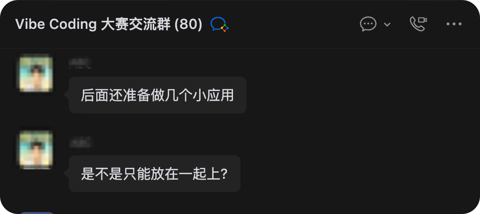
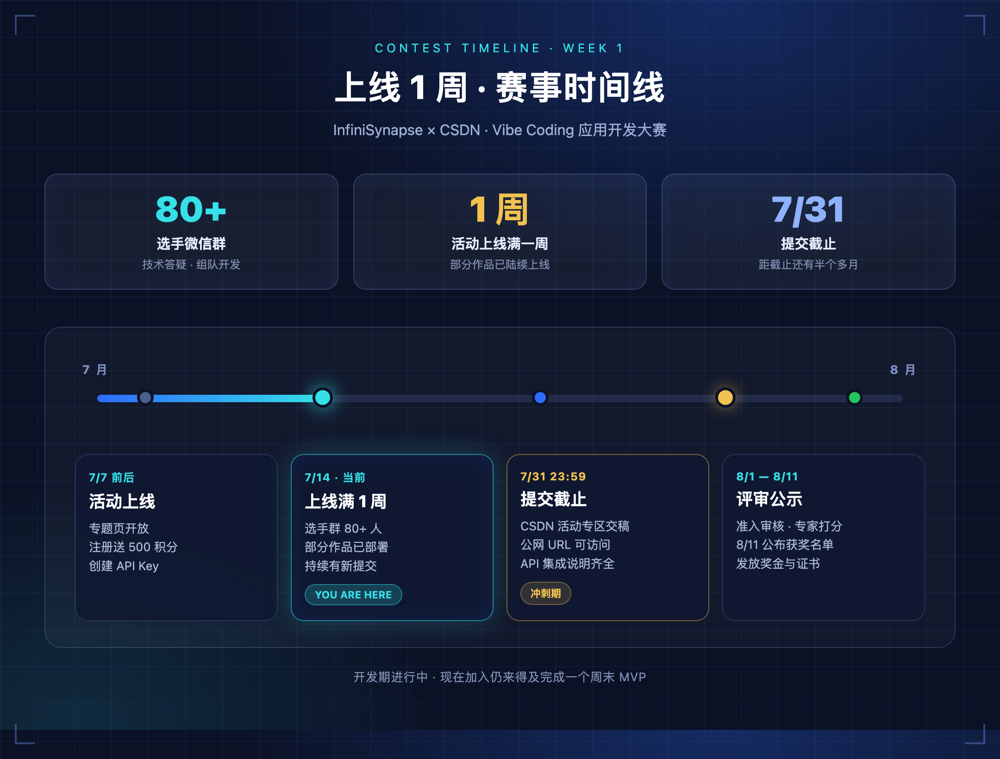
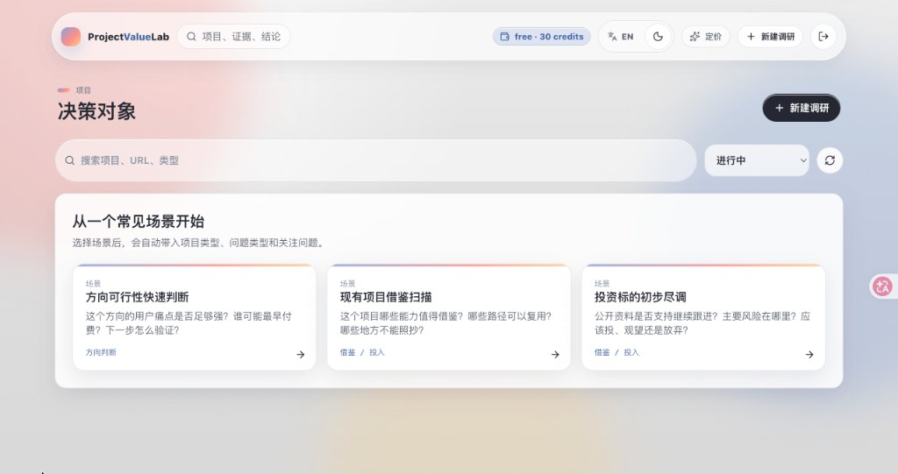
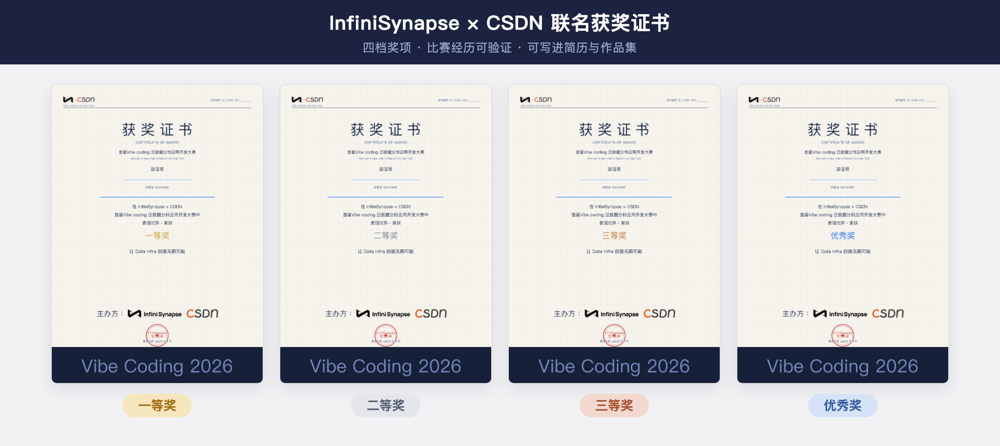
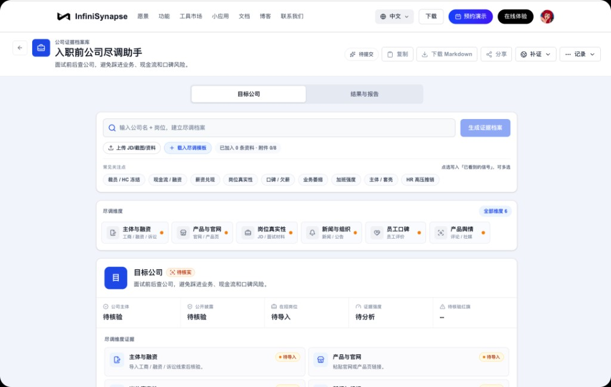
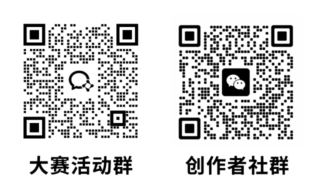

# 应用开发大赛上线一周：81 人已在路上，第一批优秀作品展示！

**InfiniSynapse × CSDN 首届 Vibe Coding 泛数据分析应用开发大赛**上线已满一周！来看看活动情况吧——

**选手微信群已突破 81 人**，讨论越来越实战🔥 群里既有拿过奖的 Vibe Coding 老手，也有第一次接 API 的新朋友——**进来既能认识大佬、攒点圈内人脉，也能顺手围观各种脑洞产品**。与此同时，**部分参赛作品已陆续部署上线**。这不是「只交 PPT」的比赛——每一篇提交，都得是公网可访问、真实能体验的应用。

---

## 赛事进展一览

*上线 1 周 · 赛事时间线 — 当前处于开发期，7 月 31 日提交截止*

> [!important] 窗口仍在
> 距 **7 月 31 日 23:59** 提交截止还有半个多月。别忘了——这可是**有奖金、有证书**的正经比赛😎 建议应用先上线，新用户注册 InfiniSynapse 即送 **500 积分**，先把最小闭环跑通，再迭代也不迟。

---

## 部分已上线作品展示

先带你逛逛群里已经上线的几款作品，看看大家的脑洞都开到哪儿了 👀 说不定就能 spark 到你的下一个 idea。

### 01 · 帮你找到那个东西 —— 不会起名，也能买到对的

**场景**：你想买一样东西，但不知道它叫什么、该搜什么关键词——只知道「用途」。

**解法**：按用途描述发起搜索与分析，把模糊需求变成可执行的选品与加购决策。

**体验**：https://www.infinisynapse.cn/apps/find-that-thing

*按用途描述找商品，支持加入购物车*

典型的 **Vibe Coding 形态**：前端 vibe 出界面，后端走 InfiniSynapse Server API 完成分析链路。用户不需要写 SQL，只需要说清楚「我要什么」。

### 02 · 财格 —— 用 AI 读懂你的理财性格

**场景**：花钱、存钱、投资——每个人习惯不同，但很少有人能系统性地「看清自己」。

**解法**：AI 结合消费与行为数据，输出可读、可分享的「财格」报告。

**体验**：https://service.bckf.cn/caige/

*低门槛输入 → 后台分析 → 结构化结果展示*

轻量 C 端应用：低门槛输入 → 后台分析 → 结构化结果。对个人用户有粘性，也是「拉新 + 留存」方向的很好样本。

### 03 · ProjectValueLab —— 立项之前，先把价值算清楚

**场景**：团队或个人想启动一个项目，但「值不值得做」往往靠感觉，缺少证据支撑。

**解法**：围绕 **证据、评分、风险与建议** 输出项目价值调研报告，把决策从「拍脑袋」变成「有数据、有结构」。

**体验**：https://pvl.octoooo.com/projects/new

*决策对象工作台，从常见场景快速发起价值调研*

偏 **B 端 / 工具型** 方向，和消费、理财类应用形成互补——说明参赛者并没有扎堆做同一类 Demo，而是在各自熟悉的领域里找真实需求。

---

## 还没动手？三步仍可赶上

*注册 → API Key → 开发 → 部署 → 提交*

1. **注册 InfiniSynapse** — [前往注册](https://app.infinisynapse.cn/tasks)，新用户送 500 积分
2. **创建 API Key** — [获取 Key](https://app.infinisynapse.cn/ai/apikey)，按 [Server API 文档](https://infinisynapse.cn/zh/docs/InfiniSynapse%20Server%20API%20Reference) 接入
3. **开发 + 部署 + 提交** — 7 月 31 日 23:59 前完成提交

说点实在的——**现金奖金总额 ¥22,528**，另设 50 名优秀奖；获奖者还能拿 **InfiniSynapse × CSDN 联名证书**，比赛经历可验证，写进简历、作品集都不虚。完整规则见 [活动专题页](https://infinisynapse.cn/contest/vibe-coding)。

*四档奖项 · 比赛经历可验证 · 可写进简历与作品集*

---

## 还没想方向？先看官方应用模版

活动官网（https://infinisynapse.cn）上有一组现成 Mini App，底层共用 **InfiniSynapse Server API** 与 Data Infra。你可以先点开体验完整交互，再参照活动页的 Integration Guide，把表单、进度、结果页换成自己的场景——**数据分析链路不用从零搭**。

### 泛数据分析实验室 — 63 个生活决策分析模版

覆盖薪资谈判、买房、消费复盘、求职对比、健康决策等日常场景。选一个模版，输入你的具体情况，系统会自动拉起分析流程并输出结构化结论。

适合还没定产品形态的同学：**从 63 个方向里挑一个，改成更垂直、更贴近你用户群的版本**。

**地址**：https://infinisynapse.cn/apps/personal-analytics

*63 个决策模版，总有一个方向能 spark 你的 idea*

### 高考报考选校 AI 助手 — 冲稳保方案、PDF 报告

输入省份、分数、位次，自动拉取院校与专业数据，生成冲稳保报考方案，支持 PDF 报告导出。典型 **「表单 → 长任务分析 → 可下载报告」** 链路，和不少已上线参赛作品形态接近。

**体验**：https://www.infinisynapse.cn/apps/gaokao-school-advisor?mode=guest

*输入分数位次，一键生成冲稳保报考方案*

### 报告快写 — 批量上传、带来源正文、导出 PDF/Word

上传业务文档建知识库，AI 基于资料起草报告，正文带来源引用，支持导出 PDF / Word。适合 **「资料上传 → RAG 分析 → 文档产出」** 类方向参考。

**体验**：https://infinisynapse.cn/apps/report-writer

*上传业务文档，AI 起草带来源的报告*

### 公司尽调助手 — 实体核验、融资背景、舆情与风险

输入公司名称，自动核验工商信息、融资背景、舆情与风险信号。入职前查公司底细、实习 offer 避坑——**B 端 / 工具型** 场景的官方样板之一。

**体验**：https://infinisynapse.cn/apps/personal-analytics/company-due-diligence

*入职前查公司底细，避开踩坑 offer*

### 省钱比价助手 — 跨平台券后价、差评挖掘

描述想买什么，AI 帮逛京东、淘宝等平台，对比券后价、挖掘差评关键词、给出加购建议。消费决策 + 电商数据分析，和「帮我找到那个东西」同属 **C 端选品** 方向，但交互与数据源可以完全不同。

**体验**：https://infinisynapse.cn/apps/straight-man-shopping

*AI 帮逛京东淘宝，券后价比价 + 差评避坑*

---

## 欢迎体验，也欢迎加入

不管你是想**冲奖金拿证书**、想**认识一圈 Vibe Coding 大佬攒人脉**，还是单纯来**围观大家都在做什么好玩的产品**——这个活动都值得来蹲一蹲 🙌

👇 点击下方「阅读原文」立即报名：https://infinisynapse.cn/contest/vibe-coding

📲 扫描下方二维码，加入 **大赛活动群** 和 **创作者社群**：

*大赛活动群答疑打卡，创作者社群认识大佬 · 围观创意*

**你打算做什么方向？** 欢迎在评论区聊聊——下一批作品集锦，也许就有你的。
