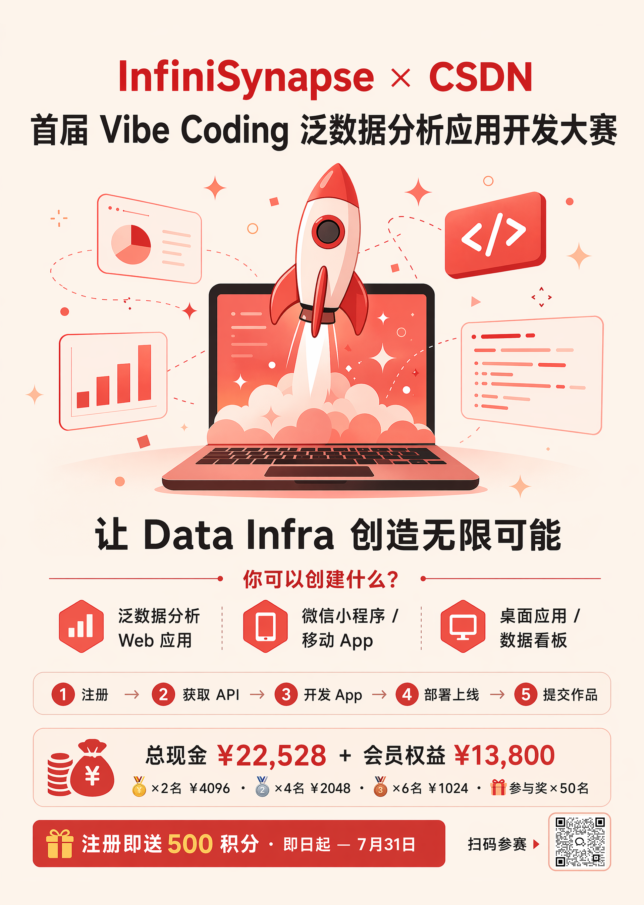
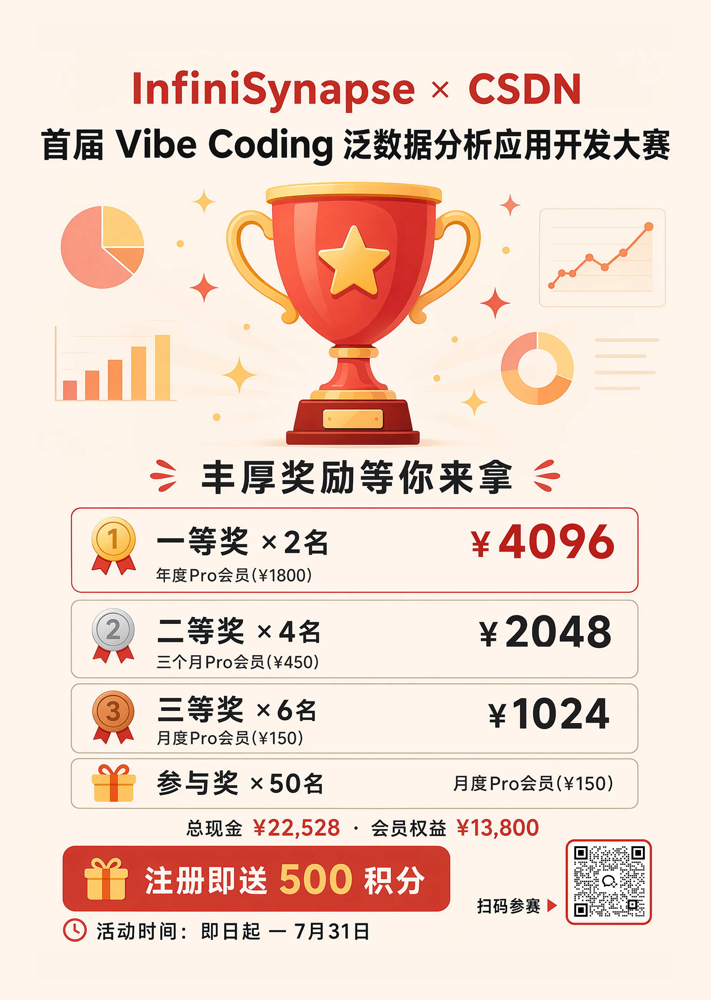
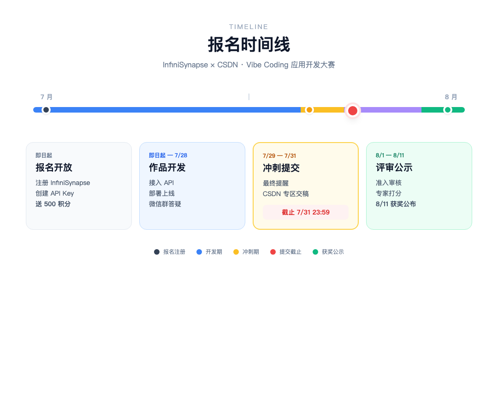
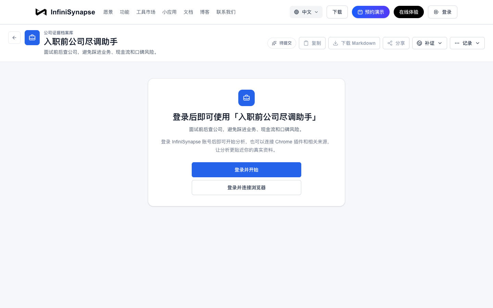
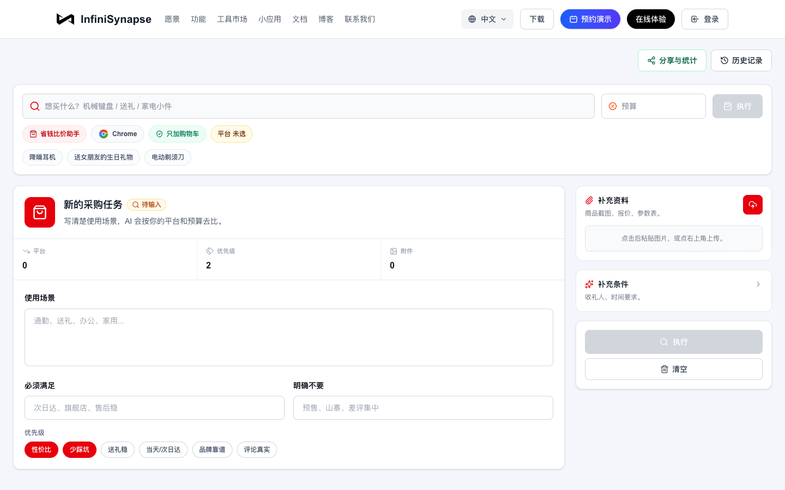
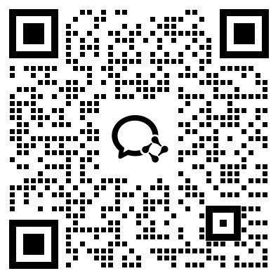

# 报名启动！InfiniSynapse × CSDN 首届 Vibe Coding 应用开发大赛正式开启

> InfiniSynapse 官方 · 2026 年 7 月 · 联合 CSDN 发起

**凌晨一点，Cursor 里又蹦出来一个能跑的页面。**

表单、进度条、结果卡片，三小时全出来了。你要做的可能是「租房通勤助手」——用户填预算和公司地址，系统吐出候选片区和 PDF 报告；也可能是「电商周报 Bot」——老板丢一句「这周哪个品类掉得最狠」，后台自动查数、画图、发链接。

你盯着 localhost:3000 上漂漂亮亮的 UI，突然卡住：**壳有了，后面那条看不见的长链路，一条都没接。**

数据从哪来？Agent 跑五六分钟，前端怎么知道进度？报告生成完存哪、怎么下载？你在 GitHub 上搜「agent backend」，看到的要么是 Demo 级 wrapper，要么得自己搭任务队列、沙箱、存储——**你真正想做的，只是把一个行业判断变成别人能点开的小应用。**

如果你也卡在这一步，这次比赛就是为你办的。

**InfiniSynapse × CSDN 首届 Vibe Coding 泛数据分析应用开发大赛正式启动报名。** 主题：「**让 Data Infra 创造无限可能**」——用 Vibe Coding 做出界面，用 InfiniSynapse 接上数据分析链路，把 demo 部署成**能公网访问、有人用、能拿奖**的上线应用。

赛事由 **InfiniSynapse** 联合 **CSDN** 共同发起。[点击活动页立即报名](https://infinisynapse.cn/contest/vibe-coding)：注册即送 **500 积分**，现金奖金总额 **¥22,528**，作品提交截止 **7 月 31 日 23:59**。



*图 1：InfiniSynapse × CSDN「Vibe Coding」应用开发大赛*

> [!callout]
> 页面可以 vibe 出来，数据分析链路不必从零搭。InfiniSynapse 把数据源、长任务、报告导出下沉成 **Server API**——你要做的，是把它接进一个**有场景、能上线**的应用里，然后在 CSDN 活动专区提交作品。

---

## 赛事对象

面向所有 AI 开发者、Vibe Coder、数据分析师、独立开发者、高校师生及企业技术团队。只要热爱 AI 应用开发、勇于创新，均可参赛——**不设行业与资历门槛**，个人或组队均可。

---

## 参赛要求

**应用形态**

Web 应用、移动 App、微信小程序、桌面应用均可。**不接受**纯命令行脚本、Jupyter Notebook 或未部署的代码仓库。

**必须集成 InfiniSynapse**

后端通过 [InfiniSynapse Server API](https://infinisynapse.cn/zh/docs/InfiniSynapse%20Server%20API%20Reference) 以编程方式发起分析任务、管理数据源、获取结果。调用日志可在平台后台查验。

**必须部署上线**

提供公网可访问的 URL，或可下载的安装包／小程序入口。评委将实际打开并使用。

**提交内容**

在 CSDN 活动专区提交：应用介绍、上线地址、API 集成说明、使用截图；代码仓库与演示视频可选。完整指引见 [飞书文档](https://ccnej8avri03.feishu.cn/wiki/RfQPw2lgqixwRXpP0dUclEKGnnc)。

---

## 奖项设置



*图 2：丰厚奖励等你来拿——总现金 ¥22,528 · 会员权益 ¥13,800 · 注册即送 500 积分*

**注册即送 500 积分**：活动期间注册 InfiniSynapse 并创建 API Key，无需邀请码，即时到账——积分可兑换 Token，直接用来调 API、跑分析。

> [!tip] 拉新还能加分
> 用户指标占评分 **60%**。你拉新 → 新用户拿 500 积分体验你的应用 → 变成活跃用户 → 直接计入评分。

---

## 日程安排



*图 3：报名时间线——从报名开放到获奖公示*

**1 · 报名 & 注册**（即日起 — 7 月 31 日）

注册 InfiniSynapse、创建 API Key，领取 **500 积分**。[打开活动页](https://infinisynapse.cn/contest/vibe-coding) 或 CSDN 专区完成报名。

**2 · 作品开发**（即日起 — 7 月 31 日）

基于 InfiniSynapse API 开发并部署应用。微信活动群提供技术答疑、进度提醒与作品互评。

**3 · 作品提交**（截止 7 月 31 日 23:59）

在 CSDN 活动专区提交作品信息。冲刺期我们会发最终提醒，别踩线。

**4 · 评审 & 公示**（8 月 1 日 — 8 月 11 日）

准入审核 → 用户数据采集 → 专家打分 → 加权汇总。**8 月 11 日**起公布获奖名单并发放奖金。

---

## 参赛流程


*图 4：官网参赛流程——注册 → API Key → 开发 → 部署 → 报名*

1. **注册 InfiniSynapse** — [前往注册](https://app.infinisynapse.cn/tasks)，新用户送 **500 积分**，无需邀请码
2. **获取 API Key** — [创建 API Key](https://app.infinisynapse.cn/ai/apikey)；也可接入「InfiniSynapse 登录」，让用户以自己的账号授权
3. **开发应用** — 通过 Server API 构建泛数据分析应用
4. **部署上线** — 提供可访问的公网 URL 或可下载安装包
5. **报名参赛** — [打开报名入口](https://infinisynapse.cn/contest/vibe-coding)，提交参赛信息，完成官网报名

---

## 可以做什么？

`infinisynapse.cn` 上这些 Mini App，底层都是同一套 Data Infra——你的参赛作品，可以是其中任意方向的「场景定制版」。下面是官网现成样板，**均可直接点开体验**：

**高考报考选校 AI 助手** — 冲稳保方案、PDF 报告


*图 6：输入省份、分数、位次，一键生成冲稳保报考方案*

**报告快写** — 批量上传资料、带来源正文、导出 PDF/Word


*图 7：上传业务文档建知识库，AI 起草带来源的报告*

**公司尽调助手** — 实体核验、融资背景、舆情与风险信号



*图 8：入职前查公司底细，避开踩坑 offer*

**省钱比价助手** — 跨平台券后价、差评挖掘、加购不付款



*图 9：AI 帮逛京东淘宝，券后价比价 + 差评避坑*

**泛数据分析实验室** — 63 个生活决策分析模板


*图 10：薪资谈判、买房、消费决策……总有一个方向能 spark 你的 idea*

活动页汇总入口：[infinisynapse.cn/contest/vibe-coding](https://infinisynapse.cn/contest/vibe-coding)

> [!tip] 第一次集成，先跑通最小闭环
> 表单提交 → SSE 进度 → 工作区产物 → 用户下载。等链路通了，再接 MySQL、RAG、文件上传。InfiniSynapse Skill 见 [GitHub](https://github.com/Octo-o-o-o/InfinisynapseAssistant)。

---

## 评审规则

**评分（总分 100）**

- **用户指标 60%** — 应用注册用户数（30%）+ 活跃使用量（30%）
- **专家意见 40%** — 场景价值、技术完成度、创新性

> [!warning] 不计 GitHub Star 或下载量
> 用户指标以 InfiniSynapse 平台后台数据为准。评审团由 InfiniSynapse 产品／运营负责人、CSDN 社区运营及外部技术专家组成。

---

## 技术支持

**微信活动群** — 参赛者主阵地：API 接入答疑、部署问题响应、进度打卡、活动通知。扫码加入 **InfiniSynapse × CSDN 活动群**（二维码见文末）。

**接入手册 & 官方 Demo** — 活动页提供 Integration Guide、Server API 快速示例与样板应用。InfiniSynapse Skill 见 [GitHub](https://github.com/Octo-o-o-o/InfinisynapseAssistant)。

**快速集成示例**

```python
import requests

response = requests.post(
    "https://api.infinisynapse.cn/v1/query",
    headers={"Authorization": "Bearer sk-xxxx"},
    json={
        "query": "分析最近一周的销售数据，找出下滑最明显的品类",
        "data_source": "your_datasource_id"
    }
)
print(response.json())
```

完整接口见 [Server API Reference](https://infinisynapse.cn/zh/docs/InfiniSynapse%20Server%20API%20Reference)。

---

## 报名通道

👇 [点击活动专题页立即报名](https://infinisynapse.cn/contest/vibe-coding)。**作品提交截止 7 月 31 日 23:59**。

扫描下方二维码，加入 **InfiniSynapse × CSDN 微信活动群**——技术答疑、进度打卡、活动通知，都在群里：



*图 11：扫码加入 InfiniSynapse × CSDN Contest Group*

**主办方**：InfiniSynapse

**联合发起**：CSDN

---

## 参考链接

- [活动专题页](https://infinisynapse.cn/contest/vibe-coding)
- [InfiniSynapse Server API Reference](https://infinisynapse.cn/zh/docs/InfiniSynapse%20Server%20API%20Reference)
- [API Key 管理](https://app.infinisynapse.cn/ai/apikey)
- [参赛指引（飞书）](https://ccnej8avri03.feishu.cn/wiki/RfQPw2lgqixwRXpP0dUclEKGnnc)
- [把数据分析从企业迁移到个人](https://mp.weixin.qq.com/s/9dLpt51YkabBNgm9-vnmrw)

**你打算做什么场景的应用？** 评论区聊聊——典型方向我们会在活动群和技术指南里重点拆解。
