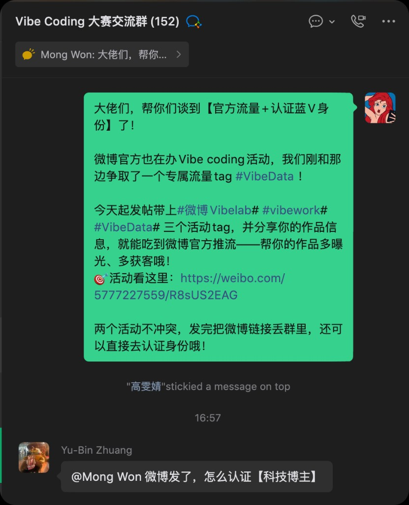
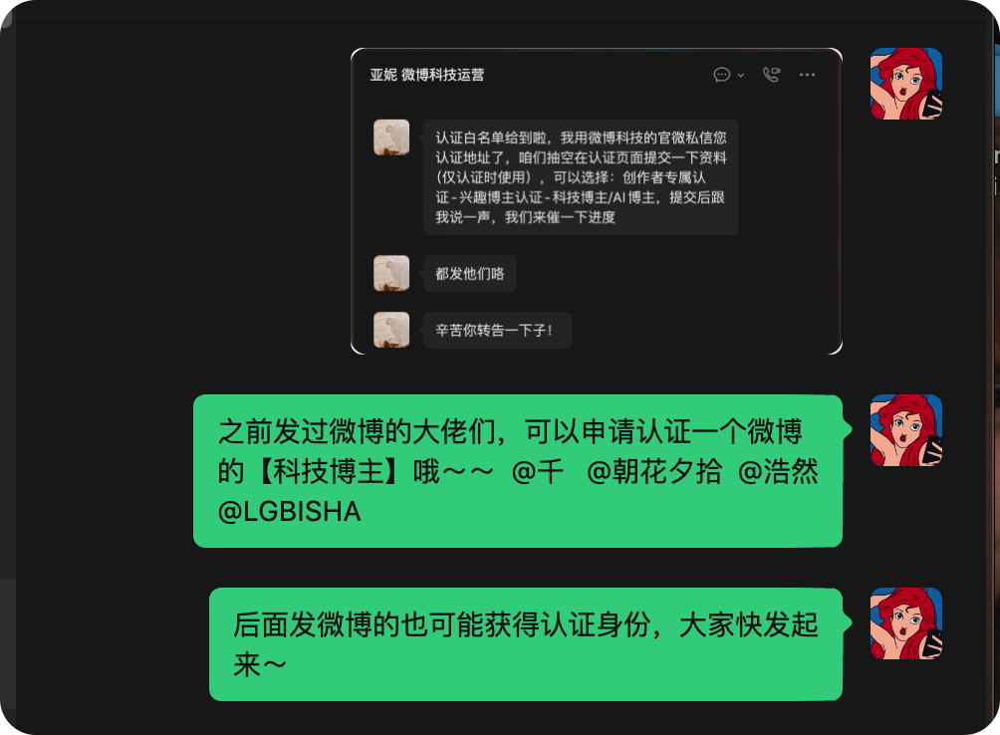
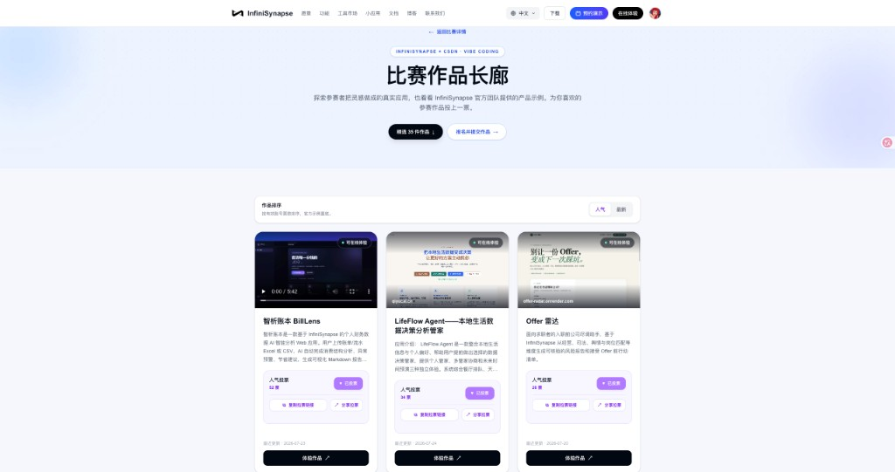
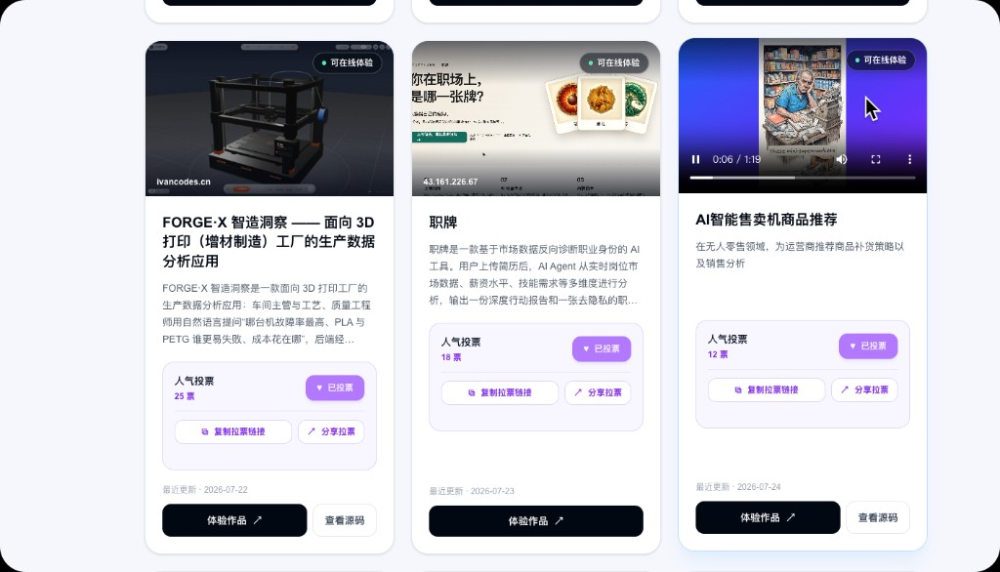
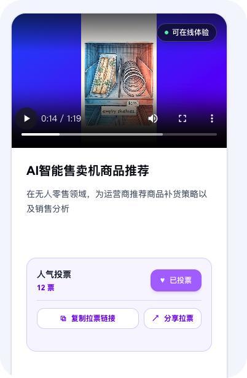
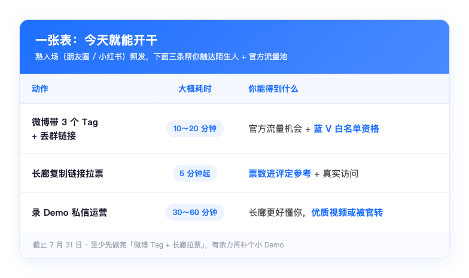

# 大赛作品提分攻略，这 3 个官方助推，别白放过

**7 月 31 日就要截止啦。** 作品交上去当然重要，但评委除了看「好不好用」，也会偷偷看一眼——有没有真人在玩、有没有被更多人看见。

朋友圈、小红书该发还是要发（熟人场不能丢）。不过这几天，我们又偷偷给大家谈成了几条**参赛选手专属**的小通道：微博官方加热 + 蓝 V 白名单、长廊拉票、Demo 视频上架。

这篇很短，就告诉你：点哪里、带什么 Tag、发完找谁～

> **先给你一颗定心丸**
> 提分不一定靠通宵加功能。**让更多真人看见、点开、用一用**，往往比闷头再塞三个按钮更管用。下面三条按「省事程度」排好了——有 10 分钟，就能先搞定第一条。

---

## 评委在看啥？说人话版

达标线你大概听过：能跑、有场景、真接了 InfiniSynapse API。

想冲一冲名次，其实还多看两样小东西——

1. **有没有真人在用**（后台调用记录会说话）
2. **作品有没有被看见**（曝光、投票、演示好不好懂）

所以发内容不是「表演运营」，是帮你的小作品多露个脸。熟人场靠朋友圈 / 小红书；下面三条，是我们特地帮大家挖来的加分小路。

---

## 助推 1｜发微博带对 Tag，可能吃到官方加热 + 蓝 V

说白了就一句：**Tag 带齐，就有机会蹭上微博官方流量；发得认真，还有机会申请蓝 V。**

我们跟微博科技运营聊完，给参赛选手争取到了这些：

- 官方流量支持（带指定 Tag 发作品微博，有机会被转发 / 加热）
- 认证白名单（创作者专属 / 兴趣博主 / 科技博主·AI 博主 等）
- 专属小标签：**#VibeData#**

*群里原话：带齐 Tag → 丢链接 → 走认证，超短链路*

### 你只要做这几步（真的很短）

1. 打开微博，发一条介绍自己作品的内容（有截图 / 小视频更香）
2. **正文带上这三个 Tag**（建议直接复制，别手打漏了）：
   - `#微博 Vibelab#`
   - `#vibework#`
   - `#VibeData#`
3. 发完把微博链接丢进大赛交流群，或者私信运营宝宝
4. 符合条件的话，会收到认证指引（走微博官方流程交材料就好）

> **已经有同学拿到认证资格啦**
> 目前至少有 **4 位选手**进了白名单（群里也点名同步过）。后面发的一样有机会——大门没关，先动起来的人更香。

*和微博科技运营沟通后的小进展，可可爱爱的实锤*

**值不值得？**  
官方加热能带来真实访客；蓝 V 比赛结束了也还在，对自己获客、个人品牌都挺划算的。

参考活动帖：[https://weibo.com/5777227559/R8sUS2EAG](https://weibo.com/5777227559/R8sUS2EAG)

---

## 助推 2｜长廊可以拉票啦，票数会进评定参考

[作品长廊](https://infinisynapse.cn/contest/vibe-coding/gallery) 不只是展览柜——**人气投票已经开跑**，票数会作为最终评定的参考之一哦。

每张作品卡上都有这些小按钮：

- 当前票数
- **复制拉票链接**
- **分享拉票**
- 体验作品入口

*长廊：能玩、能投、能分享；拉票链接一键复制*

### 拉票不尴尬小抄

- 先自己点开长廊，确认介绍和体验链接没问题
- 复制链接发给同学 / 同事 / 群友：「帮我点一下呗，顺便玩玩～」
- 别只求投票——**让人真点进去玩 1～2 分钟**，调用记录对评分更有说服力
- 朋友圈可以配一句：「这是我做的 XX，解决 YY，点开就能玩」

> 投票当然不是唯一标准。但作品差不多时，**真实用户和曝光**，往往就是拉开差距的那一点点。

长廊入口：[https://infinisynapse.cn/contest/vibe-coding/gallery](https://infinisynapse.cn/contest/vibe-coding/gallery)

---

## 助推 3｜录一段小 Demo，让访客秒懂你

很多访客（包括评委）打开长廊时，未必有耐心从零摸索你的产品。

**录一段 30 秒～2 分钟的简单 Demo**，私信发给运营同学，我们会尽量帮你挂到作品长廊。别人一眼就明白：你解决啥问题、核心流程怎么走。

挂上之后大概长这样——封面直接播 Demo，下面还能顺便拉票：

*长廊支持挂 Demo；访客不用从零点点点，几秒就能看懂*

### 视频不用精修，讲清楚就很可爱

对着念也完全 OK：

1. **这是什么**：一句话场景
2. **怎么用**：关键 3～5 步操作录屏
3. **结果长什么样**：报告 / 图表 / 卡片截一下

竖屏横屏都行；手机录屏 + 口述就很好。有字幕加分，没有也没关系。

> **录得清楚，还有机会被官方转发**
> 节奏干净、一眼能懂的 Demo，除了挂在长廊，也有机会被官方渠道再推一轮——等于白嫖曝光，谁不爱。

---

## 一张表：今天就能开干

*三条按省事程度排好；熟人场（朋友圈 / 小红书）照发，这里帮你多触达陌生人 + 官方流量池*

---

## 最后轻轻叮一句

别把「运营」想成额外作业。你都把应用做出来了——**让它被看见、被点开、被用一下**，本来就是产品闭环的一部分呀。

截止 **7 月 31 日**。三条里，至少先做完「微博 Tag + 长廊拉票」；有余力再补个小 Demo。

报名 / 提交：[https://infinisynapse.cn/contest/vibe-coding](https://infinisynapse.cn/contest/vibe-coding)

作品长廊：[https://infinisynapse.cn/contest/vibe-coding/gallery](https://infinisynapse.cn/contest/vibe-coding/gallery)

卡在哪一步，群里喊一声运营就好——我们就是来帮你交、帮你被看见的～
