# 还不知道做什么？10 个一周末能做完的选题，照着改就能交

**距提交截止还剩 11 天（7 月 31 日）。** 参与奖 50 个名额还没坐满，交一个达标作品，拿奖概率很高。

不知道做什么？直接看下面 10 个选题——都能一周末做完，还附了能点开体验的成熟样板。先玩一遍，换个更垂直的场景，照着改就能交。

> [!important] 达标线三条就够；有真实用户调用会大加分
> ① 可运行的应用（Web / App / 小程序 / 桌面都行）② 场景说得清 ③ 后端真调了 InfiniSynapse Server API。不接受纯脚本、命令行、Notebook。
> 另外说句实在的：**别只自己点几下就交。** 拉同学、朋友、群里的人真用几轮，平台后台能看到调用记录——这点对评分很加分，比堆功能更管用。

---

## 别从零想，先套这条骨架

大多数作品其实长一个样，没那么玄：

**前端一个输入框 / 上传框 → 后端调 InfiniSynapse Server API → 把结果画成表格 / 图表 / 报告。**

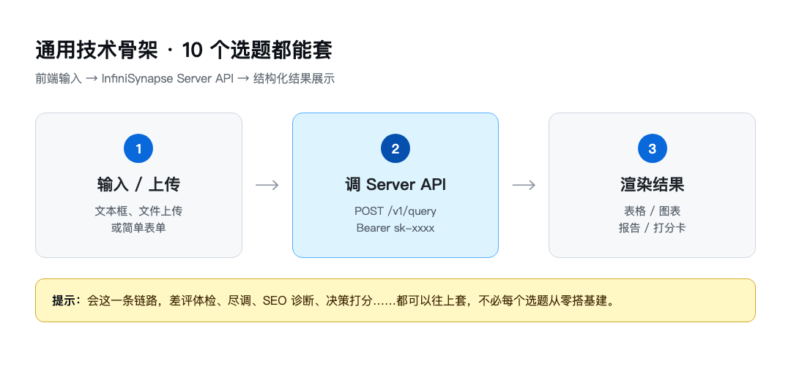

*会这一条，下面 10 个选题都能往上套*

开发指南、API 文档、开源示例都在活动页，迷路了就去这儿：[https://infinisynapse.cn/contest/vibe-coding](https://infinisynapse.cn/contest/vibe-coding)

难度怎么读：

- **一天可完成**：小而完整，专治「我想稳稳拿个参与奖」
- **一个周末**：场景更完整一点，适合想冲一冲名次
- **周末 + 少量打磨**：数据或交互稍重，做出来容易好看

---

## 一、电商 / 消费

### 选题 1｜店铺差评体检助手（一天可完成）

把某商品评价丢进去，AI 帮你归类吐槽点、算负面占比、给改进建议。数据好造、场景好讲，新手第一个作品首选。

### 选题 2｜跨平台比价 & 券后到手价（一个周末）

输入商品名，整理各平台价格、算券后价、读差评避坑。别贪全品类，做美妆 / 数码 / 母婴其中一个，更容易做深。

### 选题 3｜选品趋势速览（一个周末）

上传销售或搜索数据，找出涨得最快和掉得最狠的品类，给下周备货建议。小卖家、电商运营都用得上。

### 不知道长什么样？先点开这几个玩

**帮你找到那个东西**：想买个东西，但不知道它叫啥——只知道用途。按用途描述搜索分析，把模糊需求变成能下单的决策。

体验：[https://www.infinisynapse.cn/apps/find-that-thing](https://www.infinisynapse.cn/apps/find-that-thing)

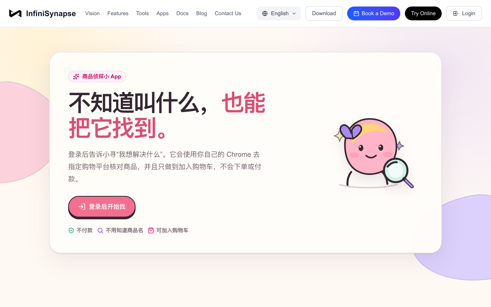

*按用途找商品，自然语言进去，决策出来*

**省钱比价助手（官方样板）**：描述想买什么，AI 帮逛京东淘宝，比券后价、挖差评。和选题 2 几乎同赛道——你完全可以做成「只做数码配件」这种细分版。

体验：[https://infinisynapse.cn/apps/straight-man-shopping](https://infinisynapse.cn/apps/straight-man-shopping)

*券后价 + 差评避坑，抄交互就行*

**财格**：用 AI 读懂理财性格。输入很轻，结果可分享——做 C 端小工具时可以参考这个节奏。

体验：[https://service.bckf.cn/caige/](https://service.bckf.cn/caige/)

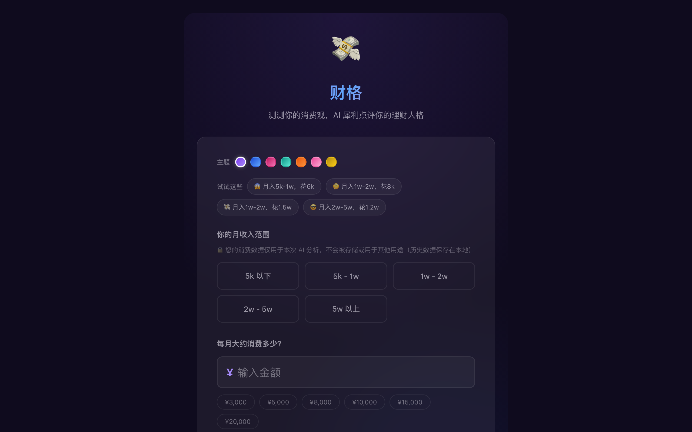

*轻量、好演示、结果能晒*

> [!tip] 抄作业小提示
> 别原样复制。把「全品类比价」改成「只做数码配件」，把「找那个东西」改成「找办公好物 / 宠物用品」。评委一眼能记住你，你也省得和官方样板撞脸。

---

## 二、职场 / 教育

### 选题 4｜入职前公司尽调助手 · 细分版（一个周末）

输入公司名，核验主体、融资、口碑、风险。别做全行业——只做互联网大厂、教培或本地连锁，反而更快交卷。

### 选题 5｜简历 - JD 匹配诊断（一天可完成）

上传简历 + 目标 JD，打匹配分、标缺失关键词、给修改建议。学生党刚需，demo 数据也特别好找。

### 选题 6｜高考 / 考研志愿分数位次分析（周末 + 打磨）

输入分数、位次、意向，给冲稳保参考。数据准备稍费劲，但话题性强，愿意啃数据的同学很适合。

### 这类目，直接抄这些样板

**Offer 雷达（已上线参赛作品）**：专做「入职前公司尽调」。填公司名、求职阶段、目标岗位，AI 从主体经营、司法风险、舆情信号、岗位匹配多维核验，出一份接受 Offer 前的行动清单。选题 4 几乎可以直接对着它做细分版——比如只做互联网大厂，或只做校招实习。

体验：[https://offer-radar.onrender.com/](https://offer-radar.onrender.com/)

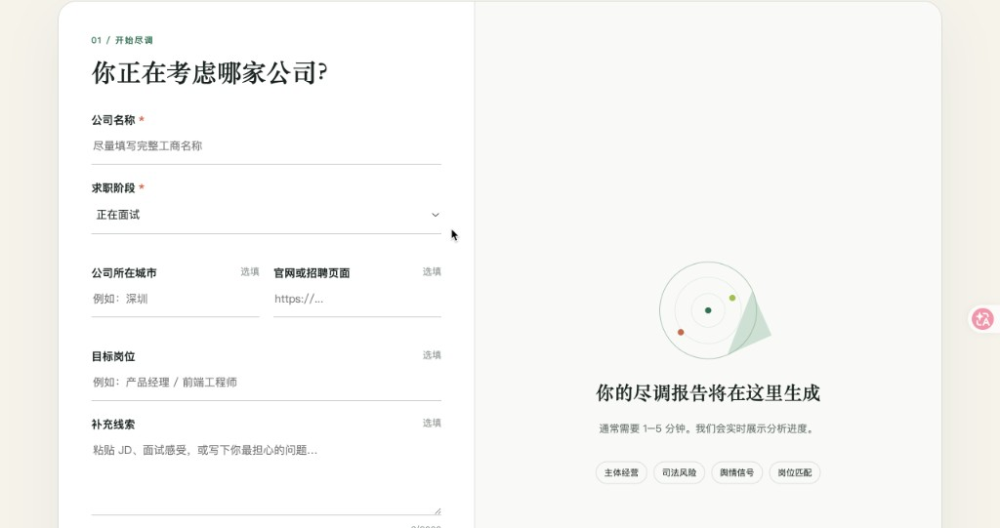

*表单进 → 尽调报告出，场景很聚焦，抄交互最省事*

**公司尽调助手（官方样板）**：输入公司名，自动核验工商、融资、舆情与风险。和 Offer 雷达同赛道，交互可以对照着看，找差异化切口。

体验：[https://infinisynapse.cn/apps/personal-analytics/company-due-diligence](https://infinisynapse.cn/apps/personal-analytics/company-due-diligence)

*官方样板，入职前查底细也能参考*

**高考报考选校 AI 助手（官方样板）**：省份、分数、位次进去，冲稳保方案出来，还能导出 PDF。做选题 6 时，交互几乎可以照着搬。

体验：[https://www.infinisynapse.cn/apps/gaokao-school-advisor?mode=guest](https://www.infinisynapse.cn/apps/gaokao-school-advisor?mode=guest)

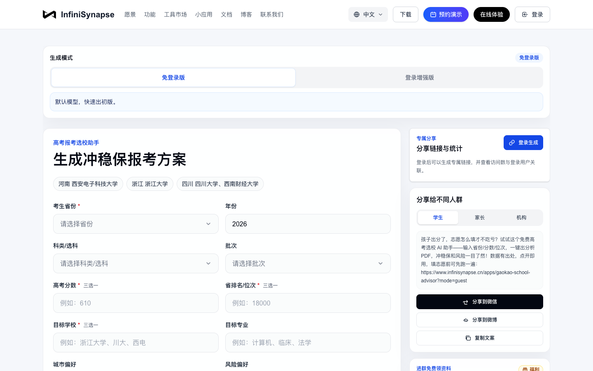

*表单进 → 长任务分析 → 报告出，这条链路很稳*

---

## 三、数据 / 运营

### 选题 7｜SEO 数据十维体检（一个周末）

上传 GSC 导出数据，出核心指标、趋势、快速机会、诊断建议。已有现成玩法，改个皮、换个行业基准，就是新作品。

### 选题 8｜广告投放周报生成器（一个周末）

上传投放数据，算 ROI、找异常、生成带图表的周报。中小投手刚需，做完就能演示「数据进、文档出」。

### 选题 9｜社媒评论舆情看板（周末 + 打磨）

丢一批评论 / 私信进去，做情绪分类、提炼话题、标出要人工跟进的负面。列表 + 标签 + 详情，三层结构就够用。

### 这类目，可以这样抄

**GSC 周度数据对比（已上线参赛作品）**：分别上传上周、本周的 GSC Excel，自动生成关键词曝光与点击对比图，还能一键拉起 AI 深度分析。选题 7 几乎可以直接对着它做——你再加「行业 CTR 对标」或「只盯某类页面」，差异化就出来了。

体验：[https://gsc-data-analysis.vercel.app/](https://gsc-data-analysis.vercel.app/)

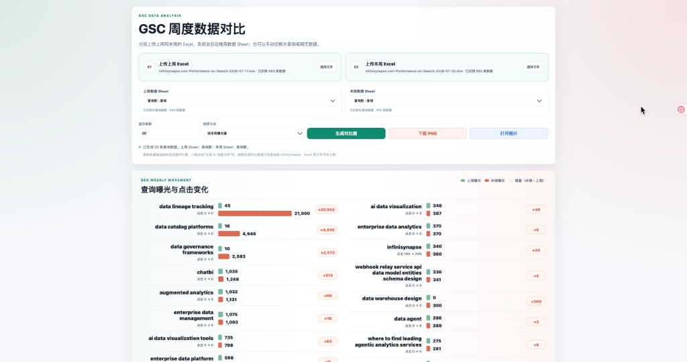

*双周 Excel 上传 → 对比图 → AI 分析，SEO 方向现成样板*

**FinPDF Extract（已上线参赛作品）**：金融 PDF 表格智能提取——上传财报 PDF，AI 自动识别表格结构，浏览器里预览编辑，再导出 Excel。选题 8「数据进、文档 / 表格出」可以对照它抄：你换成「发票对账」「合同字段抽取」，场景立刻垂直化。

体验：[https://kaiww.cn/home](https://kaiww.cn/home)

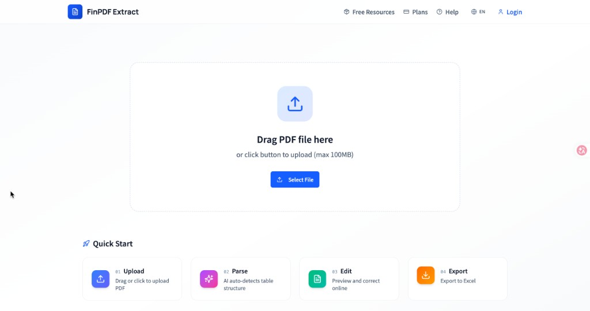

*上传 → AI 解析 → 编辑 → 导出 Excel，链路短、好演示*

**报告快写（官方样板）**：批量上传资料建知识库，AI 生成带来源、图表的报告，导出 PDF / Word。做选题 8、9 时，重点抄它的闭环就行。

体验：[https://infinisynapse.cn/apps/report-writer](https://infinisynapse.cn/apps/report-writer)

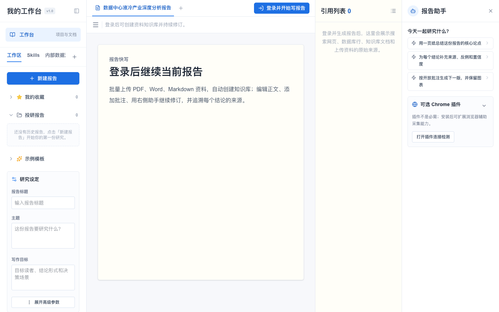

*上传 → 分析 → 成稿，运营类作品的标准答案*

**ProjectValueLab**：立项前先把项目价值算清楚。证据、评分、风险、建议一条龙——偏 B 端决策，和「周报 / 诊断」是同一族交互。

体验：[https://pvl.octoooo.com/projects/new](https://pvl.octoooo.com/projects/new)

*结构清楚，评委也喜欢这种「有结论」的工具*

---

## 四、生活 / 决策

### 选题 10｜租房 / offer 决策打分器（一天可完成）

丢 2～3 个候选进去，按你的权重打分给建议。轻量、好演示，很适合「今晚收尾、明天交卷」。

### 还没方向？先去实验室逛一圈

**析数（已上线参赛作品）**：智能决策分析平台，旅游花费、餐厅推荐、应季饮食、职场决策都能问。底层走 InfiniSynapse 泛数据分析引擎，还支持联网。选题 10 这类「帮我做决定」的方向，可以对着它抄交互——你再收窄成「只做租房对比」或「只做 offer 打分」，更容易交卷。

体验：[https://www.lgbisha.cn/](https://www.lgbisha.cn/)

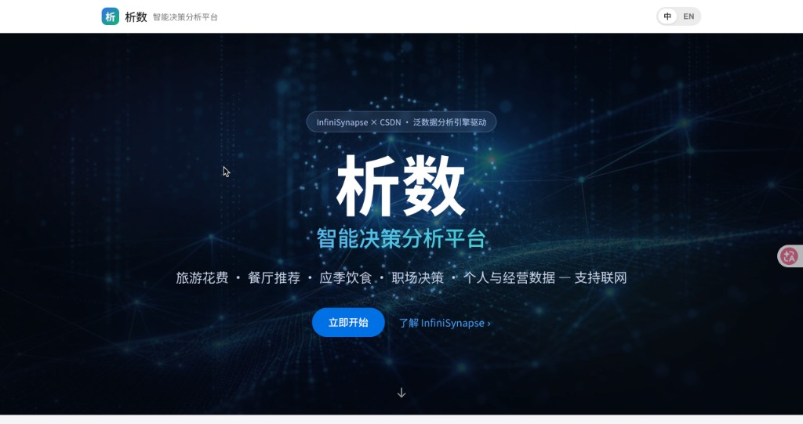

*生活决策一站问，场景广但入口清晰*

**泛数据分析应用实验室（官方样板）**：63 个生活决策模版——薪资、住房、健康、消费……总会撞上一个你想做的。最省事的起步方式：**挑一个模版，改成更垂直、更贴近你用户的版本。**

体验：[https://infinisynapse.cn/apps/personal-analytics](https://infinisynapse.cn/apps/personal-analytics)

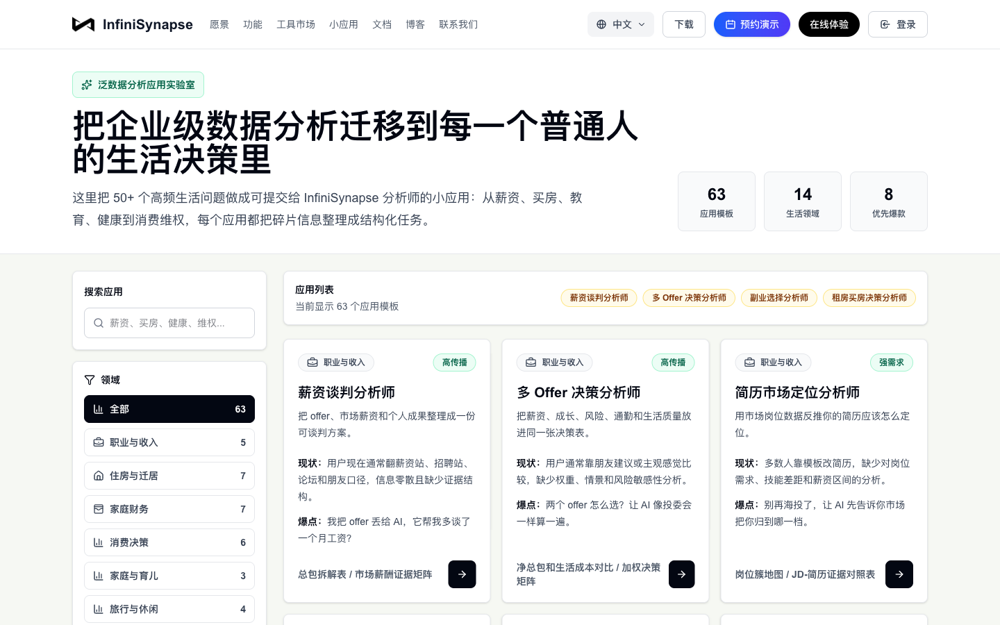

*从「改模版」开始，往往比从零想快一倍*

---

## 怎么挑，才不容易踩坑

- **只想稳稳拿奖**：选一天能做完的（选题 1、5、10）。小而完整就够。
- **想冲一冲名次**：选选题 2、7、8——场景清楚，UI 再打磨一下就好看。
- **你本来就懂某个行业**：做你熟的。做得深，比做得广更容易得分。
- **最容易被低估的加分项**：作品上线后，尽量让真实用户去用、去调 API。有调用记录，比「功能很多但没人用」强太多。

> [!callout]
> 再说一遍：参与奖 50 个名额还没坐满。已经报名但还没交的同学，现在动手一个周末，比继续观望划算得多——截止是 7 月 31 日。

---

## 三步还来得及

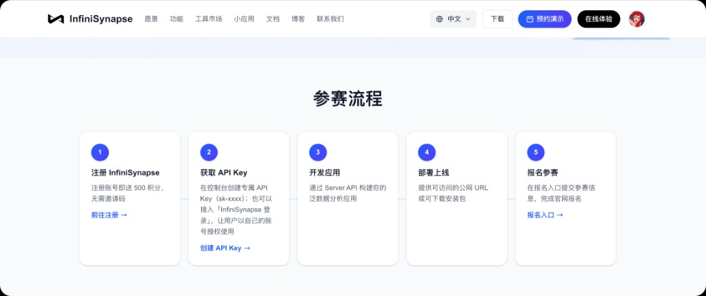

*注册 → API Key → 开发 → 部署 → 提交*

1. **注册 InfiniSynapse** — [前往注册](https://app.infinisynapse.cn/tasks)，新用户送 500 积分
2. **创建 API Key** — [获取 Key](https://app.infinisynapse.cn/ai/apikey)，按 [Server API 文档](https://infinisynapse.cn/zh/docs/InfiniSynapse%20Server%20API%20Reference) 接入
3. **开发 + 部署 + 提交** — 7 月 31 日 23:59 前交上就行；截止前还能继续改，不用重新报名

完整规则和奖励说明在这儿：[https://infinisynapse.cn/contest/vibe-coding](https://infinisynapse.cn/contest/vibe-coding)

卡住了别硬扛，进群问就行——技术答疑、选题讨论、进度打卡都在。

*大赛活动群答疑打卡，创作者社群围观创意*

---

挑好选题了吗？评论区报个号。说不定下一篇「优秀作品展示」里，就有你交上来的那个。
