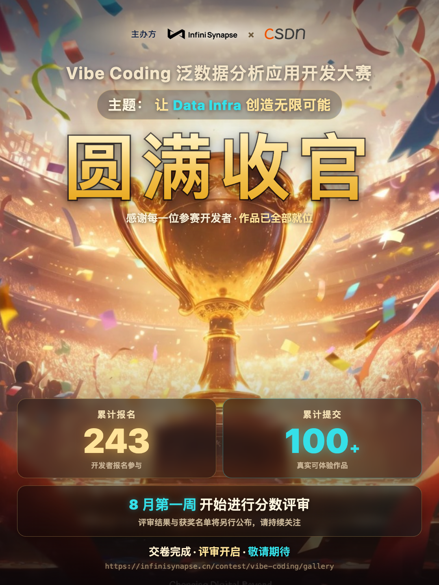
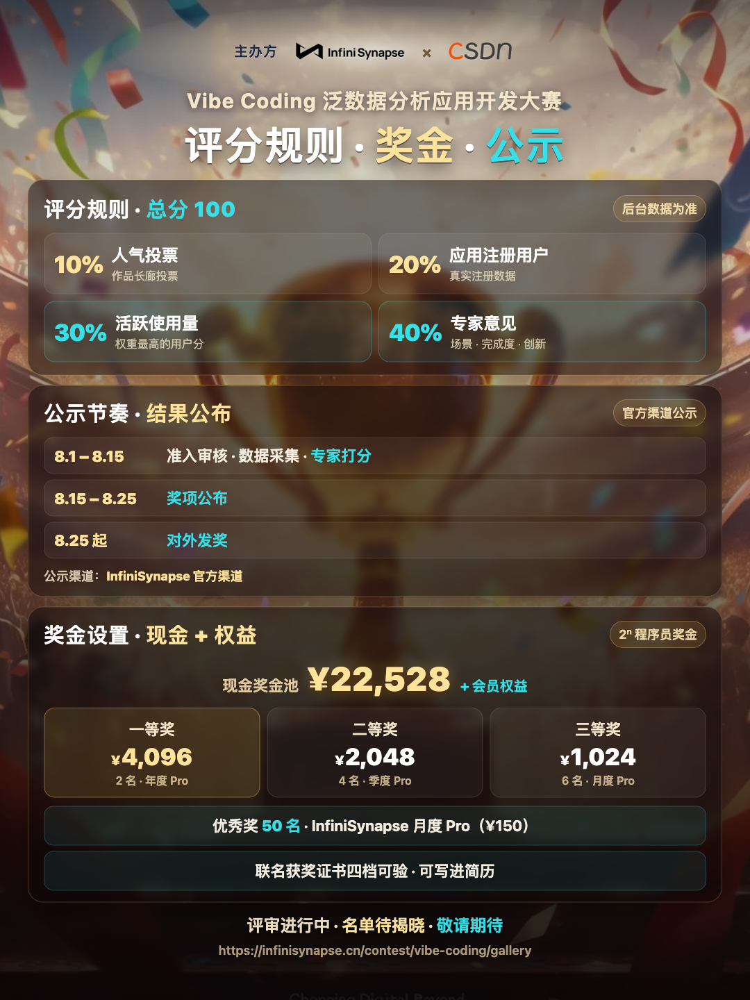
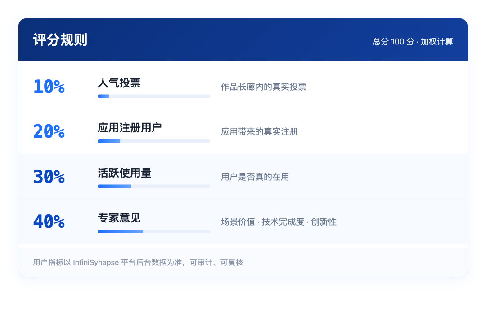
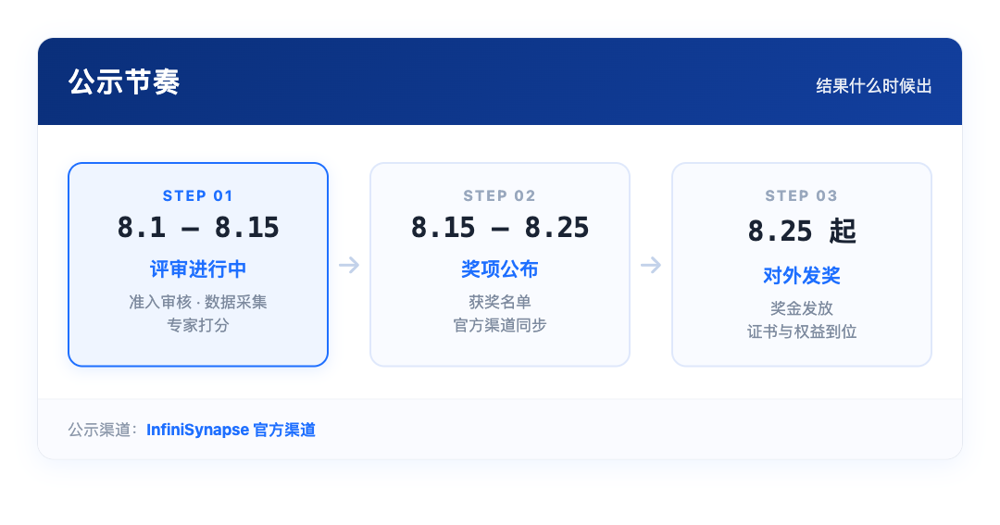
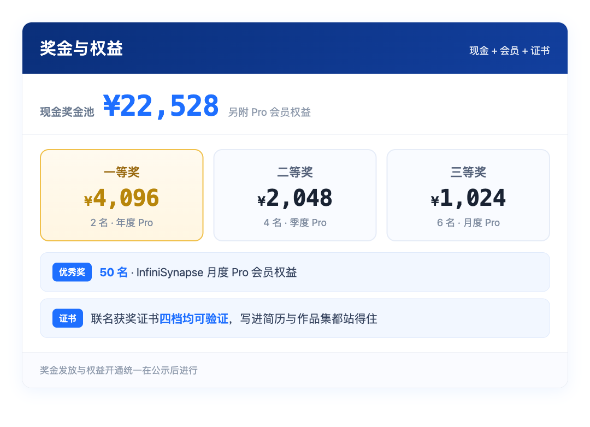
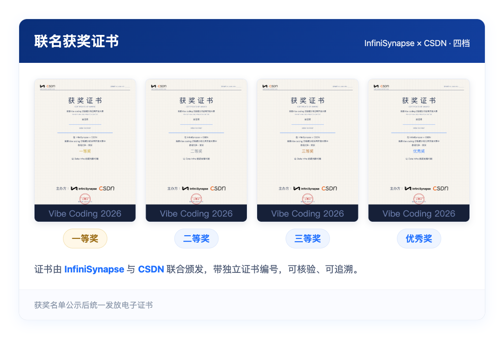

# 圆满收官｜243 人报名、100+ 作品，接下来是揭晓时刻

7 月 31 日 23:59，InfiniSynapse × CSDN「Vibe Coding」泛数据分析应用开发大赛正式截止提交。

主题是那句我们从第一天喊到最后一天的话——**让 Data Infra 创造无限可能**。

现在，所有作品都已就位。

## 一、收官数据：243 与 100+

- **累计报名 243 人**
- **累计提交 100+ 件真实可体验作品**

这里的「可体验」不是形容词。参赛要求写得很明确：必须是**可运行、已上线、能被评委真实打开使用**的应用，并且后端通过 Server API 真正调用了 InfiniSynapse 完成数据分析——纯脚本、命令行工具、Notebook 都不算。

也就是说，这 100+ 件里，每一件都是能点开、能跑、能被人用的东西。

> [!important] 我们最想说的一句
> 这场比赛真正的产物不是排名，而是 100 多个从「我有个想法」走到「我上线了」的开发者。作品长廊会一直开着，它们不会随着比赛结束而消失。

## 二、评分规则：一次讲清，不留悬念

总分 100 分，四个维度加权，全部以平台后台数据与评审团打分为准。

*用户指标以平台后台数据为准，不看 GitHub Star，也不看下载量*

换句话说：做了真实场景、有人真在用、技术上站得住脚的作品，会被看见。

## 三、公示节奏：什么时候能知道结果

评审不是一句「敬请期待」就完事，我们把节奏摊开：

*当前处于第一阶段：准入审核与专家打分同步进行*

公示渠道为 **InfiniSynapse 官方渠道**，届时会同步完整名单。

> [!tip] 参赛选手请注意
> 这段时间请保持**应用可正常访问**、联系方式畅通。准入审核阶段评委会逐一实际打开你的应用，如果这时候服务挂了、链接失效了，会直接影响准入结果。

## 四、奖金与证书：一起放在明面上

现金奖金池 **¥22,528**，另有会员权益。

*一二三等奖另附 Pro 会员权益，优秀奖 50 名同样有月度 Pro*

除了现金和会员，还有一份更耐用的东西——**联名获奖证书**。

*四档证书均由双方联合颁发，带独立编号，可核验*

证书由 InfiniSynapse 与 CSDN 联合颁发，四档都带独立证书编号。对很多参赛的同学来说，这份可验证的比赛经历写进简历和作品集，可能比奖金更耐用。

## 五、比赛结束，但事情才刚开始

有几件事想提前说一声：

- **作品长廊会持续开放。** 已提交的作品仍可被体验、被使用，好作品的生命周期不该只有一个比赛周期那么长。
- **获奖作品合集将在公示后上线。** 我们会把值得被看到的应用集中呈现出来。
- **我们正在筹备下一场。** 已经在联系新的合作伙伴，形式会和这次不太一样——包括一场面向开发者的联合直播，以及一些还不方便提前讲的安排。

如果你这次因为时间没赶上、或者做到一半停下了——不用遗憾，把手头那个半成品留着。下一场很快。

## 六、现在可以做的三件事

1. **关注公众号并设为星标**，奖项公布第一时间在这里发布
2. **去作品长廊逛一圈**，看看这 100+ 件作品别人是怎么做的
3. **留言告诉我们**，下一场你想比什么、想做什么方向

感谢每一位参赛开发者。243 个报名、100 多件作品，构成了这场比赛真正的分量。

**评审进行中，名单待揭晓。**

作品长廊：https://infinisynapse.cn/contest/vibe-coding/gallery
