# InfiniSynapse × CSDN Vibe Coding 最终获奖名单

2 一等奖 + 4 二等奖 + 6 三等奖 + 50 优秀奖，共 **62** 件。截图来自 `vibe-coding-award-report/images/`。日期 2026-08-21。

一二三等奖品类互不重复。优秀奖品类允许重复。

## 评级怎么打

综合分 = 场景价值 × 40% + 技术完成度 × 35% + 创新性 × 25%。

| 综合评级 | 分数区间 | 含义 |
| :---: | --- | --- |
| S | ≥ 8.50 | 场景、完成度、创新都到头部，可当标杆 |
| A | 7.50–8.49 | 主路径成立，至少两项明显强 |
| B | 6.50–7.49 | 能用，但完成度或差异化不够拉开 |
| C | 5.50–6.49 | 方向对，材料或产品深度偏弱 |
| D | < 5.50 | 信息披露不足，或还停在概念 / demo |

## 一等奖（2）

### 1. SEO Health Checker

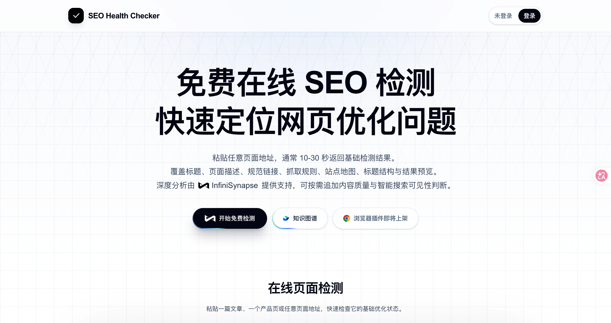

**A · 7.85** · 内容增长 · [体验链接](https://aimeetup.center/)

**总评：** 工具形态完整，AI 可见性是本届少有的增长侧新切口。

- **场景价值 7.5：** 发文前体检、站点巡检、AI 搜索可见性对创作者和 SEO 是明确工作流，插件降低使用摩擦。
- **技术完成度 8.5：** 网页+浏览器插件双形态，基础技术 SEO + E-E-A-T + AI 可见性，SSO 后走用户积分，即开即用。
- **创新性 7.5：** 把「AI 搜索/问答是否愿意引用该页」产品化，比传统 SEO 检测多一层时代增量。

### 2. AI智能售卖机商品推荐

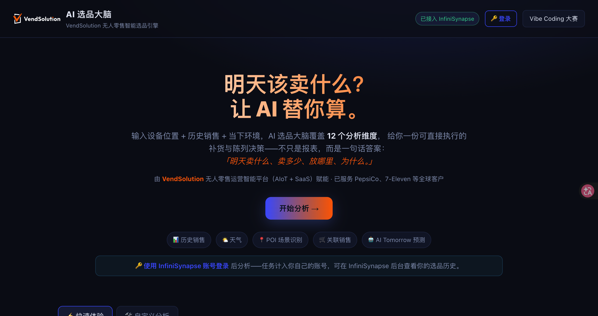

**C · 5.85** · 零售补货 · [体验链接](https://productselect-production.up.railway.app/)

**总评：** 切口不俗，信息披露不足，产品完成度只能按可见材料保守给分。

- **场景价值 6.5：** 无人零售补货与动销分析有明确运营商用户，但材料几乎未展开决策深度。
- **技术完成度 5.0：** 仅一句话介绍，公开信息无法判断分析闭环、数据接入与报告质量。
- **创新性 6.0：** 售卖机补货相对垂直少见，有场景独特性，但机制未见。

## 二等奖（4）

### 1. 仲裁小助手

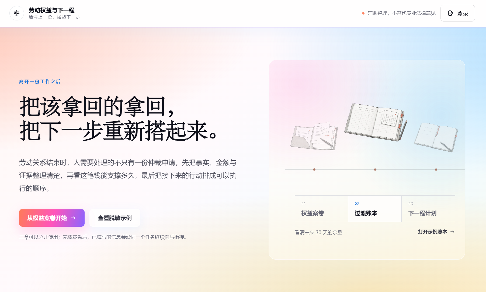

**A · 7.60** · 法律权益 · [体验链接](https://la.tracemuse.top/)

**总评：** 场景极强、交付物具体；作为产品还偏工具单页，扩展空间大。

- **场景价值 8.5：** 劳动仲裁赔偿、申请书、证据清单是高利害、强时效的真实法律需求。
- **技术完成度 7.0：** 输入少、产出文书与法条依据，轻量但可执行；产品模块少于尽调/核数类重型应用。
- **创新性 7.0：** 用再就业周期判断「赔偿金能否覆盖空窗期」，把法律计算接到生活决策，有洞察。

### 2. 鼹鼠

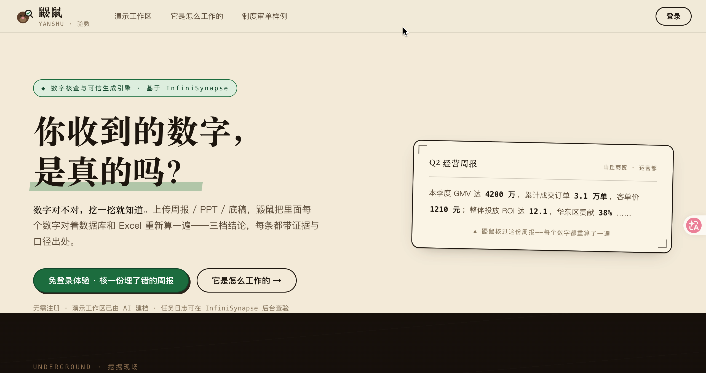

**S · 9.30** · 可信数据 · [体验链接](https://yanshu.octoooo.com)

**总评：** 人气与产品实力错位最大的作品：把「可信数字」做成引擎，而不是又一个分析聊天窗。

- **场景价值 9.0：** 审计/投行/咨询/经营分析岗每天核数，交报告和收报告两端都有强付费理由。
- **技术完成度 9.5：** 主张抽取、联邦重算、三档结论、口径复利、纠错重验、已核实版、即焚、公开工程指标，几乎是生产级。
- **创新性 9.5：** 模型无权判❌、数字与叙事责任分离、口径裁决沉淀，是本届最强的方法论创新。

### 3. 司南 SINAN · 多智能体证据研判引擎

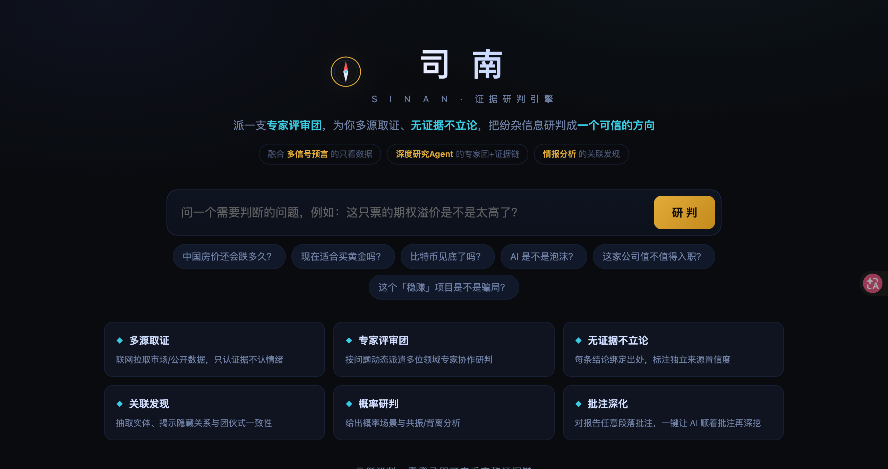

**S · 9.38** · 高风险决策 · [体验链接](http://47.119.112.225/sinan/app/)

**总评：** 本届产品完成度与决策价值的标杆之一，证据链方法论可直接产品化。

- **场景价值 9.5：** 覆盖买房择时、入职尽调、投资避坑、识别骗局等高利害决策，用户愿为「少踩一次坑」付费，场景刚需且结果可改变行动。
- **技术完成度 9.5：** 多智能体取证、结论绑定证据与置信度、实体关联、可视化报告、taskId 可核验、分享与批注均齐，产品主路径完整。
- **创新性 9.0：** 「无证据不立论」把研判做成可核验产品，隐藏关联/团伙特征发现超出普通问答包装。

### 4. SafeX

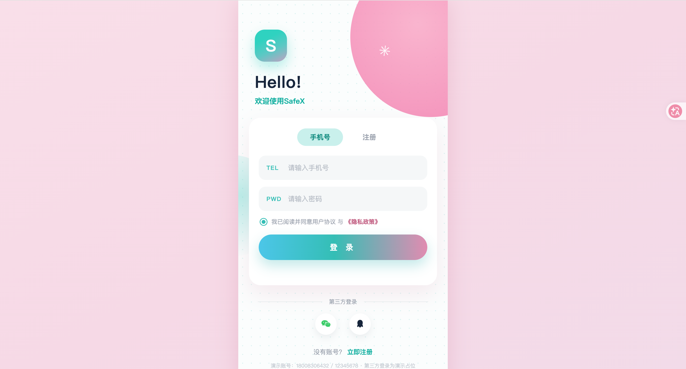

**S · 8.78** · 公共安全 · [体验链接](http://47.94.57.145)

**总评：** 本届社会价值最高的作品之一，产品模块扎实，值得单独看待。

- **场景价值 9.5：** 骚扰、跟踪、家暴场景下，定性、取证、求助路径是生命安全级需求，社会价值极高。
- **技术完成度 8.5：** 2300+ 事件洞察、AI 报告引法条、SOS 守护、工具箱与内容库，API 失败降级到本地模板，公益产品完成度高。
- **创新性 8.0：** 数据洞察、即时求助和法律自助打通，不是单点紧急按钮或单点聊天。

## 三等奖（6）

### 1. LifeFlow Agent——本地生活数据决策分析管家

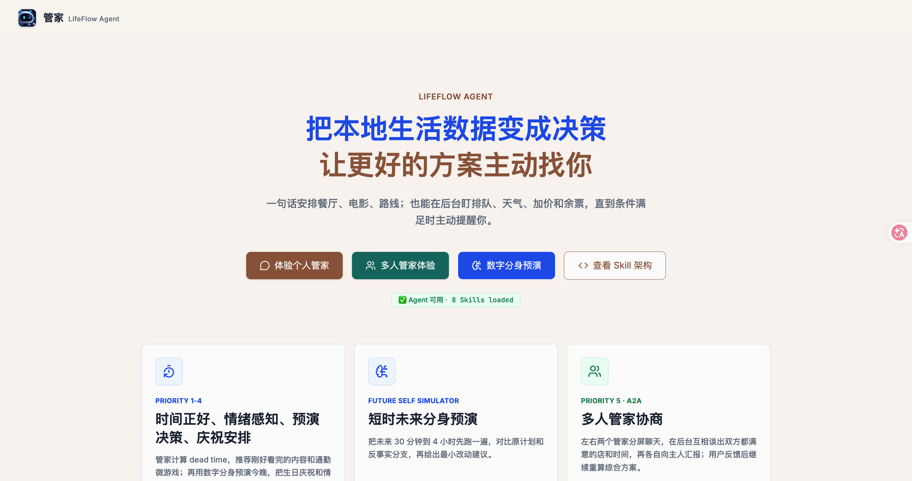

**S · 8.68** · 生活决策 · [体验链接](https://qiyucai.cn/InfiniSynapse/)

**总评：** 生活决策里产品化最深的作品：隐私协商 + 可对比方案，而不只是聊天推荐。

- **场景价值 8.5：** 餐厅/天气/交通/票务的多人出行决策是高频真实痛点，产出方案、对比看板与报告，决策闭环清楚。
- **技术完成度 9.0：** 个人管家、多管家协商、未来预演三套体验独立可用；SSE、任务持久化、重试降级、密钥仅服务端，工程完整。
- **创新性 8.5：** Context Broker 只交换脱敏约束的多人协商，以及未来时间预演，是少见的产品机制创新。

### 2. Offer 雷达｜入职前公司尽调助手

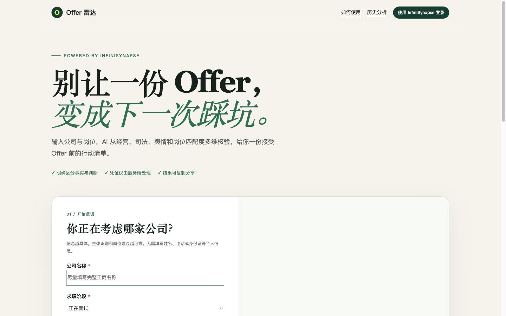

**S · 8.62** · 求职职业 · [体验链接](https://offerradar.cn)

**总评：** 求职决策类里最接近可上线 SaaS 的作品，证据与行动清单都落到签约前。

- **场景价值 9.0：** 校招/跳槽/签 Offer 前核验主体、舆情、劳动风险，决策利害高、付费意愿明确。
- **技术完成度 9.0：** Partner SSO、多源交叉核验、事实与判断分离、多格式导出、任务恢复与备份重试，部署与安全说明完整。
- **创新性 7.5：** 尽调维度设计专业，但「公司尽调报告」形态在求职工具里已较常见。

### 3. 医数智析

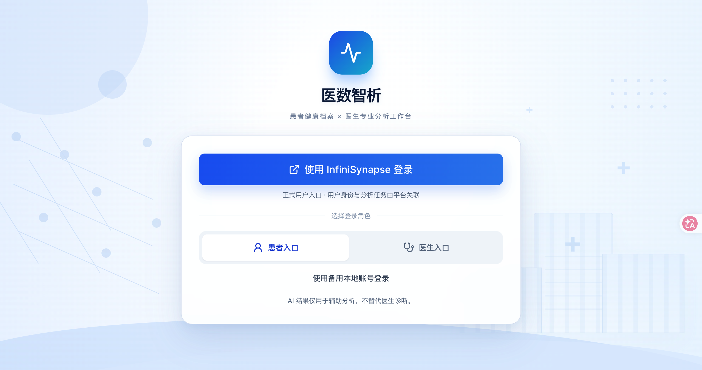

**A · 8.45** · 医疗健康 · [体验链接](https://129.204.17.83/agentmedicine/)

**总评：** 医疗场景价值很高，产品结构完整；创新更多在工作流设计而非新品类。

- **场景价值 9.0：** 患者「看不懂、存不全」与医生跨时间整理资料是刚需，健康档案能改变就医和随访行为。
- **技术完成度 8.5：** 患者端+医生工作台、10 组演示病例、多 Agent 质检/趋势/用药安全、Partner SSO 用户级归因，可完整体验。
- **创新性 7.5：** 双端纵向档案 + 医生审核后发布，比单次问诊机器人完整，但 AI 辅助诊疗赛道本身并不新。

### 4. DataForNGO Lab — Insight Engine

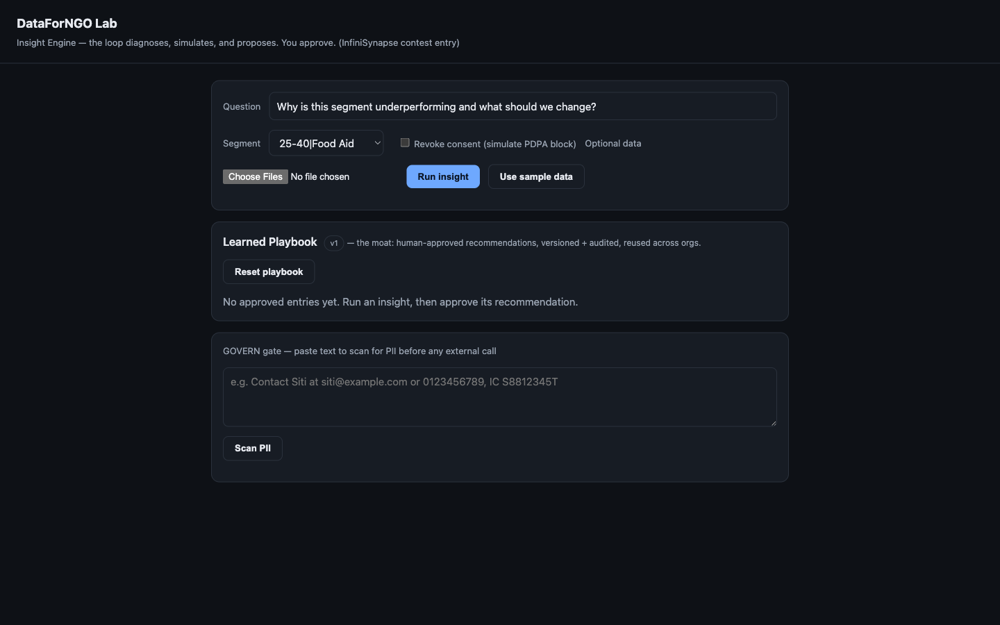

**A · 8.43** · 公益合规 · [体验链接](https://dataforngo-lab.swmengappdev.workers.dev)

**总评：** 公益数据产品的正确姿势：先算清、先合规，再让 AI 说话。

- **场景价值 8.0：** NGO 缺合规、可审计的「为何差、该怎么做」工具，被主流产品忽略的真场景。
- **技术完成度 8.5：** 本地 WASM 做严谨计算，PDPA k-匿名/目的限制/PII 闸门后再调用云端叙述，职责分离正确。
- **创新性 9.0：** 嵌套推理图 + 合规闸门 + 跨租户学习手册，是本届少有的治理型创新。

### 5. FORGE·X 智造洞察 —— 面向 3D 打印（增材制造）工厂的生产数据分析应用

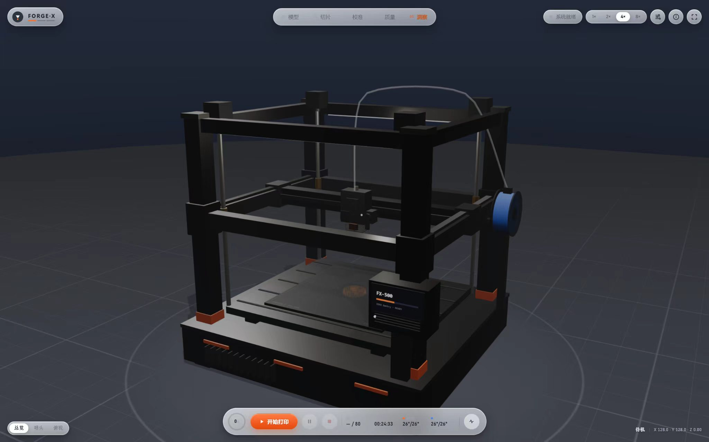

**A · 8.18** · 工业制造 · [体验链接](https://ivancodes.cn/projects/forgex)

**总评：** 垂直工业场景里完成度和对象化最好的作品，不是泛分析换皮。

- **场景价值 8.0：** 车间故障率、材料失败、成本归属是工厂管理真实问题，目标用户（主管/工艺/质量）清晰。
- **技术完成度 8.5：** 自然语言提问、SSE+SQL 聚合、示例/CSV/仿真采集、问题机台 3D 视口高亮、taskId 可核对，垂直闭环完整。
- **创新性 8.0：** 增材制造 + 3D 定位问题机台，把分析结论接回产线对象，赛道独特。

### 6. 提前退休研究所

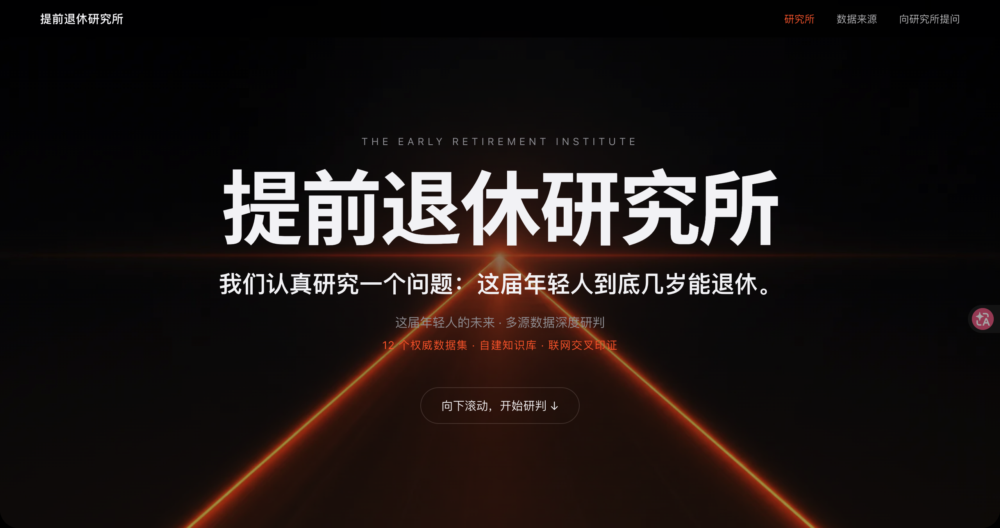

**A · 8.18** · 公共决策 · [体验链接](https://fire.lgbisha.cn)

**总评：** 把公共数据做成可核验的人生账本，产品完成度和叙事都强。

- **场景价值 8.0：** 延迟退休与养老金是社会级议题，个人也能算清法定年龄和城市 FIRE 起步价。
- **技术完成度 8.5：** 12 个权威数据集入库可查、六章可溯源叙事、退休年龄计算器，研究产品化完整。
- **创新性 8.0：** 研究所体例+多源交叉+方法论边界声明，比普通计算器更像公共知识产品。

## 优秀奖（50）

### 1. 退货雷达

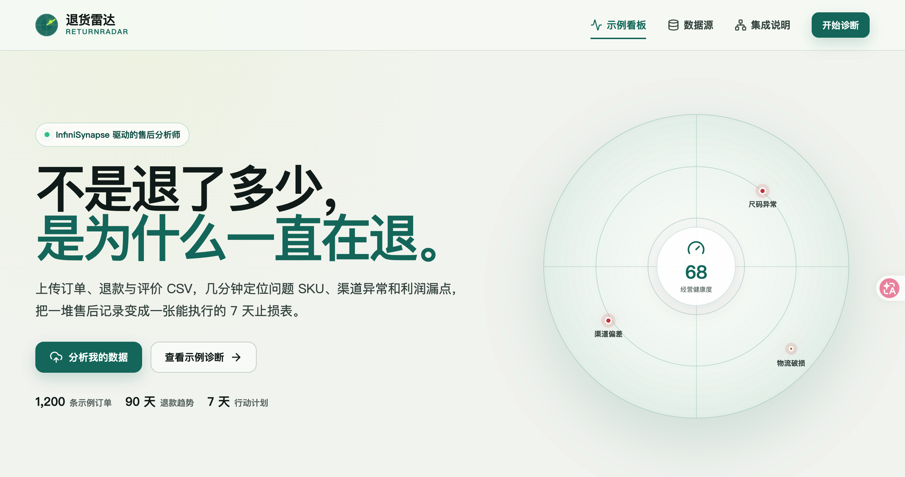

**A · 8.12** · 经营电商 · [体验链接](https://returnradar.zzyscut.top/)

**总评：** 经营分析类里最会问对问题的作品之一，行动方案可落地。

- **场景价值 8.5：** 退款直接吃利润，中小电商「损失在哪、为何发生、先做什么」是真经营问题。
- **技术完成度 8.5：** 字段识别、核心指标、高退 SKU/渠道/地区/原因、诊断报告与 7 天止损方案、可追问，闭环完整。
- **创新性 7.0：** 问题定义比同类清晰，但退货分析本身不是新品类。

### 2. 装明白｜装修报价与合同风险联审 AI

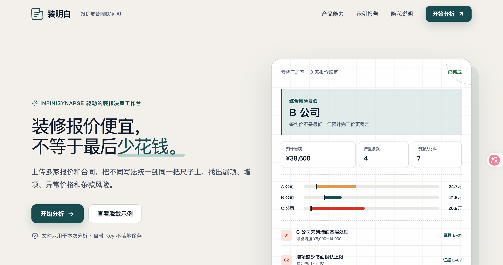

**A · 8.07** · 生活决策 · [体验链接](https://zhuangmingbai.hudejing.art)

**总评：** 装修决策类完成度最高：把钱和条款放到同一张谈判桌上。

- **场景价值 8.5：** 业主同时面对多家报价、合同和口头承诺，联审比单看报价单更接近真实签约决策。
- **技术完成度 8.0：** 多文件对齐项目/单位/范围，漏项增项异常单价，三情景成本，证据链与谈价清单，临时 Key 安全。
- **创新性 7.5：** 报价+合同+承诺联审、签约/常规/风险上限三情景，比单审计员完整。

### 3. 数鉴交易市场

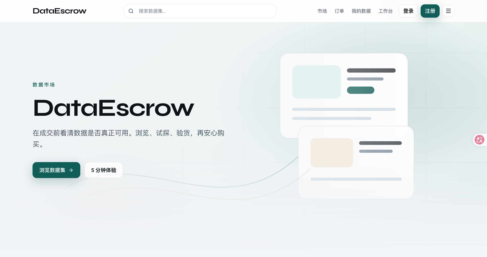

**A · 8.07** · 可信数据 · [体验链接](https://dataescrow.suzhouye.cn/)

**总评：** 想法非常产品：验货室而不是货架。若交易闭环再实，可进头部。

- **场景价值 8.0：** 数据买卖缺的是成交前信任，买方提问、卖方侧计算，对准数据要素市场真问题。
- **技术完成度 7.5：** 批准问题、域内计算、质量证书，机制清楚；交易撮合、合规与规模化细节未充分展开。
- **创新性 9.0：** 先成交「哪些问题可以被回答」，数据不出域，是本届最强的交易机制创新之一。

### 4. 跨境智选 SuperSignal｜基于供需信号的跨境优选决策平台

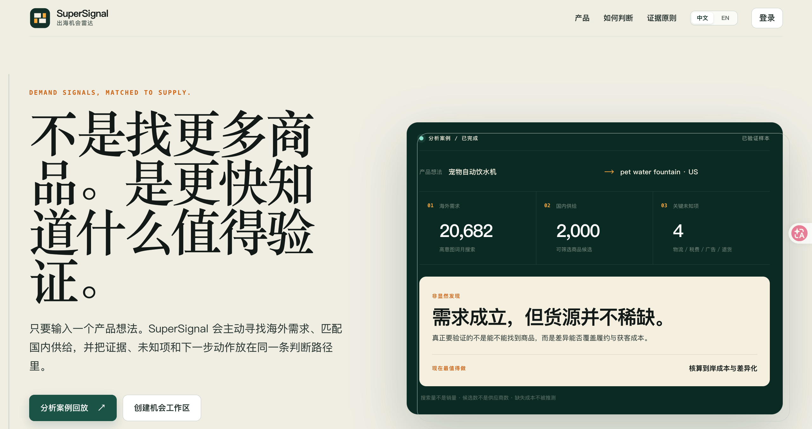

**A · 8.00** · 跨境电商 · [体验链接](https://supersignal.kangkona.workers.dev/)

**总评：** 决策产品意识强：先判断值不值得验证，而不是假装能算爆款概率。

- **场景价值 8.0：** 跨境选品缺的是「值不值得继续验证」，不是再做一张表，卖家决策价值高。
- **技术完成度 8.0：** 需求检索、供给匹配、证据/未知项/下一步动作可回看，明确不在缺数据时编利润。
- **创新性 8.0：** 保留反对证据与数据边界，把选品做成判断路径而非爆款预测，方法论成熟。

### 5. Evidence Desk 专家发现台

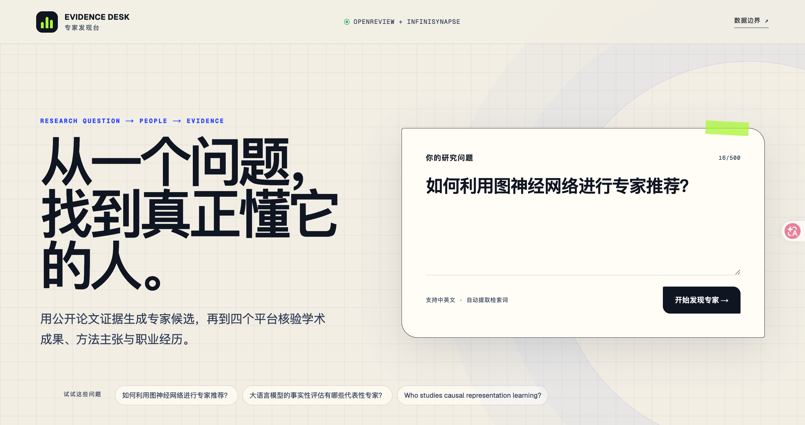

**A · 8.00** · 科研学术 · [体验链接](https://experts.threeradius.com)

**总评：** B 端研究工具里少见的克制：先给证据，再给下一步调查。

- **场景价值 8.0：** 科研管理、技术尽调、人才寻访需要「谁有证据证明能做这个问题」，不是再做一个专家黄页。
- **技术完成度 8.0：** OpenReview 实时检索、论文证据、多源核验入口，第二阶段做匹配、同名风险与核验清单。
- **创新性 8.0：** 证据型专家发现、暴露缺口而不是给信任分，方法专业。

### 6. mynx

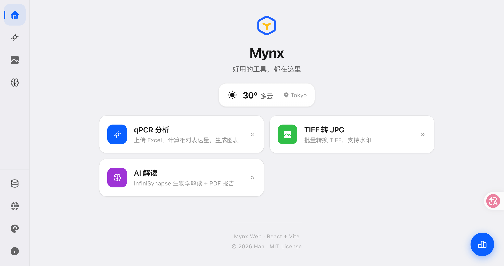

**A · 8.00** · 科研工具 · [体验链接](https://mynx-web.vercel.app/)

**总评：** 垂直科研生产力工具，专业闭环和本地优先都到位。

- **场景价值 8.0：** 生物医学 qPCR 出图和 TIFF 归档是实验室刚需，能直接减少 Excel 宏错误。
- **技术完成度 8.0：** 浏览器内算相对表达量、误差棒图表、TIFF 批处理水印、IndexedDB 暂存，再交给 Agent 解读。
- **创新性 8.0：** 专业计算留在本地、AI 只做解读，科研工具形态少见且正确。

### 7. 城市值得去工作吗（city_worth）

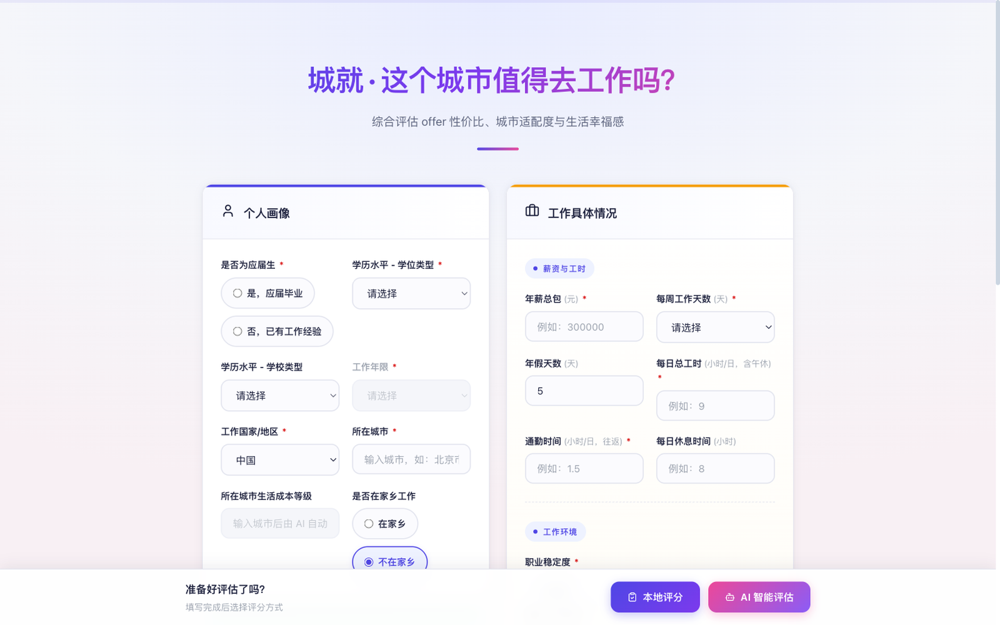

**A · 7.95** · 求职职业 · [体验链接](https://iscityworth.asia/)

**总评：** 求职城市决策里最完整的 C 端产品之一。

- **场景价值 8.5：** Offer×城市（房价、落户、通勤、工时）是应届和跨城跳槽的核心纠结。
- **技术完成度 8.0：** 个人画像、14 城知识库、本地规则分、流式 AI 报告、PDF/MD、SSO，产品完整。
- **创新性 7.0：** 把碎片信息收成一站式评估，整合力强；星座五行略稀释专业感。

### 8. 面试模拟器

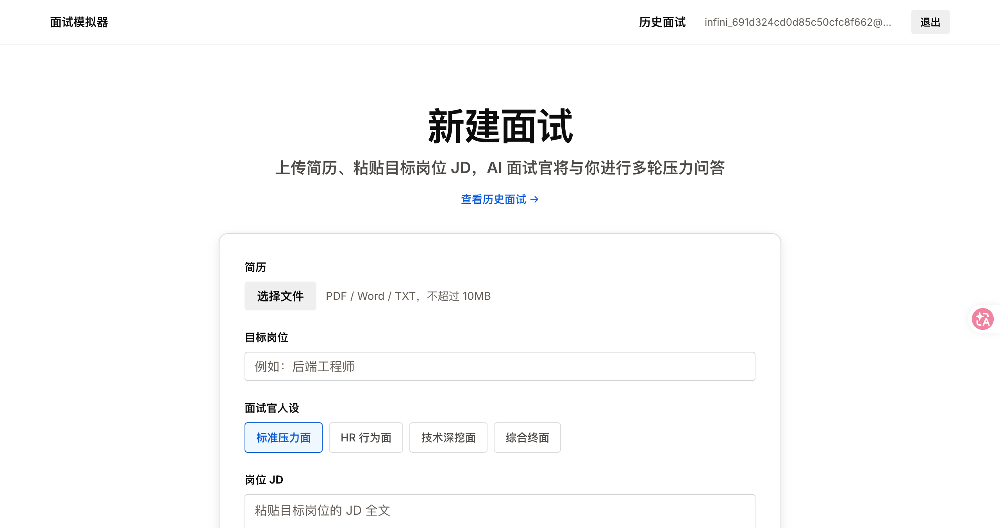

**A · 7.80** · 求职职业 · [体验链接](http://150.158.148.112)

**总评：** 求职陪练里工程完成度最高的一档，创新空间被赛道同质化压住。

- **场景价值 8.0：** 真人陪练稀缺，简历+JD 个性化面试对求职工程师是刚需，评分与复盘可改进下次表现。
- **技术完成度 8.5：** 四种面试官人设、SSE 流式、中断恢复、历史对比、PDF、Partner SSO，密钥不进前端，工程扎实。
- **创新性 6.5：** 面试模拟是本届拥挤赛道，差异主要在人设与工程，而非新品类。

### 9. 住哪儿｜租房通勤决策器

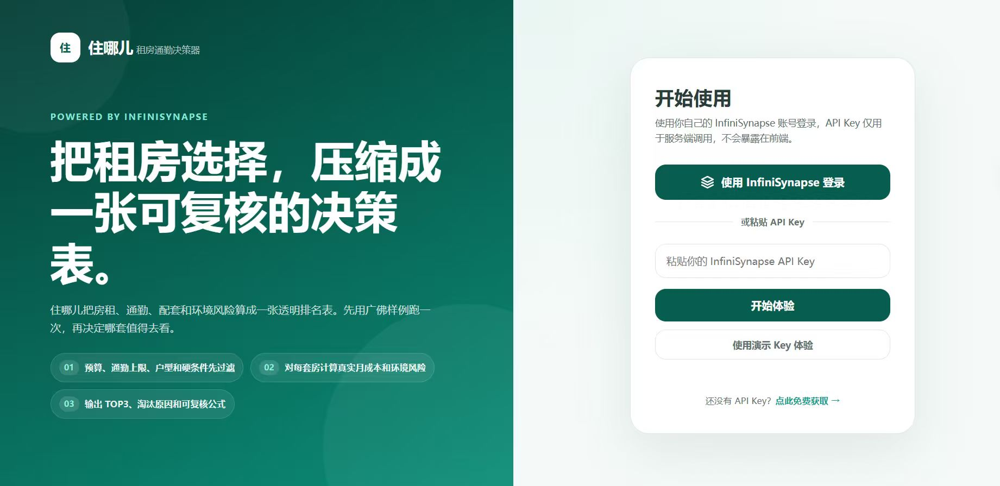

**A · 7.78** · 生活决策 · [体验链接](https://guangforent-zhunaer-d3glw67kxb5de30db.webapps.tcloudbase.com)

**总评：** 场景切入准，产品叙事强；若数据源与复核能力再实，会更接近头部。

- **场景价值 8.5：** 租房只看月租、漏算通勤与商水商电，是一线城市高频高额决策，签合同前算清很有价值。
- **技术完成度 7.5：** 把通勤、真实月成本、配套、风险压成可复核决策表，主路径清楚；公开材料对工程细节披露少于头部作品。
- **创新性 7.0：** 隐性成本折现与「便宜房其实最贵」的量化框架有产品洞察，但形态仍是决策计算器。

### 10. AI 装修报价审计员

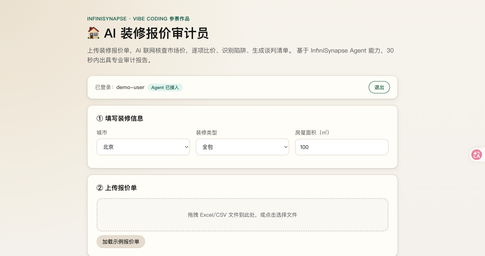

**A · 7.78** · 生活决策 · [体验链接](https://reno-audit.vercel.app)

**总评：** C 端省钱工具打点准，单报价审计已经可用。

- **场景价值 8.5：** 装修报价陷阱让业主损失数万很常见，逐项比价和谈判清单可直接省钱。
- **技术完成度 7.5：** 上传报价、联网市价、6 类陷阱、谈判与漏项、Agent 全流程自动审批出报告，主路径完整。
- **创新性 7.0：** 审计员定位清楚，但与「装明白」同赛道，联审深度略逊。

### 11. 语感工坊 YuGan

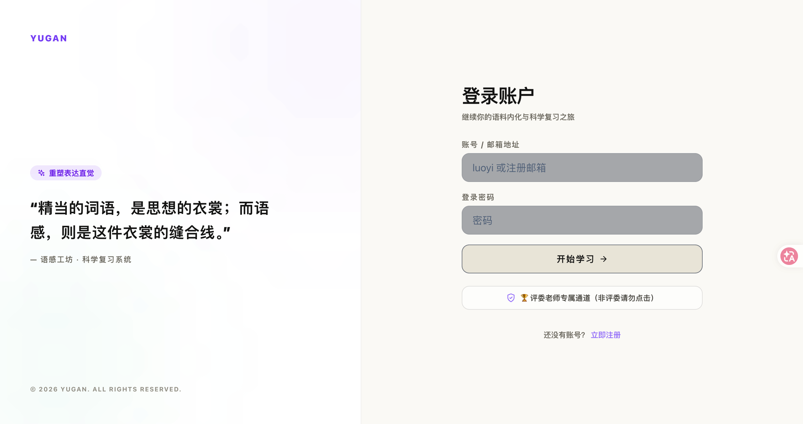

**A · 7.78** · 教育学习 · [体验链接](https://305758.xyz)

**总评：** 小众但机制完整：把学习行为变成可问的数据产品，创新高于场景广度。

- **场景价值 7.0：** 写作训练者需要把语料变成可复习资产，受众窄但使用闭环（积累—诊断—训练）清楚。
- **技术完成度 8.5：** 六表学习库注册为数据源、NL 问数、雷达诊断、BYOK、真实 Key 可查验，数据基础设施用得深。
- **创新性 8.0：** 不做文案生成器，而把语感当结构化资产来分析，产品定义少见。

### 12. 琢玉轩

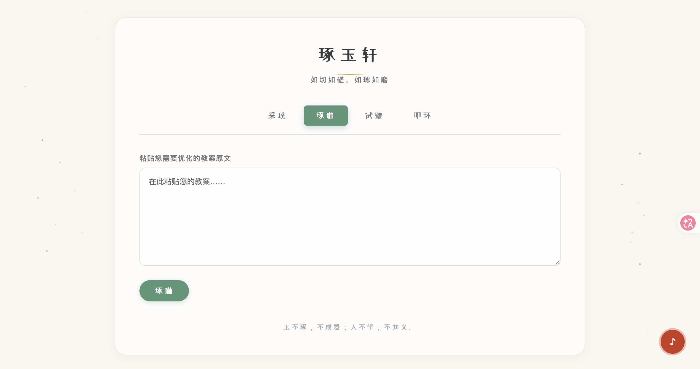

**A · 7.75** · 教育学习 · [体验链接](https://zhuoyuxuan-production.up.railway.app/)

**总评：** 教师工作台完成度高；创新在流程整合与出品形态，不是方法论突破。

- **场景价值 8.0：** 中小学教师备课、出题、微课出品是高频刚需，能省大量重复劳动。
- **技术完成度 8.0：** 采璞到凝璋五模块覆盖备课出品，SSE 驱动四项长任务，微课用 TTS+FFmpeg 真合成。
- **创新性 7.0：** 古风工作流包装完整，微课视频把备课做到「能上课」，比纯教案生成进一步。

### 13. Real Raise：涨薪真实购买力计算器

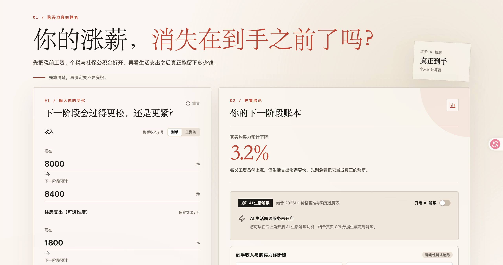

**A · 7.70** · 个人财务 · [体验链接](https://plain-wind-ae46.yefuyou2333.workers.dev/)

**总评：** 小而准的财务决策工具，洞察清晰，体量轻但打点准。

- **场景价值 8.0：** 名义涨薪 vs 到手与城市购买力，是跳槽/谈薪时人人会踩的认知坑。
- **技术完成度 7.5：** 到手模式/两期工资条、个税社保、CPI、SSE 解读与任务回放，计算+解释闭环清楚。
- **创新性 7.5：** 把「涨了多少」改写成「能买到什么」，问题定义本身就是产品创新。

### 14. 先鉴

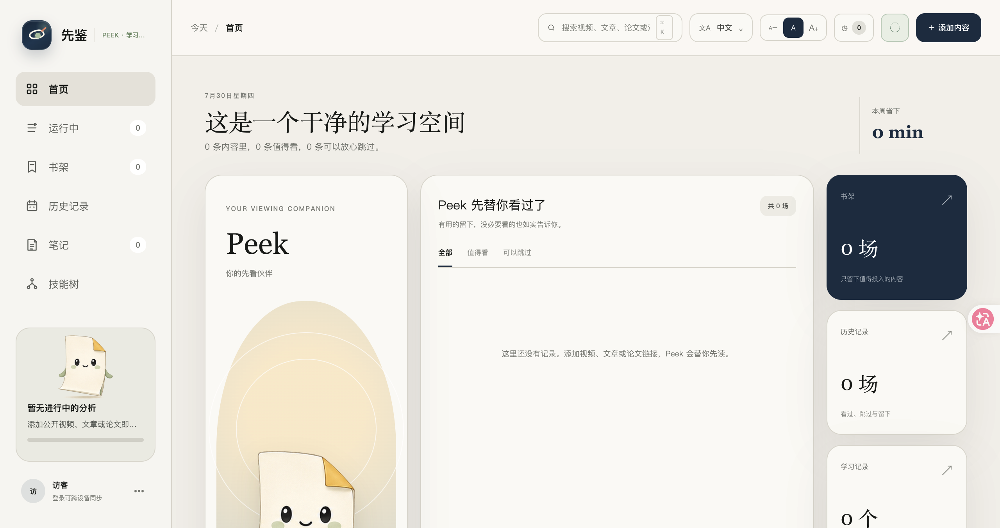

**A · 7.67** · 教育学习 · [体验链接](https://peek.antiquelixcheng5413.workers.dev/)

**总评：** 学习效率工具里机制清楚：先筛选再路线，完成度也配得上。

- **场景价值 7.5：** 长视频信息密度不均、重点难定位，对自学开发者和研究者是高频效率问题。
- **技术完成度 8.0：** 含金量/技能树匹配/时间码路线、书架笔记、任务恢复不丢状态，长任务产品化到位。
- **创新性 7.5：** 先判断值不值得看，再给可跳转观看路线，比「视频总结」多了决策层。

### 15. OPC Gate｜一人公司政策与落地路线诊断

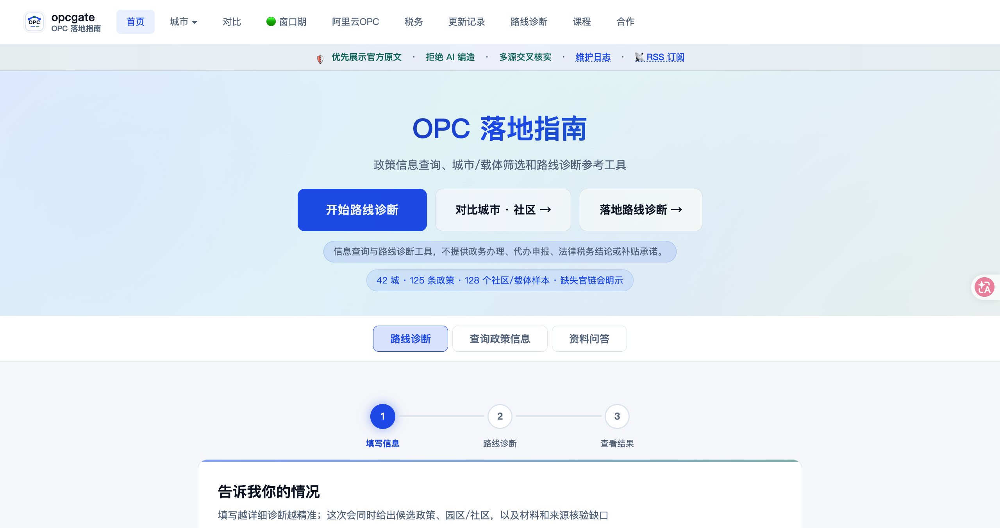

**A · 7.67** · 创业政策 · [体验链接](https://opcgate.com)

**总评：** 创业基础设施型产品，可解释性和工程核验都到位。

- **场景价值 7.5：** 一人公司面对分散政策、园区和算力资源，落地决策真实且信息获取成本高。
- **技术完成度 8.0：** 规则引擎先给可追溯匹配，再 SSE 生成城市/证据/风险/七日计划，真实 Task ID 可核验。
- **创新性 7.5：** 政策命中原因+风险边界+官方来源，再接到行动计划，不是政策问答。

### 16. 拾余

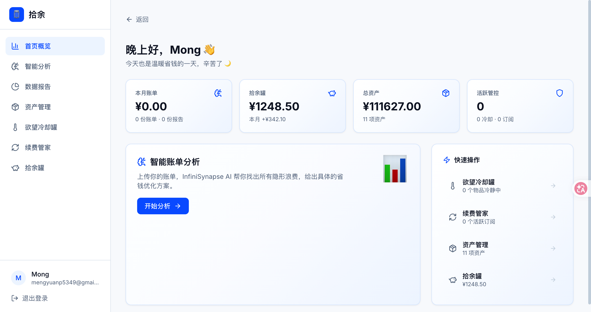

**A · 7.67** · 个人财务 · [体验链接](http://47.238.242.89:3001)

**总评：** 个人财务里体验和机制都完整，人气与实力明显不符。

- **场景价值 7.5：** 月光族要的不是又一个记账本，而是浪费点、优化方法和省下钱的去向。
- **技术完成度 8.0：** 账单双报告、欲望冷却、续费管家、闲置回血、拾余罐、八种图表、SSO，消费级闭环完整。
- **创新性 7.5：** 省钱闭环（发现—冷却—执行—可视化）比单纯消费分析更像产品。

### 17. 合同明镜 · AI 合同风险助手

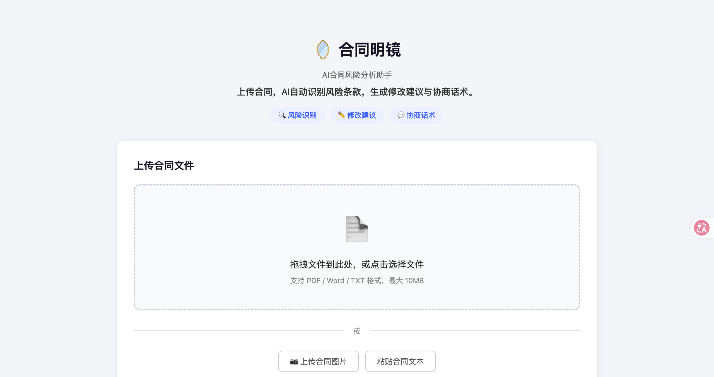

**A · 7.53** · 法律权益 · [体验链接](https://ai-contract-risk-assistant.onrender.com)

**总评：** 场景价值高、能用；要靠垂直合同类型或证据标准才能拉开差距。

- **场景价值 8.5：** 租房、劳动合同、消费合同是普通人高频高风险签署场景。
- **技术完成度 7.5：** 文本/Word/PDF/图片多格式、风险解释、改条款建议与沟通话术，C 端闭环完整。
- **创新性 6.0：** 合同审查是拥挤赛道，话术生成是体验加分，机制不新。

### 18. 掌柜参谋

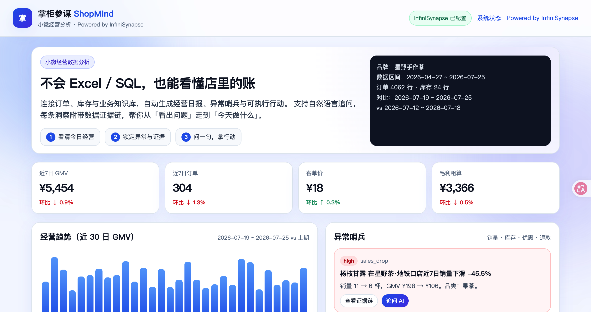

**A · 7.50** · 经营电商 · [体验链接](http://82.156.104.3:8399/)

**总评：** 小商家经营分析的扎实样本，差异化不够拉开与同类的距离。

- **场景价值 8.0：** 不会 SQL 的老板要「查数—归因—决策」，经营日报和今日行动对小商家有直接价值。
- **技术完成度 8.0：** 订单库存入模、异常哨兵带证据链、服务端 SSE 深度分析，主路径完整。
- **创新性 6.0：** 经营分析助手本届多发，证据链是加分项，品类创新一般。

### 19. 北京摆摊点位分析

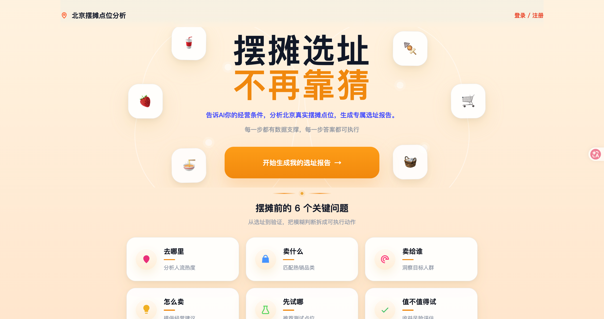

**A · 7.50** · 本地创业 · [体验链接](https://baitan-d7gzhdal4e568e34b-1442581960.tcloudbaseapp.com)

**总评：** 超垂直但可用：推荐能对照线下验证，是好的本地生活数据产品。

- **场景价值 7.5：** 新手摊主不知道北京哪里适合自己的品类和资金，决策具体、可下场验证。
- **技术完成度 7.5：** 6 项条件匹配 1200+ 真实 POI、经营策略卡、7 日计划和 PDF，主路径完整。
- **创新性 7.5：** 城市级摊位点位库+约束匹配，比泛「选址报告」更落地。

### 20. 小红书种草甄别

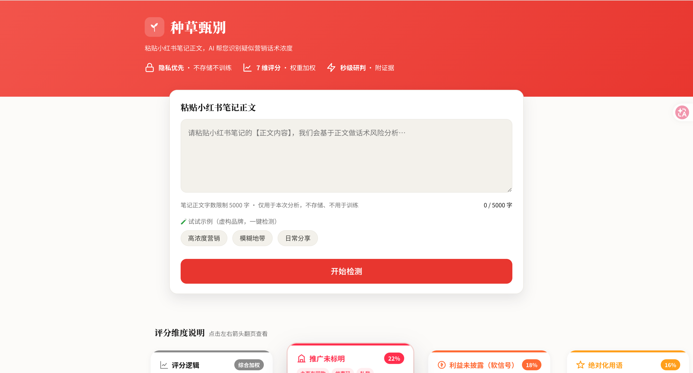

**B · 7.38** · 消费决策 · [体验链接](https://xhs-ad-detect.onrender.com)

**总评：** 日常决策工具打点准，可解释性是产品关键。

- **场景价值 7.5：** 判断笔记是不是软广，是每天都在发生的消费信任问题。
- **技术完成度 7.5：** 7 维评分、话术证据、RAG 知识库、SSE+轮询兜底，小工具闭环完整。
- **创新性 7.0：** 把广告法与软广话术库做成可解释浓度，而不是一句「感觉像广告」。

### 21. 客满满

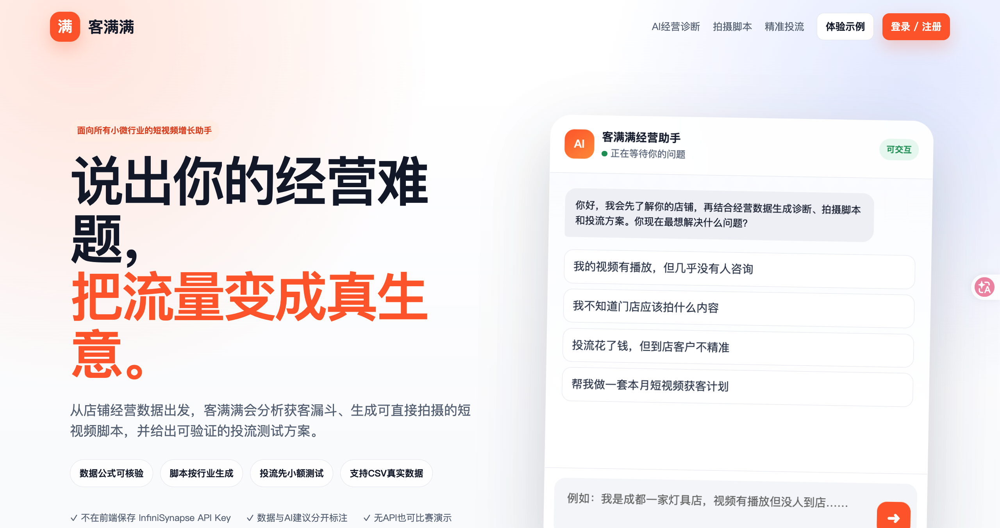

**B · 7.45** · 经营电商 · [体验链接](https://kemanman1.vercel.app/)

**总评：** 把短视频数据接到可执行经营动作，实用；解决方案形态较常见。

- **场景价值 8.0：** 小微商家「有播放没咨询、不会拍、投流不准」是当前本地经营真痛点。
- **技术完成度 7.5：** 先算转化/获客成本/ROI，再出诊断、脚本、选题、投流实验和 30 天计划，公式+AI 分层合理。
- **创新性 6.5：** 短视频经营工具不少，可执行脚本与实验方案是加分，品类不新。

### 22. Token体检

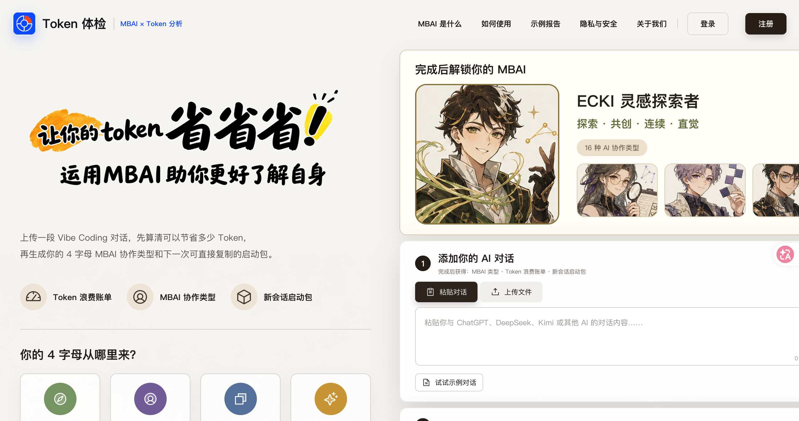

**B · 7.43** · 开发者工具 · [体验链接](http://43.132.209.68)

**总评：** 吃自己的狗粮：用数据分析改 AI 协作方式，创新明确。

- **场景价值 7.0：** 高频 AI 用户浪费上下文是真成本，对本届选手和团队培训都有用。
- **技术完成度 7.5：** 粘贴/上传对话，浪费账单、证据、优化对比、新会话启动包、SSO+SSE，交付具体。
- **创新性 8.0：** 诊断 Token 浪费并给出 16 型协作人格，是少见的元工具。

### 23. 逆向罗盘（Return Compass）

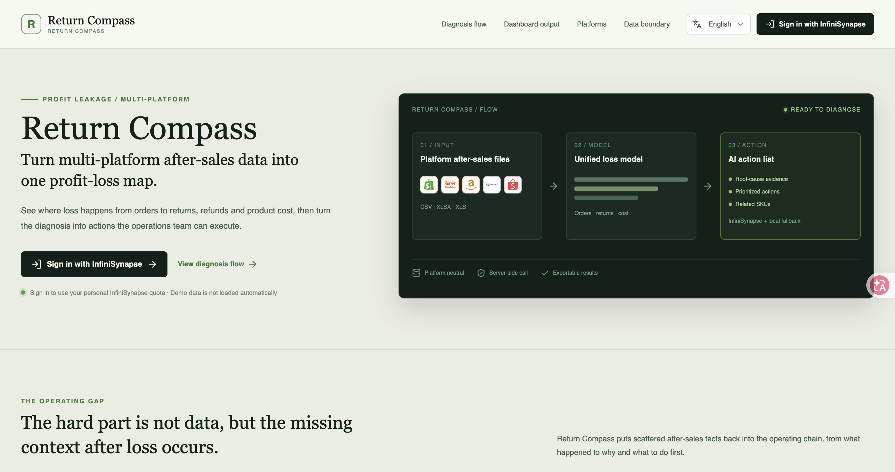

**B · 7.33** · 经营电商 · [体验链接](https://multi-platform-return-loss-diagnosis.onrender.com/)

**总评：** 平台覆盖是卖点，产品叙事略逊于退货雷达。

- **场景价值 8.0：** 多平台电商退货损耗（含逆向物流与库存）是跨境/多店团队真成本。
- **技术完成度 7.5：** 11 个平台+通用表格统一口径，规则+AI 给原因、优先级和建议，覆盖面宽。
- **创新性 6.0：** 与退货雷达同题，优势在多平台接入，问题框架创新较少。

### 24. 赛场扫描仪

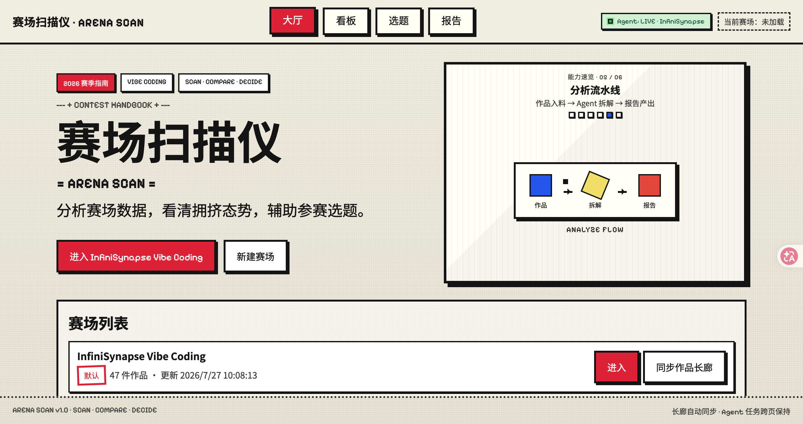

**B · 7.22** · 竞赛工具 · [体验链接](http://101.37.80.155:5173/)

**总评：** 自指巧妙、完成度好，场景天花板受「参赛工具」限制。

- **场景价值 6.5：** 帮选手看赛道拥挤度、打磨选题，对本届参赛者有用，对外界用户面窄。
- **技术完成度 7.5：** 本地确定性统计+Agent 深研分工清楚，看板、选题台、报告归档完整。
- **创新性 8.0：** 用比赛作品集反打比赛策略，元产品意识强，本地可解释统计也加分。

### 25. 凤栖梧

**B · 7.07** · 求职职业 · [体验链接](https://fengqiwu-production.up.railway.app)

**总评：** 情绪入口有辨识度，产品容易做成功能集合而不是一条主任务。

- **场景价值 7.5：** 大学生求职同时缺情绪支持和技能训练，陪伴向产品有真实用户。
- **技术完成度 7.0：** 六大功能覆盖情绪、模拟面、简历、成长图谱，Flask+SSE；模块多为并列能力，深度不均。
- **创新性 6.5：** 「先接住情绪再解决问题」有差异，但整体仍是求职套件。

### 26. Retro/Radar · 项目复盘雷达

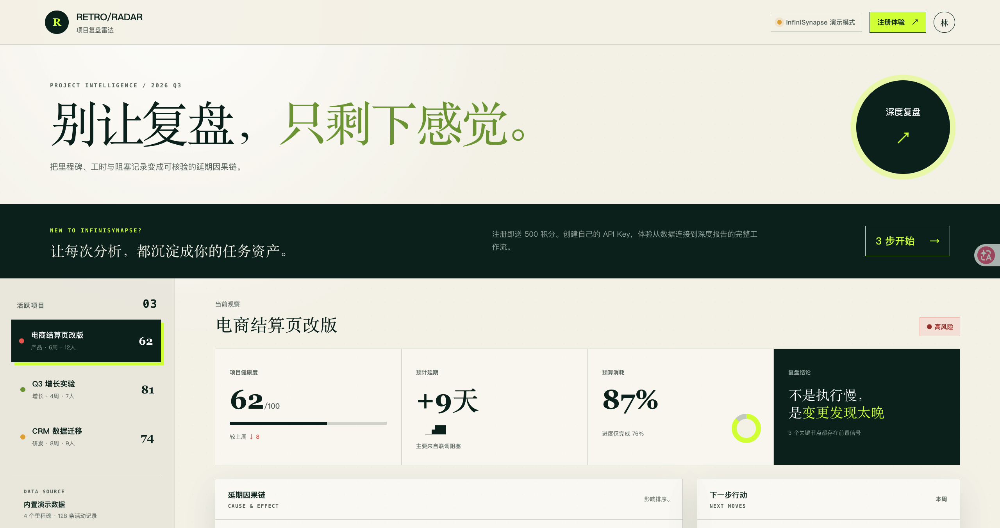

**B · 7.07** · 项目管理 · [体验链接](https://retro-radar-2026.vercel.app)

**总评：** 管理工具切入准；深度取决于真实项目数据接入，目前偏演示。

- **场景价值 7.5：** 延期原因难追溯、复盘难变成行动，是产研团队真实管理问题。
- **技术完成度 7.0：** 健康度、延期预测、因果链、优先行动与可挽回时间，演示数据即开即用。
- **创新性 6.5：** 把复盘做成可核验因果链，比「写一篇复盘总结」更产品。

### 27. 电商经营分析助手

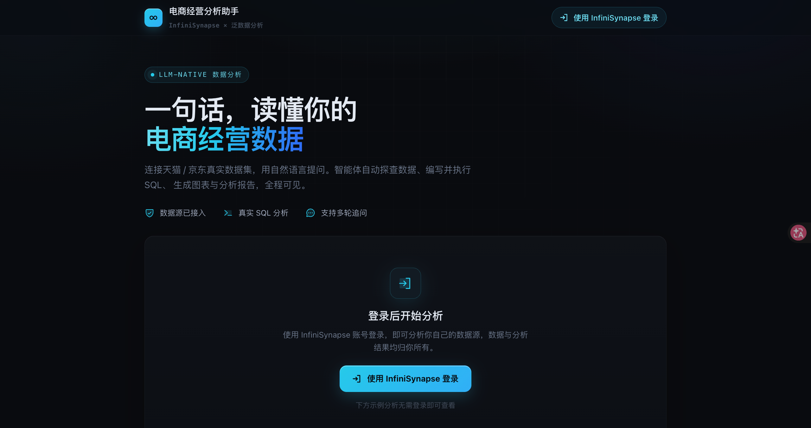

**B · 7.05** · 经营电商 · [体验链接](http://120.53.8.28:8666/)

**总评：** 集成和诚实出数做得好，产品创新不足。

- **场景价值 7.5：** 中小电商不会 SQL 也能看经营数据，需求真实。
- **技术完成度 8.0：** 上传真实订单、探查后写 SQL 不编数、过程可见、多轮追问、SSO，集成规范。
- **创新性 5.0：** 典型 NL2SQL 经营分析，与多件作品同质。

### 28. 帅治星球-职场情绪分析平台

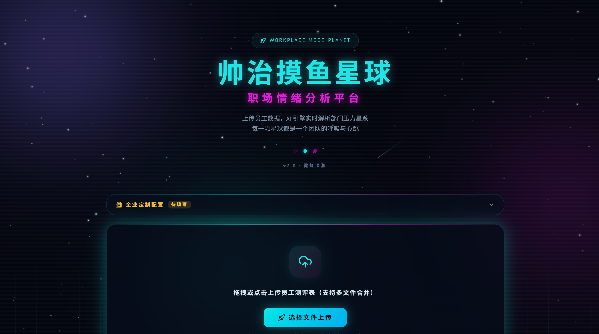

**B · 7.05** · 组织人力 · [体验链接](https://shuaizhi.jinxilab.com)

**总评：** HR 向完整，体验强；需非常小心数据伦理，产品创新中等。

- **场景价值 7.0：** HR 需要定位高压力员工并给出可落地关怀，需求真实，但员工心理数据敏感。
- **技术完成度 7.5：** 多格式清洗、星球筛选、公司/部门/个人三类报告、企业档案留存，链路完整。
- **创新性 6.5：** 可视化有记忆点，分析框架仍是压力测评+报告，机制创新有限。

### 29. 智能掌柜

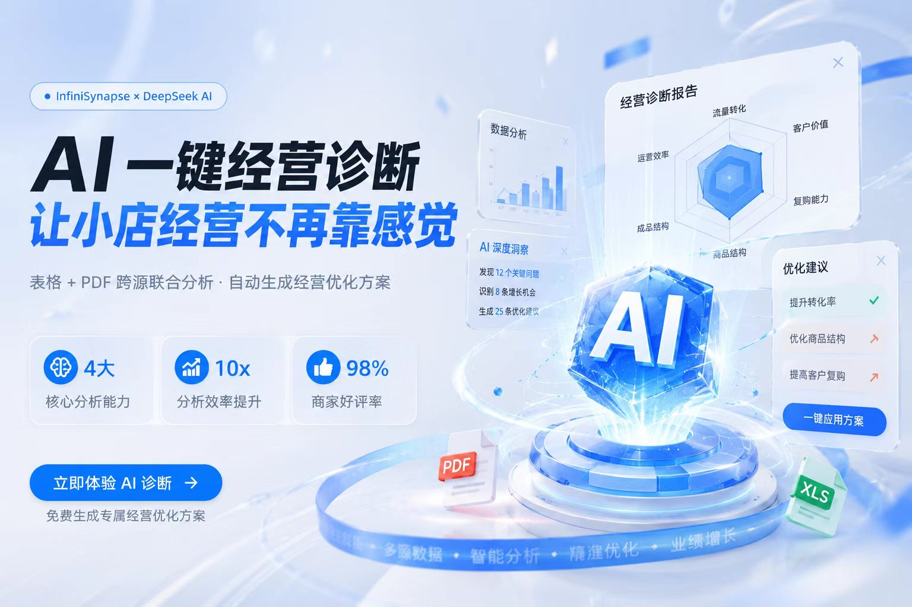

**B · 7.00** · 经营电商 · [体验链接](https://app-d8bq72qab4zl.appmiaoda.com)

**总评：** 垂直本地生活商家没错，但本届同类供给过多，辨识度不足。

- **场景价值 7.5：** 美甲/美容/餐饮小微商家看团购与收银、算活动 ROI，场景真实。
- **技术完成度 7.5：** 批量上传流水/团购/活动 PDF，跨源融合与自研前端，主路径可用。
- **创新性 5.5：** 与掌柜参谋、电商分析助手高度同质，缺少独特经营对象或机制。

### 30. 学情罗盘 EduCompass

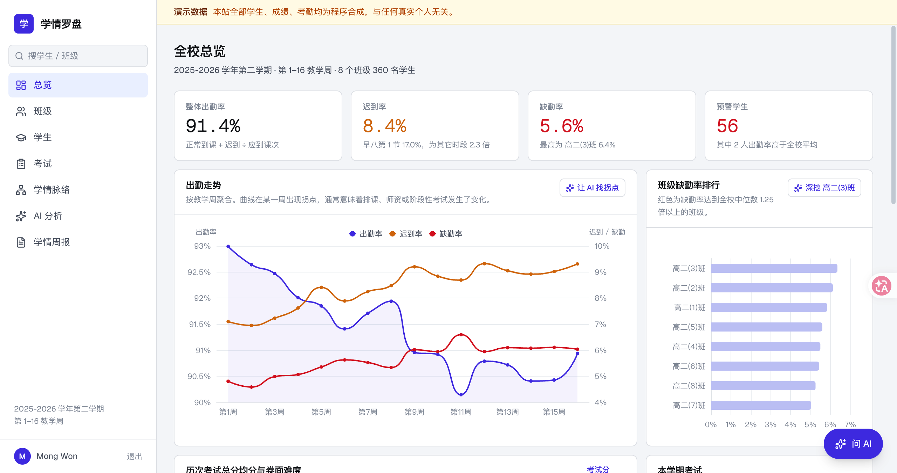

**B · 6.97** · 教育学习 · [体验链接](http://43.108.11.142:5678/)

**总评：** 场景正确，产品完成度中等，创新一般。

- **场景价值 8.0：** 成绩考勤作业分散、风险学生难以及时发现，是学校刚需。
- **技术完成度 6.5：** 画像、趋势、预警、周报、干预建议模块齐全，公开材料对数据治理与效果闭环较简。
- **创新性 6.0：** 学情预警是教育信息化常见能力。

### 31. 资析智策 （资产分析与智能决策 Asset Intelligence & Decision Analytics System）

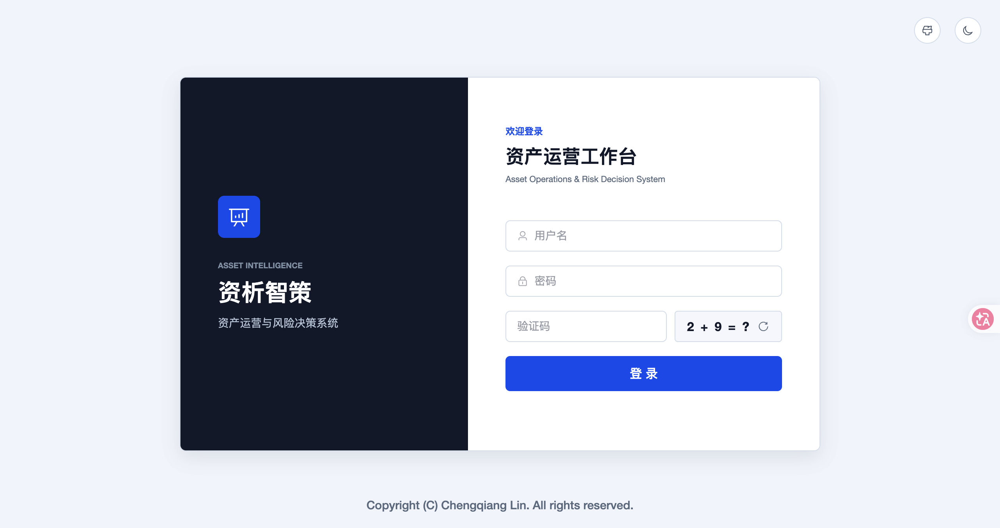

**B · 6.95** · 企业经营 · [体验链接](https://asset.312404.xyz/)

**总评：** B 端场景成立，完成度够演示；产品创新中等，更像传统资产系统的 AI 外壳。

- **场景价值 7.5：** 闲置资产、合同临期、处置优先级是企业资产管理真实痛点，工作台定位清楚。
- **技术完成度 7.0：** Vue3+Flask、台账到风险清单闭环完整，但默认演示数据与弱口令，距离生产还有距离。
- **创新性 6.0：** 资产健康分+处置清单是成熟管理软件思路，AI 增量主要在解释层。

### 32. 职牌

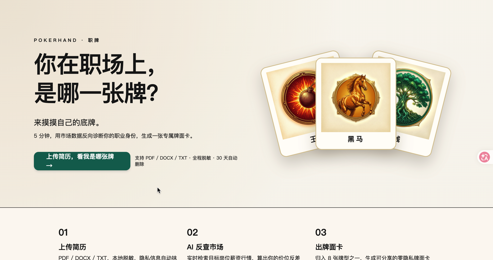

**B · 6.95** · 求职职业 · [体验链接](http://43.161.226.67/)

**总评：** 传播物设计出色，作为求职决策工具深度还不够。

- **场景价值 7.0：** 用市场数据反向诊断职业身份，对迷茫求职者有启发，但行动落地弱于尽调/面试训练。
- **技术完成度 6.5：** 简历上传到深度报告+去隐私诊断卡，主路径短而完整；模块深度有限。
- **创新性 7.5：** 8 种职牌卡片化、可传播，把诊断做成身份物件，比纯报告更有产品感。

### 33. RepoPulse｜开源项目运营体检

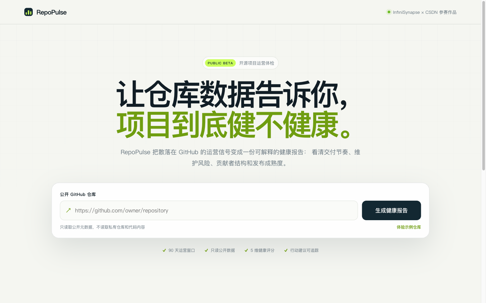

**B · 6.93** · 研发生态 · [体验链接](https://repopulse-2026.regeditthao.chatgpt.site)

**总评：** 开发者工具扎实，创新中等。

- **场景价值 7.0：** 开源作者需要看提交/Issue/PR 健康度并得到行动建议，受众明确。
- **技术完成度 7.5：** 采集 90 天仓库快照、五维评分、7/30/90 天建议、SSE 归因，主路径完整。
- **创新性 6.0：** GitHub 健康分工具较多，证据+行动周期是加分。

### 34. 智管进销存

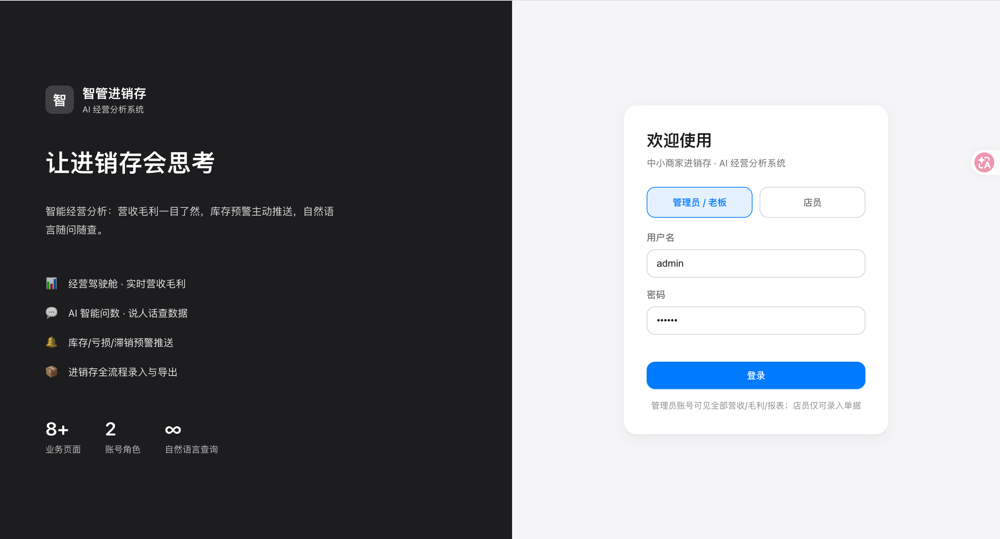

**B · 6.90** · 经营电商 · [体验链接](https://zhiguan-jxc-production.up.railway.app)

**总评：** 场景分高，创新分被品类成熟度压住。

- **场景价值 8.0：** 小店不会算毛利、库存乱，进销存是生存级工具。
- **技术完成度 7.0：** 看板、NL 查数、单据、盘点、滞销预警、权限与报表，像完整进销存；AI 增量主要在分析层。
- **创新性 5.0：** 传统进销存 + 对话查数，品类非常成熟。

### 35. 智析账本 BillLens

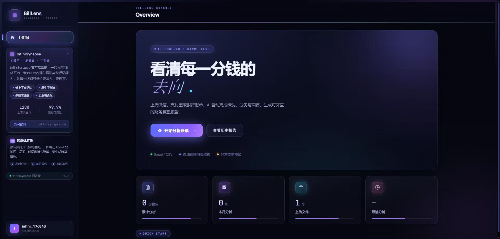

**B · 6.82** · 个人财务 · [体验链接](http://120.48.158.101:8080)

**总评：** 能用，但产品定义过宽，更像能力展示册而不是一个打透的财务产品。

- **场景价值 7.5：** 账单/流水分析、预算与风险预警是真实需求，个人与轻企业都用得上。
- **技术完成度 7.0：** 上传分析、可视化报告、PDF、多轮追问与分享具备，但功能清单把个人账本和企业财务分析堆在一起，主路径不够收敛。
- **创新性 5.5：** 典型「上传表格出报告」，缺少独特分析框架或差异化交付物。

### 36. 家居供应链协同平台

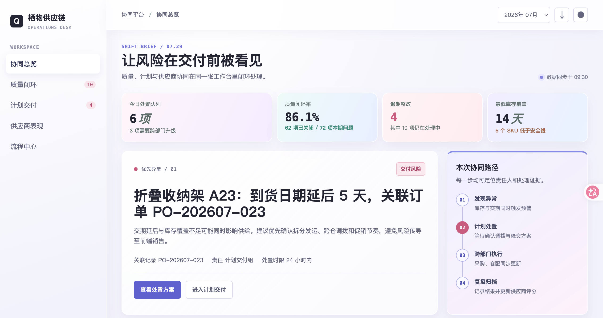

**B · 6.78** · 供应链 · [体验链接](https://supply-chain.520resume-doctor.online)

**总评：** 行业场景成立，演示数据限制了可信完成度。

- **场景价值 7.5：** 质量异常、延期、库存覆盖、供应商表现是家居品牌供应链真问题。
- **技术完成度 6.5：** 异常追踪、分派、复验、促销预警、PDF 报告齐全，但明确为模拟数据。
- **创新性 6.0：** 风险协同工作台思路正确，AI 层是快照分析，机制不新。

### 37. 财格-AI犀利点评你的理财性格

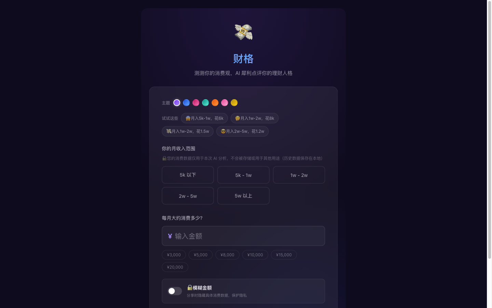

**B · 6.65** · 个人财务 · [体验链接](https://service.bckf.cn/caige/)

**总评：** 增长型小工具做得圆，不是深度财务产品。

- **场景价值 6.0：** 用轻测试叫醒月光族有传播价值，理财决策深度有限。
- **技术完成度 7.5：** 三字段出报告、隐私模式、分享卡、降级模板、防刷，消费级体验完整。
- **创新性 6.5：** 毒舌人设和分享卡有增长设计，分析本身浅。

### 38. 应用名称 统计分析系统（Statistical Analysis System）

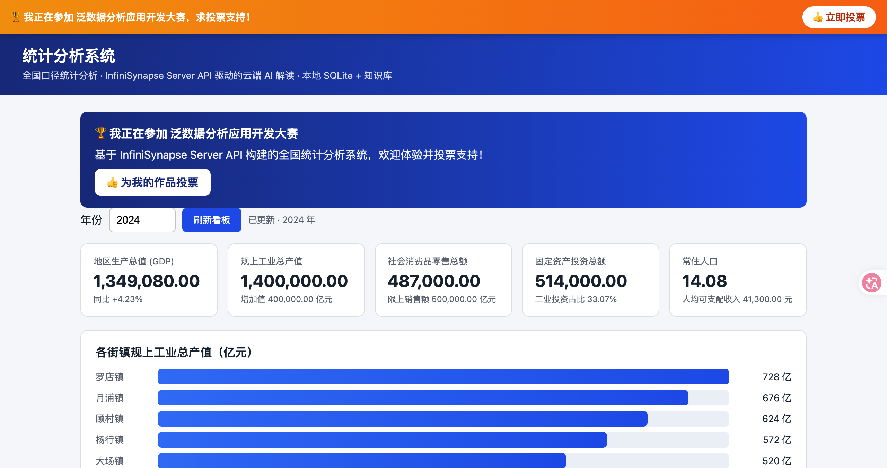

**B · 6.60** · 公共数据 · [体验链接](https://qu-stat-system.vercel.app/)

**总评：** 数据工程扎实，产品创新和大众场景价值中等。

- **场景价值 6.5：** 宏观指标解读对研究/政策/教学有用，普通用户决策距离较远。
- **技术完成度 7.5：** Flask 看板+CLI、SQLite 宽表、口径知识库、世界银行采集、SSE 解读，工程面完整。
- **创新性 5.5：** 宏观统计看板是经典形态，AI 解读是常规增量。

### 39. 泡泡看市|小白的股市翻译官

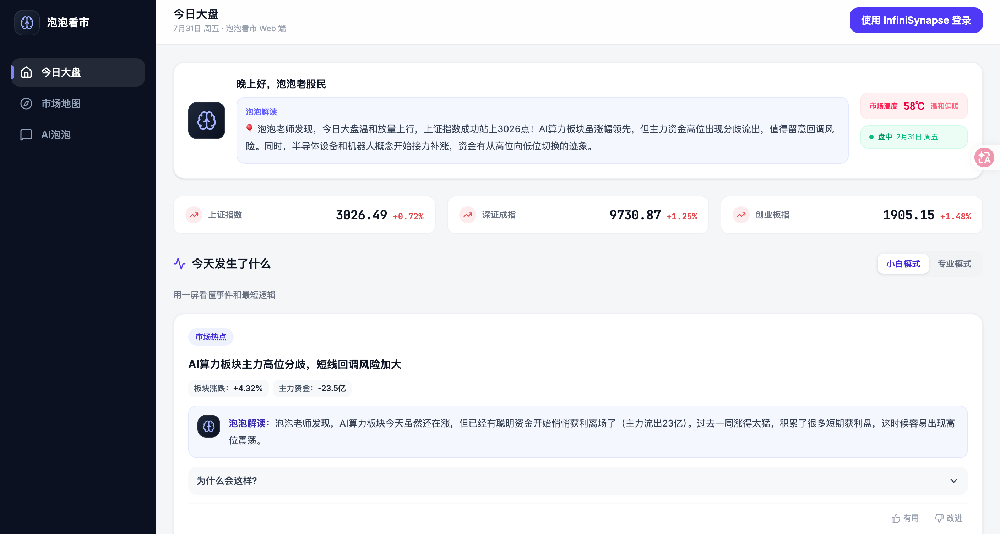

**B · 6.60** · 投资理财 · [体验链接](https://paopaoaii.a273894731.workers.dev/)

**总评：** 体验完整的入门看盘，产品创新一般。

- **场景价值 6.5：** A 股小白看懂当日热点有需求，投资决策价值受「仅供参考」强约束。
- **技术完成度 7.5：** 大盘故事、热力图、Agent 问答，超时兜底与交易时段控制，工程意识好。
- **创新性 5.5：** AI 看盘/热点翻译是常见形态。

### 40. 智行路线 RouteWise

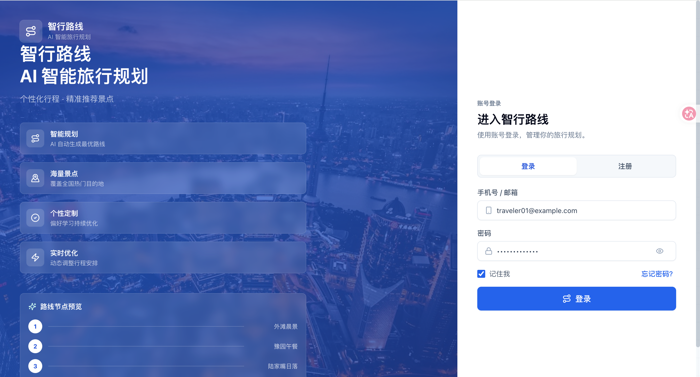

**B · 6.60** · 旅行规划 · [体验链接](http://47.120.26.69:7890/routewise/)

**总评：** 完成度明显好于多数旅游作品，创新不足。

- **场景价值 6.5：** 自由行比方案、顾预算和动线有需求，但旅行规划极度红海。
- **技术完成度 7.5：** 三套路线、多维评分、风险与待核验项、任务取消限流恢复，工程完整。
- **创新性 5.5：** 效率/体验/预算三方案对比是常见旅行 AI 结构。

### 41. SEO数据分析

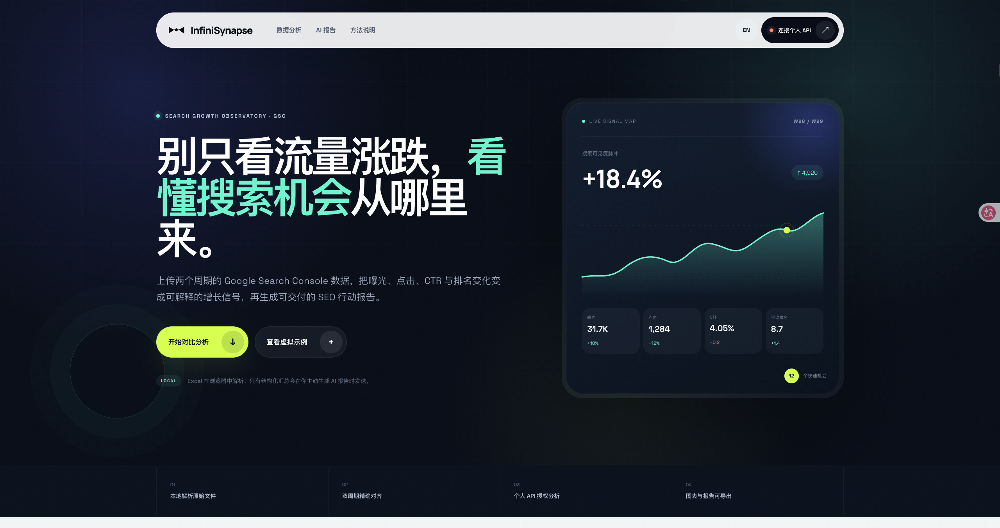

**D · 4.22** · 内容增长 · [体验链接](https://gsc-data-analysis.vercel.app/)

**总评：** 信息披露不足，产品评价只能保守处理。

- **场景价值 5.0：** SEO 数据分析有用户，但未说明解决哪类决策、对谁、交付什么。
- **技术完成度 3.5：** 作者未填介绍，只能确认可在线打开，无法评估主路径与集成质量。
- **创新性 4.0：** 赛道拥挤且信息缺失，看不到独特角度。

### 42. ProjectValueLab

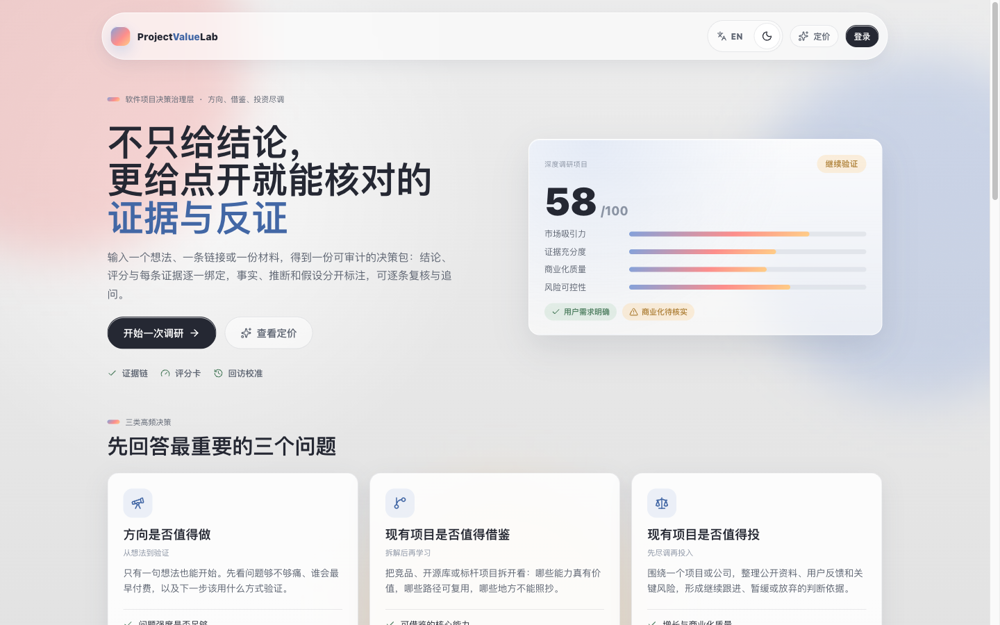

**C · 6.45** · 产品研究 · [体验链接](https://pvl.octoooo.com/)

**总评：** 可用的立项助手，产品形态常规。

- **场景价值 7.0：** 早期项目验证、立项和投资初筛有需求，用户面（创始人/PM/投资人）清楚。
- **技术完成度 6.5：** 输入官网/文档/仓库，输出结构化价值报告，标准 Agent 报告流，深度一般。
- **创新性 5.5：** 商业尽调清单式分析，缺少独特评估框架或证据约束。

### 43. 选题雷达 Topic Radar

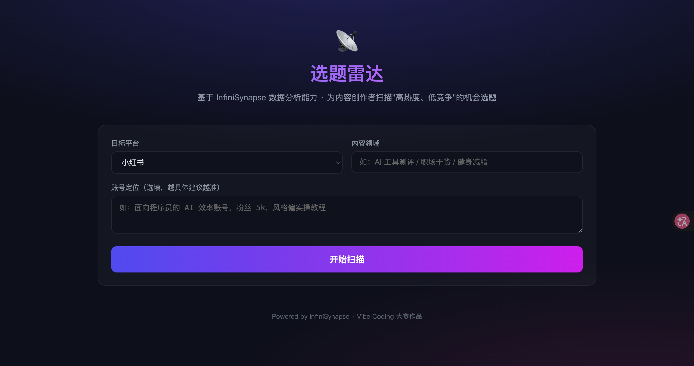

**C · 6.45** · 内容增长 · [体验链接](http://120.53.8.28:3000/)

**总评：** 能用的创作者工具，差异化不足。

- **场景价值 7.0：** 创作者要找高热低竞争选题，需求真实。
- **技术完成度 6.5：** 平台+领域调研，热度/竞争/机会三维度与标题建议，主路径成立但较标准。
- **创新性 5.5：** 选题雷达是内容工具常见形态。

### 44. 学习计划助手

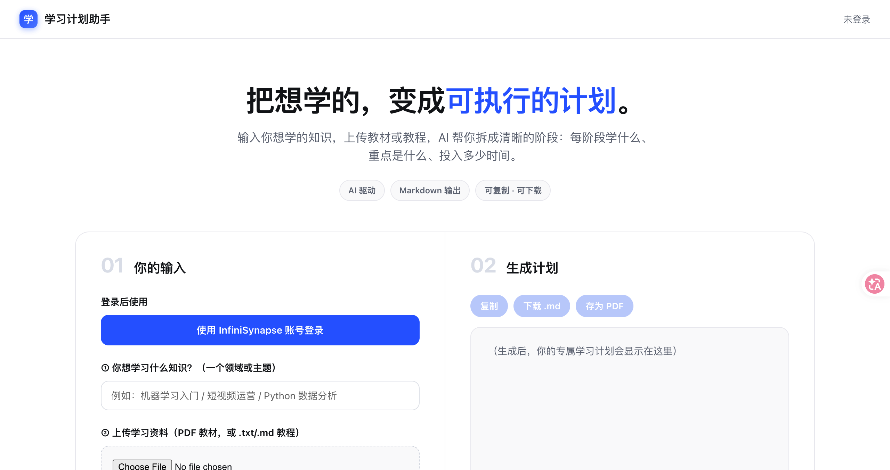

**C · 6.30** · 教育学习 · [体验链接](https://infinisynapse-new.pages.dev/)

**总评：** 干净可用的计划生成器，缺乏诊断—练习闭环或独特数据。

- **场景价值 6.5：** 把教材/教程拆成可执行学习计划有用，但替代方案极多。
- **技术完成度 7.0：** 领域+PDF/文本入，阶段路线与 Markdown/PDF 出，SSO/BYOK 规范。
- **创新性 5.0：** 学习路径生成是最常见的 AI 教育形态之一。

### 45. CET-4 Vocab Lab 四级单词学习舱

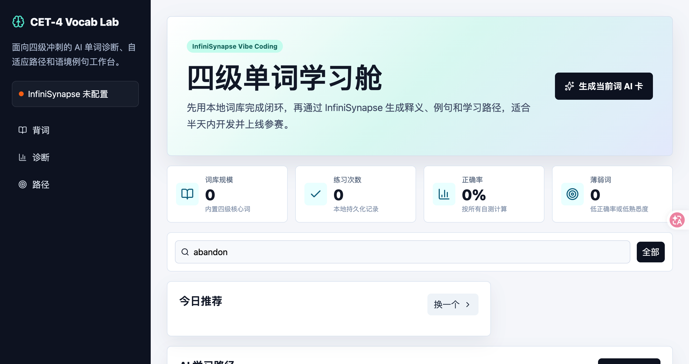

**C · 6.30** · 教育学习 · [体验链接](https://infinisynapse-cet4-vocab.vercel.app/)

**总评：** 可用的备考工具，缺少独特学习数据或机制。

- **场景价值 6.5：** 四级词汇冲刺有稳定用户，但背单词市场极度红海。
- **技术完成度 7.0：** 词库、自测、薄弱词、语境例句、7 天路径，服务端 Key，主路径完整。
- **创新性 5.0：** 诊断+路径是常规背词产品能力。

### 46. 竞品对标分析器

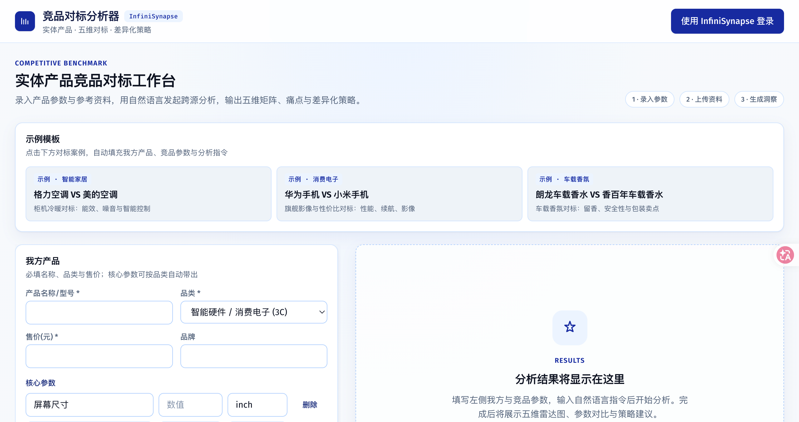

**C · 6.28** · 产品研究 · [体验链接](http://compbench.zhuangyb.top)

**总评：** 场景没错，材料不足以支撑高完成度评价。

- **场景价值 7.0：** 硬件/快消研发与市场团队确实需要竞品对标，场景成立。
- **技术完成度 6.0：** 公开介绍过短，只能确认 Next.js + Server API，对标维度、证据与交付物不清晰。
- **创新性 5.5：** 竞品分析是常见 AI 报告形态，未见独特框架。

### 47. 产品经理数据汇报工作台

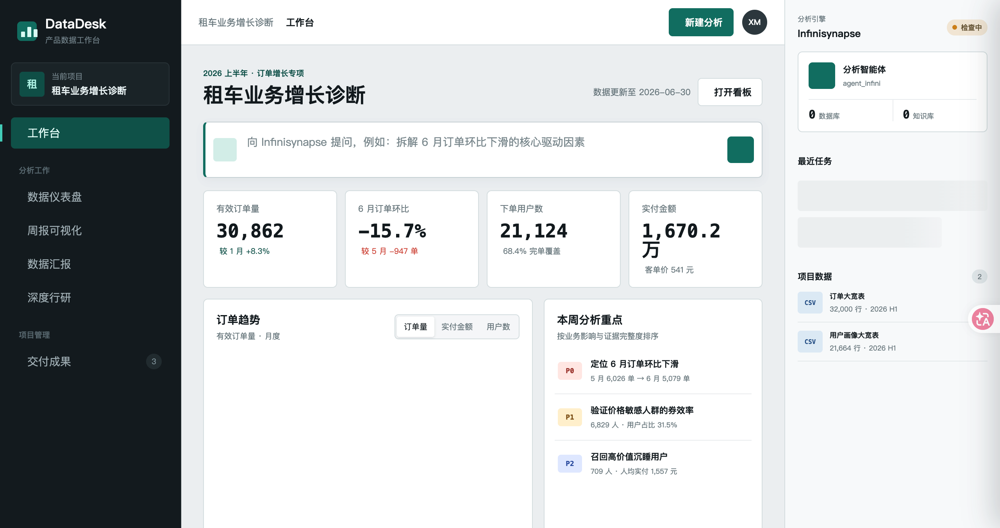

**C · 6.15** · 通用分析 · [体验链接](http://8.141.101.70/data-workbench/)

**总评：** 对上了岗位场景，产品完成度与差异化都偏中下。

- **场景价值 7.0：** 仪表盘、周报、汇报 PPT、行研是 PM 真实工作，场景清楚。
- **技术完成度 6.0：** 介绍停留在四大模块列举，分析深度、数据接入与交付质量缺少可验证细节。
- **创新性 5.0：** 把常见 PM 交付物拼成工作台，创新有限。

### 48. 簿言

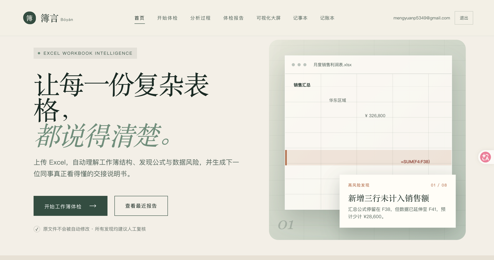

**C · 5.80** · 通用分析 · [体验链接](https://vibe-coding-boyan.vercel.app/login)

**总评：** 能用的轻办公组合，产品焦点不够，难以形成记忆点。

- **场景价值 6.0：** Excel 检查与记账有需求，但记事本+附件+记账+分析拼在一起，场景发散。
- **技术完成度 6.5：** 登录上传、结构识别、可视化大屏、记账图表更新，基础功能在；缺一条打透的决策主线。
- **创新性 4.5：** 通用办公套件，创新点不明显。

### 49. 明日足球

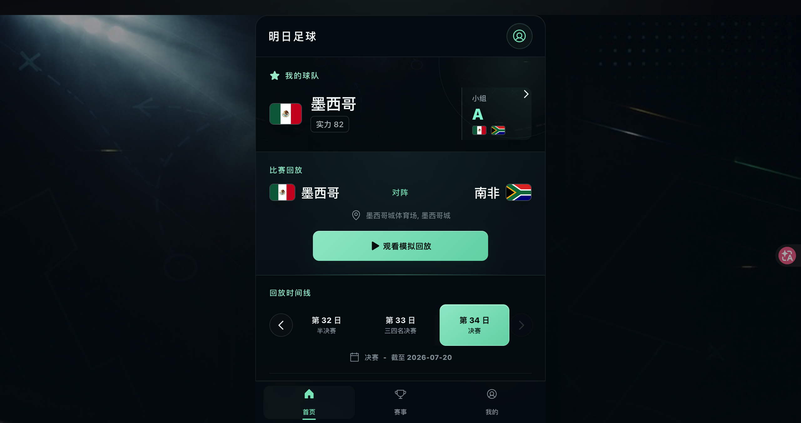

**C · 6.05** · 体育娱乐 · [体验链接](https://www.yomujp.top/)

**总评：** 完整体验向体育应用，场景价值与创新都中等。

- **场景价值 6.0：** 球迷看懂战术有趣，决策/付费强度低于工作与生活刚需。
- **技术完成度 6.5：** 接比赛数据、阵容事件，再生成战术复盘，主路径成立，模块深度中等。
- **创新性 5.5：** 比赛 AI 复盘常见，战术翻译是增量不是新品类。

### 50. 人生模拟器

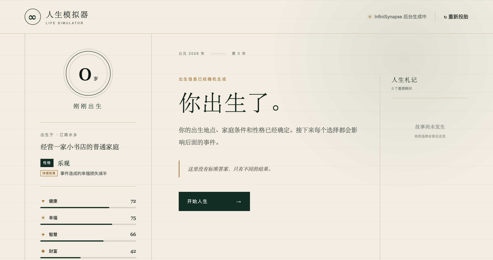

**D · 4.40** · 娱乐实验 · [体验链接](https://life-simulator-omega-snowy.vercel.app/)

**总评：** 娱乐 demo，产品层面贡献有限。

- **场景价值 3.5：** 自评解决「闲着没事干什么」，几乎没有决策或效率价值。
- **技术完成度 5.0：** 后台批量生成个性化事件，产品结构简单。
- **创新性 5.0：** 人生模拟游戏常见，未见新规则。
