# 最终结果公布｜Vibe Coding 大赛 62 席获奖名单

InfiniSynapse × CSDN 首届 **Vibe Coding 泛数据分析应用开发大赛**，最终结果正式公布。

共 **62 席**：2 个一等奖、4 个二等奖、6 个三等奖、50 个优秀奖。一二三等奖品类互不重复；优秀奖排名不分先后。全部作品均已核验：接入 InfiniSynapse API，且体验链接可打开。

评选维度：**场景价值 40% · 技术完成度 35% · 创新性 25%**。

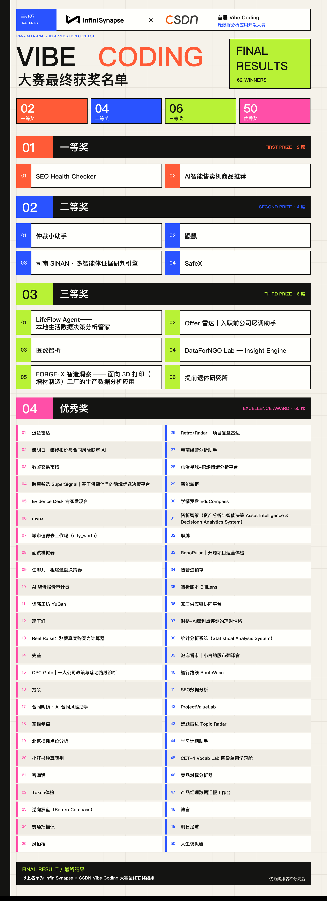

*首届 Vibe Coding 泛数据分析应用开发大赛 · 最终获奖名单*

完整作品长廊持续开放：[https://infinisynapse.cn/contest/vibe-coding/gallery](https://infinisynapse.cn/contest/vibe-coding/gallery)

下面按奖项公布名单。每件作品附简要介绍与体验链接，可直接复制到浏览器打开。

> [!important] 怎么看这篇名单
> 一二三等奖按档位公布；优秀奖 50 席排名不分先后。链接如打不开，可先到作品长廊检索同名应用。

## 一等奖 · 2 席

**1. SEO Health Checker**（内容增长）

即开即用的 AI SEO 健康检测工具，提供网页检测与浏览器插件双形态。粘贴任意页面 URL，几十秒内可拿到标题、描述、规范链接、标题结构、图片 alt 等基础体检，并进一步评估 AI 搜索可见性。

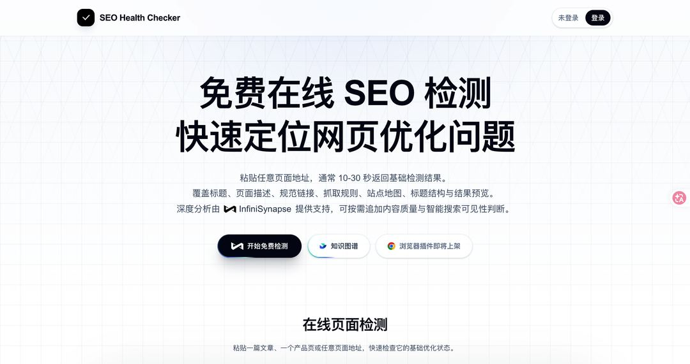

*SEO Health Checker 界面*

体验：[https://aimeetup.center/](https://aimeetup.center/)

&nbsp;

**2. AI智能售卖机商品推荐**（零售补货）

面向无人零售运营商，围绕售卖机补货与动销做商品推荐和销售分析，帮助判断该补什么、补多少。

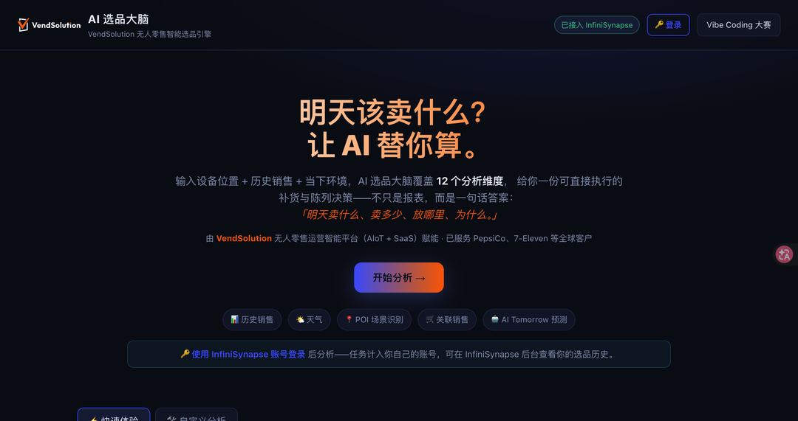

*AI智能售卖机商品推荐 界面*

体验：[https://productselect-production.up.railway.app/](https://productselect-production.up.railway.app/)

## 二等奖 · 4 席

**1. 仲裁小助手**（法律权益）

输入入职日期、月工资和城市，自动生成赔偿计算单、仲裁申请书、证据清单和法条依据，并结合再就业周期判断赔偿金能否覆盖空窗期。

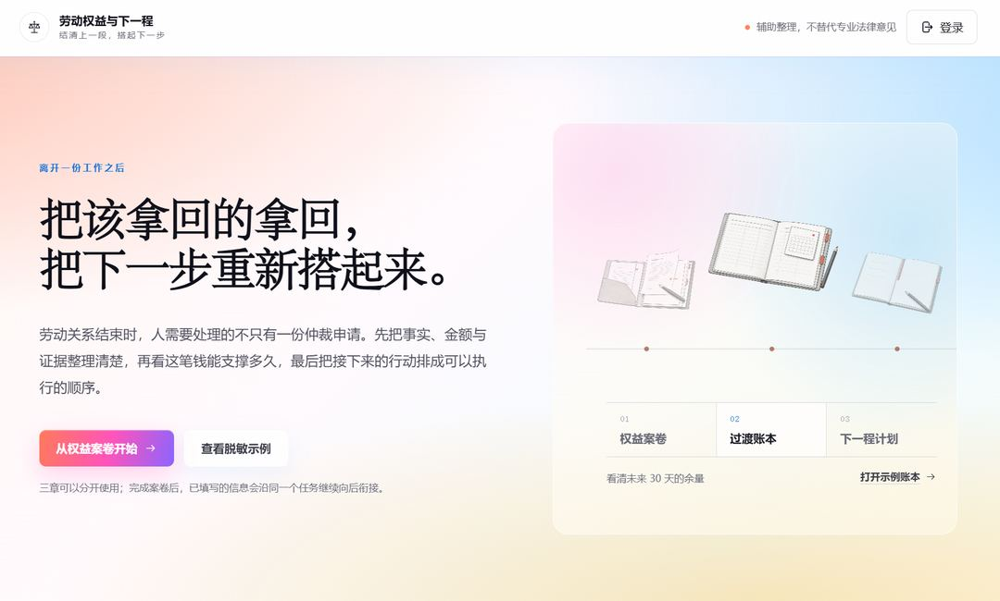

*仲裁小助手 界面*

体验：[https://la.tracemuse.top/](https://la.tracemuse.top/)

&nbsp;

**2. 鼹鼠**（可信数据）

数字核查与可信生成引擎。把周报、PPT、底稿里的每个数字，对着数据库或 Excel 底稿重新算一遍，给出带出处的三档结论，并可生成「已核实版」报告。

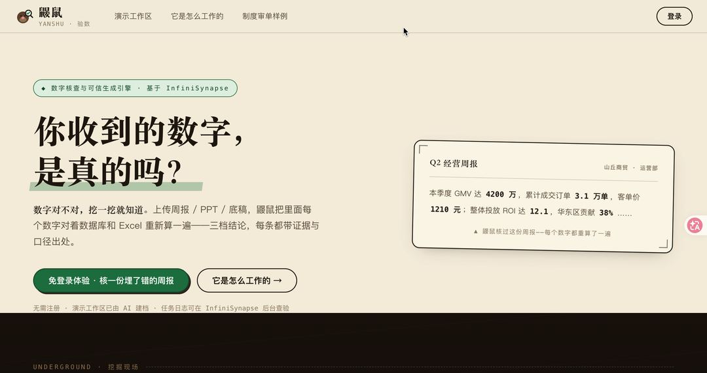

*鼹鼠 界面*

体验：[https://yanshu.octoooo.com](https://yanshu.octoooo.com)

&nbsp;

**3. 司南 SINAN · 多智能体证据研判引擎**（高风险决策）

面向买房、入职、投资等高利害判断。多智能体联网取证，坚持「无证据不立论」：每条结论绑定证据与置信度，并尝试发现隐藏关联。

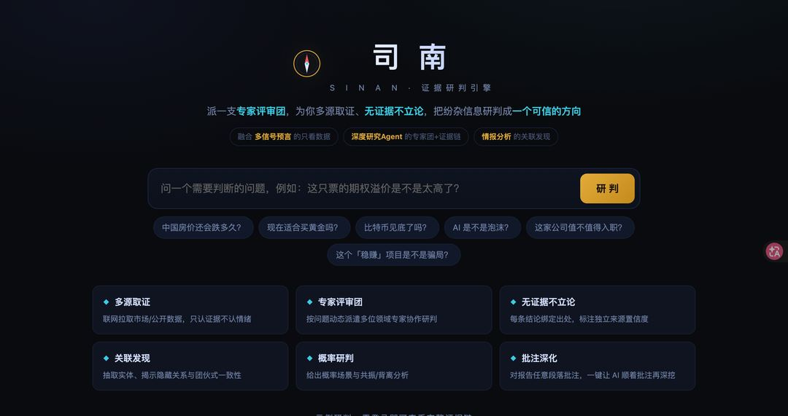

*司南 SINAN · 多智能体证据研判引擎 界面*

体验：[http://47.119.112.225/sinan/app/](http://47.119.112.225/sinan/app/)

&nbsp;

**4. SafeX**（公共安全）

面向骚扰、跟踪、家暴等安全威胁的公益分析应用。用数据洞察帮助定性与取证，并提供法条引用、SOS 守护和求助路径。

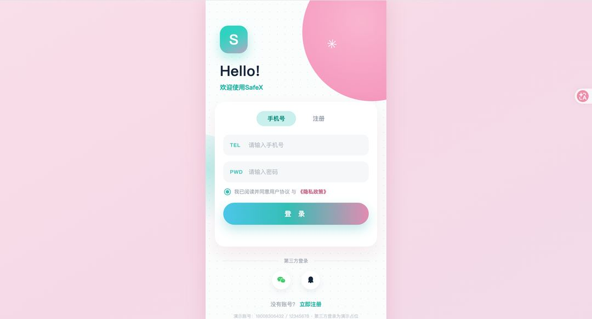

*SafeX 界面*

体验：[http://47.94.57.145](http://47.94.57.145)

## 三等奖 · 6 席

**1. LifeFlow Agent——本地生活数据决策分析管家**（生活决策）

整合餐厅排队、天气、交通、票务和个人偏好，生成可对比方案、看板和报告。支持个人管家、多管家协商和未来时间预演。

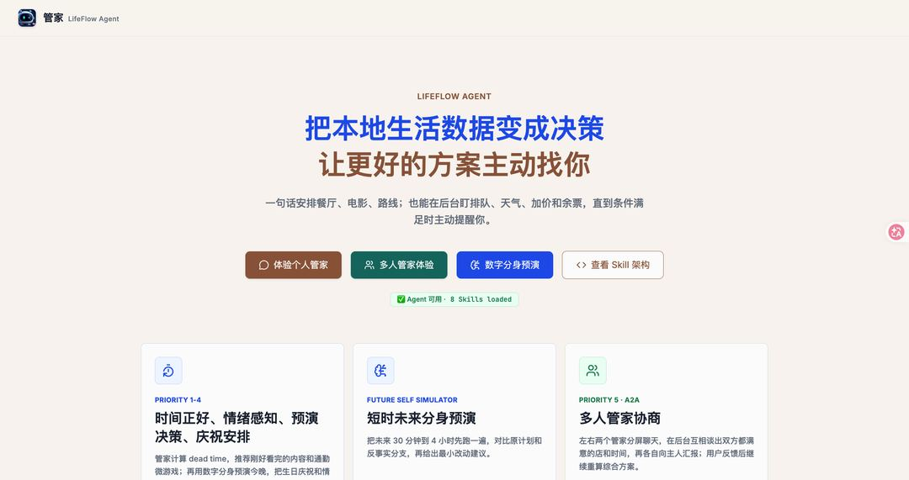

*LifeFlow Agent——本地生活数据决策分析管家 界面*

体验：[https://qiyucai.cn/InfiniSynapse/](https://qiyucai.cn/InfiniSynapse/)

&nbsp;

**2. Offer 雷达｜入职前公司尽调助手**（求职职业）

面向学生和跳槽者，在投递、面试或签 Offer 前核验公司主体、舆情和劳动风险，输出可追溯的尽调结论与行动清单。

*Offer 雷达｜入职前公司尽调助手 界面*

体验：[https://offerradar.cn](https://offerradar.cn)

&nbsp;

**3. 医数智析**（医疗健康）

患者健康档案 + 医生工作台双端架构。帮助患者把分散的医疗资料存清、看懂，也帮助医生跨时间整理趋势与用药安全。

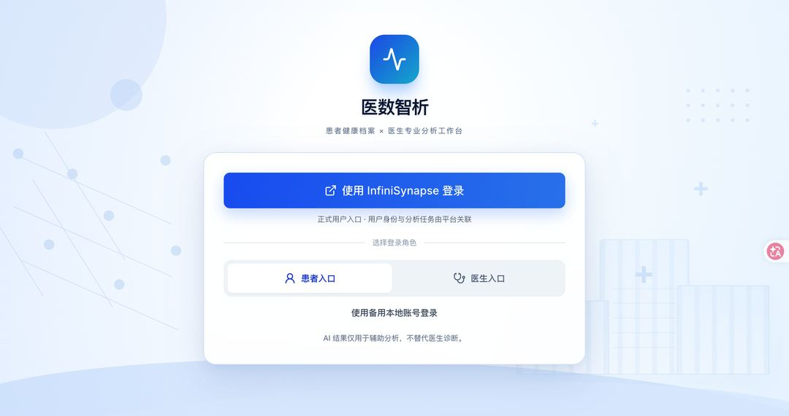

*医数智析 界面*

体验：[https://129.204.17.83/agentmedicine/](https://129.204.17.83/agentmedicine/)

&nbsp;

**4. DataForNGO Lab — Insight Engine**（公益合规）

给 NGO 项目官员用的合规数据分析工具。本地完成严谨计算，过完隐私与目的限制闸门后，再让 AI 解释「为何差、该怎么做」。

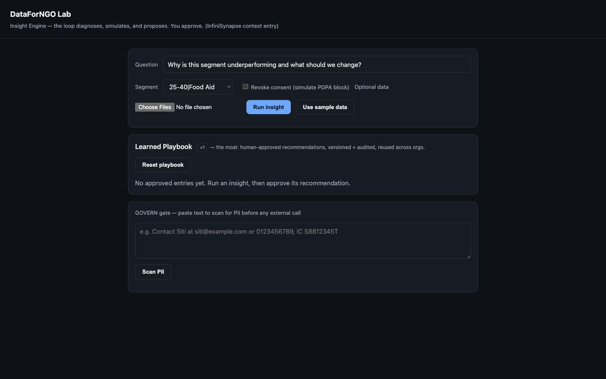

*DataForNGO Lab — Insight Engine 界面*

体验：[https://dataforngo-lab.swmengappdev.workers.dev](https://dataforngo-lab.swmengappdev.workers.dev)

&nbsp;

**5. FORGE·X 智造洞察**（工业制造）

面向 3D 打印工厂。车间主管和工艺、质量工程师可用自然语言追问故障率、材料失败率和成本归属，并回到机台对象上看结论。

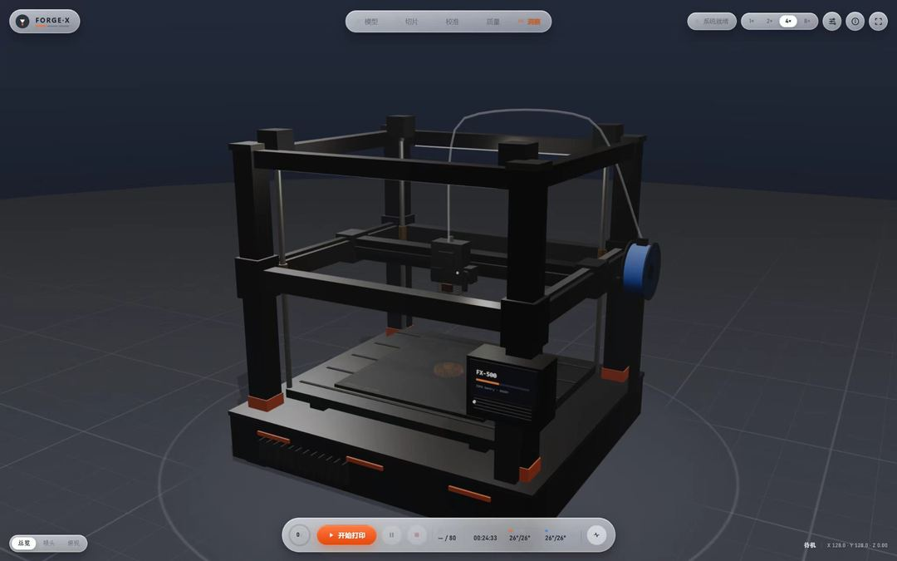

*FORGE·X 智造洞察 界面*

体验：[https://ivancodes.cn/projects/forgex](https://ivancodes.cn/projects/forgex)

&nbsp;

**6. 提前退休研究所**（公共决策）

用统计局、人社部、全国人大决定等公开数据，回答「这届年轻人到底几岁能退休」，并核算城市 FIRE 起步价，结论可溯源。

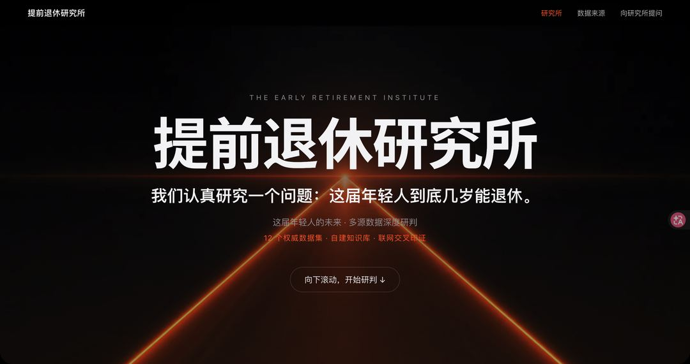

*提前退休研究所 界面*

体验：[https://fire.lgbisha.cn](https://fire.lgbisha.cn)

## 优秀奖 · 50 席

优秀奖排名不分先后。以下按作品报告顺序罗列，方便检索。

**1. 退货雷达**（经营电商）

帮中小电商从订单和退款数据里找到真正拖累利润的 SKU、渠道和原因，并给出 7 天止损方案。

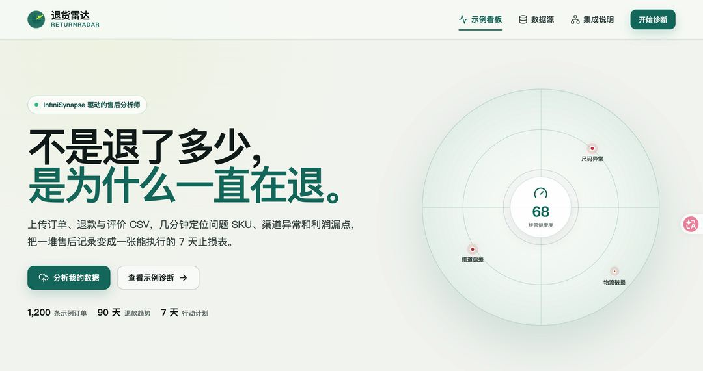

*退货雷达 界面*

体验：[https://returnradar.zzyscut.top/](https://returnradar.zzyscut.top/)

&nbsp;

**2. 装明白｜装修报价与合同风险联审 AI**（生活决策）

上传多家报价单、合同和口头承诺，对齐项目与范围，识别漏项、异常单价和合同风险，并给出三情景成本与谈价清单。

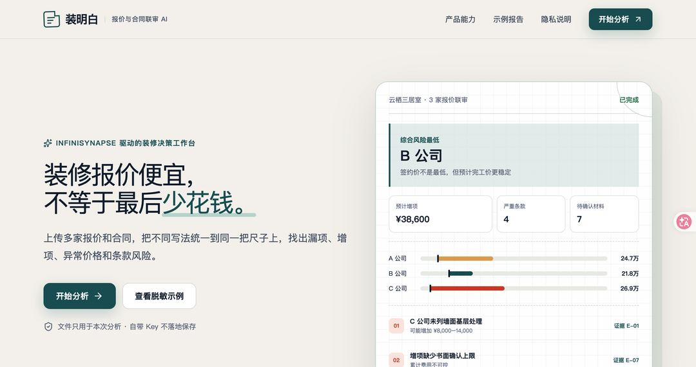

*装明白｜装修报价与合同风险联审 AI 界面*

体验：[https://zhuangmingbai.hudejing.art](https://zhuangmingbai.hudejing.art)

&nbsp;

**3. 数鉴交易市场**（可信数据）

做成「数据验货室」而不是货架：买方只能提经卖方批准的问题，在卖方侧计算，输出可核验的质量证书，数据不出域。

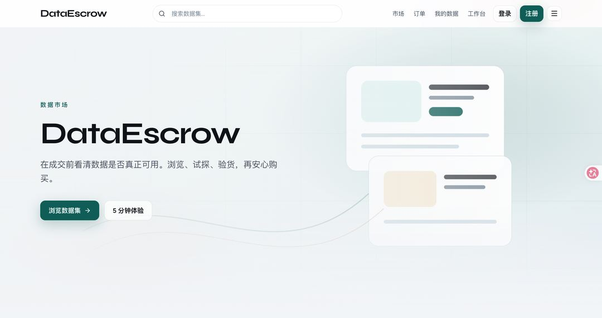

*数鉴交易市场 界面*

体验：[https://dataescrow.suzhouye.cn/](https://dataescrow.suzhouye.cn/)

&nbsp;

**4. 跨境智选 SuperSignal**（跨境电商）

输入产品想法和目标市场，自动检索海外需求和国内供给，整理证据、未知项和下一步验证动作，先判断值不值得继续验证。

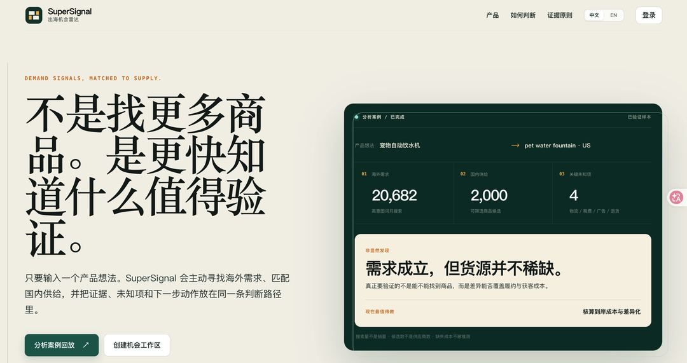

*跨境智选 SuperSignal 界面*

体验：[https://supersignal.kangkona.workers.dev/](https://supersignal.kangkona.workers.dev/)

&nbsp;

**5. Evidence Desk 专家发现台**（科研学术）

面向科研管理、技术尽调和人才寻访。按研究问题聚合候选专家，展示可追溯论文证据，并给出多源核验入口。

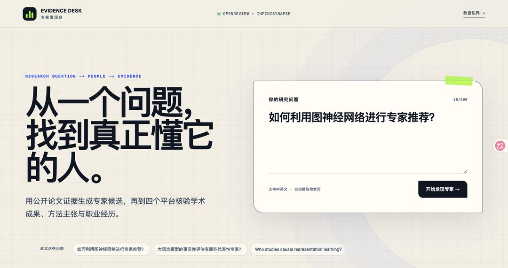

*Evidence Desk 专家发现台 界面*

体验：[https://experts.threeradius.com](https://experts.threeradius.com)

&nbsp;

**6. mynx**（科研工具）

在浏览器里完成 qPCR 分析、TIFF 批处理和 AI 生物学解读，把专业计算留在本地，把解读交给 Agent。

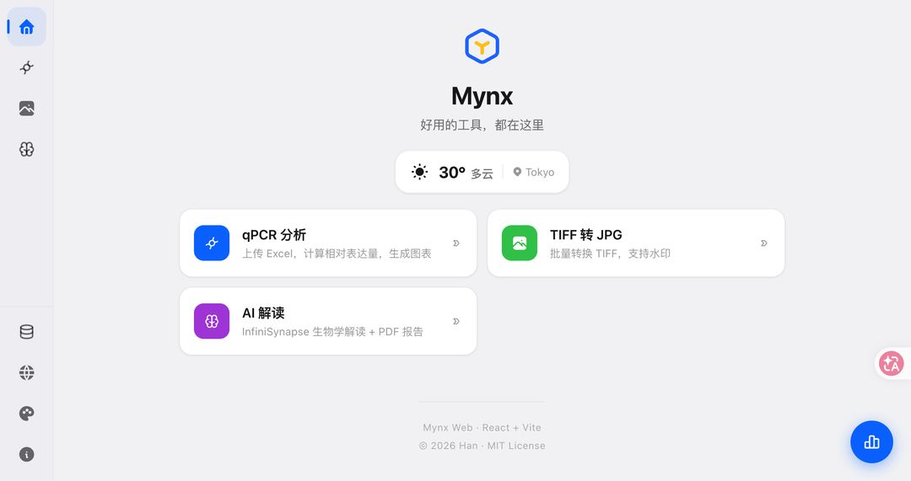

*mynx 界面*

体验：[https://mynx-web.vercel.app/](https://mynx-web.vercel.app/)

&nbsp;

**7. 城市值得去工作吗（city_worth）**（求职职业）

把 Offer 与城市房价、落户、通勤、工时收成一站式评估，帮应届生和跨城跳槽者算清性价比。

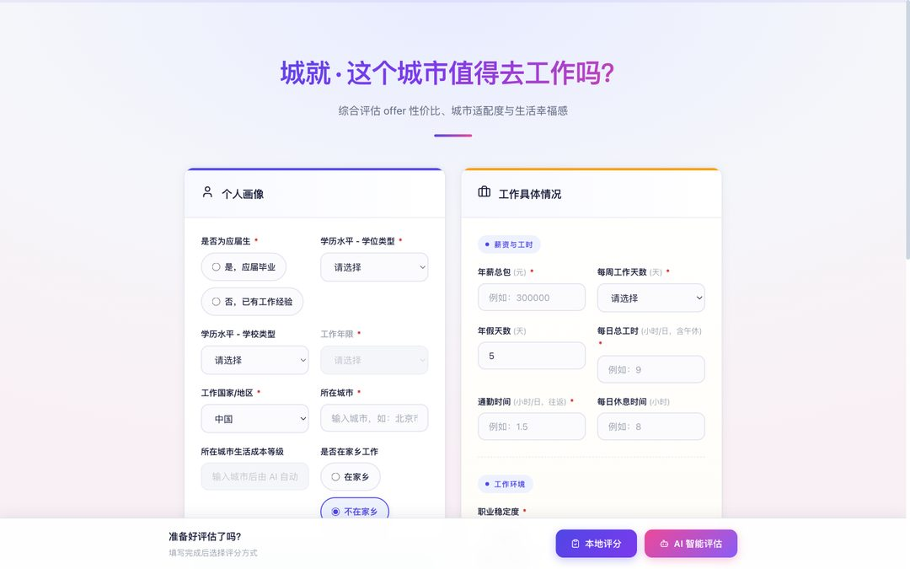

*城市值得去工作吗（city_worth） 界面*

体验：[https://iscityworth.asia/](https://iscityworth.asia/)

&nbsp;

**8. 面试模拟器**（求职职业）

基于真实简历和目标 JD 生成拟真 AI 面试官，提供压力面、STAR、技术深挖、HR 行为面等人设，结束后输出评分与复盘。

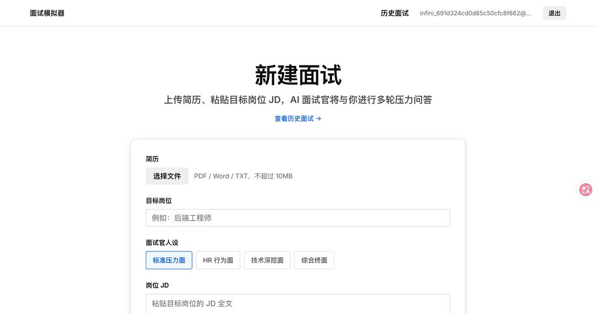

*面试模拟器 界面*

体验：[http://150.158.148.112](http://150.158.148.112)

&nbsp;

**9. 住哪儿｜租房通勤决策器**（生活决策）

不只看月租，把通勤时间、真实月成本、配套和居住风险压成一张可复核的决策表。

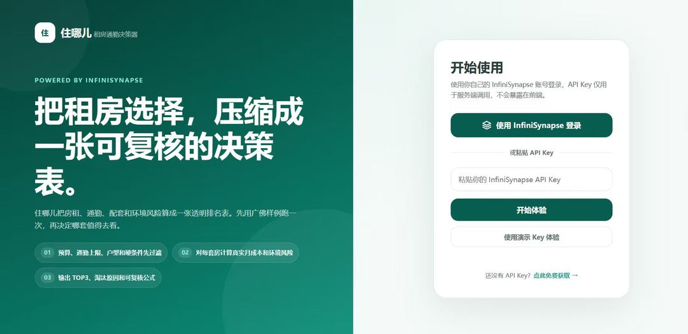

*住哪儿｜租房通勤决策器 界面*

体验：[https://guangforent-zhunaer-d3glw67kxb5de30db.webapps.tcloudbase.com](https://guangforent-zhunaer-d3glw67kxb5de30db.webapps.tcloudbase.com)

&nbsp;

**10. AI 装修报价审计员**（生活决策）

上传装修报价单，联网核查本地市价，识别常见报价陷阱，并生成谈判清单和漏项检查。

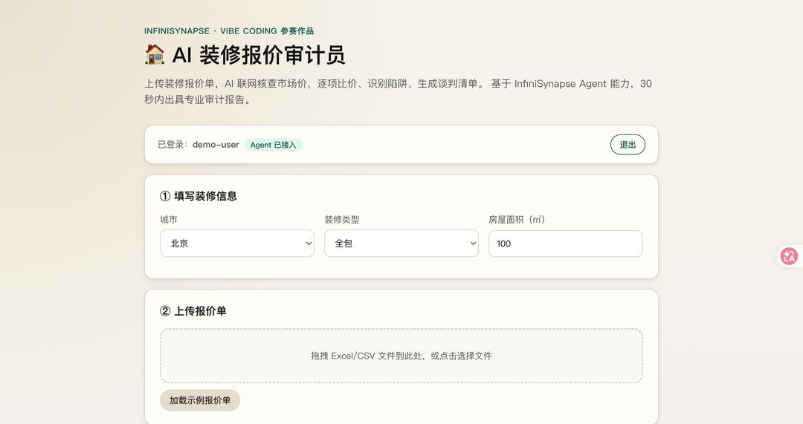

*AI 装修报价审计员 界面*

体验：[https://reno-audit.vercel.app](https://reno-audit.vercel.app)

&nbsp;

**11. 语感工坊 YuGan**（教育学习）

把段落、金句、词语沉淀成个人语感资产，让 AI 分析学习数据，而不是只生成文案。

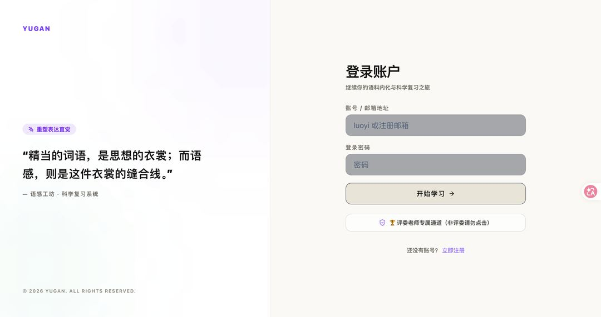

*语感工坊 YuGan 界面*

体验：[https://305758.xyz](https://305758.xyz)

&nbsp;

**12. 琢玉轩**（教育学习）

面向中小学教师的 AI 备课工作台，覆盖教案生成与优化、出题、提问链，以及微课视频出品。

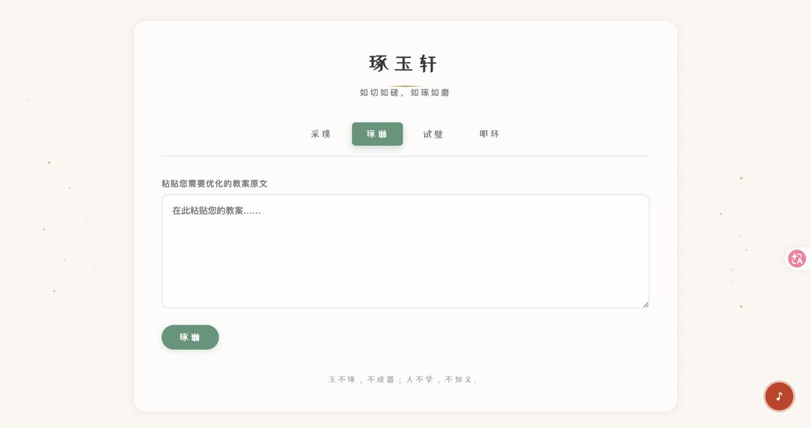

*琢玉轩 界面*

体验：[https://zhuoyuxuan-production.up.railway.app/](https://zhuoyuxuan-production.up.railway.app/)

&nbsp;

**13. Real Raise：涨薪真实购买力计算器**（个人财务）

把税前涨薪拆成到手收入和城市购买力，看清名义涨薪最后能买到什么。

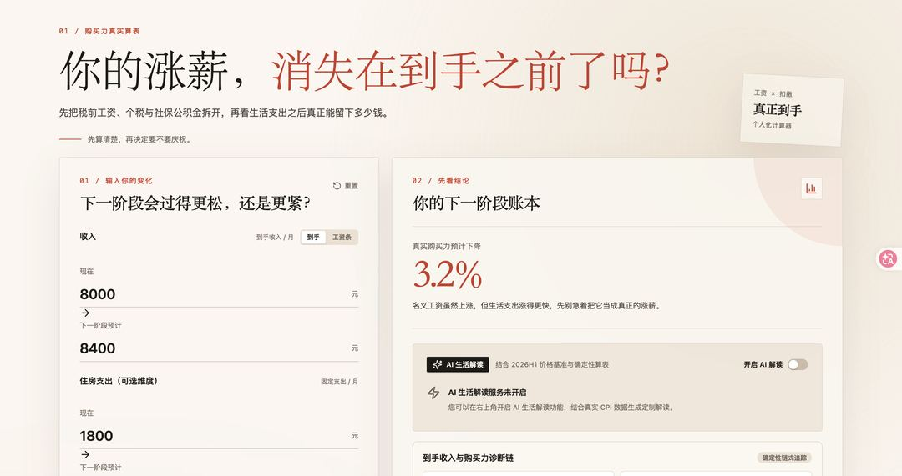

*Real Raise：涨薪真实购买力计算器 界面*

体验：[https://plain-wind-ae46.yefuyou2333.workers.dev/](https://plain-wind-ae46.yefuyou2333.workers.dev/)

&nbsp;

**14. 先鉴**（教育学习）

长视频学习助手。先判断内容含金量和与个人技能树的匹配度，再给出可跳转的时间码观看路线。

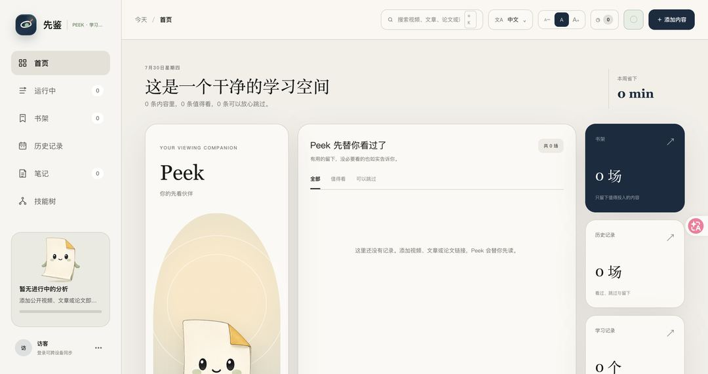

*先鉴 界面*

体验：[https://peek.antiquelixcheng5413.workers.dev/](https://peek.antiquelixcheng5413.workers.dev/)

&nbsp;

**15. OPC Gate｜一人公司政策与落地路线诊断**（创业政策）

把分散的政策、园区和算力资源，转成可解释、可追溯的落地建议，并给出风险边界和七日计划。

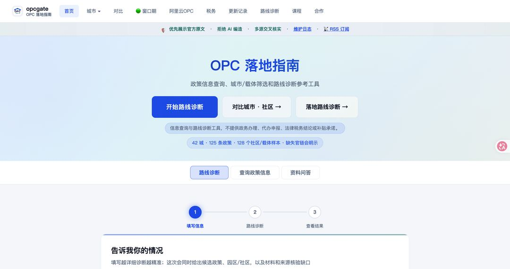

*OPC Gate｜一人公司政策与落地路线诊断 界面*

体验：[https://opcgate.com](https://opcgate.com)

&nbsp;

**16. 拾余**（个人财务）

不只记账，还指出浪费点、优化方法和省下来的钱去了哪，覆盖欲望冷却、续费管家和闲置回血。

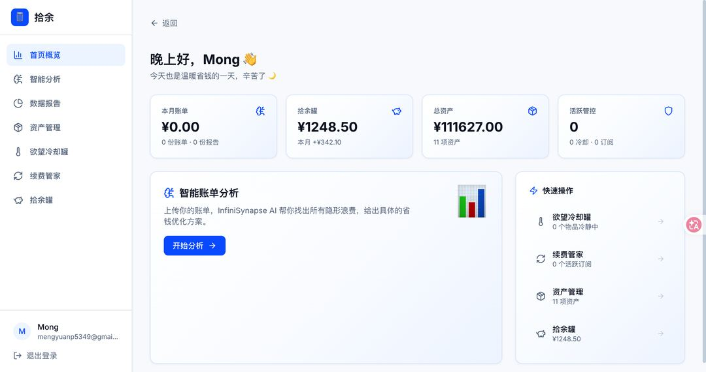

*拾余 界面*

体验：[http://47.238.242.89:3001](http://47.238.242.89:3001)

&nbsp;

**17. 合同明镜 · AI 合同风险助手**（法律权益）

面向普通人。上传或粘贴租房、劳动、消费合同，识别潜在风险并给出改条款建议和沟通话术。

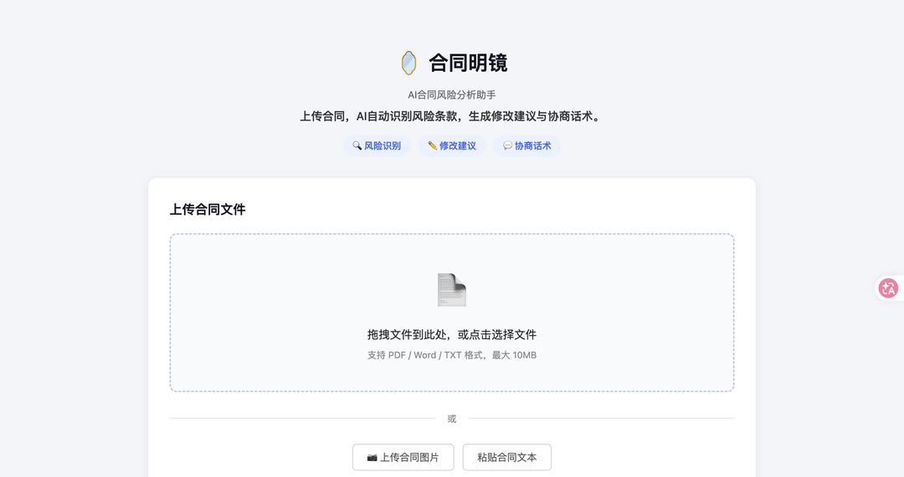

*合同明镜 · AI 合同风险助手 界面*

体验：[https://ai-contract-risk-assistant.onrender.com](https://ai-contract-risk-assistant.onrender.com)

&nbsp;

**18. 掌柜参谋**（经营电商）

加载订单、库存等经营数据后，自动生成经营日报与异常哨兵，每条洞察带证据链和今日可执行行动。

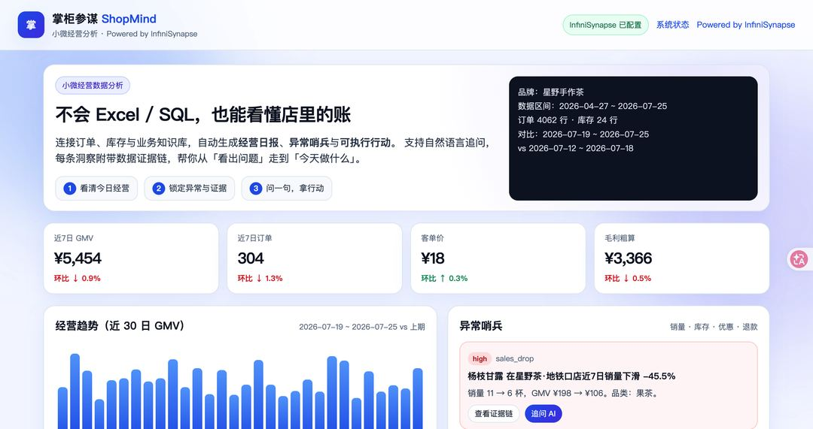

*掌柜参谋 界面*

体验：[http://82.156.104.3:8399/](http://82.156.104.3:8399/)

&nbsp;

**19. 北京摆摊点位分析**（本地创业）

按所在区、资金、品类和时间匹配北京真实 POI，输出经营策略卡、7 日计划和 PDF。

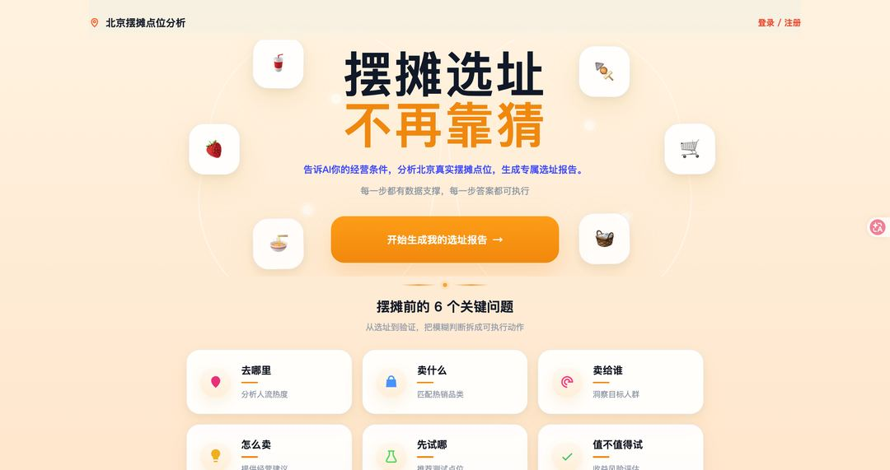

*北京摆摊点位分析 界面*

体验：[https://baitan-d7gzhdal4e568e34b-1442581960.tcloudbaseapp.com](https://baitan-d7gzhdal4e568e34b-1442581960.tcloudbaseapp.com)

&nbsp;

**20. 小红书种草甄别**（消费决策）

粘贴笔记正文，从话术和证据识别疑似营销浓度，输出软广风险分析，辅助判断是不是种草翻车。

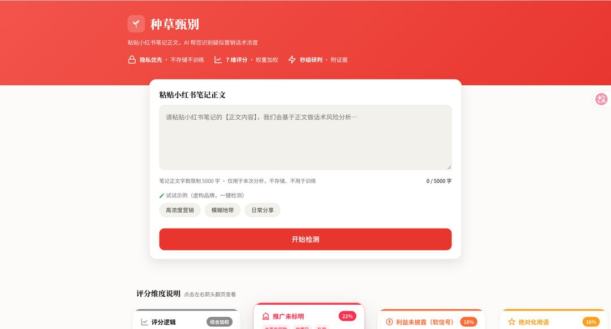

*小红书种草甄别 界面*

体验：[https://xhs-ad-detect.onrender.com](https://xhs-ad-detect.onrender.com)

&nbsp;

**21. 客满满**（经营电商）

面向小微实体商户的短视频经营增长分析。先算转化、获客成本和 ROI，再出诊断、脚本、选题和 30 天计划。

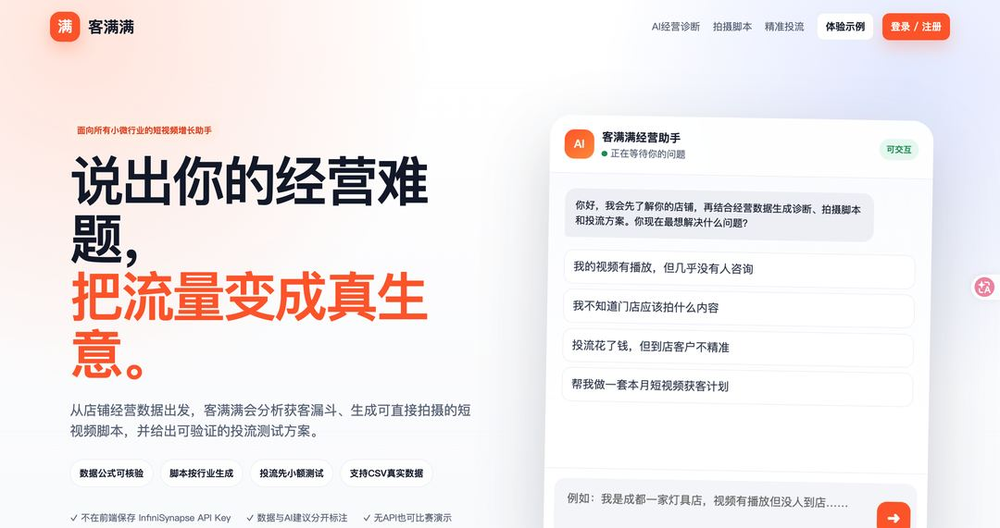

*客满满 界面*

体验：[https://kemanman1.vercel.app/](https://kemanman1.vercel.app/)

&nbsp;

**22. Token体检**（开发者工具）

给高频 AI 用户看对话浪费了多少上下文，找出重复描述、需求模糊和无验收标准，并给出优化对照。

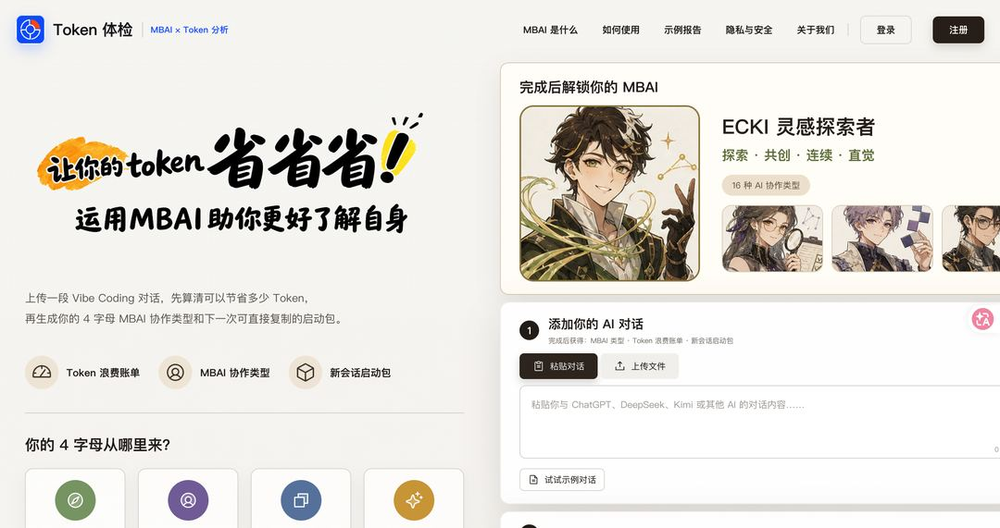

*Token体检 界面*

体验：[http://43.132.209.68](http://43.132.209.68)

&nbsp;

**23. 逆向罗盘（Return Compass）**（经营电商）

支持多平台电商退货数据导入，统一分析退货率、退款损失、逆向物流和库存回损。

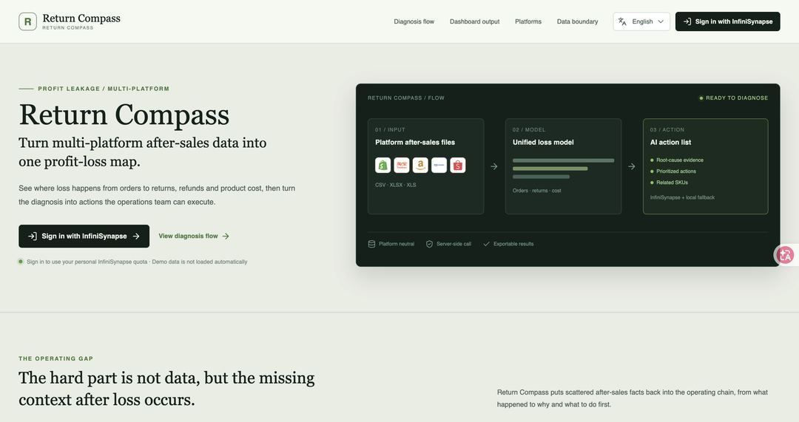

*逆向罗盘（Return Compass） 界面*

体验：[https://multi-platform-return-loss-diagnosis.onrender.com/](https://multi-platform-return-loss-diagnosis.onrender.com/)

&nbsp;

**24. 赛场扫描仪**（竞赛工具）

把公开作品集装进一个赛场，先看赛道拥挤度和机会指数，再在选题台打磨差异化角度。

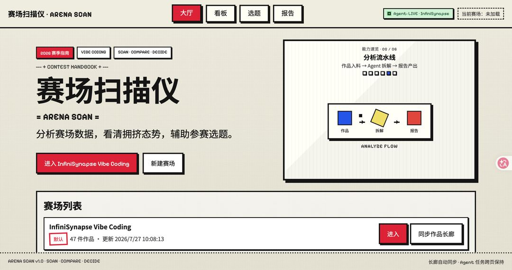

*赛场扫描仪 界面*

体验：[http://101.37.80.155:5173/](http://101.37.80.155:5173/)

&nbsp;

**25. 凤栖梧**（求职职业）

面向大学生的 AI 求职陪伴。先接住情绪，再做面试复盘、模拟面、简历诊断和成长图谱。

*凤栖梧 界面*

体验：[https://fengqiwu-production.up.railway.app](https://fengqiwu-production.up.railway.app)

&nbsp;

**26. Retro/Radar · 项目复盘雷达**（项目管理）

把进度、预算、里程碑和阻塞记录，转成健康度、延期预测、因果链和优先行动清单。

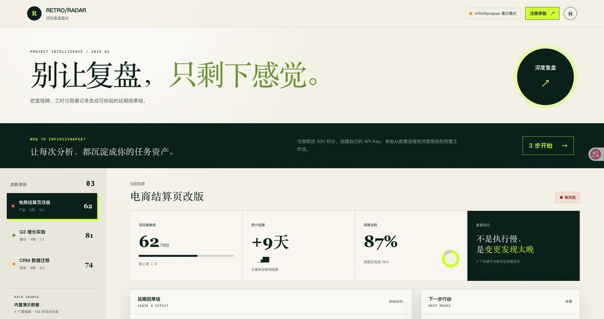

*Retro/Radar · 项目复盘雷达 界面*

体验：[https://retro-radar-2026.vercel.app](https://retro-radar-2026.vercel.app)

&nbsp;

**27. 电商经营分析助手**（经营电商）

不会写 SQL 也能问经营问题。上传真实订单后按探查结果写查询，过程可见，支持多轮追问。

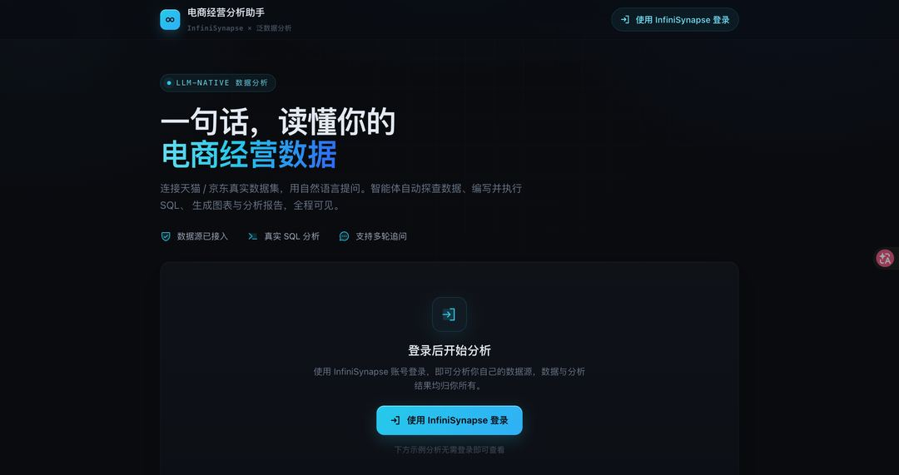

*电商经营分析助手 界面*

体验：[http://120.53.8.28:8666/](http://120.53.8.28:8666/)

&nbsp;

**28. 帅治星球-职场情绪分析平台**（组织人力）

面向 HR 和管理者，把员工心理测评整理成公司、部门、个人三类报告，帮助定位高压力人群并给出关怀建议。

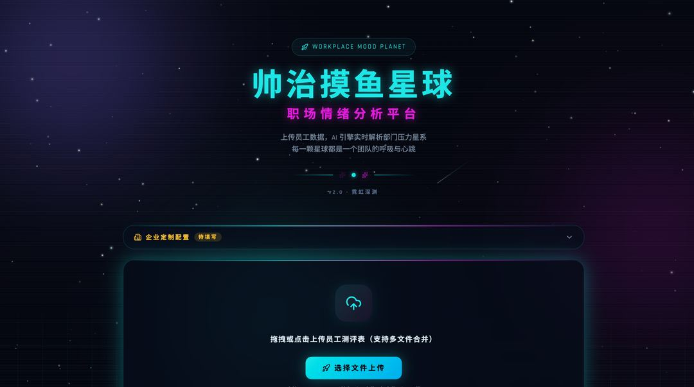

*帅治星球-职场情绪分析平台 界面*

体验：[https://shuaizhi.jinxilab.com](https://shuaizhi.jinxilab.com)

&nbsp;

**29. 智能掌柜**（经营电商）

面向美甲、美容、餐饮等小微商家。批量上传收银流水、团购报表和活动材料，用自然语言做跨源经营分析。

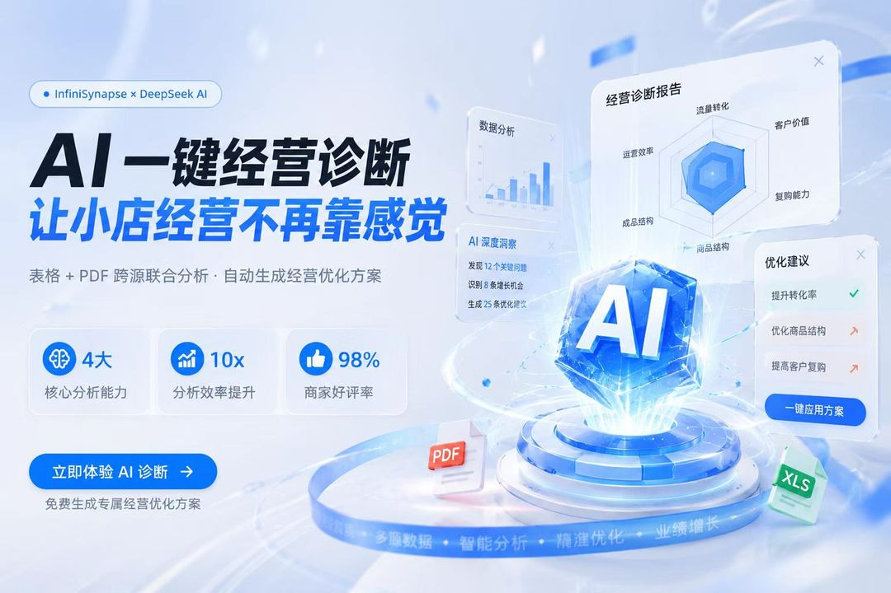

*智能掌柜 界面*

体验：[https://app-d8bq72qab4zl.appmiaoda.com](https://app-d8bq72qab4zl.appmiaoda.com)

&nbsp;

**30. 学情罗盘 EduCompass**（教育学习）

把成绩、考勤、作业和干预记录收在一起，生成画像、趋势、风险预警、周报和个性化干预建议。

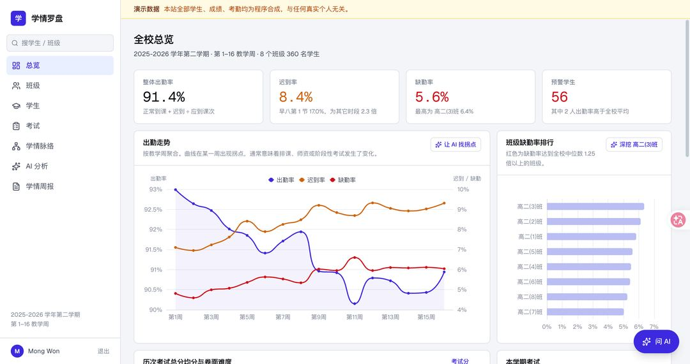

*学情罗盘 EduCompass 界面*

体验：[http://43.108.11.142:5678/](http://43.108.11.142:5678/)

&nbsp;

**31. 资析智策**（企业经营）

面向企业资产管理人员。把台账、合同期限、使用状态和价值转成健康评分、风险发现和处置清单。

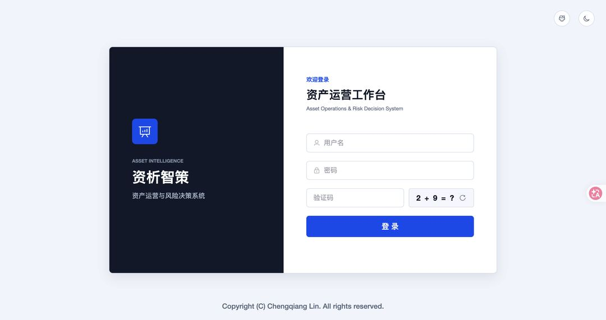

*资析智策 界面*

体验：[https://asset.312404.xyz/](https://asset.312404.xyz/)

&nbsp;

**32. 职牌**（求职职业）

上传简历后，用市场数据反向诊断职业身份，输出行动报告和一张可传播的去隐私职牌卡。

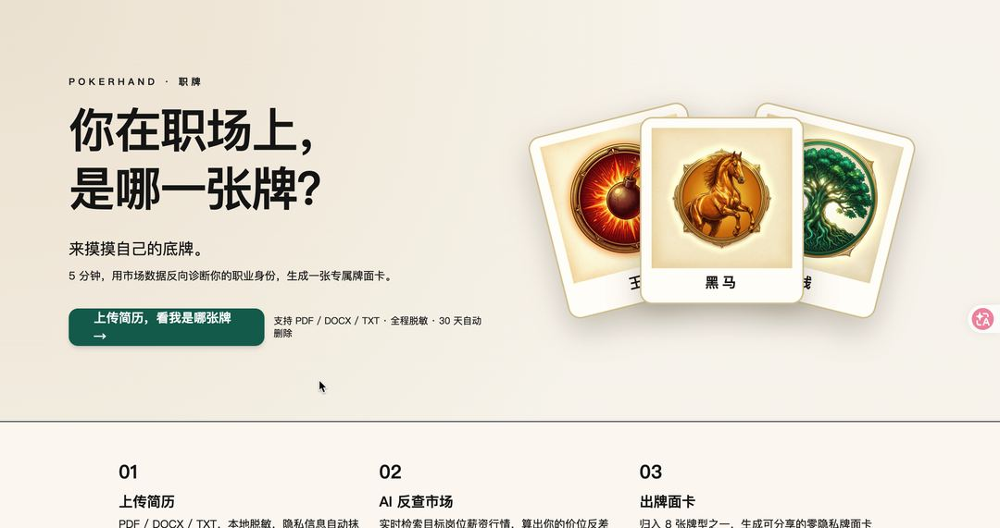

*职牌 界面*

体验：[http://43.161.226.67/](http://43.161.226.67/)

&nbsp;

**33. RepoPulse｜开源项目运营体检**（研发生态）

粘贴公开 GitHub 仓库，采集近 90 天提交、Issue、PR 和贡献者数据，给出五维健康分和分阶段行动建议。

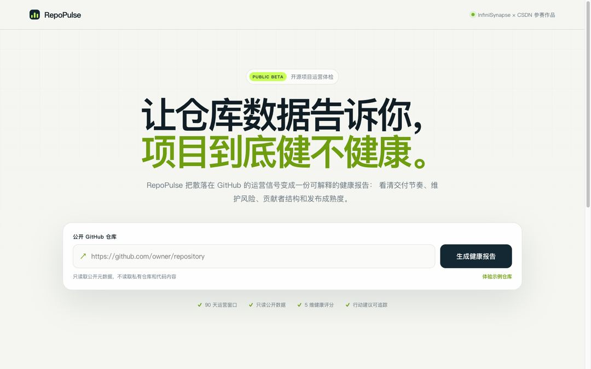

*RepoPulse｜开源项目运营体检 界面*

体验：[https://repopulse-2026.regeditthao.chatgpt.site](https://repopulse-2026.regeditthao.chatgpt.site)

&nbsp;

**34. 智管进销存**（经营电商）

给中小实体店用的 AI 进销存。覆盖看板、自然语言查数、单据、盘点、滞销预警和报表。

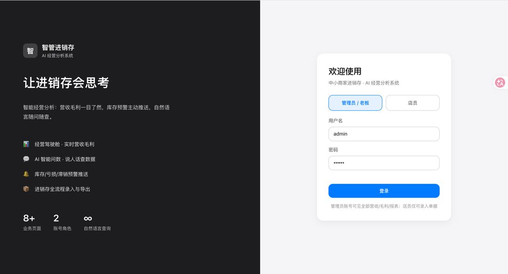

*智管进销存 界面*

体验：[https://zhiguan-jxc-production.up.railway.app](https://zhiguan-jxc-production.up.railway.app)

&nbsp;

**35. 智析账本 BillLens**（个人财务）

上传账单或流水，做消费结构、异常预警、预算和财务健康报告，并支持追问与导出。

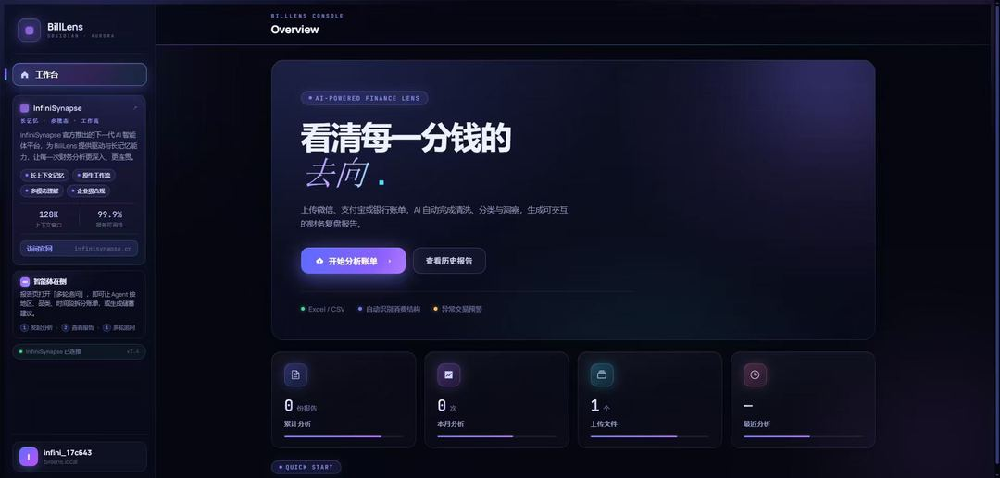

*智析账本 BillLens 界面*

体验：[http://120.48.158.101:8080](http://120.48.158.101:8080)

&nbsp;

**36. 家居供应链协同平台**（供应链）

聚合质量异常、交付延期、库存覆盖和供应商表现，支持追踪、分派、复验和 PDF 报告。

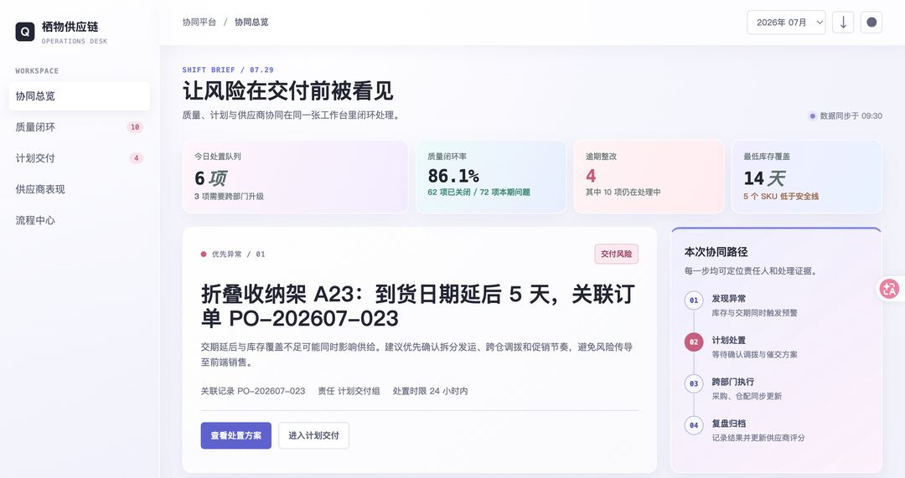

*家居供应链协同平台 界面*

体验：[https://supply-chain.520resume-doctor.online](https://supply-chain.520resume-doctor.online)

&nbsp;

**37. 财格-AI犀利点评你的理财性格**（个人财务）

轻量理财性格测试。用更直白的点评叫醒「花钱无感」，并生成可分享的报告卡。

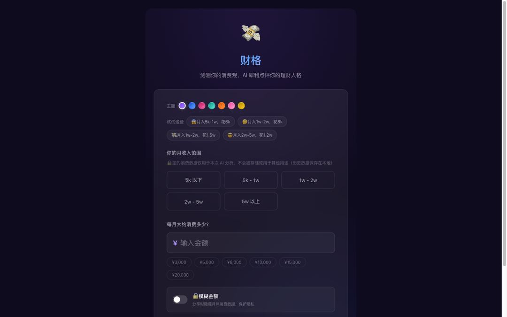

*财格-AI犀利点评你的理财性格 界面*

体验：[https://service.bckf.cn/caige/](https://service.bckf.cn/caige/)

&nbsp;

**38. 统计分析系统**（公共数据）

全国口径宏观统计分析应用。覆盖 GDP、工业、消费、外贸、投资、人口等指标，并提供看板与解读。

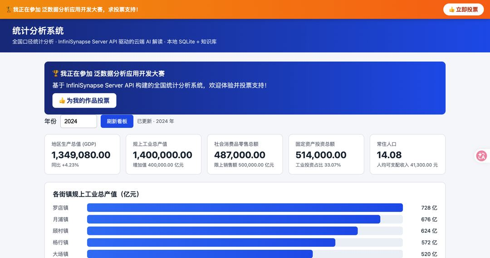

*统计分析系统 界面*

体验：[https://qu-stat-system.vercel.app/](https://qu-stat-system.vercel.app/)

&nbsp;

**39. 泡泡看市｜小白的股市翻译官**（投资理财）

把当日大盘、板块和热点翻译成更易懂的故事，并提供热力图和问答入口，内容仅供参考。

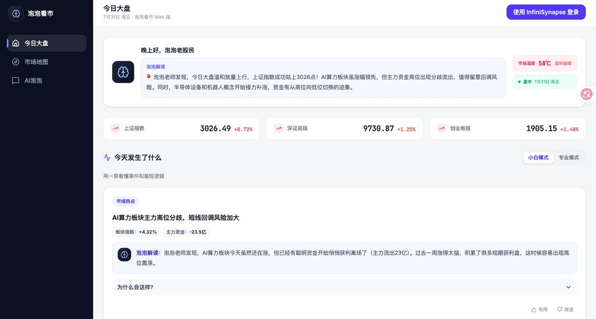

*泡泡看市｜小白的股市翻译官 界面*

体验：[https://paopaoaii.a273894731.workers.dev/](https://paopaoaii.a273894731.workers.dev/)

&nbsp;

**40. 智行路线 RouteWise**（旅行规划）

输入目的地、日期、预算和节奏，生成效率优先、体验优先、预算优先三套可执行路线。

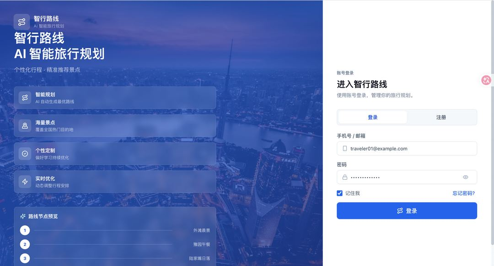

*智行路线 RouteWise 界面*

体验：[http://47.120.26.69:7890/routewise/](http://47.120.26.69:7890/routewise/)

&nbsp;

**41. SEO数据分析**（内容增长）

把 Search Console 一类流量数据接到可浏览的分析页，方便查看搜索与内容增长情况。

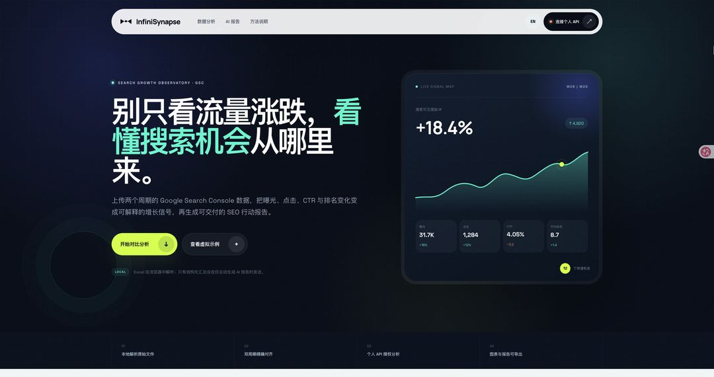

*SEO数据分析 界面*

体验：[https://gsc-data-analysis.vercel.app/](https://gsc-data-analysis.vercel.app/)

&nbsp;

**42. ProjectValueLab**（产品研究）

输入项目名称、官网、文档或仓库，梳理市场、用户、技术和商业模式，生成结构化价值报告。

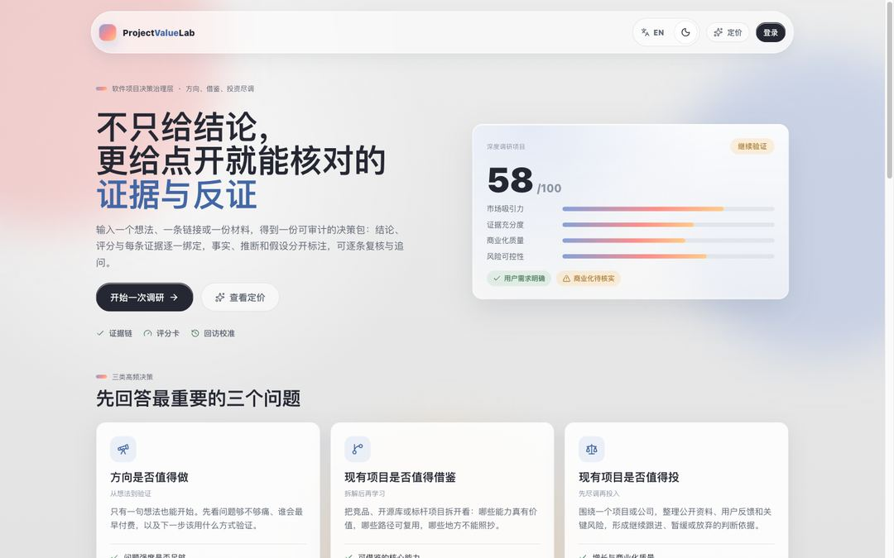

*ProjectValueLab 界面*

体验：[https://pvl.octoooo.com/](https://pvl.octoooo.com/)

&nbsp;

**43. 选题雷达 Topic Radar**（内容增长）

按平台和内容领域调研近期趋势，用热度、竞争度、机会指数评估选题，并给出切入角度和标题建议。

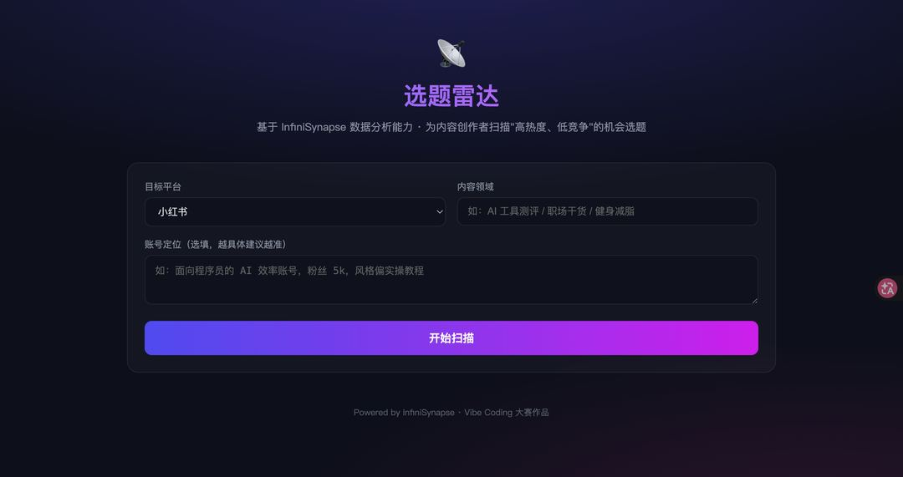

*选题雷达 Topic Radar 界面*

体验：[http://120.53.8.28:3000](http://120.53.8.28:3000)

&nbsp;

**44. 学习计划助手**（教育学习）

填写想学的领域，再上传教材或粘贴教程，自动拆成阶段化学习路线，支持 Markdown / PDF 导出。

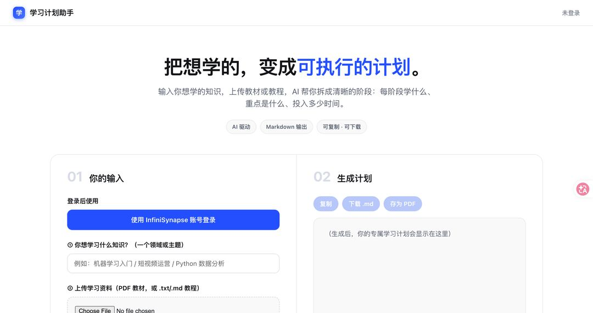

*学习计划助手 界面*

体验：[https://infinisynapse-new.pages.dev/](https://infinisynapse-new.pages.dev/)

&nbsp;

**45. CET-4 Vocab Lab 四级单词学习舱**（教育学习）

面向四级备考。支持词库浏览、自测、薄弱词识别，并生成今日推荐词和复习路径。

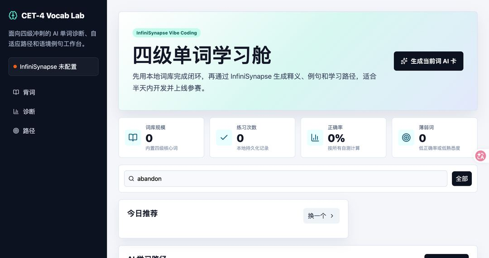

*CET-4 Vocab Lab 四级单词学习舱 界面*

体验：[https://infinisynapse-cet4-vocab.vercel.app/](https://infinisynapse-cet4-vocab.vercel.app/)

&nbsp;

**46. 竞品对标分析器**（产品研究）

面向智能硬件、消费电子、快消等团队，用 AI 做实体产品的竞品对标分析。

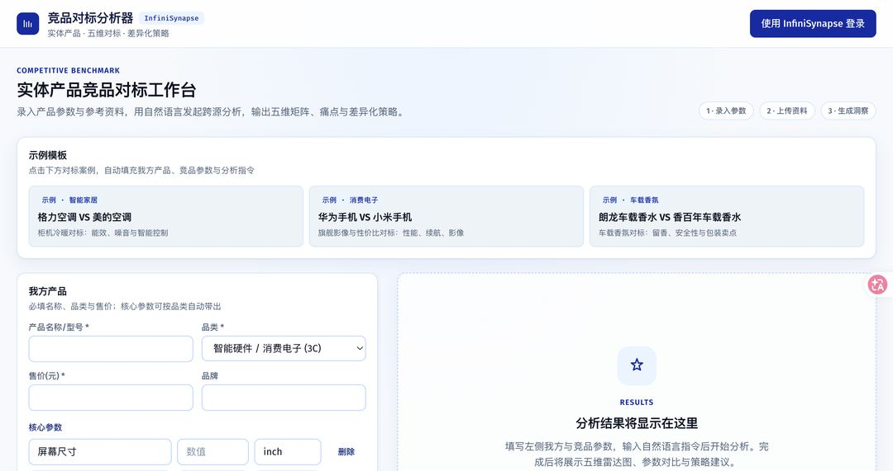

*竞品对标分析器 界面*

体验：[http://compbench.zhuangyb.top](http://compbench.zhuangyb.top)

&nbsp;

**47. 产品经理数据汇报工作台**（通用分析）

把仪表盘、周报可视化、汇报 PPT 和行研报告收进一个工作台，按步骤完成数据分析交付。

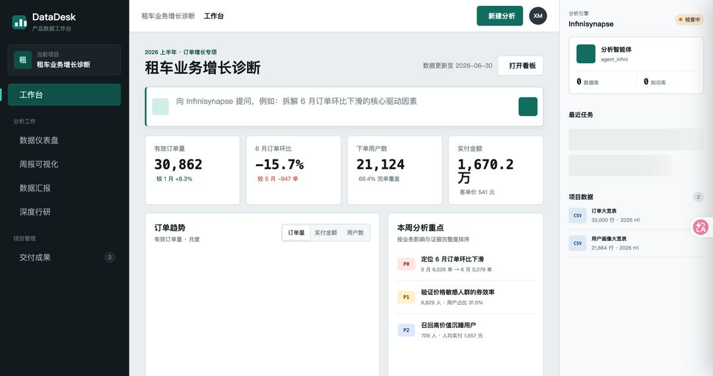

*产品经理数据汇报工作台 界面*

体验：[http://8.141.101.70/data-workbench/](http://8.141.101.70/data-workbench/)

&nbsp;

**48. 簿言**（通用分析）

上传 Excel 做结构识别、异常分析和可视化，同时提供记事与轻量记账能力。

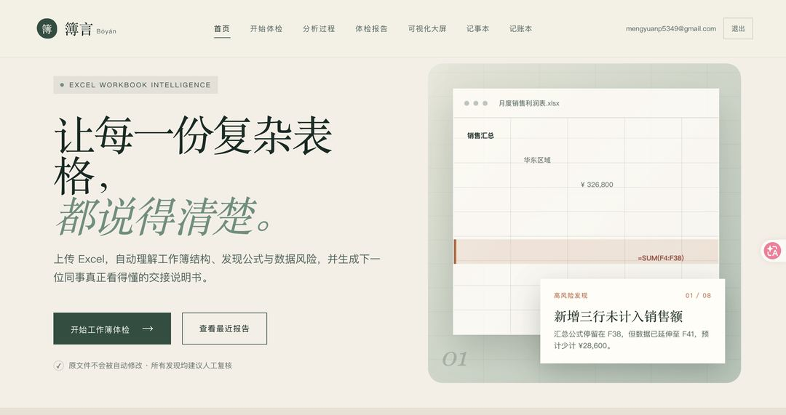

*簿言 界面*

体验：[https://vibe-coding-boyan.vercel.app/login](https://vibe-coding-boyan.vercel.app/login)

&nbsp;

**49. 明日足球**（体育娱乐）

选择比赛后查看比分、阵容、关键事件和战术回放，并一键生成 AI 战术复盘。

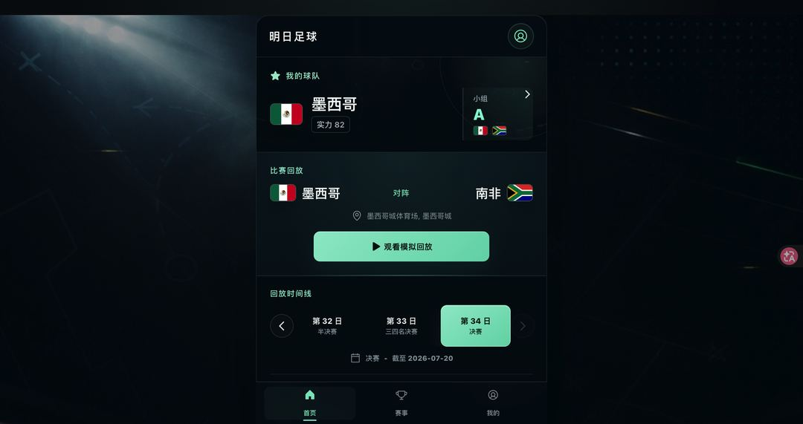

*明日足球 界面*

体验：[https://www.yomujp.top/](https://www.yomujp.top/)

&nbsp;

**50. 人生模拟器**（娱乐实验）

用 Agent 批量生成个性化事件的人生模拟体验，偏娱乐向。

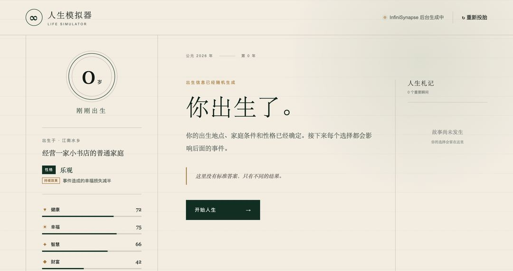

*人生模拟器 界面*

体验：[https://life-simulator-omega-snowy.vercel.app/](https://life-simulator-omega-snowy.vercel.app/)

## 奖项与权益，再对一遍

名单看完，把奖品再摊开一次。现金奖金池 **¥22,528**，另附 InfiniSynapse Pro 会员；四档都有 InfiniSynapse × CSDN 联名证书。

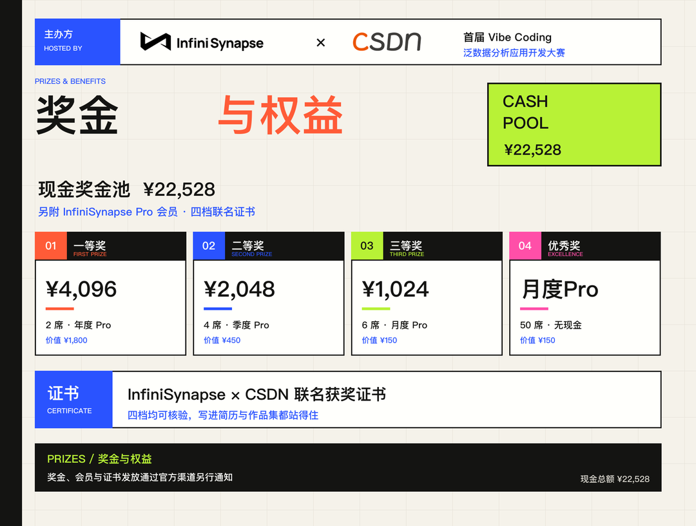

*现金 + 会员 + 证书；发放通过官方渠道另行通知*

- **一等奖 · 2 席**：现金 ¥4,096 / 人 + 年度 Pro（价值 ¥1,800）
- **二等奖 · 4 席**：现金 ¥2,048 / 人 + 季度 Pro（价值 ¥450）
- **三等奖 · 6 席**：现金 ¥1,024 / 人 + 月度 Pro（价值 ¥150）
- **优秀奖 · 50 席**：月度 Pro（价值 ¥150）

证书带独立编号，可核验。请获奖同学保持应用可访问、联系方式畅通。

## 接下来怎么做

1. **获奖同学**：请保持应用可访问、联系方式畅通，证书与权益发放会通过官方渠道另行通知。
2. **想体验作品**：优先复制上方链接；也可以到作品长廊按名字检索。
3. **没赶上这一届**：作品长廊会持续开放。下一场我们会换一种形式，欢迎继续关注。

作品长廊：[https://infinisynapse.cn/contest/vibe-coding/gallery](https://infinisynapse.cn/contest/vibe-coding/gallery)

感谢每一位把想法做成可上线应用的开发者。

**让 Data Infra 创造无限可能。**
