# 用户反馈｜SEO 数据他看不懂，InfiniSynapse 直接帮他出了十维报告

最近有位用户反馈：GSC 导出的表看得头晕，后来把数据丢进 InfiniSynapse，三步就出了一份十维分析报告。

不用会写公式，也不用先搭知识库。他说对 SEO 小白挺救命。

他的操作路径如下。

## 第一步：从 GSC 把数据打包带走

他把搜索效果相关的数据直接导出，没有自己做透视、打标签、清洗。原表丢进去就行。

用他的话说：自己只负责当快递员，解读这种累活交给 AI。

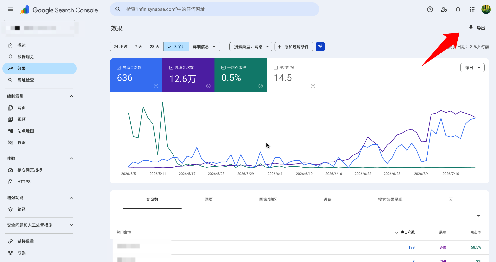

## 第二步：丢进 InfiniSynapse，打开「联网搜索」

打开任务页，上传文件，打开「联网搜索」。

他特别提到这一点：自己并没有准备 SEO 知识库，但开了联网搜索之后，工具会自己去补一些行业标准，比如 CTR 基准、设备差异这些。

「行业平均线我背不下来，它去背就好。」

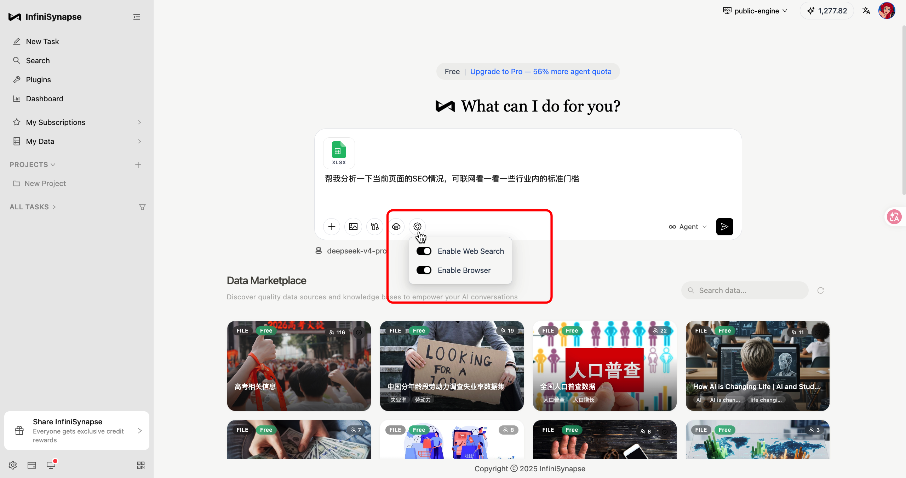

## 第三步：等报告出来，按优先级看

等一会儿，报告就出来了。一共 10 个维度。

他一开始也觉得多，后来发现不用一次吃透。先看大盘，再找机会，最后看改进建议就够了。

下面是报告里他觉得有用的几块。

### 1. 核心指标总览

先看点击、展示、CTR、平均排名，搞清楚网站现在大概处在啥水位。

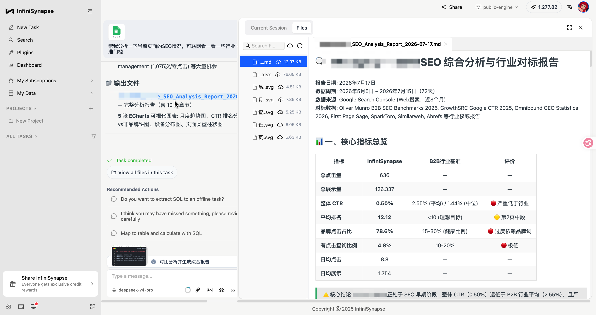

### 2. 月度趋势分析

单月数字容易骗人，趋势更诚实。比如展示涨了但点不动，往往说明已经被看见了，但标题和描述还不够让人想点。

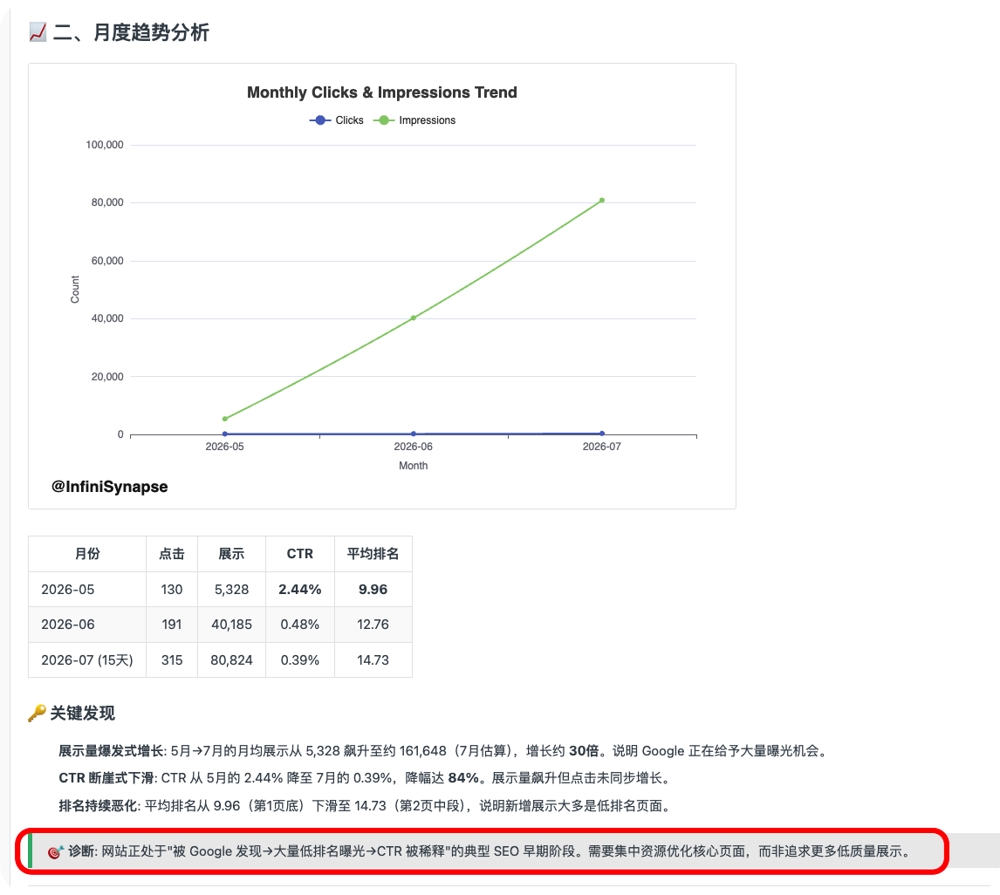

### 3. 品牌 vs 非品牌

这是他觉得最扎心的一页。流量涨了，不等于 SEO 变强了。如果涨的全是品牌词，可能只是认识你的人更多了；非品牌词也在涨，才更像内容开始自己拉新。

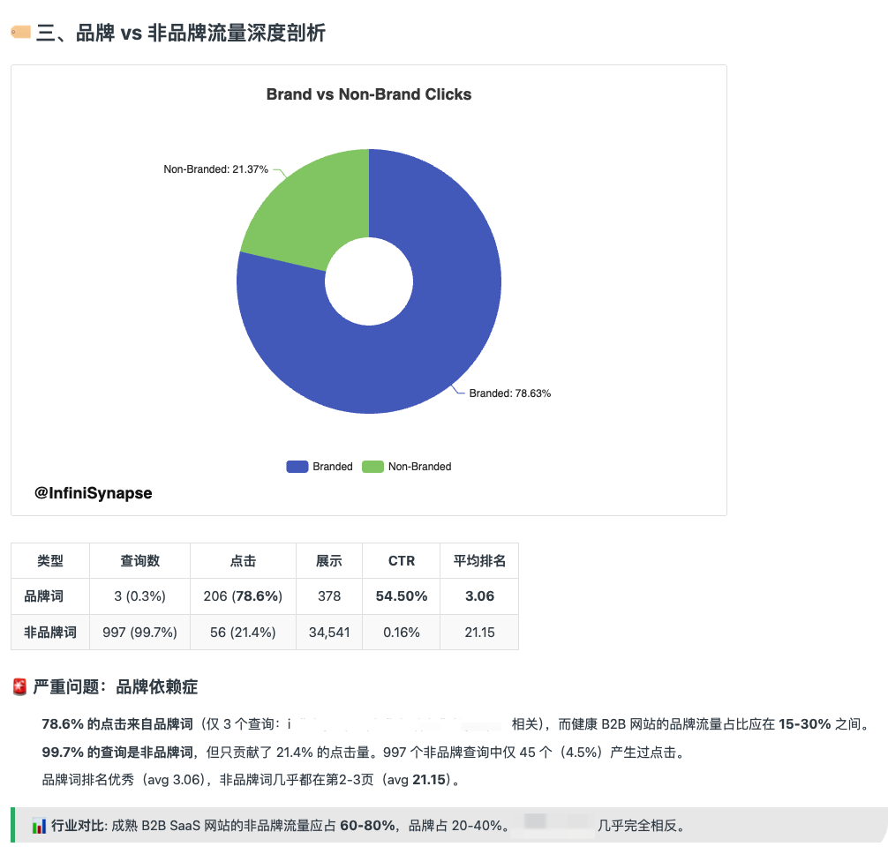

### 4. 设备分析

桌面和移动经常演两出戏。如果主要靠手机流量，移动 CTR 又差，那就先别谈大战略，先看移动体验。

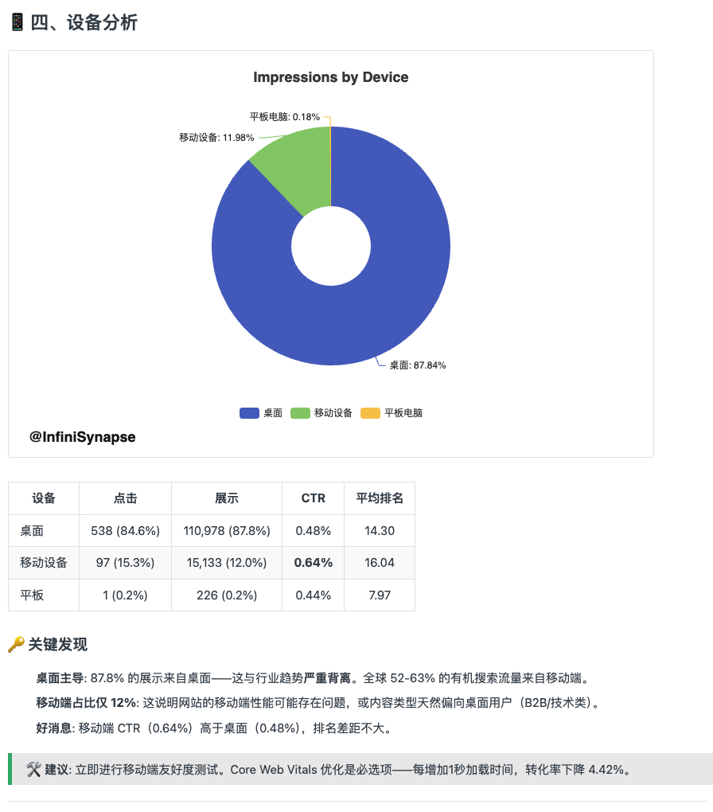

### 5. 地理分布

看看流量到底从哪冒出来，有没有「展示挺多、点击很少」的地区。

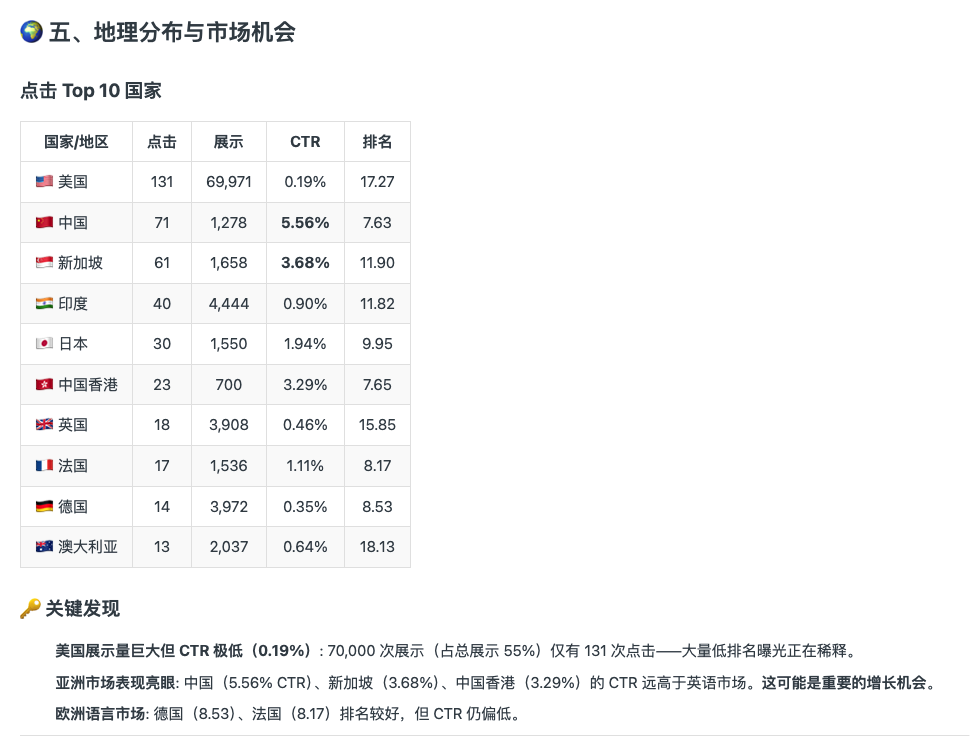

### 6. 页面类型与内容效能

有的页面一直在贡献点击，有的只负责刷展示。他说：网站里也有摸鱼选手。

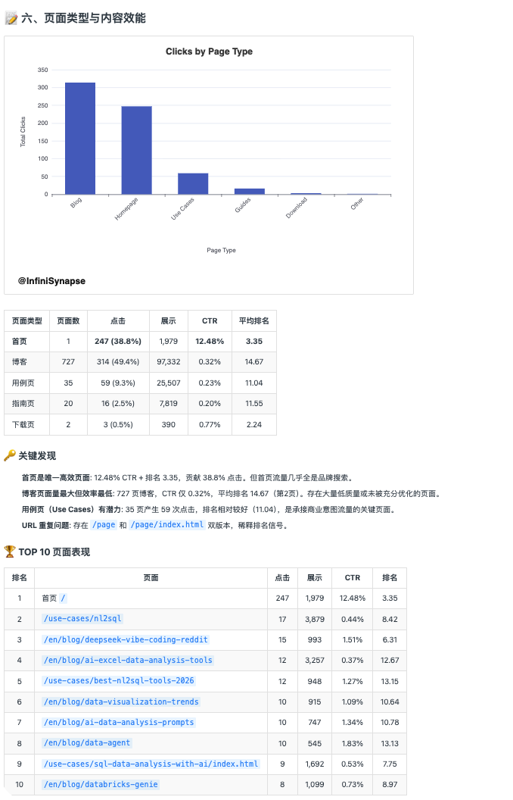

### 7. 查询排名分桶 + 行业 CTR 对标

不只告诉你排第几，还会对照行业 CTR。那些排在第 8～15 名、展示已经很高的词，往往是离首页只差临门一脚的一批。

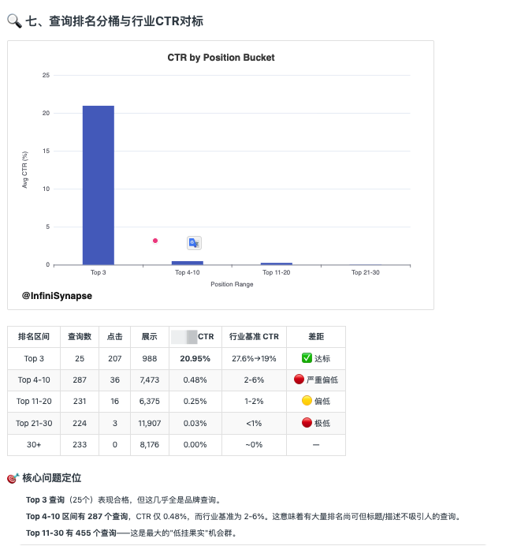

### 8. 快速机会 & 零点击高展示

这是他最爱看的一页。高展示低点击，翻译成人话就是：搜索结果里已经有你了，但大家看了一眼，选择滑走。

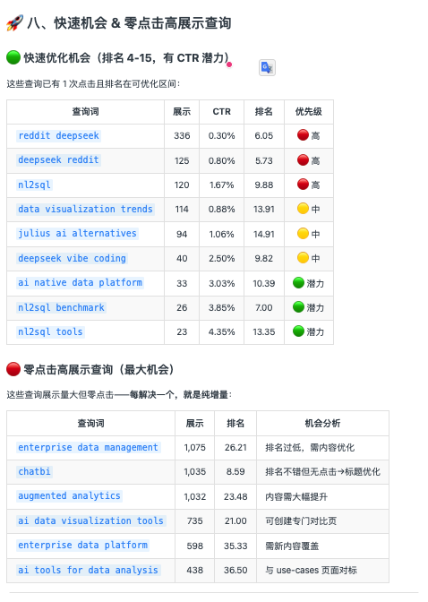

### 9. 行业趋势

补一点大环境，避免还在用三年前的打法硬刚现在的结果页。

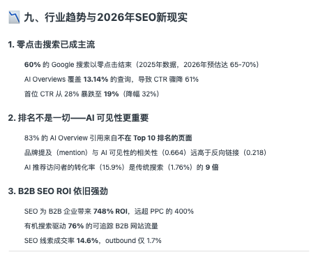

### 10. 综合诊断与改进建议

压轴最实用。按改进优先级排好：先改啥、为啥改。

他的用法很粗暴：直接截图，丢给写作工具和下周待办。不用再开一次「我们到底该优化什么」的会。

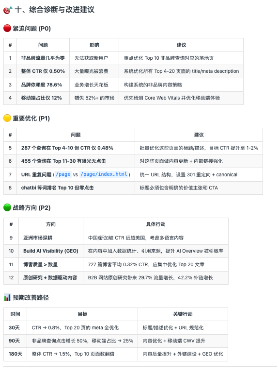

## 他最后的反馈，原文大意是这样

「真正卡我的，不是没数据，是数据都在，人已经裂开了。这个工具最可爱的地方，就是把看不懂的表，变成可以开干的清单。」

他觉得对 SEO 小白最友好的三点：

1. 不用先学复杂分析方法
2. 不用先搭知识库
3. 结论会按优先级吐出来

## 隐藏用法：追问一句，直接出一份能扔给 Cursor 的优化清单

他说光看报告还不过瘾，于是又追问了一句：帮我把优化细节展开。

AI 就顺着刚才的诊断继续往下钻，直接生成了一份《可执行优化手册》，具体到每个页面、每一步怎么改。

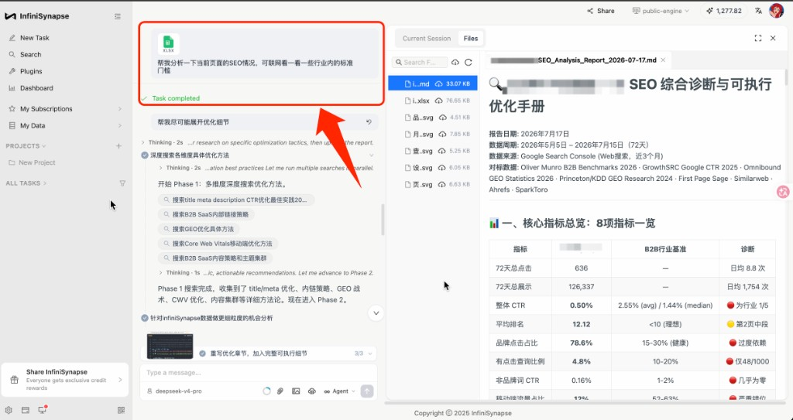

比如排在最高优先级（P0）的：Title 和 Meta Description 批量重写。它不是甩你一句「去优化标题」，而是把规范直接列清楚——字符预算多少、关键词放在前多少字、用什么分隔符、Meta 该按「问题—方案—行动」怎么写。照着抄就行。

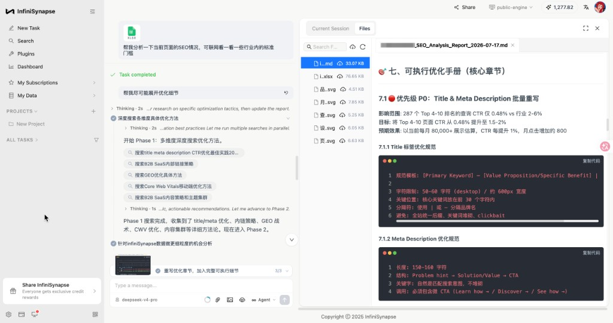

更省心的是，它还会按「展示 ×（1-CTR）×（10-排名）」算出每个页面的优化价值，排好优先级，告诉你前 30 个页面里，哪 15 个建议两周内先改。等于连「先动哪、后动哪」都替你排好了。

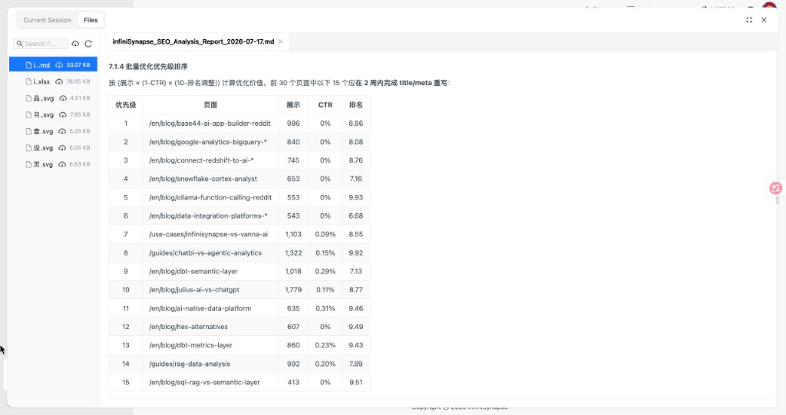

最爽的一步在这：这份手册本身对 AI 编程工具就很友好。他直接把这份 markdown 扔给 Cursor，让它照着逐页去改 title、meta、内链和内容——自己基本只负责点「同意」。

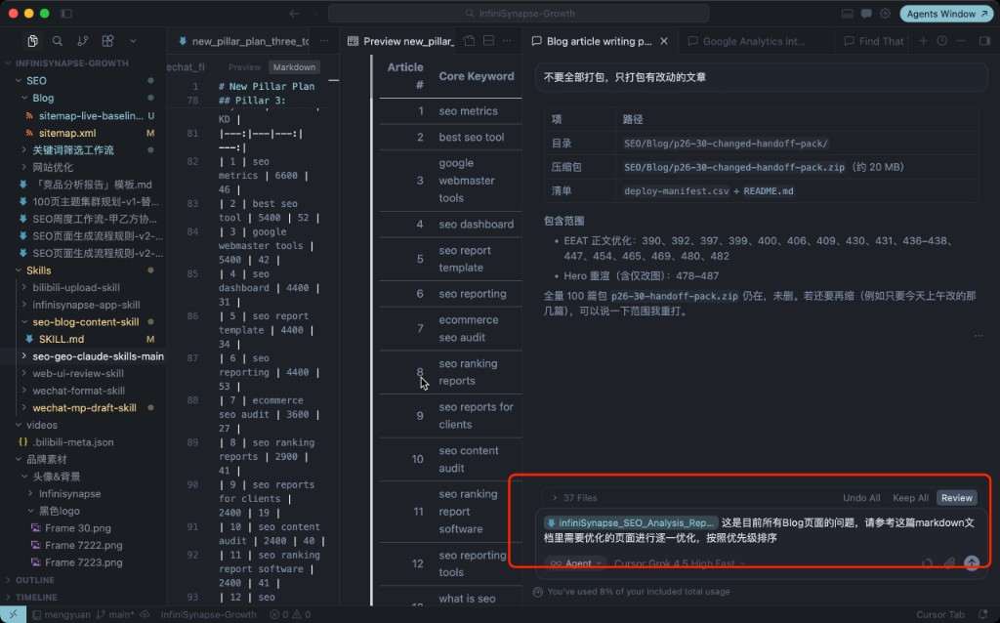

用他的话说：从「看懂问题」到「照着改完」，中间那段最费脑的活，也一起交出去了。

## 如果你也卡在同一关

他后来给自己定了个最小路径，也一并分享出来：

1. 从 GSC 导出一份搜索效果数据
2. 打开 [InfiniSynapse](https://app.infinisynapse.cn/tasks)，上传，打开联网搜索
3. 报告出来后，先只看两块：快速机会 & 零点击高展示查询、综合诊断与改进建议

先别逼自己一次读完十个模块。挑 3～5 个高优先级机会改一轮，再回头看数字有没有动，往往更实际。

这是真实用户反馈，不是官方自己编的操作手册。如果你也一直觉得 GSC 打开等于白打开，欢迎去试试，或者把你的使用体验丢评论区，我们很想听。

## 想拿福利、跟最新产品动态？扫码进官方群

