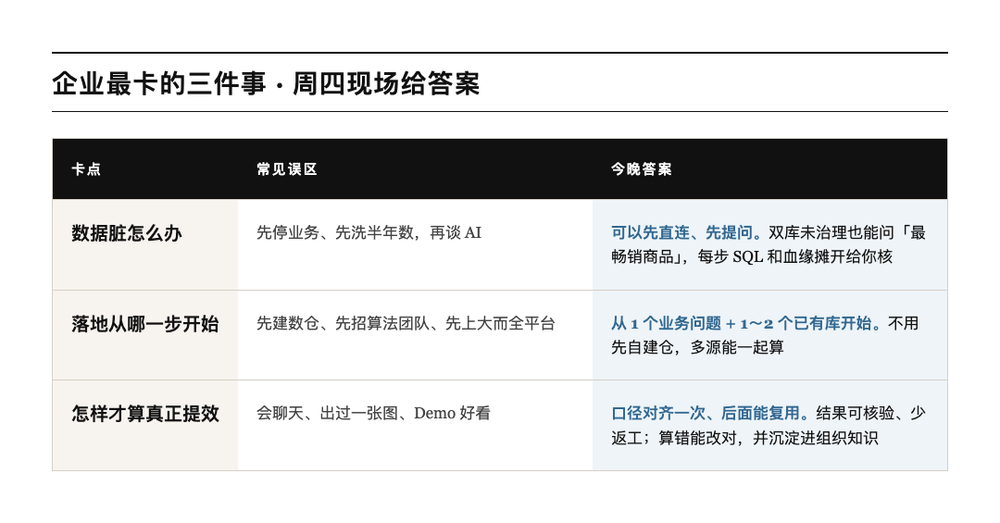
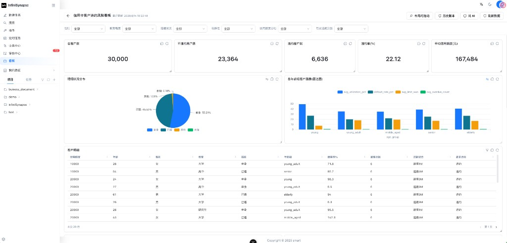

# 20 年数据工程师，不讲虚的：AI 企业到底怎么落地

企业上 AI，很多人一上来就问模型够不够强。

真到落地，卡的通常是更土的三件事：**数太脏、不知道从哪开始、也不知道怎样才算提效。**

下周四晚上，我们请 **InfiniSynapse 联创祝威廉** 来视频号，对着这三件事现场跑一遍。不念 PPT，就打开库，问问题，把过程摊给你看。

> [!important] 先记一句
> 数据再脏，也能先问起来；落地不用先建仓；提效看的是口径对齐、结果敢信，不是 Demo 好看。

*图 1：8 月 20 日周四 19:00，微信视频号见*

---

## 谁来聊

**祝威廉**，InfiniSynapse 联创，做了 20 年数据工程。

周四就两段真演示，都是他前阵子跟客户现场跑过的同款：

1. **先问起来。** 同时挂上 PostgreSQL 和 MySQL，库没治理过，直接问「两个数据源里，什么最好卖」。AI 自己探表、出结果，每一步 SQL 和血缘都打开给你对。
2. **再把口径对齐。** 先故意跑一个算错的「有效活跃用户」，补上口径再算一遍。对了之后，这条口径会留下来，下次不用重教。

翻译成人话：不用先自建仓，多个库能一起算，数字你自己能核。

---

## 先花 30 秒：为什么企业落地难

不想读长文也行。先看这段切片——数据分析那三道坎，为什么一到企业就卡住。

觉得说中了，周四再来看他怎么对着这三件事现场跑。

*图 2：请在公众号编辑器把这张图换成视频——为什么企业落地难（数据分析三大挑战）*

---

## 你卡的，多半也是这三件

*图 3：左边是常见绕路，右边是周四会现场跑的答案*

到时候你就盯这三句就够了：

- 库再乱，也能先问起来
- 从一个业务问题 + 一两个现成库开始就行
- 口径对齐一次，后面能复用，数字才敢信

---

## 再看一段：AI 怎么提高准确率

模型会说，不代表数字准。准不准，往往卡在口径、血缘、能不能核验。

下面这段就聊这件事：AI 怎么把准确率提上去，而不是只会给出一张好看的图。

*图 4：请在公众号编辑器把这张图换成视频——AI 怎么提高准确率*

周四中间会穿插问答。生产库能不能直连、会不会把库打挂、权限做到哪、ROI 怎么算，都可以问。问题优先从群里抽，所以**先进群更划算**。

---

## 重磅首秀：企业版这一手

周四还有一件事，单独说一句。

**InfiniSynapse 企业版**会在这场直播里首秀。基础设施能力叠上创新设计，等于打了双重 Buff：数据探索和数据看板不再各玩各的。问完能落到看板上，看板上的数也能追回去问。

以前常见的割裂是：这边聊天问数，那边另开一套看板，对不上，也沉不下来。企业版把这两件事揉在一起——探完就能钉成看板，看板也能继续往下挖。

下周四直播，现场把这个能力跑给你看。

*信用卡违约风险看板：问 AI、筛选、明细表，都在同一块屏上*

---

## 怎么看，福利怎么领

**时间**：8 月 20 日周四 19:00–20:00  
**地方**：微信视频号  
**人**：祝威廉｜InfiniSynapse 联创

进群可以领 **InfiniSynapse 月度会员，价值 150 元**。这个群不会播完就散，后面还要继续聊落地、收问题、发资料。

> [!tip] 两步就结束
> 先扫右边进群占座，再扫左边预约直播。到点微信会提醒你。会员直播后 24 小时内在群里发。

*图 5：左预约，右进群。会员价值 150 元*

进了群、又预约了，直播时优先被问到。你手头的坑也可以直接丢进来：数脏、口径对不齐、不敢碰生产库，都欢迎。

---

## 周四晚上见

切片先看，完整版周四来。一个小时，把「到底能不能落地」从口头变成你能自己核对的现场。

**8 月 20 日周四 19:00，视频号见。**
