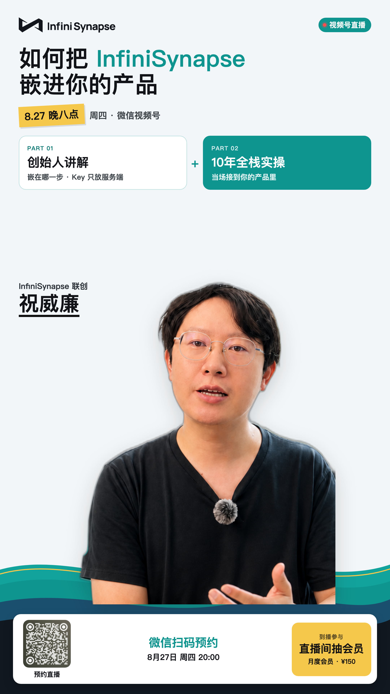
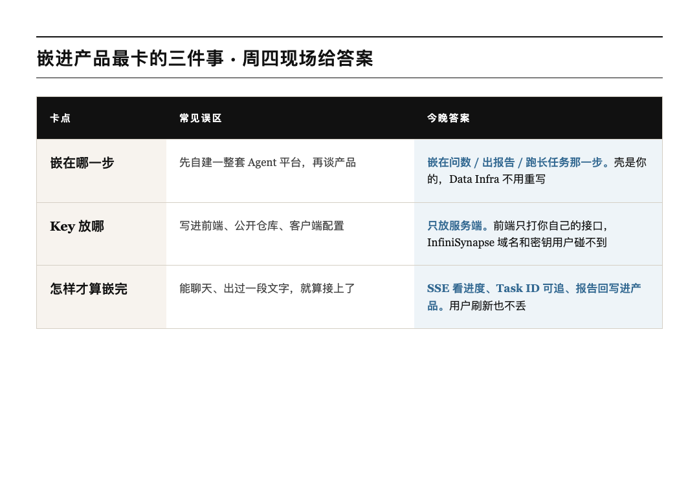
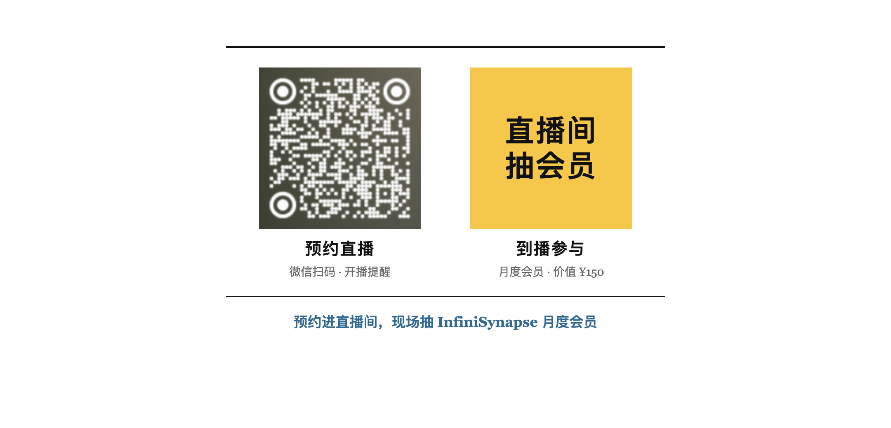

# 页面 vibe 完了：怎么把 InfiniSynapse 嵌进你的产品

上一场我们聊企业落地：库再脏，也能先问起来。

这场换镜头。你已经有产品壳了——表单、进度条、结果页都 vibe 出来了。卡的是后面那条看不见的链路：**谁来问数、谁来出报告、长任务跑到一半用户刷新了怎么办。**

明天周四晚上，**InfiniSynapse 联创祝威廉** 来视频号，对着这件事现场接一遍。不念架构图，就打开一条真实接入：从你的后端到报告落回你的页面。

> **先记一句**  
> 页面可以 vibe 出来；问数、出报告、跑长任务，嵌进你的产品就行。Key 只放服务端。

*图 1：8 月 27 日周四 20:00，微信视频号见*

---

## 谁来聊

**祝威廉**，InfiniSynapse 联创。上一场讲怎么在脏数据上先跑起来；这场讲怎么把同一套能力嵌进你自己的产品。

Vibe Coding 大赛刚公布 62 席获奖。那些作品不是聊天框套壳，是把 Server API 接进自己的场景：选校、比价、资产体检、报告快写——壳各不相同，底下是同一条链路。

周四就盯三件事：

1. **嵌在哪。** 不是先自建一套 Agent 平台。嵌在用户要问数、要出报告、要跑长任务的那一步。
2. **Key 放哪。** 只放服务端。前端只打你自己的接口，InfiniSynapse 的域名和密钥用户永远碰不到。
3. **怎么算嵌完。** SSE 能看见进度，Task ID 刷新了还能追，报告下载回来写进你的产品，而不是停在别人的后台。

翻译成人话：壳是你的，Data Infra 不用重写，验收看的是报告有没有回到你的页面。

---

## 你卡的，多半也是这三件

*图 2：左边是常见绕路，右边是周四会现场跑的答案*

到时候你就盯这三句就够了：

- 嵌在问数、出报告、跑长任务那一步
- Key 只放服务端，不要写进前端
- 进度看得到、任务追得回、报告落在你的产品里

---

## 一条能验收的链路

现场会把最小闭环跑给你看，顺序别搞反：

1. 后端拿 API Key，写进环境变量  
2. **先**建立 SSE，**再**发任务，同一个连接贯穿全程  
3. 从事件流读进度，任务结束后用 Task ID 去工作区拉报告，回写到你的页面

国内走 `.cn`，海外走 `.com`。完整接口在 [Server API Reference](https://infinisynapse.cn/zh/docs/InfiniSynapse%20Server%20API%20Reference)。

周四中间会穿插问答。前端能不能直连、Key 泄露怎么办、长任务会不会丢、积分怎么算，都可以问。问题优先从群里抽，所以**先进群更划算**。

---

## 怎么看，福利怎么领

**时间**：8 月 27 日周四 20:00–21:00  
**地方**：微信视频号  
**人**：祝威廉｜InfiniSynapse 联创

直播间会抽 **InfiniSynapse 月度会员，价值 150 元**。先预约，到点进直播间参与。

> **两步就结束**  
> 先扫码预约直播，到点微信会提醒你。会员在直播间抽。

*图 3：左预约，右到播抽会员。会员价值 150 元。预约码待换成 8/27 新预告。*

进了群、又预约了，直播时优先被问到。你手头的坑也可以直接丢进来：页面有了接不上、Key 不知道放哪、报告出不来，都欢迎。

---

## 周四晚上见

壳可以一晚上 vibe 出来。嵌进去的那一夜，周四一起看。

**8 月 27 日周四 20:00，视频号见。**
