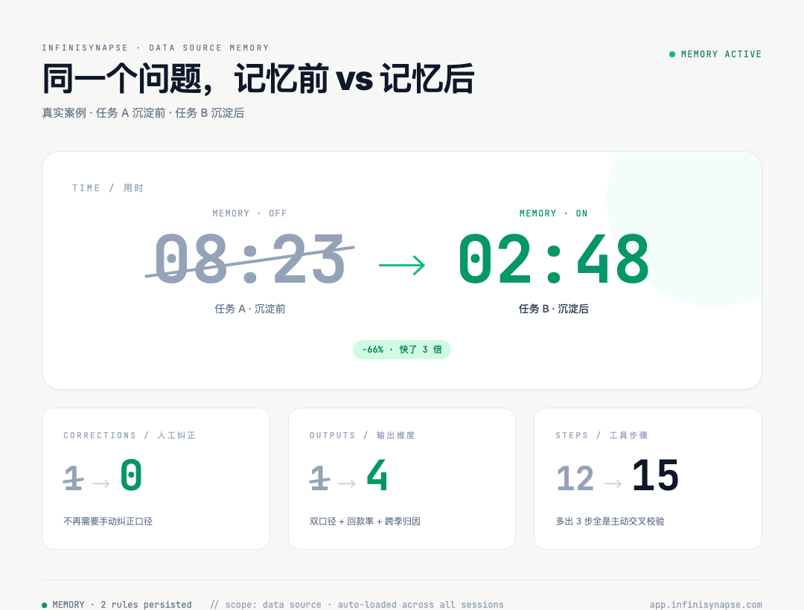
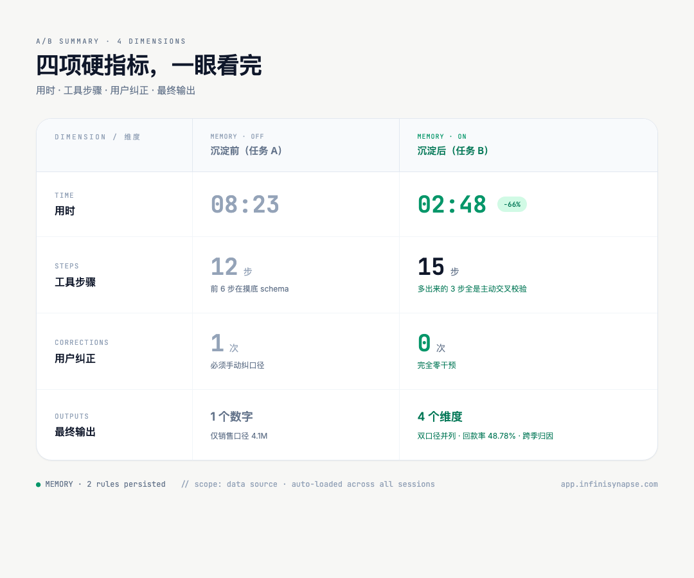
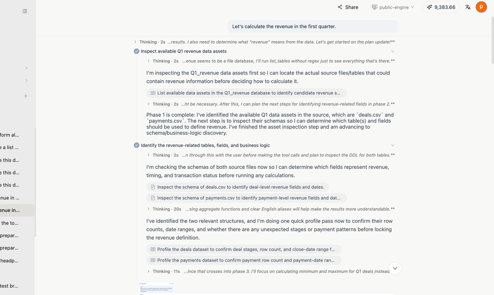
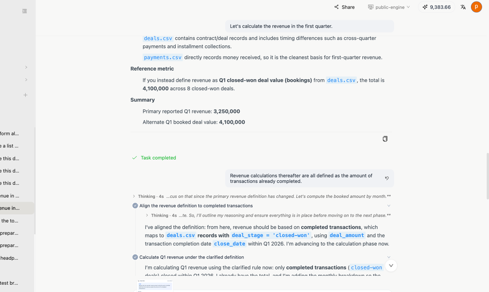
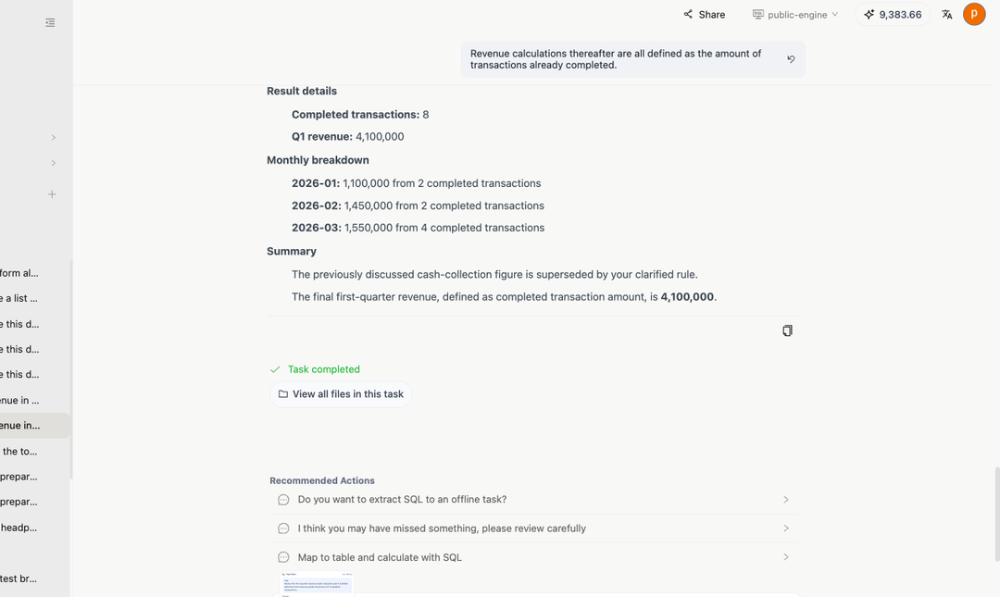
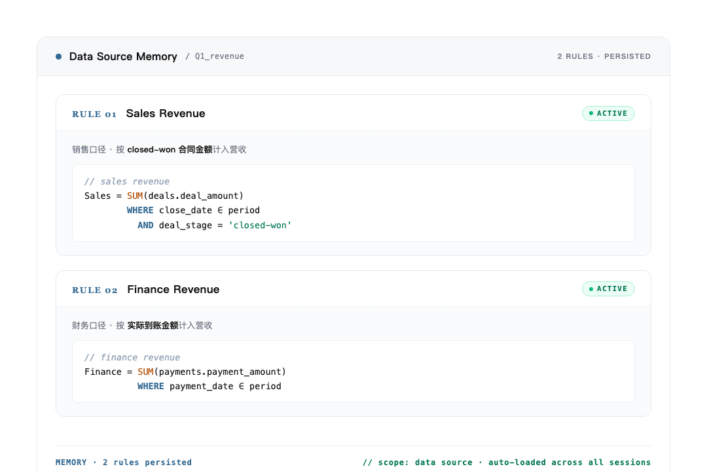
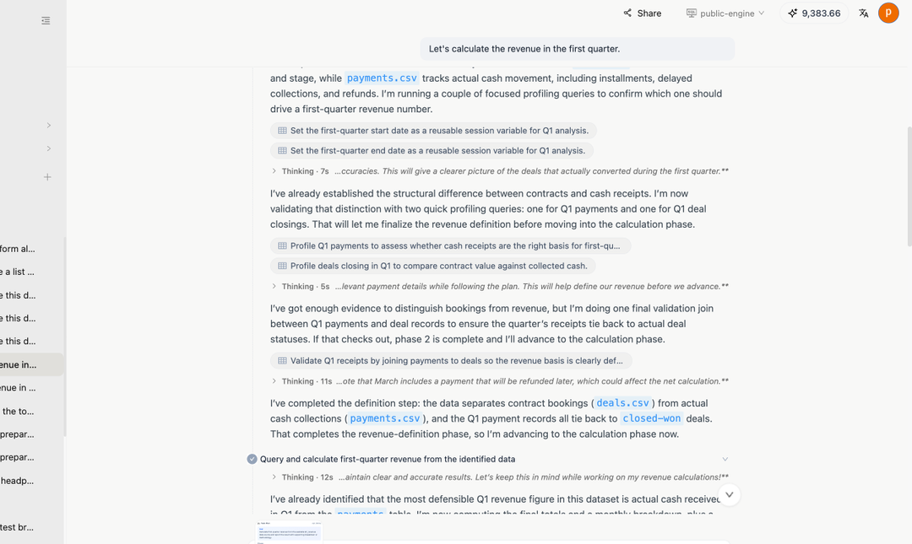
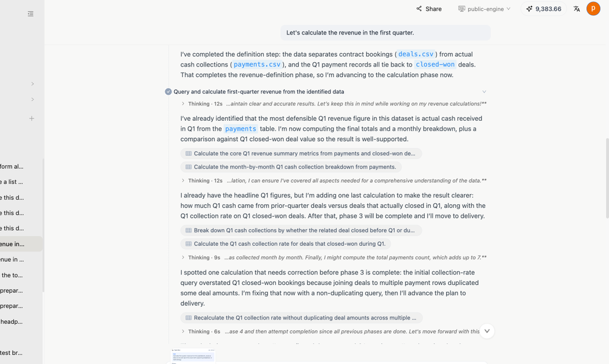
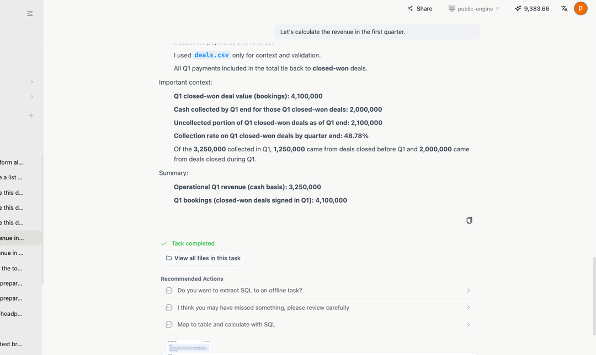

# 教一次口径，下次自己就记得：8:23 跑成 2:48 的真实案例

用 AI Agent 做数据分析，最累的从来不是分析本身——是每次都得跟它讲一遍口径。"营收按合同算还是按到账算"、"活跃用户的活跃怎么定义"……讲完这一次，下一次新会话、换个同事来问，它又当没听过。

我们这次给 InfiniSynapse 加了个东西，叫**数据源记忆**：你跟 Agent 讲过一次的业务规则，自动绑在数据源上。下次任何人在这个数据源上提问， Agent 第一次问就自动加载——不用写 recall ，不用重新解释，**就是自动**。

下面这个案例就是这么跑出来的。同一句问题、同一份数据，沉淀前 vs 沉淀后， Agent 的表现差到几乎像换了一个工具。文末附两条任务的原始链接，可以点进去自己一步步看。


*真实案例 · 任务 A 沉淀前 · 任务 B 沉淀后*

---

## 先把数字摆出来


*四项硬指标，沉淀前 vs 沉淀后*

不是 Agent 突然变聪明了——是给它换了一种喂上下文的方式：业务定义不再写在每次的 prompt 里，而是绑在数据源上、每次 plan 阶段自动注入。

---

## 背景：销售和财务口径，Q1 差了 85 万

数据特别典型，一个 SaaS 公司常见的场景，两张表：

- `deals.csv` ——销售侧的合同表，关键字段 `deal_amount` / `close_date` / `deal_stage`
- `payments.csv` ——财务侧的回款表，关键字段 `payment_amount` / `payment_date`

业务上这是同一笔生意的两个面：

- **销售口径**： `SUM(deals.deal_amount) WHERE deal_stage = 'closed-won' AND close_date ∈ period` ——合同签了就算
- **财务口径**： `SUM(payments.payment_amount) WHERE payment_date ∈ period` ——钱到账才算

Q1 跑出来：销售口径 410 万、财务口径 325 万、**中间差 85 万**。两个数字都对，一个看签单速度、一个看回款健康度，本来就应该并列摆出来。

> [!important] 难的不是 SQL ，难的是「哪种口径」
> 这种"同义异口径"的指标企业里到处都是：营收、活跃用户、订单完成、库存可用。每一对都长得像、每一对都不能混。让 Agent 自己记住"哪个数据源上该用哪个口径"，比让它写一段 SQL 难多了。

---

## 沉淀前：Agent 从零摸了一遍，还得手动纠口径，8 分 23 秒

先看**任务 A**（链接在文末）。用户问了一句很普通的话：

> *Let's calculate the revenue in the first quarter.*

回车下去， Agent 开始它的"摸底之旅"。前 6 步全是"我先搞清楚这数据源里有啥"：列表名、看 schema 、 profile 字段、检查 `deal_stage` 有哪些枚举值、看 `payment_date` 的时间跨度……


*图 1 ：沉淀前， Agent 必须从零探查 schema*

这种"先把 schema 搞明白再算"的做法本身没错，是 InfiniSynapse 一贯的风格——**宁可慢一点也别瞎算**。问题在于：**每次新会话都得从头摸一遍**。

更扎心的还在后面。摸完底， Agent 默认按 cash basis 算，跑出 325 万。用户一看就不对，必须打断纠正：

> *Revenue calculations thereafter are all defined as the amount of transactions already completed.*


*图 2 ：用户必须手动纠正，告诉 Agent 营收按完成交易金额算*

Agent 接到纠正后重算，最后给出来的结果：


*图 3 ：单一数字 410 万，那个本该并列的 325 万被丢了*

**整轮 8 分 23 秒 · 12 步 · 1 次纠正 · 输出就一个数字**——本该并列的财务口径 325 万也没出现。

如果故事到这里就结束了，那就只是又一次"用完即忘"的 AI 体验。下个月做 Q1 复盘的人——可能是另一个同事，也可能就是你自己——会原原本本再走一遍这 8 分 23 秒。

---

## 中间发生了什么：Agent 把这次的口径自动记下来了

任务 A 结束的那一瞬间， InfiniSynapse 在背后做了一件大多数 AI 工具不会做的事——**把这次对话里和用户对齐过的两套口径，自动存进了这个数据源的记忆里**。

你不用做任何事——不用打开面板、不用配置、不用手动写规则。系统自己识别出"这次对话产生了新的业务定义"，把它结构化、绑到数据源上。每条规则的形态特别简单，一段 SQL 语义定义 + 一个 `ACTIVE` 状态：

```text
// sales revenue
Sales   = SUM(deals.deal_amount)
          WHERE close_date ∈ period
            AND deal_stage = 'closed-won'                  ACTIVE

// finance revenue
Finance = SUM(payments.payment_amount)
          WHERE payment_date ∈ period                      ACTIVE
```


*图 4 ：`MEMORY · 2 rules persisted · scope: data source · auto-loaded across all sessions` ——全程零手动配置*

这一步看着不起眼，其实是整个功能里最关键的设计——

> [!important] 它存的不是对话，也不是答案
> **不是对话**：聊天记录式记忆过去两年试过无数遍，结论是 Agent 没本事从一堆自然语言里准确抽出"当时我们到底定了什么口径"。
> **不是答案**：把"Q1 营收 = 410 万"存进去，下个月数据更新这个数字就过期了。
> **是算法 + 业务定义**：两条规则结构化、可执行、和数据源绑定。下次任何人在这个数据源上问任何"营收"相关的问题， Agent 在 plan 阶段就自动加载——不用 prompt 里写 recall ，不用给上下文。

差异就在这里——**聊天历史绑的是用户和会话，数据源记忆绑的是数据本身**。

---

## 沉淀后：同一句话， Agent 自动并列双口径，还主动做了交叉校验，2 分 48 秒

切到一个全新会话，输入**和任务 A 一字不差**的同一句话：

> *Let's calculate the revenue in the first quarter.*

打开**任务 B**（链接在文末），可以看到 Agent 这次完全不一样了——它**没去** list 表、**没去** check 字段枚举，直接进入算数：**两套规则被同时加载，并行计算**。


*图 5 ：第一步就是"按销售口径 profile 一遍 / 按财务口径 profile 一遍"，并行*

接下来更有意思—— Agent 主动做了任务 A 完全没做的事：


*图 6 ：Validate Q1 receipts by joining payments to deals · 算回款率 · 跨季归因*

它把 payments 和 deals 做了 JOIN ，**验证 Q1 的回款和合同到底能不能对上**——任务 A 里没出现这一步，因为任务 A 还在纠结"用哪套口径"，根本走不到这种主动校验的层次。

最后的交付一气呵成：


*图 7 ：双口径并列 + 回款率 48.78% + 跨季归因 1.25M/2M*

具体输出：

- **Q1 closed-won deal value (bookings)** ：4,100,000
- **Cash collected by Q1 end** ：2,000,000
- **Uncollected portion** ：2,100,000
- **Collection rate** ：**48.78%**
- **Pre-Q1 carry-over** ：1,250,000 · **In-Q1 collected** ：2,000,000

**整轮 2 分 48 秒 · 15 步 · 0 纠正 · 输出 4 个维度**。

步骤反而多了 3 步——但**多出来的这 3 步全是主动交叉校验**，不是在重复探查 schema 。这点对比挺有信号：**Agent 把省下来的"摸底时间"花在了更有价值的"主动验证"上**。

---

## 对一个真实团队意味着什么

一次沉淀，三个跨度的复利：

- **跨会话**：下次再问 Q1 营收，不用重新讲口径
- **跨用户**：销售、财务、 CEO 在同一个数据源上拿到的口径完全一样，没有"你看的是哪个版本"的扯皮
- **跨时间**：3 个月后数据更新了再问，规则照样生效——永远是最新的数字 + 一致的口径

这件事在传统 BI 里得靠**指标平台 + 指标定义评审 + 上线流程**，周期通常是按周算的。数据源记忆把它压成——**一次 AI 任务跑完，业务口径自己就沉淀了，下次复用零配置**。

「数据源记忆」这五个字真正想表达的就是这个意思：让业务知识在数据源上沉淀、复利，而不是每次都重新讲一遍。

---

## 现在所有人都能用了

数据源记忆现在全量开放，**完全自动、零配置**：每跑完一次 AI 任务，对话里对齐过的业务规则自动沉淀到对应数据源；下次任何人在这个数据源上提问， Agent plan 阶段自动加载。

没用过的朋友，最快的体验方式就是直接从下面两条任务的原始链接进去——每一步工具调用、每一段中间产物、 Agent 的每一次思考，都完整留着可以回看。

---

## 任务回溯 · 原始链接

文中每一张截图、每一段对话、每一个数字，都来自下面这两个任务，点进去就能逐步回看：

**任务 A · 沉淀前**（ 8 分 23 秒 · 12 步 · 1 次纠正 · 输出 1 个数字）

`https://app.infinisynapse.com/tasks?taskId=8908422c-56e6-46cd-88ad-426392986a7a`

**任务 B · 沉淀后**（ 2 分 48 秒 · 15 步 · 0 纠正 · 输出 4 个维度）

`https://app.infinisynapse.com/tasks?taskId=9b1a88eb-d2f3-4c66-ac7e-cf50f248ea55`
