> 本文档由 `InfiniSynapse-介绍.pdf` 转换而来，内容与原版 32 页幻灯片一一对应。图示中的架构要点、代码示例与下载链接均已保留。

---

## 第 1 页 · 封面

**INFINISYNAPSE**  
上海衡数无限科技有限公司 · 2026

*AI Native Data Agent / Data Infra*

# InfiniSynapse 介绍

让懂行业 know how 的专家，结合 Vibe Coding，快速构建可高并发、稳定对外服务的数据应用。

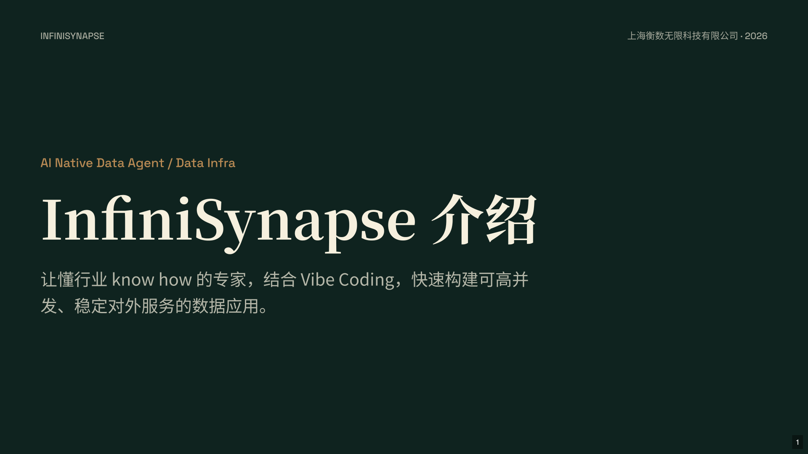


---

## 第 2 页 · `01` INFINISYNAPSE

**POINT 01 — Data Agent 全栈**

- 自研 Agent、分析语言、分布式执行引擎和知识库四大基础层。
- 支持 SaaS、桌面端和纯私有化。

**POINT 02 — Data Infra + Vibe Coding**

- InfiniSynapse 提供数字分析师池。
- 行业专家通过 Vibe Coding 调度分析师，把 know how 做成稳定应用。

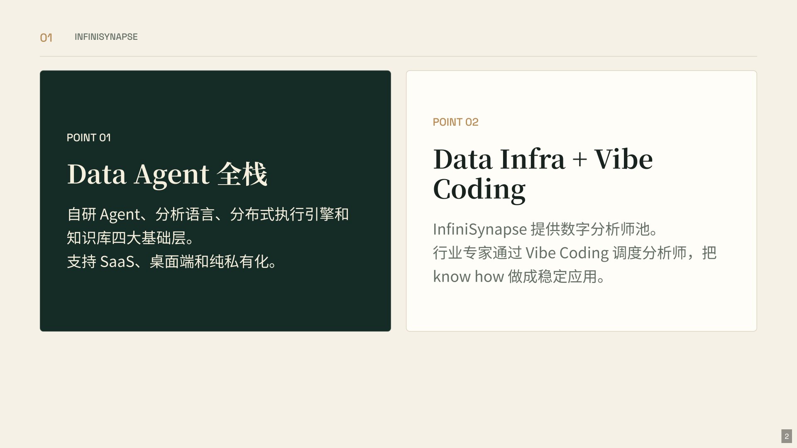


---

## 第 3 页 · `04` PROBLEM · 现状困局

企业业务数据散落在业务系统、CRM、财务、运营、产品、文件台账等多个系统。当前主流路径大致分为几类，但都很难同时解决跨库、跨数据类型、复杂分析和安全边界问题。

**① 数仓 + BI 路线 —— 太慢**

采集 → 清洗 → 建模 → 数仓 → 报表，动辄 3–6 个月，投入数十万至百万。一线想法刚提出，排期已到下季度。且强依赖提前的数据治理、指标建模和报表开发。

**② Text2SQL / ChatBI —— 不准**

真实 200+ 表场景准确率断崖式下降。也不支持跨库、跨数据类型的联合计算，仍需要提前完成数据治理和语义建模。

**③ Julius / Python 沙箱 —— 不适合企业级数据分析**

Python 更适合离线探索和小范围建模，不适合作为 Data Agent 的长期分析运行时。把数据拉进内存后，百万行级即成瓶颈；跨库、状态管理、并发计算和复杂代码逻辑，都会消耗 AI 的注意力。

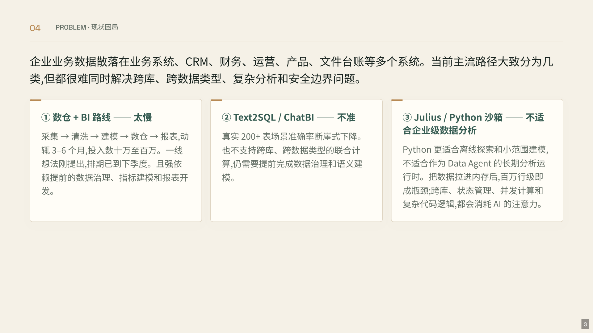


---

## 第 4 页 · `03B` CURRENT · 主流路径一：NL2SQL

### 翻译一句话，丢给单库 SQL

代表玩家：Vanna 2.0、Chat2DB、阿里 Quick BI 智能小Q、各类 NL2SQL / Text2SQL 框架。

> **图示：** 传统 NL2SQL 架构

**流程：**

用户提问（"上季度华东销售额"）→ LLM (Text2SQL)（单次自然语言 → SQL；RAG 检索 DDL · 文档 · 训练样本；YAML 语义层必须人工堆）→ 一条标准 SQL（`SELECT ... FROM ... WHERE ...`，仅特定方言）→ 单一数据库（只查这一个库）→ 一行结果（人工判断对错）

**限制：**

| 限制 | 说明 |
|------|------|
| ① 不支持跨数据源 | 单库内出 SQL，跨库 JOIN 要回到人工导出 + 手工合并。 |
| ② 无状态，无探索 | 单条翻译，无法解决复杂问题，准确率低，大家体感能感受到。 |
| ③ 必须先建语义层 | YAML / 指标体系 / 训练样本全靠人工堆，新表先治理。 |

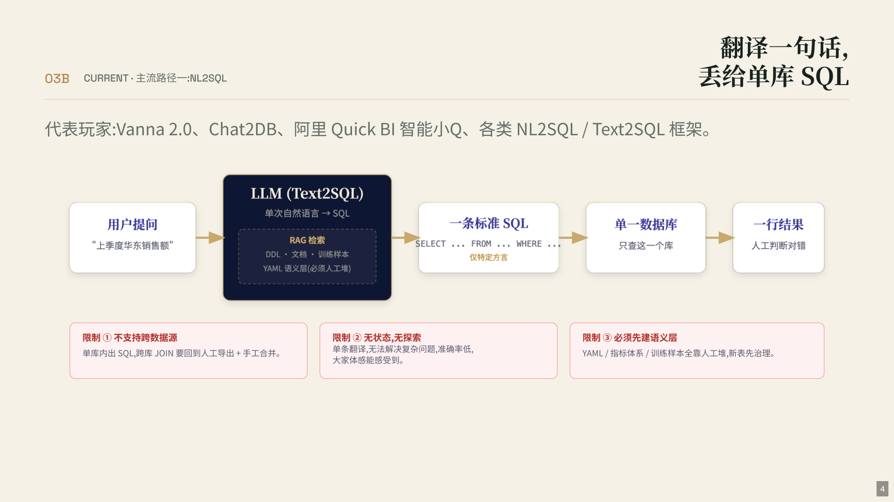


---

## 第 5 页 · `03C` CURRENT · 主流路径二：Python 沙箱

### 把数据拉进内存，让 AI 写 Python

代表玩家：Julius AI、Fabi.ai、Hex Notebook Agent、camelAI、Claude Code。

> **图示：** Julius / Python 沙箱架构

**流程：**

用户提问（复杂分析需求）→ LLM 写 Python（pandas / sklearn / matplotlib）→ Python Kernel · 沙箱（数据全部拉进内存，变成 DataFrame；`df_a` / `df_b` / `merged_*`；变量空间随对话爆炸；RAM 上限 Free 2GB · Enterprise 64GB，百万行级即瓶颈）→ 图表 / 报告（数据已离开原始位置）

**限制：**

| 限制 | 说明 |
|------|------|
| ① AI 写复杂 Python 困难 | 难以分布式；用户追问多了，代码迅速膨胀，容易出错。 |
| ② 内存即上限，跨源有限 | 百万行 OOM，跨库要 `pd.merge` 全部拉到内存。 |
| ③ AI 注意力被代码逻辑稀释 | 变量管理、内存释放、并发、异常 —— 都要 LLM 自己想。 |

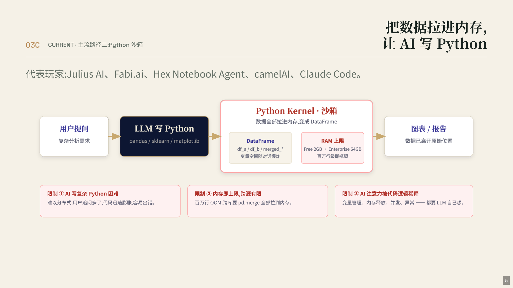


---

## 第 6 页 · `03D` CURRENT · 当前较为先进的实现

### 已经 Agentic，但绑死自家数仓

代表玩家：Databricks Genie Agent Mode、Snowflake Cortex Analyst。已经采用 Agentic Loop，但只能在自家生态内跑。

> **图示：** 数仓 + AI 路线架构

**流程：**

用户提问（业务问题）→ Agent Mode（规划 · 多步迭代 · 假设验证；必读 Semantic Model：YAML / Knowledge Store / 表注释，人工预先填写，新表先治理）→ 多步 SQL 迭代（仅自家方言，查询过程透明可审）→ 特定数仓（Unity Catalog · Snowflake；Excel / Oracle / 老业务库必须先 ETL 进来）

**限制：**

| 限制 | 说明 |
|------|------|
| ① 数据必须先进自家数仓 | 非 UC / 非 Snowflake 的数据先做 ETL，传统业务库需要整体迁移。 |
| ② 必须维护 Semantic Model | YAML / 知识库人工填写，1400 表场景维护成本极高。 |
| ③ 绑死云平台，合规与计费受限 | 数据上云、按计算计费；金融、制造、政企等合规场景采用门槛高。 |

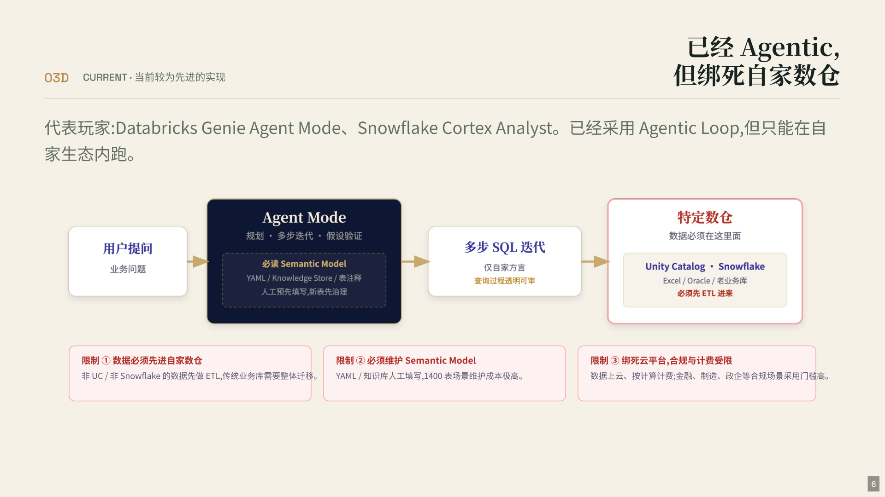


---

## 第 7 页 · CURRENT STATE · 现状小结

*CURRENT STATE · 现状小结*

# 当前现状：效果不好，落地不好

不是模型不够强，而是底层数据架构没有为 Agent 重新设计。  
要么翻译一条 SQL，要么把数据拉进 Python，要么绑死数仓生态。

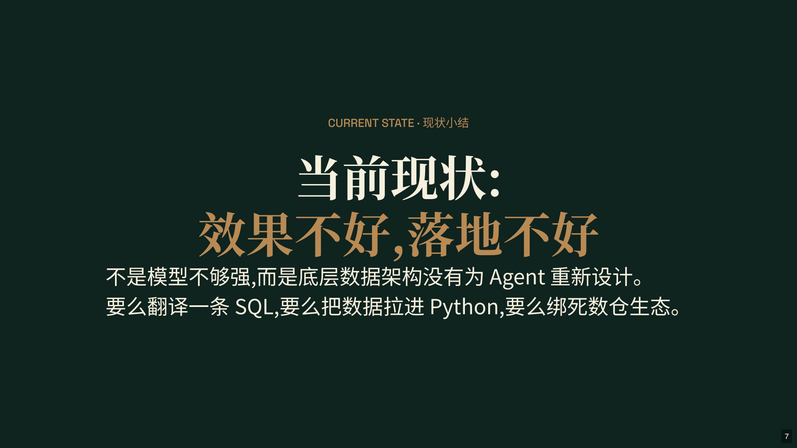


---

## 第 8 页 · `06` Data Infra

### 全球少有自己做数据分析语言和引擎的

> **图示：** InfiniSynapse 四层架构图

**顶层 · Agent**

- 自主规划 → 执行 → 检验 → 修复
- 子 Agent 并行探索，支持数百步深度分析，全程无需人工介入

**语言层 · InfiniSQL**

- 为 AI 而生的新 SQL 语言
- 原生跨源 JOIN · 自动类型转换 · 内置机器学习算子
- 一切皆表：`select` / `train` / `predict` 串成统一分析管道

**知识层 · InfiniRAG**

- 第四代 RAG 引擎
- 全球最好的知识库能力 · 首创库表与知识库绑定设计
- 规则、记忆库、历史分析沉淀为可复用知识资产

**业务口径（中心闭环）**

- 交叉验证 / 自我修复

**引擎层 · 直连多源**

- 数据不动，计算下推
- 支持数据源：MySQL、PostgreSQL、Oracle、ClickHouse、MongoDB、StarRocks、Hive、Excel、OSS

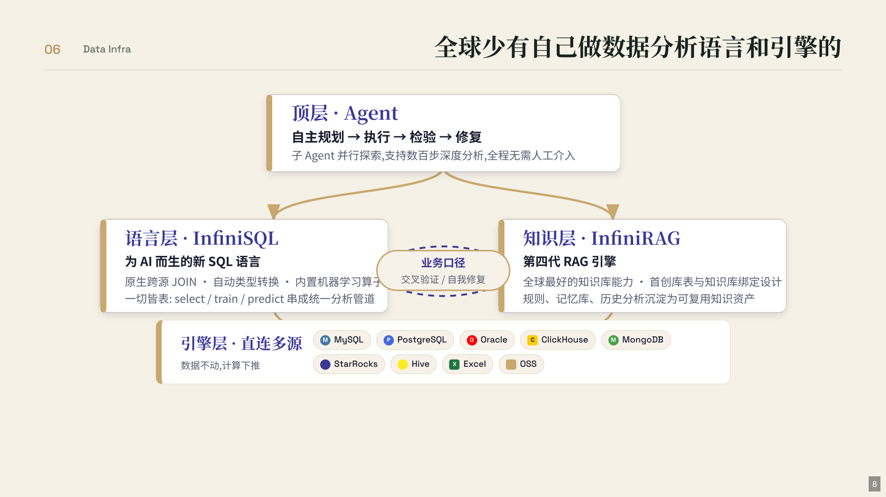


---

## 第 9 页 · `09A` WHY · 完美契合 Agentic

### Agent 和分析语言协作

> **图示：** Agentic 调用 InfiniSQL 并不断产生 session 具名表的示例

**CALL → TABLE → NEXT CALL**

**用户提问：**

> Q1 各地区完成率？为什么上海最低？这些客户是什么行业？

**Agentic Tool Calls（示例）：**

| # | 调用 | 参数 | 结果 |
|---|------|------|------|
| 01 | `infinisql.run` | `!show tables` | 未接入 |
| 02 | `connect pg; load orders` | `jdbc.\`pg.orders\`` | creates table: `orders` |
| 03 | `load excel.\`targets.xlsx\`` | `/uploads/targets.xlsx` | creates table: `targets` |
| 04 | `JOIN orders × targets` | `group by region` | creates: `q1_completion` |
| 05 | `select Shanghai top50` | `from orders` | creates: `shanghai_top50` |
| 06 | `load customers; JOIN` | `with shanghai_top50` | creates: `shanghai_industry` |

**InfiniSQL 中枢：**

- 工具调用：每条语句都是一次可审计动作
- `as` 表名即状态，可继续

**同一个 Session 里的具名表（PERSISTENT STATE）：**

- `orders` — 业务库订单
- `targets` — Excel 目标
- `q1_completion` — 跨源 JOIN 后的完成率
- `shanghai_top50` — 基于 orders 继续下钻
- `shanghai_industry` — 动态 load customers 后 JOIN

> Agent 动态构建了一个虚拟临时数仓；前面每张具名表，都变成下一轮深入分析的可复用资产。

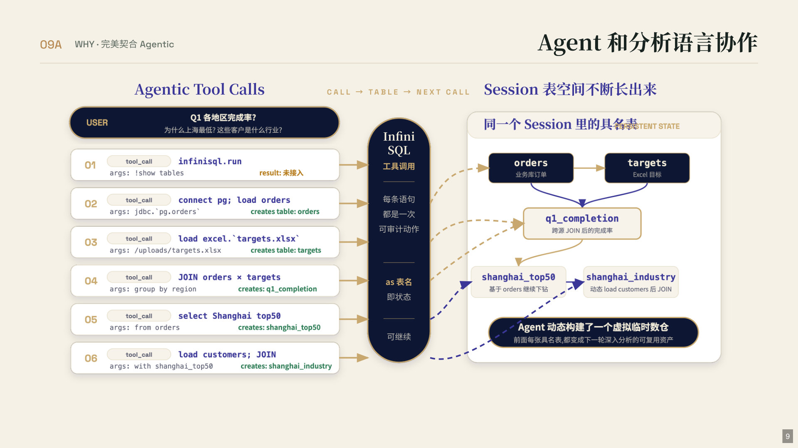


---

## 第 10 页 · Data Agent 的挑战

# Data Agent 的挑战

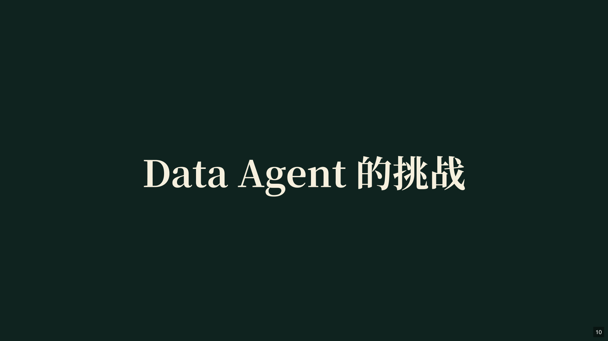


---

## 第 11 页 · `04B` CATEGORY · Data Agent 三大挑战

### 01 · 百万级资产搜索失效

同一个"收入"可能叫 ARR、确认收入、净收入、`rev_recognition_fact`。第一能力不是生成 SQL，而是找到真正相关的数据资产。

`tables` · `dashboards` · `docs` · `Excel` · `API` · `history`

### 02 · Source of Truth 难判断

旧文档、认证指标、看板、Notebook 可能同时存在。最危险的错误是代码没报错、数字也算出来了，但口径错了。

- 旧文档
- 看板 A
- **认证口径**
- Notebook

### 03 · 没有确定性判题器

Data Agent 没有 unit test 告诉它答案是否正确。可靠性必须来自系统设计：证据链、口径链、中间结果和不可回答边界。

> 财务季度？净收入？华东口径？数据是否完整？是否可回答？

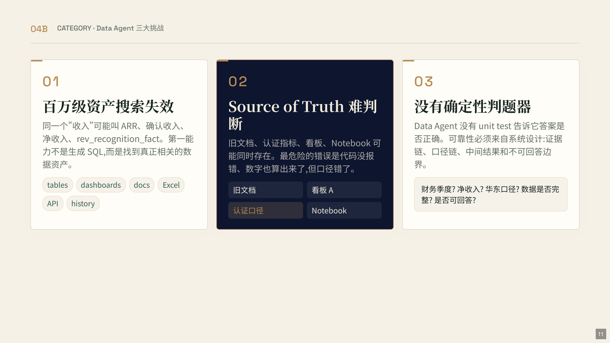


---

## 第 12 页 · `04C` REQUIREMENT · 完整 Data Agent 必须具备

### 它的流程和 Code Agent 完全不一样

| 能力 | 说明 |
|------|------|
| 找资产 | 在大表空间和多文档里定位候选资产。 |
| 判口径 | 识别认证指标、业务规则和历史经验。 |
| 跑事实 | 跨源执行、计算下推、保留事实表。 |
| 留状态 | 每一步变成下一步可复用的中间资产。 |
| 可复核 | 报告、图表、SQL 轨迹和证据链可审计。 |

这就是为什么 Data Agent 不能靠"LLM + SQL 客户端"完成，而必须重做运行时、语言、知识和执行引擎。

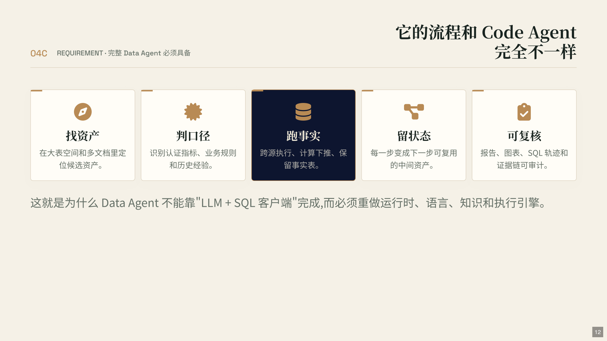


---

## 第 13 页 · `04D` SOLUTION · InfiniSynapse 的解法

### 三大问题，用完整 Harness 一次解决

| PROBLEM | HARNESS ANSWER | PROOF |
|---------|----------------|-------|
| **01 搜索失效** — 大表空间、大文档空间、大历史分析空间里，关键词搜索和单次 RAG 都不够。 | **Agent Teams + 数据源知识绑定** — 子 Agent 并发探索 schema、样本、关联路径和历史经验，把搜索拆成可并行、可核对的任务。 | **1400+ 表接入即问** — 不先等语义层建完，系统先探索，再在使用中沉淀业务知识。 |
| **02 口径混乱** — 口径、指标、表含义和历史分析经验分散，且会随着业务变化。 | **InfiniRAG 语义记忆层** — 把库表元信息、业务规则、历史分析、用户偏好绑定成可复用上下文，每次分析继续校验。 | **知识越用越厚** — 不是聊天记忆，而是结构化分析经验和数据资产上下文。 |
| **03 缺少验证** — 没有像测试一样的 oracle，所以过程必须天然可观测、可重放。 | **InfiniSQL + Task View** — 每条语句是一次工具调用，每个中间结果是一张具名表，报告和图表都能追溯到执行链。 | **复杂链路可复核** — 取数、跨源 JOIN、ML 训练、预测、报告输出在同一条链路里完成。 |

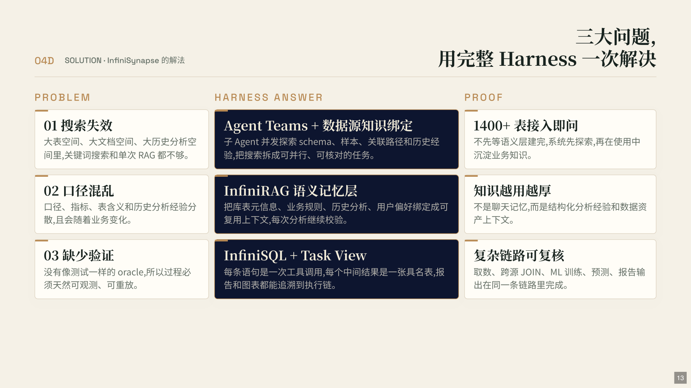


---

## 第 14 页 · Data Infra

# 企业数据使用方式不同，我们将全套 harness 沉淀为 Data Infra


---

## 第 15 页 · `06` DATA INFRA + DIGITAL ANALYSTS

### 海量数字分析师，交给行业专家调度

**INDUSTRY EXPERT · 行业专家**

- Know How、快速 Vibe 交互界面和业务逻辑。
- 工具：Codex · Cursor · Claude Code

**数字分析师池**

| # | 角色 | 职责 |
|---|------|------|
| 01 | 数据接入分析师 | 连接数据库、API、文件和业务系统。 |
| 02 | SQL 分析师 | 生成查询、拆解指标、追溯结果。 |
| 03 | 知识研究员 | 检索文档、整理证据、保留引用。 |
| 04 | 图表分析师 | 选择图形、解释趋势、输出看板。 |
| 05 | 报告撰写分析师 | 组织结构、生成结论、导出文档。 |
| 06 | 质检校验分析师 | 校验口径、来源、异常和一致性。 |

**InfiniSynapse Data Infra** — 支撑数字分析师稳定运行的全套底座

- Agent Runtime
- InfiniSQL
- 分布式执行引擎
- InfiniRAG

**DELIVERABLES · 泛数据分析应用**

面向客户交付高并发、稳定运行、可追溯的应用能力。

- 微信小程序
- 手机应用
- PC 应用
- Web 应用

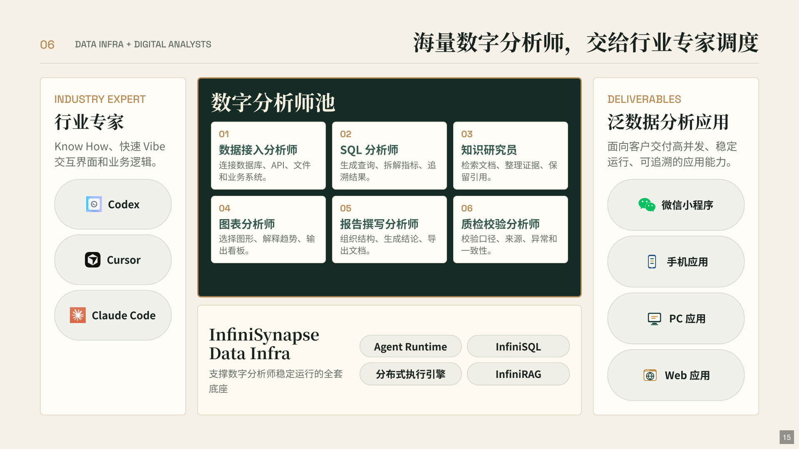


---

## 第 16 页 · `06A` DEPLOYMENT · 模型对应分析师级别

### 我们提供不同级别的分析师

| 级别 | 名称 | 模型 | 硬件 | 适用规模 |
|------|------|------|------|----------|
| L1 | 实习生分析师 | Qwen3.6-27B / V4 Flash | 1 台 8 卡 L40 | 5–30 人试点 |
| L2 | 初级分析师 | DeepSeek V3.1 / V3.2 | 1 台 8 卡 H100/H200 | 30–100 人主力 |
| L3 | 中级分析师 | DeepSeek V4 Pro | 8 卡 B200 / H200 | 100+ 人大型企业 |
| L4 | 高级分析师 | GPT-5.5 / Claude Opus 4.7 | API 混合云增强 | 顶级分析需求 |

**KEY JUDGMENT — 主力档建议从 L2 起步**

L1 覆盖日常取数；报告撰写、复杂归因、多步推理、机器学习建模，建议至少上 L2。

**WHY IT WORKS — 架构把模型下限打高**

InfiniSQL + InfiniRAG + Agent 编排收住复杂度；模型档位决定的是分析深度上限。

> 来源：《InfiniSynapse 私有部署模型选型建议》；闭源模型仅作为混合云增强档，不纳入纯私有化主力配置。

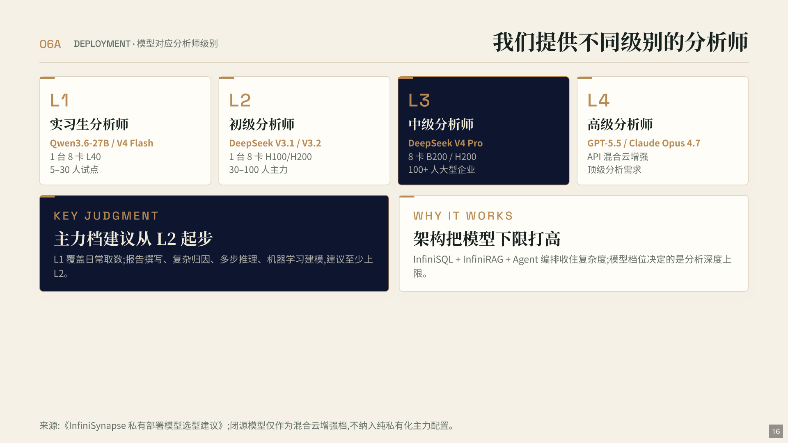


---

## 第 17 页 · SaaS 应用案例

# 基于 InfiniSynapse 的 SaaS 应用案例

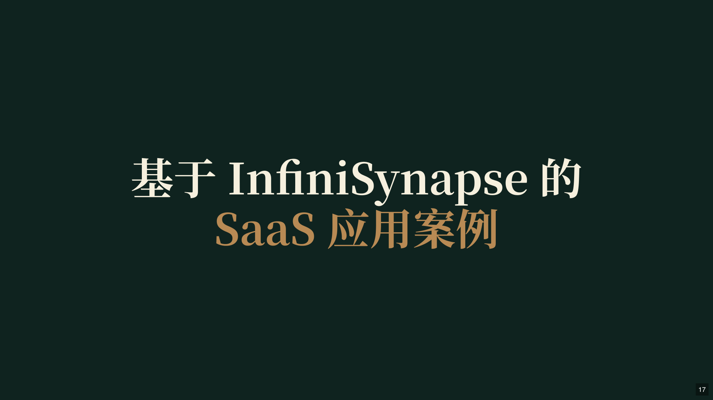


---

## 第 18 页 · `07` APPLICATIONS

### 一天完成一个支持高并发且稳定的面向千万家庭的高考小程序

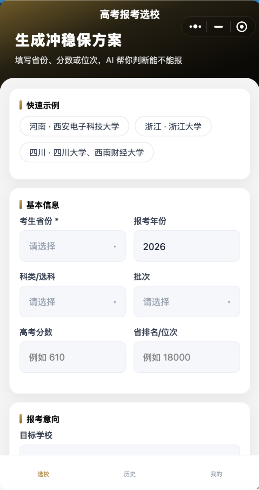

**面向真实家庭决策**

输入省份、分数、位次和偏好，生成冲稳保志愿方案，直接服务高考报考场景。

**每个用户都有专属分析师**

每个用户将会被一个拥有历史高考数据的实习生 / 初级数据分析师服务。

**一天完成产品闭环**

Vibe Coding 负责小程序交互和业务流程，InfiniSynapse 承接数据、分析和推荐链路。

**支持高并发稳定服务**

底层复用任务调度、查询执行、缓存、恢复和审计能力，面向集中访问高峰稳定运行。

**可对外交付**

可持续迭代、可连接数据源、可承载真实用户请求，具备正式对外服务的应用形态。

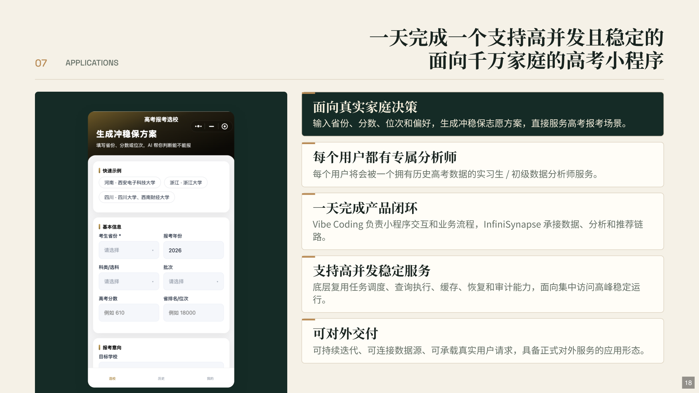


---

## 第 19 页 · `08` REPORT WRITER · PRODUCT

### 报告快写：专注于写报告的产品

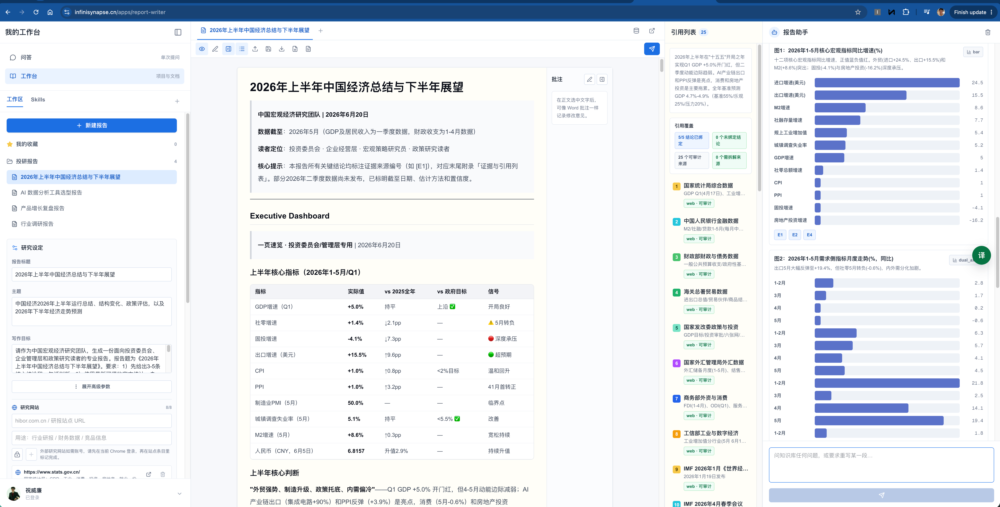  
*写作工作台：设定主题、材料和目录结构*

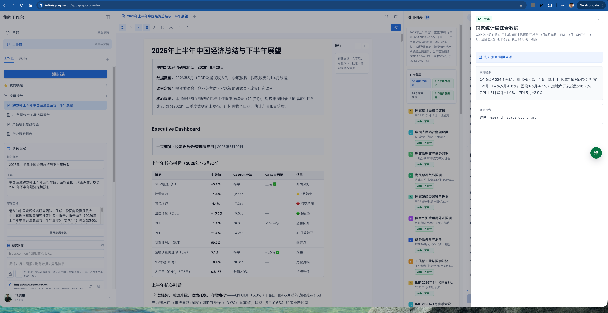  
*来源追溯：材料、引用和证据绑定*

报告快写把资料、数据、引用和行业判断组织成正式研究报告。

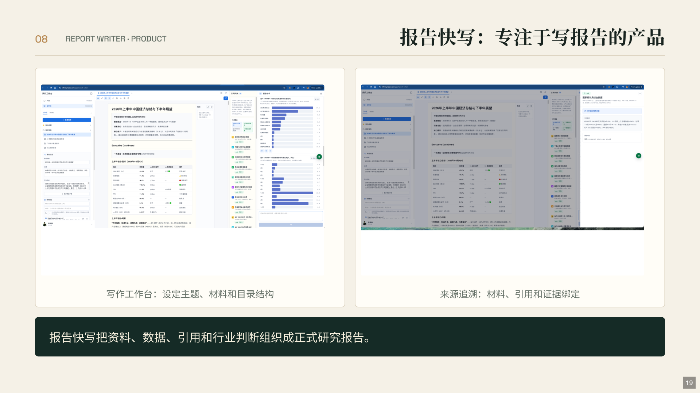


---

## 第 20 页 · `09` REPORT WRITER · WORD OUTPUT

### 生成可交付的正式 Word 报告

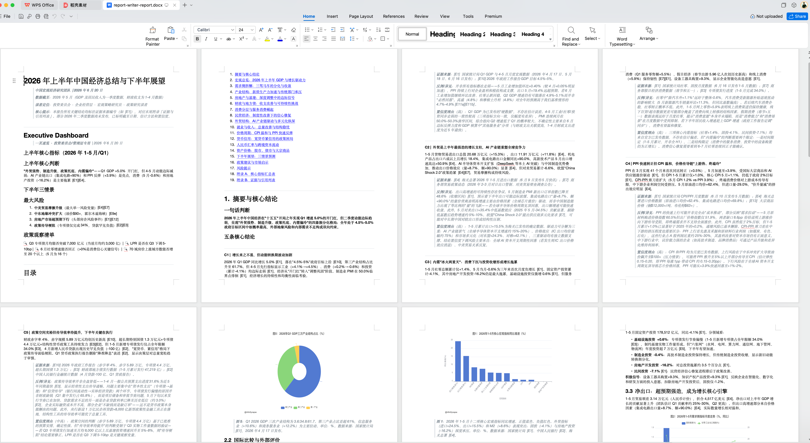  
*Word 报告总览：章节、图表和结论完整呈现*

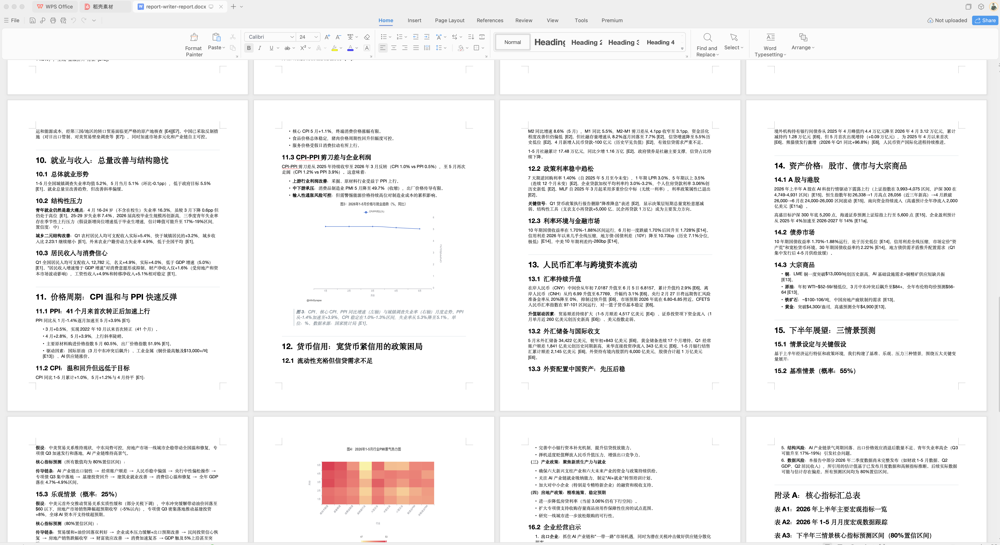  
*Word 报告细节：引用、批注、附录和可复核内容*

从资料整理到正文生成、来源绑定和 Word 导出，形成稳定的报告生产链路。

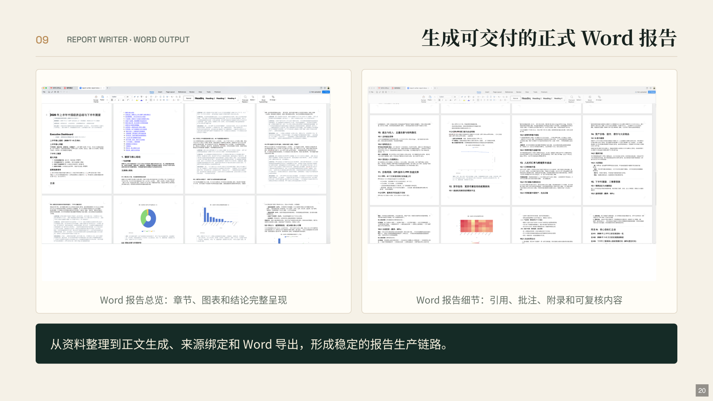


---

## 第 21 页 · `10` REPORT WRITER · SAMPLE DOCX

### 两份研究报告样例下载

**CHINA ECONOMY — 中国经济研究报告 DOCX**

面向宏观经济研究场景，展示资料组织、分析结论和正式 Word 输出。

[下载中国经济研究报告 DOCX](https://infinisynapse.oss-cn-shanghai.aliyuncs.com/datas/internal/ossbrowser/report-writer-cases/2026-0622/report-writer-china-economy.docx)

**CODE AGENT MARKET — Code Agent 研究报告 DOCX**

面向技术市场研究场景，展示资料追溯、结构化分析和可交付报告。

[下载 Code Agent 研究报告 DOCX](https://infinisynapse.oss-cn-shanghai.aliyuncs.com/datas/internal/ossbrowser/report-writer-cases/2026-0622/report-writer-code-agent-market.docx)

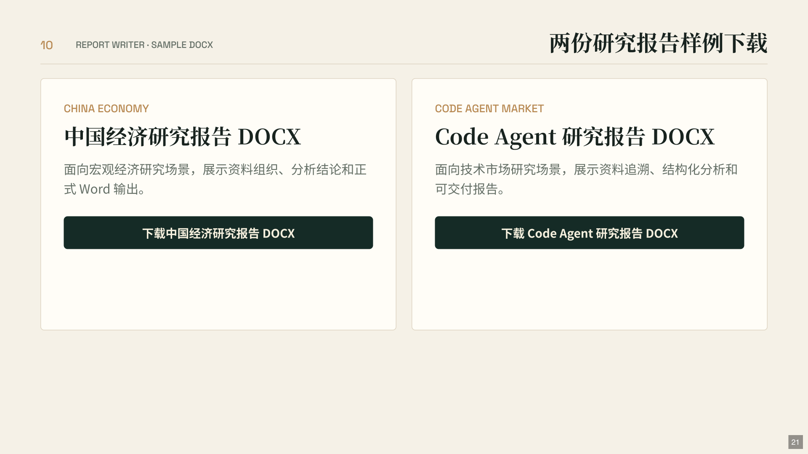


---

## 第 22 页 · 私有化部署应用案例

# 基于 InfiniSynapse 的私有化部署应用案例

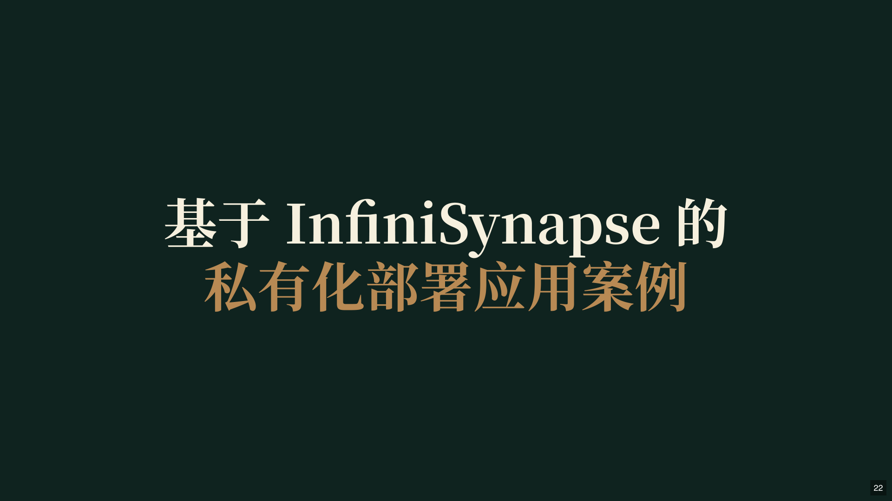


---

## 第 23 页 · `09C` CASE · CSDN

### 把数据放进高速分析底座，让运营和业务直接使用

> **图示：** CSDN 业务数据接入 InfiniSynapse 架构图

**架构：**

CSDN 业务数据（用户 · 内容 · 流量 · 会员 · 活动 · 转化 · 商业化；多源业务明细，持续导入）→ ClickHouse（高配单机；数据预聚合 / 明细留存；确保查询足够快；面向高频运营分析）→ InfiniSynapse（直接对接 ClickHouse；自然语言问数；自动生成分析报告；动态报表 / 追问 / 复用；数据能力产品化）→ 运营（活动 / 留存）· 业务（增长 / 转化）

**结果：** 运营和业务不再等报表排期，直接用数据驱动业务与运营动作

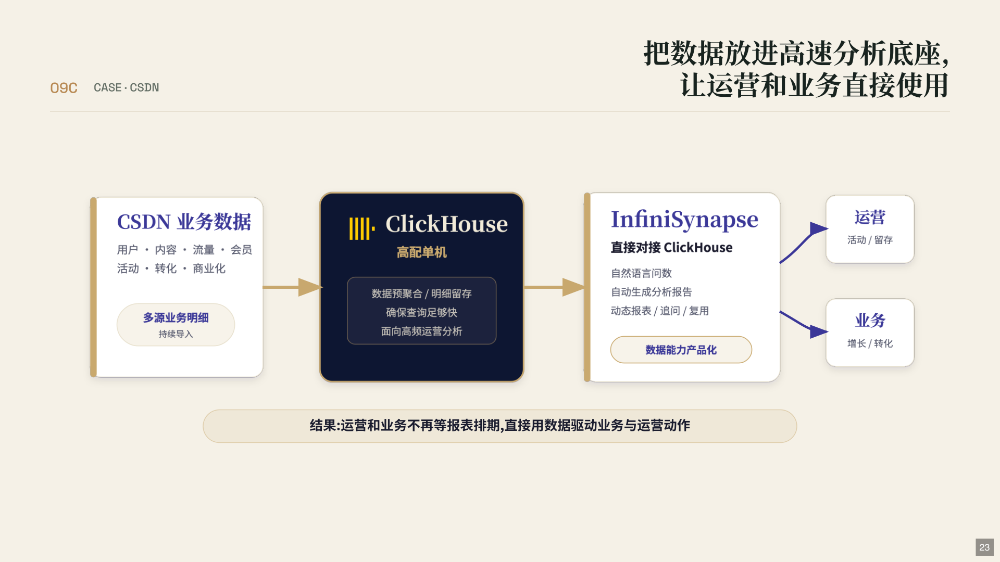


---

## 第 24 页 · `09D` CASE · 企名片

### 直接对接分布式 TiDB，把数据变成 App 能力

> **图示：** 企名片 TiDB 对接 InfiniSynapse 应用架构图

**架构：**

企名片数据底座（分布式 TiDB 数据库；企业主体 / 股权 / 法人；工商变更 / 投融资 / 关系）→ InfiniSynapse（直连 TiDB；理解自然语言问题；生成可审计查询；结果回到业务应用）→ 企名片 App（用户直接问"XX 企业法人是谁?"；直接返回答案，无需跳出产品）→ 用户价值（少搜索 · 少筛选 · 少跳转 · 直接得到答案）

**结果：** 数据就是应用，数据就是价值 —— 数据能力直接成为用户可感知的产品能力

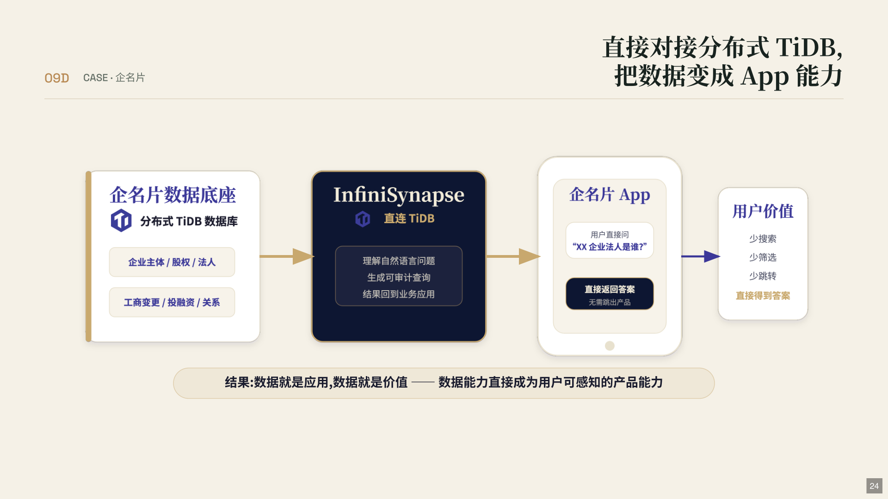


---

## 第 25 页 · `09E` CASE · 海关

### 1400 张表，无治理，接入即问

> **图示：** 海关 1400 张表无治理接入即问示意图

**1400+ 张表** — 海关生产业务库 · 未建语义层 → **InfiniSynapse**（接入即问）→ **从能用到用好**

| # | 阶段 | 说明 |
|---|------|------|
| 01 | 无治理先取数 | 直连业务库 |
| 02 | 用得好 · 沉淀知识库 | 使用过程把养料一点点喂进知识库 |

知识沉淀包括：过往分析文档 · Schema · 规则 · 业务口径 · 用户偏好 · …

**直连海关生产库，1400 张表无治理，接入即可提问取数**

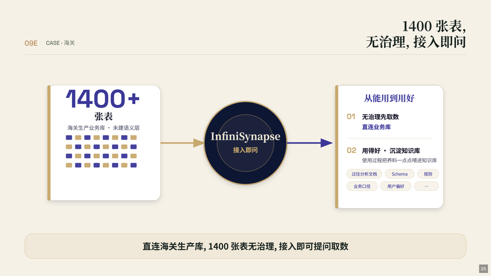


---

## 第 26 页 · `09F` CASE · 海关 · 机器学习

### 风控特征发现，Agent 端到端建模

海关风控场景正在评估 InfiniSynapse 做特征发现。内部案例暂不便公开展示，以下用公开 UCI 数据集演示同等机器学习能力 —— Agent 自主完成加载、特征工程、训练与评估。

| 指标 | 数值 |
|------|------|
| **92 秒** | 从提问到出评分卡全流程 |
| **0.7712** | AUC —— 超 XGBoost 基线 0.7611 |
| **100%** | 可解释 —— 评分卡规则可追溯 |

可类比海关场景：**风险特征发现、异常行为识别、通关信用评分**

```sql
-- InfiniSQL ScoreCard SOTA Challenge - UCI Credit Card Default
-- test AUC = 0.7712 / KS = 0.4288  -- 超越 XGBoost 文献 0.7611

set DATASET_PATH="/data/uci_credit_card_default.csv"
    options type="defaultParam";
set MODEL_PATH="/tmp/infinisql/models/fintech/uci_scorecard_sota"
    options type="defaultParam";
set PRED_PATH="/tmp/infinisql/predictions/uci_scorecard_sota"
    options type="defaultParam";

load csv.`${DATASET_PATH}` where header="true" and inferSchema="true"
as credit_raw_0;

-- credit_typed 来自脚本 Part 1 的 24 个字段显式 cast
-- 领域特征工程: 6 个月逾期模式 + 利用率 + 还款率 + 余额增长
select *,
    greatest(PAY_0, PAY_2, PAY_3, PAY_4, PAY_5, PAY_6) as pay_max,
    (case when PAY_0 >= 1 then 1 else 0 end +
     case when PAY_2 >= 1 then 1 else 0 end +
     case when PAY_3 >= 1 then 1 else 0 end +
     case when PAY_4 >= 1 then 1 else 0 end +
     case when PAY_5 >= 1 then 1 else 0 end +
     case when PAY_6 >= 1 then 1 else 0 end) as pay_delinq_count,
    case when LIMIT_BAL > 0 then
        ((BILL_AMT1 + BILL_AMT2 + BILL_AMT3 + BILL_AMT4 + BILL_AMT5 + BILL_AMT6) / 6.0) / LIMIT_BAL
    else 0.0 end as util_avg,
    case when BILL_AMT2 > 0 then PAY_AMT1 / BILL_AMT2 else 1.0 end as repay_ratio_m1,
    case when BILL_AMT6 > 100 then BILL_AMT1 / BILL_AMT6 else 1.0 end as bill_growth
from credit_typed
as credit_feat;

select *, rand(42) as _split_key from credit_feat as credit_keyed;
select ID, LIMIT_BAL, PAY_0, PAY_2, PAY_3, PAY_4, PAY_AMT1,
       pay_max, pay_delinq_count, pay_delinq_sum, recent_delinq, pay_max_recent3,
       util_avg, util_m1, util_max, repay_ratio, repay_ratio_m1, bill_growth, pay_avg,
       label
from credit_keyed where _split_key <= 0.70 as sota_train;
select ID, LIMIT_BAL, PAY_0, PAY_2, PAY_3, PAY_4, PAY_AMT1,
       pay_max, pay_delinq_count, pay_delinq_sum, recent_delinq, pay_max_recent3,
       util_avg, util_m1, util_max, repay_ratio, repay_ratio_m1, bill_growth, pay_avg,
       label
from credit_keyed where _split_key > 0.85 as sota_test;

run sota_train as Binning.`${MODEL_PATH}` where
label="label" and method="EF" and numBucket="20" and goodValue="0"
and selectedFeatures="LIMIT_BAL,PAY_0,PAY_2,PAY_3,PAY_4,PAY_AMT1,pay_max,pay_delinq_count,pay_delinq_sum,recent_delinq,pay_max_recent3,util_avg,util_m1,util_max,repay_ratio,repay_ratio_m1,bill_growth,pay_avg"
as binningInfoTable;

run sota_train as ScoreCard.`${MODEL_PATH}` where
binningTable="binningInfoTable"
and selectedFeatures="LIMIT_BAL,PAY_0,PAY_2,PAY_3,PAY_4,PAY_AMT1,pay_max,pay_delinq_count,pay_delinq_sum,recent_delinq,pay_max_recent3,util_avg,util_m1,util_max,repay_ratio,repay_ratio_m1,bill_growth,pay_avg"
and scaledValue="600" and odds="50" and pdo="20" and goodValue="0"
as scorecard_train_scored;

predict sota_test as ScoreCard.`${MODEL_PATH}` where
binningTable="binningInfoTable"
and selectedFeatures="LIMIT_BAL,PAY_0,PAY_2,PAY_3,PAY_4,PAY_AMT1,pay_max,pay_delinq_count,pay_delinq_sum,recent_delinq,pay_max_recent3,util_avg,util_m1,util_max,repay_ratio,repay_ratio_m1,bill_growth,pay_avg"
as scorecard_test_scored;

run scorecard_test_scored as ScoreCard.`${MODEL_PATH}` where
action="evaluate" and labelCol="label" and scoreCol="predictedScore" and goodValue="0"
as metrics_test;

select * from metrics_test as output;
```

> 数据集：UCI Default of Credit Card Clients · 学术基线 Yeh & Lien, 2009

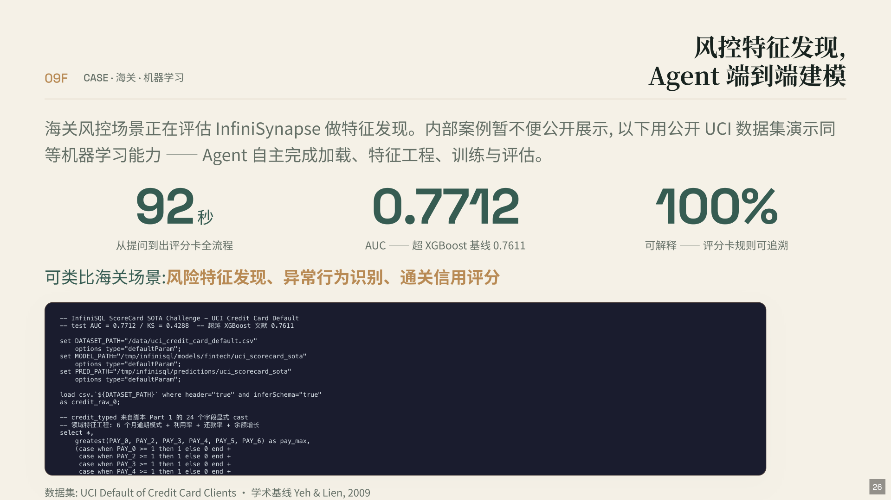


---

## 第 27 页 · `11C` 产品形态

底层 Harness 一致：同一套 Agent / InfiniSQL / InfiniRAG / 跨源引擎，覆盖 SaaS 获客、桌面端使用、私有化大单和 Agent 生态分发。

| # | 形态 | 说明 |
|---|------|------|
| 01 | **SaaS** | 最快 POC 入口。顾问、创业团队和中小企业直接打开，先把价值链跑通。 |
| 02 | **桌面端** | 贴近真实办公环境和本地文件边界。Excel、CSV、数据库与文档可以在本机闭环。 |
| 03 | **私有化部署** | 金融、政务、制造和央国企的主战场。数据、模型、推理和报告全部留在企业域内。 |
| 04 | **Command Tools** | 40+ tools 覆盖企业办公 Office、音视频、微信飞书，以及其他 Agent 对接 |

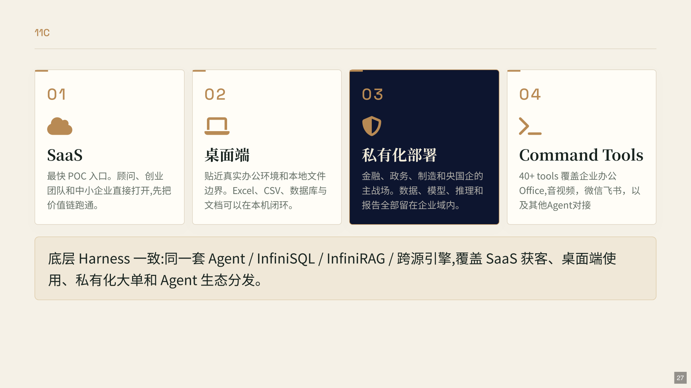


---

## 第 28 页 · `13` CO-BUILD

### 适合三类客户和伙伴

**企业和组织**

把数据分析放进真实业务流程，而不是只多一个聊天入口。

**行业专家**

把投研、咨询、运营、政策、教育或数据服务 know how 做成产品。

**合作伙伴**

基于 Data Infra 共建垂直应用、行业模板和私有化方案。

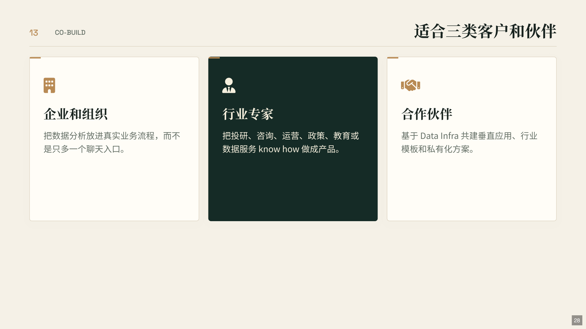


---

## 第 29 页 · `12A` TEAM · 祝海林

**祝海林 · William Zhu**

联合创始人 · 长期深耕 Data Infrastructure 与 AI 的交叉领域。

- **InfiniSQL** 创造者 —— 原开源版本获得数千 Star
- **byzer-llm** 作者 —— 完整的大模型中间件，支持大模型分布式训练、推理、构建应用
- **第四代 RAG auto-coder.RAG** 作者
- **auto-coder.chat** 作者 —— 全球最早的 CLI 形态 Code Agent 之一
- **WinClaw** 作者 —— WinClaw 上线即过万下载，目前累计下载 20 万+
- **前某数据独角兽技术合伙人** —— Data 与 AI 融合领域
- **前粤港澳大湾区 Code Agent 研究员与咨询顾问**
- **GitCode 2024 年度开源人物** · 2023 上海浦东人工智能创新大赛**一等奖**
- 在 大数据 / AI 领域有连续 10 年以上深度积累

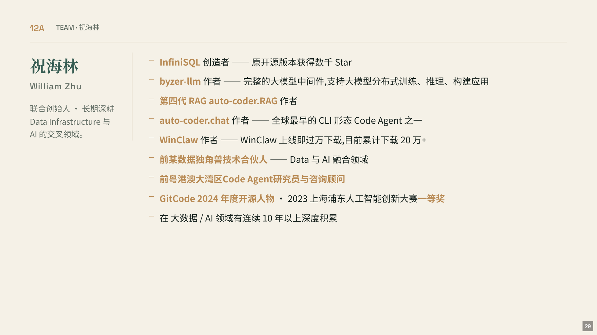


---

## 第 30 页 · `12B` TEAM · 蒋涛

**蒋涛 · Tao Jiang**

联合创始人 · CSDN 创始人，负责生态战略、渠道资源与商业化放大。

- **CSDN 创始人 / 董事长** —— 中国最大开发者社区的重要建设者
- 深耕开发者生态 **20+ 年**，持续连接开发者、技术企业、ISV 与产业客户
- 为 InfiniSynapse 带来**开发者流量、企业渠道、OEM 生态**与行业合作入口
- 帮助产品从"可用的数据分析工具"走向**开发者与企业数据入口**
- 在 Data Agent 商业化早期，承担**战略定位、分发网络、生态合作**三类关键杠杆
- 技术团队负责把 Harness 做深，蒋涛负责把能力带进更大的开发者与企业市场

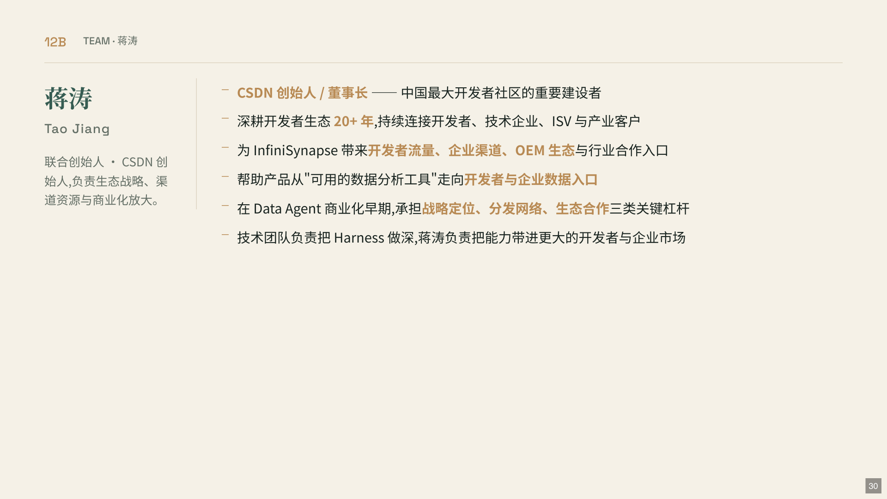


---

## 第 31 页 · `12C` TEAM · 赵伟楠

**赵伟楠 · Weinan Zhao**

联合创始人 · 产品与增长负责人，推动 InfiniSynapse 多形态产品化落地。

- **前多家 SaaS 产品负责人**，具备从需求、产品、增长到交付的完整经验
- **Infini Agent 核心开发者**，统筹 SaaS / 桌面端 / 企业私有化三端协同
- 6 个月内推动 **SaaS + 桌面 + 私有化 + 国际版**全平台交付

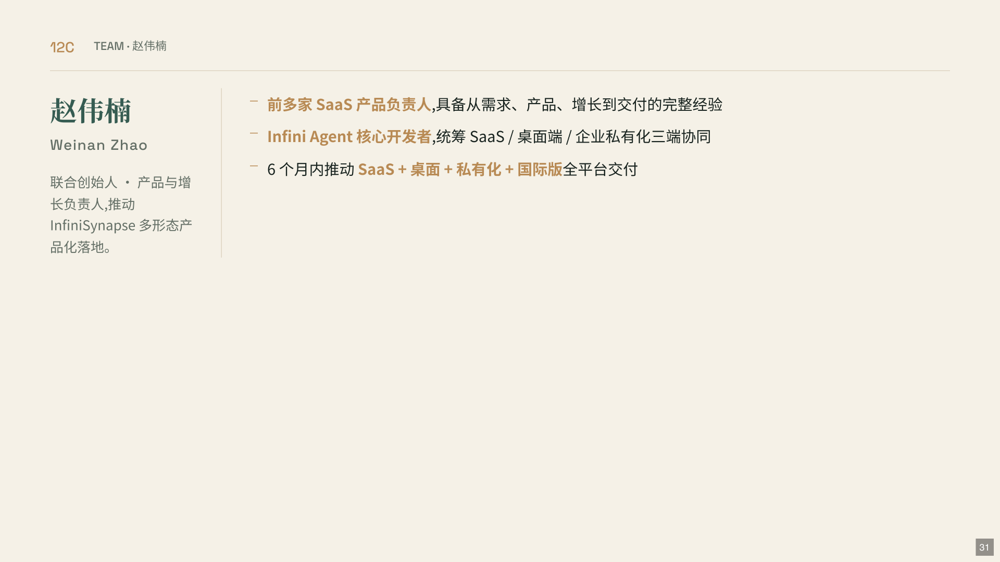


---

## 第 32 页 · 结尾

*INFINISYNAPSE*

# 让数据应用更快长出来

- **国际 SaaS 版**：[app.infinisynapse.com](http://app.infinisynapse.com/)
- **国内 SaaS 版**：[app.infinisynapse.cn](http://app.infinisynapse.cn)
- **示例 Apps 体验**：[www.infinisynapse.cn/apps](https://www.infinisynapse.cn/apps)

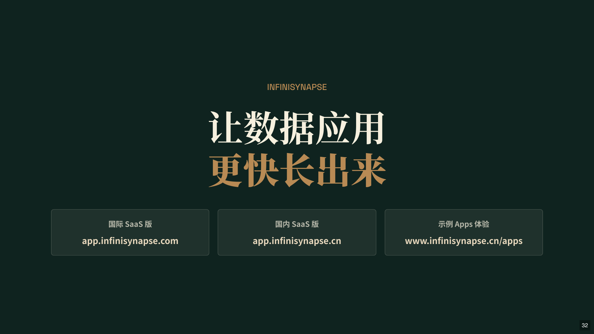


---
